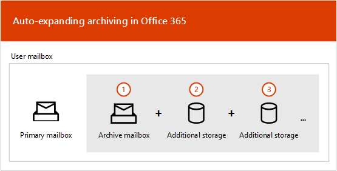

# Panoramica dell'archiviazione illimitata

In Office 365, le cassette postali di archiviazione offrono agli utenti un ulteriore spazio di archiviazione. Dopo aver abilitato la cassetta postale di archiviazione di un utente, sono disponibili fino a 100 GB di spazio di archiviazione aggiuntivo. In passato, quando è stata raggiunta la quota di archiviazione 100 GB, le organizzazioni hanno dovuto contattare Microsoft per richiedere ulteriore spazio di archiviazione per una cassetta postale di archiviazione. Questo non è più il caso.

La funzionalità di archiviazione illimitata in Microsoft 365 (chiamata *archiviazione in espansione automatica*) fornisce ulteriore spazio di archiviazione nelle cassette postali di archiviazione. Quando viene raggiunta la quota di archiviazione nella cassetta postale di archivio, Microsoft 365 aumenta automaticamente le dimensioni dell'archivio, il che significa che gli utenti non finiscono nello spazio di archiviazione delle cassette postali e gli amministratori non dovranno richiedere l'archiviazione aggiuntiva per le cassette postali di archiviazione.

Per istruzioni dettagliate per l'attivazione dell'archiviazione in espansione automatica, vedere [Enable Unlimited Archiving](enable-unlimited-archiving.md).

> [!NOTE]
> L'espansione automatica dell'archivio supporta anche le cassette postali condivise. Per abilitare l'archivio per una cassetta postale condivisa, è necessaria una licenza di Exchange Online piano 2 o una licenza di Exchange Online piano 1 con una licenza di archiviazione Exchange Online.

## Funzionamento dell'archiviazione con espansione automatica

Come spiegato in precedenza, viene creato ulteriore spazio di archiviazione delle cassette postali quando la cassetta postale di archiviazione di un utente è abilitata. Quando l'archiviazione in espansione automatica è abilitata, Microsoft 365 verifica periodicamente le dimensioni della cassetta postale di archiviazione. Quando una cassetta postale di archiviazione si avvicina al suo limite di memoria, Microsoft 365 crea automaticamente ulteriore spazio di archiviazione per l'archivio. Se l'utente si esaurisce da questo spazio di archiviazione aggiuntivo, Microsoft 365 aggiunge ulteriore spazio di archiviazione all'archivio dell'utente. Questo processo si verifica automaticamente, il che significa che gli amministratori non devono richiedere ulteriore archivio di archiviazione o gestire l'archiviazione con espansione automatica.

Ecco una breve panoramica del processo.

1. L'archiviazione è abilitata per una cassetta postale utente o una cassetta postale condivisa. Viene creata una cassetta postale di archiviazione con 100 GB di spazio di memorizzazione e la quota di avviso per la cassetta postale di archiviazione è impostata su 90 GB.

2. Un amministratore consente di abilitare l'espansione automatica dell'archiviazione per la cassetta postale. Quando la cassetta postale di archiviazione (inclusa la cartella elementi ripristinabili) raggiunge 90 GB, viene convertita in un archivio in espansione automatica e Microsoft 365 aggiunge lo spazio di archiviazione all'archivio. Possono essere necessari fino a 30 giorni per il provisioning dello spazio di archiviazione aggiuntivo.

   > [!NOTE]
   > Se una cassetta postale è bloccata o assegnata a un criterio di conservazione, la quota di archiviazione per la cassetta postale di archivio viene aumentata a 110 GB quando l'archiviazione in espansione automatica è abilitata. Analogamente, la quota di avviso per l'archiviazione viene aumentata a 100 GB.

3. Microsoft 365 aggiunge automaticamente ulteriore spazio di archiviazione, se necessario.

> [!IMPORTANT]
> L'espansione automatica dell'archivio è supportata solo per le cassette postali utilizzate per singoli utenti (o per le cassette postali condivise) con un tasso di crescita non superiore a 1 GB al giorno. Una cassetta postale di archiviazione di un utente è destinata esclusivamente a quell'utente. L'utilizzo dell'inserimento nel journal, delle regole di trasporto o delle regole di inoltro automatico per copiare i messaggi in una cassetta postale di archiviazione non è consentito. Microsoft si riserva il diritto di negare l'archiviazione illimitata nei casi in cui la cassetta postale di archiviazione di un utente viene utilizzata per archiviare i dati di archiviazione per altri utenti o in altri casi di utilizzo inappropriato.

## Cosa viene spostato nello spazio di archiviazione aggiuntivo dell'archivio?

Per utilizzare in modo efficiente l'archiviazione di un archivio automatico, è possibile che le cartelle vengano spostate. Microsoft 365 determina quali cartelle vengono spostate quando viene aggiunta un'ulteriore archiviazione all'archivio. A volte, quando viene spostata una cartella, vengono create automaticamente una o più sottocartelle e gli elementi della cartella originale vengono distribuiti a queste cartelle per semplificare il processo di spostamento. Quando si visualizza la parte di archiviazione dell'elenco delle cartelle in Outlook, queste sottocartelle vengono visualizzate nella cartella originale.  La convenzione di denominazione utilizzata da Microsoft 365 per denominare queste sottocartelle è **\<folder name\> _Yyyy (creata in mmm gg, yyyy h_mm)**, dove:

- **yyyy** è l'anno in cui sono stati ricevuti i messaggi nella cartella.

- **mmm gg, yyyy h_m** è la data e l'ora in cui la sottocartella è stata creata da Office 365, in formato UTC, in base al fuso orario e alle impostazioni internazionali dell'utente in Outlook.

Nelle schermate seguenti viene visualizzato un elenco di cartelle prima e dopo che i messaggi vengono spostati in un archivio con espansione automatica.

 **Prima dell'aggiunta dell'archiviazione aggiuntiva**

 **Dopo l'aggiunta dell'archiviazione aggiuntiva**

> [!NOTE]
> Come descritto in precedenza, Microsoft 365 Sposta gli elementi in sottocartelle (e li denomina utilizzando la convenzione di denominazione descritta in precedenza) per facilitare la distribuzione del contenuto in un archivio ausiliario. Tuttavia, lo spostamento degli elementi nelle sottocartelle potrebbe non essere sempre il caso. A volte un'intera cartella può essere spostata in un archivio ausiliario. In questo caso, la cartella manterrà il nome originale.  Non sarà evidente nell'elenco delle cartelle in Outlook che la cartella è stata spostata in un archivio ausiliario.

## Requisiti di Outlook per l'accesso agli elementi in un archivio con espansione automatica

Per accedere ai messaggi archiviati in un archivio con espansione automatica, è necessario che gli utenti utilizzino uno dei client Outlook seguenti:

- Outlook 2016 o Outlook 2019 per Windows

- Outlook sul Web

- Outlook 2016 o Outlook 2019 per Mac

Di seguito sono riportate alcune considerazioni da prendere in considerazione quando si utilizza Outlook o Outlook sul Web per accedere ai messaggi archiviati in un archivio con espansione automatica.

- È possibile accedere a qualsiasi cartella nella cassetta postale di archiviazione, incluse quelle che sono state spostate nell'area di archiviazione espansa automaticamente.

- La ricerca di archiviazione espansa automaticamente è disponibile in Outlook per il Web. Analogamente all'archivio online, è possibile cercare gli elementi che sono stati spostati in un'area di archiviazione aggiuntiva solo eseguendo una ricerca nella cartella corrente. Questo significa che è necessario selezionare la cartella di archiviazione nell'elenco delle cartelle e quindi selezionare una singola cartella come ambito di ricerca. Analogamente, se una cartella in un'area di archiviazione espansa automaticamente contiene sottocartelle, è necessario eseguire la ricerca separatamente in ogni sottocartella.
- La ricerca di archiviazione espansa automaticamente è disponibile in Outlook desktop nel canale corrente (anteprima). All'interno di questa anteprima, è disponibile l'ambito della cassetta postale corrente, che consente di cercare l'archivio espanso automaticamente. Per ulteriori informazioni su questa e altre funzionalità di supporto per la ricerca Microsoft, vedere [come Outlook per Windows connesso a Exchange Online utilizza Microsoft Search](https://techcommunity.microsoft.com/t5/outlook-global-customer-service/how-outlook-for-windows-connected-to-exchange-online-utilizes/ba-p/1715045). 

- I conteggi degli elementi in Outlook e i conteggi di lettura/non lettura (in Outlook e Outlook sul Web) in un archivio con espansione automatica potrebbero non essere accurati.

- È possibile eliminare gli elementi in una sottocartella che punta a un'area di archiviazione espansa automaticamente, ma la cartella stessa non può essere eliminata.

- Non è possibile utilizzare la funzionalità Recupera elementi eliminati per recuperare un elemento che è stato eliminato da un'area di archiviazione espansa automaticamente.

## Archiviazione in espansione automatica e altre funzionalità di conformità

In questa sezione viene illustrata la funzionalità tra l'archiviazione in espansione automatica e altre funzionalità di conformità e governance dei dati.

- **eDiscovery:** Quando si utilizza uno strumento di eDiscovery, ad esempio la ricerca di contenuto o In-Place eDiscovery, vengono ricercate anche le aree di archiviazione aggiuntive in un archivio con espansione automatica.

- **Conservazione:** Quando si inserisce una cassetta postale in attesa utilizzando strumenti come il blocco per controversia legale in Exchange Online o eDiscovery e i criteri di conservazione nel centro sicurezza e conformità, anche il contenuto di un archivio espanso automatico viene messo in attesa.

- **Gestione record di messaggistica:** Se si utilizzano i criteri di eliminazione di gestione record di messaggistica in Exchange Online per eliminare definitivamente gli elementi della cassetta postale scaduta, verranno eliminati anche gli elementi scaduti che si trovano nell'archivio automatico espanso.

- **Servizio di importazione:** È possibile utilizzare il servizio di importazione di Office 365 per importare i file PST nell'archivio automatico espanso di un utente. È possibile importare fino a 100 GB di dati da file PST nella cassetta postale di archiviazione dell'utente.

## Ulteriori informazioni

Per ulteriori informazioni tecniche sull'archiviazione in espansione automatica, vedere [Microsoft 365: auto-Expanding Archives FAQ](https://techcommunity.microsoft.com/t5/exchange-team-blog/office-365-auto-expanding-archives-faq/ba-p/607784).
