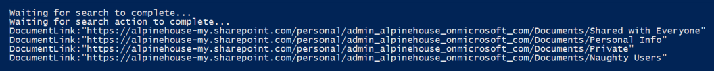

# <a name="use-content-search-for-targeted-collections"></a><span data-ttu-id="923bf-103">Usare Ricerca contenuto per le raccolte di destinazione</span><span class="sxs-lookup"><span data-stu-id="923bf-103">Use Content Search for targeted collections</span></span>

<span data-ttu-id="923bf-104">La funzionalità Ricerca contenuto nel Centro conformità Microsoft 365 non fornisce un modo diretto nell'interfaccia utente per cercare cartelle specifiche nelle cassette postali di Exchange o nei siti SharePoint e OneDrive for Business.</span><span class="sxs-lookup"><span data-stu-id="923bf-104">The Content Search feature in the Microsoft 365 compliance center doesn't provide a direct way in the UI to search specific folders in Exchange mailboxes or SharePoint and OneDrive for Business sites.</span></span> <span data-ttu-id="923bf-105">È tuttavia possibile eseguire ricerche in cartelle specifiche (denominate raccolte di *destinazione)* specificando la proprietà ID cartella per la posta elettronica o il percorso (DocumentLink) per i siti nella sintassi della query di ricerca effettiva.</span><span class="sxs-lookup"><span data-stu-id="923bf-105">However, it's possible to search specific folders (called a *targeted collection*) by specifying the folder ID property for email or path (DocumentLink) property for sites in the actual search query syntax.</span></span> <span data-ttu-id="923bf-106">L'utilizzo di Ricerca contenuto per eseguire una raccolta di destinazione è utile quando si è certi che gli elementi che rieseguono un caso o elementi con privilegi si trovino in una cassetta postale o in una cartella del sito specifica.</span><span class="sxs-lookup"><span data-stu-id="923bf-106">Using Content Search to perform a targeted collection is useful when you're confident that items responsive to a case or privileged items are located in a specific mailbox or site folder.</span></span> <span data-ttu-id="923bf-107">È possibile utilizzare lo script in questo articolo per ottenere l'ID cartella per le cartelle delle cassette postali o il percorso (DocumentLink) per le cartelle in un SharePoint e OneDrive for Business sito.</span><span class="sxs-lookup"><span data-stu-id="923bf-107">You can use the script in this article to obtain the folder ID for mailbox folders or the path (DocumentLink) for folders on a SharePoint and OneDrive for Business site.</span></span> <span data-ttu-id="923bf-108">È quindi possibile utilizzare l'ID o il percorso della cartella in una query di ricerca per restituire gli elementi che si trovano nella cartella.</span><span class="sxs-lookup"><span data-stu-id="923bf-108">Then you can use the folder ID or path in a search query to return items located in the folder.</span></span>

> [!NOTE]
> <span data-ttu-id="923bf-109">Per restituire il contenuto che si trova in una cartella in un sito SharePoint o OneDrive for Business, lo script in questo argomento utilizza la proprietà gestita DocumentLink anziché la proprietà Path.</span><span class="sxs-lookup"><span data-stu-id="923bf-109">To return content located in a folder in a SharePoint or OneDrive for Business site, the script in this topic uses the DocumentLink managed property instead of the Path property.</span></span> <span data-ttu-id="923bf-110">La proprietà DocumentLink è più affidabile della proprietà Path perché restituirà tutto il contenuto di una cartella, mentre la proprietà Path non restituirà alcuni file multimediali.</span><span class="sxs-lookup"><span data-stu-id="923bf-110">The DocumentLink property is more robust than the Path property because it will return all content in a folder, whereas the Path property won't return some media files.</span></span>

## <a name="before-you-run-a-targeted-collection"></a><span data-ttu-id="923bf-111">Prima di eseguire una raccolta di destinazione</span><span class="sxs-lookup"><span data-stu-id="923bf-111">Before you run a targeted collection</span></span>

- <span data-ttu-id="923bf-112">Per eseguire lo script nel passaggio 1, è necessario essere membri del gruppo di ruoli Responsabile eDiscovery nel Centro sicurezza & conformità.</span><span class="sxs-lookup"><span data-stu-id="923bf-112">You have to be a member of the eDiscovery Manager role group in the Security & Compliance Center to run the script in Step 1.</span></span> <span data-ttu-id="923bf-113">Per altre informazioni, vedere [Assegnare autorizzazioni di eDiscovery](assign-ediscovery-permissions.md).</span><span class="sxs-lookup"><span data-stu-id="923bf-113">For more information, see [Assign eDiscovery permissions](assign-ediscovery-permissions.md).</span></span>

    <span data-ttu-id="923bf-114">Inoltre, è necessario disporre del ruolo Destinatari di posta nell'Exchange Online organizzazione.</span><span class="sxs-lookup"><span data-stu-id="923bf-114">Additionally, you have to be assigned the Mail Recipients role in your Exchange Online organization.</span></span> <span data-ttu-id="923bf-115">Questa operazione è necessaria per eseguire il cmdlet **Get-MailboxFolderStatistics,** incluso nello script.</span><span class="sxs-lookup"><span data-stu-id="923bf-115">This is required to run the **Get-MailboxFolderStatistics** cmdlet, which is included in the script.</span></span> <span data-ttu-id="923bf-116">Per impostazione predefinita, il ruolo Destinatari di posta viene assegnato ai gruppi di ruoli Gestione organizzazione e Gestione destinatari in Exchange Online.</span><span class="sxs-lookup"><span data-stu-id="923bf-116">By default, the Mail Recipients role is assigned to the Organization Management and Recipient Management role groups in Exchange Online.</span></span> <span data-ttu-id="923bf-117">Per ulteriori informazioni sull'assegnazione delle autorizzazioni in Exchange Online, vedere [Manage role group members](/exchange/manage-role-group-members-exchange-2013-help).</span><span class="sxs-lookup"><span data-stu-id="923bf-117">For more information about assigning permissions in Exchange Online, see [Manage role group members](/exchange/manage-role-group-members-exchange-2013-help).</span></span> <span data-ttu-id="923bf-118">È inoltre possibile creare un gruppo di ruoli personalizzato, assegnare il ruolo Destinatari di posta e quindi aggiungere i membri che devono eseguire lo script nel passaggio 1.</span><span class="sxs-lookup"><span data-stu-id="923bf-118">You could also create a custom role group, assign the Mail Recipients role to it, and then add the members who need to run the script in Step 1.</span></span> <span data-ttu-id="923bf-119">Per ulteriori informazioni, vedere [Gestire gruppi di ruoli](/Exchange/permissions-exo/role-groups).</span><span class="sxs-lookup"><span data-stu-id="923bf-119">For more information, see [Manage role groups](/Exchange/permissions-exo/role-groups).</span></span>

- <span data-ttu-id="923bf-120">Lo script in questo articolo supporta l'autenticazione moderna.</span><span class="sxs-lookup"><span data-stu-id="923bf-120">The script in this article supports modern authentication.</span></span> <span data-ttu-id="923bf-121">È possibile utilizzare lo script così come è se si è un'Microsoft 365 o un'Microsoft 365 GCC organizzazione.</span><span class="sxs-lookup"><span data-stu-id="923bf-121">You can use the script as-is if you are a Microsoft 365 or a Microsoft 365 GCC organization.</span></span> <span data-ttu-id="923bf-122">Se si è un'organizzazione di Office 365 Germany, un'organizzazione di Microsoft 365 GCC High o un'organizzazione DoD di Microsoft 365, sarà necessario modificare lo script per eseguirlo correttamente.</span><span class="sxs-lookup"><span data-stu-id="923bf-122">If you are an Office 365 Germany organization, a Microsoft 365 GCC High organization, or a Microsoft 365 DoD organization, you will have to edit the script to successfully run it.</span></span> <span data-ttu-id="923bf-123">In particolare, è necessario modificare la riga e utilizzare il `Connect-ExchangeOnline` *parametro ExchangeEnvironmentName* (e il valore appropriato per il tipo di organizzazione) per connettersi a Exchange Online PowerShell.</span><span class="sxs-lookup"><span data-stu-id="923bf-123">Specifically, you have to edit the line `Connect-ExchangeOnline` and use the *ExchangeEnvironmentName* parameter (and the appropriate value for your organization type) to connect to Exchange Online PowerShell.</span></span>  <span data-ttu-id="923bf-124">È inoltre necessario modificare la riga e utilizzare i parametri `Connect-IPPSSession` *ConnectionUri* e *AzureADAuthorizationEndpointUri* (e i valori appropriati per il tipo di organizzazione) per connettersi a PowerShell del Centro sicurezza & conformità.</span><span class="sxs-lookup"><span data-stu-id="923bf-124">Also, you have to edit the line `Connect-IPPSSession` and use the *ConnectionUri* and *AzureADAuthorizationEndpointUri* parameters (and the appropriate values for your organization type) to connect to Security & Compliance Center PowerShell.</span></span> <span data-ttu-id="923bf-125">Per ulteriori informazioni, vedere gli esempi in [Connessione a Exchange Online PowerShell](/powershell/exchange/connect-to-exchange-online-powershell#connect-to-exchange-online-powershell-without-using-mfa) e Connessione sicurezza & [Centro conformità PowerShell.](/powershell/exchange/connect-to-scc-powershell#connect-to-security--compliance-center-powershell-without-using-mfa)</span><span class="sxs-lookup"><span data-stu-id="923bf-125">For more information, see the examples in [Connect to Exchange Online PowerShell](/powershell/exchange/connect-to-exchange-online-powershell#connect-to-exchange-online-powershell-without-using-mfa) and [Connect to Security & Compliance Center PowerShell](/powershell/exchange/connect-to-scc-powershell#connect-to-security--compliance-center-powershell-without-using-mfa).</span></span>

- <span data-ttu-id="923bf-126">Ogni volta che si esegue lo script, viene creata una nuova sessione remota di PowerShell.</span><span class="sxs-lookup"><span data-stu-id="923bf-126">Each time you run the script, a new remote PowerShell session is created.</span></span> <span data-ttu-id="923bf-127">Ciò significa che è possibile utilizzare tutte le sessioni remote di PowerShell disponibili.</span><span class="sxs-lookup"><span data-stu-id="923bf-127">That means you can use up all the remote PowerShell sessions available to you.</span></span> <span data-ttu-id="923bf-128">Per evitare che ciò accada, eseguire il comando seguente per disconnettere le sessioni remote di PowerShell attive.</span><span class="sxs-lookup"><span data-stu-id="923bf-128">To prevent this from happening, run the following command to disconnect your active remote PowerShell sessions.</span></span>

  ```powershell
  Get-PSSession | Remove-PSSession
  ```

    <span data-ttu-id="923bf-129">Per ulteriori informazioni, vedere [Connessione a Exchange Online PowerShell](/powershell/exchange/connect-to-exchange-online-powershell).</span><span class="sxs-lookup"><span data-stu-id="923bf-129">For more information, see [Connect to Exchange Online PowerShell](/powershell/exchange/connect-to-exchange-online-powershell).</span></span>

- <span data-ttu-id="923bf-130">Lo script include una gestione minima degli errori.</span><span class="sxs-lookup"><span data-stu-id="923bf-130">The script includes minimal error handling.</span></span> <span data-ttu-id="923bf-131">Lo scopo principale dello script è visualizzare rapidamente un elenco di ID cartella delle cassette postali o percorsi di sito che possono essere utilizzati nella sintassi delle query di ricerca di una ricerca contenuto per eseguire una raccolta di destinazione.</span><span class="sxs-lookup"><span data-stu-id="923bf-131">The primary purpose of the script is to quickly display a list of mailbox folder IDs or site paths that can be used in the search query syntax of a Content Search to perform a targeted collection.</span></span>

- <span data-ttu-id="923bf-132">Lo script di esempio fornito in questo argomento non è supportato in alcun servizio o programma di supporto standard Microsoft.</span><span class="sxs-lookup"><span data-stu-id="923bf-132">The sample script provided in this topic isn't supported under any Microsoft standard support program or service.</span></span> <span data-ttu-id="923bf-133">Lo script di esempio è fornito così come è senza alcun tipo di garanzia.</span><span class="sxs-lookup"><span data-stu-id="923bf-133">The sample script is provided AS IS without warranty of any kind.</span></span> <span data-ttu-id="923bf-134">Microsoft esclude inoltre qualsiasi garanzia implicita, tra cui, senza limitazioni, tutte le garanzie implicite di commerciabilità o idoneità per uno scopo specifico.</span><span class="sxs-lookup"><span data-stu-id="923bf-134">Microsoft further disclaims all implied warranties including, without limitation, any implied warranties of merchantability or of fitness for a particular purpose.</span></span> <span data-ttu-id="923bf-135">L'utente assume tutti i rischi associati all'uso o alle prestazioni dello script di esempio e della documentazione.</span><span class="sxs-lookup"><span data-stu-id="923bf-135">The entire risk arising out of the use or performance of the sample script and documentation remains with you.</span></span> <span data-ttu-id="923bf-136">In nessun caso Microsoft, i suoi autori o chiunque altro coinvolto nella creazione, produzione o consegna degli script è da ritenersi responsabile per qualsiasi danno eventuale (inclusi, senza limitazione alcuna, danni riguardanti profitti aziendali, interruzione di attività, perdita di informazioni aziendali o altra perdita pecuniaria) derivanti dall'utilizzo o dall'incapacità di utilizzo degli script di esempio e della documentazione, anche nel caso in cui Microsoft sia stata avvisata della possibilità di tali danni.</span><span class="sxs-lookup"><span data-stu-id="923bf-136">In no event shall Microsoft, its authors, or anyone else involved in the creation, production, or delivery of the scripts be liable for any damages whatsoever (including, without limitation, damages for loss of business profits, business interruption, loss of business information, or other pecuniary loss) arising out of the use of or inability to use the sample scripts or documentation, even if Microsoft has been advised of the possibility of such damages.</span></span>

## <a name="step-1-run-the-script-to-get-a-list-of-folders-for-a-mailbox-or-site"></a><span data-ttu-id="923bf-137">Passaggio 1: eseguire lo script per ottenere un elenco di cartelle per una cassetta postale o un sito</span><span class="sxs-lookup"><span data-stu-id="923bf-137">Step 1: Run the script to get a list of folders for a mailbox or site</span></span>

<span data-ttu-id="923bf-138">Lo script eseguito in questo primo passaggio restituirà un elenco di cartelle delle cassette postali o SharePoint e OneDrive for Business e l'ID o il percorso della cartella corrispondente per ogni cartella.</span><span class="sxs-lookup"><span data-stu-id="923bf-138">The script that you run in this first step will return a list of mailbox folders or SharePoint and OneDrive for Business folders, and the corresponding folder ID or path for each folder.</span></span> <span data-ttu-id="923bf-139">Quando si esegue questo script, verranno richieste le informazioni seguenti.</span><span class="sxs-lookup"><span data-stu-id="923bf-139">When you run this script, it will prompt you for the following information.</span></span>

- <span data-ttu-id="923bf-140">**Indirizzo di posta elettronica o URL** sito: digitare un indirizzo di posta elettronica del responsabile per restituire un elenco Exchange cartelle e ID cartella della cassetta postale.</span><span class="sxs-lookup"><span data-stu-id="923bf-140">**Email address or site URL**: Type an email address of the custodian to return a list of Exchange mailbox folders and folder IDs.</span></span> <span data-ttu-id="923bf-141">Oppure digitare l'URL di un SharePoint o di un OneDrive for Business per restituire un elenco di percorsi per il sito specificato.</span><span class="sxs-lookup"><span data-stu-id="923bf-141">Or type the URL for a SharePoint site or a OneDrive for Business site to return a list of paths for the specified site.</span></span> <span data-ttu-id="923bf-142">Di seguito vengono descritti alcuni esempi:</span><span class="sxs-lookup"><span data-stu-id="923bf-142">Here are some examples:</span></span>

  - <span data-ttu-id="923bf-143">**Exchange**: stacig@contoso.onmicrosoft.com <spam> <spam></span><span class="sxs-lookup"><span data-stu-id="923bf-143">**Exchange**: stacig@contoso.onmicrosoft<spam><spam>.com</span></span>

  - <span data-ttu-id="923bf-144">**SharePoint**: https <span>:// contoso.sharepoint.com/sites/marketing</span></span><span class="sxs-lookup"><span data-stu-id="923bf-144">**SharePoint**: https<span>://</span>contoso.sharepoint.com/sites/marketing</span></span>

  - <span data-ttu-id="923bf-145">**OneDrive for Business**: https <span>://</span>contoso-my.sharepoint.com/personal/stacig_contoso_onmicrosoft_com</span><span class="sxs-lookup"><span data-stu-id="923bf-145">**OneDrive for Business**: https<span>://</span>contoso-my.sharepoint.com/personal/stacig_contoso_onmicrosoft_com</span></span>

- <span data-ttu-id="923bf-146">**Credenziali utente:** lo script utilizzerà le credenziali per connettersi a Exchange Online PowerShell o a PowerShell & Compliance Center usando l'autenticazione moderna.</span><span class="sxs-lookup"><span data-stu-id="923bf-146">**Your user credentials**: The script will use your credentials to connect to Exchange Online PowerShell or Security & Compliance Center PowerShell using modern authentication.</span></span> <span data-ttu-id="923bf-147">Come spiegato in precedenza, è necessario disporre delle autorizzazioni appropriate per eseguire correttamente questo script.</span><span class="sxs-lookup"><span data-stu-id="923bf-147">As previously explained, you have to be assigned the appropriate permissions to successfully run this script.</span></span>

<span data-ttu-id="923bf-148">Per visualizzare un elenco delle cartelle delle cassette postali o dei nomi site documentlink (percorso):</span><span class="sxs-lookup"><span data-stu-id="923bf-148">To display a list of mailbox folders or site documentlink (path) names:</span></span>

1. <span data-ttu-id="923bf-149">Salvare il testo seguente in un file Windows PowerShell script utilizzando un suffisso di nome file .ps1; ad `GetFolderSearchParameters.ps1` esempio.</span><span class="sxs-lookup"><span data-stu-id="923bf-149">Save the following text to a Windows PowerShell script file by using a filename suffix of .ps1; for example, `GetFolderSearchParameters.ps1`.</span></span>

   ```powershell
   #########################################################################################################
   # This PowerShell script will prompt you for:                                #
   #    * Admin credentials for a user who can run the Get-MailboxFolderStatistics cmdlet in Exchange    #
   #      Online and who is an eDiscovery Manager in the Security & Compliance Center.            #
   # The script will then:                                            #
   #    * If an email address is supplied: list the folders for the target mailbox.            #
   #    * If a SharePoint or OneDrive for Business site is supplied: list the documentlinks (folder paths) #
   #    * for the site.                                                                                    #
   #    * In both cases, the script supplies the correct search properties (folderid: or documentlink:)    #
   #      appended to the folder ID or documentlink to use in a Content Search.                #
   # Notes:                                                #
   #    * For SharePoint and OneDrive for Business, the paths are searched recursively; this means the     #
   #      the current folder and all sub-folders are searched.                        #
   #    * For Exchange, only the specified folder will be searched; this means sub-folders in the folder    #
   #      will not be searched.  To search sub-folders, you need to use the specify the folder ID for    #
   #      each sub-folder that you want to search.                                #
   #    * For Exchange, only folders in the user's primary mailbox will be returned by the script.        #
   #########################################################################################################
   # Collect the target email address or SharePoint Url
   $addressOrSite = Read-Host "Enter an email address or a URL for a SharePoint or OneDrive for Business site"
   # Authenticate with Exchange Online and the Security & Compliance Center (Exchange Online Protection - EOP)
   if ($addressOrSite.IndexOf("@") -ige 0)
   {
      # List the folder Ids for the target mailbox
      $emailAddress = $addressOrSite
      # Connect to Exchange Online PowerShell
      if (!$ExoSession)
      {
          Import-Module ExchangeOnlineManagement
          Connect-ExchangeOnline
      }
      $folderQueries = @()
      $folderStatistics = Get-MailboxFolderStatistics $emailAddress
      foreach ($folderStatistic in $folderStatistics)
      {
          $folderId = $folderStatistic.FolderId;
          $folderPath = $folderStatistic.FolderPath;
          $encoding= [System.Text.Encoding]::GetEncoding("us-ascii")
          $nibbler= $encoding.GetBytes("0123456789ABCDEF");
          $folderIdBytes = [Convert]::FromBase64String($folderId);
          $indexIdBytes = New-Object byte[] 48;
          $indexIdIdx=0;
          $folderIdBytes | select -skip 23 -First 24 | %{$indexIdBytes[$indexIdIdx++]=$nibbler[$_ -shr 4];$indexIdBytes[$indexIdIdx++]=$nibbler[$_ -band 0xF]}
          $folderQuery = "folderid:$($encoding.GetString($indexIdBytes))";
          $folderStat = New-Object PSObject
          Add-Member -InputObject $folderStat -MemberType NoteProperty -Name FolderPath -Value $folderPath
          Add-Member -InputObject $folderStat -MemberType NoteProperty -Name FolderQuery -Value $folderQuery
          $folderQueries += $folderStat
      }
      Write-Host "-----Exchange Folders-----"
      $folderQueries |ft
   }
   elseif ($addressOrSite.IndexOf("http") -ige 0)
   {
      $searchName = "SPFoldersSearch"
      $searchActionName = "SPFoldersSearch_Preview"
      # List the folders for the SharePoint or OneDrive for Business Site
      $siteUrl = $addressOrSite
      # Connect to Security & Compliance Center PowerShell
      if (!$SccSession)
      {
          Import-Module ExchangeOnlineManagement
          Connect-IPPSSession
      }
      # Clean-up, if the script was aborted, the search we created might not have been deleted.  Try to do so now.
      Remove-ComplianceSearch $searchName -Confirm:$false -ErrorAction 'SilentlyContinue'
      # Create a Content Search against the SharePoint Site or OneDrive for Business site and only search for folders; wait for the search to complete
      $complianceSearch = New-ComplianceSearch -Name $searchName -ContentMatchQuery "contenttype:folder" -SharePointLocation $siteUrl
      Start-ComplianceSearch $searchName
      do{
          Write-host "Waiting for search to complete..."
          Start-Sleep -s 5
          $complianceSearch = Get-ComplianceSearch $searchName
      }while ($complianceSearch.Status -ne 'Completed')
      if ($complianceSearch.Items -gt 0)
      {
          # Create a Compliance Search Action and wait for it to complete. The folders will be listed in the .Results parameter
          $complianceSearchAction = New-ComplianceSearchAction -SearchName $searchName -Preview
          do
          {
              Write-host "Waiting for search action to complete..."
              Start-Sleep -s 5
              $complianceSearchAction = Get-ComplianceSearchAction $searchActionName
          }while ($complianceSearchAction.Status -ne 'Completed')
          # Get the results and print out the folders
          $results = $complianceSearchAction.Results
          $matches = Select-String "Data Link:.+[,}]" -Input $results -AllMatches
          foreach ($match in $matches.Matches)
          {
              $rawUrl = $match.Value
              $rawUrl = $rawUrl -replace "Data Link: " -replace "," -replace "}"
              Write-Host "DocumentLink:""$rawUrl"""
          }
      }
      else
      {
          Write-Host "No folders were found for $siteUrl"
      }
      Remove-ComplianceSearch $searchName -Confirm:$false -ErrorAction 'SilentlyContinue'
   }
   else
   {
      Write-Error "Couldn't recognize $addressOrSite as an email address or a site URL"
   }
   ```

2. <span data-ttu-id="923bf-150">Nel computer locale, aprire Windows PowerShell e passare alla cartella in cui è stato salvato lo script.</span><span class="sxs-lookup"><span data-stu-id="923bf-150">On your local computer, open Windows PowerShell and go to the folder where you saved the script.</span></span>

3. <span data-ttu-id="923bf-151">Eseguire lo script; Per esempio:</span><span class="sxs-lookup"><span data-stu-id="923bf-151">Run the script; for example:</span></span>

   ```powershell
   .\GetFolderSearchParameters.ps1
   ```

4. <span data-ttu-id="923bf-152">Immettere le informazioni richieste per lo script.</span><span class="sxs-lookup"><span data-stu-id="923bf-152">Enter the information that the script prompts you for.</span></span>

    <span data-ttu-id="923bf-153">Lo script visualizza un elenco delle cartelle delle cassette postali o delle cartelle del sito per l'utente specificato.</span><span class="sxs-lookup"><span data-stu-id="923bf-153">The script displays a list of mailbox folders or site folders for the specified user.</span></span> <span data-ttu-id="923bf-154">Lasciare aperta questa finestra in modo che sia possibile copiare un ID cartella o un nome documentlink e incollarlo in una query di ricerca nel passaggio 2.</span><span class="sxs-lookup"><span data-stu-id="923bf-154">Leave this window open so that you can copy a folder ID or documentlink name and paste it in to a search query in Step 2.</span></span>

    > [!TIP]
    > <span data-ttu-id="923bf-155">Invece di visualizzare un elenco di cartelle sullo schermo del computer, puoi ri-indirizzare l'output dello script in un file di testo.</span><span class="sxs-lookup"><span data-stu-id="923bf-155">Instead of displaying a list of folders on the computer screen, you can re-direct the output of the script to a text file.</span></span> <span data-ttu-id="923bf-156">Questo file verrà salvato nella cartella in cui si trova lo script.</span><span class="sxs-lookup"><span data-stu-id="923bf-156">This file will be saved to the folder where the script is located.</span></span> <span data-ttu-id="923bf-157">Ad esempio, per reindirizzare l'output dello script a un file di testo, eseguire il comando seguente nel passaggio 3: Quindi è possibile copiare un ID cartella o un documentlink dal file da utilizzare in una  `.\GetFolderSearchParameters.ps1 > StacigFolderIds.txt` query di ricerca.</span><span class="sxs-lookup"><span data-stu-id="923bf-157">For example, to redirect the script output to a text file, run the following command in Step 3:  `.\GetFolderSearchParameters.ps1 > StacigFolderIds.txt` Then you can copy a folder ID or documentlink from the file to use in a search query.</span></span>

### <a name="script-output-for-mailbox-folders"></a><span data-ttu-id="923bf-158">Output dello script per le cartelle delle cassette postali</span><span class="sxs-lookup"><span data-stu-id="923bf-158">Script output for mailbox folders</span></span>

<span data-ttu-id="923bf-159">Se si ottengono gli ID delle cartelle delle cassette postali, lo script si connette Exchange Online PowerShell, esegue il cmdlet **Get-MailboxFolderStatisics** e quindi visualizza l'elenco delle cartelle dalla cassetta postale specificata.</span><span class="sxs-lookup"><span data-stu-id="923bf-159">If you're getting mailbox folder IDs, the script connects to Exchange Online PowerShell, runs the **Get-MailboxFolderStatisics** cmdlet, and then displays the list of the folders from the specified mailbox.</span></span> <span data-ttu-id="923bf-160">Per ogni cartella nella cassetta postale, lo script visualizza il nome della cartella nella colonna **FolderPath** e l'ID della cartella nella **colonna FolderQuery.**</span><span class="sxs-lookup"><span data-stu-id="923bf-160">For every folder in the mailbox, the script displays the name of the folder in the **FolderPath** column and the folder ID in the **FolderQuery** column.</span></span> <span data-ttu-id="923bf-161">Inoltre, lo script aggiunge il prefisso **di folderId** (che è il nome della proprietà della cassetta postale) all'ID cartella.</span><span class="sxs-lookup"><span data-stu-id="923bf-161">Additionally, the script adds the prefix of **folderId** (which is the name of the mailbox property) to the folder ID.</span></span> <span data-ttu-id="923bf-162">Poiché la **proprietà folderid** è una proprietà ricercabile, verrà utilizzata in una query di ricerca nel  `folderid:<folderid>` passaggio 2 per cercare tale cartella.</span><span class="sxs-lookup"><span data-stu-id="923bf-162">Because the **folderid** property is a searchable property, you'll use  `folderid:<folderid>` in a search query in Step 2 to search that folder.</span></span> <span data-ttu-id="923bf-163">Lo script visualizza un massimo di 100 cartelle delle cassette postali.</span><span class="sxs-lookup"><span data-stu-id="923bf-163">The script displays a maximum of 100 mailbox folders.</span></span>

> [!IMPORTANT]
> <span data-ttu-id="923bf-164">Lo script in questo articolo include la logica di codifica che converte i valori id cartella a 64 caratteri restituiti da **Get-MailboxFolderStatistics** nello stesso formato di 48 caratteri indicizzato per la ricerca.</span><span class="sxs-lookup"><span data-stu-id="923bf-164">The script in this article includes encoding logic that converts the 64-character folder Id values that are returned by **Get-MailboxFolderStatistics** to the same 48-character format that is indexed for search.</span></span> <span data-ttu-id="923bf-165">Se si esegue semplicemente il cmdlet **Get-MailboxFolderStatistics** in PowerShell per ottenere un ID cartella (anziché eseguire lo script in questo articolo), una query di ricerca che utilizza tale valore id cartella avrà esito negativo.</span><span class="sxs-lookup"><span data-stu-id="923bf-165">If you just run the **Get-MailboxFolderStatistics** cmdlet in PowerShell to obtain a folder Id (instead of running the script in this article), a search query that uses that folder Id value will fail.</span></span> <span data-ttu-id="923bf-166">È necessario eseguire lo script per ottenere gli ID di cartella formattati correttamente che possono essere utilizzati in una ricerca contenuto.</span><span class="sxs-lookup"><span data-stu-id="923bf-166">You have to run the script to get the correctly-formatted folder Ids that can be used in a Content Search.</span></span>

<span data-ttu-id="923bf-167">Ecco un esempio dell'output restituito dallo script per le cartelle delle cassette postali.</span><span class="sxs-lookup"><span data-stu-id="923bf-167">Here's an example of the output returned by the script for mailbox folders.</span></span>


<span data-ttu-id="923bf-169">Nell'esempio del passaggio 2 viene illustrata la query utilizzata per cercare la sottocartella Ripuliture nella cartella Elementi ripristinabili dell'utente.</span><span class="sxs-lookup"><span data-stu-id="923bf-169">The example in Step 2 shows the query used to search the Purges subfolder in the user's Recoverable Items folder.</span></span>

### <a name="script-output-for-site-folders"></a><span data-ttu-id="923bf-170">Output dello script per le cartelle del sito</span><span class="sxs-lookup"><span data-stu-id="923bf-170">Script output for site folders</span></span>

<span data-ttu-id="923bf-171">Se si riceve il percorso della proprietà **documentlink** da siti di SharePoint o OneDrive for Business, lo script si connette a PowerShell sicurezza & conformità, crea una nuova ricerca contenuto che cerca le cartelle nel sito e quindi visualizza un elenco delle cartelle che si trovano nel sito specificato.</span><span class="sxs-lookup"><span data-stu-id="923bf-171">If you're getting the path of the **documentlink** property from SharePoint or OneDrive for Business sites, the script connects to Security & Compliance PowerShell, creates a new Content Search that searches the site for folders, and then displays a list of the folders located in the specified site.</span></span> <span data-ttu-id="923bf-172">Lo script visualizza il nome di ogni cartella e aggiunge il prefisso **di documentlink** all'URL della cartella.</span><span class="sxs-lookup"><span data-stu-id="923bf-172">The script displays the name of each folder and adds the prefix of **documentlink** to the folder URL.</span></span> <span data-ttu-id="923bf-173">Poiché la **proprietà documentlink** è una proprietà ricercabile, si utilizzerà la coppia property:value in una query di ricerca nel passaggio 2 per cercare `documentlink:<path>` tale cartella.</span><span class="sxs-lookup"><span data-stu-id="923bf-173">Because the **documentlink** property is a searchable property, you'll use `documentlink:<path>` property:value pair in a search query in Step 2 to search that folder.</span></span> <span data-ttu-id="923bf-174">Lo script visualizza un massimo di 200 cartelle del sito.</span><span class="sxs-lookup"><span data-stu-id="923bf-174">The script displays a maximum of 200 site folders.</span></span> <span data-ttu-id="923bf-175">Se sono presenti più di 200 cartelle del sito, vengono visualizzate quelle più recenti.</span><span class="sxs-lookup"><span data-stu-id="923bf-175">If there are more than 200 site folders, the newest ones are displayed.</span></span>

<span data-ttu-id="923bf-176">Ecco un esempio dell'output restituito dallo script per le cartelle del sito.</span><span class="sxs-lookup"><span data-stu-id="923bf-176">Here's an example of the output returned by the script for site folders.</span></span>



## <a name="step-2-use-a-folder-id-or-documentlink-to-perform-a-targeted-collection"></a><span data-ttu-id="923bf-178">Passaggio 2: Usare un ID cartella o un documentlink per eseguire una raccolta di destinazione</span><span class="sxs-lookup"><span data-stu-id="923bf-178">Step 2: Use a folder ID or documentlink to perform a targeted collection</span></span>

<span data-ttu-id="923bf-179">Dopo aver eseguito lo script per raccogliere un elenco di ID cartella o collegamenti a documenti per un utente specifico, il passaggio successivo per passare al Centro conformità di Microsoft 365 e creare una nuova ricerca contenuto per eseguire ricerche in una cartella specifica.</span><span class="sxs-lookup"><span data-stu-id="923bf-179">After you've run the script to collect a list of folder IDs or document links for a specific user, the next step to go to the Microsoft 365 compliance center and create a new Content Search to search a specific folder.</span></span> <span data-ttu-id="923bf-180">Verrà utilizzata la coppia o property:value nella query di ricerca configurata nella casella parola chiave Ricerca contenuto (o come valore del parametro ContentMatchQuery se si utilizza il `folderid:<folderid>` `documentlink:<path>` cmdlet **New-ComplianceSearch).** </span><span class="sxs-lookup"><span data-stu-id="923bf-180">You'll use the  `folderid:<folderid>` or  `documentlink:<path>` property:value pair in the search query that you configure in the Content Search keyword box (or as the value for the  *ContentMatchQuery*  parameter if you use the **New-ComplianceSearch** cmdlet).</span></span> <span data-ttu-id="923bf-181">È possibile combinare la  `folderid` proprietà o con altri parametri di ricerca o condizioni di  `documentlink` ricerca.</span><span class="sxs-lookup"><span data-stu-id="923bf-181">You can combine the  `folderid` or  `documentlink` property with other search parameters or search conditions.</span></span> <span data-ttu-id="923bf-182">Se si include solo la proprietà o nella query, la ricerca restituirà tutti gli  `folderid` elementi che si trovano nella cartella  `documentlink` specificata.</span><span class="sxs-lookup"><span data-stu-id="923bf-182">If you only include the  `folderid` or  `documentlink` property in the query, the search will return all items located in the specified folder.</span></span>

1. <span data-ttu-id="923bf-183">Passare a e accedere utilizzando l'account e le credenziali utilizzati per <https://compliance.microsoft.com> eseguire lo script nel passaggio 1.</span><span class="sxs-lookup"><span data-stu-id="923bf-183">Go to <https://compliance.microsoft.com> and sign in using the account and credentials that you used to run the script in Step 1.</span></span>

2. <span data-ttu-id="923bf-184">Nel riquadro sinistro del Centro conformità fare clic su **Mostra** tutto  >  **ricerca contenuto** e quindi su Nuova **ricerca.**</span><span class="sxs-lookup"><span data-stu-id="923bf-184">In the left pane of the compliance center, click **Show all** > **Content search**, and then click **New search**.</span></span>

3. <span data-ttu-id="923bf-185">Nella casella **Parole** chiave incollare il `folderid:<folderid>` valore o  `documentlink:<path>` restituito dallo script nel passaggio 1.</span><span class="sxs-lookup"><span data-stu-id="923bf-185">In the **Keywords** box, paste the `folderid:<folderid>` or  `documentlink:<path>` value that was returned by the script in Step 1.</span></span>

    <span data-ttu-id="923bf-186">Ad esempio, la query nello screenshot seguente cerca qualsiasi elemento nella sottocartella Ripuliture nella cartella Elementi ripristinabili dell'utente (il valore della proprietà per la sottocartella Ripuliture è mostrato nello screenshot nel `folderid` passaggio 1):</span><span class="sxs-lookup"><span data-stu-id="923bf-186">For example, the query in the following screenshot will search for any item in the Purges subfolder in the user's Recoverable Items folder (the value of the `folderid` property for the Purges subfolder is shown in the screenshot in Step 1):</span></span>

    

4. <span data-ttu-id="923bf-188">In **Percorsi** selezionare **Percorsi specifici e** quindi fare clic su **Modifica.**</span><span class="sxs-lookup"><span data-stu-id="923bf-188">Under **Locations**, select **Specific locations** and then click **Modify**.</span></span>

5. <span data-ttu-id="923bf-189">Eseguire una delle operazioni seguenti, a seconda che si cerchi una cartella della cassetta postale o una cartella del sito:</span><span class="sxs-lookup"><span data-stu-id="923bf-189">Do one of the following, based on whether you're searching a mailbox folder or a site folder:</span></span>

    - <span data-ttu-id="923bf-190">Accanto a **Exchange** posta elettronica fare clic su Scegli **utenti,** gruppi o team e quindi aggiungere la stessa cassetta postale specificata durante l'esecuzione dello script nel passaggio 1.</span><span class="sxs-lookup"><span data-stu-id="923bf-190">Next to **Exchange email**, click **Choose users, groups, or teams** and then add the same mailbox that you specified when you ran the script in Step 1.</span></span>

      <span data-ttu-id="923bf-191">Oppure</span><span class="sxs-lookup"><span data-stu-id="923bf-191">Or</span></span>

    - <span data-ttu-id="923bf-192">Accanto a **SharePoint** siti fare clic **su** Scegli siti e quindi aggiungere lo stesso URL di sito specificato durante l'esecuzione dello script nel passaggio 1.</span><span class="sxs-lookup"><span data-stu-id="923bf-192">Next to **SharePoint sites**, click **Choose sites** and then add the same site URL that you specified when you ran the script in Step 1.</span></span>

6. <span data-ttu-id="923bf-193">Dopo aver salvato il percorso di contenuto in cui eseguire la ricerca, fare clic su Salva & **esecuzione,** digitare un nome per la ricerca contenuto e quindi fare clic **su** Salva per avviare la ricerca di raccolta di destinazione.</span><span class="sxs-lookup"><span data-stu-id="923bf-193">After you save the content location to search, click **Save & run**, type a name for the Content Search, and then click **Save** to start the targeted collection search.</span></span>

### <a name="examples-of-search-queries-for-targeted-collections"></a><span data-ttu-id="923bf-194">Esempi di query di ricerca per raccolte di destinazione</span><span class="sxs-lookup"><span data-stu-id="923bf-194">Examples of search queries for targeted collections</span></span>

<span data-ttu-id="923bf-195">Ecco alcuni esempi di utilizzo delle proprietà  `folderid` e in una query di ricerca per eseguire una raccolta di  `documentlink` destinazione.</span><span class="sxs-lookup"><span data-stu-id="923bf-195">Here are some examples of using the  `folderid` and  `documentlink` properties in a search query to perform a targeted collection.</span></span> <span data-ttu-id="923bf-196">I segnaposto vengono utilizzati  `folderid:<folderid>` per e per risparmiare  `documentlink:<path>` spazio.</span><span class="sxs-lookup"><span data-stu-id="923bf-196">Placeholders are used for  `folderid:<folderid>` and  `documentlink:<path>` to save space.</span></span>

- <span data-ttu-id="923bf-197">In questo esempio viene eseguita una ricerca in tre diverse cartelle delle cassette postali.</span><span class="sxs-lookup"><span data-stu-id="923bf-197">This example searches three different mailbox folders.</span></span> <span data-ttu-id="923bf-198">È possibile utilizzare una sintassi di query simile per cercare le cartelle nascoste nella cartella Elementi ripristinabili di un utente.</span><span class="sxs-lookup"><span data-stu-id="923bf-198">You could use similar query syntax to search the hidden folders in a user's Recoverable Items folder.</span></span>

  ```powershell
  folderid:<folderid> OR folderid:<folderid> OR folderid:<folderid>
  ```

- <span data-ttu-id="923bf-199">In questo esempio viene eseguita una ricerca di elementi che contengono una frase esatta in una cartella delle cassette postali.</span><span class="sxs-lookup"><span data-stu-id="923bf-199">This example searches a mailbox folder for items that contain an exact phrase.</span></span>

  ```powershell
  folderid:<folderid> AND "Contoso financial results"
  ```

- <span data-ttu-id="923bf-200">In questo esempio viene eseguita una ricerca in una cartella del sito (ed eventuali sottocartelle) di documenti contenenti le lettere "NDA" nel titolo.</span><span class="sxs-lookup"><span data-stu-id="923bf-200">This example searches a site folder (and any subfolders) for documents that contain the letters "NDA" in the title.</span></span>

  ```powershell
  documentlink:<path> AND filename:nda
  ```

- <span data-ttu-id="923bf-201">In questo esempio viene eseguita una ricerca in una cartella del sito (e in qualsiasi sottocartella) dei documenti che sono stati modificati in un intervallo di date.</span><span class="sxs-lookup"><span data-stu-id="923bf-201">This example searches a site folder (and any subfolder) for documents there were changed within a date range.</span></span>

  ```powershell
  documentlink:<path> AND (lastmodifiedtime>=01/01/2017 AND lastmodifiedtime<=01/21/2017)
  ```

## <a name="more-information"></a><span data-ttu-id="923bf-202">Altre informazioni</span><span class="sxs-lookup"><span data-stu-id="923bf-202">More information</span></span>

<span data-ttu-id="923bf-203">Quando si usa lo script in questo articolo per eseguire raccolte di destinazione, tenere presente quanto segue.</span><span class="sxs-lookup"><span data-stu-id="923bf-203">Keep the following things in mind when using the script in this article to perform targeted collections.</span></span>

- <span data-ttu-id="923bf-204">Lo script non rimuove alcuna cartella dai risultati.</span><span class="sxs-lookup"><span data-stu-id="923bf-204">The script doesn't remove any folders from the results.</span></span> <span data-ttu-id="923bf-205">Alcune cartelle elencate nei risultati potrebbero pertanto non essere ricercabili (o restituire zero elementi) perché contengono contenuto generato dal sistema o perché contengono solo sottocartelle e non elementi delle cassette postali.</span><span class="sxs-lookup"><span data-stu-id="923bf-205">So some folders listed in the results might be unsearchable (or return zero items) because they contain system-generated content or because they only contain subfolders and not mailbox items.</span></span>

- <span data-ttu-id="923bf-206">Questo script restituisce solo le informazioni sulla cartella per la cassetta postale principale dell'utente.</span><span class="sxs-lookup"><span data-stu-id="923bf-206">This script only returns folder information for the user's primary mailbox.</span></span> <span data-ttu-id="923bf-207">Non restituisce informazioni sulle cartelle nella cassetta postale di archiviazione dell'utente.</span><span class="sxs-lookup"><span data-stu-id="923bf-207">It doesn't return information about folders in the user's archive mailbox.</span></span> <span data-ttu-id="923bf-208">Per restituire informazioni sulle cartelle nella cassetta postale di archiviazione dell'utente, è possibile modificare lo script.</span><span class="sxs-lookup"><span data-stu-id="923bf-208">To return information about folders in the user's archive mailbox, you can edit the script.</span></span> <span data-ttu-id="923bf-209">A tale scopo, modificare la riga `$folderStatistics = Get-MailboxFolderStatistics $emailAddress` in e quindi salvare ed eseguire lo script `$folderStatistics = Get-MailboxFolderStatistics $emailAddress -Archive` modificato.</span><span class="sxs-lookup"><span data-stu-id="923bf-209">To do this, change the line `$folderStatistics = Get-MailboxFolderStatistics $emailAddress` to `$folderStatistics = Get-MailboxFolderStatistics $emailAddress -Archive` and then save and run the edited script.</span></span> <span data-ttu-id="923bf-210">Questa modifica restituirà gli ID cartella per cartelle e sottocartelle nella cassetta postale di archiviazione dell'utente.</span><span class="sxs-lookup"><span data-stu-id="923bf-210">This change will return the folder IDs for folders and subfolders in the user's archive mailbox.</span></span> <span data-ttu-id="923bf-211">Per eseguire ricerche nell'intera cassetta postale di archiviazione, è possibile connettere tutte le coppie id cartella proprietà:valore a `OR` un operatore in una query di ricerca.</span><span class="sxs-lookup"><span data-stu-id="923bf-211">To search the entire archive mailbox, you can connect all folder ID property:value pairs with an `OR` operator in a search query.</span></span>

- <span data-ttu-id="923bf-212">Durante la ricerca nelle cartelle delle cassette postali, verrà eseguita la ricerca solo nella cartella specificata (identificata dalla relativa proprietà). Le sottocartelle non `folderid` verranno cercate.</span><span class="sxs-lookup"><span data-stu-id="923bf-212">When searching mailbox folders, only the specified folder (identified by its `folderid` property) will be searched; subfolders won't be searched.</span></span> <span data-ttu-id="923bf-213">Per cercare le sottocartelle, è necessario utilizzare l'ID cartella per la sottocartella in cui si desidera eseguire la ricerca.</span><span class="sxs-lookup"><span data-stu-id="923bf-213">To search subfolders, you need to use the  folder ID for the subfolder that you want to search.</span></span>

- <span data-ttu-id="923bf-214">Durante la ricerca nelle cartelle del sito, verrà eseguita la ricerca nella cartella (identificata dalla relativa proprietà) e in tutte le `documentlink` sottocartelle.</span><span class="sxs-lookup"><span data-stu-id="923bf-214">When searching site folders, the folder (identified by its `documentlink` property) and all subfolders will be searched.</span></span>

- <span data-ttu-id="923bf-215">Quando si esportano i risultati di una ricerca in cui è stata specificata solo la proprietà nella query di ricerca, è possibile scegliere la prima opzione di esportazione, "Tutti gli elementi, esclusi quelli con formato non riconosciuto, sono crittografati o non sono stati indicizzati per altri `folderid` motivi".</span><span class="sxs-lookup"><span data-stu-id="923bf-215">When exporting the results of a search in which you only specified the `folderid` property in the search query, you can choose the first export option, "All items, excluding ones that have an unrecognized format, are encrypted, or weren't indexed for other reasons."</span></span> <span data-ttu-id="923bf-216">Tutti gli elementi nella cartella verranno sempre esportati indipendentemente dal relativo stato di indicizzazione perché l'ID cartella è sempre indicizzato.</span><span class="sxs-lookup"><span data-stu-id="923bf-216">All items in the folder will always be exported regardless of their indexing status because the folder ID is always indexed.</span></span>
