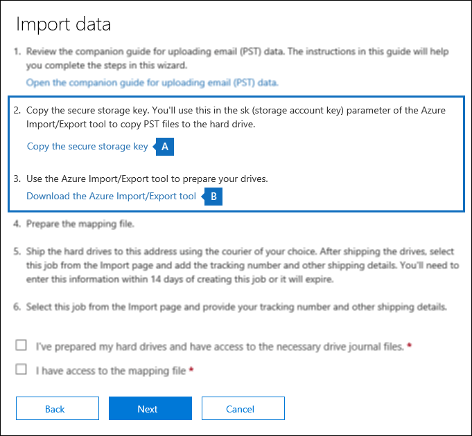

# <a name="use-drive-shipping-to-import-your-organizations-pst-files"></a><span data-ttu-id="09b9b-103">Utilizzare la distribuzione delle unità per importare i file PST dell'organizzazione</span><span class="sxs-lookup"><span data-stu-id="09b9b-103">Use drive shipping to import your organization's PST files</span></span>

<span data-ttu-id="09b9b-104">**Questo articolo è per gli amministratori. Si sta tentando di importare i file PST nella propria cassetta postale? Vedere [importare messaggi di posta elettronica, contatti e calendario da un file PST di Outlook](https://go.microsoft.com/fwlink/p/?LinkID=785075)**</span><span class="sxs-lookup"><span data-stu-id="09b9b-104">**This article is for administrators. Are you trying to import PST files to your own mailbox? See [Import email, contacts, and calendar from an Outlook .pst file](https://go.microsoft.com/fwlink/p/?LinkID=785075)**</span></span>
   
<span data-ttu-id="09b9b-105">Utilizzare il servizio di importazione di Office 365 e l'unità di spedizione per importare in blocco i file PST nelle cassette postali degli utenti.</span><span class="sxs-lookup"><span data-stu-id="09b9b-105">Use the Office 365 Import service and drive shipping to bulk-import PST files to user mailboxes.</span></span> <span data-ttu-id="09b9b-106">Per spedizione delle unità si intende la copia dei file PST su un'unità disco rigido e l'invio fisico dell'unità a Microsoft.</span><span class="sxs-lookup"><span data-stu-id="09b9b-106">Drive shipping means that you copy the PST files to a hard disk drive and then physically ship the drive to Microsoft.</span></span> <span data-ttu-id="09b9b-107">Quando Microsoft riceve il disco rigido, il personale del Data Center copia i dati dall'unità disco rigido in un'area di archiviazione nel cloud Microsoft.</span><span class="sxs-lookup"><span data-stu-id="09b9b-107">When Microsoft receives your hard drive, data center personnel copies the data from the hard drive to a storage area in the Microsoft cloud.</span></span> <span data-ttu-id="09b9b-108">Successivamente, si ha la possibilità di tagliare i dati PST che vengono importati nelle cassette postali di destinazione impostando filtri che controllano quali dati vengono importati.</span><span class="sxs-lookup"><span data-stu-id="09b9b-108">Then you have the opportunity to trim the PST data that's imported to the target mailboxes by setting filters that control what data gets imported.</span></span> <span data-ttu-id="09b9b-109">Dopo aver avviato il processo di importazione, il servizio di importazione importa i dati PST dall'area di archiviazione alle cassette postali degli utenti.</span><span class="sxs-lookup"><span data-stu-id="09b9b-109">After you start the import job, the Import service imports the PST data from the storage area to user mailboxes.</span></span> <span data-ttu-id="09b9b-110">L'utilizzo della distribuzione delle unità per importare i file PST nelle cassette postali degli utenti è un modo per eseguire la migrazione della posta elettronica dell'organizzazione a Office 365.</span><span class="sxs-lookup"><span data-stu-id="09b9b-110">Using drive shipping to import PST files to user mailboxes is one way to migrate your organization's email to Office 365.</span></span>
  
<span data-ttu-id="09b9b-111">Di seguito sono riportati i passaggi necessari per utilizzare la spedizione delle unità per importare i file PST nelle cassette postali di Microsoft 365:</span><span class="sxs-lookup"><span data-stu-id="09b9b-111">Here are the steps required to use drive shipping to import PST files to Microsoft 365 mailboxes:</span></span>
  
[<span data-ttu-id="09b9b-112">Passaggio 1: scaricare la chiave di archiviazione sicura e lo strumento di importazione PST</span><span class="sxs-lookup"><span data-stu-id="09b9b-112">Step 1: Download the secure storage key and PST Import tool</span></span>](#step-1-download-the-secure-storage-key-and-pst-import-tool)

[<span data-ttu-id="09b9b-113">Passaggio 2: copiare i file PST nell'unità disco rigido</span><span class="sxs-lookup"><span data-stu-id="09b9b-113">Step 2: Copy the PST files to the hard drive</span></span>](#step-2-copy-the-pst-files-to-the-hard-drive)

[<span data-ttu-id="09b9b-114">Passaggio 3: creare il file di mapping di importazione PST</span><span class="sxs-lookup"><span data-stu-id="09b9b-114">Step 3: Create the PST Import mapping file</span></span>](#step-3-create-the-pst-import-mapping-file)

[<span data-ttu-id="09b9b-115">Passaggio 4: creare un processo di Importazione PST in Office 365</span><span class="sxs-lookup"><span data-stu-id="09b9b-115">Step 4: Create a PST Import job in Office 365</span></span>](#step-4-create-a-pst-import-job-in-office-365)

[<span data-ttu-id="09b9b-116">Passaggio 5: inviare l'unità disco rigido a Microsoft</span><span class="sxs-lookup"><span data-stu-id="09b9b-116">Step 5: Ship the hard drive to Microsoft</span></span>](#step-5-ship-the-hard-drive-to-microsoft)

[<span data-ttu-id="09b9b-117">Passaggio 6: Filtrare i dati e avviare il processo di importazione PST</span><span class="sxs-lookup"><span data-stu-id="09b9b-117">Step 6: Filter data and start the PST Import job</span></span>](#step-6-filter-data-and-start-the-pst-import-job)
  
> [!IMPORTANT]
> <span data-ttu-id="09b9b-118">È necessario eseguire il passaggio 1 una volta per caricare la chiave di archiviazione sicura e lo strumento di importazione.</span><span class="sxs-lookup"><span data-stu-id="09b9b-118">You have to perform Step 1 once to down load the secure storage key and the import tool.</span></span> <span data-ttu-id="09b9b-119">Dopo aver eseguito questa procedura, eseguire il passaggio 2 del passaggio 6 ogni volta che si desidera inviare un'unità disco rigido a Microsoft.</span><span class="sxs-lookup"><span data-stu-id="09b9b-119">After you perform these steps, follow Step 2 through Step 6 each time you want to ship a hard drive to Microsoft.</span></span> 
  
<span data-ttu-id="09b9b-120">Per le domande frequenti sull'utilizzo della spedizione delle unità per importare i file PST in Office 365, vedere le domande [frequenti su come utilizzare la spedizione delle unità per importare i file PST](faqimporting-pst-files-to-office-365.md#using-drive-shipping-to-import-pst-files).</span><span class="sxs-lookup"><span data-stu-id="09b9b-120">For frequently asked questions about using drive shipping to import PST files to Office 365, see [FAQs for using drive shipping to import PST files](faqimporting-pst-files-to-office-365.md#using-drive-shipping-to-import-pst-files).</span></span> 
  
## <a name="before-you-import-pst-files"></a><span data-ttu-id="09b9b-121">Prima di importare i file PST</span><span class="sxs-lookup"><span data-stu-id="09b9b-121">Before you import PST files</span></span>

- <span data-ttu-id="09b9b-122">Per importare file PST nelle cassette postali di Microsoft 365, è necessario avere il ruolo di importazione/esportazione di cassette postali in Exchange Online.</span><span class="sxs-lookup"><span data-stu-id="09b9b-122">You have to be assigned the Mailbox Import Export role in Exchange Online to import PST files to Microsoft 365 mailboxes.</span></span> <span data-ttu-id="09b9b-123">Per impostazione predefinita, questo ruolo non è assegnato ad alcun gruppo di ruoli in Exchange Online.</span><span class="sxs-lookup"><span data-stu-id="09b9b-123">By default, this role isn't assigned to any role group in Exchange Online.</span></span> <span data-ttu-id="09b9b-124">È possibile aggiungere il ruolo di importazione/esportazione di cassette postali al gruppo di ruoli Gestione organizzazione.</span><span class="sxs-lookup"><span data-stu-id="09b9b-124">You can add the Mailbox Import Export role to the Organization Management role group.</span></span> <span data-ttu-id="09b9b-125">In alternativa, è possibile creare un gruppo di ruoli, assegnare il ruolo di importazione/esportazione di cassette postali e quindi aggiungere se stessi come membri.</span><span class="sxs-lookup"><span data-stu-id="09b9b-125">Or you can create a role group, assign the Mailbox Import Export role, and then add yourself as a member.</span></span> <span data-ttu-id="09b9b-126">Per altre informazioni, vedere le sezioni "Aggiungere un ruolo a un gruppo di ruoli" o "Creare un gruppo di ruoli" in [Gestire gruppi di ruoli](https://go.microsoft.com/fwlink/p/?LinkId=730688).</span><span class="sxs-lookup"><span data-stu-id="09b9b-126">For more information, see the "Add a role to a role group" or the "Create a role group" sections in [Manage role groups](https://go.microsoft.com/fwlink/p/?LinkId=730688).</span></span>
    
    <span data-ttu-id="09b9b-127">Inoltre, per creare processi di importazione nel Centro sicurezza e conformità, una delle seguenti condizioni deve essere vera:</span><span class="sxs-lookup"><span data-stu-id="09b9b-127">Additionally, to create import jobs in the Security & Compliance Center, one of the following must be true:</span></span>
    
  - <span data-ttu-id="09b9b-128">All'utente deve essere assegnato il ruolo Destinatari di posta in Exchange Online.</span><span class="sxs-lookup"><span data-stu-id="09b9b-128">You have to be assigned the Mail Recipients role in Exchange Online.</span></span> <span data-ttu-id="09b9b-129">Per impostazione predefinita, questo ruolo viene assegnato ai gruppi di ruoli Gestione organizzazione e Gestione destinatari.</span><span class="sxs-lookup"><span data-stu-id="09b9b-129">By default, this role is assigned to the Organization Management and Recipient Management roles groups.</span></span>
    
    <span data-ttu-id="09b9b-130">Oppure</span><span class="sxs-lookup"><span data-stu-id="09b9b-130">Or</span></span>
    
  - <span data-ttu-id="09b9b-131">È necessario essere un amministratore globale nell'organizzazione.</span><span class="sxs-lookup"><span data-stu-id="09b9b-131">You have to be a global administrator in your organization.</span></span>
    
    > [!TIP]
    > <span data-ttu-id="09b9b-132">Prendere in considerazione la creazione di un nuovo gruppo di ruoli in Exchange Online appositamente creato per l'importazione dei file PST in Office 365.</span><span class="sxs-lookup"><span data-stu-id="09b9b-132">Consider creating a new role group in Exchange Online that's specifically intended for importing PST files to Office 365.</span></span> <span data-ttu-id="09b9b-133">Per il livello minimo di privilegi necessari per importare i file PST, assegnare i ruoli di importazione/esportazione di cassette postali e Destinatari di posta al nuovo gruppo di ruoli, quindi aggiungere i membri.</span><span class="sxs-lookup"><span data-stu-id="09b9b-133">For the minimum level of privileges required to import PST files, assign the Mailbox Import Export and Mail Recipients roles to the new role group, and then add members.</span></span> 
  
- <span data-ttu-id="09b9b-134">È necessario archiviare i file PST che si desidera copiare in un'unità disco rigido su un file server o in una cartella condivisa dell'organizzazione.</span><span class="sxs-lookup"><span data-stu-id="09b9b-134">You need to store the PST files that you want to copy to a hard drive on a file server or shared folder in your organization.</span></span> <span data-ttu-id="09b9b-135">Nel passaggio 2 è possibile eseguire lo strumento di esportazione di importazione di Azure (WAImportExport.exe) che copia i file PST archiviati in questo file server o nella cartella condivisa sul disco rigido.</span><span class="sxs-lookup"><span data-stu-id="09b9b-135">In Step 2, you run the Azure Import Export tool (WAImportExport.exe) that copies the PST files that are stored on this file server or shared folder to the hard drive.</span></span>

- <span data-ttu-id="09b9b-136">I file PST di grandi dimensioni possono influire sulle prestazioni del processo di importazione PST.</span><span class="sxs-lookup"><span data-stu-id="09b9b-136">Large PST files may impact the performance of the PST import process.</span></span> <span data-ttu-id="09b9b-137">Pertanto, è consigliabile che ogni file PST copiato nel disco rigido del passaggio 2 non sia superiore a 20 GB.</span><span class="sxs-lookup"><span data-stu-id="09b9b-137">So we recommend that each PST file you copy to the hard drive in Step 2 should be no larger than 20 GB.</span></span>
    
- <span data-ttu-id="09b9b-138">Per l'utilizzo con il servizio di importazione di Office 365, sono supportate solo unità SSD da 2,5 pollici a stato solido o da 2,5 pollici o da 3,5 pollici SATA II/III.</span><span class="sxs-lookup"><span data-stu-id="09b9b-138">Only 2.5-inch solid-state drives (SSDs) or 2.5-inch or 3.5-inch SATA II/III internal hard drives are supported for use with the Office 365 Import service.</span></span> <span data-ttu-id="09b9b-139">È possibile utilizzare unità disco rigido fino a 10 TB.</span><span class="sxs-lookup"><span data-stu-id="09b9b-139">You can use hard drives up to 10 TB.</span></span> <span data-ttu-id="09b9b-140">Per i processi di importazione, verrà elaborato solo il primo volume di dati del disco rigido.</span><span class="sxs-lookup"><span data-stu-id="09b9b-140">For import jobs, only the first data volume on the hard drive will be processed.</span></span> <span data-ttu-id="09b9b-141">Il volume di dati deve essere in formato NTFS.</span><span class="sxs-lookup"><span data-stu-id="09b9b-141">The data volume must be formatted with NTFS.</span></span> <span data-ttu-id="09b9b-142">Quando si copiano i dati su un disco rigido, è possibile collegarlo direttamente usando un connettore SATA II/III da 2,5 pollici o da 2,5 o 3,5 pollici oppure è possibile collegarlo esternamente usando un adattatore USB SATA II/III da 2,5 pollici o da 2,5 pollici o da 3,5 pollici.</span><span class="sxs-lookup"><span data-stu-id="09b9b-142">When copying data to a hard drive, you can attach it directly using a 2.5-inch SSD or 2.5-inch or 3.5-inch SATA II/III connector or you can attach it externally using an external 2.5-inch SSD or 2.5-inch or 3.5-inch SATA II/III USB adaptor.</span></span>
    
    > [!IMPORTANT]
    > <span data-ttu-id="09b9b-143">I dischi rigidi esterni che vengono installati con un adattatore USB incorporato non sono supportati dal servizio Importa di Office 365.</span><span class="sxs-lookup"><span data-stu-id="09b9b-143">External hard drives that come with an built-in USB adaptor aren't supported by the Office 365 Import service.</span></span> <span data-ttu-id="09b9b-144">Inoltre, il disco all'interno della scocca di un disco rigido esterno non può essere utilizzato.</span><span class="sxs-lookup"><span data-stu-id="09b9b-144">Additionally, the disk inside the casing of an external hard drive can't be used.</span></span> <span data-ttu-id="09b9b-145">Non spedire unità disco rigido esterne.</span><span class="sxs-lookup"><span data-stu-id="09b9b-145">Please don't ship external hard drives.</span></span> 
  
- <span data-ttu-id="09b9b-146">L'unità disco rigido in cui vengono copiati i file PST deve essere prima crittografata con BitLocker.</span><span class="sxs-lookup"><span data-stu-id="09b9b-146">The hard drive that you copy the PST files to must be encrypted with BitLocker.</span></span> <span data-ttu-id="09b9b-147">Lo strumento WAImportExport.exe eseguito nel passaggio 2 consente di configurare BitLocker.</span><span class="sxs-lookup"><span data-stu-id="09b9b-147">The WAImportExport.exe tool that you run in Step 2 will help you set up BitLocker.</span></span> <span data-ttu-id="09b9b-148">Genera anche una chiave di crittografia BitLocker che il personale del Data Center di Microsoft utilizza per accedere all'unità per caricare i file PST nell'area di archiviazione di Azure nel cloud Microsoft.</span><span class="sxs-lookup"><span data-stu-id="09b9b-148">It also generates a BitLocker encryption key that Microsoft data center personnel use to access the drive to upload the PST files to the Azure Storage area in the Microsoft cloud.</span></span>
    
- <span data-ttu-id="09b9b-149">La spedizione delle unità è disponibile tramite un contratto Microsoft Enterprise (EA).</span><span class="sxs-lookup"><span data-stu-id="09b9b-149">Drive shipping is available through a Microsoft Enterprise Agreement (EA).</span></span> <span data-ttu-id="09b9b-150">La spedizione unità non è disponibile con un contratto Microsoft Products and Services Agreement (MPSA).</span><span class="sxs-lookup"><span data-stu-id="09b9b-150">Drive shipping isn't available through a Microsoft Products and Services Agreement (MPSA).</span></span>
    
- <span data-ttu-id="09b9b-151">Il costo per importare i file PST nelle cassette postali di Microsoft 365 utilizzando la spedizione di unità è $2 USD per GB di dati.</span><span class="sxs-lookup"><span data-stu-id="09b9b-151">The cost to import PST files to Microsoft 365 mailboxes using drive shipping is $2 USD per GB of data.</span></span> <span data-ttu-id="09b9b-152">Se ad esempio si spedisce un'unità disco rigido contenente 1000 GB (1 TB) di file PST, il costo sarà 2000 dollari USA.</span><span class="sxs-lookup"><span data-stu-id="09b9b-152">For example, if you ship a hard drive that contains 1,000 GB (1 TB) of PST files, the cost is $2,000 USD.</span></span> <span data-ttu-id="09b9b-153">È possibile collaborare con un partner per il pagamento delle spese di importazione.</span><span class="sxs-lookup"><span data-stu-id="09b9b-153">You can work with a partner to pay the import fee.</span></span> <span data-ttu-id="09b9b-154">Per informazioni su come trovare un partner, vedere [Trovare un partner o rivenditore di Microsoft](https://go.microsoft.com/fwlink/p/?LinkId=785197).</span><span class="sxs-lookup"><span data-stu-id="09b9b-154">For information about finding a partner, see [Find your Microsoft partner or reseller](https://go.microsoft.com/fwlink/p/?LinkId=785197).</span></span>
    
- <span data-ttu-id="09b9b-155">L'utente o la relativa organizzazione deve disporre di un account FedEx o DHL. </span><span class="sxs-lookup"><span data-stu-id="09b9b-155">You or your organization must have an account with FedEx or DHL.</span></span>
    
  - <span data-ttu-id="09b9b-156">Le organizzazioni degli Stati Uniti, del Brasile e dell'Europa devono disporre di account FedEx.</span><span class="sxs-lookup"><span data-stu-id="09b9b-156">Organizations in the United States, Brazil, and Europe must have FedEx accounts.</span></span>
    
  - <span data-ttu-id="09b9b-157">Le organizzazioni dell'Asia orientale, del sud-est asiatico, del Giappone, della Repubblica di Corea e dell'Australia devono disporre di account DHL.</span><span class="sxs-lookup"><span data-stu-id="09b9b-157">Organizations in East Asia, Southeast Asia, Japan, Republic of Korea, and Australia must have DHL accounts.</span></span>
    
    <span data-ttu-id="09b9b-158">Microsoft utilizza (e addebita) questo account per riportare il disco rigido all'utente.</span><span class="sxs-lookup"><span data-stu-id="09b9b-158">Microsoft uses (and charges) this account to return the hard drive back to you.</span></span>
    
- <span data-ttu-id="09b9b-159">Il disco rigido che si sta inviando a Microsoft può attraversare i confini internazionali.</span><span class="sxs-lookup"><span data-stu-id="09b9b-159">The hard drive that you ship to Microsoft may cross international borders.</span></span> <span data-ttu-id="09b9b-160">In questo caso, l'utente è responsabile della verifica che l'unità disco rigido e i dati in esso contenuti siano importati e/o esportati in conformità con le leggi vigenti.</span><span class="sxs-lookup"><span data-stu-id="09b9b-160">In this case, you're responsible for ensuring that the hard drive and the data it contains are imported and/or exported in accordance with the applicable laws.</span></span> <span data-ttu-id="09b9b-161">Prima dell'invio di un'unità disco rigido, verificare con i propri consulenti che sia legalmente possibile inviare l'unità e i dati al data center Microsoft identificato.</span><span class="sxs-lookup"><span data-stu-id="09b9b-161">Before shipping a hard drive, check with your advisors to verify that your drive and data can legally be shipped to the identified Microsoft data center.</span></span> <span data-ttu-id="09b9b-162">Questo aiuta a garantire che raggiunga Microsoft in modo tempestivo.</span><span class="sxs-lookup"><span data-stu-id="09b9b-162">This helps to ensure that it reaches Microsoft in a timely manner.</span></span>
    
- <span data-ttu-id="09b9b-163">Questa procedura comporta la copia e il salvataggio di una chiave di archiviazione protetta e di una chiave di crittografia BitLocker.</span><span class="sxs-lookup"><span data-stu-id="09b9b-163">This procedure involves copying and saving a secure storage key and a BitLocker encryption key.</span></span> <span data-ttu-id="09b9b-164">Adottare le dovute precauzioni per proteggere tali chiavi nello stesso modo in cui vengono protette password o altre informazioni di sicurezza.</span><span class="sxs-lookup"><span data-stu-id="09b9b-164">Be sure to take precautions to protect these keys like you would protect passwords or other security-related information.</span></span> <span data-ttu-id="09b9b-165">Ad esempio, potrebbe essere necessario salvarle in un documento di Microsoft Word protetto da password oppure su un'unità USB crittografata.</span><span class="sxs-lookup"><span data-stu-id="09b9b-165">For example, you might save them to a password-protected Microsoft Word document or save them to an encrypted USB drive.</span></span> <span data-ttu-id="09b9b-166">Per un esempio di queste chiavi, vedere la sezione [ulteriori informazioni](#more-information) .</span><span class="sxs-lookup"><span data-stu-id="09b9b-166">See the [More information](#more-information) section for an example of these keys.</span></span> 
    
- <span data-ttu-id="09b9b-167">Dopo aver importato i file PST in una cassetta postale di Microsoft 365, l'impostazione di conservazione per la cassetta postale è attivata per una durata indefinita.</span><span class="sxs-lookup"><span data-stu-id="09b9b-167">After PST files are imported to a Microsoft 365 mailbox, the retention hold setting for the mailbox is turned on for an indefinite duration.</span></span> <span data-ttu-id="09b9b-168">Questo significa che i criteri di conservazione assegnati alla cassetta postale non vengono elaborati finché non si disattiva il blocco della conservazione o non si imposta una data per disattivare il blocco.</span><span class="sxs-lookup"><span data-stu-id="09b9b-168">This means that the retention policy assigned to the mailbox won't be processed until you turn off the retention hold or set a date to turn off the hold.</span></span> <span data-ttu-id="09b9b-169">Qual è il motivo di questa impostazione?</span><span class="sxs-lookup"><span data-stu-id="09b9b-169">Why do we do this?</span></span> <span data-ttu-id="09b9b-170">Se i messaggi importati in una cassetta postale sono vecchi, potrebbero essere eliminati in modo definitivo perché il loro periodo di conservazione è scaduto in base alle impostazioni di conservazione configurate per la cassetta postale.</span><span class="sxs-lookup"><span data-stu-id="09b9b-170">If messages imported to a mailbox are old, they might be permanently deleted (purged) because their retention period has expired based on the retention settings configured for the mailbox.</span></span> <span data-ttu-id="09b9b-171">L'impostazione di un blocco della conservazione sulla cassetta postale darà al suo proprietario il tempo di gestire questi messaggi appena importati o all'amministratore il tempo di cambiare le impostazioni di conservazione per la cassetta postale.</span><span class="sxs-lookup"><span data-stu-id="09b9b-171">Placing the mailbox on retention hold gives the mailbox owner time to manage these newly imported messages or give you time to change the retention settings for the mailbox.</span></span> <span data-ttu-id="09b9b-172">Vedere la sezione [ulteriori informazioni](#more-information) per suggerimenti sulla gestione del blocco di conservazione.</span><span class="sxs-lookup"><span data-stu-id="09b9b-172">See the [More information](#more-information) section for suggestions about managing the retention hold.</span></span> 
    
- <span data-ttu-id="09b9b-173">Per impostazione predefinita, 35 MB è la dimensione massima dei messaggi che possono essere ricevuti da una cassetta postale di Microsoft 365,</span><span class="sxs-lookup"><span data-stu-id="09b9b-173">By default, the maximum message size that can be received by a Microsoft 365 mailbox is 35 MB.</span></span> <span data-ttu-id="09b9b-174">perché il valore predefinito della proprietà *MaxReceiveSize* per una cassetta postale è impostato su 35 MB.</span><span class="sxs-lookup"><span data-stu-id="09b9b-174">That's because the default value for the  *MaxReceiveSize*  property for a mailbox is set to 35 MB.</span></span> <span data-ttu-id="09b9b-175">Tuttavia, la dimensione massima dei messaggi in arrivo in Microsoft 365 è pari a 150 MB.</span><span class="sxs-lookup"><span data-stu-id="09b9b-175">However, the limit for the maximum message receive size in Microsoft 365 is 150 MB.</span></span> <span data-ttu-id="09b9b-176">Quindi, se si importa un file PST che contiene un elemento di dimensioni maggiori ai 35 MB, il servizio di importazione di Office 365 modificherà automaticamente il valore della proprietà *MaxReceiveSize* nella cassetta postale di destinazione in 150 MB.</span><span class="sxs-lookup"><span data-stu-id="09b9b-176">So if you import a PST file that contains an item larger than 35 MB, the Office 365 Import service we will automatically change the value of the  *MaxReceiveSize*  property on the target mailbox to 150 MB.</span></span> <span data-ttu-id="09b9b-177">Questo consente di importare messaggi di dimensione fino a 150 MB nelle cassette postali degli utenti.</span><span class="sxs-lookup"><span data-stu-id="09b9b-177">This allows messages up to 150 MB to be imported to user mailboxes.</span></span> 
    
    > [!TIP]
    > <span data-ttu-id="09b9b-178">Per identificare la dimensione di ricezione dei messaggi per una cassetta postale, è possibile eseguire il comando `Get-Mailbox <user mailbox> | FL MaxReceiveSize` in Exchange Online PowerShell.</span><span class="sxs-lookup"><span data-stu-id="09b9b-178">To identify the message receive size for a mailbox, you can run this command in Exchange Online PowerShell:  `Get-Mailbox <user mailbox> | FL MaxReceiveSize`.</span></span> 
  
- <span data-ttu-id="09b9b-179">È possibile importare i file PST in una cassetta postale inattiva di Office 365.</span><span class="sxs-lookup"><span data-stu-id="09b9b-179">You can import PST files to an inactive mailbox in Office 365.</span></span> <span data-ttu-id="09b9b-180">A questo scopo, specificare il GUID della cassetta postale inattiva nel parametro `Mailbox` del file di mapping di importazione PST.</span><span class="sxs-lookup"><span data-stu-id="09b9b-180">You do this by specifying the GUID of the inactive mailbox in the  `Mailbox` parameter in the PST Import mapping file.</span></span> <span data-ttu-id="09b9b-181">Per ulteriori informazioni, vedere [passaggio 3: creare il file di mapping di importazione PST](#step-3-create-the-pst-import-mapping-file) .</span><span class="sxs-lookup"><span data-stu-id="09b9b-181">See [Step 3: Create the PST Import mapping file](#step-3-create-the-pst-import-mapping-file) for more information.</span></span> 
    
- <span data-ttu-id="09b9b-182">In una distribuzione ibrida di Exchange è possibile importare i file PST in una cassetta postale di archiviazione basata sul cloud per un utente la cui cassetta postale principale si trova in locale.</span><span class="sxs-lookup"><span data-stu-id="09b9b-182">In an Exchange hybrid deployment, you can import PST files to a cloud-based archive mailbox for a user whose primary mailbox is on-premises.</span></span> <span data-ttu-id="09b9b-183">A questo scopo, procedere come segue nel file di mapping di importazione PST:</span><span class="sxs-lookup"><span data-stu-id="09b9b-183">You do this by doing the following in the PST Import mapping file:</span></span>
    
  - <span data-ttu-id="09b9b-184">Specificare l'indirizzo di posta elettronica della cassetta postale locale dell'utente nel parametro `Mailbox`.</span><span class="sxs-lookup"><span data-stu-id="09b9b-184">Specify the email address for the user's on-premises mailbox in the  `Mailbox` parameter.</span></span> 
    
  - <span data-ttu-id="09b9b-185">Specificare il valore **TRUE** nel parametro `IsArchive`.</span><span class="sxs-lookup"><span data-stu-id="09b9b-185">Specify the **TRUE** value in the  `IsArchive` parameter.</span></span> 
    
    <span data-ttu-id="09b9b-186">Per ulteriori informazioni, vedere [passaggio 3: creare il file di mapping di importazione PST](#step-3-create-the-pst-import-mapping-file) .</span><span class="sxs-lookup"><span data-stu-id="09b9b-186">See [Step 3: Create the PST Import mapping file](#step-3-create-the-pst-import-mapping-file) for more information.</span></span> 

## <a name="step-1-download-the-secure-storage-key-and-pst-import-tool"></a><span data-ttu-id="09b9b-187">Passaggio 1: scaricare la chiave di archiviazione sicura e lo strumento di importazione PST</span><span class="sxs-lookup"><span data-stu-id="09b9b-187">Step 1: Download the secure storage key and PST Import tool</span></span>

<span data-ttu-id="09b9b-188">Il primo passaggio consiste nel scaricare la chiave di archiviazione sicura e lo strumento utilizzato nel passaggio 2 per copiare i file PST nell'unità disco rigido.</span><span class="sxs-lookup"><span data-stu-id="09b9b-188">The first step is to download the secure storage key and the tool and that you use in Step 2 to copy PST files to the hard drive.</span></span>
  
> [!IMPORTANT]
> <span data-ttu-id="09b9b-189">È necessario utilizzare Azure Import/Export Tool versione 1 (WAimportExportV1) per importare correttamente i file PST utilizzando il metodo di spedizione dell'unità.</span><span class="sxs-lookup"><span data-stu-id="09b9b-189">You have to use Azure Import/Export tool version 1 (WAimportExportV1) to successfully import PST files by using the drive shipping method.</span></span> <span data-ttu-id="09b9b-190">La versione 2 dello strumento di importazione/esportazione di Azure non è supportata e utilizzarla provocherà la preparazione erronea del disco rigido per il processo di importazione.</span><span class="sxs-lookup"><span data-stu-id="09b9b-190">Version 2 of the Azure Import/Export tool isn't supported and using it will result in incorrectly preparing the hard drive for the import job.</span></span> <span data-ttu-id="09b9b-191">Assicurarsi di scaricare lo strumento di importazione/esportazione di Azure dal centro sicurezza & conformità attenendosi alle procedure descritte in questo passaggio.</span><span class="sxs-lookup"><span data-stu-id="09b9b-191">Be sure to download the Azure Import/Export tool from the Security & Compliance Center by following the procedures in this step.</span></span> 
  
1. <span data-ttu-id="09b9b-192">Passare a [https://protection.office.com/](https://protection.office.com/) e accedere con le credenziali di un account amministratore dell'organizzazione.</span><span class="sxs-lookup"><span data-stu-id="09b9b-192">Go to [https://protection.office.com/](https://protection.office.com/) and sign in using the credentials for an administrator account in your organization.</span></span> 
    
2. <span data-ttu-id="09b9b-193">Nel riquadro sinistro del Centro sicurezza e conformità, fare clic su **Governance delle informazioni** \>**Importa** \> **Importa file PST**.</span><span class="sxs-lookup"><span data-stu-id="09b9b-193">In the left pane of the Security & Compliance Center, click **Information governance** \> **Import** \> **Import PST files**.</span></span>
    
    > [!NOTE]
    > <span data-ttu-id="09b9b-194">Come indicato in precedenza, è necessario assegnare le autorizzazioni appropriate per accedere alla pagina di **importazione** nel centro sicurezza & conformità.</span><span class="sxs-lookup"><span data-stu-id="09b9b-194">As previously stated, you have to be assigned the appropriate permissions to access the **Import** page in the Security & Compliance Center.</span></span> 
  
3. <span data-ttu-id="09b9b-195">Nella pagina **Importa file PST**, fare clic su  **Nuovo processo di importazione**.</span><span class="sxs-lookup"><span data-stu-id="09b9b-195">On the **Import PST files** page, click  **New import job**.</span></span>
    
4. <span data-ttu-id="09b9b-196">Nella procedura guidata di importazione digitare un nome per il processo di importazione PST e quindi fare clic su **Avanti**.</span><span class="sxs-lookup"><span data-stu-id="09b9b-196">In the import job wizard, type a name for the PST import job, and then click **Next**.</span></span> <span data-ttu-id="09b9b-197">Usare lettere minuscole, numeri, trattini e caratteri di sottolineatura.</span><span class="sxs-lookup"><span data-stu-id="09b9b-197">Use lowercase letters, numbers, hyphens, and underscores.</span></span> <span data-ttu-id="09b9b-198">Il nome non può contenere lettere maiuscole o spazi.</span><span class="sxs-lookup"><span data-stu-id="09b9b-198">You can't use uppercase letters or include spaces in the name.</span></span>
    
5. <span data-ttu-id="09b9b-199">Nella pagina **scegliere il tipo di processo di importazione** fare clic su **spedire unità disco rigido in una delle posizioni fisiche** e quindi fare clic su **Avanti**.</span><span class="sxs-lookup"><span data-stu-id="09b9b-199">On the **Choose import job type** page, click **Ship hard drives to one of our physical locations** and then click **Next**.</span></span>
    
    
  
6. <span data-ttu-id="09b9b-201">Nella pagina **Importa dati** eseguire le due procedure seguenti:</span><span class="sxs-lookup"><span data-stu-id="09b9b-201">On the **Import data** page, do the following two things:</span></span> 
    
    
  
    <span data-ttu-id="09b9b-203">a.</span><span class="sxs-lookup"><span data-stu-id="09b9b-203">a.</span></span> <span data-ttu-id="09b9b-204">Nel passaggio 2, fare clic su **copia la chiave di archiviazione sicura**.</span><span class="sxs-lookup"><span data-stu-id="09b9b-204">In step 2, click **Copy the secure storage key**.</span></span> <span data-ttu-id="09b9b-205">Dopo aver visualizzato il codice di archiviazione, fare clic su **copia negli Appunti** e quindi incollarlo e salvarlo in un file in modo che sia possibile accedervi in un secondo momento.</span><span class="sxs-lookup"><span data-stu-id="09b9b-205">After the storage key is displayed, click **Copy to clipboard** and then paste it and save it to a file so you can access it later.</span></span>
    
    <span data-ttu-id="09b9b-206">b.</span><span class="sxs-lookup"><span data-stu-id="09b9b-206">b.</span></span> <span data-ttu-id="09b9b-207">Nel passaggio 3 **scaricare lo strumento di importazione/esportazione di Azure** per scaricare e installare lo strumento di importazione/esportazione di Azure (versione 1).</span><span class="sxs-lookup"><span data-stu-id="09b9b-207">In step 3, **Download the Azure Import/Export tool** to download and install the Azure Import/Export (version 1) tool.</span></span>
    
    - <span data-ttu-id="09b9b-208">Nella finestra popup, fare clic su **Salva** con \> **nome** per salvare il file WaImportExportV1.zip in una cartella del computer locale.</span><span class="sxs-lookup"><span data-stu-id="09b9b-208">In the pop-up window, click **Save** \> **Save as** to save the WaImportExportV1.zip file to a folder on your local computer.</span></span> 
    
    - <span data-ttu-id="09b9b-209">Estrarre il file WaImportExportV1.zip.</span><span class="sxs-lookup"><span data-stu-id="09b9b-209">Extract the WaImportExportV1.zip file.</span></span>
    
7. <span data-ttu-id="09b9b-210">Fare clic su **Annulla** per chiudere la procedura guidata.</span><span class="sxs-lookup"><span data-stu-id="09b9b-210">Click **Cancel** to close the wizard.</span></span> 
    
    <span data-ttu-id="09b9b-211">È possibile tornare alla pagina di **importazione** nel centro sicurezza & conformità quando si crea il processo di importazione nel passaggio 4.</span><span class="sxs-lookup"><span data-stu-id="09b9b-211">You come back to the **Import** page in the Security & Compliance Center when you create the import job in Step 4.</span></span> 

## <a name="step-2-copy-the-pst-files-to-the-hard-drive"></a><span data-ttu-id="09b9b-212">Passaggio 2: copiare i file PST nell'unità disco rigido</span><span class="sxs-lookup"><span data-stu-id="09b9b-212">Step 2: Copy the PST files to the hard drive</span></span>

<span data-ttu-id="09b9b-213">Il passaggio successivo consiste nell'utilizzo dello strumento WAImportExport.exe per copiare i file PST nell'unità disco rigido.</span><span class="sxs-lookup"><span data-stu-id="09b9b-213">The next step is to use the WAImportExport.exe tool to copy PST files to the hard drive.</span></span> <span data-ttu-id="09b9b-214">Questo strumento consente di crittografare l'unità disco rigido con BitLocker, copiare i file PST nell'unità disco rigido e creare un file journal in cui vengono archiviate le informazioni sulla procedura di copia.</span><span class="sxs-lookup"><span data-stu-id="09b9b-214">This tool encrypts the hard drive with BitLocker, copies the PSTs to the hard drive, and creates a journal file that stores information about the copy process.</span></span> <span data-ttu-id="09b9b-215">Per completare questo passaggio, è necessario che i file PST siano posizionati in una condivisione file o in un file server dell'organizzazione.</span><span class="sxs-lookup"><span data-stu-id="09b9b-215">To complete this step, the PST files have to be located in a file share or file server in your organization.</span></span> <span data-ttu-id="09b9b-216">In questa procedura, tale posizione viene definita anche come directory di origine.</span><span class="sxs-lookup"><span data-stu-id="09b9b-216">This is known as the source directory in the following procedure.</span></span> 

 <span data-ttu-id="09b9b-217">Come indicato in precedenza, ogni file PST copiato nel disco rigido non deve essere superiore a 20 GB.</span><span class="sxs-lookup"><span data-stu-id="09b9b-217">As previously stated, each PST file that you copy to the hard drive should be no larger than 20 GB.</span></span> <span data-ttu-id="09b9b-218">I file PST maggiori di 20 GB possono influire sulle prestazioni del processo di importazione PST avviato nel passaggio 6.</span><span class="sxs-lookup"><span data-stu-id="09b9b-218">PST files larger than 20 GB may impact the performance of the PST import process that you start in Step 6.</span></span>
  
> [!IMPORTANT]
> <span data-ttu-id="09b9b-219">Dopo aver eseguito lo strumento WAImportExport.exe per la prima volta per un'unità disco rigido, in futuro sarà necessario utilizzare una sintassi diversa ogni volta.</span><span class="sxs-lookup"><span data-stu-id="09b9b-219">After you run the WAImportExport.exe tool the first time for a hard drive, you have to use a different syntax each time after that.</span></span> <span data-ttu-id="09b9b-220">Questa sintassi è illustrata nel passaggio 4 di questa procedura per copiare i file PST nell'unità disco rigido.</span><span class="sxs-lookup"><span data-stu-id="09b9b-220">This syntax is explained in step 4 of this procedure to copy PST files to the hard drive.</span></span> 
  
1. <span data-ttu-id="09b9b-221">Aprire un prompt dei comandi nel computer locale.</span><span class="sxs-lookup"><span data-stu-id="09b9b-221">Open a Command Prompt on your local computer.</span></span>
    
    > [!TIP]
    > <span data-ttu-id="09b9b-222">If you run the command prompt as an administrator (by selecting "Run as administrator" when you open it) error messages will be displayed in the command prompt window.</span><span class="sxs-lookup"><span data-stu-id="09b9b-222">If you run the command prompt as an administrator (by selecting "Run as administrator" when you open it) error messages will be displayed in the command prompt window.</span></span> <span data-ttu-id="09b9b-223">This can help you troubleshoot problems running the WAImportExport.exe tool.</span><span class="sxs-lookup"><span data-stu-id="09b9b-223">This can help you troubleshoot problems running the WAImportExport.exe tool.</span></span> 
  
2. <span data-ttu-id="09b9b-224">Accedere alla directory nella quale è stato installato lo strumento WAImportExport.exe durante il primo passaggio.</span><span class="sxs-lookup"><span data-stu-id="09b9b-224">Go to the directory where you installed the WAImportExport.exe tool in Step 1.</span></span>
    
3. <span data-ttu-id="09b9b-225">Eseguire il comando riportato di seguito la prima volta che si utilizza lo strumento WAImportExport.exe per copiare i file PST in un'unità disco rigido.</span><span class="sxs-lookup"><span data-stu-id="09b9b-225">Run the following command the first time that you use the WAImportExport.exe to copy PST files to a hard drive.</span></span>

    ```powershell
    WAImportExport.exe PrepImport /j:<Name of journal file> /t:<Drive letter> /id:<Name of session> /srcdir:<Location of PST files> /dstdir:<PST file path> /sk:<Storage account key> /blobtype:BlockBlob /encrypt /logdir:<Log file location>
    ```

    <span data-ttu-id="09b9b-226">Nella tabella seguente vengono descritti i parametri e i relativi valori.</span><span class="sxs-lookup"><span data-stu-id="09b9b-226">The following table describes the parameters and their required values.</span></span>
    
    |<span data-ttu-id="09b9b-227">**Parametro**</span><span class="sxs-lookup"><span data-stu-id="09b9b-227">**Parameter**</span></span>|<span data-ttu-id="09b9b-228">**Descrizione**</span><span class="sxs-lookup"><span data-stu-id="09b9b-228">**Description**</span></span>|<span data-ttu-id="09b9b-229">**Esempio**</span><span class="sxs-lookup"><span data-stu-id="09b9b-229">**Example**</span></span>|
    |:-----|:-----|:-----|
    | `/j:` <br/> |<span data-ttu-id="09b9b-230">Specifica il nome del file journal.</span><span class="sxs-lookup"><span data-stu-id="09b9b-230">Specifies the name of the journal file.</span></span> <span data-ttu-id="09b9b-231">Questo file viene salvato nella stessa cartella in cui si trova lo strumento WAImportExport.exe.</span><span class="sxs-lookup"><span data-stu-id="09b9b-231">This file is saved to the same folder where the WAImportExport.exe tool is located.</span></span> <span data-ttu-id="09b9b-232">È necessario che ogni unità disco rigido inviata a Microsoft disponga di un file journal.</span><span class="sxs-lookup"><span data-stu-id="09b9b-232">Each hard drive you ship to Microsoft must have one journal file.</span></span> <span data-ttu-id="09b9b-233">Ogni volta che si esegue lo strumento WAImportTool.exe per copiare i file PST in un'unità disco rigido, le informazioni verranno aggiunte al file journal per tale unità.</span><span class="sxs-lookup"><span data-stu-id="09b9b-233">Every time you run the WAImportTool.exe to copy PST files to a hard drive, information will be appended to the journal file for that drive.</span></span>  <br/> <span data-ttu-id="09b9b-234">Il personale del Data Center Microsoft utilizza le informazioni contenute nel file del journal per associare l'unità disco rigido al processo di importazione creato nel passaggio 4 e caricare i file PST nell'area di archiviazione di Azure nel cloud Microsoft.</span><span class="sxs-lookup"><span data-stu-id="09b9b-234">Microsoft data center personnel use the information in the journal file to associate the hard drive with the import job that you create in Step 4, and to upload the PST files to the Azure Storage area in the Microsoft cloud.</span></span>  <br/> | `/j:PSTHDD1.jrn` <br/> |
    | `/t:` <br/> |<span data-ttu-id="09b9b-235">Specifica la lettera di unità del disco rigido quando è connesso al computer locale.</span><span class="sxs-lookup"><span data-stu-id="09b9b-235">Specifies the drive letter of the hard drive when it's connected to your local computer.</span></span>  <br/> | `/t:h` <br/> |
    | `/id:` <br/> |<span data-ttu-id="09b9b-236">Specifies the name of the copy session.</span><span class="sxs-lookup"><span data-stu-id="09b9b-236">Specifies the name of the copy session.</span></span> <span data-ttu-id="09b9b-237">A session is defined as each time you run the WAImportExport.exe tool to copy files to the hard drive.</span><span class="sxs-lookup"><span data-stu-id="09b9b-237">A session is defined as each time you run the WAImportExport.exe tool to copy files to the hard drive.</span></span> <span data-ttu-id="09b9b-238">The PST files are copied to a folder named with the session name specified by this parameter.</span><span class="sxs-lookup"><span data-stu-id="09b9b-238">The PST files are copied to a folder named with the session name specified by this parameter.</span></span>  <br/> | `/id:driveship1` <br/> |
    | `/srcdir:` <br/> |<span data-ttu-id="09b9b-239">Specifica la directory di origine dell'organizzazione contenente i file PST che verranno copiati durante la sessione.</span><span class="sxs-lookup"><span data-stu-id="09b9b-239">Specifies the source directory in your organization that contains the PST files that will be copied during the session.</span></span> <span data-ttu-id="09b9b-240">Racchiudere il valore di questo parametro tra virgolette doppie (" ").</span><span class="sxs-lookup"><span data-stu-id="09b9b-240">Be sure to surround the value of this parameter with double-quotation marks (" ").</span></span>  <br/> | `/srcdir:"\\FILESERVER01\PSTs"` <br/> |
    | `/dstdir:` <br/> |<span data-ttu-id="09b9b-241">Specifica la directory di destinazione nell'area di archiviazione di Azure nel cloud Microsoft in cui verrà caricato il PST.</span><span class="sxs-lookup"><span data-stu-id="09b9b-241">Specifies the destination directory in the Azure Storage area in the Microsoft cloud where the PSTs will be uploaded.</span></span> <span data-ttu-id="09b9b-242">È necessario utilizzare il valore `ingestiondata/` .</span><span class="sxs-lookup"><span data-stu-id="09b9b-242">You must use the value  `ingestiondata/`.</span></span> <span data-ttu-id="09b9b-243">Racchiudere il valore di questo parametro tra virgolette doppie (" ").</span><span class="sxs-lookup"><span data-stu-id="09b9b-243">Be sure to surround the value of this parameter with double-quotation marks (" ").</span></span>  <br/> <span data-ttu-id="09b9b-244">Facoltativamente, è anche possibile aggiungere un percorso di file aggiuntivo al valore di questo parametro.</span><span class="sxs-lookup"><span data-stu-id="09b9b-244">Optionally, you can also add an extra file path to the value of this parameter.</span></span> <span data-ttu-id="09b9b-245">Ad esempio, è possibile utilizzare il percorso del file della directory di origine sul disco rigido (convertito in un formato URL), specificato nel `/srcdir:` parametro.</span><span class="sxs-lookup"><span data-stu-id="09b9b-245">For example, you can use the file path of the source directory on the hard drive (converted to a URL format), which is specified in the  `/srcdir:` parameter.</span></span> <span data-ttu-id="09b9b-246">Ad esempio, `\\FILESERVER01\PSTs` viene modificato in `FILESERVER01/PSTs` .</span><span class="sxs-lookup"><span data-stu-id="09b9b-246">For example,  `\\FILESERVER01\PSTs` is changed to  `FILESERVER01/PSTs`.</span></span> <span data-ttu-id="09b9b-247">In questo caso, è comunque necessario includere `ingestiondata` nel percorso del file.</span><span class="sxs-lookup"><span data-stu-id="09b9b-247">In this case, you still must include  `ingestiondata` in the file path.</span></span> <span data-ttu-id="09b9b-248">Pertanto, in questo esempio, il valore del `/dstdir:` parametro è `"ingestiondata/FILESERVER01/PSTs"` .</span><span class="sxs-lookup"><span data-stu-id="09b9b-248">So in this example, the value for the  `/dstdir:` parameter would be  `"ingestiondata/FILESERVER01/PSTs"`.</span></span>  <br/> <span data-ttu-id="09b9b-249">L'aggiunta di un ulteriore percorso file è motivata nel caso in cui si disponga di file PST con lo stesso nome file.</span><span class="sxs-lookup"><span data-stu-id="09b9b-249">One reason to add the additional file path is if you have PSTs files with the same filename.</span></span>  <br/> <span data-ttu-id="09b9b-250">> [!NOTE]> se si include il percorso facoltativo, lo spazio dei nomi per un file PST dopo che è stato caricato nell'area di archiviazione di Azure include il percorso e il nome del file PST. ad esempio, `FILESERVER01/PSTs/annb.pst` .</span><span class="sxs-lookup"><span data-stu-id="09b9b-250">> [!NOTE]> If you include the optional pathname, the namespace for a PST file after it's uploaded to the Azure Storage area includes the pathname and the name of the PST file; for example,  `FILESERVER01/PSTs/annb.pst`.</span></span> <span data-ttu-id="09b9b-251">Se non si include un percorso, lo spazio dei nomi è solo il nome del file PST. ad esempio `annb.pst` .</span><span class="sxs-lookup"><span data-stu-id="09b9b-251">If you don't include a pathname, the namespace is only the PST filename; for example  `annb.pst`.</span></span>           | `/dstdir:"ingestiondata/"` <br/> <span data-ttu-id="09b9b-252">Oppure</span><span class="sxs-lookup"><span data-stu-id="09b9b-252">Or</span></span>  <br/>  `/dstdir:"ingestiondata/FILESERVER01/PSTs"` <br/> |
    | `/sk:` <br/> |<span data-ttu-id="09b9b-253">Specifica la chiave dell'account di archiviazione ottenuta nel passaggio 1.</span><span class="sxs-lookup"><span data-stu-id="09b9b-253">Specifies the storage account key that you obtained in Step 1.</span></span> <span data-ttu-id="09b9b-254">Racchiudere il valore di questo parametro tra virgolette doppie (" ").</span><span class="sxs-lookup"><span data-stu-id="09b9b-254">Be sure to surround the value of this parameter with double-quotation marks (" ").</span></span>  <br/> | `"yaNIIs9Uy5g25Yoak+LlSHfqVBGOeNwjqtBEBGqRMoidq6/e5k/VPkjOXdDIXJHxHvNoNoFH5NcVUJXHwu9ZxQ=="` <br/> |
    | `/blobtype:` <br/> |Specifica il tipo di oggetti BLOB nell'area di archiviazione di Azure in cui importare i file PST. Per importare i file PST, utilizzare il valore **BlockBlob**. <span data-ttu-id="09b9b-257">Questo parametro è obbligatorio.</span><span class="sxs-lookup"><span data-stu-id="09b9b-257">This parameter is required.</span></span>   <br/> | `/blobtype:BlockBlob` <br/> |
    | `/encrypt` <br/> |<span data-ttu-id="09b9b-258">Questa opzione attiva BitLocker per l'unità disco rigido.</span><span class="sxs-lookup"><span data-stu-id="09b9b-258">This switch turns on BitLocker for the hard drive.</span></span> <span data-ttu-id="09b9b-259">Il parametro è obbligatorio la prima volta che si esegue lo strumento WAImportExport.exe.</span><span class="sxs-lookup"><span data-stu-id="09b9b-259">This parameter is required the first time you run the WAImportExport.exe tool.</span></span>  <br/> <span data-ttu-id="09b9b-260">La chiave di crittografia BitLocker viene copiata nel file del journal e nel file di registro creato se si utilizza il `/logfile:` parametro.</span><span class="sxs-lookup"><span data-stu-id="09b9b-260">The BitLocker encryption key is copied to the journal file and the log file that is created if you use the  `/logfile:` parameter.</span></span> <span data-ttu-id="09b9b-261">Come illustrato in precedenza, il file journal viene salvato nella stessa cartella in cui si trova lo strumento WAImportExport.exe.</span><span class="sxs-lookup"><span data-stu-id="09b9b-261">As previously explained, the journal file is saved to the same folder where the WAImportExport.exe tool is located.</span></span>  <br/> | `/encrypt` <br/> |
    | `/logdir:` <br/> |<span data-ttu-id="09b9b-262">Questo parametro facoltativo specifica una cartella in cui salvare i file di log.</span><span class="sxs-lookup"><span data-stu-id="09b9b-262">This optional parameter specifies a folder to save log files to.</span></span> <span data-ttu-id="09b9b-263">Se non specificato, i file di registro vengono salvati nella stessa cartella in cui si trova lo strumento di WAImportExport.exe.</span><span class="sxs-lookup"><span data-stu-id="09b9b-263">If not specified, the log files are saved to the same folder where the WAImportExport.exe tool is located.</span></span> <span data-ttu-id="09b9b-264">Racchiudere il valore di questo parametro tra virgolette doppie (" ").</span><span class="sxs-lookup"><span data-stu-id="09b9b-264">Be sure to surround the value of this parameter with double-quotation marks (" ").</span></span>  <br/> | `/logdir:"c:\users\admin\desktop\PstImportLogs"` <br/> |
   
    <span data-ttu-id="09b9b-265">Di seguito è riportato un esempio di sintassi dello strumento WAImportExport.exe nella quale vengono utilizzati i valori effettivi di ogni parametro:</span><span class="sxs-lookup"><span data-stu-id="09b9b-265">Here's an example of the syntax for the WAImportExport.exe tool using actual values for each parameter:</span></span>
    
    ```powershell
    WAImportExport.exe PrepImport /j:PSTHDD1.jrn /t:f /id:driveship1 /srcdir:"\\FILESERVER01\PSTs" /dstdir:"ingestiondata/" /sk:"yaNIIs9Uy5g25Yoak+LlSHfqVBGOeNwjqtBEBGqRMoidq6/e5k/VPkjOXdDIXJHxHvNoNoFH5NcVUJXHwu9ZxQ==" blobtype:BlockBlob /encrypt /logdir:"c:\users\admin\desktop\PstImportLogs"
    ```

    <span data-ttu-id="09b9b-266">After you run the command, status messages are displayed that show the progress of copying the PST files to the hard drive.</span><span class="sxs-lookup"><span data-stu-id="09b9b-266">After you run the command, status messages are displayed that show the progress of copying the PST files to the hard drive.</span></span> <span data-ttu-id="09b9b-267">A final status message shows the total number of files that were successfully copied.</span><span class="sxs-lookup"><span data-stu-id="09b9b-267">A final status message shows the total number of files that were successfully copied.</span></span>
    
4. <span data-ttu-id="09b9b-268">Eseguire questo comando ogni volta che verrà eseguito lo strumento WAImportExport.ext per copiare i file PST nella stessa unità disco rigido.</span><span class="sxs-lookup"><span data-stu-id="09b9b-268">Run this command each subsequent time you run the WAImportExport.ext tool to copy PST files to the same hard drive.</span></span>

    ```powershell
    WAImportExport.exe PrepImport /j:<Name of journal file> /id:<Name of new session> /srcdir:<Location of PST files> /dstdir:<PST file path> /blobtype:BlockBlob 
    ```

    <span data-ttu-id="09b9b-269">Di seguito è riportato un esempio della sintassi necessaria per le sessioni successive per copiare i file PST nella stessa unità disco rigido.  </span><span class="sxs-lookup"><span data-stu-id="09b9b-269">Here's an example of the syntax for running subsequent sessions to copy PST files to the same hard drive.</span></span>

    ```powershell
    WAImportExport.exe PrepImport /j:PSTHDD1.jrn /id:driveship2 /srcdir:"\\FILESERVER01\PSTs\SecondBatch" /dstdir:"ingestiondata/" /blobtype:BlockBlob
    ```

## <a name="step-3-create-the-pst-import-mapping-file"></a><span data-ttu-id="09b9b-270">Passaggio 3: creare il file di mapping di importazione PST</span><span class="sxs-lookup"><span data-stu-id="09b9b-270">Step 3: Create the PST Import mapping file</span></span>

<span data-ttu-id="09b9b-271">Dopo che il personale dei Data Center di Microsoft ha caricato i file PST dall'unità disco rigido nell'area di archiviazione di Azure, il servizio di importazione utilizzerà le informazioni contenute nel file di mapping di importazione PST, che è un file con valori delimitati da virgole (CSV), che specifica le cassette postali in cui vengono importati i file PST.</span><span class="sxs-lookup"><span data-stu-id="09b9b-271">After Microsoft data center personnel upload the PST files from the hard drive to the Azure Storage area, the Import service will use the information in the PST Import mapping file, which is a comma-separated value (CSV) file, that specifies which user mailboxes the PST files are imported to.</span></span> <span data-ttu-id="09b9b-272">È necessario inviare il file CSV nel passaggio successivo a quello di creazione del processo di importazione PST.</span><span class="sxs-lookup"><span data-stu-id="09b9b-272">You will submit this CSV file in the next step when you create a PST Import job.</span></span>
  
1. <span data-ttu-id="09b9b-273">[Scaricare una copia del file di mapping dell'importazione PST](https://go.microsoft.com/fwlink/p/?LinkId=544717).</span><span class="sxs-lookup"><span data-stu-id="09b9b-273">[Download a copy of the PST Import mapping file](https://go.microsoft.com/fwlink/p/?LinkId=544717).</span></span>
    
2. <span data-ttu-id="09b9b-274">Open or save the CSV file to your local computer.</span><span class="sxs-lookup"><span data-stu-id="09b9b-274">Open or save the CSV file to your local computer.</span></span> <span data-ttu-id="09b9b-275">The following example shows a completed PST Import mapping file (opened in NotePad).</span><span class="sxs-lookup"><span data-stu-id="09b9b-275">The following example shows a completed PST Import mapping file (opened in NotePad).</span></span> <span data-ttu-id="09b9b-276">It's much easier to use Microsoft Excel to edit the CSV file.</span><span class="sxs-lookup"><span data-stu-id="09b9b-276">It's much easier to use Microsoft Excel to edit the CSV file.</span></span>

    ```text
    Workload,FilePath,Name,Mailbox,IsArchive,TargetRootFolder,ContentCodePage,SPFileContainer,SPManifestContainer,SPSiteUrl
    Exchange,FILESERVER01/PSTs,annb.pst,annb@contoso.onmicrosoft.com,FALSE,/,,,,
    Exchange,FILESERVER01/PSTs,annb_archive.pst,annb@contoso.onmicrosoft.com,TRUE,/ImportedPst,,,,
    Exchange,FILESERVER01/PSTs,donh.pst,donh@contoso.onmicrosoft.com,FALSE,/,,,,
    Exchange,FILESERVER01/PSTs,donh_archive.pst,donh@contoso.onmicrosoft.com,TRUE,/ImportedPst,,,,
    Exchange,FILESERVER01/PSTs,pilarp.pst,pilarp@contoso.onmicrosoft.com,FALSE,/,,,,
    Exchange,FILESERVER01/PSTs,pilarp_archive.pst,pilarp@contoso.onmicrosoft.com,TRUE,/ImportedPst,,,,
    Exchange,,tonyk.pst,tonyk@contoso.onmicrosoft.com,FALSE,/,,,,
    Exchange,,tonyk_archive.pst,tonyk@contoso.onmicrosoft.com,TRUE,,,,,
    Exchange,,zrinkam.pst,zrinkam@contoso.onmicrosoft.com,FALSE,/,,,,
    Exchange,,zrinkam_archive.pst,zrinkam@contoso.onmicrosoft.com,TRUE,,,,,
    ```

    <span data-ttu-id="09b9b-277">Nella prima riga o in quella dell'intestazione del file CSV vengono elencati i parametri che verranno usati dal servizio di importazione PST per importare i file PST nelle cassette postali dell'utente.</span><span class="sxs-lookup"><span data-stu-id="09b9b-277">The first row, or header row, of the CSV file lists the parameters that will be used by the PST Import service to import the PST files to user mailboxes.</span></span> <span data-ttu-id="09b9b-278">Ogni nome di parametro è separato da una virgola.</span><span class="sxs-lookup"><span data-stu-id="09b9b-278">Each parameter name is separated by a comma.</span></span> <span data-ttu-id="09b9b-279">Ogni riga al di sotto di quella dell'intestazione riporta i valori del parametro che consentono di importare un file PST in una cassetta postale specifica.</span><span class="sxs-lookup"><span data-stu-id="09b9b-279">Each row under the header row represents the parameter values for importing a PST file to a specific mailbox.</span></span> <span data-ttu-id="09b9b-280">È necessaria una riga per ogni file PST copiato nell'unità disco rigido.</span><span class="sxs-lookup"><span data-stu-id="09b9b-280">You need a row for each PST file that was copied to the hard drive.</span></span> <span data-ttu-id="09b9b-281">Assicurarsi di sostituire i dati segnaposto nel file di mapping con i dati effettivi.</span><span class="sxs-lookup"><span data-stu-id="09b9b-281">Be sure to replace the placeholder data in the mapping file with your actual data.</span></span>

    > [!NOTE]
    > <span data-ttu-id="09b9b-282">Non apportare modifiche nella riga di intestazione, nemmeno ai parametri di SharePoint. Questi verranno ignorati durante il processo di importazione PST.</span><span class="sxs-lookup"><span data-stu-id="09b9b-282">Don't change anything in the header row, including the SharePoint parameters; they will be ignored during the PST Import process.</span></span> 
  
3. <span data-ttu-id="09b9b-283">Utilizzare le informazioni della tabella per popolare il file CSV con i dati necessari.</span><span class="sxs-lookup"><span data-stu-id="09b9b-283">Use the information in the following table to populate the CSV file with the required information.</span></span>
    
    |<span data-ttu-id="09b9b-284">**Parametro**</span><span class="sxs-lookup"><span data-stu-id="09b9b-284">**Parameter**</span></span>|<span data-ttu-id="09b9b-285">**Descrizione**</span><span class="sxs-lookup"><span data-stu-id="09b9b-285">**Description**</span></span>|<span data-ttu-id="09b9b-286">**Esempio**</span><span class="sxs-lookup"><span data-stu-id="09b9b-286">**Example**</span></span>|
    |:-----|:-----|:-----|
    | `Workload` <br/> |<span data-ttu-id="09b9b-287">Specifica il servizio in cui verranno importati i dati.</span><span class="sxs-lookup"><span data-stu-id="09b9b-287">Specifies the service that data will be imported to.</span></span> <span data-ttu-id="09b9b-288">Per importare file PST nelle cassette postali degli utenti, usare `Exchange`.</span><span class="sxs-lookup"><span data-stu-id="09b9b-288">To import PST files to user mailboxes, use  `Exchange`.</span></span>  <br/> | `Exchange` <br/> |
    | `FilePath` <br/> | <span data-ttu-id="09b9b-289">Specifica il percorso della cartella nell'area di archiviazione di Azure in cui verranno copiati i file PST quando l'unità disco rigido viene spedita a Microsoft.</span><span class="sxs-lookup"><span data-stu-id="09b9b-289">Specifies the folder location in the Azure Storage area that PST files will be copied to when the hard drive is shipped to Microsoft.</span></span>  <br/>  <span data-ttu-id="09b9b-290">Gli elementi aggiunti in questa colonna nel file CSV dipendono dall'elemento specificato per il `/dstdir:` parametro nel passaggio precedente.</span><span class="sxs-lookup"><span data-stu-id="09b9b-290">What you add in this column in the CSV file depends on what you specified in for the  `/dstdir:` parameter in the previous step.</span></span> <span data-ttu-id="09b9b-291">Se si dispone di sottocartelle nel percorso di origine, il valore nel `FilePath` parametro deve contenere il percorso relativo per la sottocartella, ad esempio/Folder1/User1/.</span><span class="sxs-lookup"><span data-stu-id="09b9b-291">If you have subfolders on the source location, then the value in the `FilePath` parameter must contain the relative path for the subfolder; for example, /folder1/user1/.</span></span>  <br/>  <span data-ttu-id="09b9b-292">Se è stato utilizzato `/dstdir:"ingestiondata/"` , lasciare vuoto questo parametro nel file CSV.</span><span class="sxs-lookup"><span data-stu-id="09b9b-292">If you used  `/dstdir:"ingestiondata/"`, then leave this parameter blank in the CSV file.</span></span>  <br/>  <span data-ttu-id="09b9b-293">Se è stato incluso un percorso facoltativo per il valore del `/dstdir:` parametro, ad esempio, `/dstdir:"ingestiondata/FILESERVER01/PSTs"` utilizzare il nome del percorso (escluso "ingestiondata") per questo parametro nel file CSV.</span><span class="sxs-lookup"><span data-stu-id="09b9b-293">If you included an optional pathname for the value of the  `/dstdir:` parameter (for example,  `/dstdir:"ingestiondata/FILESERVER01/PSTs"`, then use that pathname (not including "ingestiondata") for this parameter in the CSV file.</span></span> <span data-ttu-id="09b9b-294">Per il valore di questo parametro è rilevante la distinzione tra maiuscole e minuscole.</span><span class="sxs-lookup"><span data-stu-id="09b9b-294">The value for this parameter is case-sensitive.</span></span>  <br/>  <span data-ttu-id="09b9b-295">In entrambi i casi, *non* includere "ingestiondata" nel valore per il parametro `FilePath`.</span><span class="sxs-lookup"><span data-stu-id="09b9b-295">Either way,  *don't*  include "ingestiondata" in the value for the  `FilePath` parameter.</span></span> <span data-ttu-id="09b9b-296">Lasciare vuoto questo parametro oppure specificare solo il percorso facoltativo.</span><span class="sxs-lookup"><span data-stu-id="09b9b-296">Leave this parameter blank or specify only the optional pathname.</span></span>  <br/> <span data-ttu-id="09b9b-297">> [!IMPORTANT]> la distinzione tra maiuscole e minuscole per il nome del percorso del file deve essere lo stesso che è stato specificato nel `/dstdir:` parametro nel passaggio precedente.</span><span class="sxs-lookup"><span data-stu-id="09b9b-297">> [!IMPORTANT]>  The case for the file path name must be the same case that you specified in the  `/dstdir:` parameter in the previous step.</span></span> <span data-ttu-id="09b9b-298">Ad esempio, se è stato utilizzato `"ingestiondata/FILESERVER01/PSTs"` per il nome della sottocartella nel passaggio precedente, ma viene utilizzato `fileserver01/psts` nel `FilePath` parametro nel file CSV, l'importazione per il file PST avrà esito negativo.</span><span class="sxs-lookup"><span data-stu-id="09b9b-298">For example, if you used  `"ingestiondata/FILESERVER01/PSTs"` for the subfolder name in the previous step, but then used  `fileserver01/psts` in the  `FilePath` parameter in CSV file, the import for the PST file will fail.</span></span> <span data-ttu-id="09b9b-299">Assicurarsi di usare la stessa combinazione di maiuscole e minuscole in entrambi i casi.</span><span class="sxs-lookup"><span data-stu-id="09b9b-299">Be sure to use the same case in both instances.</span></span>           |<span data-ttu-id="09b9b-300">(lasciare vuoto)</span><span class="sxs-lookup"><span data-stu-id="09b9b-300">(leave blank)</span></span>  <br/> <span data-ttu-id="09b9b-301">Oppure</span><span class="sxs-lookup"><span data-stu-id="09b9b-301">Or</span></span>  <br/>  `FILESERVER01/PSTs` <br/> |
    | `Name` <br/> |<span data-ttu-id="09b9b-302">Specifica il nome del file PST che verrà importato nella cassetta postale dell'utente.</span><span class="sxs-lookup"><span data-stu-id="09b9b-302">Specifies the name of the PST file that will be imported to the user mailbox.</span></span> <span data-ttu-id="09b9b-303">Per il valore di questo parametro è rilevante la distinzione tra maiuscole e minuscole.</span><span class="sxs-lookup"><span data-stu-id="09b9b-303">The value for this parameter is case-sensitive.</span></span>  <br/> <span data-ttu-id="09b9b-304">> [!IMPORTANT]> il caso per il nome del file PST nel file CSV deve corrispondere al file PST caricato nel percorso di archiviazione di Azure nel passaggio 2.</span><span class="sxs-lookup"><span data-stu-id="09b9b-304">> [!IMPORTANT]> The case for the PST file name in the CSV file must be the same as the PST file that was uploaded to the Azure Storage location in Step 2.</span></span> <span data-ttu-id="09b9b-305">Ad esempio, se si usa `annb.pst` nel parametro `Name` nel file CSV, ma il nome del file PST effettivo è `AnnB.pst`, l'importazione del file PST avrà esito negativo.</span><span class="sxs-lookup"><span data-stu-id="09b9b-305">For example, if you use  `annb.pst` in the  `Name` parameter in the CSV file, but the name of the actual PST file is  `AnnB.pst`, the import for that PST file will fail.</span></span> <span data-ttu-id="09b9b-306">Assicurarsi che il nome del file PST nel file CSV contenga la stessa combinazione di maiuscole e minuscole del file PST effettivo.</span><span class="sxs-lookup"><span data-stu-id="09b9b-306">Be sure that the name of the PST in the CSV file uses the same case as the actual PST file.</span></span>           | `annb.pst` <br/> |
    | `Mailbox` <br/> |<span data-ttu-id="09b9b-307">Specifica l'indirizzo di posta elettronica della cassetta postale in cui verrà importato il file PST. </span><span class="sxs-lookup"><span data-stu-id="09b9b-307">Specifies the email address of the mailbox that the PST file will be imported to.</span></span> <span data-ttu-id="09b9b-308">Non è possibile specificare una cartella pubblica perché il servizio di importazione PST non supporta l'importazione di file PST nelle cartelle pubbliche.</span><span class="sxs-lookup"><span data-stu-id="09b9b-308">You can't specify a public folder because the PST Import Service doesn't support importing PST files to public folders.</span></span>  <br/> <span data-ttu-id="09b9b-309">Per importare un file PST in una cassetta postale inattiva, è necessario specificare il GUID della cassetta postale in questo parametro.</span><span class="sxs-lookup"><span data-stu-id="09b9b-309">To import a PST file to an inactive mailbox, you have to specify the mailbox GUID for this parameter.</span></span> <span data-ttu-id="09b9b-310">Per ottenere questo GUID, eseguire il comando di PowerShell seguente in Exchange Online: `Get-Mailbox <identity of inactive mailbox> -InactiveMailboxOnly | FL Guid`</span><span class="sxs-lookup"><span data-stu-id="09b9b-310">To obtain this GUID, run the following PowerShell command in Exchange Online:  `Get-Mailbox <identity of inactive mailbox> -InactiveMailboxOnly | FL Guid`</span></span> <br/> <span data-ttu-id="09b9b-311">> [!NOTE]> a volte, è possibile che si disponga di più cassette postali con lo stesso indirizzo di posta elettronica, in cui una cassetta postale è una cassetta postale attiva e che l'altra cassetta postale si trova in uno stato di eliminazione temporanea (o inattivo).</span><span class="sxs-lookup"><span data-stu-id="09b9b-311">> [!NOTE]> Sometimes, you may have multiple mailboxes with the same email address, where one mailbox is an active mailbox and the other mailbox is in a soft-deleted (or inactive) state.</span></span> <span data-ttu-id="09b9b-312">In una situazione di questo tipo è necessario specificare il GUID della cassetta postale per identificare in modo univoco la cassetta postale in cui importare il file PST.</span><span class="sxs-lookup"><span data-stu-id="09b9b-312">In these situations, you have to specify the mailbox GUID to uniquely identify the mailbox to import the PST file to.</span></span> <span data-ttu-id="09b9b-313">Per ottenere questo GUID per le cassette postali attive, eseguire il comando di PowerShell seguente: `Get-Mailbox <identity of active mailbox> | FL Guid`.</span><span class="sxs-lookup"><span data-stu-id="09b9b-313">To obtain this GUID for active mailboxes, run the following PowerShell command:  `Get-Mailbox <identity of active mailbox> | FL Guid`.</span></span> <span data-ttu-id="09b9b-314">Per ottenere il GUID per le cassette postali eliminate temporaneamente (o inattive), eseguire il comando seguente: `Get-Mailbox <identity of soft-deleted or inactive mailbox> -SoftDeletedMailbox | FL Guid` .</span><span class="sxs-lookup"><span data-stu-id="09b9b-314">To obtain the GUID for soft-deleted (or inactive) mailboxes, run this command:  `Get-Mailbox <identity of soft-deleted or inactive mailbox> -SoftDeletedMailbox | FL Guid`.</span></span>           | `annb@contoso.onmicrosoft.com` <br/> <span data-ttu-id="09b9b-315">Oppure</span><span class="sxs-lookup"><span data-stu-id="09b9b-315">Or</span></span>  <br/>  `2d7a87fe-d6a2-40cc-8aff-1ebea80d4ae7` <br/> |
    | `IsArchive` <br/> | <span data-ttu-id="09b9b-316">Specifica se importare o meno il file PST nella cassetta postale di archiviazione dell'utente.</span><span class="sxs-lookup"><span data-stu-id="09b9b-316">Specifies whether to import the PST file to the user's archive mailbox.</span></span> <span data-ttu-id="09b9b-317">Esistono due opzioni:</span><span class="sxs-lookup"><span data-stu-id="09b9b-317">There are two options:</span></span>  <br/> <span data-ttu-id="09b9b-318">Valore **false** Importa il file PST nella cassetta postale principale dell'utente.</span><span class="sxs-lookup"><span data-stu-id="09b9b-318">**FALSE** Imports the PST file to the user's primary mailbox.</span></span>  <br/> <span data-ttu-id="09b9b-319">**Vero** Importa il file PST nella cassetta postale di archiviazione dell'utente.</span><span class="sxs-lookup"><span data-stu-id="09b9b-319">**TRUE** Imports the PST file to the user's archive mailbox.</span></span> <span data-ttu-id="09b9b-320">In questo caso si presuppone che [la cassetta postale di archiviazione dell'utente sia abilitata](enable-archive-mailboxes.md).</span><span class="sxs-lookup"><span data-stu-id="09b9b-320">This assumes that the [user's archive mailbox is enabled](enable-archive-mailboxes.md).</span></span> <span data-ttu-id="09b9b-321">Se si imposta questo parametro su `TRUE` e la cassetta postale di archiviazione dell'utente non è abilitata, l'importazione per tale utente non riesce.</span><span class="sxs-lookup"><span data-stu-id="09b9b-321">If you set this parameter to  `TRUE` and the user's archive mailbox isn't enabled, the import for that user will fail.</span></span> <span data-ttu-id="09b9b-322">Se l'importazione per un utente non riesce (perché la sua cassetta postale di archiviazione non è abilitata e questa proprietà è impostata su `TRUE`), gli altri utenti coinvolti nel processo di importazione non ne vengono in alcun modo interessati.</span><span class="sxs-lookup"><span data-stu-id="09b9b-322">If an import fails for one user (because their archive isn't enabled and this property is set to  `TRUE`), the other users in the import job won't be affected.</span></span>  <br/>  <span data-ttu-id="09b9b-323">Se si lascia vuoto questo parametro, il file PST viene importato nella cassetta postale principale dell'utente.</span><span class="sxs-lookup"><span data-stu-id="09b9b-323">If you leave this parameter blank, the PST file is imported to the user's primary mailbox.</span></span>  <br/> <span data-ttu-id="09b9b-324">**Nota:** per importare un file PST in una cassetta postale di archiviazione basata sul cloud per un utente la cui cassetta postale principale si trova in locale, basta specificare `TRUE` per questo parametro e fornire l'indirizzo di posta elettronica della cassetta postale locale dell'utente nel parametro `Mailbox`.</span><span class="sxs-lookup"><span data-stu-id="09b9b-324">**Note:** To import a PST file to a cloud-based archive mailbox for a user whose primary mailbox is on-premises, just specify  `TRUE` for this parameter and specify the email address for the user's on-premises mailbox for the  `Mailbox` parameter.</span></span>  <br/> | `FALSE` <br/> <span data-ttu-id="09b9b-325">Oppure</span><span class="sxs-lookup"><span data-stu-id="09b9b-325">Or</span></span>  <br/>  `TRUE` <br/> |
    | `TargetRootFolder` <br/> | <span data-ttu-id="09b9b-326">Specifica la cartella della casetta postale in cui viene importato il file PST.</span><span class="sxs-lookup"><span data-stu-id="09b9b-326">Specifies the mailbox folder that the PST file is imported to.</span></span>  <br/>  <span data-ttu-id="09b9b-327">Se si omette questo parametro, il file PST verrà importato in una nuova cartella denominata **importata** che si trova a livello di radice della cassetta postale (allo stesso livello della cartella posta in arrivo e delle altre cartelle di cassette postali predefinite).</span><span class="sxs-lookup"><span data-stu-id="09b9b-327">If you leave this parameter blank, the PST will be imported to a new folder named **Imported** located at the root level of the mailbox (the same level as the Inbox folder and the other default mailbox folders).</span></span>  <br/>  <span data-ttu-id="09b9b-328">Se si specifica `/` , gli elementi del file pst verranno importati direttamente nella cartella posta in arrivo dell'utente.</span><span class="sxs-lookup"><span data-stu-id="09b9b-328">If you specify  `/`, items in the PST file will be imported directly in to the user's Inbox folder.</span></span>  <br/>  <span data-ttu-id="09b9b-329">Se si specifica `/<foldername>` , gli elementi del file pst verranno importati in una cartella denominata *\<foldername\>* .</span><span class="sxs-lookup"><span data-stu-id="09b9b-329">If you specify  `/<foldername>`, items in the PST file will be imported to a folder named  *\<foldername\>*.</span></span> <span data-ttu-id="09b9b-330">Ad esempio, se si usa `/ImportedPst`, gli elementi vengono importati in una cartella denominata **ImportedPst**.</span><span class="sxs-lookup"><span data-stu-id="09b9b-330">For example, if you use  `/ImportedPst`, items would be imported to a folder named **ImportedPst**.</span></span> <span data-ttu-id="09b9b-331">Questa cartella si troverà nella cassetta postale dell'utente allo stesso livello della cartella Posta in arrivo.</span><span class="sxs-lookup"><span data-stu-id="09b9b-331">This folder will be located in the user's mailbox at the same level as the Inbox folder.</span></span>  <br/> |<span data-ttu-id="09b9b-332">(lasciare vuoto)</span><span class="sxs-lookup"><span data-stu-id="09b9b-332">(leave blank)</span></span>  <br/> <span data-ttu-id="09b9b-333">Oppure</span><span class="sxs-lookup"><span data-stu-id="09b9b-333">Or</span></span>  <br/>  `/` <br/> <span data-ttu-id="09b9b-334">Oppure</span><span class="sxs-lookup"><span data-stu-id="09b9b-334">Or</span></span>  <br/>  `/ImportedPst` <br/> |
    | `ContentCodePage` <br/> |<span data-ttu-id="09b9b-335">Questo parametro facoltativo specifica un valore numerico per la tabella codici da usare per l'importazione dei file PST nel formato ANSI.</span><span class="sxs-lookup"><span data-stu-id="09b9b-335">This optional parameter specifies a numeric value for the code page to use for importing PST files in the ANSI file format.</span></span> <span data-ttu-id="09b9b-336">Questo parametro viene usato per l'importazione di file PST da organizzazioni cinesi, giapponesi e coreane perché queste lingue in genere usano un set di caratteri a due byte (DBCS) per la codifica dei caratteri.</span><span class="sxs-lookup"><span data-stu-id="09b9b-336">This parameter is used for importing PST files from Chinese, Japanese, and Korean (CJK) organizations because these languages typically use a double byte character set (DBCS) for character encoding.</span></span> <span data-ttu-id="09b9b-337">Se non si usa questo parametro per importare file PST per le lingue che usano il set di caratteri DBCS per i nomi delle cartelle delle cassette postali, i nomi delle cartelle spesso appaiono illeggibili dopo l'importazione.</span><span class="sxs-lookup"><span data-stu-id="09b9b-337">If this parameter isn't used to import PST files for languages that use DBCS for mailbox folder names, the folder names are often garbled after they're imported.</span></span>  <br/> <span data-ttu-id="09b9b-338">Per un elenco dei valori supportati da usare per questo parametro, vedere la pagina dedicata agli [identificatori delle tabelle codici](https://go.microsoft.com/fwlink/p/?LinkId=328514).</span><span class="sxs-lookup"><span data-stu-id="09b9b-338">For a list of supported values to use for this parameter, see [Code Page Identifiers](https://go.microsoft.com/fwlink/p/?LinkId=328514).</span></span>  <br/> <span data-ttu-id="09b9b-339">> [!NOTE]> come indicato in precedenza, si tratta di un parametro facoltativo e non è necessario includerlo nel file CSV.</span><span class="sxs-lookup"><span data-stu-id="09b9b-339">> [!NOTE]> As previously stated, this is an optional parameter and you don't have to include it in the CSV file.</span></span> <span data-ttu-id="09b9b-340">Può anche essere incluso lasciando il valore vuoto per una o più righe.</span><span class="sxs-lookup"><span data-stu-id="09b9b-340">Or you can include it and leave the value blank for one or more rows.</span></span>           |<span data-ttu-id="09b9b-341">(lasciare vuoto)</span><span class="sxs-lookup"><span data-stu-id="09b9b-341">(leave blank)</span></span>  <br/> <span data-ttu-id="09b9b-342">Oppure</span><span class="sxs-lookup"><span data-stu-id="09b9b-342">Or</span></span>  <br/>  <span data-ttu-id="09b9b-343">`932` (identificatore della tabella codici per il giapponese ANSI/OEM)</span><span class="sxs-lookup"><span data-stu-id="09b9b-343">`932` (which is the code page identifier for ANSI/OEM Japanese)</span></span>  <br/> |
    | `SPFileContainer` <br/> |<span data-ttu-id="09b9b-344">Per l'importazione PST, omettere questo parametro.</span><span class="sxs-lookup"><span data-stu-id="09b9b-344">For PST Import, leave this parameter blank.</span></span>  <br/> |<span data-ttu-id="09b9b-345">Non applicabile</span><span class="sxs-lookup"><span data-stu-id="09b9b-345">Not applicable</span></span>  <br/> |
    | `SPManifestContainer` <br/> |<span data-ttu-id="09b9b-346">Per l'importazione PST, omettere questo parametro.</span><span class="sxs-lookup"><span data-stu-id="09b9b-346">For PST Import, leave this parameter blank.</span></span>  <br/> |<span data-ttu-id="09b9b-347">Non applicabile</span><span class="sxs-lookup"><span data-stu-id="09b9b-347">Not applicable</span></span>  <br/> |
    | `SPSiteUrl` <br/> |<span data-ttu-id="09b9b-348">Per l'importazione PST, omettere questo parametro.</span><span class="sxs-lookup"><span data-stu-id="09b9b-348">For PST Import, leave this parameter blank.</span></span>  <br/> |<span data-ttu-id="09b9b-349">Non applicabile</span><span class="sxs-lookup"><span data-stu-id="09b9b-349">Not applicable</span></span>  <br/> |

## <a name="step-4-create-a-pst-import-job-in-office-365"></a><span data-ttu-id="09b9b-350">Passaggio 4: creare un processo di Importazione PST in Office 365</span><span class="sxs-lookup"><span data-stu-id="09b9b-350">Step 4: Create a PST Import job in Office 365</span></span>

<span data-ttu-id="09b9b-351">Il passaggio successivo consiste nel creare il processo di importazione PST nel servizio di importazione in Office 365.</span><span class="sxs-lookup"><span data-stu-id="09b9b-351">The next step is to create the PST Import job in the Import service in Office 365.</span></span> <span data-ttu-id="09b9b-352">Come spiegato in precedenza, è necessario inviare il file di mapping di importazione PST creato al passaggio 3.</span><span class="sxs-lookup"><span data-stu-id="09b9b-352">As previously explained, you submit the PST Import mapping file that you created in Step 3.</span></span> <span data-ttu-id="09b9b-353">Dopo aver creato il processo, il servizio di importazione utilizzerà le informazioni contenute nel file di mapping per importare i file PST nella cassetta postale utente specificata dopo che i file PST vengono copiati dall'unità disco rigido nell'area di archiviazione di Azure e si crea e si avvia il processo di importazione.</span><span class="sxs-lookup"><span data-stu-id="09b9b-353">After you create the job, the Import service will use the information in the mapping file to import the PST files to the specified user mailbox after the PST files are copied from the hard drive to the Azure Storage area and you create and start the import job.</span></span>
  
1. <span data-ttu-id="09b9b-354">Passare a [https://protection.office.com](https://protection.office.com) e accedere con le credenziali di un account amministratore dell'organizzazione.</span><span class="sxs-lookup"><span data-stu-id="09b9b-354">Go to [https://protection.office.com](https://protection.office.com) and sign in using the credentials for an administrator account in your organization.</span></span> 
    
2. <span data-ttu-id="09b9b-355">Nel riquadro sinistro del Centro sicurezza e conformità, fare clic su **Governance delle informazioni** \>**Importa** \> **Importa file PST**.</span><span class="sxs-lookup"><span data-stu-id="09b9b-355">In the left pane of the Security & Compliance Center, click **Information governance** \> **Import** \> **Import PST files**.</span></span>
    
3. <span data-ttu-id="09b9b-356">Nella pagina **Importa file PST**, fare clic su  **Nuovo processo di importazione**.</span><span class="sxs-lookup"><span data-stu-id="09b9b-356">On the **Import PST files** page, click  **New import job**.</span></span>
    
    > [!NOTE]
    > <span data-ttu-id="09b9b-357">Come indicato in precedenza, è necessario assegnare le autorizzazioni appropriate per accedere alla pagina di **importazione** nel centro sicurezza & conformità.</span><span class="sxs-lookup"><span data-stu-id="09b9b-357">As previously stated, you have to be assigned the appropriate permissions to access the **Import** page in the Security & Compliance Center.</span></span> 
  
4. <span data-ttu-id="09b9b-358">Digitare un nome per il processo di importazione PST e quindi fare clic su **Avanti**.</span><span class="sxs-lookup"><span data-stu-id="09b9b-358">Type a name for the PST import job, and then click **Next**.</span></span> <span data-ttu-id="09b9b-359">Usare lettere minuscole, numeri, trattini e caratteri di sottolineatura.</span><span class="sxs-lookup"><span data-stu-id="09b9b-359">Use lowercase letters, numbers, hyphens, and underscores.</span></span> <span data-ttu-id="09b9b-360">Il nome non può contenere lettere maiuscole o spazi.</span><span class="sxs-lookup"><span data-stu-id="09b9b-360">You can't use uppercase letters or include spaces in the name.</span></span>
    
5. <span data-ttu-id="09b9b-361">Nella pagina **scegliere il tipo di processo di importazione** fare clic su **spedire unità disco rigido in una delle posizioni fisiche** e quindi fare clic su **Avanti**.</span><span class="sxs-lookup"><span data-stu-id="09b9b-361">On the **Choose import job type** page, click **Ship hard drives to one of our physical locations** and then click **Next**.</span></span>
    
    
  
6. <span data-ttu-id="09b9b-363">Nel passaggio 6, fare clic sul pulsante i **' ho preparato i miei dischi rigidi e avere accesso ai file del Journal unità necessari** e **ho accesso alle caselle di controllo file di mapping** e quindi fare clic su **Avanti**.</span><span class="sxs-lookup"><span data-stu-id="09b9b-363">In step 6, click the **I've prepared my hard drives and have access to the necessary drive journal files** and **I have access to the mapping file** check boxes, and then click **Next**.</span></span>
    
    
  
7. <span data-ttu-id="09b9b-365">Nella pagina **selezionare il file di unità** , fare clic su **Seleziona file di unità**, quindi passare alla stessa cartella in cui si trova lo strumento di WAImportExport.exe.</span><span class="sxs-lookup"><span data-stu-id="09b9b-365">On the **Select the drive file** page, click **Select drive file**, and then go to the same folder where the WAImportExport.exe tool is located.</span></span> <span data-ttu-id="09b9b-366">Il file journal creato nel passaggio 2 è stato copiato in questa cartella.</span><span class="sxs-lookup"><span data-stu-id="09b9b-366">The journal file that was created in Step 2 was copied to this folder.</span></span>
    
    
  
8. <span data-ttu-id="09b9b-368">Selezionare il file del journal. ad esempio, `PSTHDD1.jrn` .</span><span class="sxs-lookup"><span data-stu-id="09b9b-368">Select the journal file; for example, `PSTHDD1.jrn`.</span></span>
    
    > [!TIP]
    > <span data-ttu-id="09b9b-369">Quando è stato eseguito lo strumento di WAImportExport.exe nel passaggio 2, il nome del file del journal è stato specificato dal `/j:` parametro.</span><span class="sxs-lookup"><span data-stu-id="09b9b-369">When you ran the WAImportExport.exe tool in Step 2, the name of the journal file was specified by the  `/j:` parameter.</span></span> 
  
9. <span data-ttu-id="09b9b-370">Dopo che il nome del file dell'unità è visualizzato in **nome file di unità**, fare clic su **convalida** per verificare se il file dell'unità ha avuto degli errori.</span><span class="sxs-lookup"><span data-stu-id="09b9b-370">After the name of the drive file appears under **Drive file name**, click **Validate** to check your drive file for errors.</span></span> 
    
    
  
    <span data-ttu-id="09b9b-372">Il file di unità deve essere convalidato correttamente per creare un processo di importazione PST.</span><span class="sxs-lookup"><span data-stu-id="09b9b-372">The drive file has to be successfully validated to create a PST Import job.</span></span> <span data-ttu-id="09b9b-373">Si noti che il nome del file diventa verde dopo la convalida.</span><span class="sxs-lookup"><span data-stu-id="09b9b-373">Note that the file name is changed to green after it's successfully validated.</span></span> <span data-ttu-id="09b9b-374">In caso contrario, fare clic sul collegamento **Visualizza log**.</span><span class="sxs-lookup"><span data-stu-id="09b9b-374">If the validation fails, click the **View log** link.</span></span> <span data-ttu-id="09b9b-375">Viene aperta una segnalazione errori di convalida, con un messaggio di errore contenente informazioni sul motivo per cui il file non è riuscito.</span><span class="sxs-lookup"><span data-stu-id="09b9b-375">A validation error report is opened, with an error message with information about why the file failed.</span></span> 
    
    > [!NOTE]
    > <span data-ttu-id="09b9b-376">È necessario aggiungere e convalidare un file del journal per ogni disco rigido che si desidera inviare a Microsoft.</span><span class="sxs-lookup"><span data-stu-id="09b9b-376">You must add and validate a journal file for each hard drive you ship to Microsoft.</span></span> 
  
10. <span data-ttu-id="09b9b-377">Dopo aver aggiunto e convalidato un file del journal per ogni disco rigido da inviare a Microsoft, fare clic su **Avanti**.</span><span class="sxs-lookup"><span data-stu-id="09b9b-377">After adding and validating a journal file for each hard drive that you ship to Microsoft, click **Next**.</span></span>
    
11. <span data-ttu-id="09b9b-378">Fare clic su  **file di mapping seleziona** icona per inviare il file di mapping di importazione PST creato nel passaggio 3.</span><span class="sxs-lookup"><span data-stu-id="09b9b-378">Click  **Select mapping file** to submit the PST Import mapping file that you created in Step 3.</span></span> 
    
    
  
12. <span data-ttu-id="09b9b-380">Quando il nome del file CSV viene visualizzato nell'elenco, in **Nome file di mapping** fare clic su **Convalida** per verificare che non ci siano errori nel file CSV.</span><span class="sxs-lookup"><span data-stu-id="09b9b-380">After the name of the CSV file appears under **Mapping file name**, click **Validate** to check your CSV file for errors.</span></span> 
    
    
  
    <span data-ttu-id="09b9b-382">Per creare un processo di importazione PST, il file CSV deve essere convalidato correttamente.</span><span class="sxs-lookup"><span data-stu-id="09b9b-382">The CSV file has to be successfully validated to create a PST Import job.</span></span> <span data-ttu-id="09b9b-383">Si noti che il nome del file diventa verde dopo la convalida.</span><span class="sxs-lookup"><span data-stu-id="09b9b-383">Note that the file name is changed to green after it's successfully validated.</span></span> <span data-ttu-id="09b9b-384">In caso contrario, fare clic sul collegamento **Visualizza log**.</span><span class="sxs-lookup"><span data-stu-id="09b9b-384">If the validation fails, click the **View log** link.</span></span> <span data-ttu-id="09b9b-385">Viene aperto un report di errore di convalida, con un messaggio di errore per ogni riga del file per cui la convalida non è riuscita.</span><span class="sxs-lookup"><span data-stu-id="09b9b-385">A validation error report is opened, with an error message for each row in the file that failed.</span></span> 
    
13. <span data-ttu-id="09b9b-386">Dopo aver convalidato il file di mapping PST, fare clic su **Avanti**.</span><span class="sxs-lookup"><span data-stu-id="09b9b-386">After the PST mapping file is successfully validated, click **Next**.</span></span>
    
14. <span data-ttu-id="09b9b-387">Nella pagina **fornire le informazioni di contatto** , digitare le informazioni di contatto nelle caselle applicabili.</span><span class="sxs-lookup"><span data-stu-id="09b9b-387">On the **Provide contact information** page, type your contact information in the applicable boxes.</span></span> 
    
    <span data-ttu-id="09b9b-388">Viene visualizzato l'indirizzo del percorso Microsoft per il quale si spediscono le unità disco rigido.</span><span class="sxs-lookup"><span data-stu-id="09b9b-388">The address for the Microsoft location that you ship your hard drives to is displayed.</span></span> <span data-ttu-id="09b9b-389">Questo indirizzo viene generato automaticamente in base alla posizione del datacenter Microsoft.</span><span class="sxs-lookup"><span data-stu-id="09b9b-389">This address is auto-generated based on your Microsoft datacenter location.</span></span> <span data-ttu-id="09b9b-390">Copiare l’indirizzo in un file oppure eseguire una screenshot.</span><span class="sxs-lookup"><span data-stu-id="09b9b-390">Copy this address to a file or take a screenshot.</span></span>
    
15. <span data-ttu-id="09b9b-391">Leggere il documento termini e condizioni, fare clic sulla casella di controllo e quindi fare clic su **Salva** per inviare il processo di importazione.</span><span class="sxs-lookup"><span data-stu-id="09b9b-391">Read the terms and conditions document, click the checkbox, and then click **Save** to submit the import job.</span></span> 
    
    <span data-ttu-id="09b9b-392">Quando il processo di importazione viene creato correttamente, viene visualizzata una pagina di stato che spiega i passaggi successivi della procedura di spedizione dell'unità.</span><span class="sxs-lookup"><span data-stu-id="09b9b-392">When the import job is successfully created, a status page is displayed that explains the next steps of the drive shipping process.</span></span>
    
16. <span data-ttu-id="09b9b-393">Nella pagina **importazione file PST** fare clic su Aggiorna  **Aggiorna** per visualizzare il nuovo processo di importazione delle unità di spedizione nell'elenco dei processi di importazione.</span><span class="sxs-lookup"><span data-stu-id="09b9b-393">On the **Import PST files** page, click  **Refresh** to displayed the new drive shipping import job in the list of import jobs.</span></span> <span data-ttu-id="09b9b-394">Lo stato è impostato su **attesa per il numero di tracciabilità**.</span><span class="sxs-lookup"><span data-stu-id="09b9b-394">The status is set to **Waiting for tracking number**.</span></span> <span data-ttu-id="09b9b-395">È inoltre possibile fare clic sul processo di importazione per visualizzare la pagina del riquadro a comparsa di stato, che contiene informazioni più dettagliate sul processo di importazione.</span><span class="sxs-lookup"><span data-stu-id="09b9b-395">You can also click the import job to display the status flyout page, which contains more detailed information about the import job.</span></span>
 
## <a name="step-5-ship-the-hard-drive-to-microsoft"></a><span data-ttu-id="09b9b-396">Passaggio 5: inviare l'unità disco rigido a Microsoft</span><span class="sxs-lookup"><span data-stu-id="09b9b-396">Step 5: Ship the hard drive to Microsoft</span></span>

<span data-ttu-id="09b9b-397">Il passaggio successivo consiste nel spedire l'unità disco rigido a Microsoft e quindi fornire il numero di tracciabilità per la spedizione e restituire le informazioni relative alla spedizione per il processo di spedizione delle unità.</span><span class="sxs-lookup"><span data-stu-id="09b9b-397">The next step is to ship the hard drive to Microsoft, and then provide the tracking number for the shipment and return shipment information for the drive shipping job.</span></span> <span data-ttu-id="09b9b-398">Dopo che l'unità è stata ricevuta da Microsoft, saranno necessari tra 7 e 10 giorni lavorativi per il personale del Data Center per caricare i file PST nell'area di archiviazione di Azure per l'organizzazione.</span><span class="sxs-lookup"><span data-stu-id="09b9b-398">After the drive is received by Microsoft, it will take between 7 and 10 business days for data center personnel to upload your PST files to the Azure Storage area for your organization.</span></span>
  
> [!NOTE]
> <span data-ttu-id="09b9b-399">Se non si fornisce il numero di tracciabilità e si restituiscono le informazioni sulla spedizione entro 14 giorni dalla creazione del processo di importazione, il processo di importazione verrà scaduto.</span><span class="sxs-lookup"><span data-stu-id="09b9b-399">If you don't provide the tracking number and return shipment information within 14 days of creating the import job, the import job will be expired.</span></span> <span data-ttu-id="09b9b-400">In questo caso, sarà necessario creare un nuovo processo di importazione della spedizione delle unità (vedere il [passaggio 4: creare un processo di importazione PST in Office 365](#step-4-create-a-pst-import-job-in-office-365)) e inviare nuovamente il file di unità e il file di mapping di importazione PST.</span><span class="sxs-lookup"><span data-stu-id="09b9b-400">If this happens, you'll have to create a new drive shipping import job (see [Step 4: Create a PST Import job in Office 365](#step-4-create-a-pst-import-job-in-office-365)) and re-submit the drive file and the PST import mapping file.</span></span> 
  
### <a name="ship-the-hard-drive"></a><span data-ttu-id="09b9b-401">Spedire l'unità disco rigido</span><span class="sxs-lookup"><span data-stu-id="09b9b-401">Ship the hard drive</span></span>

<span data-ttu-id="09b9b-402">Tenere presente quanto segue in fase di spedizione delle unità a Microsoft:</span><span class="sxs-lookup"><span data-stu-id="09b9b-402">Keep the following things in mind when you ship hard drives to Microsoft:</span></span>
  
- <span data-ttu-id="09b9b-403">Non inviare la scheda SATA a USB; è sufficiente spedire l'unità disco rigido.</span><span class="sxs-lookup"><span data-stu-id="09b9b-403">Don't ship the SATA-to-USB adapter; you only have to ship the hard drive.</span></span>
    
- <span data-ttu-id="09b9b-404">Assicurarsi che l'unità sia imballata correttamente, ad esempio, utilizzare una busta antistatica o pluriball.</span><span class="sxs-lookup"><span data-stu-id="09b9b-404">Package the hard drive properly; for example, use an anti-static bag or bubble wrap.</span></span>
    
- <span data-ttu-id="09b9b-405">Utilizzare un corriere di propria scelta per spedire l'unità disco rigido a Microsoft.</span><span class="sxs-lookup"><span data-stu-id="09b9b-405">Use a delivery carrier of your choice to ship the hard drive to Microsoft.</span></span>
    
- <span data-ttu-id="09b9b-406">Spedire l'unità disco rigido all'indirizzo della sede Microsoft visualizzato quando è stato creato il processo di importazione al passaggio 4.</span><span class="sxs-lookup"><span data-stu-id="09b9b-406">Ship the hard drive to the address for the Microsoft location that was displayed when you created the import job in Step 4.</span></span> <span data-ttu-id="09b9b-407">Assicurarsi di includere "Office 365 Import Service" nell'indirizzo di spedizione.</span><span class="sxs-lookup"><span data-stu-id="09b9b-407">Be sure to include "Office 365 Import Service" in the ship-to address.</span></span>
    
- <span data-ttu-id="09b9b-408">After you ship the hard drive, be sure to write down the name of the delivery carrier and the tracking number.</span><span class="sxs-lookup"><span data-stu-id="09b9b-408">After you ship the hard drive, be sure to write down the name of the delivery carrier and the tracking number.</span></span> <span data-ttu-id="09b9b-409">You'll provide these in the next step.</span><span class="sxs-lookup"><span data-stu-id="09b9b-409">You'll provide these in the next step.</span></span>
    
### <a name="enter-the-tracking-number-and-other-shipping-information"></a><span data-ttu-id="09b9b-410">Immettere il numero di tracciabilità e altre informazioni sulla spedizione</span><span class="sxs-lookup"><span data-stu-id="09b9b-410">Enter the tracking number and other shipping information</span></span>

<span data-ttu-id="09b9b-411">Dopo aver inviato l'unità disco rigido a Microsoft, completare la procedura seguente nella pagina del servizio di importazione.</span><span class="sxs-lookup"><span data-stu-id="09b9b-411">After you've shipped the hard drive to Microsoft, complete the following procedure on the Import service page.</span></span>
  
1. <span data-ttu-id="09b9b-412">Passare a [https://protection.office.com](https://protection.office.com) e accedere con le credenziali di un account amministratore dell'organizzazione.</span><span class="sxs-lookup"><span data-stu-id="09b9b-412">Go to [https://protection.office.com](https://protection.office.com) and sign in using the credentials for an administrator account in your organization.</span></span> 
    
2. <span data-ttu-id="09b9b-413">Nel riquadro sinistro, fare clic su **governance delle informazioni > importare > importare i file PST**.</span><span class="sxs-lookup"><span data-stu-id="09b9b-413">In the left pane, click **Information governance > Import > Import PST files**.</span></span>
    
3. <span data-ttu-id="09b9b-414">Nella pagina **Importa file PST** fare clic sul processo per la spedizione dell'unità per la quale si desidera immettere il numero di tracciabilità.</span><span class="sxs-lookup"><span data-stu-id="09b9b-414">On the **Import PST files** page, click the job for the drive shipment that you want to enter the tracking number for.</span></span> 
    
4. <span data-ttu-id="09b9b-415">Nella pagina riquadro a comparsa stato, fare clic su **Immetti numero di tracciabilità**.</span><span class="sxs-lookup"><span data-stu-id="09b9b-415">On the status flyout page, click **Enter tracking number**.</span></span>
    
5. <span data-ttu-id="09b9b-416">Fornire le seguenti informazioni sulla spedizione:</span><span class="sxs-lookup"><span data-stu-id="09b9b-416">Provide the following shipping information:</span></span>
    
1. <span data-ttu-id="09b9b-417">**Corriere di recapito** Digitare il nome del corriere utilizzato per spedire l'unità disco rigido a Microsoft.</span><span class="sxs-lookup"><span data-stu-id="09b9b-417">**Delivery carrier** Type the name of the delivery carrier that you used to ship the hard drive to Microsoft.</span></span> 
    
2. <span data-ttu-id="09b9b-418">**Numero di tracciabilità** Digitare il numero di tracciabilità per la spedizione del disco rigido.</span><span class="sxs-lookup"><span data-stu-id="09b9b-418">**Tracking number** Type the tracking number for the hard drive shipment.</span></span> 
    
3. <span data-ttu-id="09b9b-419">**Numero dell'account del corriere restituito** Digitare il numero di conto dell'organizzazione per il vettore elencato in **return Carrier**.</span><span class="sxs-lookup"><span data-stu-id="09b9b-419">**Return carrier account number** Type your organization's account number for the carrier that listed under **Return carrier**.</span></span> <span data-ttu-id="09b9b-420">Microsoft utilizza (e addebita) questo account per rispedire l'unità disco rigido all'utente.</span><span class="sxs-lookup"><span data-stu-id="09b9b-420">Microsoft uses (and charges) this account to ship your hard drive back to you.</span></span> <span data-ttu-id="09b9b-421">Le organizzazioni negli Stati Uniti e in Europa devono disporre di un account FedEx.</span><span class="sxs-lookup"><span data-stu-id="09b9b-421">Organizations in the USA and Europe, must have an account with FedEx.</span></span> <span data-ttu-id="09b9b-422">È necessario che le organizzazioni in Asia e nel resto del mondo dispongano di un account con DHL.</span><span class="sxs-lookup"><span data-stu-id="09b9b-422">Organizations in Asia and the rest of the world, must have an account with DHL.</span></span>
    
6. <span data-ttu-id="09b9b-423">Fare clic su **Salva** per salvare queste informazioni per il processo di importazione.</span><span class="sxs-lookup"><span data-stu-id="09b9b-423">Click **Save** to save this information for the import job.</span></span> 
    
    <span data-ttu-id="09b9b-424">Nella pagina **importazione file PST** fare clic su Aggiorna  **Refresh** per aggiornare le informazioni relative al processo di importazione delle unità di spedizione.</span><span class="sxs-lookup"><span data-stu-id="09b9b-424">On the **Import PST files** page, click  **Refresh** to update the information for your drive shipping import job.</span></span> <span data-ttu-id="09b9b-425">Lo stato è ora impostato su **Unità in transito**.</span><span class="sxs-lookup"><span data-stu-id="09b9b-425">Notice that status is now set to **Drives in transit**.</span></span>

## <a name="step-6-filter-data-and-start-the-pst-import-job"></a><span data-ttu-id="09b9b-426">Passaggio 6: Filtrare i dati e avviare il processo di importazione PST</span><span class="sxs-lookup"><span data-stu-id="09b9b-426">Step 6: Filter data and start the PST Import job</span></span>

<span data-ttu-id="09b9b-427">Dopo che il disco rigido è stato ricevuto da Microsoft, lo stato del processo di importazione nella pagina **importazione file PST** cambia in **unità ricevute**.</span><span class="sxs-lookup"><span data-stu-id="09b9b-427">After your hard drive is received by Microsoft, the status for the import job on the **Import PST files** page will change to **Drives received**.</span></span> <span data-ttu-id="09b9b-428">Personale del data center utilizzare le informazioni contenute nel file del journal per caricare i file PST nell'area di archiviazione di Azure per l'organizzazione.</span><span class="sxs-lookup"><span data-stu-id="09b9b-428">Data center personnel use the information in the journal file to upload your PST files to the Azure Storage area for your organization.</span></span> <span data-ttu-id="09b9b-429">A questo punto, lo stato cambia per l' **importazione in corso**.</span><span class="sxs-lookup"><span data-stu-id="09b9b-429">At this point, the status changes to **Import in-progress**.</span></span> <span data-ttu-id="09b9b-430">Come indicato in precedenza, richiederà tra 7 e 10 giorni lavorativi dopo la ricezione del disco rigido per caricare i file PST.</span><span class="sxs-lookup"><span data-stu-id="09b9b-430">As previously stated, it will take between 7 and 10 business days after receiving your hard drive to upload the PST files.</span></span>
  
<span data-ttu-id="09b9b-431">Dopo aver caricato i file PST in Azure, lo stato viene modificato in **analisi in corso**.</span><span class="sxs-lookup"><span data-stu-id="09b9b-431">After PST files are uploaded to Azure, the status is changed to **Analysis in progress**.</span></span> <span data-ttu-id="09b9b-432">Ciò indica che Microsoft 365 analizza i dati nei file PST (in modo sicuro e sicuro) per identificare l'età degli elementi e i diversi tipi di messaggi inclusi nei file PST.</span><span class="sxs-lookup"><span data-stu-id="09b9b-432">This indicates that Microsoft 365 is analyzing the data in the PST files (in a safe and secure manner) to identify the age of the items and the different message types included in the PST files.</span></span> <span data-ttu-id="09b9b-433">Al termine dell'analisi e i dati sono pronti per l'importazione, lo stato del processo di importazione viene modificato in **analisi completata**.</span><span class="sxs-lookup"><span data-stu-id="09b9b-433">When the analysis is completed and the data is ready to import, the status for the import job is changed to **Analysis completed**.</span></span> <span data-ttu-id="09b9b-434">A questo punto, si ha la possibilità di importare tutti i dati contenuti nei file PST oppure è possibile tagliare i dati importati impostando filtri che controllano quali dati vengono importati.</span><span class="sxs-lookup"><span data-stu-id="09b9b-434">At this point, you have the option to import all the data contained in the PST files or you can trim the data that's imported by setting filters that control what data gets imported.</span></span>
  
1. <span data-ttu-id="09b9b-435">Passare a [https://protection.office.com](https://protection.office.com) e accedere con le credenziali di un account amministratore dell'organizzazione.</span><span class="sxs-lookup"><span data-stu-id="09b9b-435">Go to [https://protection.office.com](https://protection.office.com) and sign in using the credentials for an administrator account in your organization.</span></span> 
    
2. <span data-ttu-id="09b9b-436">Nel riquadro a sinistra, fare clic su **Information Governance** \> **Import** Import \> **PST files**.</span><span class="sxs-lookup"><span data-stu-id="09b9b-436">In the left pane, click **Information governance** \> **Import** \> **Import PST files**.</span></span>
    
3. <span data-ttu-id="09b9b-437">Nella pagina **importazione file PST** fare clic su **pronto per l'importazione in Office 365** per il processo di importazione creato nel passaggio 4.</span><span class="sxs-lookup"><span data-stu-id="09b9b-437">On the **Import PST files** page, click **Ready to import to Office 365** for the import job that you created in Step 4.</span></span> 
    
    
  
    <span data-ttu-id="09b9b-439">Viene visualizzata una pagina a comparsa con informazioni sui file PST e sul processo di importazione.</span><span class="sxs-lookup"><span data-stu-id="09b9b-439">A fly out page is displayed with information about the PST files and other information about the import job.</span></span>
    
4. <span data-ttu-id="09b9b-440">Fare clic su **Importa in Office 365**.</span><span class="sxs-lookup"><span data-stu-id="09b9b-440">Click **Import to Office 365**.</span></span>
    
5. <span data-ttu-id="09b9b-441">Viene visualizzata la pagina **Filtrare i dati**.</span><span class="sxs-lookup"><span data-stu-id="09b9b-441">The **Filter your data** page is displayed.</span></span> <span data-ttu-id="09b9b-442">Contiene informazioni dettagliate sui dati risultanti dall'analisi eseguita sui file PST da Office 365, incluse le informazioni sulla validità dei dati.</span><span class="sxs-lookup"><span data-stu-id="09b9b-442">It contains the data insights resulting from the analysis performed on the PST files by Office 365, including information about the age of the data.</span></span> <span data-ttu-id="09b9b-443">A questo punto è possibile filtrare i dati che verranno importati oppure importare tutti i dati.</span><span class="sxs-lookup"><span data-stu-id="09b9b-443">At this point, you have the option to filter the data that will be imported or import all the data as is.</span></span> 
    
    
  
6. <span data-ttu-id="09b9b-445">Eseguire una delle operazioni seguenti:</span><span class="sxs-lookup"><span data-stu-id="09b9b-445">Do one of the following:</span></span>
    
    <span data-ttu-id="09b9b-446">a.</span><span class="sxs-lookup"><span data-stu-id="09b9b-446">a.</span></span> <span data-ttu-id="09b9b-447">Per filtrare i dati da importare, fare clic su **Sì, voglio filtrarli prima dell'importazione**.</span><span class="sxs-lookup"><span data-stu-id="09b9b-447">To trim the data that you import, click **Yes, I want to filter it before importing**.</span></span>
    
    <span data-ttu-id="09b9b-448">Per informazioni dettagliate su come filtrare i dati nei file PST e quindi avviare il processo di importazione, vedere [Filtrare i dati durante l'importazione di file PST in Office 365](filter-data-when-importing-pst-files.md).</span><span class="sxs-lookup"><span data-stu-id="09b9b-448">For detailed step-by-step instructions about filtering the data in the PST files and then starting the import job, see [Filter data when importing PST files to Office 365](filter-data-when-importing-pst-files.md).</span></span>
    
    <span data-ttu-id="09b9b-449">Oppure</span><span class="sxs-lookup"><span data-stu-id="09b9b-449">Or</span></span>
    
    <span data-ttu-id="09b9b-450">b.</span><span class="sxs-lookup"><span data-stu-id="09b9b-450">b.</span></span> <span data-ttu-id="09b9b-451">Per importare tutti i dati nei file PST, fare clic su **No, voglio importare tutto** e quindi fare clic su **Avanti**.</span><span class="sxs-lookup"><span data-stu-id="09b9b-451">To import all data in the PST files, click **No, I want to import everything,** and click **Next**.</span></span>
    
7. <span data-ttu-id="09b9b-452">Se si sceglie di importare tutti i dati, fare clic su **Importa dati** per avviare il processo di importazione.</span><span class="sxs-lookup"><span data-stu-id="09b9b-452">If you chose to import all the data, click **Import data** to start the import job.</span></span> 
    
    <span data-ttu-id="09b9b-453">Lo stato del processo di importazione viene visualizzato nella pagina **Importa file PST** .</span><span class="sxs-lookup"><span data-stu-id="09b9b-453">The status of the import job is displayed on the **Import PST files** page.</span></span> <span data-ttu-id="09b9b-454">Fare clic su  **Aggiorna** per aggiornare le informazioni visualizzate nella colonna **Stato**.</span><span class="sxs-lookup"><span data-stu-id="09b9b-454">Click  **Refresh** to update the status information that's displayed in the **Status** column.</span></span> <span data-ttu-id="09b9b-455">Fare clic sul processo di importazione per visualizzare la pagina di stato a comparsa, che mostra le informazioni sullo stato per ogni file PST importato.</span><span class="sxs-lookup"><span data-stu-id="09b9b-455">Click the import job to display the status flyout page, which displays status information about each PST file being imported.</span></span> <span data-ttu-id="09b9b-456">Quando l'importazione viene completata e i file PST sono stati importati nelle cassette postali utente, lo stato diventa **Completato**.</span><span class="sxs-lookup"><span data-stu-id="09b9b-456">When the import is complete and PST files have been imported to user mailboxes, the status will be changed to **Completed**.</span></span>

## <a name="view-a-list-of-the-pst-files-uploaded-to-microsoft-365"></a><span data-ttu-id="09b9b-457">Visualizzare un elenco dei file PST caricati in Microsoft 365</span><span class="sxs-lookup"><span data-stu-id="09b9b-457">View a list of the PST files uploaded to Microsoft 365</span></span>

<span data-ttu-id="09b9b-458">Per visualizzare l'elenco dei file PST caricati (dal personale di Microsoft Data Center) nell'area di archiviazione di Azure per l'organizzazione, è possibile installare e utilizzare Microsoft Azure Storage Explorer (uno strumento gratuito open source).</span><span class="sxs-lookup"><span data-stu-id="09b9b-458">You can install and use the Microsoft Azure Storage Explorer (which is a free, open-source tool) to view the list of the PST files that we're uploaded (by Microsoft data center personnel) to the Azure Storage area for your organization.</span></span> <span data-ttu-id="09b9b-459">È possibile eseguire questa operazione per verificare che i file PST dei dischi rigidi inviati a Microsoft siano stati caricati correttamente nell'area di archiviazione di Azure.</span><span class="sxs-lookup"><span data-stu-id="09b9b-459">You can do this to verify that PST files from the hard drives that you sent to Microsoft were successfully uploaded to the Azure Storage area.</span></span>
  
<span data-ttu-id="09b9b-460">Lo strumento Microsoft Azure Storage Explorer è in anteprima.</span><span class="sxs-lookup"><span data-stu-id="09b9b-460">The Microsoft Azure Storage Explorer is in Preview.</span></span>
  
 <span data-ttu-id="09b9b-461">**Importante:** Non è possibile utilizzare l'esploratore di archiviazione di Azure per caricare o modificare i file PST.</span><span class="sxs-lookup"><span data-stu-id="09b9b-461">**Important:** You can't use the Azure Storage Explorer to upload or modify PST files.</span></span> <span data-ttu-id="09b9b-462">L'unico metodo supportato per l'importazione di file PST in Microsoft 365 è l'utilizzo di AzCopy.</span><span class="sxs-lookup"><span data-stu-id="09b9b-462">The only supported method for importing PST files to Microsoft 365 is to use AzCopy.</span></span> <span data-ttu-id="09b9b-463">Inoltre, non si possono eliminare i file PST caricati nel BLOB di Azure.</span><span class="sxs-lookup"><span data-stu-id="09b9b-463">Also, you can't delete PST files that you've uploaded to the Azure blob.</span></span> <span data-ttu-id="09b9b-464">Se si tenta di eliminare un file PST, viene visualizzato un messaggio di errore relativo al mancato utilizzo delle autorizzazioni necessarie.</span><span class="sxs-lookup"><span data-stu-id="09b9b-464">If you try to delete a PST file, you receive an error about not having the required permissions.</span></span> <span data-ttu-id="09b9b-465">Tutti i file PST vengono eliminati automaticamente dall'area di archiviazione di Azure.</span><span class="sxs-lookup"><span data-stu-id="09b9b-465">All PST files are automatically deleted from your Azure Storage area.</span></span> <span data-ttu-id="09b9b-466">Se non sono presenti processi di importazione in corso, tutti i file PST nel contenitore \* \* ingestiondata \* \* vengono eliminati 30 giorni dopo la creazione del processo di importazione più recente.</span><span class="sxs-lookup"><span data-stu-id="09b9b-466">If there are no import jobs in progress, then all PST files in the \*\* ingestiondata \*\* container are deleted 30 days after the most recent import job was created.</span></span> 
  
<span data-ttu-id="09b9b-467">Per installare Azure Storage Explorer e connettersi all'area di Archiviazione di Azure:</span><span class="sxs-lookup"><span data-stu-id="09b9b-467">To install the Azure Storage Explorer and connect to your Azure Storage area:</span></span>
  
1. <span data-ttu-id="09b9b-468">Eseguire la procedura seguente per ottenere l'URL della firma di accesso condiviso (SAS) per l'organizzazione.</span><span class="sxs-lookup"><span data-stu-id="09b9b-468">Perform the following steps to get the Shared Access Signature (SAS) URL for your organization.</span></span> <span data-ttu-id="09b9b-469">Questo URL è una combinazione dell'URL di rete per la posizione di archiviazione di Azure nel cloud Microsoft per l'organizzazione e una chiave SAS.</span><span class="sxs-lookup"><span data-stu-id="09b9b-469">This URL is a combination of the network URL for the Azure Storage location in the Microsoft cloud for your organization and an SAS key.</span></span> <span data-ttu-id="09b9b-470">Questa chiave fornisce le autorizzazioni necessarie per accedere alla posizione di archiviazione di Azure dell'organizzazione.</span><span class="sxs-lookup"><span data-stu-id="09b9b-470">This key provides you with the necessary permissions to access your organization's Azure Storage location.</span></span>
    
1. <span data-ttu-id="09b9b-471">Passare a [https://protection.office.com/](https://protection.office.com/) e accedere con le credenziali di un account amministratore dell'organizzazione.</span><span class="sxs-lookup"><span data-stu-id="09b9b-471">Go to [https://protection.office.com/](https://protection.office.com/) and sign in using the credentials for an administrator account in your organization.</span></span> 
    
2. <span data-ttu-id="09b9b-472">Nel riquadro sinistro del Centro sicurezza e conformità, fare clic su **Governance delle informazioni > Importa > Importa file PST**.</span><span class="sxs-lookup"><span data-stu-id="09b9b-472">In the left pane of the Security & Compliance Center, click **Information governance > Import > Import PST files**.</span></span>
    
3. <span data-ttu-id="09b9b-473">Nella pagina **Importa file PST**, fare clic su  **Nuovo processo di importazione**.</span><span class="sxs-lookup"><span data-stu-id="09b9b-473">On the **Import PST files** page, click  **New import job**.</span></span>
    
4. <span data-ttu-id="09b9b-474">Nella procedura guidata di importazione digitare un nome per il processo di importazione PST e quindi fare clic su **Avanti**.</span><span class="sxs-lookup"><span data-stu-id="09b9b-474">In the import job wizard, type a name for the PST import job, and then click **Next**.</span></span> <span data-ttu-id="09b9b-475">Usare lettere minuscole, numeri, trattini e caratteri di sottolineatura.</span><span class="sxs-lookup"><span data-stu-id="09b9b-475">Use lowercase letters, numbers, hyphens, and underscores.</span></span> <span data-ttu-id="09b9b-476">Il nome non può contenere lettere maiuscole o spazi.</span><span class="sxs-lookup"><span data-stu-id="09b9b-476">You can't use uppercase letters or include spaces in the name.</span></span>
    
5. <span data-ttu-id="09b9b-477">Nella pagina **scegliere il tipo di processo di importazione** fare clic su **carica i dati**e quindi su **Avanti**.</span><span class="sxs-lookup"><span data-stu-id="09b9b-477">On the **Choose import job type** page, click **Upload your data**, and then click **Next**.</span></span>
    
6. <span data-ttu-id="09b9b-478">Nel passaggio 2 fare clic su **Mostra l'URL della firma di accesso condiviso per il caricamento in rete**.</span><span class="sxs-lookup"><span data-stu-id="09b9b-478">In step 2, click **Show network upload SAS URL**.</span></span>
    
7. <span data-ttu-id="09b9b-479">Dopo aver visualizzato l'URL, copiarlo e salvarlo in un file.</span><span class="sxs-lookup"><span data-stu-id="09b9b-479">After the URL is displayed, copy it and save it to a file.</span></span> <span data-ttu-id="09b9b-480">Assicurarsi di copiare l'URL completo.</span><span class="sxs-lookup"><span data-stu-id="09b9b-480">Be sure to copy the entire URL.</span></span>
    
    > [!IMPORTANT]
    > <span data-ttu-id="09b9b-481">Assicurarsi di adottare alcune precauzioni per proteggere l'URL della firma di accesso condiviso,</span><span class="sxs-lookup"><span data-stu-id="09b9b-481">Be sure to take precautions to protect the SAS URL.</span></span> <span data-ttu-id="09b9b-482">Questo può essere utilizzato da chiunque per accedere all'area di archiviazione di Azure per l'organizzazione.</span><span class="sxs-lookup"><span data-stu-id="09b9b-482">This can be used by anyone to access the Azure storage area for your organization.</span></span> 
  
8. <span data-ttu-id="09b9b-483">Fare clic su **Annulla** per chiudere la procedura guidata di importazione.</span><span class="sxs-lookup"><span data-stu-id="09b9b-483">Click **Cancel** to close the import job wizard.</span></span> 
    
2. <span data-ttu-id="09b9b-484">Scaricare e installare lo [strumento Microsoft Azure Storage Explorer](https://go.microsoft.com/fwlink/p/?LinkId=544842).</span><span class="sxs-lookup"><span data-stu-id="09b9b-484">Download and install the [Microsoft Azure Storage Explorer tool](https://go.microsoft.com/fwlink/p/?LinkId=544842).</span></span>
    
3. <span data-ttu-id="09b9b-485">Avviare Microsoft Azure Storage Explorer, fare clic con il pulsante destro del mouse su **Account di archiviazione** nel riquadro sinistro e quindi scegliere **Connetti ad Archiviazione di Azure**.</span><span class="sxs-lookup"><span data-stu-id="09b9b-485">Start the Microsoft Azure Storage Explorer, right-click **Storage Accounts** in the left pane, and then click **Connect to Azure Storage**.</span></span>
    
    
  
4. <span data-ttu-id="09b9b-487">Fare clic sul comando\*\* \*\*per usare un URI della firma di accesso condiviso o una stringa di connessione e quindi fare clic su **Avanti**.</span><span class="sxs-lookup"><span data-stu-id="09b9b-487">Click **Use a shared access signature (SAS) URI or connection string** and click **Next**.</span></span>
    
5. <span data-ttu-id="09b9b-488">Fare clic su **Usa un URI SAS**, incollare l'URL SAS ottenuto nel passaggio 1 nella casella in **URI**, quindi fare clic su **Avanti**.</span><span class="sxs-lookup"><span data-stu-id="09b9b-488">Click **Use a SAS URI**, paste the SAS URL that you obtained in step 1 in to in the box under **URI**, and then click **Next**.</span></span>
    
6. <span data-ttu-id="09b9b-489">Nella pagina **Riepilogo connessione** è possibile rivedere le informazioni sulla connessione e quindi fare clic su **Connetti**.</span><span class="sxs-lookup"><span data-stu-id="09b9b-489">On the **Connection summary** page, you can review the connection information, and then click **Connect**.</span></span>
    
    <span data-ttu-id="09b9b-490">Il contenitore **ingestiondata** viene aperto.</span><span class="sxs-lookup"><span data-stu-id="09b9b-490">The **ingestiondata** container is opened.</span></span> <span data-ttu-id="09b9b-491">Contiene i file PST dall'unità disco rigido.</span><span class="sxs-lookup"><span data-stu-id="09b9b-491">It contains the PST files from your hard drive.</span></span> <span data-ttu-id="09b9b-492">Il contenitore **ingestiondata** si trova in **Account di archiviazione** \> **(SAS-Attached Services)** \> **Contenitori BLOB**.</span><span class="sxs-lookup"><span data-stu-id="09b9b-492">The **ingestiondata** container is located under **Storage Accounts** \> **(SAS-Attached Services)** \> **Blob Containers**.</span></span>
    
    
  
7. <span data-ttu-id="09b9b-494">Dopo aver finito di usare Microsoft Azure Storage Explorer, fare clic con il pulsante destro del mouse su **ingestiondata** e quindi scegliere **Scollega** per scollegarsi dall'area di Archiviazione di Azure.</span><span class="sxs-lookup"><span data-stu-id="09b9b-494">When you're finished using the Microsoft Azure Storage Explorer, right-click **ingestiondata**, and then click **Detach** to disconnect from your Azure Storage area.</span></span> <span data-ttu-id="09b9b-495">In caso contrario, verrà visualizzato un messaggio di errore al successivo tentativo di collegamento.</span><span class="sxs-lookup"><span data-stu-id="09b9b-495">Otherwise, you'll receive an error the next time you try to attach.</span></span> 
    
    

## <a name="troubleshooting-tips"></a><span data-ttu-id="09b9b-497">Suggerimenti per la risoluzione dei problemi</span><span class="sxs-lookup"><span data-stu-id="09b9b-497">Troubleshooting tips</span></span>

- <span data-ttu-id="09b9b-498">**Cosa succede se il processo di importazione ha esito negativo a causa di errori nel file di mapping CSV di importazione PST?**</span><span class="sxs-lookup"><span data-stu-id="09b9b-498">**What happens if the import job fails because of errors in the PST Import CSV mapping file?**</span></span> <span data-ttu-id="09b9b-499">Se un processo di importazione ha esito negativo a causa di errori nel file di mapping, non è necessario rispedire l'unità disco rigido a Microsoft per creare un processo di importazione.</span><span class="sxs-lookup"><span data-stu-id="09b9b-499">If an import job fails because of errors in the mapping file, you don't have to reship the hard drive to Microsoft to create an import job.</span></span> <span data-ttu-id="09b9b-500">Ciò è dovuto al fatto che i file PST del disco rigido inviato per il processo di importazione delle unità di spedizione sono già stati caricati nell'area di archiviazione di Azure per l'organizzazione.</span><span class="sxs-lookup"><span data-stu-id="09b9b-500">That's because the PST files from the hard drive that you submitted for the drive shipping import job have already been uploaded to the Azure Storage area for your organization.</span></span> <span data-ttu-id="09b9b-501">In questo caso, è necessario solo correggere gli errori nel file di mapping CSV Import PST e quindi creare un nuovo processo di importazione "caricamento di rete" e inviare il file di mapping CSV riveduto.</span><span class="sxs-lookup"><span data-stu-id="09b9b-501">In this case, you only have to fix the errors in the PST Import CSV mapping file, and then create a new "network upload" import job and submit the revised CSV mapping file.</span></span> <span data-ttu-id="09b9b-502">Per creare e avviare un nuovo processo di importazione del caricamento di rete, vedere [passaggio 5: creare un processo di importazione PST in Microsoft 365](use-network-upload-to-import-pst-files.md#step-5-create-a-pst-import-job) e [passaggio 6: filtrare i dati e avviare il processo di importazione PST](use-network-upload-to-import-pst-files.md#step-6-filter-data-and-start-the-pst-import-job) nell'argomento "usare il caricamento di rete per importare i file PST in Office 365".</span><span class="sxs-lookup"><span data-stu-id="09b9b-502">To create and start a new network upload import job, see [Step 5: Create a PST Import job in Microsoft 365](use-network-upload-to-import-pst-files.md#step-5-create-a-pst-import-job) and [Step 6: Filter data and start the PST Import job](use-network-upload-to-import-pst-files.md#step-6-filter-data-and-start-the-pst-import-job) in the topic "Use network upload to import PST files to Office 365."</span></span> 
    
    > [!NOTE]
    > <span data-ttu-id="09b9b-503">Per risolvere i problemi relativi al file di mapping CSV di importazione PST, utilizzare lo strumento [Esplora risorse di Azure](#view-a-list-of-the-pst-files-uploaded-to-microsoft-365) per visualizzare la struttura delle cartelle nel contenitore **ingestiondata** per i file PST dall'unità disco rigido che sono stati caricati nell'area di archiviazione di Azure.</span><span class="sxs-lookup"><span data-stu-id="09b9b-503">To help you troubleshoot the PST Import CSV mapping file, use the [Azure Storage Explorer](#view-a-list-of-the-pst-files-uploaded-to-microsoft-365) tool to view the folder structure in the **ingestiondata** container for the PST files from your hard drive that were uploaded to the Azure storage area.</span></span> <span data-ttu-id="09b9b-504">Gli errori dei file di mapping in genere sono causati da un valore non corretto nel parametro FilePath.</span><span class="sxs-lookup"><span data-stu-id="09b9b-504">Mapping file errors are typically caused by an incorrect value in the FilePath parameter.</span></span> <span data-ttu-id="09b9b-505">Questo parametro consente di specificare il percorso di un file PST nell'area di archiviazione di Azure.</span><span class="sxs-lookup"><span data-stu-id="09b9b-505">This parameter specifies the location of a PST file in the Azure storage area.</span></span> <span data-ttu-id="09b9b-506">Per ulteriori informazioni, vedere la descrizione del parametro FilePath nella tabella del [passaggio 3](#step-3-create-the-pst-import-mapping-file).</span><span class="sxs-lookup"><span data-stu-id="09b9b-506">See the description of the FilePath parameter in table in [Step 3](#step-3-create-the-pst-import-mapping-file).</span></span> <span data-ttu-id="09b9b-507">Come spiegato in precedenza, il percorso dei file PST nell'area di archiviazione di Azure è stato specificato dal `/dstdir:` parametro quando è stato eseguito lo strumento di WAImportExport.exe nel [passaggio 2](#step-2-copy-the-pst-files-to-the-hard-drive).</span><span class="sxs-lookup"><span data-stu-id="09b9b-507">As previously explained, the location of PST files in the Azure storage area was specified by the  `/dstdir:` parameter when you ran the WAImportExport.exe tool in [Step 2](#step-2-copy-the-pst-files-to-the-hard-drive).</span></span> 
  
## <a name="more-information"></a><span data-ttu-id="09b9b-508">Altre informazioni</span><span class="sxs-lookup"><span data-stu-id="09b9b-508">More information</span></span>

- <span data-ttu-id="09b9b-509">La distribuzione di unità è un modo efficace per importare grandi quantità di dati di messaggistica di archiviazione in Microsoft 365 per sfruttare le caratteristiche di conformità disponibili per l'organizzazione.</span><span class="sxs-lookup"><span data-stu-id="09b9b-509">Drive shipping is an effective way to import large amounts of archival messaging data to Microsoft 365 to take advantage of the compliance features that are available to your organization.</span></span> <span data-ttu-id="09b9b-510">Dopo aver importato i dati di archiviazione nelle cassette postali degli utenti, è possibile:</span><span class="sxs-lookup"><span data-stu-id="09b9b-510">After archival data is imported to user mailboxes, you can:</span></span>
    
  - <span data-ttu-id="09b9b-511">Abilitare le [cassette postali](enable-archive-mailboxes.md) di archiviazione e l' [archiviazione automatica](enable-unlimited-archiving.md) per consentire agli utenti di disporre di più spazio di archiviazione delle cassette postali per i dati.</span><span class="sxs-lookup"><span data-stu-id="09b9b-511">Enable [archive mailboxes](enable-archive-mailboxes.md) and [auto-expanding archiving](enable-unlimited-archiving.md) to give users more mailbox storage space for the data.</span></span> 
    
  - <span data-ttu-id="09b9b-512">Posizionare le cassette postali sul [blocco per controversia legale](https://go.microsoft.com/fwlink/?linkid=856286) per conservare i dati.</span><span class="sxs-lookup"><span data-stu-id="09b9b-512">Place mailboxes on [Litigation Hold](https://go.microsoft.com/fwlink/?linkid=856286) to retain the data.</span></span> 
    
  - <span data-ttu-id="09b9b-513">Utilizzare [gli strumenti](search-for-content.md) di Microsoft eDiscovery per cercare i dati.</span><span class="sxs-lookup"><span data-stu-id="09b9b-513">Use Microsoft [eDiscovery tools](search-for-content.md) to search the data.</span></span> 
    
  - <span data-ttu-id="09b9b-514">Applicare i [criteri di conservazione Microsoft 365](retention.md) per controllare la durata di conservazione dei dati e l'azione da intraprendere dopo la scadenza del periodo di mantenimento.</span><span class="sxs-lookup"><span data-stu-id="09b9b-514">Apply [Microsoft 365 retention policies](retention.md) to control how long the data is retained, and what action to take after the retention period expires.</span></span> 
    
  - <span data-ttu-id="09b9b-515">Eseguire una ricerca nel [Registro di controllo](search-the-audit-log-in-security-and-compliance.md) per gli eventi relativi a questi dati.</span><span class="sxs-lookup"><span data-stu-id="09b9b-515">Search the [audit log](search-the-audit-log-in-security-and-compliance.md) for events related to this data.</span></span> 
    
  - <span data-ttu-id="09b9b-516">Importare i dati in [cassette postali inattive](create-and-manage-inactive-mailboxes.md) per archiviare i dati ai fini della conformità.</span><span class="sxs-lookup"><span data-stu-id="09b9b-516">Import data to [inactive mailboxes](create-and-manage-inactive-mailboxes.md) to archive data for compliance purposes.</span></span> 
    
  - <span data-ttu-id="09b9b-517">Proteggere l'organizzazione dalla [perdita di dati](data-loss-prevention-policies.md) di informazioni riservate.</span><span class="sxs-lookup"><span data-stu-id="09b9b-517">Protect your organization against [data loss](data-loss-prevention-policies.md) of sensitive information.</span></span> 
    
- <span data-ttu-id="09b9b-518">Here's an example of the secure storage account key and a BitLocker encryption key.</span><span class="sxs-lookup"><span data-stu-id="09b9b-518">Here's an example of the secure storage account key and a BitLocker encryption key.</span></span> <span data-ttu-id="09b9b-519">This example also contains the syntax for the WAImportExport.exe command that you run to copy PST files to a hard drive.</span><span class="sxs-lookup"><span data-stu-id="09b9b-519">This example also contains the syntax for the WAImportExport.exe command that you run to copy PST files to a hard drive.</span></span> <span data-ttu-id="09b9b-520">Be sure to take precautions to protect these just like you would protect passwords or other security-related information.</span><span class="sxs-lookup"><span data-stu-id="09b9b-520">Be sure to take precautions to protect these just like you would protect passwords or other security-related information.</span></span>
    

    ```text
    Secure storage account key: 

    yaNIIs9Uy5g25Yoak+LlSHfqVBGOeNwjqtBEBGqRMoidq6/e5k/VPkjOXdDIXJHxHvNoNoFH5NcVUJXHwu9ZxQ==

    BitLocker encryption key:

    397386-221353-718905-535249-156728-127017-683716-083391

  COMMAND SYNTAX

  First time:

  WAImportExport.exe PrepImport /j:<Name of journal file> /t:<Drive letter> /id:<Name of session> /srcdir:<Location of PST files> /dstdir:<PST file path> /sk:<Storage account key> /blobtype:BlockBlob /encrypt /logdir:<Log file location>

  Subsequent times:

  WAImportExport.exe PrepImport /j:<Name of journal file> /id:<Name of new session> /srcdir:<Location of PST files> /dstdir:<PST file path> /blobtype:BlockBlob 

  EXAMPLES

  First time:

  WAImportExport.exe PrepImport /j:PSTHDD1.jrn /t:f /id:driveship1 /srcdir:"\\FILESERVER1\PSTs" /dstdir:"ingestiondata/" /sk:"yaNIIs9Uy5g25Yoak+LlSHfqVBGOeNwjqtBEBGqRMoidq6/e5k/VPkjOXdDIXJHxHvNoNoFH5NcVUJXHwu9ZxQ==" /blobtype:BlockBlob /encrypt /logdir:"c:\users\admin\desktop\PstImportLogs"

  Subsequent times:

  WAImportExport.exe PrepImport /j:PSTHDD1.jrn /id:driveship2 /srcdir:"\\FILESERVER1\PSTs\SecondBatch" /dstdir:"ingestiondata/" /blobtype:BlockBlob
    ```

- <span data-ttu-id="09b9b-521">Come spiegato in precedenza, il servizio di importazione di Office 365 attiva l'impostazione di blocco della conservazione (per una durata indefinita) dopo l'importazione dei file PST in una cassetta postale.</span><span class="sxs-lookup"><span data-stu-id="09b9b-521">As previously explained, the Office 365 Import service turns on the retention hold setting (for an indefinite duration) after PST files are imported to a mailbox.</span></span> <span data-ttu-id="09b9b-522">Questo significa che la proprietà *RentionHoldEnabled* è impostata in `True` modo che il criterio di conservazione assegnato alla cassetta postale non venga elaborato.</span><span class="sxs-lookup"><span data-stu-id="09b9b-522">This means the  *RentionHoldEnabled*  property is set to  `True` so that the retention policy assigned to the mailbox won't be processed.</span></span> <span data-ttu-id="09b9b-523">Il proprietario della cassetta postale ha così il tempo di gestire i messaggi appena importati impedendo a un criterio di eliminazione o archiviazione di eliminare o archiviare i messaggi più vecchi.</span><span class="sxs-lookup"><span data-stu-id="09b9b-523">This gives the mailbox owner time to manage the newly imported messages by preventing a deletion or archive policy from deleting or archiving older messages.</span></span> <span data-ttu-id="09b9b-524">Ecco alcune operazioni che è possibile eseguire per gestire il blocco della conservazione:</span><span class="sxs-lookup"><span data-stu-id="09b9b-524">Here are some steps you can take to manage this retention hold:</span></span> 
    
  - <span data-ttu-id="09b9b-525">Dopo un determinato periodo di tempo, è possibile disattivare il blocco di conservazione eseguendo il `Set-Mailbox -RetentionHoldEnabled $false` comando.</span><span class="sxs-lookup"><span data-stu-id="09b9b-525">After a certain period of time, you can turn off the retention hold by running the  `Set-Mailbox -RetentionHoldEnabled $false` command.</span></span> <span data-ttu-id="09b9b-526">Per istruzioni, vedere [Applicare a una cassetta postale il blocco della conservazione](https://go.microsoft.com/fwlink/p/?LinkId=544749).</span><span class="sxs-lookup"><span data-stu-id="09b9b-526">For instructions, see [Place a mailbox on retention hold](https://go.microsoft.com/fwlink/p/?LinkId=544749).</span></span>
    
  - <span data-ttu-id="09b9b-527">È possibile configurare il blocco della conservazione in modo che venga disattivato in una data futura.</span><span class="sxs-lookup"><span data-stu-id="09b9b-527">You can configure the retention hold so that it's turned off on some date in the future.</span></span> <span data-ttu-id="09b9b-528">A tale scopo, eseguire il `Set-Mailbox -EndDateForRetentionHold <date>` comando.</span><span class="sxs-lookup"><span data-stu-id="09b9b-528">You do this by running the  `Set-Mailbox -EndDateForRetentionHold <date>` command.</span></span> <span data-ttu-id="09b9b-529">Ad esempio, presupponendo che la data odierna sia il 1 ° giugno 2016 e che si desideri disattivare il blocco di conservazione in 30 giorni, è necessario eseguire il comando seguente: `Set-Mailbox -EndDateForRetentionHold 7/1/2016` .</span><span class="sxs-lookup"><span data-stu-id="09b9b-529">For example, assuming that today's date is June 1, 2016 and you want the retention hold turned off in 30 days, you would run the following command:  `Set-Mailbox -EndDateForRetentionHold 7/1/2016`.</span></span> <span data-ttu-id="09b9b-530">In questo scenario, si lascerà la proprietà *RentionHoldEnabled* impostata su *true*.</span><span class="sxs-lookup"><span data-stu-id="09b9b-530">In this scenario, you would leave the  *RentionHoldEnabled*  property set to  *True*.</span></span> <span data-ttu-id="09b9b-531">Per altre informazioni, vedere [Set-Mailbox](https://go.microsoft.com/fwlink/p/?LinkId=150317).</span><span class="sxs-lookup"><span data-stu-id="09b9b-531">For more information, see [Set-Mailbox](https://go.microsoft.com/fwlink/p/?LinkId=150317).</span></span>
    
  - <span data-ttu-id="09b9b-532">È possibile modificare le impostazioni dei criteri di conservazione assegnati alla cassetta postale in modo che gli elementi più vecchi importati non vengano immediatamente eliminati o spostati nella cassetta postale di archiviazione dell'utente.</span><span class="sxs-lookup"><span data-stu-id="09b9b-532">You can change the settings for the retention policy that's assigned to the mailbox so that older items that were imported won't be immediately deleted or moved to the user's archive mailbox.</span></span> <span data-ttu-id="09b9b-533">Ad esempio, è possibile prolungare il periodo di conservazione per un criterio di eliminazione o archiviazione assegnato alla cassetta postale.</span><span class="sxs-lookup"><span data-stu-id="09b9b-533">For example, you could lengthen the retention age for a deletion or archive policy that's assigned to the mailbox.</span></span> <span data-ttu-id="09b9b-534">In questo scenario occorre disattivare il blocco della conservazione sulla cassetta postale dopo aver modificato le impostazioni dei criteri di conservazione.</span><span class="sxs-lookup"><span data-stu-id="09b9b-534">In this scenario, you would turn off the retention hold on the mailbox after you changed the settings of the retention policy.</span></span> <span data-ttu-id="09b9b-535">Per altre informazioni, vedere [Configurare criteri di archiviazione ed eliminazione per le cassette postali in un'organizzazione](set-up-an-archive-and-deletion-policy-for-mailboxes.md).</span><span class="sxs-lookup"><span data-stu-id="09b9b-535">For more information, see [Set up an archive and deletion policy for mailboxes in your organization](set-up-an-archive-and-deletion-policy-for-mailboxes.md).</span></span>
    

  

