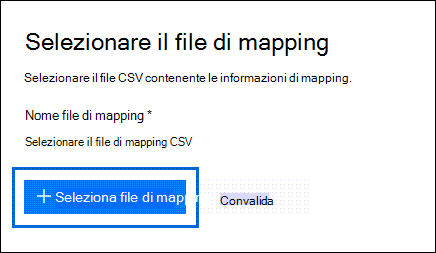
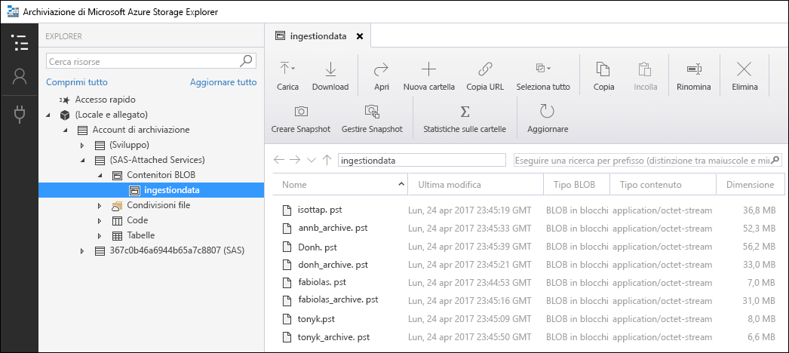

# <a name="use-drive-shipping-to-import-your-organizations-pst-files"></a>Usare la spedizione unità per importare i file PST dell'organizzazione

**Questo articolo è per gli amministratori. Si sta tentando di importare i file PST nella propria cassetta postale? Vedere [Importare posta elettronica, contatti e calendario da un file PST di Outlook](https://go.microsoft.com/fwlink/p/?LinkID=785075)**
   
Usare il servizio di importazione di Office 365 e la spedizione unità per importare in blocco i file PST nelle cassette postali degli utenti. Per spedizione delle unità si intende la copia dei file PST su un'unità disco rigido e l'invio fisico dell'unità a Microsoft. Quando Microsoft riceve il disco rigido, il personale del data center copia i dati dal disco rigido a un'area di archiviazione nel cloud Microsoft. Quindi, è possibile tagliare i dati PST importati nelle cassette postali di destinazione impostando filtri che controllano quali dati vengono importati. Dopo aver avviato il processo di importazione, il servizio di importazione importa i dati PST dall'area di archiviazione alle cassette postali degli utenti. L'uso della spedizione unità per importare i file PST nelle cassette postali degli utenti è un modo per eseguire la migrazione della posta elettronica dell'organizzazione a Office 365.
  
Ecco i passaggi necessari per usare la spedizione unità per importare i file PST nelle cassette postali di Microsoft 365:
  
[Passaggio 1: Scaricare la chiave di archiviazione sicura e lo strumento di importazione PST](#step-1-download-the-secure-storage-key-and-pst-import-tool)

[Passaggio 2: Copiare i file PST nell'unità disco rigido](#step-2-copy-the-pst-files-to-the-hard-drive)

[Passaggio 3: Creare il file di mapping di importazione PST](#step-3-create-the-pst-import-mapping-file)

[Passaggio 4: creare un processo di Importazione PST in Office 365](#step-4-create-a-pst-import-job-in-office-365)

[Passaggio 5: inviare l'unità disco rigido a Microsoft](#step-5-ship-the-hard-drive-to-microsoft)

[Passaggio 6: Filtrare i dati e avviare il processo di importazione PST](#step-6-filter-data-and-start-the-pst-import-job)
  
> [!IMPORTANT]
> È necessario eseguire il passaggio 1 una volta per caricare la chiave di archiviazione sicura e lo strumento di importazione. Dopo aver eseguito questi passaggi, seguire i passaggi da 2 a 6 ogni volta che si desidera spedire un disco rigido a Microsoft. 
  
Per le domande frequenti sull'uso della spedizione unità per importare i file PST in Office 365, vedere domande frequenti sull'uso della spedizione unità per [importare i file PST.](faqimporting-pst-files-to-office-365.md#using-drive-shipping-to-import-pst-files) 
  
## <a name="before-you-import-pst-files"></a>Prima di importare i file PST

- Per importare file PST nelle cassette postali di Microsoft 365, è necessario avere il ruolo di importazione/esportazione di cassette postali in Exchange Online. Per impostazione predefinita, questo ruolo non è assegnato ad alcun gruppo di ruoli in Exchange Online. È possibile aggiungere il ruolo di importazione/esportazione di cassette postali al gruppo di ruoli Gestione organizzazione. In alternativa, è possibile creare un gruppo di ruoli, assegnare il ruolo di importazione/esportazione di cassette postali e quindi aggiungere se stessi come membri. Per altre informazioni, vedere le sezioni "Aggiungere un ruolo a un gruppo di ruoli" o "Creare un gruppo di ruoli" in [Gestire gruppi di ruoli](https://go.microsoft.com/fwlink/p/?LinkId=730688).
    
    Inoltre, per creare processi di importazione nel Centro sicurezza e conformità, una delle seguenti condizioni deve essere vera:
    
  - All'utente deve essere assegnato il ruolo Destinatari di posta in Exchange Online. Per impostazione predefinita, questo ruolo viene assegnato ai gruppi di ruoli Gestione organizzazione e Gestione destinatari.
    
    Oppure
    
  - È necessario essere un amministratore globale nell'organizzazione.
    
    > [!TIP]
    > Prendere in considerazione la creazione di un nuovo gruppo di ruoli in Exchange Online appositamente creato per l'importazione dei file PST in Office 365. Per il livello minimo di privilegi necessari per importare i file PST, assegnare i ruoli di importazione/esportazione di cassette postali e Destinatari di posta al nuovo gruppo di ruoli, quindi aggiungere i membri. 
  
- È necessario archiviare i file PST che si desidera copiare in un'unità disco rigido su un file server o in una cartella condivisa dell'organizzazione. Nel passaggio 2 viene eseguito lo strumento di esportazione di Importazione di Azure (WAImportExport.exe) che copia i file PST archiviati nel file server o nella cartella condivisa nell'unità disco rigido.

- I file PST di grandi dimensioni possono influire sulle prestazioni del processo di importazione PST. È pertanto consigliabile che ogni file PST copiato nell'unità disco rigido nel passaggio 2 non sia superiore a 20 GB.
    
- Solo unità SSD da 2,5 pollici o unità disco rigido interne SATA II/III da 2,5 o 3,5 pollici sono supportate per l'utilizzo con il servizio di importazione di Office 365. È possibile utilizzare unità disco rigido fino a 10 TB. Per i processi di importazione, verrà elaborato solo il primo volume di dati del disco rigido. Il volume di dati deve essere in formato NTFS. Quando si copiano i dati in un disco rigido, è possibile collegarli direttamente utilizzando un connettore SSD da 2,5 o 2,5 pollici o SATA II/III da 3,5 pollici oppure collegarlo esternamente utilizzando una scheda USB SSD esterna da 2,5 pollici o SATA II/III da 2,5 pollici o da 3,5 pollici.
    
    > [!IMPORTANT]
    > I dischi rigidi esterni che vengono installati con un adattatore USB incorporato non sono supportati dal servizio Importa di Office 365. Inoltre, il disco all'interno della scocca di un disco rigido esterno non può essere utilizzato. Non spedire unità disco rigido esterne. 
  
- L'unità disco rigido in cui vengono copiati i file PST deve essere prima crittografata con BitLocker. Lo strumento WAImportExport.exe eseguito nel passaggio 2 consente di configurare BitLocker. Genera anche una chiave di crittografia BitLocker che il personale del data center Microsoft usa per accedere all'unità per caricare i file PST nell'area di archiviazione di Azure nel cloud Microsoft.
    
- La spedizione delle unità è disponibile tramite microsoft Contratto Enterprise (EA). La spedizione unità non è disponibile con un contratto Microsoft Products and Services Agreement (MPSA).
    
- Il costo per importare i file PST nelle cassette postali di Microsoft 365 usando la spedizione unità è di $ 2 USD per GB di dati. Se ad esempio si spedisce un'unità disco rigido contenente 1000 GB (1 TB) di file PST, il costo sarà 2000 dollari USA. È possibile collaborare con un partner per il pagamento delle spese di importazione. Per informazioni su come trovare un partner, vedere [Trovare un partner o rivenditore di Microsoft](https://go.microsoft.com/fwlink/p/?LinkId=785197).
    
- L'utente o la relativa organizzazione deve disporre di un account FedEx o DHL. 
    
  - Le organizzazioni negli Stati Uniti, in Brasile e in Europa devono disporre di account FedEx.
    
  - Le organizzazioni dell'Asia orientale, dell'Asia sud-orientale, del Giappone, della Repubblica di Corea e dell'Australia devono disporre di account DHL.
    
    Microsoft usa (e addebita) questo account per restituire l'unità disco rigido all'utente.
    
- L'unità disco rigido spedibile a Microsoft potrebbe oltrepassare i confini internazionali. In questo caso, l'utente ha la responsabilità di garantire che il disco rigido e i dati in esso contenuti siano importati e/o esportati in conformità alle leggi applicabili. Prima dell'invio di un'unità disco rigido, verificare con i propri consulenti che sia legalmente possibile inviare l'unità e i dati al data center Microsoft identificato. In questo modo si garantisce che raggiunga Microsoft in modo corretto.
    
- Questa procedura comporta la copia e il salvataggio di una chiave di archiviazione protetta e di una chiave di crittografia BitLocker. Adottare le dovute precauzioni per proteggere tali chiavi nello stesso modo in cui vengono protette password o altre informazioni di sicurezza. Ad esempio, potrebbe essere necessario salvarle in un documento di Microsoft Word protetto da password oppure su un'unità USB crittografata. Vedi la [sezione Ulteriori informazioni](#more-information) per un esempio di questi tasti. 
    
- Dopo l'importazione dei file PST in una cassetta postale di Microsoft 365, l'impostazione del blocco della conservazione per la cassetta postale viene attivata per una durata indefinita. Questo significa che i criteri di conservazione assegnati alla cassetta postale non vengono elaborati finché non si disattiva il blocco della conservazione o non si imposta una data per disattivare il blocco. Qual è il motivo di questa impostazione? Se i messaggi importati in una cassetta postale sono vecchi, potrebbero essere eliminati in modo definitivo perché il loro periodo di conservazione è scaduto in base alle impostazioni di conservazione configurate per la cassetta postale. L'impostazione di un blocco della conservazione sulla cassetta postale darà al suo proprietario il tempo di gestire questi messaggi appena importati o all'amministratore il tempo di cambiare le impostazioni di conservazione per la cassetta postale. Per suggerimenti [sulla gestione](#more-information) del blocco della conservazione, vedere la sezione Ulteriori informazioni. 
    
- Per impostazione predefinita, 35 MB è la dimensione massima dei messaggi che possono essere ricevuti da una cassetta postale di Microsoft 365, perché il valore predefinito della proprietà *MaxReceiveSize* per una cassetta postale è impostato su 35 MB. Tuttavia, la dimensione massima dei messaggi in arrivo in Microsoft 365 è pari a 150 MB. Quindi, se si importa un file PST che contiene un elemento di dimensioni maggiori ai 35 MB, il servizio di importazione di Office 365 modificherà automaticamente il valore della proprietà *MaxReceiveSize* nella cassetta postale di destinazione in 150 MB. Questo consente di importare messaggi di dimensione fino a 150 MB nelle cassette postali degli utenti. 
    
    > [!TIP]
    > Per identificare la dimensione di ricezione dei messaggi per una cassetta postale, è possibile eseguire il comando `Get-Mailbox <user mailbox> | FL MaxReceiveSize` in Exchange Online PowerShell. 
  
- È possibile importare i file PST in una cassetta postale inattiva di Office 365. A questo scopo, specificare il GUID della cassetta postale inattiva nel parametro `Mailbox` del file di mapping di importazione PST. Per [ulteriori informazioni, vedere Passaggio 3: Creare il file di mapping](#step-3-create-the-pst-import-mapping-file) di importazione PST. 
    
- In una distribuzione ibrida di Exchange è possibile importare i file PST in una cassetta postale di archiviazione basata sul cloud per un utente la cui cassetta postale principale si trova in locale. A questo scopo, procedere come segue nel file di mapping di importazione PST:
    
  - Specificare l'indirizzo di posta elettronica della cassetta postale locale dell'utente nel parametro `Mailbox`. 
    
  - Specificare il valore **TRUE** nel parametro `IsArchive`. 
    
    Per [ulteriori informazioni, vedere Passaggio 3: Creare il file di mapping](#step-3-create-the-pst-import-mapping-file) di importazione PST. 

## <a name="step-1-download-the-secure-storage-key-and-pst-import-tool"></a>Passaggio 1: Scaricare la chiave di archiviazione sicura e lo strumento di importazione PST

Il primo passaggio consiste nel scaricare la chiave di archiviazione sicura e lo strumento e utilizzare nel passaggio 2 per copiare i file PST nell'unità disco rigido.
  
> [!IMPORTANT]
> È necessario utilizzare lo strumento di importazione/esportazione di Azure versione 1 (WAimportExportV1) per importare correttamente i file PST utilizzando il metodo di spedizione unità. La versione 2 dello strumento di importazione/esportazione di Azure non è supportata e l'utilizzo di questo strumento comporterà una preparazione errata del disco rigido per il processo di importazione. Assicurarsi di scaricare lo strumento di importazione/esportazione di Azure dal Centro sicurezza & conformità seguendo le procedure descritte in questo passaggio. 
  
1. Passare a [https://protection.office.com/](https://protection.office.com/) e accedere con le credenziali di un account amministratore dell'organizzazione. 
    
2. Nel riquadro sinistro del Centro sicurezza e conformità, fare clic su **Governance delle informazioni** \>**Importa** \> **Importa file PST**.
    
    > [!NOTE]
    > Come indicato in precedenza, è necessario disporre  delle autorizzazioni appropriate per accedere alla pagina Importa nel Centro sicurezza & conformità. 
  
3. Nella pagina **Importa file PST**, fare clic su  **Nuovo processo di importazione**.
    
4. Nella procedura guidata del processo di importazione digitare un nome per il processo di importazione PST e quindi fare clic su **Avanti.** Usare lettere minuscole, numeri, trattini e caratteri di sottolineatura. Il nome non può contenere lettere maiuscole o spazi.
    
5. Nella pagina **Scegli tipo di processo di importazione** fare clic su Spedire i dischi **rigidi in** una delle posizioni fisiche e quindi fare clic su **Avanti.**
    
    
  
6. Nella pagina **Importa dati** eseguire le due procedure seguenti: 
    
    
  
    a. Nel passaggio 2 fare clic su **Copiare la chiave di archiviazione sicura.** Dopo aver visualizzato la chiave  di archiviazione, fare clic su Copia negli Appunti, quindi incollarla e salvarla in un file in modo da potervi accedere in un secondo momento.
    
    b. Nel passaggio 3 scaricare lo strumento di **importazione/esportazione** di Azure per scaricare e installare lo strumento di importazione/esportazione di Azure (versione 1).
    
    - Nella finestra popup fare clic **su** Salva con nome per salvare WaImportExportV1.zip file in una cartella nel computer \>  locale. 
    
    - Estrarre il WaImportExportV1.zip file.
    
7. Fare **clic su** Annulla per chiudere la procedura guidata. 
    
    Si torna alla pagina **Importa** nel Centro sicurezza & conformità quando si crea il processo di importazione nel passaggio 4. 

## <a name="step-2-copy-the-pst-files-to-the-hard-drive"></a>Passaggio 2: Copiare i file PST nell'unità disco rigido

Il passaggio successivo consiste nell'utilizzo dello strumento WAImportExport.exe per copiare i file PST nell'unità disco rigido. Questo strumento consente di crittografare l'unità disco rigido con BitLocker, copiare i file PST nell'unità disco rigido e creare un file journal in cui vengono archiviate le informazioni sulla procedura di copia. Per completare questo passaggio, è necessario che i file PST siano posizionati in una condivisione file o in un file server dell'organizzazione. In questa procedura, tale posizione viene definita anche come directory di origine. 

 Come indicato in precedenza, ogni file PST copiato nell'unità disco rigido non deve avere dimensioni superiori a 20 GB. I file PST maggiori di 20 GB possono influire sulle prestazioni del processo di importazione PST avviato nel passaggio 6.
  
> [!IMPORTANT]
> Dopo aver eseguito lo strumento WAImportExport.exe per la prima volta per un'unità disco rigido, in futuro sarà necessario utilizzare una sintassi diversa ogni volta. Questa sintassi è illustrata nel passaggio 4 di questa procedura per copiare i file PST nell'unità disco rigido. 
  
1. Aprire un prompt dei comandi nel computer locale.
    
    > [!TIP]
    > Se si esegue il prompt dei comandi come amministratore (selezionando "Esegui come amministratore" al momento dell’apertura), verranno visualizzati dei messaggi di errore nella finestra del prompt dei comandi. Ciò consente di risolvere i problemi durante l'esecuzione dello strumento WAImportExport.exe. 
  
2. Accedere alla directory nella quale è stato installato lo strumento WAImportExport.exe durante il primo passaggio.
    
3. Eseguire il comando riportato di seguito la prima volta che si utilizza lo strumento WAImportExport.exe per copiare i file PST in un'unità disco rigido.

    ```powershell
    WAImportExport.exe PrepImport /j:<Name of journal file> /t:<Drive letter> /id:<Name of session> /srcdir:<Location of PST files> /dstdir:<PST file path> /sk:<Storage account key> /blobtype:BlockBlob /encrypt /logdir:<Log file location>
    ```

    Nella tabella seguente vengono descritti i parametri e i relativi valori.
    
    |**Parametro**|**Descrizione**|**Esempio**|
    |:-----|:-----|:-----|
    | `/j:` <br/> |Specifica il nome del file journal. Questo file viene salvato nella stessa cartella in cui si trova lo strumento WAImportExport.exe. È necessario che ogni unità disco rigido inviata a Microsoft disponga di un file journal. Ogni volta che si esegue lo strumento WAImportTool.exe per copiare i file PST in un'unità disco rigido, le informazioni verranno aggiunte al file journal per tale unità.  <br/> Il personale del data center Microsoft usa le informazioni nel file journal per associare l'unità disco rigido al processo di importazione creato nel passaggio 4 e per caricare i file PST nell'area di archiviazione di Azure nel cloud Microsoft.  <br/> | `/j:PSTHDD1.jrn` <br/> |
    | `/t:` <br/> |Specifica la lettera di unità del disco rigido quando è connesso al computer locale.  <br/> | `/t:h` <br/> |
    | `/id:` <br/> |Specifica il nome della sessione di copia. Per sessione si intende ogni singola esecuzione dello strumento WAImportExport.exe per copiare i file nell'unità disco rigido. I file PST vengono copiati in una cartella con il nome di sessione specificato da questo parametro.   <br/> | `/id:driveship1` <br/> |
    | `/srcdir:` <br/> |Specifica la directory di origine dell'organizzazione contenente i file PST che verranno copiati durante la sessione. Racchiudere il valore di questo parametro tra virgolette doppie (" ").  <br/> | `/srcdir:"\\FILESERVER01\PSTs"` <br/> |
    | `/dstdir:` <br/> |Specifica la directory di destinazione nell'area di archiviazione di Azure nel cloud Microsoft in cui verranno caricati i file PST. È necessario utilizzare il valore  `ingestiondata/` . Racchiudere il valore di questo parametro tra virgolette doppie (" ").  <br/> Facoltativamente, è anche possibile aggiungere un percorso di file aggiuntivo al valore di questo parametro. Ad esempio, è possibile utilizzare il percorso del file della directory di origine sul disco rigido (convertito in un formato URL), specificato nel  `/srcdir:` parametro. Ad esempio,  `\\FILESERVER01\PSTs` viene modificato in  `FILESERVER01/PSTs` . In questo caso, è comunque necessario includere  `ingestiondata` il percorso del file. In questo esempio, il valore per il  `/dstdir:` parametro sarà  `"ingestiondata/FILESERVER01/PSTs"` .  <br/> L'aggiunta di un ulteriore percorso file è motivata nel caso in cui si disponga di file PST con lo stesso nome file.  <br/> > [!NOTE]> Se si include il percorso facoltativo, lo spazio dei nomi per un file PST dopo il caricamento nell'area di archiviazione di Azure include il percorso e il nome del file PST. ad esempio  `FILESERVER01/PSTs/annb.pst` . Se non si include un percorso, lo spazio dei nomi è solo il nome del file PST. ad esempio  `annb.pst` .           | `/dstdir:"ingestiondata/"` <br/> Oppure  <br/>  `/dstdir:"ingestiondata/FILESERVER01/PSTs"` <br/> |
    | `/sk:` <br/> |Specifica la chiave dell'account di archiviazione ottenuta nel passaggio 1. Racchiudere il valore di questo parametro tra virgolette doppie (" ").  <br/> | `"yaNIIs9Uy5g25Yoak+LlSHfqVBGOeNwjqtBEBGqRMoidq6/e5k/VPkjOXdDIXJHxHvNoNoFH5NcVUJXHwu9ZxQ=="` <br/> |
    | `/blobtype:` <br/> |Specifica il tipo di BLOB nell'area di archiviazione di Azure in cui importare i file PST. Per importare i file PST, utilizzare il **valore BlockBlob.** Questo parametro è obbligatorio.   <br/> | `/blobtype:BlockBlob` <br/> |
    | `/encrypt` <br/> |Questa opzione attiva BitLocker per l'unità disco rigido. Il parametro è obbligatorio la prima volta che si esegue lo strumento WAImportExport.exe.  <br/> La chiave di crittografia BitLocker viene copiata nel file journal e nel file di registro creato se si utilizza il  `/logfile:` parametro. Come illustrato in precedenza, il file journal viene salvato nella stessa cartella in cui si trova lo strumento WAImportExport.exe.  <br/> | `/encrypt` <br/> |
    | `/logdir:` <br/> |Questo parametro facoltativo specifica una cartella in cui salvare i file di log. Se non specificato, i file di registro vengono salvati nella stessa cartella in cui si trova WAImportExport.exe strumento. Racchiudere il valore di questo parametro tra virgolette doppie (" ").  <br/> | `/logdir:"c:\users\admin\desktop\PstImportLogs"` <br/> |
   
    Di seguito è riportato un esempio di sintassi dello strumento WAImportExport.exe nella quale vengono utilizzati i valori effettivi di ogni parametro:
    
    ```powershell
    WAImportExport.exe PrepImport /j:PSTHDD1.jrn /t:f /id:driveship1 /srcdir:"\\FILESERVER01\PSTs" /dstdir:"ingestiondata/" /sk:"yaNIIs9Uy5g25Yoak+LlSHfqVBGOeNwjqtBEBGqRMoidq6/e5k/VPkjOXdDIXJHxHvNoNoFH5NcVUJXHwu9ZxQ==" blobtype:BlockBlob /encrypt /logdir:"c:\users\admin\desktop\PstImportLogs"
    ```

    Una volta eseguito il comando, i messaggi di stato visualizzati riportano informazioni sull'avanzamento della copia dei file PST nell'unità disco rigido. Nel messaggio finale viene riportato il numero complessivo di file che sono stati copiati. 
    
4. Eseguire questo comando ogni volta che verrà eseguito lo strumento WAImportExport.ext per copiare i file PST nella stessa unità disco rigido.

    ```powershell
    WAImportExport.exe PrepImport /j:<Name of journal file> /id:<Name of new session> /srcdir:<Location of PST files> /dstdir:<PST file path> /blobtype:BlockBlob 
    ```

    Di seguito è riportato un esempio della sintassi necessaria per le sessioni successive per copiare i file PST nella stessa unità disco rigido.  

    ```powershell
    WAImportExport.exe PrepImport /j:PSTHDD1.jrn /id:driveship2 /srcdir:"\\FILESERVER01\PSTs\SecondBatch" /dstdir:"ingestiondata/" /blobtype:BlockBlob
    ```

## <a name="step-3-create-the-pst-import-mapping-file"></a>Passaggio 3: Creare il file di mapping di importazione PST

Dopo che il personale del data center Microsoft ha caricato i file PST dal disco rigido all'area di archiviazione di Azure, il servizio di importazione utilizzerà le informazioni nel file di mapping di importazione PST, che è un file con valori delimitati da virgole (CSV), che specifica in quali cassette postali degli utenti vengono importati i file PST. È necessario inviare il file CSV nel passaggio successivo a quello di creazione del processo di importazione PST.
  
1. [Scaricare una copia del file di mapping dell'importazione PST](https://go.microsoft.com/fwlink/p/?LinkId=544717).
    
2. Aprire o salvare il file CSV nel computer locale. Nell'esempio seguente viene visualizzato un file di mapping di importazione PST completo (aperto nel Blocco note). È molto più facile usare Microsoft Excel per modificare il file CSV.

    ```text
    Workload,FilePath,Name,Mailbox,IsArchive,TargetRootFolder,ContentCodePage,SPFileContainer,SPManifestContainer,SPSiteUrl
    Exchange,FILESERVER01/PSTs,annb.pst,annb@contoso.onmicrosoft.com,FALSE,/,,,,
    Exchange,FILESERVER01/PSTs,annb_archive.pst,annb@contoso.onmicrosoft.com,TRUE,/ImportedPst,,,,
    Exchange,FILESERVER01/PSTs,donh.pst,donh@contoso.onmicrosoft.com,FALSE,/,,,,
    Exchange,FILESERVER01/PSTs,donh_archive.pst,donh@contoso.onmicrosoft.com,TRUE,/ImportedPst,,,,
    Exchange,FILESERVER01/PSTs,pilarp.pst,pilarp@contoso.onmicrosoft.com,FALSE,/,,,,
    Exchange,FILESERVER01/PSTs,pilarp_archive.pst,pilarp@contoso.onmicrosoft.com,TRUE,/ImportedPst,,,,
    Exchange,,tonyk.pst,tonyk@contoso.onmicrosoft.com,FALSE,/,,,,
    Exchange,,tonyk_archive.pst,tonyk@contoso.onmicrosoft.com,TRUE,,,,,
    Exchange,,zrinkam.pst,zrinkam@contoso.onmicrosoft.com,FALSE,/,,,,
    Exchange,,zrinkam_archive.pst,zrinkam@contoso.onmicrosoft.com,TRUE,,,,,
    ```

    Nella prima riga o in quella dell'intestazione del file CSV vengono elencati i parametri che verranno usati dal servizio di importazione PST per importare i file PST nelle cassette postali dell'utente. Ogni nome di parametro è separato da una virgola. Ogni riga al di sotto di quella dell'intestazione riporta i valori del parametro che consentono di importare un file PST in una cassetta postale specifica. È necessaria una riga per ogni file PST copiato nell'unità disco rigido. Assicurarsi di sostituire i dati segnaposto nel file di mapping con i dati effettivi.

    > [!NOTE]
    > Non apportare modifiche nella riga di intestazione, nemmeno ai parametri di SharePoint. Questi verranno ignorati durante il processo di importazione PST. 
  
3. Utilizzare le informazioni della tabella per popolare il file CSV con i dati necessari.
    
    |**Parametro**|**Descrizione**|**Esempio**|
    |:-----|:-----|:-----|
    | `Workload` <br/> |Specifica il servizio in cui verranno importati i dati. Per importare file PST nelle cassette postali degli utenti, usare `Exchange`.  <br/> | `Exchange` <br/> |
    | `FilePath` <br/> | Specifica il percorso della cartella nell'area di archiviazione di Azure in cui verranno copiati i file PST quando il disco rigido viene inviato a Microsoft.  <br/>  Gli elementi aggiunti in questa colonna nel file CSV dipendono da ciò che è stato specificato per il  `/dstdir:` parametro nel passaggio precedente. Se nel percorso di origine sono presenti sottocartelle, il valore nel parametro deve contenere il percorso relativo della sottocartella, ad esempio `FilePath` /cartella1/utente1/.  <br/>  Se è stato  `/dstdir:"ingestiondata/"` utilizzato , lasciare vuoto questo parametro nel file CSV.  <br/>  Se è stato incluso un percorso facoltativo per il valore del parametro (ad esempio, , utilizzare tale nome percorso (senza includere  `/dstdir:` "ingestiondata") per questo parametro nel  `/dstdir:"ingestiondata/FILESERVER01/PSTs"` file CSV. Per il valore di questo parametro è rilevante la distinzione tra maiuscole e minuscole.  <br/>  In entrambi i casi, *non* includere "ingestiondata" nel valore per il parametro `FilePath`. Lasciare vuoto questo parametro o specificare solo il percorso facoltativo.  <br/> > [!IMPORTANT]> la distinzione tra maiuscole e minuscole per il nome del percorso del file deve corrispondere a quella specificata nel parametro  `/dstdir:` nel passaggio precedente. Ad esempio, se è stato utilizzato per il nome della sottocartella nel passaggio precedente, ma poi utilizzato nel parametro nel file CSV, l'importazione per il  `"ingestiondata/FILESERVER01/PSTs"` file PST avrà esito  `fileserver01/psts`  `FilePath` negativo. Assicurarsi di usare la stessa combinazione di maiuscole e minuscole in entrambi i casi.           |(lasciare vuoto)  <br/> Oppure  <br/>  `FILESERVER01/PSTs` <br/> |
    | `Name` <br/> |Specifica il nome del file PST che verrà importato nella cassetta postale dell'utente. Per il valore di questo parametro è rilevante la distinzione tra maiuscole e minuscole.  <br/> > [!IMPORTANT]> caso per il nome del file PST nel file CSV deve corrispondere al file PST caricato nel percorso di Archiviazione di Azure nel passaggio 2. Ad esempio, se si usa `annb.pst` nel parametro `Name` nel file CSV, ma il nome del file PST effettivo è `AnnB.pst`, l'importazione del file PST avrà esito negativo. Assicurarsi che il nome del file PST nel file CSV contenga la stessa combinazione di maiuscole e minuscole del file PST effettivo.           | `annb.pst` <br/> |
    | `Mailbox` <br/> |Specifica l'indirizzo di posta elettronica della cassetta postale in cui verrà importato il file PST.  Non è possibile specificare una cartella pubblica perché il servizio di importazione PST non supporta l'importazione di file PST nelle cartelle pubbliche.  <br/> Per importare un file PST in una cassetta postale inattiva, è necessario specificare il GUID della cassetta postale in questo parametro. Per ottenere questo GUID, eseguire il comando di PowerShell seguente in Exchange Online: `Get-Mailbox <identity of inactive mailbox> -InactiveMailboxOnly | FL Guid` <br/> > [!NOTE]> Talvolta, è possibile che si abbia più cassette postali con lo stesso indirizzo di posta elettronica, in cui una cassetta postale è una cassetta postale attiva e l'altra cassetta postale è in uno stato di eliminazione recisa (o inattiva). In una situazione di questo tipo è necessario specificare il GUID della cassetta postale per identificare in modo univoco la cassetta postale in cui importare il file PST. Per ottenere questo GUID per le cassette postali attive, eseguire il comando di PowerShell seguente: `Get-Mailbox <identity of active mailbox> | FL Guid`. Per ottenere il GUID per le cassette postali con eliminazione recisa (o inattive), eseguire questo comando:  `Get-Mailbox <identity of soft-deleted or inactive mailbox> -SoftDeletedMailbox | FL Guid` .           | `annb@contoso.onmicrosoft.com` <br/> Oppure  <br/>  `2d7a87fe-d6a2-40cc-8aff-1ebea80d4ae7` <br/> |
    | `IsArchive` <br/> | Specifica se importare o meno il file PST nella cassetta postale di archiviazione dell'utente. Esistono due opzioni:  <br/> **FALSE** Importa il file PST nella cassetta postale principale dell'utente.  <br/> **TRUE** Importa il file PST nella cassetta postale di archiviazione dell'utente. In questo caso si presuppone che [la cassetta postale di archiviazione dell'utente sia abilitata](enable-archive-mailboxes.md). Se si imposta questo parametro su `TRUE` e la cassetta postale di archiviazione dell'utente non è abilitata, l'importazione per tale utente non riesce. Se l'importazione per un utente non riesce (perché la sua cassetta postale di archiviazione non è abilitata e questa proprietà è impostata su `TRUE`), gli altri utenti coinvolti nel processo di importazione non ne vengono in alcun modo interessati.  <br/>  Se si lascia vuoto questo parametro, il file PST viene importato nella cassetta postale principale dell'utente.  <br/> **Nota:** per importare un file PST in una cassetta postale di archiviazione basata sul cloud per un utente la cui cassetta postale principale si trova in locale, basta specificare `TRUE` per questo parametro e fornire l'indirizzo di posta elettronica della cassetta postale locale dell'utente nel parametro `Mailbox`.  <br/> | `FALSE` <br/> Oppure  <br/>  `TRUE` <br/> |
    | `TargetRootFolder` <br/> | Specifica la cartella della casetta postale in cui viene importato il file PST.  <br/>  Se si lascia vuoto questo parametro, il file PST verrà importato in una nuova cartella denominata **Importato** che si trova al livello radice della cassetta postale (lo stesso livello della cartella Posta in arrivo e delle altre cartelle predefinite della cassetta postale).  <br/>  Se si specifica , gli elementi nel file PST verranno importati direttamente nella cartella Posta  `/` in arrivo dell'utente.  <br/>  Se si specifica , gli elementi nel file PST verranno  `/<foldername>` importati in una cartella denominata  *\<foldername\>* . Ad esempio, se si usa `/ImportedPst`, gli elementi vengono importati in una cartella denominata **ImportedPst**. Questa cartella si troverà nella cassetta postale dell'utente allo stesso livello della cartella Posta in arrivo.  <br/> |(lasciare vuoto)  <br/> Oppure  <br/>  `/` <br/> Oppure  <br/>  `/ImportedPst` <br/> |
    | `ContentCodePage` <br/> |Questo parametro facoltativo specifica un valore numerico per la tabella codici da usare per l'importazione dei file PST nel formato ANSI. Questo parametro viene usato per l'importazione di file PST da organizzazioni cinesi, giapponesi e coreane perché queste lingue in genere usano un set di caratteri a due byte (DBCS) per la codifica dei caratteri. Se non si usa questo parametro per importare file PST per le lingue che usano il set di caratteri DBCS per i nomi delle cartelle delle cassette postali, i nomi delle cartelle spesso appaiono illeggibili dopo l'importazione.  <br/> Per un elenco dei valori supportati da usare per questo parametro, vedere la pagina dedicata agli [identificatori delle tabelle codici](https://go.microsoft.com/fwlink/p/?LinkId=328514).  <br/> > [!NOTE]> come indicato in precedenza, questo è un parametro facoltativo e non è necessario includerlo nel file CSV. Può anche essere incluso lasciando il valore vuoto per una o più righe.           |(lasciare vuoto)  <br/> Oppure  <br/>  `932` (identificatore della tabella codici per il giapponese ANSI/OEM)  <br/> |
    | `SPFileContainer` <br/> |Per l'importazione PST, omettere questo parametro.  <br/> |Non applicabile  <br/> |
    | `SPManifestContainer` <br/> |Per l'importazione PST, omettere questo parametro.  <br/> |Non applicabile  <br/> |
    | `SPSiteUrl` <br/> |Per l'importazione PST, omettere questo parametro.  <br/> |Non applicabile  <br/> |

## <a name="step-4-create-a-pst-import-job-in-office-365"></a>Passaggio 4: creare un processo di Importazione PST in Office 365

Il passaggio successivo consiste nel creare il processo di importazione PST nel servizio di importazione in Office 365. Come spiegato in precedenza, si invia il file di mapping dell'importazione PST creato nel passaggio 3. Dopo aver creato il processo, il servizio di importazione utilizzerà le informazioni nel file di mapping per importare i file PST nella cassetta postale utente specificata dopo che i file PST vengono copiati dall'unità disco rigido nell'area di archiviazione di Azure e si crea e si avvia il processo di importazione.
  
1. Passare a [https://protection.office.com](https://protection.office.com) e accedere con le credenziali di un account amministratore dell'organizzazione. 
    
2. Nel riquadro sinistro del Centro sicurezza e conformità, fare clic su **Governance delle informazioni** \>**Importa** \> **Importa file PST**.
    
3. Nella pagina **Importa file PST**, fare clic su  **Nuovo processo di importazione**.
    
    > [!NOTE]
    > Come indicato in precedenza, è necessario disporre  delle autorizzazioni appropriate per accedere alla pagina Importa nel Centro sicurezza & conformità. 
  
4. Digitare un nome per il processo di importazione PST e quindi fare clic su **Avanti**. Usare lettere minuscole, numeri, trattini e caratteri di sottolineatura. Il nome non può contenere lettere maiuscole o spazi.
    
5. Nella pagina **Scegli tipo di processo di importazione** fare clic su Spedire i dischi **rigidi in** una delle posizioni fisiche e quindi fare clic su **Avanti.**
    
    
  
6. Nel passaggio 6, fare clic sui dischi rigidi che ho preparato e avere accesso ai file journal **dell'unità** necessari e ho accesso alle caselle di controllo del file di **mapping** e quindi fare clic su **Avanti.**
    
    
  
7. Nella pagina **Seleziona il file dell'unità** fare clic su Seleziona **file** dell'unità e quindi passare alla stessa cartella in cui si trova WAImportExport.exe strumento. Il file journal creato nel passaggio 2 è stato copiato in questa cartella.
    
    
  
8. Selezionare il file journal; ad esempio `PSTHDD1.jrn` .
    
    > [!TIP]
    > Quando si esegue lo WAImportExport.exe nel passaggio 2, il nome del file journal è stato specificato dal  `/j:` parametro. 
  
9. Dopo che il nome del file dell'unità viene visualizzato in **Nome file unità,** fare clic su **Convalida** per verificare la presenza di errori nel file dell'unità. 
    
    
  
    Il file dell'unità deve essere convalidato correttamente per creare un processo di importazione PST. Si noti che il nome del file diventa verde dopo la convalida. In caso contrario, fare clic sul collegamento **Visualizza log**. Viene aperta una segnalazione errori di convalida, con un messaggio di errore con informazioni sul motivo per cui il file non è riuscito. 
    
    > [!NOTE]
    > È necessario aggiungere e convalidare un file journal per ogni unità disco rigido spedibile a Microsoft. 
  
10. Dopo aver aggiunto e convalidato un file journal per ogni unità disco rigido spedibile a Microsoft, fare clic su **Avanti.**
    
11. Fare clic su Aggiungi icona Seleziona file di mapping per inviare il file di   3. 
    
    
  
12. Quando il nome del file CSV viene visualizzato nell'elenco, in **Nome file di mapping** fare clic su **Convalida** per verificare che non ci siano errori nel file CSV. 
    
    
  
    Per creare un processo di importazione PST, il file CSV deve essere convalidato correttamente. Si noti che il nome del file diventa verde dopo la convalida. In caso contrario, fare clic sul collegamento **Visualizza log**. Viene aperto un report di errore di convalida, con un messaggio di errore per ogni riga del file per cui la convalida non è riuscita. 
    
13. Dopo aver convalidato correttamente il file di mapping PST, fare clic su **Avanti.**
    
14. Nella pagina **Fornisci informazioni di** contatto digitare le informazioni di contatto nelle caselle applicabili. 
    
    Viene visualizzato l'indirizzo della posizione Microsoft a cui vengono spedito i dischi rigidi. Questo indirizzo viene generato automaticamente in base alla posizione del datacenter Microsoft. Copiare l’indirizzo in un file oppure eseguire una screenshot.
    
15. Leggere il documento dei termini e delle condizioni, selezionare la casella di controllo e quindi fare clic su **Salva** per inviare il processo di importazione. 
    
    Quando il processo di importazione viene creato correttamente, viene visualizzata una pagina di stato in cui vengono illustrati i passaggi successivi del processo di spedizione delle unità.
    
16. Nella pagina **Importa file PST** fare clic sull'icona Aggiorna per visualizzare il nuovo processo di importazione della spedizione unità   nell'elenco dei processi di importazione. Lo stato è impostato su **In attesa del numero di tracciabilità.** È inoltre possibile fare clic sul processo di importazione per visualizzare la pagina di stato a comparsa, che contiene informazioni più dettagliate sul processo di importazione.
 
## <a name="step-5-ship-the-hard-drive-to-microsoft"></a>Passaggio 5: inviare l'unità disco rigido a Microsoft

Il passaggio successivo consiste nel spedire l'unità disco rigido a Microsoft, quindi fornire il numero di tracciabilità per la spedizione e restituire le informazioni sulla spedizione per il processo di spedizione dell'unità. Una volta ricevuta l'unità da Microsoft, saranno necessari tra 7 e 10 giorni lavorativi per il personale del data center per caricare i file PST nell'area di archiviazione di Azure per l'organizzazione.
  
> [!NOTE]
> Se non si specifica il numero di tracciabilità e non si restituiscono informazioni sulla spedizione entro 14 giorni dalla creazione del processo di importazione, il processo di importazione sarà scaduto. In questo caso, sarà necessario creare un nuovo processo di importazione della spedizione unità (vedere Passaggio 4: Creare un processo di importazione [PST in Office 365)](#step-4-create-a-pst-import-job-in-office-365)e inviare di nuovo il file dell'unità e il file di mapping dell'importazione PST. 
  
### <a name="ship-the-hard-drive"></a>Spedire l'unità disco rigido

Tenere presente quanto segue in fase di spedizione delle unità a Microsoft:
  
- Non spedire l'adattatore SATA-a-USB; è necessario spedire solo l'unità disco rigido.
    
- Assicurarsi che l'unità sia imballata correttamente, ad esempio, utilizzare una busta antistatica o pluriball.
    
- Utilizzare un corriere di propria scelta per spedire l'unità disco rigido a Microsoft.
    
- Spedire l'unità disco rigido all'indirizzo della sede Microsoft visualizzato quando è stato creato il processo di importazione al passaggio 4. Assicurarsi di includere "Office 365 Import Service" nell'indirizzo di spedizione.
    
- Dopo aver inviato l'unità disco rigido, verificare di aver scritto il nome del corriere e il numero di tracciabilità. Tali informazioni verranno fornite nel prossimo passaggio.
    
### <a name="enter-the-tracking-number-and-other-shipping-information"></a>Immettere il numero di tracciabilità e altre informazioni sulla spedizione

Dopo aver inviato l'unità disco rigido a Microsoft, completare la procedura seguente nella pagina del servizio di importazione.
  
1. Passare a [https://protection.office.com](https://protection.office.com) e accedere con le credenziali di un account amministratore dell'organizzazione. 
    
2. Nel riquadro sinistro fare clic su Governance delle **informazioni > importare > importare i file PST.**
    
3. Nella pagina **Importa file PST** fare clic sul processo per la spedizione dell'unità per cui si desidera immettere il numero di tracciabilità. 
    
4. Nella pagina del riquadro a comparsa dello stato fare clic su **Immetti numero di tracciabilità.**
    
5. Fornire le seguenti informazioni sulla spedizione:
    
1. **Corriere** Digitare il nome del corriere utilizzato per spedire l'unità disco rigido a Microsoft. 
    
2. **Numero di tracciabilità** Digitare il numero di tracciabilità per la spedizione del disco rigido. 
    
3. **Numero dell'account del vettore di ritorno** Digitare il numero di account dell'organizzazione per il vettore elencato in **Vettore di ritorno.** Microsoft usa (e addebita) questo account per spedire l'unità disco rigido all'utente. Le organizzazioni negli Stati Uniti e in Europa devono avere un account con FedEx. È necessario che le organizzazioni in Asia e nel resto del mondo dispongano di un account con DHL.
    
6. Fare clic su **Salva** per salvare queste informazioni per il processo di importazione. 
    
    Nella pagina **Importa file PST** fare clic su Aggiorna icona Aggiorna per aggiornare le informazioni per il processo di importazione della spedizione   unità. Lo stato è ora impostato su **Unità in transito**.

## <a name="step-6-filter-data-and-start-the-pst-import-job"></a>Passaggio 6: Filtrare i dati e avviare il processo di importazione PST

Una volta ricevuta l'unità disco rigido da Microsoft, lo stato del processo di importazione nella pagina Importa **file PST** cambierà in **Unità ricevute.** Il personale del data center usa le informazioni nel file journal per caricare i file PST nell'area di archiviazione di Azure per l'organizzazione. A questo punto, lo stato cambia in **Importa in corso.** Come indicato in precedenza, saranno necessari tra 7 e 10 giorni lavorativi dopo la ricezione dell'unità disco rigido per caricare i file PST.
  
Dopo il caricamento dei file PST in Azure, lo stato viene modificato **in Analisi in corso.** Ciò indica che Microsoft 365 sta analizzando i dati nei file PST (in modo sicuro) per identificare l'età degli elementi e i diversi tipi di messaggio inclusi nei file PST. Una volta completata l'analisi e i dati sono pronti per l'importazione, lo stato del processo di importazione viene modificato in **Analisi completata.** A questo punto, è possibile importare tutti i dati contenuti nei file PST oppure è possibile tagliare i dati importati impostando filtri che controllano quali dati vengono importati.
  
1. Passare a [https://protection.office.com](https://protection.office.com) e accedere con le credenziali di un account amministratore dell'organizzazione. 
    
2. Nel riquadro sinistro fare clic su Importa file PST **nella governance** \>  \> **delle informazioni.**
    
3. Nella pagina **Importa file PST** fare clic su Pronto per l'importazione in Office **365** per il processo di importazione creato nel passaggio 4. 
    
    
  
    Viene visualizzata una pagina a comparsa con informazioni sui file PST e sul processo di importazione.
    
4. Fare **clic su Importa in Office 365.**
    
5. Viene visualizzata la pagina **Filtrare i dati**. Contiene informazioni dettagliate sui dati risultanti dall'analisi eseguita sui file PST da Office 365, incluse le informazioni sulla validità dei dati. A questo punto è possibile filtrare i dati che verranno importati oppure importare tutti i dati. 
    
    
  
6. Eseguire una delle operazioni seguenti:
    
    a. Per filtrare i dati da importare, fare clic su **Sì, voglio filtrarli prima dell'importazione**.
    
    Per informazioni dettagliate su come filtrare i dati nei file PST e quindi avviare il processo di importazione, vedere [Filtrare i dati durante l'importazione di file PST in Office 365](filter-data-when-importing-pst-files.md).
    
    Oppure
    
    b. Per importare tutti i dati nei file PST, fare clic su **No, voglio importare tutto** e quindi fare clic su **Avanti**.
    
7. Se si sceglie di importare tutti i dati, fare clic su **Importa dati** per avviare il processo di importazione. 
    
    Lo stato del processo di importazione viene visualizzato nella **pagina Importa file PST.** Fare clic su  **Aggiorna** per aggiornare le informazioni visualizzate nella colonna **Stato**. Fare clic sul processo di importazione per visualizzare la pagina di stato a comparsa, che mostra le informazioni sullo stato per ogni file PST importato. Quando l'importazione viene completata e i file PST sono stati importati nelle cassette postali utente, lo stato diventa **Completato**.

## <a name="view-a-list-of-the-pst-files-uploaded-to-microsoft-365"></a>Visualizzare un elenco dei file PST caricati in Microsoft 365

È possibile installare e usare Microsoft Azure Storage Explorer (uno strumento open source gratuito) per visualizzare l'elenco dei file PST caricati (dal personale del data center Microsoft) nell'area di archiviazione di Azure per l'organizzazione. È possibile eseguire questa operazione per verificare che i file PST dai dischi rigidi inviati a Microsoft siano stati caricati correttamente nell'area di archiviazione di Azure.
  
Lo strumento Microsoft Azure Storage Explorer è in anteprima.
  
 **Importante:** Non è possibile usare Azure Storage Explorer per caricare o modificare i file PST. L'unico metodo supportato per importare file PST in Microsoft 365 è usare AzCopy. Inoltre, non si possono eliminare i file PST caricati nel BLOB di Azure. Se si tenta di eliminare un file PST, viene visualizzato un messaggio di errore in cui viene richiesto di non disporre delle autorizzazioni necessarie. Tutti i file PST vengono eliminati automaticamente dall'area di archiviazione di Azure. Se non sono in corso processi di importazione, tutti i file PST nel contenitore ** ingestiondata ** vengono eliminati 30 giorni dopo la creazione del processo di importazione più recente. 
  
Per installare Azure Storage Explorer e connettersi all'area di Archiviazione di Azure:
  
1. Eseguire la procedura seguente per ottenere l'URL della firma di accesso condiviso per l'organizzazione. Questo URL è una combinazione dell'URL di rete per il percorso di archiviazione di Azure nel cloud Microsoft per l'organizzazione e di una chiave SAS. Questa chiave fornisce le autorizzazioni necessarie per accedere alla posizione di Archiviazione di Azure dell'organizzazione.
    
1. Passare a [https://protection.office.com/](https://protection.office.com/) e accedere con le credenziali di un account amministratore dell'organizzazione. 
    
2. Nel riquadro sinistro del Centro sicurezza e conformità, fare clic su **Governance delle informazioni > Importa > Importa file PST**.
    
3. Nella pagina **Importa file PST**, fare clic su  **Nuovo processo di importazione**.
    
4. Nella procedura guidata del processo di importazione digitare un nome per il processo di importazione PST e quindi fare clic su **Avanti.** Usare lettere minuscole, numeri, trattini e caratteri di sottolineatura. Il nome non può contenere lettere maiuscole o spazi.
    
5. Nella pagina **Scegli tipo di processo di importazione** fare clic su Carica **dati** e quindi su **Avanti.**
    
6. Nel passaggio 2 fare clic su **Mostra l'URL della firma di accesso condiviso per il caricamento in rete**.
    
7. Dopo aver visualizzato l'URL, copiarlo e salvarlo in un file. Assicurarsi di copiare l'URL completo.
    
    > [!IMPORTANT]
    > Assicurarsi di adottare alcune precauzioni per proteggere l'URL della firma di accesso condiviso, Può essere usato da chiunque per accedere all'area di archiviazione di Azure per l'organizzazione. 
  
8. Fare **clic su Annulla** per chiudere l'importazione guidata del processo. 
    
2. Scaricare e installare lo [strumento Microsoft Azure Storage Explorer](https://go.microsoft.com/fwlink/p/?LinkId=544842).
    
3. Avviare Microsoft Azure Storage Explorer, fare clic con il pulsante destro del mouse su **Account di archiviazione** nel riquadro sinistro e quindi scegliere **Connetti ad Archiviazione di Azure**.
    
    
  
4. Fare clic sul comando **** per usare un URI della firma di accesso condiviso o una stringa di connessione e quindi fare clic su **Avanti**.
    
5. Fare clic su Use **a SAS URI,** paste the SAS URL that you obtained in step 1 in to in the box under **URI**, and then click **Next**.
    
6. Nella pagina **Riepilogo connessione** è possibile rivedere le informazioni sulla connessione e quindi fare clic su **Connetti**.
    
    Il contenitore **ingestiondata** viene aperto. Contiene i file PST dal disco rigido. Il contenitore **ingestiondata** si trova in **Account di archiviazione** \> **(SAS-Attached Services)** \> **Contenitori BLOB**.
    
    
  
7. Dopo aver finito di usare Microsoft Azure Storage Explorer, fare clic con il pulsante destro del mouse su **ingestiondata** e quindi scegliere **Scollega** per scollegarsi dall'area di Archiviazione di Azure. In caso contrario, verrà visualizzato un messaggio di errore al successivo tentativo di collegamento. 
    
    

## <a name="troubleshooting-tips"></a>Suggerimenti per la risoluzione dei problemi

- **Cosa succede se il processo di importazione non riesce a causa di errori nel file di mapping CSV di importazione PST?** Se un processo di importazione non riesce a causa di errori nel file di mapping, non è necessario riconseere l'unità disco rigido a Microsoft per creare un processo di importazione. Questo perché i file PST dall'unità disco rigido inviata per il processo di importazione della spedizione unità sono già stati caricati nell'area di archiviazione di Azure per l'organizzazione. In questo caso, è solo necessario correggere gli errori nel file di mapping CSV di importazione PST, quindi creare un nuovo processo di importazione "caricamento di rete" e inviare il file di mapping CSV modificato. Per creare e avviare un nuovo processo di importazione del caricamento di rete, vedere Passaggio 5: Creare un processo di importazione [PST in Microsoft 365](use-network-upload-to-import-pst-files.md#step-5-create-a-pst-import-job) e [Passaggio 6:](use-network-upload-to-import-pst-files.md#step-6-filter-data-and-start-the-pst-import-job) filtrare i dati e avviare il processo di importazione PST nell'argomento "Usare il caricamento di rete per importare i file PST in Office 365". 
    
    > [!NOTE]
    > Per risolvere i problemi relativi al file di mapping CSV di importazione PST, usare lo strumento [Azure Storage Explorer](#view-a-list-of-the-pst-files-uploaded-to-microsoft-365) per visualizzare la struttura di cartelle nel contenitore **ingestiondata** per i file PST dal disco rigido caricati nell'area di archiviazione di Azure. Gli errori dei file di mapping sono in genere causati da un valore non corretto nel parametro FilePath. Questo parametro consente di specificare il percorso di un file PST nell'area di archiviazione di Azure. Vedere la descrizione del parametro FilePath nella tabella [del passaggio 3.](#step-3-create-the-pst-import-mapping-file) Come spiegato in precedenza, il percorso dei file PST nell'area di archiviazione di Azure è stato specificato dal parametro quando è stato eseguito lo strumento WAImportExport.exe `/dstdir:` nel [passaggio 2.](#step-2-copy-the-pst-files-to-the-hard-drive) 
  
## <a name="more-information"></a>Altre informazioni

- La spedizione unità è un modo efficace per importare grandi quantità di dati di messaggistica di archiviazione in Microsoft 365 per sfruttare le funzionalità di conformità disponibili per l'organizzazione. Dopo aver importato i dati di archiviazione nelle cassette postali degli utenti, è possibile:
    
  - Abilitare [le cassette postali di](enable-archive-mailboxes.md) archiviazione e [l'archiviazione](enable-unlimited-archiving.md) con espansione automatica per concedere agli utenti più spazio di archiviazione per i dati. 
    
  - Impostare il blocco [per controversia legale per](https://go.microsoft.com/fwlink/?linkid=856286) le cassette postali per conservare i dati. 
    
  - Utilizzare gli [strumenti di Microsoft eDiscovery](search-for-content.md) per eseguire ricerche nei dati. 
    
  - Applicare i criteri di conservazione di [Microsoft 365](retention.md) per controllare la durata della conservazione dei dati e l'azione da intraprendere dopo la scadenza del periodo di conservazione. 
    
  - Cercare nel [log di controllo](search-the-audit-log-in-security-and-compliance.md) gli eventi correlati a questi dati. 
    
  - Importare i dati [nelle cassette postali inattive](create-and-manage-inactive-mailboxes.md) per archiviare i dati per motivi di conformità. 
    
  - Proteggere l'organizzazione dalla [perdita di dati](data-loss-prevention-policies.md) di informazioni riservate. 
    
- Di seguito viene riportato un esempio di una chiave dell'account di archiviazione protetta e una chiave di crittografia BitLocker. In questo esempio è riportata la sintassi per il comando WAImportExport.exe da eseguire per copiare i file PST in un'unità disco rigido. Adottare le dovute precauzioni per proteggere tali file nello stesso in modo in cui vengono protette password o altre informazioni di sicurezza.
    

    ```text
    Secure storage account key: 

    yaNIIs9Uy5g25Yoak+LlSHfqVBGOeNwjqtBEBGqRMoidq6/e5k/VPkjOXdDIXJHxHvNoNoFH5NcVUJXHwu9ZxQ==

    BitLocker encryption key:

    397386-221353-718905-535249-156728-127017-683716-083391

  COMMAND SYNTAX

  First time:

  WAImportExport.exe PrepImport /j:<Name of journal file> /t:<Drive letter> /id:<Name of session> /srcdir:<Location of PST files> /dstdir:<PST file path> /sk:<Storage account key> /blobtype:BlockBlob /encrypt /logdir:<Log file location>

  Subsequent times:

  WAImportExport.exe PrepImport /j:<Name of journal file> /id:<Name of new session> /srcdir:<Location of PST files> /dstdir:<PST file path> /blobtype:BlockBlob 

  EXAMPLES

  First time:

  WAImportExport.exe PrepImport /j:PSTHDD1.jrn /t:f /id:driveship1 /srcdir:"\\FILESERVER1\PSTs" /dstdir:"ingestiondata/" /sk:"yaNIIs9Uy5g25Yoak+LlSHfqVBGOeNwjqtBEBGqRMoidq6/e5k/VPkjOXdDIXJHxHvNoNoFH5NcVUJXHwu9ZxQ==" /blobtype:BlockBlob /encrypt /logdir:"c:\users\admin\desktop\PstImportLogs"

  Subsequent times:

  WAImportExport.exe PrepImport /j:PSTHDD1.jrn /id:driveship2 /srcdir:"\\FILESERVER1\PSTs\SecondBatch" /dstdir:"ingestiondata/" /blobtype:BlockBlob
    ```

- Come spiegato in precedenza, il servizio di importazione di Office 365 attiva l'impostazione di blocco della conservazione (per una durata indefinita) dopo l'importazione dei file PST in una cassetta postale. Ciò significa che la  *proprietà RentionHoldEnabled*  è impostata su in modo che i criteri di conservazione assegnati alla cassetta postale  `True` non vengano elaborati. Il proprietario della cassetta postale ha così il tempo di gestire i messaggi appena importati impedendo a un criterio di eliminazione o archiviazione di eliminare o archiviare i messaggi più vecchi. Ecco alcune operazioni che è possibile eseguire per gestire il blocco della conservazione: 
    
  - Dopo un determinato periodo di tempo, è possibile disattivare il blocco della conservazione eseguendo il  `Set-Mailbox -RetentionHoldEnabled $false` comando. Per istruzioni, vedere [Applicare a una cassetta postale il blocco della conservazione](https://go.microsoft.com/fwlink/p/?LinkId=544749).
    
  - È possibile configurare il blocco della conservazione in modo che venga disattivato in una data futura. A tale scopo, eseguire il  `Set-Mailbox -EndDateForRetentionHold <date>` comando. Ad esempio, presupponendo che la data odierna sia il 1° giugno 2016 e si desidera disattivare il blocco della conservazione entro 30 giorni, eseguire il comando seguente:  `Set-Mailbox -EndDateForRetentionHold 7/1/2016` . In questo scenario, si lascia la proprietà *RentionHoldEnabled* impostata su *True.* Per altre informazioni, vedere [Set-Mailbox](https://go.microsoft.com/fwlink/p/?LinkId=150317).
    
  - È possibile modificare le impostazioni dei criteri di conservazione assegnati alla cassetta postale in modo che gli elementi più vecchi importati non vengano immediatamente eliminati o spostati nella cassetta postale di archiviazione dell'utente. Ad esempio, è possibile prolungare il periodo di conservazione per un criterio di eliminazione o archiviazione assegnato alla cassetta postale. In questo scenario occorre disattivare il blocco della conservazione sulla cassetta postale dopo aver modificato le impostazioni dei criteri di conservazione. Per altre informazioni, vedere [Configurare criteri di archiviazione ed eliminazione per le cassette postali in un'organizzazione](set-up-an-archive-and-deletion-policy-for-mailboxes.md).
    

  

