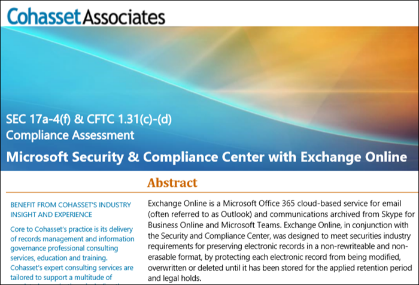

# Usare Exchange Online e il Centro sicurezza e conformità per conformarsi alla regola SEC 17a-4Use Exchange Online and the Security & Compliance Center to comply with SEC Rule 17a-4

>*[Indicazioni per l'assegnazione di licenze di Microsoft 365 per sicurezza e conformità](https://aka.ms/ComplianceSD).**[Microsoft 365 licensing guidance for security & compliance](https://aka.ms/ComplianceSD).*

If your organization needs to comply with regulatory standards for retaining your data, the Security & Compliance Center provides features to manage the lifecycle of your data in Exchange Online.If your organization needs to comply with regulatory standards for retaining your data, the Security & Compliance Center provides features to manage the lifecycle of your data in Exchange Online. This includes the ability to retain, audit, search, and export your data.This includes the ability to retain, audit, search, and export your data. These capabilities are sufficient to meet the needs of most organizations.These capabilities are sufficient to meet the needs of most organizations.

However, some organizations in highly regulated industries are subject to more stringent regulatory requirements.However, some organizations in highly regulated industries are subject to more stringent regulatory requirements. For example, financial institutions such as banks or broker dealers are subject to Rule 17a-4 issued by the Securities and Exchange Commission (SEC).For example, financial institutions such as banks or broker dealers are subject to Rule 17a-4 issued by the Securities and Exchange Commission (SEC). Rule 17a-4 has specific requirements for electronic data storage, including many aspects of record management, such as the duration, format, quality, availability, and accountability of records retention.Rule 17a-4 has specific requirements for electronic data storage, including many aspects of record management, such as the duration, format, quality, availability, and accountability of records retention.

Per aiutare queste organizzazioni a comprendere meglio in che modo è possibile sfruttare il Centro sicurezza e conformità per soddisfare gli obblighi normativi per Exchange Online, in modo specifico in relazione ai requisiti della regola 17a-4, è stata rilasciata una valutazione in collaborazione con Cohasset Associates.To help these organizations better understand how the Security & Compliance Center can be leveraged to meet their regulatory obligations for Exchange Online, specifically in relation to Rule 17a-4 requirements, we have released an assessment in partnership with Cohasset Associates.

Cohasset validated that when Exchange Online and the Security & Compliance Center are configured as recommended, they meet the relevant storage requirements of CFTC Rule 1.31(c)-(d), FINRA Rule 4511, and SEC Rule 17a-4.Cohasset validated that when Exchange Online and the Security & Compliance Center are configured as recommended, they meet the relevant storage requirements of CFTC Rule 1.31(c)-(d), FINRA Rule 4511, and SEC Rule 17a-4. We targeted this set of rules because they represent the most prescriptive guidance globally for records retention for financial institutions.We targeted this set of rules because they represent the most prescriptive guidance globally for records retention for financial institutions.

## Scaricare la valutazione CohassetDownload the Cohasset assessment

È possibile [scaricare la valutazione Cohasset qui](https://servicetrust.microsoft.com/ViewPage/TrustDocuments?command=Download&downloadType=Document&downloadId=9fa8349d-a0c9-47d9-93ad-472aa0fa44ec&docTab=6d000410-c9e9-11e7-9a91-892aae8839ad_FAQ_and_White_Papers).You can [download the Cohasset assessment here](https://servicetrust.microsoft.com/ViewPage/TrustDocuments?command=Download&downloadType=Document&downloadId=9fa8349d-a0c9-47d9-93ad-472aa0fa44ec&docTab=6d000410-c9e9-11e7-9a91-892aae8839ad_FAQ_and_White_Papers).

## La valutazione è specifica per Exchange OnlineThis assessment is specific to Exchange Online

Note that this assessment is specific to Exchange Online.Note that this assessment is specific to Exchange Online. The assessment does not include other Microsoft 365 services such as SharePoint Online or OneDrive for Business, although we are planning support for those services with respect to SEC 17a-4 in the future.The assessment does not include other Microsoft 365 services such as SharePoint Online or OneDrive for Business, although we are planning support for those services with respect to SEC 17a-4 in the future.

It's important to understand that Skype for Business and Teams also store data in Exchange Online.It's important to understand that Skype for Business and Teams also store data in Exchange Online. Therefore, the assessment does cover messages from Skype for Business and channel and chat messages from Teams.Therefore, the assessment does cover messages from Skype for Business and channel and chat messages from Teams.

## L'uso della protezione dell'archiviazione è fondamentale per la configurazione consigliataUsing Preservation Lock is key to the recommended configuration

Highly regulated industries are often required to store electronic communications to meet the WORM (write once, read many) requirement.Highly regulated industries are often required to store electronic communications to meet the WORM (write once, read many) requirement. The WORM requirement dictates a storage solution in which a record must be:The WORM requirement dictates a storage solution in which a record must be:

- Conservato per un periodo di conservazione necessario che non può essere abbreviato, ma solo aumentato.Retained for a required retention period that cannot be shortened, only increased.
- Non modificabile, ovvero il record non può essere sovrascritto, cancellato né modificato durante il periodo di conservazione necessario.Immutable, meaning that the record cannot be overwritten, erased, or altered during the required retention period.

In Exchange Online, when a [retention policy](retention-policies.md) is applied to a user's mailbox, all the user's content will be retained based on the criteria of the policy.In Exchange Online, when a [retention policy](retention-policies.md) is applied to a user's mailbox, all the user's content will be retained based on the criteria of the policy. In fact, if a user attempts to delete or modify an email, a copy of the email before the change is made will be preserved in a secure, hidden location in the user's mailbox.In fact, if a user attempts to delete or modify an email, a copy of the email before the change is made will be preserved in a secure, hidden location in the user's mailbox. Retention policies can help ensure that an organization retains electronic communications, but those policies can be modified.Retention policies can help ensure that an organization retains electronic communications, but those policies can be modified.

By placing a Preservation Lock on a retention policy, an organization ensures that the policy cannot be modified.By placing a Preservation Lock on a retention policy, an organization ensures that the policy cannot be modified. In fact, after a Preservation Lock is applied to a retention policy, the following actions are restricted:In fact, after a Preservation Lock is applied to a retention policy, the following actions are restricted:

- Il periodo di conservazione dei criteri può essere solo aumentato, ma non ridotto.The retention period of the policy can only be increased, not shortened.
- È possibile aggiungere gli utenti ai criteri, ma non rimuoverli.Users can be added to the policy, but no user can be removed.
- Un amministratore non può eliminare il criterio di conservazione.The retention policy cannot be deleted by an administrator.

La protezione dell'archiviazione consente di soddisfare i requisiti normativi della regola SEC 17a-4.Preservation Lock can help you meet the SEC 17a-4 regulatory requirements.

## Come configurare la protezione dell'archiviazioneHow to set up Preservation Lock

È possibile bloccare i criteri di conservazione con PowerShell.You can lock a retention policy by using PowerShell. Per altre informazioni, vedere [Usare la protezione dell'archiviazione per la conformità ai requisiti normativi](retention-policies.md#use-preservation-lock-to-comply-with-regulatory-requirements).For more information, see [Use Preservation Lock to comply with regulatory requirements](retention-policies.md#use-preservation-lock-to-comply-with-regulatory-requirements).

## Limitazioni noteKnown limitations

Sono attualmente previste alcune limitazioni per Exchange Online:Currently, there are a few limitations for Exchange Online:

- Le comunicazioni in thread non sono disponibili per i messaggi di chat e canali di Teams.Threaded communications are not available for Teams chat and channel messages.
- Gli apprezzamenti per i messaggi di chat e canali di Teams non vengono conservati.Likes are not retained for Teams chat and channel messages.

> [!NOTE]
> Il controllo a livello di elemento è ora disponibile per le cassette postali di gruppo di Microsoft 365.Item-level auditing is now available for Microsoft 365 group mailboxes. Per altre informazioni, vedere [Gestire il controllo delle cassette postali](enable-mailbox-auditing.md).For more information, see [Manage mailbox auditing](enable-mailbox-auditing.md).
