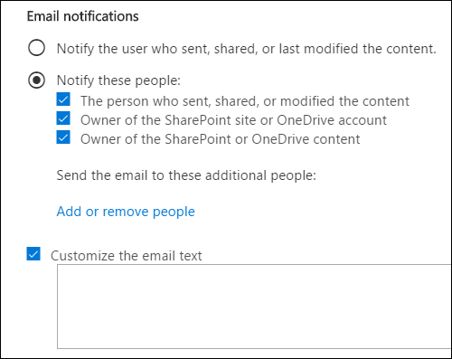
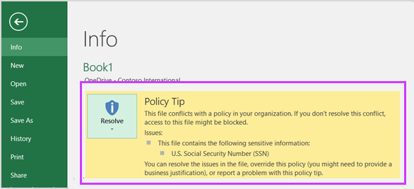

# Inviare notifiche di posta elettronica e visualizzare i suggerimenti per i criteri di prevenzione della perdita dei datiSend email notifications and show policy tips for DLP policies

È possibile utilizzare un criterio di prevenzione della perdita di dati (DLP) per identificare, controllare e proteggere le informazioni riservate in Office 365.You can use a data loss prevention (DLP) policy to identify, monitor, and protect sensitive information across Office 365. Si desidera che le persone dell'organizzazione che lavorano con queste informazioni riservate rimangano conformi ai criteri DLP, ma non si desidera impedire loro inutilmente di lavorare.You want people in your organization who work with this sensitive information to stay compliant with your DLP policies, but you don't want to block them unnecessarily from getting their work done. In questo scenario possono risultare utili le notifiche tramite posta elettronica e i suggerimenti per i criteri.This is where email notifications and policy tips can help.
  

  
Un suggerimento per i criteri è una notifica o un avviso che viene visualizzato quando un utente utilizza contenuto in conflitto con un criterio DLP, ad esempio contenuto come una cartella di lavoro di Excel in un sito di OneDrive for Business che contiene informazioni personali e viene condiviso con un utente esterno.A policy tip is a notification or warning that appears when someone is working with content that conflicts with a DLP policy—for example, content like an Excel workbook on a OneDrive for Business site that contains personally identifiable information (PII) and is shared with an external user.
  
È possibile utilizzare le notifiche di posta elettronica e i suggerimenti per i criteri per aumentare la consapevolezza e contribuire a informare gli utenti sui criteri dell'organizzazione.You can use email notifications and policy tips to increase awareness and help educate people about your organization's policies. Puoi anche offrire agli utenti la possibilità di ignorare il criterio, in modo che non siano bloccati se hanno un'esigenza aziendale valida o se il criterio rileva un falso positivo.You can also give people the option to override the policy, so that they're not blocked if they have a valid business need or if the policy is detecting a false positive.
  
Nel Centro sicurezza e conformità, quando si crea un criterio &amp; DLP, è possibile configurare le notifiche utente per:In the Security &amp; Compliance Center, when you create a DLP policy, you can configure the user notifications to:
  
- Invia una notifica tramite posta elettronica alle persone che scegli per descrivere il problema.Send an email notification to the people you choose that describes the issue.
    
- Visualizzare un suggerimento per i criteri per il contenuto in conflitto con il criterio DLP:Display a policy tip for content that conflicts with the DLP policy:
    
  - Per la posta elettronica Outlook sul Web e Outlook 2013 e versioni successive, il suggerimento per i criteri viene visualizzato nella parte superiore di un messaggio sopra i destinatari durante la composizione del messaggio.For email in Outlook on the web and Outlook 2013 and later, the policy tip appears at the top of a message above the recipients while the message is being composed.
    
  - Per i documenti in un account OneDrive for Business o SharePoint Online, il suggerimento per i criteri è indicato da un'icona di avviso visualizzata nell'elemento.For documents in a OneDrive for Business account or SharePoint Online site, the policy tip is indicated by a warning icon that appears on the item. Per visualizzare ulteriori informazioni, è possibile  selezionare un elemento e quindi scegliere Icona riquadro Informazioni nell'angolo superiore destro della pagina  dettagli.To view more information, you can select an item and then choose **Information**  in the upper-right corner of the page to open the details pane. 
    
  - Per Excel, PowerPoint e documenti di Word archiviati in un sito di OneDrive for Business o in un sito di SharePoint Online incluso nel criterio DLP, il suggerimento per i criteri viene visualizzato sulla barra dei messaggi e nella visualizzazione Backstage ( **Informazioni** menu File \> ).For Excel, PowerPoint, and Word documents that are stored on a OneDrive for Business site or SharePoint Online site that's included in the DLP policy, the policy tip appears on the Message Bar and the Backstage view ( **File** menu \> **Info**).
    
## Aggiungere notifiche utente a un criterio DLPAdd user notifications to a DLP policy

Quando si crea un criterio DLP, è possibile abilitare **le notifiche utente.**When you create a DLP policy, you can enable **User notifications**. Quando le notifiche utente sono abilitate, Microsoft 365 invia notifiche tramite posta elettronica e suggerimenti sui criteri.When user notifications are enabled, Microsoft 365 sends out both email notifications and policy tips. È possibile personalizzare a chi vengono inviati i messaggi di posta elettronica di notifica, il testo del messaggio di posta elettronica e il testo del suggerimento per i criteri.You can customize who notification emails are sent to, the email text and the policy tip text.
  
1. Passare a [https://protection.office.com](https://protection.office.com).Go to [https://protection.office.com](https://protection.office.com).
    
2. Accedere usando l'account di lavoro o della scuola.Sign in using your work or school account. Si è ora nel Centro &amp; sicurezza e conformità.You're now in the Security &amp; Compliance Center.
    
3. Nel riquadro di spostamento a sinistra del Centro sicurezza e conformità Criteri di prevenzione della &amp; \> \> **perdita** \>  \> **dei dati + Crea un criterio**.In the Security &amp; Compliance Center \> left navigation \> **Data loss prevention** \> **Policy** \> **+ Create a policy**.
    
    
  
4. Scegliere il modello di criteri DLP che protegge i tipi di informazioni riservate necessarie per \> **next**.Choose the DLP policy template that protects the types of sensitive information that you need \> **Next**.
    
    Per iniziare con un modello vuoto, scegliere **Criteri** \> **personalizzati personalizzati** \> **Avanti.**To start with an empty template, choose **Custom** \> **Custom policy** \> **Next**.
    
5. Assegnare al criterio il nome \> **Next**.Name the policy \> **Next**.
    
6. Per scegliere i percorsi che si desidera proteggere dal criterio DLP, eseguire una delle operazioni seguenti:To choose the locations that you want the DLP policy to protect, do one of the following:
    
   - Scegliere **Tutte le posizioni in Office 365** \> **Avanti**.Choose **All locations in Office 365** \> **Next**.
    
   - Scegliere **Consenti di scegliere posizioni specifiche** \> **Avanti.**Choose **Let me choose specific locations** \> **Next**.
    
   Per includere o escludere un'intera posizione, ad esempio tutti Exchange di  posta elettronica o tutti gli account OneDrive, attivare o disattivare lo stato di tale posizione.To include or exclude an entire location such as all Exchange email or all OneDrive accounts, switch the **Status** of that location on or off. 
    
   Per includere solo siti SharePoint o account OneDrive specifici,  impostare lo stato su Attiva e quindi fare clic sui collegamenti **in** Includi per scegliere siti o account specifici.To include only specific SharePoint sites or OneDrive accounts, switch the **Status** to on, and then click the links under **Include** to choose specific sites or accounts. 
    
7. Scegliere **Usa impostazioni avanzate** \> **Avanti.**Choose **Use advanced settings** \> **Next**.
    
8. Scegliere **+ Nuova regola**.Choose **+ New rule**.
    
9. Nell'editor delle regole, in **Notifiche utente,** attivare lo stato.In the rule editor, under **User notifications**, switch the status on.
    
    

> [!NOTE]
> I criteri DLP si applicano a tutti i documenti che corrispondono al criterio, indipendentemente dal fatto che siano nuovi o esistenti.DLP policies apply to all documents that match the policy, whether those documents are new or existing. Tuttavia, una notifica tramite posta elettronica viene generata solo quando il nuovo contenuto corrisponde a un criterio DLP esistente.However, an email notification is only generated when new content matches an existing DLP policy. Il contenuto esistente è protetto, ma non genererà una notifica utente tramite posta elettronica.Existing content is protected, but will not generate a user notification via email.
  
## Opzioni di configurazione delle notifiche di posta elettronicaOptions for configuring email notifications

Per ogni regola in un criterio DLP, è possibile:For each rule in a DLP policy, you can:
  
- Inviare la notifica agli utenti selezionati. Questi utenti possono essere il proprietario del contenuto, l'autore dell'ultima modifica apportata al contenuto, il proprietario del sito in cui è archiviato il contenuto o un utente specifico.Send the notification to the people you choose. These people can include the owner of the content, the person who last modified the content, the owner of the site where the content is stored, or a specific user.
    
- Personalizza il testo incluso nella notifica usando HTML o token.Customize the text that's included in the notification by using HTML or tokens. Per altre informazioni, vedere la sezione seguente.See the section below for more information.
    
> [!NOTE]
>  Le notifiche tramite posta elettronica possono essere inviate solo a singoli destinatari, non a gruppi o liste di distribuzione.Email notifications can be sent only to individual recipients—not groups or distribution lists. Solo i nuovi contenuti attivano una notifica di posta elettronica.Only new content will trigger an email notification. La modifica del contenuto esistente attiverà suggerimenti per i criteri, ma non una notifica tramite posta elettronica.Editing existing content will trigger policy tips, but not an email notification. 
  

  
### Notifica di posta elettronica predefinitaDefault email notification

Le notifiche hanno una riga Oggetto che inizia con l'azione eseguita, ad esempio "Notifica", "Messaggio bloccato" per la posta elettronica o "Accesso bloccato" per i documenti.Notifications have a Subject line that begins with the action taken, such as "Notification", "Message Blocked" for email, or "Access Blocked" for documents. Se la notifica riguarda un documento, il corpo del messaggio di notifica include un collegamento che consente di accedere al sito in cui è archiviato il documento e di aprire il suggerimento per i criteri per il documento, in cui è possibile risolvere eventuali problemi (vedere la sezione seguente sui suggerimenti per i criteri).If the notification is about a document, the notification message body includes a link that takes you to the site where the document's stored and opens the policy tip for the document, where you can resolve any issues (see the section below about policy tips). Se la notifica riguarda un messaggio, la notifica include come allegato il messaggio corrispondente a un criterio DLP.If the notification is about a message, the notification includes as an attachment the message that matches a DLP policy.
  

  
Per impostazione predefinita, le notifiche consentono di visualizzare testo simile a quanto segue per un elemento in un sito. Il testo di notifica è configurato separatamente per ogni regola affinché venga visualizzato in modo diverso a seconda della regola che viene soddisfatta.By default, notifications display text similar to the following for an item on a site. The notification text is configured separately for each rule, so the text that's displayed differs depending on which rule is matched.

|**Se la regola del criterio DLP…****If the DLP policy rule does this…**|**La notifica predefinita per i documenti SharePoint o OneDrive for Business viene SharePoint questo messaggio.****Then the default notification for SharePoint or OneDrive for Business documents says this…**|**La notifica predefinita per i Outlook messaggio indica questo...****Then the default notification for Outlook messages says this…**|
|:-----|:-----|:-----|
|Invia una notifica ma non consente l'overrideSends a notification but doesn't allow override    |Questo elemento è in conflitto con un criterio dell'organizzazione.This item conflicts with a policy in your organization.    |Il messaggio di posta elettronica è in conflitto con un criterio nell'organizzazione.Your email message conflicts with a policy in your organization.    |
|Blocca l'accesso, invia una notifica e consente di ignorarlaBlocks access, sends a notification, and allows override    |Questo elemento è in conflitto con un criterio dell'organizzazione.This item conflicts with a policy in your organization. Se non si risolve il conflitto, l'accesso a questo file potrebbe essere bloccato.If you don't resolve this conflict, access to this file might be blocked.    |Il messaggio di posta elettronica è in conflitto con un criterio nell'organizzazione.Your email message conflicts with a policy in your organization. Il messaggio non è stato recapitato a tutti i destinatari.The message wasn't delivered to all recipients.    |
|Blocca l'accesso e invia una notificaBlocks access and sends a notification    |Questo elemento è in conflitto con un criterio dell'organizzazione. L'accesso a questo elemento è limitato al proprietario, all'autore dell'ultima modifica e all'amministratore della raccolta siti principale.This item conflicts with a policy in your organization. Access to this item is blocked for everyone except its owner, last modifier, and the primary site collection administrator.    |Il messaggio di posta elettronica è in conflitto con un criterio nell'organizzazione.Your email message conflicts with a policy in your organization. Il messaggio non è stato recapitato a tutti i destinatari.The message wasn't delivered to all recipients.    |
   
### Notifica di posta elettronica personalizzataCustom email notification

È possibile creare una notifica di posta elettronica personalizzata anziché inviare la notifica di posta elettronica predefinita agli utenti finali o agli amministratori.You can create a custom email notification instead of sending the default email notification to your end users or admins. La notifica di posta elettronica personalizzata supporta HTML e ha un limite di 5.000 caratteri.The custom email notification supports HTML and has a 5,000-character limit. Puoi usare HTML per includere immagini, formattazione e altre personalizzazione nella notifica.You can use HTML to include images, formatting, and other branding in the notification.
  
Puoi anche usare i token seguenti per personalizzare la notifica tramite posta elettronica.You can also use the following tokens to help customize the email notification. Questi token sono variabili che vengono sostituite da informazioni specifiche nella notifica inviata.These tokens are variables that are replaced by specific information in the notification that's sent.

|**Token****Token**|**Descrizione****Description**|
|:-----|:-----|
|%%AppliedActions%%%%AppliedActions%%    |Azioni applicate al contenuto.The actions applied to the content.    |
|%%ContentURL%%%%ContentURL%%    |URL del documento nel sito SharePoint Online o OneDrive for Business sito.The URL of the document on the SharePoint Online site or OneDrive for Business site.    |
|%%MatchedConditions%%%%MatchedConditions%%    |Condizioni che sono state soddisfatte dal contenuto.The conditions that were matched by the content. Usa questo token per informare gli utenti dei possibili problemi con il contenuto.Use this token to inform people of possible issues with the content.    |
   

  
## Opzioni di configurazione dei suggerimenti per i criteriOptions for configuring policy tips

Per ogni regola in un criterio DLP, è possibile configurare suggerimenti per i criteri per:For each rule in a DLP policy, you can configure policy tips to:
  
- Informare l'utente che il contenuto è in conflitto con un criterio DLP, affinché possa intervenire per risolvere il conflitto.Simply notify the person that the content conflicts with a DLP policy, so that they can take action to resolve the conflict. È possibile utilizzare il testo predefinito (vedere le tabelle seguenti) o immettere testo personalizzato sui criteri specifici dell'organizzazione.You can use the default text (see the tables below) or enter custom text about your organization's specific policies.
    
- Consentire all'utente di ignorare il criterio DLP. In alternativa, è possibile:Allow the person to override the DLP policy. Optionally, you can:
    
  - Richiedere all'utente di immettere una motivazione aziendale per ignorare il criterio.Require the person to enter a business justification for overriding the policy. Queste informazioni vengono registrate ed è possibile visualizzarle nei report DLP nella **sezione Report** del Centro &amp; sicurezza e conformità.This information is logged and you can view it in the DLP reports in the **Reports** section of the Security &amp; Compliance Center. 
    
  - Consentire all'utente di segnalare un falso positivo e di ignorare il criterio DLP. Anche questa informazione viene registrata per il report affinché sia possibile utilizzare falsi positivi per ottimizzare le regole.Allow the person to report a false positive and override the DLP policy. This information is also logged for reporting, so that you can use false positives to fine tune your rules.
    

  
Ad esempio, potrebbe essere applicato un criterio DLP ai siti OneDrive for Business che rilevano informazioni personali e questo criterio dispone di tre regole:For example, you may have a DLP policy applied to OneDrive for Business sites that detects personally identifiable information (PII), and this policy has three rules:
  
1. Prima regola: Se vengono rilevate meno di cinque istanze di queste informazioni riservate in un documento e il documento è condiviso con utenti interni all'organizzazione, l'azione **Invia una notifica** mostra un suggerimento per i criteri. Non sono necessarie opzioni per ignorare i suggerimenti per i criteri perché la regola sta semplicemente informando l'utente senza bloccargli l'accesso.First rule: If fewer than five instances of this sensitive information are detected in a document, and the document is shared with people inside the organization, the **Send a notification** action displays a policy tip. For policy tips, no override options are necessary because this rule is simply notifying people and not blocking access. 
    
2. Seconda regola: Se vengono rilevate più di cinque istanze di queste informazioni riservate in un documento e il documento è condiviso con utenti interni all'organizzazione, l'azione **Blocca accesso al contenuto** limita le autorizzazioni per il file e l'azione **Invia una notifica** consente agli utenti di ignorare le azioni in questa regola fornendo una motivazione aziendale.Second rule: If greater than five instances of this sensitive information are detected in a document, and the document is shared with people inside the organization, the **Block access to content** action restricts the permissions for the file, and the **Send a notification** action allows people to override the actions in this rule by providing a business justification. L'azienda dell'organizzazione a volte richiede agli utenti interni di condividere i dati delle informazioni personali e non si desidera che il criterio DLP blocchi questo lavoro.Your organization's business sometimes requires internal people to share PII data, and you don't want your DLP policy to block this work. 
    
3. Terza regola: Se vengono rilevate più di cinque istanze di queste informazioni riservate in un documento e il documento è condiviso con utenti esterni all'organizzazione, l'azione **Blocca accesso al contenuto** limita le autorizzazioni per il file e l'azione **Invia una notifica** non consente agli utenti di ignorare le azioni in questa regola perché l'informazione è condivisa esternamente. In nessun caso gli utenti dell'organizzazione possono condividere dati PII all'esterno dell'organizzazione.Third rule: If greater than five instances of this sensitive information are detected in a document, and the document is shared with people outside the organization, the **Block access to content** action restricts the permissions for the file, and the **Send a notification** action does not allow people to override the actions in this rule because the information is shared externally. Under no circumstances should people in your organization be allowed to share PII data outside the organization. 
    
Di seguito sono riportati alcuni punti per comprendere l'utilizzo di un suggerimento per i criteri per ignorare una regola:Here are some fine points to understand about using a policy tip to override a rule:
  
- L'opzione per eseguire l'override è per regola e sostituisce tutte le azioni nella regola (ad eccezione dell'invio di una notifica, che non può essere ignorata).The option to override is per rule, and it overrides all of the actions in the rule (except sending a notification, which can't be overridden).
    
- È possibile che il contenuto corrisponda a diverse regole in un criterio DLP, ma verrà visualizzato solo il suggerimento per i criteri della regola più restrittiva e con priorità più alta.It's possible for content to match several rules in a DLP policy, but only the policy tip from the most restrictive, highest-priority rule will be shown. Ad esempio, verrà visualizzato un suggerimento per i criteri di una regola che blocca l'accesso al contenuto rispetto a un suggerimento per i criteri di una regola che invia semplicemente una notifica.For example, a policy tip from a rule that blocks access to content will be shown over a policy tip from a rule that simply sends a notification. In questo modo, gli utenti evitano di dover leggere troppi suggerimenti per i criteri.This prevents people from seeing a cascade of policy tips.
    
- 	Se i suggerimenti per i criteri nella regola più restrittiva permettono agli utenti di eseguire l'override della regola, l'override di questa regola comporta anche l'override di qualsiasi altra regola corrispondente al contenuto. If the policy tips in the most restrictive rule allow people to override the rule, then overriding this rule also overrides any other rules that the content matched.
    
## Suggerimenti per i criteri nei siti OneDrive for Business e SharePoint OnlinePolicy tips on OneDrive for Business sites and SharePoint Online sites

Quando un documento in un sito di OneDrive for Business o in un sito di SharePoint Online corrisponde a una regola in un criterio DLP e tale regola utilizza suggerimenti per i criteri, i suggerimenti per i criteri visualizzano icone speciali nel documento:When a document on a OneDrive for Business site or SharePoint Online site matches a rule in a DLP policy, and that rule uses policy tips, the policy tips display special icons on the document:
  
1. Se la regola invia una notifica relativa al file, viene visualizzata l'icona di avviso.If the rule sends a notification about the file, the warning icon appears.
    
2. Se la regola blocca l'accesso al documento, viene visualizzata l'icona di blocco.If the rule blocks access to the document, the blocked icon appears.
    
   
  
Per eseguire un'azione su un documento, è possibile selezionare un elemento scegliere l'icona del riquadro Informazioni nell'angolo superiore destro della pagina per aprire il riquadro dei dettagli Visualizza suggerimento \>   \> **criteri.**To take action on a document, you can select an item \> choose **Information**  in the upper-right corner of the page to open the details pane \> **View policy tip**.
  
Il suggerimento per i criteri elenca i problemi con il contenuto e, se i suggerimenti per i criteri sono configurati con queste opzioni, è possibile selezionare **Risolvi** e quindi **ignorare** il suggerimento per i criteri oppure **segnalare** un falso positivo.The policy tip lists the issues with the content, and if the policy tips are configured with these options, you can choose **Resolve**, and then **Override** the policy tip or **Report** a false positive. 
  

  

  
I criteri DLP sono sincronizzati con i siti e il contenuto viene valutato periodicamente e in modo asincrono, quindi potrebbe esserci un breve ritardo tra il momento in cui viene creato il criterio DLP e il momento in cui si iniziano a visualizzare i suggerimenti per i criteri. Potrebbe verificarsi un ritardo simile da quando si risolve o si ignora un suggerimento per i criteri a quando scompare l'icona sul documento nel sito.DLP policies are synced to sites and contented is evaluated against them periodically and asynchronously, so there may be a short delay between the time you create the DLP policy and the time you begin to see policy tips. There may be a similar delay from when you resolve or override a policy tip to when the icon on the document on the site goes away.
  
### Testo predefinito per i suggerimenti dei criteri nei sitiDefault text for policy tips on sites

Per impostazione predefinita, i suggerimenti per i criteri consentono di visualizzare testo simile a quanto segue per un elemento in un sito. Il testo di notifica è configurato separatamente per ogni regola affinché venga visualizzato in modo diverso a seconda della regola che viene soddisfatta.By default, policy tips display text similar to the following for an item on a site. The notification text is configured separately for each rule, so the text that's displayed differs depending on which rule is matched.

|**Se la regola del criterio DLP…****If the DLP policy rule does this…**|**Nel suggerimento per i criteri predefinito viene visualizzato…****Then the default policy tip says this…**|
|:-----|:-----|
|Invia una notifica ma non consente l'overrideSends a notification but doesn't allow override    |Questo elemento è in conflitto con un criterio dell'organizzazione.This item conflicts with a policy in your organization.    |
|Blocca l'accesso, invia una notifica e consente di ignorarlaBlocks access, sends a notification, and allows override    |Questo elemento è in conflitto con un criterio dell'organizzazione.This item conflicts with a policy in your organization. Se non si risolve il conflitto, l'accesso a questo file potrebbe essere bloccato.If you don't resolve this conflict, access to this file might be blocked.    |
|Blocca l'accesso e invia una notificaBlocks access and sends a notification    |Questo elemento è in conflitto con un criterio dell'organizzazione. L'accesso a questo elemento è limitato al proprietario, all'autore dell'ultima modifica e all'amministratore della raccolta siti principale.This item conflicts with a policy in your organization. Access to this item is blocked for everyone except its owner, last modifier, and the primary site collection administrator.    |
   
### Testo personalizzato per i suggerimenti sui criteri nei sitiCustom text for policy tips on sites

È possibile personalizzare il testo per i suggerimenti sui criteri separatamente dalla notifica tramite posta elettronica.You can customize the text for policy tips separately from the email notification. A differenza del testo personalizzato per le notifiche di posta elettronica (vedere la sezione precedente), il testo personalizzato per i suggerimenti per i criteri non accetta html o token.Unlike custom text for email notifications (see above section), custom text for policy tips does not accept HTML or tokens. Il testo personalizzato per i suggerimenti per i criteri è invece solo testo normale con un limite di 256 caratteri.Instead, custom text for policy tips is plain text only with a 256-character limit.
  
## Suggerimenti per i criteri Outlook sul Web e Outlook 2013 e versioni successivePolicy tips in Outlook on the web and Outlook 2013 and later

Quando si compone un nuovo messaggio di posta elettronica in Outlook sul Web e Outlook 2013 e versioni successive, verrà visualizzato un suggerimento per i criteri se si aggiunge contenuto che corrisponde a una regola in un criterio DLP e tale regola utilizza suggerimenti per i criteri.When you compose a new email in Outlook on the web and Outlook 2013 and later, you'll see a policy tip if you add content that matches a rule in a DLP policy, and that rule uses policy tips. Il suggerimento per i criteri viene visualizzato nella parte superiore del messaggio, sopra i destinatari, mentre il messaggio viene composto.The policy tip appears at the top of the message, above the recipients, while the message is being composed.
  

  
I suggerimenti per i criteri funzionano indipendentemente dal fatto che le informazioni riservate siano visualizzate nel corpo del messaggio, nella riga dell'oggetto o persino in un allegato del messaggio, come illustrato di seguito.Policy tips work whether the sensitive information appears in the message body, subject line, or even a message attachment as shown here.
  

  
Se i suggerimenti per i criteri sono  configurati per consentire l'override, è possibile scegliere Mostra dettagli Sostituzione immettere una giustificazione aziendale o \>  \> segnalare un falso positivo \> **Override**.If the policy tips are configured to allow override, you can choose **Show Details** \> **Override** \> enter a business justification or report a false positive \> **Override**.
  

  

  
Si noti che quando si aggiungono informazioni riservate a un messaggio di posta elettronica, potrebbe verificarsi una latenza tra quando vengono aggiunte le informazioni riservate e quando viene visualizzato il suggerimento per i criteri.Note that when you add sensitive information to an email, there may be latency between when the sensitive information is added and when the policy tip appears.

### Outlook 2013 e versioni successive supporta la visualizzazione di suggerimenti per i criteri solo per alcune condizioniOutlook 2013 and later supports showing policy tips for only some conditions

Attualmente, Outlook 2013 e versioni successive supporta la visualizzazione di suggerimenti sui criteri solo per queste condizioni:Currently, Outlook 2013 and later supports showing policy tips only for these conditions:

- Il contenuto contieneContent contains
- Il contenuto è condivisoContent is shared

Tieni presente che le eccezioni sono considerate condizioni e tutte queste condizioni funzionano in Outlook, dove corrisponderanno al contenuto e applieranno azioni di protezione sul contenuto.Note that Exceptions are considered conditions and all of these conditions work in Outlook, where they will match content and enforce protective actions on content. Tuttavia, la visualizzazione di suggerimenti per i criteri per gli utenti non è ancora supportata.But showing policy tips to users is not yet supported. 
  
### Suggerimenti per i criteri nell'Exchange di amministrazione e nel Centro &amp; sicurezza e conformitàPolicy tips in the Exchange admin center vs. the Security &amp; Compliance Center

I suggerimenti per i criteri possono funzionare con i criteri DLP e le regole del flusso di posta creati nell'interfaccia di amministrazione di Exchange oppure con i criteri DLP creati nel Centro sicurezza e conformità, ma non con &amp; entrambi.Policy tips can work either with DLP policies and mail flow rules created in the Exchange admin center, or with DLP policies created in the Security &amp; Compliance Center, but not both. Questo perché questi criteri sono archiviati in posizioni diverse, ma i suggerimenti per i criteri possono essere attingere solo da un'unica posizione.This is because these policies are stored in different locations, but policy tips can draw only from a single location.
  
Se sono stati configurati suggerimenti per i criteri nell'interfaccia di amministrazione di Exchange, eventuali suggerimenti per i criteri configurati nel Centro sicurezza e conformità non verranno visualizzati agli utenti in Outlook sul Web e Outlook 2013 e versioni successive fino a quando non si disattivano i suggerimenti nell'interfaccia di amministrazione di &amp; Exchange.If you've configured policy tips in the Exchange admin center, any policy tips that you configure in the Security &amp; Compliance Center won't appear to users in Outlook on the web and Outlook 2013 and later until you turn off the tips in the Exchange admin center. In questo modo, le regole correnti Exchange flusso di posta (note anche come regole di trasporto) continueranno a funzionare fino a quando non si sceglie di passare al Centro sicurezza &amp; e conformità.This ensures that your current Exchange mail flow rules (also known as transport rules) will continue to work until you choose to switch over to the Security &amp; Compliance Center.
  
Tieni presente che, anche se i suggerimenti per i criteri possono essere attingere solo da un'unica posizione, le notifiche di posta elettronica vengono sempre inviate, anche se si usano i criteri DLP sia nel Centro sicurezza e conformità che nell'interfaccia di amministrazione di &amp; Exchange.Note that while policy tips can draw only from a single location, email notifications are always sent, even if you're using DLP policies in both the Security &amp; Compliance Center and the Exchange admin center.
  
### Testo predefinito per i suggerimenti per i criteri nella posta elettronicaDefault text for policy tips in email

Per impostazione predefinita, i suggerimenti per i criteri visualizzano testo simile al seguente per la posta elettronica.By default, policy tips display text similar to the following for email.

|**Se la regola del criterio DLP…****If the DLP policy rule does this…**|**Nel suggerimento per i criteri predefinito viene visualizzato…****Then the default policy tip says this…**|
|:-----|:-----|
|Invia una notifica ma non consente l'overrideSends a notification but doesn't allow override    |La posta elettronica è in conflitto con un criterio nell'organizzazione.Your email conflicts with a policy in your organization.    |
|Blocca l'accesso, invia una notifica e consente di ignorarlaBlocks access, sends a notification, and allows override    |La posta elettronica è in conflitto con un criterio nell'organizzazione.Your email conflicts with a policy in your organization.    |
|Blocca l'accesso e invia una notificaBlocks access and sends a notification    |La posta elettronica è in conflitto con un criterio nell'organizzazione.Your email conflicts with a policy in your organization.    |
   
## Suggerimenti per i criteri Excel, PowerPoint e WordPolicy tips in Excel, PowerPoint, and Word

Quando gli utenti lavorano con contenuto sensibile nelle versioni desktop di Excel, PowerPoint e Word, i suggerimenti per i criteri possono notificare in tempo reale che il contenuto è in conflitto con un criterio DLP.When people work with sensitive content in the desktop versions of Excel, PowerPoint, and Word, policy tips can notify them in real time that the content conflicts with a DLP policy. Ciò richiede che:This requires that:
  
- Il documento di Office è archiviato in un sito OneDrive for Business o SharePoint Online.The Office document is stored on a OneDrive for Business site or SharePoint Online site.
    
- Il sito è incluso in un criterio DLP configurato per l'utilizzo di suggerimenti per i criteri.The site is included in a DLP policy that's configured to use policy tips.
    
Office i programmi desktop sincronizzano automaticamente i criteri DLP direttamente da Office 365 e quindi analizzano i documenti per assicurarsi che non siano in conflitto con i criteri DLP e visualizzare i suggerimenti sui criteri in tempo reale.Office desktop programs automatically sync DLP policies directly from Office 365, and then scan your documents to ensure that they don't conflict with your DLP policies and display policy tips in real time.

> [!NOTE]
> Office le app desktop analizzano i documenti stessi per determinare se devono essere visualizzati i suggerimenti per i criteri DLP; non visualizzano suggerimenti sui criteri che SharePoint siti online o OneDrive for Business già determinati devono essere visualizzati in un file.Office desktop apps scan documents themselves to determine if DLP policy tips should be shown; they do not show policy tips that SharePoint Online sites or OneDrive for Business sites have already determined should be shown on a file. Di conseguenza, potrebbe non essere sempre visualizzato un suggerimento per i criteri DLP nelle app desktop che vengono visualizzati nei siti di SharePoint Online o nei siti OneDrive for Business online.As a result, you may not always see a DLP policy tip in the desktop apps that you see in the SharePoint Online sites or OneDrive for Business sites. Al contrario, le applicazioni Office sul Web mostrano solo i suggerimenti per i criteri DLP che SharePoint Siti online o siti OneDrive for Business hanno già determinato dovrebbero essere visualizzati.In contrast, the Office applications on the web only show DLP policy tips that SharePoint Online sites or OneDrive for Business sites have already determined should be shown.
  
A seconda della modalità di configurazione dei suggerimenti per i criteri nel criterio DLP, gli utenti possono scegliere se ignorare semplicemente il suggerimento per i criteri, ignorare il criterio con o senza una motivazione aziendale oppure segnalare un falso positivo.Depending on how you configure the policy tips in the DLP policy, people can choose to simply ignore the policy tip, override the policy with or without a business justification, or report a false positive.
  
I suggerimenti per i criteri vengono visualizzati nella barra dei messaggi.Policy tips appear on the Message Bar.
  

  
I suggerimenti per i criteri sono visibili anche nella visualizzazione Backstage (nella scheda **File**).And policy tips also appear in the Backstage view (on the **File** tab). 
  

  
Se i suggerimenti per i criteri nel criterio DLP sono configurati con queste opzioni, è possibile selezionare **Risolvi** per **ignorare** un suggerimento per i criteri oppure **segnalare** un falso positivo.If policy tips in the DLP policy are configured with these options, you can choose **Resolve** to **Override** a policy tip or **Report** a false positive. 
  

  
In ognuno di questi Office desktop, gli utenti possono scegliere di disattivare i suggerimenti per i criteri.In each of these Office desktop programs, people can choose to turn off policy tips. Se disattivati, i suggerimenti per i criteri che sono delle semplici notifiche non vengono visualizzati nella barra dei messaggi o nella visualizzazione Backstage (nella scheda **File**).If turned off, policy tips that are simple notifications will not appear on the Message Bar or Backstage view (on the **File** tab). Tuttavia, i suggerimenti per i criteri di blocco o sostituzione continuano a essere visualizzati e a ricevere notifiche di posta elettronica.However, policy tips about blocking and overriding will still appear, and they will still receive the email notification. Inoltre, la disattivazione dei suggerimenti per i criteri non esclude il documento da eventuali criteri DLP che vi sono stati applicati.In addition, turning off policy tips does not exempt the document from any DLP policies that have been applied to it. 
  
### Testo predefinito per i suggerimenti per i criteri in Excel 2016, PowerPoint 2016 e Word 2016Default text for policy tips in Excel 2016, PowerPoint 2016, and Word 2016

Per impostazione predefinita, i suggerimenti per i criteri mostrano un testo simile a quanto segue nella barra dei messaggi e nella visualizzazione Backstage di un documento aperto. Il testo di notifica è configurato separatamente per ogni regola affinché venga visualizzato in modo diverso a seconda della regola che viene soddisfatta.By default, policy tips display text similar to the following on the Message Bar and Backstage view of an open document. The notification text is configured separately for each rule, so the text that's displayed differs depending on which rule is matched.

|**Se la regola del criterio DLP…****If the DLP policy rule does this…**|**Nel suggerimento per i criteri predefinito viene visualizzato…****Then the default policy tip says this…**|
|:-----|:-----|
|Invia una notifica ma non consente l'overrideSends a notification but doesn't allow override    |Il file è in conflitto con un criterio dell'organizzazione.This file conflicts with a policy in your organization. Per altre informazioni, vai al menu **File.**Go to the **File** menu for more information.    |
|Blocca l'accesso, invia una notifica e consente di ignorarlaBlocks access, sends a notification, and allows override    |Il file è in conflitto con un criterio dell'organizzazione.This file conflicts with a policy in your organization. Se non si risolve il conflitto, l'accesso a questo file potrebbe essere bloccato.If you don't resolve this conflict, access to this file might be blocked. Per altre informazioni, vai al menu **File.**Go to the **File** menu for more information.    |
|Blocca l'accesso e invia una notificaBlocks access and sends a notification    |Il file è in conflitto con un criterio dell'organizzazione.This file conflicts with a policy in your organization. Se non si risolve il conflitto, l'accesso a questo file potrebbe essere bloccato.If you don't resolve this conflict, access to this file might be blocked. Per altre informazioni, vai al menu **File.**Go to the **File** menu for more information.    |
   
### Testo personalizzato per i suggerimenti per i criteri in Excel, PowerPoint e WordCustom text for policy tips in Excel, PowerPoint, and Word

È possibile personalizzare il testo per i suggerimenti sui criteri separatamente dalla notifica tramite posta elettronica.You can customize the text for policy tips separately from the email notification. A differenza del testo personalizzato per le notifiche di posta elettronica (vedere la sezione precedente), il testo personalizzato per i suggerimenti per i criteri non accetta html o token.Unlike custom text for email notifications (see above section), custom text for policy tips does not accept HTML or tokens. Il testo personalizzato per i suggerimenti per i criteri è invece solo testo normale con un limite di 256 caratteri.Instead, custom text for policy tips is plain text only with a 256-character limit.
  
## Altre informazioniMore information

- [Informazioni sulla prevenzione della perdita di datiLearn about data loss prevention](dlp-learn-about-dlp.md)    
- [Creare un criterio di prevenzione della perdita dei dati da un modelloCreate a DLP policy from a template](create-a-dlp-policy-from-a-template.md)
- [Condizioni, eccezioni e azioni dei criteri DLP (anteprima)DLP policy conditions, exceptions, and actions (preview)](./dlp-microsoft-teams.md) 
- [Creare criteri di prevenzione della perdita dei dati per proteggere i documenti con FCI o altre proprietàCreate a DLP policy to protect documents with FCI or other properties](protect-documents-that-have-fci-or-other-properties.md)
- [Elementi inclusi nei modelli dei criteri di prevenzione della perdita dei datiWhat the DLP policy templates include](what-the-dlp-policy-templates-include.md)
- [Definizioni delle entità tipo di informazioni sensibiliSensitive information type entity definitions](sensitive-information-type-entity-definitions.md)