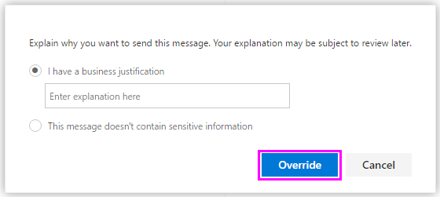

# Inviare notifiche di posta elettronica e visualizzare i suggerimenti per i criteri di prevenzione della perdita dei dati

È possibile utilizzare un criterio di prevenzione della perdita di dati (DLP) per identificare, controllare e proteggere le informazioni riservate in Office 365. Si desidera che le persone dell'organizzazione che lavorano con queste informazioni riservate rimangano conformi ai criteri DLP, ma non si desidera impedire loro inutilmente di lavorare. In questo scenario possono risultare utili le notifiche tramite posta elettronica e i suggerimenti per i criteri.

Un suggerimento per i criteri è una notifica o un avviso che viene visualizzato quando un utente utilizza contenuto in conflitto con un criterio DLP, ad esempio contenuto come una cartella di lavoro di Excel in un sito di OneDrive for Business che contiene informazioni personali e viene condiviso con un utente esterno.

È possibile utilizzare le notifiche di posta elettronica e i suggerimenti per i criteri per aumentare la consapevolezza e contribuire a informare gli utenti sui criteri dell'organizzazione. Puoi anche offrire agli utenti la possibilità di ignorare il criterio, in modo che non siano bloccati se hanno un'esigenza aziendale valida o se il criterio rileva un falso positivo.

Nel Centro conformità, quando si crea un criterio DLP, è possibile configurare le notifiche utente per:

- Invia una notifica tramite posta elettronica alle persone che scegli per descrivere il problema.
> [!NOTE]
> I messaggi di posta elettronica di notifica vengono inviati senza protezione.

- Visualizzare un suggerimento per i criteri per il contenuto in conflitto con il criterio DLP:

  - Per la posta elettronica in Outlook sul web e Outlook 2013 e versioni successive, il suggerimento per i criteri viene visualizzato nella parte superiore di un messaggio sopra i destinatari durante la composizione del messaggio.

  - Per i documenti in un account OneDrive for Business o SharePoint Online, il suggerimento per i criteri è indicato da un'icona di avviso visualizzata nell'elemento. Per visualizzare ulteriori informazioni, è possibile  selezionare un elemento e quindi scegliere Icona riquadro Informazioni nell'angolo superiore destro della pagina  dettagli.

  - Per Excel, PowerPoint e documenti di Word archiviati in un sito di OneDrive for Business o in un sito di SharePoint Online incluso nel criterio DLP, il suggerimento per i criteri viene visualizzato sulla barra dei messaggi e nella visualizzazione Backstage (**Informazioni** menu File \> ).

## Aggiungere notifiche utente a un criterio DLP

Quando si crea un criterio DLP, è possibile abilitare **le notifiche utente.** Quando le notifiche utente sono abilitate, Microsoft 365 invia notifiche tramite posta elettronica e suggerimenti sui criteri. È possibile personalizzare a chi vengono inviati i messaggi di posta elettronica di notifica, il testo del messaggio di posta elettronica e il testo del suggerimento per i criteri.

1. Passare a [https://protection.office.com](https://protection.office.com).

2. Accedere usando l'account di lavoro o della scuola. Si è ora nel Centro &amp; sicurezza e conformità.

3. Nel riquadro di spostamento a sinistra del Centro sicurezza e conformità Criteri di prevenzione della &amp; \> \> **perdita** \>  \> **dei dati + Crea un criterio**.

    

4. Scegliere il modello di criteri DLP che protegge i tipi di informazioni riservate necessarie per \> **next**.

    Per iniziare con un modello vuoto, scegliere **Criteri** \> **personalizzati personalizzati** \> **Avanti.**

5. Assegnare al criterio il nome \> **Next**.

6. Per scegliere i percorsi che si desidera proteggere dal criterio DLP, eseguire una delle operazioni seguenti:

   - Scegliere **Tutte le posizioni in Office 365** \> **Avanti**.

   - Scegliere **Consenti di scegliere posizioni specifiche** \> **Avanti.**

   Per includere o escludere un'intera posizione, ad esempio tutti Exchange di  posta elettronica o tutti gli account OneDrive, attivare o disattivare lo stato di tale posizione.

   Per includere solo siti SharePoint o account OneDrive specifici,  impostare lo stato su Attiva e quindi fare clic sui collegamenti **in** Includi per scegliere siti o account specifici.

7. Scegliere **Usa impostazioni avanzate** \> **Avanti.**

8. Scegliere **+ Nuova regola**.

9. Nell'editor delle regole, in **Notifiche utente,** attivare lo stato.

    

> [!NOTE]
> I criteri DLP si applicano a tutti i documenti che corrispondono al criterio, indipendentemente dal fatto che siano nuovi o esistenti. Tuttavia, una notifica tramite posta elettronica viene generata solo quando il nuovo contenuto corrisponde a un criterio DLP esistente. Il contenuto esistente è protetto, ma non genererà una notifica utente tramite posta elettronica.

## Opzioni di configurazione delle notifiche di posta elettronica

Per ogni regola in un criterio DLP, è possibile:

- Inviare la notifica agli utenti selezionati. Questi utenti possono essere il proprietario del contenuto, l'autore dell'ultima modifica apportata al contenuto, il proprietario del sito in cui è archiviato il contenuto o un utente specifico.

- Personalizza il testo incluso nella notifica usando HTML o token. Per altre informazioni, vedere la sezione seguente.

> [!NOTE]
>  Le notifiche tramite posta elettronica possono essere inviate solo a singoli destinatari, non a gruppi o liste di distribuzione. Solo i nuovi contenuti attivano una notifica di posta elettronica. La modifica del contenuto esistente attiverà suggerimenti per i criteri, ma non una notifica tramite posta elettronica.

### Notifica di posta elettronica predefinita

Le notifiche hanno una riga Oggetto che inizia con l'azione eseguita, ad esempio "Notifica", "Messaggio bloccato" per la posta elettronica o "Accesso bloccato" per i documenti. Se la notifica riguarda un documento, il corpo del messaggio di notifica include un collegamento che consente di accedere al sito in cui è archiviato il documento e di aprire il suggerimento per i criteri per il documento, in cui è possibile risolvere eventuali problemi (vedere la sezione seguente sui suggerimenti per i criteri). Se la notifica riguarda un messaggio, la notifica include come allegato il messaggio corrispondente a un criterio DLP.

Per impostazione predefinita, le notifiche consentono di visualizzare testo simile a quanto segue per un elemento in un sito. Il testo di notifica è configurato separatamente per ogni regola affinché venga visualizzato in modo diverso a seconda della regola che viene soddisfatta.

|**Se la regola del criterio DLP…**|**La notifica predefinita per i documenti SharePoint o OneDrive for Business viene SharePoint questo messaggio.**|**La notifica predefinita per i Outlook messaggio indica questo...**|
|:-----|:-----|:-----|
|Invia una notifica ma non consente l'override    |Questo elemento è in conflitto con un criterio dell'organizzazione.    |Il messaggio di posta elettronica è in conflitto con un criterio nell'organizzazione.    |
|Blocca l'accesso, invia una notifica e consente di ignorarla    |Questo elemento è in conflitto con un criterio dell'organizzazione. Se non si risolve il conflitto, l'accesso a questo file potrebbe essere bloccato.    |Il messaggio di posta elettronica è in conflitto con un criterio nell'organizzazione. Il messaggio non è stato recapitato a tutti i destinatari.    |
|Blocca l'accesso e invia una notifica    |Questo elemento è in conflitto con un criterio dell'organizzazione. L'accesso a questo elemento è limitato al proprietario, all'autore dell'ultima modifica e all'amministratore della raccolta siti principale.    |Il messaggio di posta elettronica è in conflitto con un criterio nell'organizzazione. Il messaggio non è stato recapitato a tutti i destinatari.    |

### Notifica di posta elettronica personalizzata

È possibile creare una notifica di posta elettronica personalizzata anziché inviare la notifica di posta elettronica predefinita agli utenti finali o agli amministratori. La notifica di posta elettronica personalizzata supporta HTML e ha un limite di 5.000 caratteri. Puoi usare HTML per includere immagini, formattazione e altre personalizzazione nella notifica.

Puoi anche usare i token seguenti per personalizzare la notifica tramite posta elettronica. Questi token sono variabili che vengono sostituite da informazioni specifiche nella notifica inviata.

|**Token**|**Descrizione**|
|:-----|:-----|
|%%AppliedActions%%    |Azioni applicate al contenuto.    |
|%%ContentURL%%    |URL del documento nel sito SharePoint Online o OneDrive for Business sito.    |
|%%MatchedConditions%%    |Condizioni che sono state soddisfatte dal contenuto. Usa questo token per informare gli utenti dei possibili problemi con il contenuto.    |

## Opzioni di configurazione dei suggerimenti per i criteri

Per ogni regola in un criterio DLP, è possibile configurare suggerimenti per i criteri per:

- Informare l'utente che il contenuto è in conflitto con un criterio DLP, affinché possa intervenire per risolvere il conflitto. È possibile utilizzare il testo predefinito (vedere le tabelle seguenti) o immettere testo personalizzato sui criteri specifici dell'organizzazione.

- Consentire all'utente di ignorare il criterio DLP. In alternativa, è possibile:

  - Richiedere all'utente di immettere una motivazione aziendale per ignorare il criterio. Queste informazioni vengono registrate ed è possibile visualizzarle nei report DLP nella **sezione Report** del Centro &amp; sicurezza e conformità.

  - Consentire all'utente di segnalare un falso positivo e di ignorare il criterio DLP. Anche questa informazione viene registrata per il report affinché sia possibile utilizzare falsi positivi per ottimizzare le regole.

Ad esempio, potrebbe essere applicato un criterio DLP ai siti OneDrive for Business che rilevano informazioni personali e questo criterio dispone di tre regole:

1. Prima regola: Se vengono rilevate meno di cinque istanze di queste informazioni riservate in un documento e il documento è condiviso con utenti interni all'organizzazione, l'azione **Invia una notifica** mostra un suggerimento per i criteri. Non sono necessarie opzioni per ignorare i suggerimenti per i criteri perché la regola sta semplicemente informando l'utente senza bloccargli l'accesso.

2. Seconda regola: Se vengono rilevate più di cinque istanze di queste informazioni riservate in un documento e il documento è condiviso con utenti interni all'organizzazione, l'azione **Blocca accesso al contenuto** limita le autorizzazioni per il file e l'azione **Invia una notifica** consente agli utenti di ignorare le azioni in questa regola fornendo una motivazione aziendale. L'azienda dell'organizzazione a volte richiede agli utenti interni di condividere i dati delle informazioni personali e non si desidera che il criterio DLP blocchi questo lavoro.

3. Terza regola: Se vengono rilevate più di cinque istanze di queste informazioni riservate in un documento e il documento è condiviso con utenti esterni all'organizzazione, l'azione **Blocca accesso al contenuto** limita le autorizzazioni per il file e l'azione **Invia una notifica** non consente agli utenti di ignorare le azioni in questa regola perché l'informazione è condivisa esternamente. In nessun caso gli utenti dell'organizzazione possono condividere dati PII all'esterno dell'organizzazione.

Di seguito sono riportati alcuni punti per comprendere l'utilizzo di un suggerimento per i criteri per ignorare una regola:

- L'opzione per eseguire l'override è per regola e sostituisce tutte le azioni nella regola (ad eccezione dell'invio di una notifica, che non può essere ignorata).

- È possibile che il contenuto corrisponda a diverse regole in un criterio DLP, ma verrà visualizzato solo il suggerimento per i criteri della regola più restrittiva e con priorità più alta. Ad esempio, verrà visualizzato un suggerimento per i criteri di una regola che blocca l'accesso al contenuto rispetto a un suggerimento per i criteri di una regola che invia semplicemente una notifica. In questo modo, gli utenti evitano di dover leggere troppi suggerimenti per i criteri.

- 	Se i suggerimenti per i criteri nella regola più restrittiva permettono agli utenti di eseguire l'override della regola, l'override di questa regola comporta anche l'override di qualsiasi altra regola corrispondente al contenuto. 

## Suggerimenti per i criteri nei siti OneDrive for Business e SharePoint Online

Quando un documento in un sito di OneDrive for Business o in un sito di SharePoint Online corrisponde a una regola in un criterio DLP e tale regola utilizza suggerimenti per i criteri, i suggerimenti per i criteri visualizzano icone speciali nel documento:

1. Se la regola invia una notifica relativa al file, viene visualizzata l'icona di avviso.

2. Se la regola blocca l'accesso al documento, viene visualizzata l'icona di blocco.

   

Per eseguire un'azione su un documento, è possibile selezionare un elemento scegliere l'icona del riquadro Informazioni nell'angolo superiore destro della pagina per aprire il riquadro dei dettagli Visualizza suggerimento \>   \> **criteri.**

Il suggerimento per i criteri elenca i problemi con il contenuto e, se i suggerimenti per i criteri sono configurati con queste opzioni, è possibile selezionare **Risolvi** e quindi **ignorare** il suggerimento per i criteri oppure **segnalare** un falso positivo.

I criteri DLP sono sincronizzati con i siti e il contenuto viene valutato periodicamente e in modo asincrono, quindi potrebbe esserci un breve ritardo tra il momento in cui viene creato il criterio DLP e il momento in cui si iniziano a visualizzare i suggerimenti per i criteri. Potrebbe verificarsi un ritardo simile da quando si risolve o si ignora un suggerimento per i criteri a quando scompare l'icona sul documento nel sito.

### Testo predefinito per i suggerimenti dei criteri nei siti

Per impostazione predefinita, i suggerimenti per i criteri consentono di visualizzare testo simile a quanto segue per un elemento in un sito. Il testo di notifica è configurato separatamente per ogni regola affinché venga visualizzato in modo diverso a seconda della regola che viene soddisfatta.

|**Se la regola del criterio DLP…**|**Nel suggerimento per i criteri predefinito viene visualizzato…**|
|:-----|:-----|
|Invia una notifica ma non consente l'override    |Questo elemento è in conflitto con un criterio dell'organizzazione.    |
|Blocca l'accesso, invia una notifica e consente di ignorarla    |Questo elemento è in conflitto con un criterio dell'organizzazione. Se non si risolve il conflitto, l'accesso a questo file potrebbe essere bloccato.    |
|Blocca l'accesso e invia una notifica    |Questo elemento è in conflitto con un criterio dell'organizzazione. L'accesso a questo elemento è limitato al proprietario, all'autore dell'ultima modifica e all'amministratore della raccolta siti principale.    |

### Testo personalizzato per i suggerimenti sui criteri nei siti

È possibile personalizzare il testo per i suggerimenti sui criteri separatamente dalla notifica tramite posta elettronica. A differenza del testo personalizzato per le notifiche di posta elettronica (vedere la sezione precedente), il testo personalizzato per i suggerimenti per i criteri non accetta html o token. Il testo personalizzato per i suggerimenti per i criteri è invece solo testo normale con un limite di 256 caratteri.

## Suggerimenti per i criteri Outlook sul web e Outlook 2013 e versioni successive

Quando si compone un nuovo messaggio di posta elettronica in Outlook sul web e Outlook 2013 e versioni successive, verrà visualizzato un suggerimento per i criteri se si aggiunge contenuto che corrisponde a una regola in un criterio DLP e tale regola utilizza suggerimenti per i criteri. Il suggerimento per i criteri viene visualizzato nella parte superiore del messaggio, sopra i destinatari, mentre il messaggio viene composto.

I suggerimenti per i criteri funzionano indipendentemente dal fatto che le informazioni riservate siano visualizzate nel corpo del messaggio, nella riga dell'oggetto o persino in un allegato del messaggio, come illustrato di seguito.

Se i suggerimenti per i criteri sono  configurati per consentire l'override, è possibile scegliere Mostra dettagli Sostituzione immettere una giustificazione aziendale o \>  \> segnalare un falso positivo \> **Override**.

Si noti che quando si aggiungono informazioni riservate a un messaggio di posta elettronica, potrebbe verificarsi una latenza tra quando vengono aggiunte le informazioni riservate e quando viene visualizzato il suggerimento per i criteri.

### Outlook 2013 e versioni successive supporta la visualizzazione di suggerimenti per i criteri solo per alcune condizioni

Attualmente, Outlook 2013 e versioni successive supporta la visualizzazione di suggerimenti sui criteri solo per queste condizioni:

- Il contenuto contiene
- Il contenuto è condiviso

Tieni presente che le eccezioni sono considerate condizioni e tutte queste condizioni funzionano in Outlook, dove corrisponderanno al contenuto e applieranno azioni di protezione sul contenuto. Tuttavia, la visualizzazione di suggerimenti per i criteri per gli utenti non è ancora supportata.

### Suggerimenti per i criteri nell'Exchange di amministrazione e nel Centro &amp; sicurezza e conformità

I suggerimenti per i criteri possono funzionare con i criteri DLP e le regole del flusso di posta creati nell'interfaccia di amministrazione di Exchange oppure con i criteri DLP creati nel Centro sicurezza e conformità, ma non con &amp; entrambi. Questo perché questi criteri sono archiviati in posizioni diverse, ma i suggerimenti per i criteri possono essere attingere solo da un'unica posizione.

Se sono stati configurati suggerimenti per i criteri nell'interfaccia di amministrazione di Exchange, eventuali suggerimenti per i criteri configurati nel Centro sicurezza e conformità non verranno visualizzati agli utenti in Outlook sul web e Outlook 2013 e versioni successive fino a quando non si disattivano i suggerimenti nell'interfaccia di amministrazione di &amp; Exchange. In questo modo, le regole correnti Exchange flusso di posta (note anche come regole di trasporto) continueranno a funzionare fino a quando non si sceglie di passare al Centro sicurezza &amp; e conformità.

Tieni presente che, anche se i suggerimenti per i criteri possono essere attingere solo da un'unica posizione, le notifiche di posta elettronica vengono sempre inviate, anche se si usano i criteri DLP sia nel Centro sicurezza e conformità che nell'interfaccia di amministrazione di &amp; Exchange.

### Testo predefinito per i suggerimenti per i criteri nella posta elettronica

Per impostazione predefinita, i suggerimenti per i criteri visualizzano testo simile al seguente per la posta elettronica.

|**Se la regola del criterio DLP…**|**Nel suggerimento per i criteri predefinito viene visualizzato…**|
|:-----|:-----|
|Invia una notifica ma non consente l'override    |La posta elettronica è in conflitto con un criterio nell'organizzazione.    |
|Blocca l'accesso, invia una notifica e consente di ignorarla    |La posta elettronica è in conflitto con un criterio nell'organizzazione.    |
|Blocca l'accesso e invia una notifica    |La posta elettronica è in conflitto con un criterio nell'organizzazione.    |

## Suggerimenti per i criteri Excel, PowerPoint e Word

Quando gli utenti lavorano con contenuto sensibile nelle versioni desktop di Excel, PowerPoint e Word, i suggerimenti per i criteri possono notificare in tempo reale che il contenuto è in conflitto con un criterio DLP. Ciò richiede che:

- Il documento di Office è archiviato in un sito OneDrive for Business o SharePoint Online.

- Il sito è incluso in un criterio DLP configurato per l'utilizzo di suggerimenti per i criteri.

Office i programmi desktop sincronizzano automaticamente i criteri DLP direttamente da Office 365 e quindi analizzano i documenti per assicurarsi che non siano in conflitto con i criteri DLP e visualizzare i suggerimenti sui criteri in tempo reale.

> [!NOTE]
> Office le app desktop analizzano i documenti stessi per determinare se devono essere visualizzati i suggerimenti per i criteri DLP; non visualizzano suggerimenti sui criteri che SharePoint siti online o OneDrive for Business già determinati devono essere visualizzati in un file. Di conseguenza, potrebbe non essere sempre visualizzato un suggerimento per i criteri DLP nelle app desktop che vengono visualizzati nei siti di SharePoint Online o nei siti OneDrive for Business online. Al contrario, le applicazioni Office sul Web mostrano solo i suggerimenti per i criteri DLP che SharePoint Siti online o siti OneDrive for Business hanno già determinato dovrebbero essere visualizzati.

A seconda della modalità di configurazione dei suggerimenti per i criteri nel criterio DLP, gli utenti possono scegliere se ignorare semplicemente il suggerimento per i criteri, ignorare il criterio con o senza una motivazione aziendale oppure segnalare un falso positivo.

I suggerimenti per i criteri vengono visualizzati nella barra dei messaggi.

I suggerimenti per i criteri sono visibili anche nella visualizzazione Backstage (nella scheda **File**).

Se i suggerimenti per i criteri nel criterio DLP sono configurati con queste opzioni, è possibile selezionare **Risolvi** per **ignorare** un suggerimento per i criteri oppure **segnalare** un falso positivo.

In ognuno di questi Office desktop, gli utenti possono scegliere di disattivare i suggerimenti per i criteri. Se disattivati, i suggerimenti per i criteri che sono delle semplici notifiche non vengono visualizzati nella barra dei messaggi o nella visualizzazione Backstage (nella scheda **File**). Tuttavia, i suggerimenti per i criteri di blocco o sostituzione continuano a essere visualizzati e a ricevere notifiche di posta elettronica. Inoltre, la disattivazione dei suggerimenti per i criteri non esclude il documento da eventuali criteri DLP che vi sono stati applicati.

### Testo predefinito per i suggerimenti per i criteri in Excel 2016, PowerPoint 2016 e Word 2016

Per impostazione predefinita, i suggerimenti per i criteri mostrano un testo simile a quanto segue nella barra dei messaggi e nella visualizzazione Backstage di un documento aperto. Il testo di notifica è configurato separatamente per ogni regola affinché venga visualizzato in modo diverso a seconda della regola che viene soddisfatta.

|**Se la regola del criterio DLP…**|**Nel suggerimento per i criteri predefinito viene visualizzato…**|
|:-----|:-----|
|Invia una notifica ma non consente l'override    |Il file è in conflitto con un criterio dell'organizzazione. Per altre informazioni, vai al menu **File.**    |
|Blocca l'accesso, invia una notifica e consente di ignorarla    |Il file è in conflitto con un criterio dell'organizzazione. Se non si risolve il conflitto, l'accesso a questo file potrebbe essere bloccato. Per altre informazioni, vai al menu **File.**    |
|Blocca l'accesso e invia una notifica    |Il file è in conflitto con un criterio dell'organizzazione. Se non si risolve il conflitto, l'accesso a questo file potrebbe essere bloccato. Per altre informazioni, vai al menu **File.**    |

### Testo personalizzato per i suggerimenti per i criteri in Excel, PowerPoint e Word

È possibile personalizzare il testo per i suggerimenti sui criteri separatamente dalla notifica tramite posta elettronica. A differenza del testo personalizzato per le notifiche di posta elettronica (vedere la sezione precedente), il testo personalizzato per i suggerimenti per i criteri non accetta html o token. Il testo personalizzato per i suggerimenti per i criteri è invece solo testo normale con un limite di 256 caratteri.

## Ulteriori informazioni

- [Informazioni sulla prevenzione della perdita dei dati](dlp-learn-about-dlp.md)
- [Creare un criterio di prevenzione della perdita dei dati da un modello](create-a-dlp-policy-from-a-template.md)
- [Condizioni, eccezioni e azioni dei criteri DLP (anteprima)](./dlp-microsoft-teams.md)
- [Creare criteri di prevenzione della perdita dei dati per proteggere i documenti con FCI o altre proprietà](protect-documents-that-have-fci-or-other-properties.md)
- [Elementi inclusi nei modelli dei criteri di prevenzione della perdita dei dati](what-the-dlp-policy-templates-include.md)
- [Definizioni delle entità tipo di informazioni sensibili](sensitive-information-type-entity-definitions.md)