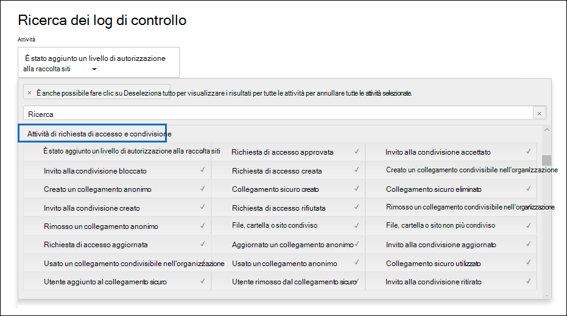

# Usare il controllo di condivisione nel log di controllo

La condivisione è un'attività chiave in SharePoint Online e OneDrive for Business ed è ampiamente utilizzata nelle organizzazioni. Gli amministratori possono utilizzare il controllo della condivisione nel log di controllo per determinare come viene utilizzata la condivisione nell'organizzazione. 
  
## Schema SharePoint condivisione

Gli eventi di condivisione (non inclusi gli eventi correlati ai criteri di condivisione e ai collegamenti di condivisione) sono diversi dagli eventi correlati a file e cartelle in un modo principale: un utente sta eseguendo un'azione che ha effetto su un altro utente. Ad esempio, quando una risorsa Utente A consente all'utente B di accedere a un file. In questo esempio l'utente A è *l'utente che agisce* e l'utente B è l'utente di *destinazione.* Nello schema SharePoint file, l'azione dell'utente che agisce influisce solo sul file stesso. Quando l'utente A apre un file, l'unica informazione necessaria **nell'evento FileAccessed** è l'utente che agisce. Per risolvere questa differenza, esiste uno schema separato, denominato schema *di* condivisione SharePoint , che acquisisce ulteriori informazioni sulla condivisione di eventi. In questo modo gli amministratori hanno visibilità su chi ha condiviso una risorsa e l'utente con cui è stata condivisa la risorsa. 
  
Lo schema di condivisione fornisce due campi aggiuntivi in un record di controllo correlato agli eventi di condivisione: 
  
- **TargetUserOrGroupType:** Identifica se l'utente o il gruppo di destinazione è membro, guest, sharePointGroup, SecurityGroup o partner.

- **TargetUserOrGroupName:** Archivia l'UPN o il nome dell'utente o del gruppo di destinazione con cui è stata condivisa una risorsa (Utente B nell'esempio precedente). 

Questi due campi, oltre ad altre proprietà dello schema del log di controllo,  ad esempio  Utente,  Operazione e Data, possono indicare la storia completa su quale utente ha condiviso la risorsa con chi e *quando*. 
  
Esiste un'altra proprietà dello schema importante per la storia di condivisione. Quando si esportano i risultati della ricerca nei log di controllo, nella colonna **AuditData** nel file CSV esportato vengono archiviate informazioni sugli eventi di condivisione. Ad esempio, quando un utente condivide un sito con un altro utente, questa operazione viene eseguita aggiungendo l'utente di destinazione a un SharePoint gruppo. La **colonna AuditData** acquisisce queste informazioni per fornire il contesto agli amministratori. Vedere [il passaggio 2](#step-2-use-the-powerquery-editor-to-format-the-exported-audit-log) per istruzioni su come analizzare le informazioni nella **colonna AuditData.**

## SharePoint di condivisione

La condivisione è definita da  quando un utente (l'utente che agisce) vuole condividere una risorsa con un altro utente (l'utente *di* destinazione). I record di controllo relativi alla condivisione di una risorsa con un utente esterno (un utente esterno all'organizzazione e che non dispone di un account guest nel Azure Active Directory dell'organizzazione) sono identificati dagli eventi seguenti, che vengono registrati nel log di controllo:

- **SharingInvitationCreated:** Un utente dell'organizzazione ha tentato di condividere una risorsa (probabilmente un sito) con un utente esterno. In questo modo viene inviato un invito alla condivisione esterna all'utente di destinazione. A questo punto non viene concesso alcun accesso alla risorsa.

- **SharingInvitationAccepted:** L'utente esterno ha accettato l'invito alla condivisione inviato dall'utente che agisce e ora ha accesso alla risorsa.

- **AnonymousLinkCreated:** Per una risorsa viene creato un collegamento anonimo, denominato anche collegamento "Chiunque". Poiché è possibile creare e copiare un collegamento anonimo, è ragionevole presupporre che qualsiasi documento con un collegamento anonimo sia stato condiviso con un utente di destinazione.

- **AnonymousLinkUsed:** Come suggerisce il nome, questo evento viene registrato quando viene utilizzato un collegamento anonimo per accedere a una risorsa. 

- **SecureLinkCreated:** Un utente ha creato un "collegamento a persone specifiche" per condividere una risorsa con una persona specifica. L'utente di destinazione può essere un utente esterno all'organizzazione. La persona con cui la risorsa è condivisa viene identificata nel record di controllo per **l'evento AddedToSecureLink.** I timestamp per questi due eventi sono quasi identici.

- **AddedToSecureLink:** Un utente è stato aggiunto a un collegamento persone specifico. Utilizzare il **campo TargetUserOrGroupName** in questo evento per identificare l'utente aggiunto al collegamento persone specifiche corrispondente. L'utente di destinazione può essere un utente esterno all'organizzazione.

## Condivisione del flusso di lavoro di controllo
  
Quando un utente (l'utente che agisce) vuole condividere una risorsa con un altro utente (l'utente di destinazione), SharePoint (o OneDrive for Business) controlla innanzitutto se l'indirizzo di posta elettronica dell'utente di destinazione è già associato a un account utente nella directory dell'organizzazione. Se l'utente di destinazione si trova nella directory (e ha un account utente guest corrispondente), SharePoint le operazioni seguenti:
  
-  Assegna immediatamente all'utente di destinazione le autorizzazioni per accedere alla risorsa aggiungendo l'utente di destinazione al gruppo di SharePoint appropriato e registra un **evento AddedToGroup.** 
    
- Invia una notifica di condivisione all'indirizzo di posta elettronica dell'utente di destinazione.
    
- Registra un **evento SharingSet.** Questo evento ha un nome descrittivo "File condiviso, cartella o sito" **in** Attività di condivisione e richiesta di accesso nella selezione attività dello strumento di ricerca del log di controllo. Vedi lo screenshot nel [passaggio 1.](#step-1-search-for-sharing-events-and-export-the-results-to-a-csv-file) 
    
Se nella directory non è presente un account utente per l'utente di destinazione, SharePoint le operazioni seguenti: 
    
   - Registra uno degli eventi seguenti, in base alla modalità di condivisione della risorsa:
   
      - **AnonymousLinkCreated**
   
      - **SecureLinkCreated**
   
      - **AddedToSecureLink** 

      - **SharingInvitationCreated** (questo evento viene registrato solo quando la risorsa condivisa è un sito)
    
   - Quando l'utente di destinazione accetta l'invito alla condivisione inviato (facendo clic sul collegamento nell'invito), SharePoint registra un evento **SharingInvitationAccepted** e assegna all'utente di destinazione le autorizzazioni per accedere alla risorsa. Se all'utente di destinazione viene inviato un collegamento anonimo, l'evento **AnonymousLinkUsed** viene registrato dopo che l'utente di destinazione utilizza il collegamento per accedere alla risorsa. Per i collegamenti sicuri, viene registrato un **evento FileAccessed** quando un utente esterno utilizza il collegamento per accedere alla risorsa.

Vengono registrate anche altre informazioni sull'utente di destinazione, ad esempio l'identità dell'utente a cui è stato inviato l'invito e l'utente che accetta l'invito. In alcuni casi, questi utenti (o indirizzi di posta elettronica) possono essere diversi. 

## Come identificare le risorse condivise con utenti esterni

Un requisito comune per gli amministratori è la creazione di un elenco di tutte le risorse condivise con utenti esterni all'organizzazione. Utilizzando il controllo della condivisione in Office 365, gli amministratori possono generare questo elenco. Ecco come fare.
  
### Passaggio 1: cercare eventi di condivisione ed esportare i risultati in un file CSV

Il primo passaggio consiste nel cercare gli eventi di condivisione nel log di controllo. Per ulteriori informazioni (incluse le autorizzazioni necessarie) sulla ricerca nel log di controllo, vedere [Search the audit log in the Security & Compliance Center.](search-the-audit-log-in-security-and-compliance.md)
  
1. Passare a <https://compliance.microsoft.com>.

2. Accedere usando l'account aziendale o dell'istituto di istruzione.

3. Nel riquadro sinistro della finestra di Centro conformità Microsoft 365 fare clic su **Controlla.**

    Viene visualizzata la pagina **Audit**.

4. In **Attività** fare clic **su Attività di condivisione e richiesta di accesso** per cercare gli eventi correlati alla condivisione. 

    
  
5. Selezionare un intervallo di data e ora per trovare gli eventi di condivisione che si sono verificati in tale periodo. 

6. Fare **clic su** Cerca per eseguire la ricerca. 

7. Al termine dell'esecuzione della ricerca e visualizzati i risultati, fare clic su **Esporta risultati** Scarica tutti \> **i risultati.**

    Dopo aver selezionato l'opzione di esportazione, un messaggio nella parte inferiore della finestra richiede di aprire o salvare il file CSV.

8. Fare **clic su** Salva con nome e salvare il file CSV in una cartella nel computer \>  locale. 

### Passaggio 2: Utilizzare l'Editor PowerQuery per formattare il log di controllo esportato

Il passaggio successivo consiste nell'usare la funzionalità di trasformazione JSON nell'editor di Power Query in Excel per dividere ogni proprietà nella colonna **AuditData** (costituita da un oggetto JSON multi-proprietà) nella propria colonna. In questo modo è possibile filtrare le colonne per visualizzare i record correlati alla condivisione

Per istruzioni dettagliate, vedere “Passaggio 2: Formattare il log di audit esportato usando l’editor di Power Query” in [Esportare, configurare e visualizzare i record del log di audit](export-view-audit-log-records.md#step-2-format-the-exported-audit-log-using-the-power-query-editor).

### Passaggio 3: filtrare il file CSV per le risorse condivise con utenti esterni

Il passaggio successivo consiste nel filtrare il file CSV per i diversi eventi correlati alla condivisione descritti in precedenza nella sezione SharePoint [eventi di condivisione.](#sharepoint-sharing-events) In alternativa, è possibile filtrare la **colonna TargetUserOrGroupType** per visualizzare tutti i record in cui il valore di questa proprietà è **Guest.** 

Dopo aver seguito le istruzioni del passaggio precedente per preparare il file CSV utilizzando l'editor PowerQuery, eseguire le operazioni seguenti:
    
1. Aprire il Excel creato nel passaggio 2. 

2. Nella scheda **Home** fare clic su **& filtro** e quindi su **Filtro.**
    
3. **Nell'elenco a discesa &** filtro  nella colonna Operazioni deselezionare tutte le selezioni, quindi selezionare uno o più degli eventi correlati alla condivisione seguenti e quindi fare clic su **OK.**
 
   - **SharingInvitationCreated**
   
   - **AnonymousLinkCreated**
   
   - **SecureLinkCreated**
   
   - **AddedToSecureLink** 
    
    Excel le righe per gli eventi selezionati.
    
4. Passare alla colonna denominata **TargetUserOrGroupType** e selezionarla. 
    
5. **Nell'elenco a discesa & filtro** deselezionare tutte le selezioni, quindi selezionare **TargetUserOrGroupType:Guest** e fare clic su **OK.**
    
    Ora Excel le righe per la condivisione degli eventi E in cui l'utente di destinazione si trova all'esterno dell'organizzazione, perché gli utenti esterni sono identificati dal valore **TargetUserOrGroupType:Guest**. 
  
> [!TIP]
> Per i record di controllo visualizzati, la **colonna ObjectId** identifica la risorsa condivisa con l'utente di destinazione. ad esempio  `ObjectId:https:\/\/contoso-my.sharepoint.com\/personal\/sarad_contoso_com\/Documents\/Southwater Proposal.docx` .
