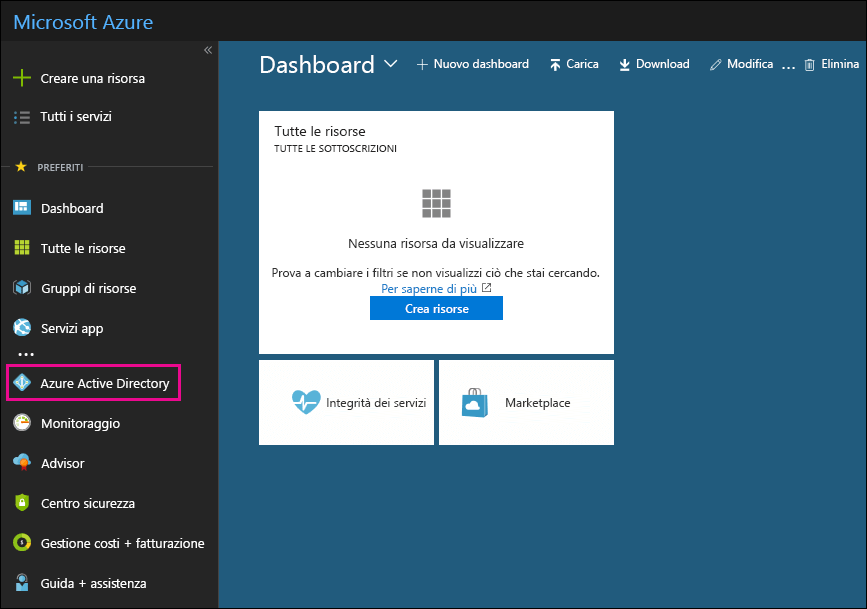

# Utilizzare la sottoscrizione di Azure Active Directory gratuita in Office 365Use your free Azure Active Directory subscription in Office 365

Se l'organizzazione ha una sottoscrizione a pagamento a Office 365, Microsoft Dynamics CRM Online, Enterprise Mobility Suite o altri servizi Microsoft, si dispone di una sottoscrizione gratuita a Microsoft Azure Active Directory. Gli amministratori possono usare Azure AD per creare e gestire account utente e di gruppo. Per usare Azure AD, basta andare al portale di Azure e accedere utilizzando il tuo account Office 365.If your organization has a paid subscription to Office 365, Microsoft Dynamics CRM Online, Enterprise Mobility Suite, or other Microsoft services, you have a free subscription to Microsoft Azure Active Directory. You and other admins can use Azure AD to create and manage user and group accounts. To use Azure AD, just go to the Azure portal and sign in using your Office 365 account.

## Prima di iniziareBefore you begin

Usare una sessione di esplorazione privata (non una sessione normale) per accedere al portale di Azure (nel passaggio 1 in basso) poiché in questo modo si evita di comunicare ad Azure le credenziali usate per accedere. Per aprire una sessione InPrivate Browsing in Microsoft Edge, Internet Explorer o Mozilla FireFox, basta premere CTRL+MAIUSC+P. Per aprire una sessione di esplorazione privata in Google Chrome (chiamata finestra di navigazione in incognito), premere CTRL+MAIUSC+N.Use a private browsing session (not a regular session) to access the Azure portal (in step 1 below) because this will prevent the credential that you are currently logged on with from being passed to Azure. To open an InPrivate Browsing session in Microsoft Edge, Internet Explorer, or Mozilla FireFox, just press CTRL+SHIFT+P. To open a private browsing session in Google Chrome (called an incognito window), press CTRL+SHIFT+N.

## Accedere ad Azure Active DirectoryAccess Azure Active Directory

1. Andare a [portal.azure.com](https://portal.azure.com) e accedere con il proprio account professionale o studente di Office 365.Go to [portal.azure.com](https://portal.azure.com) and sign in with your Office 365 work or student account.

2. Nel riquadro di spostamento a sinistra nel portale di Azure, fare clic su **Azure Active Directory**.In the left navigation pane in the Azure portal, click **Azure Active Directory**.

    

    Viene visualizzata l'interfaccia di amministrazione di **Azure Active Directory**.The **Azure Active Directory** admin center is displayed.

## Altre informazioniMore information

- Un abbonamento gratuito ad Azure Active Directory non include il report delle attività di accesso.A free Azure Active Directory subscription does not include the Sign-ins activity report. Per registrare l'attività di accesso (che può essere utile in caso di violazione dei dati), è necessario un abbonamento ad Azure Active Directory Premium.To record sign-in activity (which can be useful in the event of a data breach), you need an Azure Active Directory Premium subscription. Per altre informazioni, vedere [Per quanto tempo Azure AD archivia i dati?](https://docs.microsoft.com/azure/active-directory/reports-monitoring/reference-reports-data-retention#how-long-does-azure-ad-store-the-data)For more information, see [How long does Azure AD store the data?](https://docs.microsoft.com/azure/active-directory/reports-monitoring/reference-reports-data-retention#how-long-does-azure-ad-store-the-data).

- È anche possibile accedere all'interfaccia di amministrazione di **Azure Active Directory** dall'interfaccia di amministrazione di Microsoft 365.You can also access the **Azure Active Directory** admin center from the Microsoft 365 admin center. Nel riquadro di spostamento sinistro dell'interfaccia di amministrazione di Microsoft 365 fare clic su **Interfacce di amministrazione** \> **Azure Active Directory**.In the left navigation pane of the Microsoft 365 admin center, click **Admin centers** \> **Azure Active Directory**.

- Per informazioni sulla gestione degli utenti e dei gruppi e sull'esecuzione di altre attività di gestione delle directory, vedere [Gestione della directory di Azure AD](https://docs.microsoft.com/azure/active-directory/active-directory-administer).For information about managing users and groups and performing other directory management tasks, see [Manage your Azure AD directory](https://docs.microsoft.com/azure/active-directory/active-directory-administer).
