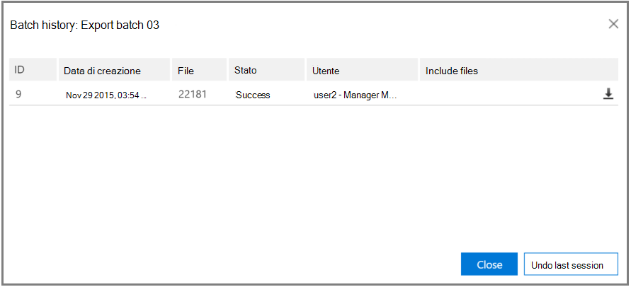

# Visualizzare la cronologia dei batch ed esportare i risultati precedenti in Advanced eDiscovery (Classic)View batch history and export past results in Advanced eDiscovery (classic)

> [!NOTE]
> Advanced eDiscovery requires an Office 365 E3 with the Advanced Compliance add-on or an E5 subscription for your organization.Advanced eDiscovery requires an Office 365 E3 with the Advanced Compliance add-on or an E5 subscription for your organization. If you don't have that plan and want to try Advanced eDiscovery, you can [sign up for a trial of Office 365 Enterprise E5](https://go.microsoft.com/fwlink/p/?LinkID=698279).If you don't have that plan and want to try Advanced eDiscovery, you can [sign up for a trial of Office 365 Enterprise E5](https://go.microsoft.com/fwlink/p/?LinkID=698279). 
  
Nella sezione seguente vengono descritte le opzioni aggiuntive per la visualizzazione in batch e l'esportazione dei dati in Advanced eDiscovery.The following section describes additional options for batch viewing and export of data in Advanced eDiscovery. 
  
## Visualizzazione della cronologia del batch di esportazione ed esportazione di batch precedentiViewing Export batch history and exporting previous batches

La finestra di dialogo Esporta cronologia fornisce informazioni dettagliate sulle sessioni batch di esportazione selezionate e fornisce anche la possibilità di annullare l'ultima sessione.The Export history dialog provides detailed information of selected export batch sessions and also provides the ability to undo the last session.
  
1. Nel \*\* \> programma di installazione di esportazione\*\*Selezionare il nome del batch dall'elenco a discesa batch di **esportazione** .In **Export \> Setup**, select the batch name from the **Export batch** drop-down list. 
    
2. A destra del nome del batch di esportazione, selezionare l'icona **cronologia batch** :To the right of the export batch name, select the **Batch history** icon: 
    
    
  
    Viene visualizzata la finestra di dialogo cronologia batch.The Batch history dialog is displayed.
    
    
  
3. Se è necessario eseguire il rollback di una sessione precedente, fare clic su **Annulla ultima sessione**.If it is necessary to roll back a previous session, click **Undo last session**. Il rollback può essere eseguito più volte, che annulla l'ultima sessione.Rollback can be performed multiple times, which cancels the last session.
    
4. Se si desidera scaricare i dati in qualsiasi momento da una sessione di esportazione batch eseguita in precedenza, **Download** fare clic sull'  batch di esportazione desiderato da esportare.If you want to download data at any time from a previously executed export batch session, click the **Download** icon  next to the desired export batch to be exported. 
    
5. Quando viene visualizzata la finestra di dialogo **firma di accesso condiviso** , fare clic su **copia negli Appunti** per copiare i dati della sessione di esportazione nel computer locale e quindi fare clic su **Chiudi**.When the **Shared access signature** dialog is displayed, click **Copy to clipboard** to copy the export session data to the local machine, and then click **Close**. &amp;Viene visualizzata la finestra di dialogo **strumento di esportazione di eDiscovery** per il Centro sicurezza.The Security &amp; Compliance Center **eDiscovery Export Tool** dialog is displayed. 
    
    
  
6. Nella finestra di dialogo **dello strumento di esportazione di eDiscovery** :In the **eDiscovery Export Tool** dialog: 
    
1. In **Incolla la firma di accesso condiviso che verrà utilizzata per la connessione all'origine**, incollare il valore della **firma di accesso condiviso** , che in precedenza è stato copiato negli Appunti.In **Paste the Shared Access Signature that will be used to connect to the source**, paste the **Shared access signature** value, which was previously copied to the clipboard. 
    
2. Fare clic su **Sfoglia** per selezionare il percorso di destinazione per l'archiviazione dei file di esportazione scaricati su un computer locale.Click **Browse** to select the target location for storing the downloaded export files on a local machine. 
    
3. Fare clic su **Avvia**.Click **Start**. I file di esportazione vengono scaricati nel computer locale.The export files are downloaded to the local machine. 
    
## Argomenti correlatiRelated topics

[Advanced eDiscovery (classico)Advanced eDiscovery (classic)](office-365-advanced-ediscovery.md)
  
[Esportazione dei risultatiExporting results ](export-results-in-advanced-ediscovery.md)

[Esportare i campi del reportExport report fields](export-report-fields-in-advanced-ediscovery.md)

