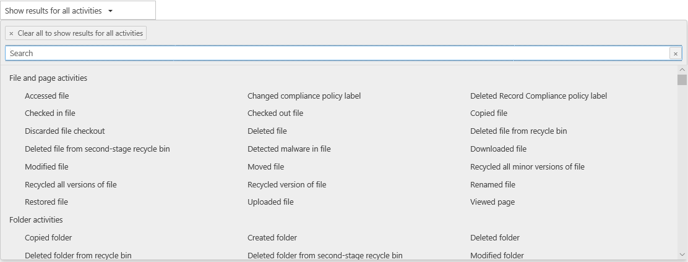

# Visualizzare l'attività di audit dei responsabili

Se è necessario verificare se un utente ha visualizzato un documento specifico o ha eliminato un elemento dalla cassetta postale, Advanced eDiscovery è ora integrato con lo strumento di ricerca dei log di controllo esistente nel Centro sicurezza & conformità. Grazie a questa esperienza incorporata, è possibile utilizzare lo strumento di Advanced eDiscovery Custodian Management per facilitare l'indagine accedendo facilmente all'attività e cercando i custodi all'interno del caso.

## Ottenere le autorizzazioni

È necessario avere il ruolo relativo ai log di controllo di sola lettura o ai log di controllo in Exchange Online per poter eseguire ricerche nel log di controllo. Per impostazione predefinita, questi ruoli sono assegnati ai gruppi di ruoli Gestione conformità e Gestione organizzazione nella pagina Autorizzazioni nell'Interfaccia di amministrazione di Exchange. Per consentire a un utente di eseguire ricerche nel log di audit di Advanced eDiscovery con il livello minimo di privilegi, è possibile creare un gruppo di ruoli personalizzato in Exchange Online, aggiungere il ruolo relativo ai log di audit di sola lettura o ai log di audit e quindi aggiungere l'utente come membro del nuovo gruppo di ruoli. Per altre informazioni, vedere Gestire i gruppi di ruoli in Exchange Online.

> [!IMPORTANT]
> Se si assegna a un utente il ruolo View-Only Audit Logs o Audit Logs nella pagina Autorizzazioni del Centro sicurezza & conformità, non sarà in grado di eseguire ricerche nel log di controllo. È necessario assegnare le autorizzazioni in Exchange Online. Ciò avviene perché il cmdlet sottostante usato per la ricerca nel log di controllo è un cmdlet di Exchange Online.

## Passaggio 1: cercare nel log di controllo le attività eseguite da un responsabile

1. Passare a **eDiscovery > Advanced eDiscovery** aprire il caso.
  
2. Fare clic **sulla scheda** Origini.
  
3. Nella pagina **Custodi** selezionare un responsabile nell'elenco e quindi fare clic **su Visualizza** attività di custodia nella pagina a comparsa.

    Viene visualizzata la pagina di ricerca Attività di custodia. Si noti che il responsabile selezionato nel passaggio precedente viene visualizzato nella casella di **riepilogo** a discesa Custode. È possibile selezionare diversi custodi nella casella di riepilogo a discesa, ma è possibile cercare solo attività per un responsabile alla volta.

    
   
4. Configurare i criteri di ricerca seguenti: 
      
   1. **Attività:** fare clic sull'elenco a discesa per visualizzare le attività che è possibile cercare. Dopo aver eseguito la ricerca, vengono visualizzati solo i record di audit per le attività selezionate. Se **si seleziona Mostra risultati per tutte le attività,** verranno visualizzati i risultati per tutte le attività eseguite dal responsabile che soddisfano gli altri criteri di ricerca.

      
      
   1. **Data inizio e Data fine:** selezionare un intervallo di data e ora per visualizzare gli eventi che si sono verificati all'interno di tale periodo. Gli ultimi sette giorni sono selezionati per impostazione predefinita. La data e l'ora sono specificate in formato UTC (Coordinated Universal Time). L'intervallo di date massimo che è possibile specificare è di un anno.
      
   1. **Custodi:** fare clic in questa casella e quindi selezionare un responsabile specifico per cui visualizzare i risultati della ricerca. I record di controllo per l'attività selezionata eseguita dagli utenti selezionati in questa casella vengono visualizzati nell'elenco dei risultati.
      
5. Fare clic su   per eseguire la ricerca utilizzando i criteri di ricerca. I risultati della ricerca vengono caricati e dopo alcuni istanti vengono visualizzati in Risultati nella pagina di ricerca Attività di custodia. 

## Passaggio 2: Visualizzare i risultati della ricerca nel log di controllo

I risultati di una ricerca nel log di controllo vengono visualizzati in Risultati nella pagina Registro di controllo del responsabile. Un massimo di 5.000 eventi (più recenti) vengono visualizzati in incrementi di 150 eventi. Per visualizzare più eventi, è possibile usare la barra di scorrimento nel riquadro Risultati oppure è possibile premere MAIUSC+FINE per visualizzare i 150 eventi successivi.

I risultati includono le informazioni seguenti relative a ogni evento restituito dalla ricerca.
- **Data**: data e ora (in formato UTC) in cui si è verificato l'evento.

- **Indirizzo IP**: indirizzo IP del dispositivo usato durante la registrazione dell'attività. L'indirizzo IP viene visualizzato in formato IPv4 o IPv6.

- **Utente**: utente (o account del servizio) che ha eseguito l'azione che ha attivato l'evento.

- **Attività**: attività eseguita dall'utente. Questo valore corrisponde alle attività selezionate nell'elenco a discesa Attività. Per un evento del log di controllo dell'amministratore di Exchange, il valore in questa colonna è un cmdlet di Exchange.

- **Elemento**: oggetto creato o modificato come risultato dell'attività corrispondente. Ad esempio, il file che è stato visualizzato o modificato oppure l'account utente che è stato aggiornato. Non tutte le attività presentano un valore in questa colonna.

- **Dettagli**: dettagli aggiuntivi su un'attività. Anche in questo caso, non tutte le attività hanno un valore.

## Passaggio 3: Filtrare i risultati della ricerca

Oltre a ordinare i risultati di una ricerca nel log di controllo, è anche possibile filtrarli. Ciò consente di filtrare rapidamente i risultati per un utente o un'attività specifica. 

Per filtrare i risultati:

 1. Creare ed eseguire una ricerca nel log di controllo.
  
2. Quando vengono visualizzati i risultati, fare clic su **Filtra risultati**.
 
3. Sotto ogni intestazione di colonna vengono visualizzate le caselle delle parole chiave.
  
4. Fare clic su una delle caselle sotto un'intestazione di colonna e digitare una parola o una fase, a seconda della colonna in base a cui si sta filtrando. I risultati verranno riorganizzati dinamicamente per visualizzare gli eventi corrispondenti al filtro.
  
5. Per cancellare un filtro, fare clic sulla **X** nella casella del filtro oppure fare clic su **Nascondi filtro.**

## Esportare i risultati della ricerca in un file

È possibile esportare i risultati di una ricerca nel log di controllo in un file con valori delimitati da virgole (CSV) nel computer locale. È possibile aprire questo file in Microsoft Excel e utilizzare funzionalità quali la ricerca, l'ordinamento, il filtro e la suddivisione di una singola colonna (che contiene celle multivalore) in più colonne.

1. Eseguire una ricerca nel log di controllo e quindi modificare i criteri di ricerca fino a ottenere i risultati desiderati.
  
2. Fare clic su Esporta risultati e selezionare una delle opzioni seguenti:

    - **Salvare i risultati caricati:** Scegliere questa opzione per esportare solo le voci visualizzate in **Risultati** nella pagina Ricerca **log di controllo del** responsabile. Il file CSV che viene scaricato contiene le stesse colonne (e gli stessi dati) presenti nella pagina (Data, Utente, Attività, Elemento e Dettagli). Nel file CSV è inclusa una colonna aggiuntiva (intitolata **Altro)** che contiene ulteriori informazioni dalla voce del log di controllo. Poiché si stanno esportando gli stessi risultati caricati (e visualizzabili) nella pagina Ricerca log di controllo, verranno esportate al massimo 5.000 voci.
        
    - **Scarica tutti i risultati:** Scegliere questa opzione per esportare tutte le voci del registro di controllo che soddisfano i criteri di ricerca. Per un set di risultati di ricerca di grandi dimensioni, scegliere questa opzione per scaricare tutte le voci dal log di controllo oltre ai 5.000 risultati che possono essere visualizzati nella pagina di ricerca del **registro** di controllo del responsabile. Questa opzione consente di scaricare i dati non elaborati dal log di controllo in un file CSV e contiene informazioni aggiuntive dalla voce del log di controllo in una colonna denominata AuditData. Se si sceglie questa opzione di esportazione potrebbe essere necessario più tempo per scaricare il file, in quanto il file potrebbe essere molto più grande di quello scaricato scegliendo l'altra opzione.
    
      > [!IMPORTANT]
      > È possibile scaricare al massimo 50.000 voci in un file CSV da una singola ricerca nel log di controllo. Se vengono scaricate 50.000 voci nel file CSV, è probabile che ci siano più di 50.000 eventi che soddisfano i criteri di ricerca. Per eseguire l'esportazione oltre questo limite, provare a usare un intervallo di date per ridurre il numero di voci del log di controllo. Potrebbe essere necessario eseguire più ricerche con intervalli di date più piccoli per esportare più di 50.000 voci.
        

3. Dopo aver selezionato un'opzione di esportazione, nella parte inferiore della finestra viene visualizzato un messaggio che richiede di aprire il file CSV, salvarlo nella cartella Download o salvarlo in una cartella specifica

Per ulteriori informazioni sulla visualizzazione, il filtro o l'esportazione dei risultati della ricerca nei log di controllo, vedere [Search the audit log in the Security & Compliance Center.](search-the-audit-log-in-security-and-compliance.md)
