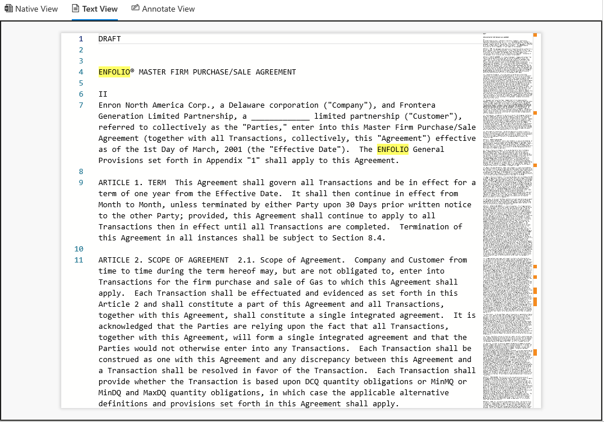

# Visualizzare i documenti in un set di revisioni in Advanced eDiscovery

Advanced eDiscovery visualizza i contenuti tramite diversi visualizzatori con scopi diversi. I diversi visualizzatori possono essere utilizzati facendo clic su un documento qualsiasi in un insieme da rivedere. I visualizzatori attualmente forniti sono:

- Metadati del file
- Visualizzazione nativa
- Visualizzazione testo
- Visualizzazione annotazione

## Metadati del file

Questo pannello può essere attivato/disattivato per visualizzare vari metadati associati al documento. Anche se la griglia dei risultati della ricerca può essere personalizzata per visualizzare metadati specifici, in alcuni casi può risultare difficile scorrere orizzontalmente durante la revisione dei dati. Il riquadro Metadati del file consente all'utente di attivare una visualizzazione all'interno del visualizzatore.

## Visualizzazione nativa

Il visualizzatore nativo visualizza la visualizzazione più ricca di un documento. Supporta centinaia di tipi di file ed è pensato per mostrare l'esperienza più vera e nativa possibile. Per i file di Microsoft Office, il visualizzatore usa la versione Web delle app Office per mostrare i contenuti come i commenti nei documenti, le formule Excel, righe/colonne nascoste e note PowerPoint.

## Visualizzazione testo

Il visualizzatore testo fornisce una visualizzazione del testo estratto di un file. Ignora le immagini e la formattazione incorporate, ma è molto efficace se si vuole comprendere rapidamente il contenuto. La visualizzazione testo include anche le funzionalità seguenti:

- Il contatore di righe semplifica la ricerca di riferimenti a parti specifiche di un documento
- Evidenziazione dei risultati della ricerca che evidenzia i termini all'interno del documento e la barra di scorrimento
- La visualizzazione Diff offre una visualizzazione di confronto che evidenzia le differenze testuali quando si visualizzano documenti quasi duplicati

## Visualizzazione annotazione

La visualizzazione Annotazione offre funzionalità che consentono agli utenti di applicare commenti a un documento, tra cui:

- Redazioni area: gli utenti possono disegnare una casella sul documento per nascondere il contenuto sensibile
- Matita: gli utenti possono disegnare a mano libera su un documento per attirare l'attenzione su determinate parti di un documento
- Selezionare le annotazioni: gli utenti possono selezionare le annotazioni su un documento per eliminarle
- Attiva/disattiva trasparenza annotazione: rende le annotazioni semitrasparenti per visualizzare il contenuto dietro l'annotazione
- Pagina precedente: consente di passare alla pagina precedente
- Pagina successiva: consente di passare alla pagina successiva
- Vai alla pagina: l'utente può immettere un numero di pagina specifico a cui passare
- Zoom: impostare il livello di zoom per la visualizzazione delle annotazioni
- Ruota: l'utente può ruotare il documento in senso orario
- Ricerca: l'utente può eseguire ricerche all'interno di un documento e passare ai vari risultati all'interno del documento

  

## Visualizzazione dashboard

La visualizzazione dashboard consente di visualizzare e riepilogare i dati nella griglia dei risultati di ricerca. In questa visualizzazione puoi creare widget personalizzati per semplificare l'analisi e la creazione di report sul set di recensioni. Dopo aver creato i widget, puoi interagire con essi per ottenere i conteggi degli elementi o per creare una ricerca.
