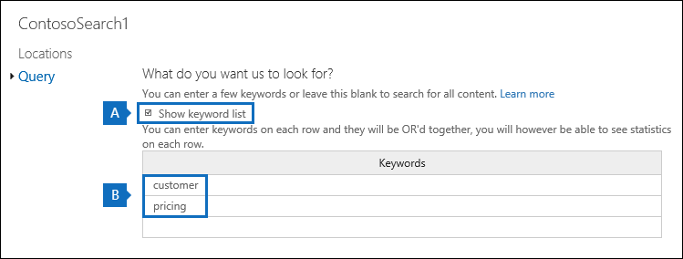

# Visualizzare le statistiche delle parole chiave per i risultati di Ricerca contenutoView keyword statistics for Content Search results

Dopo aver creato ed eseguito una ricerca contenuto, è possibile visualizzare le statistiche sui risultati della ricerca stimati.After you create and run a Content Search, you can view statistics about the estimated search results. Include un riepilogo dei risultati della ricerca (simile al riepilogo dei risultati di ricerca stimati visualizzati nel riquadro dei dettagli), le statistiche delle query, ad esempio il numero di percorsi di contenuto con elementi che corrispondono alla query di ricerca e il nome dei percorsi di contenuto con il maggior numero di elementi corrispondenti.This includes a summary of the search results (similar to the summary of the estimated search results displayed in the details pane), the query statistics such as the number of content locations with items that match the search query, and the name of content locations that have the most matching items. È possibile visualizzare statistiche per una o più ricerche di contenuto.You can display statistics for one or more content searches. In questo modo è possibile confrontare rapidamente i risultati di più ricerche e prendere decisioni sull'efficacia delle query di ricerca.This lets you to quickly compare the results for multiple searches and make decisions about the effectiveness of your search queries.
  
È inoltre possibile configurare ricerche nuove ed esistenti per restituire statistiche per ogni parola chiave in una query di ricerca.Additionally, you can configure new and existing searches to return statistics for each keyword in a search query. In questo modo è possibile confrontare il numero di risultati per ogni parola chiave di una query e confrontare le statistiche delle parole chiave da più ricerche.This lets you compare the number of results for each keyword in a query and to compare the keyword statistics from multiple searches.
  
È anche possibile scaricare le statistiche di ricerca e delle parole chiave in un file CSV.You can also download the search statistics and keyword statistics to a CSV file. Questo consente di usare le funzionalità di filtro e ordinamento di Excel per confrontare i risultati e preparare report per i risultati della ricerca.This lets you use the filtering and sorting features in Excel to compare results, and prepare reports for your search results.
  
## Ottenere statistiche per le ricerche di contenutoGet statistics for Content Searches

Per visualizzare le statistiche per le ricerche di contenuto:To display statistics for Content searches:
  
1. Nel Centro conformità Microsoft 365 passare a **Mostra tutto il** contenuto di  >  **ricerca.**In the Microsoft 365 compliance center, go to **Show all** > **Content search**.

2. Nell'elenco delle ricerche selezionare due o più ricerche e quindi fare clic **su** Statistiche di ricerca nella pagina riquadro **a** comparsa Azioni in blocco.In the list of searches, select two or more searches, and then click **Search statistics** on the **Bulk actions** flyout page.
    
    
  
3. Nella pagina **Statistiche di** ricerca fare clic su uno dei collegamenti seguenti per visualizzare le statistiche sulle ricerche selezionate.On the **Search statistics** page, click one of the following links to display statistics about the selected searches. 
    
    **Riepilogo****Summary**
    
    In questa pagina vengono visualizzate statistiche simili a quelle visualizzate nel riquadro dei dettagli nella **pagina Ricerca contenuto.**This page displays statistics similar to the ones displayed in the details pane on the **Content search** page. Vengono visualizzate le statistiche per tutte le ricerche selezionate.Statistics for all selected searches are displayed. Tieni presente che puoi anche eseguire di nuovo le ricerche selezionate da questa pagina per aggiornare le statistiche.Note that you can also re-run the selected searches from this page to update the statistics. 
    
    
  
    a.a.  Nome della ricerca contenuto.The name of the Content Search. Come indicato in precedenza, è possibile visualizzare e confrontare le statistiche per più ricerche.As previously stated, you can display and compare statistics for multiple searches.
    
    b.b. Tipo di percorso del contenuto in cui è stata ricercata.The type of content location that was searched. In ogni riga vengono visualizzate le statistiche relative a cassette postali, siti e cartelle pubbliche della ricerca specificata.Each row displays statistics for mailboxes, sites, and public folders from the specified search.
    
    c.c. Numero di percorsi di contenuto contenenti elementi che corrispondono alla query di ricerca.The number of content locations containing items that match the search query. Per le cassette postali, questa statistica include anche il numero di cassette postali di archiviazione che contengono elementi che corrispondono alla query di ricerca.For mailboxes, this statistic also includes the number of archive mailboxes that contain items that match the search query.
    
    d.d. Numero totale di elementi di tutti i percorsi di contenuto specificati che corrispondono alla query di ricerca.The total number of items of all specified content locations that match the search query. Alcuni esempi di tipi di elementi sono i messaggi di posta elettronica, gli elementi del calendario e i documenti.Examples of item types include email messages, calendar items, and documents. Se un elemento contiene più istanze di una parola chiave in fase di ricerca, viene conteggiato una sola volta nel numero totale di elementi.If an item contains multiple instances of a keyword that is being searched for, it's only counted once in the total number of items. Ad esempio, se si cercano parole "stock" o "frode" e un messaggio di posta elettronica contiene tre istanze della parola "stock", viene conteggiato una sola volta nella colonna **Items.**For example, if you're searching for words "stock" or "fraud" and an email message contains three instances of the word "stock", it's only counted once in the **Items** column. 
    
    e.e. Dimensione totale di tutti gli elementi trovati nel percorso di contenuto specificato che corrispondono alla query di ricerca.The total size of all items that were found in the specified content location that match the search query. 
    
    **Query****Queries**
    
    In questa pagina vengono visualizzate le statistiche relative alla query di ricerca.This page displays statistics about the search query.
    
    
  
    a.a. Nome della ricerca contenuto per cui la riga contiene le statistiche di query.The name of the Content Search that the row contains query statistics for.
    
    b.b. Tipo di percorso del contenuto a cui sono applicabili le statistiche della query.The type of content location that the query statistics are applicable to.
    
    c.c. Questa colonna indica a quale parte della query di ricerca sono applicabili le statistiche.This column indicates which part of the search query the statistics are applicable to. **Primary** indica l'intera query di ricerca.**Primary** indicates the entire search query. Se si utilizza un elenco di parole chiave quando si crea o si modifica una query di ricerca, le statistiche per ogni componente della query vengono incluse in questa tabella.If you use a keyword list when you create or edit a search query, statistics for each component of the query are included in this table. Per ulteriori [informazioni, vedere la sezione Ottenere statistiche](#get-keyword-statistics-for-content-searches) sulle parole chiave per le ricerche di contenuto in questo articolo.See the [Get keyword statistics for Content Searches](#get-keyword-statistics-for-content-searches) section in this article for more information. 
    
    d.d. Questa colonna contiene la query di ricerca effettiva eseguita dallo strumento ricerca contenuto.This column contains the actual search query that run by the Content Search tool. Si noti che lo strumento aggiunge automaticamente alcuni componenti aggiuntivi alla query creata.Note that the tool automatically adds a few additional components to the query that you create. 

    - Quando si cerca tutto il contenuto nelle cassette postali (senza specificare alcuna parola chiave), la query di parola chiave effettiva è in modo che  `size>=0` tutti gli elementi vengono restituiti.When you search for all content in mailboxes (by not specifying any keywords), the actual key word query is  `size>=0` so that all items are returned. 
    
     - Quando si esegue una ricerca nei siti di SharePoint Online e OneDrive for Business, vengono aggiunti i due componenti seguenti:When you search SharePoint Online and OneDrive for Business sites, the two following components are added:
    
          **NOT IsExternalContent:1** - Esclude qualsiasi contenuto da un'organizzazione di SharePoint locale.**NOT IsExternalContent:1** - Excludes any content from an on-premises SharePoint organization. 
    
          **NOT IsOneNotePage:1** - Esclude tutti i file di OneNote perché si tratta di duplicati di qualsiasi documento corrispondente alla query di ricerca.**NOT IsOneNotePage:1** - Excludes all OneNote files because these would be duplicates of any document that matches the search query. 

    
    e.e. Numero di percorsi di contenuto (specificati dalla colonna \*\* Tipo percorso \*\* ) che contengono elementi che corrispondono alla query di ricerca elencata nella **colonna Query.**The number of the content locations (specified by the \*\* Location type \*\* column) that contain items that match the search query listed in the **Query** column. 
    
    f.f. Numero di elementi (dal percorso di contenuto specificato) che corrispondono alla query di ricerca elencata nella **colonna Query.**The number of items (from the specified content location) that match the search query listed in the **Query** column. Come spiegato in precedenza, se un elemento contiene più istanze di una parola chiave in fase di ricerca, viene conteggiato una sola volta nella colonna.As previously explained, if an item contains multiple instances of a keyword that is being searched for, it's only counted once in the this column. 
    
    g.g. Dimensione totale di tutti gli elementi trovati (nel percorso di contenuto specificato) che corrispondono alla query di ricerca nella **colonna Query.**The total size of all items that were found (in the specified content location) that match the search query in the **Query** column. 
    
    **Posizioni principali****Top locations**
    
    In questa pagina vengono visualizzate le statistiche sul numero di elementi che corrispondono alla query di ricerca in ogni percorso di contenuto in cui è stata eseguita la ricerca.This page displays statistics about the number of items that match the search query in each content location that was searched. Vengono visualizzati i primi 1.000 percorsi.The top 1,000 locations are displayed. Se si visualizzano le statistiche per più ricerche, vengono visualizzate le prime 1.000 posizioni per ogni ricerca.If you view statistics for multiple searches, the top 1,000 locations for each search are displayed. Si noti che un percorso di contenuto non è incluso in questa pagina se non contiene elementi che corrispondono alla query di ricerca.Note that a content location isn't included on this page if it doesn't contain any items that match the search query.
    
    
  
    a.a. Nome del percorso del contenuto.The name of the content location.
    
    b.b. Tipo di percorso del contenuto a cui sono applicabili le statistiche sulla posizione.The type of content location that the location statistics are applicable to.
    
    c.c. Esistono colonne per ogni ricerca per cui si visualizzano le statistiche.There are columns for each search that you're displaying statistics for. Questa colonna mostra il numero (e le dimensioni totali) degli elementi che corrispondono alla query di ricerca in ogni percorso del contenuto.This column shows the number (and total size) of items that match the search query in each content location. Si noti che quando si visualizzano statistiche per più ricerche, la "NA" in questa colonna indica che il percorso del contenuto non è stato incluso nella ricerca.Note that when you're displaying statistics for multiple searches, the "NA" in this column indicates that the content location wasn't included in that search. 

## Ottenere statistiche sulle parole chiave per le ricerche contenutoGet keyword statistics for Content Searches

Come spiegato in precedenza, **la** pagina Query mostra la query di ricerca e il numero (e le dimensioni) degli elementi che corrispondono alla query.As previous explained, the **Queries** page shows the search query and the number (and size) of items that match the query. Se si utilizza un elenco di parole chiave quando si crea o si modifica una query di ricerca, è possibile ottenere statistiche avanzate che mostrano quanti elementi corrispondono a ogni parola chiave o frase chiave.If you use a keyword list when you create or edit a search query, you can get enhanced statistics that show how many items match each keyword or keyword phrase. Ciò consente di identificare rapidamente quali parti della query sono più (e meno) efficaci.This can help you quickly identify which parts of the query are the most (and least) effective. Ad esempio, se una parola chiave restituisce un numero elevato di elementi, è possibile scegliere di perfezionare la query con parole chiave per restringere i risultati della ricerca.For example, if a keyword returns a large number of items, you might choose to refine the keyword query to narrow the search results. È possibile configurare un elenco di parole chiave quando si crea o si modifica una ricerca contenuto.You can set up a keyword list when you create or edit a Content Search. 

Per creare un elenco di parole chiave e visualizzare le statistiche delle parole chiave per una ricerca contenuto:To create a keyword list and view keyword statistics for a Content Search:
  
1. Nel Centro conformità Microsoft 365 passare a **Mostra tutto il** contenuto di  >  **ricerca.**In the Microsoft 365 compliance center, go to **Show all** > **Content search**.
    
2. Nell'elenco delle ricerche di contenuto fare clic su e una ricerca e quindi fare clic su **Modifica**  Modifica.In the list of content searches, click and a search, and then click **Edit** .
    
3. Fare **clic su Query** e quindi eseguire le operazioni seguenti:Click **Query** and then do the following things: 
    
    
  
    a.a. Fare clic **sulla casella di controllo Mostra elenco** parole chiave.Click the **Show keyword list** check box. 
    
    b.b. Digitare una parola chiave o una fase di parola chiave in una riga della tabella delle parole chiave.Type a keyword or keyword phase in a row in the keywords table. Ad esempio, digitare **budget** nella prima riga e quindi digitare **sicurezza** nella seconda riga.For example, type **budget** in the first row and then type **security** in the second row. 
    
4. Dopo aver aggiunto le parole chiave per cui si desidera eseguire la ricerca e ottenere statistiche, fare clic **su Cerca** per eseguire la ricerca rivista.After adding the keywords that you want to search and get statistics for, click **Search** to run the revised search. 
    
5. Al termine della ricerca, selezionarla nell'elenco delle ricerche e quindi fare clic sul pulsante **Statistiche**  .When the search is completed, select it in the list of searches, and then click **Search statistics** . È inoltre possibile visualizzare e confrontare le statistiche delle parole chiave per più ricerche.You can also display and compare keyword statistics for multiple searches.
    
6. Nella pagina **Statistiche di** ricerca fare clic su **Query** per visualizzare le statistiche delle parole chiave per le ricerche selezionate.On the **Search statistics** page, click **Query** to display the keyword statistics for the selected searches. 
    
    
  
    Come mostrato nella schermata precedente, vengono visualizzate le statistiche per ogni parola chiave. ciò include:As shown in the previous screenshot, the statistics for each keyword are displayed; this includes: 
    
    - Statistiche delle parole chiave per ogni tipo di percorso di contenuto incluso nella ricerca.The keyword statistics for each type of content location included in the search.
    
    - Query di ricerca effettiva per ogni parola chiave, che include tutte le condizioni della query di ricerca.The actual search query for each keyword, which includes any conditions from the search query. 
    
    - La query di ricerca completa (identificata **come Primaria** nella **colonna Part)** e le statistiche per la query completa.The complete search query (identified as **Primary** in the **Part** column) and the statistics for the complete query. Si noti che si tratta delle stesse statistiche visualizzate nella **pagina Riepilogo.**Note these are the same statistics displayed on the **Summary** page. 

> [!NOTE]
> Per ridurre i problemi causati da elenchi di parole chiave di grandi dimensioni, ora si è limitati a un massimo di 20 righe nell'elenco di parole chiave di una query di ricerca.To help reduce issues caused by large keyword lists, you're now limited to a maximum of 20 rows in the keyword list of a search query.
