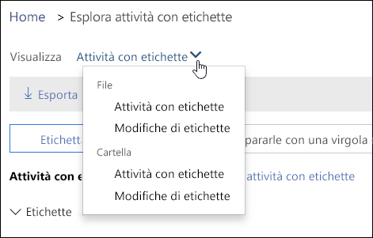
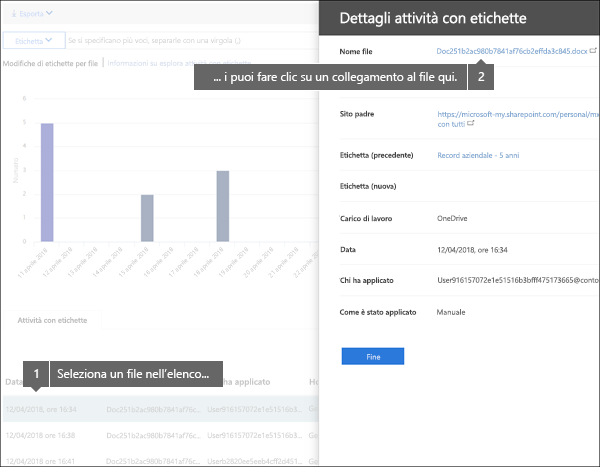
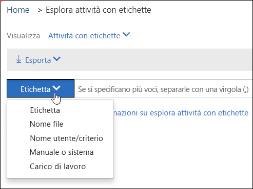

# Visualizzare le attività delle etichette per i documenti

After you create your labels, you'll want to verify that they're being applied to content as you intended. With the Label Activity Explorer in the Security &amp; Compliance Center, you can quickly search and view label activity for all content across SharePoint and OneDrive for Business over the past 30 days. This is real-time data that gives you a clear view into what's happening in your tenant.
  
Ad esempio, con Esplora attività con etichette è possibile:
  
- Visualizzare la frequenza con cui ogni etichetta è stata applicata ogni giorno (fino a 30 giorni).
    
- Vedere chi ha etichettato il file, quale file e in che data, visualizzando anche un collegamento al sito in cui si trova il file.
    
- Visualizzare quali etichette di file sono state modificate o rimosse, quali sono le etichette vecchie o nuove e chi ha apportato la modifica.
    
- Filter the data to see all the label activity for a specific label, file, or user. You can also filter label activity by location (SharePoint or OneDrive for Business) and whether the label was applied manually or auto-applied.
    
- View label activity for folders as well as individual documents. Coming soon is the ability to show how many files inside that folder got labeled as a result of the folder getting labeled.
    
Explorer attività etichette è disponibile nel &amp;Centro sicurezza e conformità > **Governance delle informazioni** > **Explorer attività etichette**.
  
Esplora attività con etichette richiede un abbonamento a Office 365 Enterprise E5.
  

  
## Visualizzare le attività con etichette per file o cartelle

At the top of the Label Activity Explorer, you can choose whether to view activities for files or folders. Note that folder activity includes only the folder itself, not the files inside the folder.
  
You might want to see label activity for folders because if you label a folder, all files inside that folder also get that label (except for files that have had a label applied explicitly to them). Therefore, labeling folders might affect a significant number of files. For more information, see [Applying a default retention label to all content in a SharePoint library, folder, or document set](labels.md#applying-a-default-retention-label-to-all-content-in-a-sharepoint-library-folder-or-document-set).
  

  
### Attività con etichette

 **Label activities** includes all label actions: **adding**, **removing**, or **changing** a label. You can use this view to get a comprehensive look at how many files each label's been applied to per day. 
  
### Modifiche di etichette

 **Label changes** includes the potentially risky actions of **removing** or **changing** a label. You can use this view to quickly see such risky actions and the user who performed them. In the activity list below the chart, you can select a file, and then click a link to that file in the details pane on the right. 
  

  
## Filtrare le attività con etichette

You can quickly filter the data to see all the label activity for a specific label, file, or user. You can also filter label activity by location (SharePoint or OneDrive for Business) and whether the label was applied manually or auto-applied.
  

  

