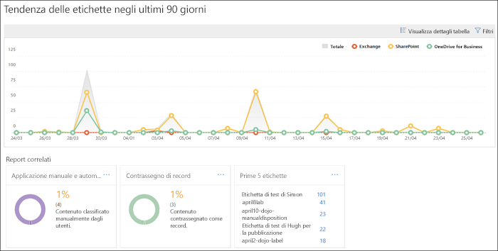
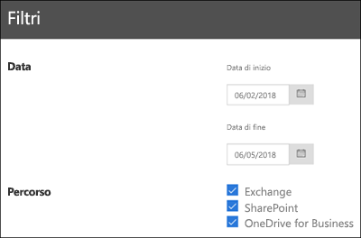

# Visualizzare i report sulla governance dei dati

After you create your labels, you'll want to verify that they're being applied to content as you intended. With the data governance reports in the Security &amp; Compliance Center, you can quickly view:
  
- **Top 5 labels** This report shows the count of the top 5 labels that have been applied to content. Click this report to view a list of all labels that have been recently applied to content. You can see each label's count, location, how it was applied, its retention actions, whether it's a record, and its disposition type. 
    
- **Applicazione manuale e automatica** Questo report mostra il numero di tutti i contenuti etichettati manualmente o automaticamente e la percentuale di contenuto etichettata manualmente e quella etichettata automaticamente. 
    
- **Contrassegno dei record** Questo report mostra il numero di tutti i contenuti contrassegnati come record o non record e le rispettive percentuali. 
    
- **Tendenza delle etichette negli ultimi 90 giorni** Questo report mostra il numero e la posizione di tutte le etichette applicate negli ultimi 90 giorni. 
    
Tutti questi report mostrano il contenuto etichettato di Exchange, SharePoint e OneDrive for Business.
  
È possibile trovare questi report in Centro sicurezza e conformità \> **Governance delle informazioni** \> **Dashboard**.
  

  
You can filter the data governance reports by date (up to 90 days) and location (Exchange, SharePoint, and OneDrive for Business). The most recent data can take up to 24 hours to appear in the reports.
  

  

