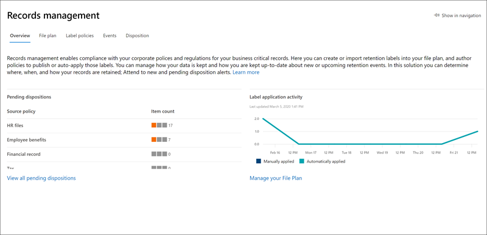

# Novità sulla conformità Microsoft 365What's new in Microsoft 365 compliance

L'aggiunta di nuove soluzioni al [centro conformità di Microsoft 365](microsoft-365-compliance-center.md), l'aggiornamento delle funzionalità esistenti in base ai commenti e la documentazione aggiornata, Microsoft 365 consente di rimanere al di sopra del panorama di conformità sempre mutevole.Whether it be adding new solutions to the [Microsoft 365 compliance center](microsoft-365-compliance-center.md), updating existing features based on your feedback, or rolling out fresh and updated documentation, Microsoft 365 helps you stay on top of the ever-changing compliance landscape. Per informazioni sulle novità della conformità di Microsoft 365, vedere oggi stesso.Take a look below to see what’s new in Microsoft 365 compliance today. 

> [!NOTE]
> Alcune funzionalità di conformità vengono distribuite a velocità diverse rispetto ai clienti.Some compliance features get rolled out at different speeds to our customers. Se non si vede ancora una funzionalità, provare ad aggiungersi alla [versione mirata](https://docs.microsoft.com/office365/admin/manage/release-options-in-office-365).If you aren't seeing a feature yet, try adding yourself to [targeted release](https://docs.microsoft.com/office365/admin/manage/release-options-in-office-365).

> [!TIP]
> Interessato a cosa succede in altri centri di amministrazione?Interested in what's going on in other admin centers? Consultare questi articoli:Check out these articles: [Novità dell'interfaccia di amministrazione di Microsoft 365What's new in the Microsoft 365 admin center](https://docs.microsoft.com/office365/admin/whats-new-in-preview?view=o365-worldwide) [Novità dell'interfaccia di amministrazione di SharePointWhat's new in the SharePoint admin center](https://docs.microsoft.com/sharepoint/what-s-new-in-admin-center) [Novità di Microsoft 365 DefenderWhat's new in Microsoft 365 Defender](https://docs.microsoft.com/microsoft-365/security/mtp/whats-new)  
Per informazioni sulle funzionalità di Microsoft 365 che sono state avviate, sono in sviluppo, sono state annullate o sono state rilasciate in precedenza. [365](https://www.microsoft.com/en-us/microsoft-365/roadmap)And visit the [Microsoft 365 Roadmap](https://www.microsoft.com/en-us/microsoft-365/roadmap) to learn about Microsoft 365 features that were launched, are rolling out, are in development, have been cancelled, or previously released.

## Ottobre 2020October 2020

### Advanced eDiscoveryAdvanced eDiscovery

[Supporto per la lingua CJK](ediscovery-cjk-support.md).[CJK language support](ediscovery-cjk-support.md). Advanced eDiscovery ora supporta le lingue del set di caratteri a doppio byte, conosciute collettivamente come lingue CJK (include cinese semplificato, cinese tradizionale, giapponese e coreano).Advanced eDiscovery now supports double-byte character set languages, collectively known as CJK languages (includes Simplified Chinese, Traditional Chinese, Japanese, and Korean). Questi possono essere utilizzati in diversi scenari di set di revisione avanzati.These can be used in several advanced review set scenarios.

### Etichette di riservatezzaSensitivity labels

- [Ambito delle etichette](sensitivity-labels.md#label-scopes).[Label scope](sensitivity-labels.md#label-scopes). Quando si crea un'etichetta di riservatezza, viene visualizzata una nuova opzione per definire l'ambito dell'etichetta.When creating a sensitivity label, you’ll see a new option to define the scope for the label. Questa opzione consente di configurare le etichette solo per file e messaggi di posta elettronica, contenitori (come i siti di SharePoint e i team) o entrambi.This option lets you configure labels just for files and emails, containers (like SharePoint sites and Teams), or both.
- [Contrassegno contenuto dinamico](sensitivity-labels-office-apps.md#dynamic-markings-with-variables).[Dynamic content marking](sensitivity-labels-office-apps.md#dynamic-markings-with-variables). Quando si configura la marcatura del contenuto per un'etichetta di riservatezza, è ora possibile utilizzare le variabili dinamiche come `${Item.Label}` e `${Item.Location}` nella stringa di testo per l'intestazione, il piè di pagina o la filigrana.When configuring content marking for a sensitivity label, you can now use the dynamic variables such as `${Item.Label}` and `${Item.Location}` in the text string for your header, footer, or watermark.

## Settembre 2020September 2020

### Spotlight: Compliance ManagerSpotlight: Compliance Manager

Annunciato in Ignite quest'anno, il Punteggio di conformità è stato rebranded As [Compliance Manager](compliance-manager.md).Announced at Ignite this year, Compliance Score is rebranded as [Compliance Manager](compliance-manager.md). Questa versione completa la transizione dalla Home page precedente di Compliance Manager nel Service Trust Portal e introduce una soluzione di gestione della conformità end-to-end nel centro conformità di Microsoft 365.This release completes the transition from Compliance Manager’s previous home in the Service Trust Portal, and introduces an end-to-end compliance management solution in the Microsoft 365 compliance center.

Guarda il video seguente per informazioni su come Compliance Manager può aiutare a semplificare la gestione della conformità dell'organizzazione.Watch the video below to learn how Compliance Manager can help simplify how your organization manages compliance.
 
 
>[!VIDEO https://www.microsoft.com/videoplayer/embed/RE4FGYZ]

### Audit avanzatoAdvanced Audit

- La nuova conservazione di 10 anni dei registri di controllo consente di supportare indagini lunghe e di rispondere a obblighi normativi, legali e interni.New 10-year retention of audit logs helps support long running investigations and respond to regulatory, legal, and internal obligations.
- [Tre nuovi nuovi eventi cruciali](advanced-audit.md#access-to-crucial-events-for-investigations).[Three new new crucial events](advanced-audit.md#access-to-crucial-events-for-investigations). I nuovi eventi riportati di seguito possono essere utili per individuare possibili violazioni e determinare l'ambito di compromesso: Send, SearchQueryInitiatedExchange e SearchQueryInitiatedSharePoint.The following new events can help you investigate possible breaches and determine the scope of compromise: Send, SearchQueryInitiatedExchange, and SearchQueryInitiatedSharePoint.

### Conformità delle comunicazioniCommunication compliance

- [Gruppi di ruoli aggiornati](communication-compliance-configure.md#step-1-required-enable-permissions-for-communication-compliance).[Updated role groups](communication-compliance-configure.md#step-1-required-enable-permissions-for-communication-compliance). I gruppi di ruoli Compliance Communication ora corrispondono alla struttura del gruppo di ruoli disponibile per la soluzione di gestione dei rischi Insider.Communication compliance role groups now match the role group structure available for the insider risk management solution.
- [Dashboard report](communication-compliance-feature-reference.md#reports-preview).[Reports dashboard](communication-compliance-feature-reference.md#reports-preview). La posizione centrale per la visualizzazione di tutti i report di conformità della comunicazione.Your central location for viewing all communication compliance reports. I widget dei report offrono una rapida visualizzazione delle informazioni più comuni necessarie per una valutazione complessiva dello stato delle attività di conformità alla comunicazione.Report widgets provide a quick view of insights most commonly needed for an overall assessment of the status of communication compliance activities.
- [Flussi automatici di alimentazione automatizzati](communication-compliance-feature-reference.md#power-automate-flows-preview).[Power Automate flows](communication-compliance-feature-reference.md#power-automate-flows-preview). Impostare i flussi per automatizzare le attività per gli avvisi e gli utenti, informare i responsabili quando gli utenti attivano gli avvisi e altro ancora.Set up flows to automate tasks for alerts and users, notify managers when users trigger an alerts, and more.
- [Azione di correzione ' migliorare la classificazione '](communication-compliance-investigate-remediate.md#step-3-decide-on-a-remediation-action).[‘Improve classification’ remediation action](communication-compliance-investigate-remediate.md#step-3-decide-on-a-remediation-action). Gli avvisi contenenti elementi che soddisfano i classificatori addestrati potrebbero trarre vantaggio da commenti e suggerimenti utili per ridurre al minimo i falsi positivi nell'organizzazione.Alerts containing items that match trainable classifiers might benefit from feedback to help minimize false positives in your organization. L'opzione **migliora classificazione** consente di fornire commenti e suggerimenti se gli elementi rilevati corrispondono al classificatore configurato nei criteri di conformità della comunicazione correlati.The **Improve classification** option lets you provide feedback whether detected items match the classifier configured in the related communication compliance policy. È anche possibile suggerire ad altri classificatori di associarsi all'elemento per migliorare l'accuratezza della corrispondenza per gli avvisi futuri.You can even suggest other classifiers to associate with the item to improve match accuracy for future alerts.

### Connettori datiData connectors

- [Nuovi connettori di dati di terze parti](archiving-third-party-data.md#third-party-data-connectors).[New third-party data connectors](archiving-third-party-data.md#third-party-data-connectors). 25 nuovi connettori di dati, tra cui 14 connettori di Globanet e 8 da TeleMessage.25 new data connectors, including 14 connectors from Globanet and 8 from Telemessage.
- [Connettore badging fisico](import-physical-badging-data.md).[Physical badging connector](import-physical-badging-data.md). Importare dati fisici di badging, ad esempio gli eventi di accesso fisico non elaborati del dipendente o gli allarmi di accesso fisico generati dal sistema badging dell'organizzazione.Import physical badging data, such as employee’s raw physical access events or any physical access alarms generated by your organization's badging system. Tra gli esempi sono inclusi le voci di edifici, sale server o Data Center.Examples include entries to buildings, server rooms, or data centers. I dati fisici di badging possono essere utilizzati dalla soluzione di gestione dei rischi Insider per proteggere l'organizzazione da attività dannose o furti di dati all'interno dell'organizzazione.Physical badging data can be used by the insider risk management solution to help protect your organization from malicious activity or data theft inside your organization.

### Gestione dei rischi InsiderInsider risk management

- [Integrazione di Microsoft teams](insider-risk-management-settings.md#microsoft-teams-preview).[Microsoft Teams integration](insider-risk-management-settings.md#microsoft-teams-preview). Quando l'integrazione di teams è attivata nelle impostazioni di rischio Insider, è possibile coordinare e collaborare con altre parti interessate in teams in attività come la condivisione e l'archiviazione sicure dei dati relativi a singoli casi, la verifica e la revisione delle attività di risposta da analisti e ricercatori e altro ancora.When Teams integration is turned on in insider risk settings, you can coordinate and collaborate with other stakeholders in Teams on tasks like securely sharing and storing data related to individual cases, tracking and reviewing response activities from analysts and investigators, and more.
- [Flussi automatici di alimentazione automatizzati](insider-risk-management-settings.md#power-automate-flows-preview).[Power Automate flows](insider-risk-management-settings.md#power-automate-flows-preview). Impostare i flussi per automatizzare le attività importanti per i casi e gli utenti, ad esempio il recupero di informazioni sull'utente, l'avviso e i casi da condividere con le parti interessate e altre app, automatizzando azioni come la pubblicazione di note di caso e altro ancora.Set up flows to automate important tasks for cases and users, such as retrieving user, alert, and case info to share with stakeholders and other apps, automating actions like posting to case notes, and more.
- [Esplora attività](insider-risk-management-alerts.md#activity-explorer-preview).[Activity explorer](insider-risk-management-alerts.md#activity-explorer-preview). Disponibile quando si esaminano gli avvisi, attività Esplora risorse fornisce ai ricercatori e agli analisti uno strumento analitico completo per eseguire il drill-down in ogni avviso.Available when reviewing alerts, activity explorer provides investigators and analysts with a comprehensive analytic tool for drilling down into each alert. Esaminare rapidamente una cronologia delle attività a rischio individuate e identificare e filtrare tutte le attività di rischio associate agli avvisi.Quickly review a timeline of detected risky activity and identify and filter all risk activities associated with alerts.

### Criteri di conservazione ed etichette di conservazione.Retention policies and retention labels

- [Supporto per Yammer](retention-policies-yammer.md).[Support for Yammer](retention-policies-yammer.md). È ora possibile utilizzare i criteri di conservazione per conservare ed eliminare i messaggi della community e i messaggi privati di Yammer.You can now use retention policies to retain and delete Yammer community messages and private messages.
- [Applicare etichette alle registrazioni di riunioni di teams](apply-retention-labels-automatically.md#microsoft-teams-meeting-recordings).[Apply labels to Teams meetings recordings](apply-retention-labels-automatically.md#microsoft-teams-meeting-recordings). Quando si crea un criterio di etichettatura automatica, utilizzare l'editor di query con parole chiave per identificare le registrazioni delle riunioni dei team archiviate negli account di OneDrive degli utenti o in SharePoint.When creating an auto-labeling policy, use the keyword query editor to identify Teams meeting recordings that are stored in users' OneDrive accounts or in SharePoint.

### Gestione dei recordRecords management

[Supporto per i record normativi](declare-records.md#how-to-display-the-option-to-mark-content-as-a-regulatory-record).[Support for regulatory records](declare-records.md#how-to-display-the-option-to-mark-content-as-a-regulatory-record). La classificazione di un'etichetta come record normativo aumenta le restrizioni applicate al contenuto a cui è applicata l'etichetta e limita le azioni di gestione disponibili per l'etichetta stessa.Classifying a label as a regulatory record increases the restrictions placed on content to which the label is applied and limits the available management actions for the label itself. Ad esempio, dopo che è stato applicato al contenuto, nessuno, neanche un amministratore globale, può rimuovere l'etichetta.For example, after it’s applied to content, nobody, not even a global admin, can remove the label. Per [ulteriori](records-management.md#compare-restrictions-for-what-actions-are-allowed-or-blocked) informazioni, vedere quali azioni sono consentite e bloccate per i record normativi.[Learn more](records-management.md#compare-restrictions-for-what-actions-are-allowed-or-blocked) about which actions are allowed and blocked for regulatory records.

### Etichette di riservatezzaSensitivity labels

[Supporto per i clienti del governo degli Stati Uniti](https://docs.microsoft.com/enterprise-mobility-security/solutions/ems-aip-premium-govt-service-description).[Support for US Government customers](https://docs.microsoft.com/enterprise-mobility-security/solutions/ems-aip-premium-govt-service-description). Le etichette di riservatezza sono ora supportate per i clienti GCC, GCC High e DoD, solo per il client e lo scanner di Azure Information Protection Unified labeling.Sensitivity labels are now supported for GCC, GCC High, and DoD customers, only for the Azure Information Protection unified labeling client and scanner.

### Classificatori sottoponibili a trainingTrainable classifiers

Nuove funzionalità di riqualificazione e feedback consentono di migliorare l'accuratezza e ridurre al minimo le corrispondenze false positive per tutti i classificatori personalizzati e alcuni classificatori prequalificati.New retraining and feedback capabilities helps improve accuracy and minimize false positive matches for all custom classifiers and some pre-trained classifiers. Questo flusso consente di fornire commenti e suggerimenti su come gli elementi corrispondono a determinati classificatori, suggerire ad altri classificatori di associare gli elementi e riqualificare i classificatori per affinare e migliorare l'accuratezza delle corrispondenze.This flow lets you provide feedback on whether items match certain classifiers, suggest other classifiers to associate with items, and retrain classifiers to refine and improve match accuracy.

Questa nuova funzionalità è inclusa nelle caratteristiche seguenti:This new capability is included in the following features:

> [!NOTE]
> Per tutte le funzionalità, se si forniscono almeno 30 risposte di feedback, verrà creata una versione riqualificata del classificatore che è possibile esaminare.For all features, if you provide at least 30 feedback responses, we'll create a retrained version of that classifier that you can review. Se si verifica un miglioramento, è possibile ripubblicare il classificatore.If there's improvement, you can republish the classifier.

- [Classificatori addestrabili](classifier-learn-about.md#retraining-classifiers).[Trainable classifiers](classifier-learn-about.md#retraining-classifiers). Per migliorare l'accuratezza dei classificatori pubblicati, è possibile fornire commenti e suggerimenti sull'eventuale corrispondenza tra gli elementi rilevati e il classificatore.To improve the accuracy of your published classifiers, you can provide feedback on whether the detected items match the classifier.
- [Conformità alla comunicazione](classifier-how-to-retrain-comms-compliance.md).[Communication compliance](classifier-how-to-retrain-comms-compliance.md). La nuova azione **miglioramento classificazione** consente di fornire commenti e suggerimenti se un elemento di un avviso di conformità della comunicazione corrisponde al classificatore configurato nel criterio di conformità della comunicazione.The new **Improve classification** remediation action lets you provide feedback whether an item from a communication compliance alert matches the classifier configured in the communication compliance policy.
- [Esplora contenuto](classifier-how-to-retrain-content-explorer.md).[Content explorer](classifier-how-to-retrain-content-explorer.md). Se si configura un criterio di etichettatura automatica di conservazione per applicare automaticamente le etichette ai messaggi di posta elettronica che corrispondono ai classificatori addestrabili, è possibile utilizzare Esplora contenuto per esaminare gli elementi contrassegnati e fornire commenti e suggerimenti se gli elementi corrispondono al classificatore.If you set up a retention auto-labeling policy to automatically apply labels to email messages that match trainable classifiers, you can use content explorer to review the labeled items and provide feedback whether the items match the classifier.

## Agosto 2020August 2020

### Spotlight: aggiornamenti per la conformità alle comunicazioni e ai rischi InsiderSpotlight: Insider risk and communication compliance updates

Numerose funzionalità nuove e migliorate hanno colpito l'anteprima pubblica di questo mese:Several new and improved features hit public preview this month:

**Gestione dei rischi Insider****Insider risk management**

- Consultare i sei nuovi [modelli di criteri](insider-risk-management-policies.md#policy-templates):Check out our six new [policy templates](insider-risk-management-policies.md#policy-templates):
    - Perdite di dati da parte di utenti prioritariData leaks by priority users
    - Perdite di dati da parte di utenti scontentiData leaks by disgruntled users
    - Violazioni dei criteri di sicurezza generaliGeneral security policy violations
    - Violazioni dei criteri di sicurezza da parte degli utentiSecurity policy violations by departing users
    - Violazioni dei criteri di sicurezza per gli utenti con prioritàSecurity policy violations by priority users
    - Violazioni dei criteri di sicurezza da parte di utenti scontentiSecurity policy violations by disgruntled users

- L'integrazione con [Microsoft Defender per endpoint](https://docs.microsoft.com/windows/security/threat-protection/microsoft-defender-atp/microsoft-defender-advanced-threat-protection) consente di importare e filtrare Microsoft Defender per gli avvisi endpoint per le attività rilevate dai criteri creati dai nuovi modelli di criteri di violazione della sicurezza.Integration with [Microsoft Defender for Endpoint](https://docs.microsoft.com/windows/security/threat-protection/microsoft-defender-atp/microsoft-defender-advanced-threat-protection) allows you to import and filter Microsoft Defender for Endpoint alerts for activities detected by policies created from the new security violation policy templates. È inoltre disponibile un'impostazione relativa ai [rischi Insider](insider-risk-management-settings.md#microsoft-defender-for-endpoint-preview) in cui è possibile scegliere di importare avvisi di sicurezza per la gestione dei rischi insider in base allo stato di valutazione degli avvisi di Microsoft Defender per endpoint.There’s also a related [insider risk setting](insider-risk-management-settings.md#microsoft-defender-for-endpoint-preview) where you can choose to import security alerts to insider risk management based on the Microsoft Defender for Endpoint alert triage status.

    > [!NOTE]
    > Per usufruire di Microsoft Defender per l'integrazione di endpoint (inclusi i nuovi modelli di violazione dei criteri di sicurezza), è necessario che Microsoft Defender per endpoint sia configurato nell'organizzazione.To take advantage of Microsoft Defender for Endpoint integration (including the new security policy violation templates), you'll need to have Microsoft Defender for Endpoint configured in your organization. È inoltre necessario abilitare Microsoft Defender per endpoint per l'integrazione di gestione dei rischi Insider [configurando funzionalità avanzate in Microsoft Defender for endpoint](https://docs.microsoft.com/windows/security/threat-protection/microsoft-defender-atp/advanced-features#share-endpoint-alerts-with-microsoft-compliance-center).You’ll also need to enable Microsoft Defender for Endpoint for insider risk management integration by [configuring advanced features in Microsoft Defender for Endpoint](https://docs.microsoft.com/windows/security/threat-protection/microsoft-defender-atp/advanced-features#share-endpoint-alerts-with-microsoft-compliance-center).
 
- Personalizzare le soglie degli indicatori quando si [Crea un criterio](insider-risk-management-policies.md#create-a-new-policy).Customize indicator thresholds when [creating a policy](insider-risk-management-policies.md#create-a-new-policy).
- Impostare i [gruppi](insider-risk-management-settings.md#priority-user-groups-preview) di utenti prioritari per definire gli utenti dell'organizzazione la cui attività richiede un controllo più approfondito in base a fattori quali la posizione, il livello di accesso alle informazioni riservate o la cronologia dei rischi.Set up [priority user groups](insider-risk-management-settings.md#priority-user-groups-preview) to define users in your organization whose activity requires closer inspection based on factors such as their position, level of access to sensitive information, or risk history.
- Utilizzare le API di attività di gestione di Office 365 per [esportare i dettagli dell'avviso sui rischi Insider](insider-risk-management-settings.md#export-alerts-preview) ad altre applicazioni che possono essere utilizzate dall'organizzazione per gestire o aggregare dati di rischioUse Office 365 Management Activity APIs to [export insider risk alert details](insider-risk-management-settings.md#export-alerts-preview) to other applications your organization might use to manage or aggregate insider risk data.
- [Le nuove impostazioni di dominio](insider-risk-management-settings.md#domains-preview) consentono di definire e controllare i livelli di rischio per attività in domini specifici.New [domain settings](insider-risk-management-settings.md#domains-preview) help you define and control risk levels for activity in specific domains.

**Conformità delle comunicazioni****Communication compliance**

- Quando si [esaminano i messaggi in un avviso](communication-compliance-investigate-remediate.md#step-3-decide-on-a-remediation-action), è ora possibile rimuovere i messaggi inadeguati nei canali Microsoft teams, 1:1 e Group Chat.When [reviewing messages in an alert](communication-compliance-investigate-remediate.md#step-3-decide-on-a-remediation-action), you can now remove inappropriate messages in Microsoft Teams channels, 1:1, and group chats. I messaggi e il contenuto rimossi vengono sostituiti con un suggerimento per i criteri che spiega che è stato rimosso a causa di contenuti sensibili.Removed messages and content are replaced with a policy tip that explains that it was removed due to sensitive content.
- Nuovi [ruoli di comunicazione](communication-compliance-configure.md#step-1-required-enable-permissions-for-communication-compliance) (saranno inclusi anche nei nuovi gruppi di ruoli di conformità di comunicazione che rilasciano a settembre).New [communication roles](communication-compliance-configure.md#step-1-required-enable-permissions-for-communication-compliance) (these will also be included in new communication compliance role groups releasing in September).
- Nuova esperienza delle impostazioni di conformità di comunicazione che include le impostazioni per la [privacy](communication-compliance-feature-reference.md#privacy-preview) e i [modelli di avviso](communication-compliance-feature-reference.md#notice-templates).New communication compliance settings experience that includes settings for [privacy](communication-compliance-feature-reference.md#privacy-preview) and [notice templates](communication-compliance-feature-reference.md#notice-templates).
- Nuovi [classificatori](communication-compliance-feature-reference.md#classifiers) che consentono di rilevare immagini adulte, audace e cruente.New [classifiers](communication-compliance-feature-reference.md#classifiers) to help detect adult, racy, and gory images.
- La nuova notifica ' pattern detected ' che viene visualizzata quando si [esaminano i messaggi in un avviso](communication-compliance-investigate-remediate.md#step-2-examine-the-message-details) consente di conoscere le istanze ricorrenti dello stesso comportamento da parte di un utente.New ‘Pattern detected’ notification that appears when [reviewing messages in an alert](communication-compliance-investigate-remediate.md#step-2-examine-the-message-details) lets you know about reoccurring instances of the same behavior by a user.

### Etichette di riservatezzaSensitivity labels

- Per i tenant degli enti pubblici degli Stati Uniti (GCC, GCC-HC e DoD), le etichette di riservatezza sono attualmente supportate solo per lo scanner e il client di etichettatura unificata di Azure Information Protection.For US Government tenants (GCC, GCC-H, and DoD), sensitivity labels are currently supported only for the Azure Information Protection unified labeling client and scanner. Per altre informazioni, vedere [Descrizione del servizio Azure Information Protection Premium per gli enti pubblici](https://docs.microsoft.com/enterprise-mobility-security/solutions/ems-aip-premium-govt-service-description).For more information, see [Azure Information Protection Premium Government Service Description](https://docs.microsoft.com/enterprise-mobility-security/solutions/ems-aip-premium-govt-service-description).
- Per creare e configurare tutte le impostazioni visualizzate nell'interfaccia di amministrazione dell'etichettatura, è ora possibile [utilizzare PowerShell per la sicurezza & Compliance Center](create-sensitivity-labels.md#use-powershell-for-sensitivity-labels-and-their-policies) .You can now [use Security & Compliance Center PowerShell](create-sensitivity-labels.md#use-powershell-for-sensitivity-labels-and-their-policies) to create and configure all settings you see in your labeling admin center. Questo significa che, oltre a utilizzare PowerShell per le impostazioni che non sono disponibili nell'interfaccia di amministrazione dell'etichettatura, è ora possibile creare completamente script per la creazione e la manutenzione delle etichette di riservatezza e dei criteri di etichetta di riservatezza.This means that, in addition to using PowerShell for settings that aren't available in the labeling admin centers, you can now fully script the creation and maintenance of sensitivity labels and sensitivity label policies.

### Gestione dei record: Revisione del contenutoRecords management: Content overhaul

Nuovi documenti che coprono i passaggi di distribuzione, contrassegnando il contenuto come record e le versioni dei record:New docs covering deployment steps, marking content as records, and record versioning:

- [Introduzione alla gestione dei recordGet started with records management](get-started-with-records-management.md)
- [Usare le etichette di conservazione per dichiarare i recordDeclare records by using retention labels](declare-records.md)
- [Usare il controllo delle versioni per aggiornare i record archiviati in SharePoint o OneDriveUse record versioning to update records stored in SharePoint or OneDrive](record-versioning.md)

### Criteri delle etichette di conservazione &Retention labels & policies

L'attività amministrativa relativa alla conservazione è ora registrata e disponibile per la revisione nel log di controllo.Retention-related admin activity is now recorded and available to review in the audit log. Per la lista completa, vedere [Attività inerenti i criteri e le etichette di conservazione](search-the-audit-log-in-security-and-compliance.md#retention-policy-and-retention-label-activities).For the full list, see [Retention policy and retention label activities](search-the-audit-log-in-security-and-compliance.md#retention-policy-and-retention-label-activities).

### Advanced eDiscoveryAdvanced eDiscovery

- Quando si [aggiunge una raccolta a un set di revisione](add-data-to-review-set.md#define-options-to-scope-your-collection-for-review), è ora possibile includere gli allegati moderni (denominati anche "allegati cloud") e le versioni di documenti di SharePoint.When [adding a collection to a review set](add-data-to-review-set.md#define-options-to-scope-your-collection-for-review), you can now include modern attachments (also called “cloud attachments”) and SharePoint document versions.
- Nuova [esperienza di esportazione del download diretto](export-documents-from-review-set.md), eliminando la necessità di utilizzare Esplora archivi di Azure per scaricare il contenuto del caso.New [direct download export experience](export-documents-from-review-set.md), eliminating the need to use Azure Storage Explorer to download case content.

## Luglio 2020July 2020

### Spotlight sui documenti della GuidaSpotlight on help docs

Per facilitare la comprensione delle soluzioni di conformità che consentono di proteggere e gestire i dati sensibili dell'organizzazione, sono state create due nuove pagine di destinazione con una panoramica del modo in cui le soluzioni interagiscono per raggiungere tali obiettivi, inclusi i collegamenti ai documenti correlati, in modo da poterli immergere ulteriormente.To help you understand which compliance solutions are used to protect and govern your organization’s sensitive data, we created two new landing pages with overviews of how the solutions work together to achieve those goals, including links to related docs so you can dive in further.

[Microsoft Information Protection in Microsoft 365Microsoft Information Protection in Microsoft 365](information-protection.md) 
[Governance delle informazioni Microsoft in Microsoft 365Microsoft Information Governance in Microsoft 365](manage-Information-governance.md)

### Advanced eDiscovery: aggiungere origini dati non detentive ai casiAdvanced eDiscovery: Add non-custodial data sources to your cases

Aggiungere dati a un caso senza che sia necessario associarlo a un custode (noto come [origini dati non detentive](non-custodial-data-sources.md)).Add data to a case without having to associate it with a custodian (known as [non-custodial data sources](non-custodial-data-sources.md)). Se è necessario inserire un blocco di dati non detentivi, è possibile farlo utilizzando la nuova funzionalità di indicizzazione avanzata.And if you need to place this non-custodial data on hold, you’ll be able to do so using our new Advanced Indexing feature.

### Connettori dati: miglioramenti del connettore HRData connectors: HR connector enhancements

(In anteprima) Una nuova versione del [connettore HR](import-hr-data.md) consente di importare i dati relativi alle modifiche a livello di processo, alle revisioni delle prestazioni e ai piani di miglioramento delle prestazioni.(In preview) A new version of the [HR connector](import-hr-data.md) lets you import data related to job level changes, performance reviews, and performance improvement plans. Questi dati possono quindi essere utilizzati in diverse [politiche di rischio Insider](insider-risk-management-policies.md) per rilevare attività correlate.This data can then be used in several [insider risk policies](insider-risk-management-policies.md) to detect related activity.

### Etichette di conservazione: nuovo supporto per la posta elettronicaRetention labels: New support for email

È ora possibile creare un' [etichetta di conservazione](retention.md#retention-labels) per iniziare a mantenere la posta elettronica in base al momento in cui i messaggi sono stati etichettati.You can now create a [retention label](retention.md#retention-labels) to start retaining email based on when messages were labeled. Questo non si applica agli elementi del calendario, che verranno mantenuti in base alla data di invio dell'elemento.This doesn’t apply to calendar items, which will be retained based on when the item is sent.

### Etichette di riservatezza: nuova funzionalità e miglioramentoSensitivity labels: New feature and an improvement

- (In anteprima) Quando si configurano le impostazioni di crittografia per un'etichetta, cercare la nuova opzione per usare la [crittografia a chiave doppia](encryption-sensitivity-labels.md#double-key-encryption) per proteggere ulteriormente i file etichettati e i messaggi di posta elettronica.(In preview) When configuring encryption settings for a label, look for the new option to use [Double Key Encryption](encryption-sensitivity-labels.md#double-key-encryption) to further protect labeled files and emails.
- Quando si creano o si eliminano etichette di riservatezza o si creano, modificano o eliminano i criteri di etichetta, le modifiche vengono sincronizzate entro 1 ora per tutti gli utenti, le app e i servizi.When creating or deleting sensitivity labels or creating, editing, or deleting their label policies, changes now synchronize within 1 hour to all users, apps, and services.

## Giugno 2020June 2020

### Spotlight: i nuovi connettori di dati hanno colpito l'anteprimaSpotlight: New data connectors hit preview

Basandosi sulla promessa che consente di importare i dati da origini di terze parti in Microsoft 365, è lieta di annunciare la versione di anteprima di altri due connettori di dati:Building on our promise to help you import data from more third-party sources into Microsoft 365, we’re pleased to announce the preview release of two more data connectors:

- [Messaggio Bloomberg](archive-bloomberg-message-data.md).[Bloomberg message](archive-bloomberg-message-data.md). Importare e archiviare i dati della posta elettronica dei servizi finanziari dallo strumento di collaborazione del messaggio Bloomberg.Import and archive financial services email data from the Bloomberg Message collaboration tool. Dopo che i dati sono stati archiviati nelle cassette postali, è possibile accedere ai dati e utilizzarli in funzionalità di conformità, ad esempio conservazione per controversia legale, ricerca contenuto, archiviazione sul posto, controllo, conformità alla comunicazione e criteri di ritenzione.After the data’s stored in mailboxes, you can access and use the data in compliance features such as litigation hold, content search, In-place archiving, auditing, communication compliance, and retention policies.
- [Chat su ghiaccio](archive-icechat-data.md).[ICE Chat](archive-icechat-data.md). Importare e archiviare i dati di chat dei servizi finanziari dallo strumento di collaborazione di ICE chat.Import and archive financial services chat data from the ICE Chat collaboration tool. Dopo che i dati sono stati archiviati nelle cassette postali, è possibile accedere ai dati e utilizzarli in funzionalità di conformità, ad esempio conservazione per controversia legale, eDiscovery, archiviazione, controllo, conformità alla comunicazione e criteri per il mantenimento.After the data’s stored in mailboxes, you can access and use the data in compliance features such as litigation hold, eDiscovery, archiving, auditing, communication compliance, and retention policies.

### Punteggio di conformità & Compliance Manager: i risultati continuano a venireCompliance Score & Compliance Manager: The hits keep coming

Gli aggiornamenti di giugno includono una nuova visualizzazione drill-down di valutazione nel [Punteggio di conformità](compliance-score.md).June updates include a new assessment drill-down view in [Compliance Score](compliance-score.md). Monitorare lo stato di avanzamento del controllo, aggiungere, eliminare valutazioni direttamente dal punteggio di conformità e altro ancora.Monitor control progress, add, delete assessments directly from Compliance Score, and more.

Vuoi rimanere al di sopra degli aggiornamenti per la conformità score e Compliance Manager?Want to stay on top of updates to Compliance Score and Compliance Manager? Contrassegnare le [Note di rilascio del Punteggio di conformità](compliance-score-release-notes.md) e controllare spesso.Bookmark the [Compliance Score release notes](compliance-score-release-notes.md) and check back often.

## Maggio 2020May 2020

### Spotlight: la classificazione dei dati è stata rilasciata ufficialmenteSpotlight: Data classification is officially released

Classificazione dei dati, aka '[know your data](data-classification-overview.md)', features (Analytics, Content Explorer e Esplora attività) sono state graduate dalla fase di anteprima e sono disponibili per tutte le organizzazioni.Data classification, aka ‘[Know your data](data-classification-overview.md)’, features (analytics, content explorer, and activity explorer) have graduated from the preview phase and are available to all organizations. Potenti approfondimenti e strumenti consentono di individuare e valutare la modalità di utilizzo di informazioni e etichette sensibili (conservazione e sensibilità) nei contenuti all'interno dell'organizzazione.Powerful insights and tools can help you discover and evaluate how sensitive info and labels (retention and sensitivity) are being used in content across your organization. Esaminare il contenuto che contiene informazioni riservate o se sono state applicate etichette, esplorare l'attività delle etichette tra le posizioni di Microsoft 365, creare tipi di informazioni riservate personalizzate e altro ancora.Review content that contains sensitive info or has labels applied, explore label activity across Microsoft 365 locations, create custom sensitive info types, and more.

Fare un video tour...Take a video tour...

> [!VIDEO https://www.microsoft.com/videoplayer/embed/RE4vx8x]

### Classificatori addestrabili: una correzione e una funzionalitàTrainable classifiers: A fix and a feature

Potrebbe portare maggiori miglioramenti ai classificatori addestrabili:May brings more enhancements to trainable classifiers:

- Una correzione basata sui commenti e suggerimenti: quando si esegue il seeding e si addestra un classificatore personalizzato, non è più necessario immettere manualmente gli URL del sito di SharePoint e i percorsi delle cartelle.A fix based on your feedback: When you seed and train a custom classifier, you no longer need to manually enter SharePoint site URLs and folder paths. È ora possibile scegliere da un elenco di siti e cartelle prepopolare.You can now choose from a pre-populate list of sites and folders.
- Nuova caratteristica: quando si crea un'etichetta di riservatezza e si configurano le impostazioni di etichettatura automatica per le app di Office, è ora possibile applicare automaticamente (o consigliare agli utenti di applicare) l'etichetta al contenuto che corrisponde ai classificatori addestrabili.New feature: When creating a sensitivity label and configuring auto-labeling settings for Office apps, you can now automatically apply (or recommend that users apply) the label to content that matches trainable classifiers. [Altre informazioniLearn more](apply-sensitivity-label-automatically.md#configuring-trainable-classifiers-for-a-label)

### Conformità alla comunicazione: il supporto di Yammer è quiCommunication compliance: Yammer support is here

I messaggi privati e le conversazioni della community pubblica in Yammer sono supportati nei criteri di conformità della comunicazione.Private messages and public community conversations in Yammer are supported in communication compliance policies. Yammer è un canale facoltativo e deve essere in [modalità nativa](https://docs.microsoft.com/yammer/configure-your-yammer-network/overview-native-mode) per supportare l'analisi dei messaggi e degli allegati.Yammer is an optional channel and must be in [native mode](https://docs.microsoft.com/yammer/configure-your-yammer-network/overview-native-mode) to support scanning of messages and attachments.

### Prevenzione della perdita di dati: nuova restrizione di condivisioneData loss prevention: New sharing restriction

Quando si configura un criterio DLP per proteggere il contenuto in SharePoint o OneDrive, è ora possibile configurare l'azione "limitare l'accesso al contenuto" per bloccare le persone a cui è stato concesso l'accesso al contenuto tramite l'opzione "[chiunque abbia il collegamento](https://support.microsoft.com/office/share-files-outside-your-organization-with-anyone-links-53e91027-fb8e-4a6e-a3e4-5df4be32e38a)".When setting up a DLP policy to protect content in SharePoint or OneDrive, you can now configure the “Restrict access to content” action to block people who were given access to the content through the ‘[Anyone with the link](https://support.microsoft.com/office/share-files-outside-your-organization-with-anyone-links-53e91027-fb8e-4a6e-a3e4-5df4be32e38a)’ option.

### Gestione dei rischi Insider: adattare il volume degli avvisiInsider risk management: Tailor your alert volume

Le attività degli utenti rilevate dai criteri di rischio Insider sono assegnate a un punteggio di rischio specifico, che a sua data determina la gravità degli avvisi (basso, medio, alto).User activities detected by insider risk policies are assigned a specific risk score, which in turn determines the alert severity (low, medium, high). Per impostazione predefinita, Microsoft 365 genera una determinata quantità di avvisi di gravità bassa, media e alta, ma con la nuova [impostazione volume di avviso](insider-risk-management-settings.md#alert-volume)è possibile aumentare o diminuire il volume in base alle proprie esigenze.By default, Microsoft 365 generates a certain amount of low, medium, and high severity alerts, but with the new [alert volume setting](insider-risk-management-settings.md#alert-volume), you can increase or decrease the volume to suit your needs.

### Importazione PST: supporto per nuove aree geografichePST import: New region supported

Il caricamento di rete è ora disponibile in Emirati Arabi Uniti.Network upload is now available in United Arab Emirates.

### Etichette di riservatezza: nuova opzione privacySensitivity labels: New privacy option

Quando si configurano le [impostazioni del sito e del gruppo](sensitivity-labels-teams-groups-sites.md#how-to-configure-groups-and-site-settings) per un'etichetta, è ora possibile impostare l'opzione privacy su **None-Consenti agli utenti di scegliere gli utenti autorizzati a accedere al sito**.When configuring [site and group settings](sensitivity-labels-teams-groups-sites.md#how-to-configure-groups-and-site-settings) for a label, you can now set the privacy option to **None - let user choose who can access the site**. Questa opzione è utile quando si desidera proteggere il contenuto del contenitore utilizzando un'etichetta di riservatezza, ma è comunque possibile che gli utenti configurino l'impostazione di privacy.This is useful when you want to protect content in the container by using a sensitivity label, but still let users configure the privacy setting themselves.

## Aprile 2020April 2020

### Gestione dei record: Revision... e una nuova aggiuntaRecords management: Overhaul…and a new addition

April include un paio di aggiornamenti chiave per la soluzione di gestione dei record:April includes a couple key updates to our records management solution:

- La sezione ' Records Management ' è ora completamente disponibile nel centro conformità.The ‘Records management’ section is now fully available in the compliance center. Utilizzare le interfacce utente e le funzionalità aggiornate per il piano di file, le etichette di conservazione e i criteri di etichetta, gli eventi e la disposizione.Take advantage of updated user interfaces and functionality for file plan, retention labels and label policies, events, and disposition.
- A proposito di disposizione, è stato anche implementato il [certificato di disponibilità](disposition.md#disposition-of-records) dei record in SharePoint e OneDrive.Speaking of disposition, we also rolled out [proof of disposition](disposition.md#disposition-of-records) for records in SharePoint and OneDrive. È ora possibile visualizzare un elenco di elementi in quelle posizioni che sono state eliminate automaticamente o dopo una revisione della disposizione.You can now see a list of items in those locations that have been disposed of automatically or after a disposition review.

### Etichette di riservatezza: anteprima di criteri di etichettatura automaticaSensitivity labels: Preview auto-labeling policies

Con i criteri di etichettatura automatica, è ora possibile applicare automaticamente le etichette di riservatezza ai documenti di SharePoint e OneDrive che sono già stati salvati (aka ' data at rest) e messaggi di posta elettronica che sono già stati inviati o ricevuti (aka ' e-mail in transito ').With auto-labeling policies, you can now automatically apply sensitivity labels to SharePoint and OneDrive docs that are already saved (aka ‘data at rest) and emails that are already sent or received (aka ‘email in transit’). Poiché questa etichettatura viene applicata dai servizi anziché dalle app, non è necessario preoccuparsi di cosa hanno gli utenti delle app e di quale versione.Because this labeling is applied by services rather than by apps, you don't need to worry about what apps users have and what version.

Questa funzionalità consente di estendere l'etichettatura sul retro del client già inclusa nelle impostazioni di "etichettatura automatica per le app di Office" quando si crea un'etichetta di riservatezza.This capability extends the existing client-side labeling that’s already included in the ‘Auto-labeling for Office apps’ settings when you create a sensitivity label. Per velocizzare le differenze e i vantaggi delle opzioni di etichettatura automatica, vedere l' [articolo aggiornato](apply-sensitivity-label-automatically.md).To get up to speed on the differences and benefits of both auto-labeling options, check out the [updated article](apply-sensitivity-label-automatically.md).

## Marzo 2020March 2020

### Introduzione al controllo avanzatoIntroducing Advanced Audit

[Advanced audit in Microsoft 365](advanced-audit.md) introduce nuove funzionalità di controllo che consentono all'organizzazione di svolgere indagini forensi e di conformità.[Advanced Audit in Microsoft 365](advanced-audit.md) introduces new auditing capabilities that can help your organization with forensic and compliance investigations. Gli Highlight includono la conservazione a lungo termine dei log di controllo, i criteri di conservazione del registro di controllo personalizzato, la nuova azione di controllo delle cassette postali di *MailItemsAccessed* e l'introduzione di un nuovo limite di limitazione a livello di tenant, che fornisce all'organizzazione una quota di larghezza di banda completamente allocata per accedere ai dati di controllo.Highlights include long term retention of audit logs, custom audit log retention policies, new *MailItemsAccessed* mailbox auditing action, and the introduction of a new tenant-level throttling limit, which provides your organization with its own fully allocated bandwidth quota to access your auditing data.

### Score Compliance & Compliance Manager: anteprima dei miglioramenti più recentiCompliance Score & Compliance Manager: Preview the latest enhancements

Gli aggiornamenti principali per questa versione di anteprima includono:Key updates for this preview release include:

- Processo semplificato per la creazione e la modifica dei modelliSimplified process for creating and modifying templates
- Avviso per il controllo delle versioni e per i modelli e le azioniVersioning notice and control for templates and actions
- Sincronizzazione di azioni comuni tra gruppiSynchronizing common actions across groups
- Supporto per le lingue ora esteso a cinese (semplificato), cinese (tradizionale), francese, tedesco, italiano, giapponese, coreano, portoghese (Brasile), russo e spagnoloLanguage support now extended to Chinese (Simplified), Chinese (Traditional), French, German, Italian, Japanese, Korean, Portuguese (Brazil), Russian, and Spanish

Per ulteriori informazioni, vedere [Compliance Score](compliance-score.md) and [Compliance Manager](compliance-manager-overview.md)Learn more about [Compliance Score](compliance-score.md) and [Compliance Manager](compliance-manager-overview.md)

### Etichette di riservatezza: supporto per l'etichettatura dei file di Office in SharePoint e OneDrive (anteprima)Sensitivity labels: Support for labeling Office files in SharePoint and OneDrive (preview)

L'abilitazione dell'anteprima consente agli utenti di applicare etichette di riservatezza in Office sul Web.Enabling the preview allows users to apply sensitivity labels in Office on the web. Saranno in grado di visualizzare il pulsante **sensitivity** sulla barra multifunzione e il nome dell'etichetta applicata sulla barra di stato.They’ll be able to see the **Sensitivity** button on the ribbon and the applied label name on the status bar. Inoltre, se utilizzano le app desktop per etichettare e quindi salvare i file in SharePoint o OneDrive, Microsoft 365 sarà ora in grado di elaborare il contenuto di questi file se l'etichetta dispone di impostazioni di crittografia applicate.In addition, if they use desktop apps to label and then save their files on SharePoint or OneDrive, Microsoft 365 will now be able to process the content of these files if the label has encryption settings applied. La CoAuthoring, la eDiscovery, la prevenzione della perdita di dati, la ricerca e altre funzionalità di collaborazione saranno supportate anche in queste circostanze.Coauthoring, eDiscovery, data loss prevention, search, and other collaborative features will also be supported in these circumstances.

[Informazioni su come abilitare l'anteprimaLearn how to enable the preview](sensitivity-labels-sharepoint-onedrive-files.md)

## Febbraio 2020February 2020

### Gestione dei rischi Insider rilasciata ufficialmenteInsider risk management is officially released

Rullo di tamburi, per favore...Drum roll, please... La gestione dei rischi Insider è ora disponibile per le organizzazioni con gli abbonamenti seguenti:Insider risk management is now available to organizations with the following subscriptions:

- [Microsoft 365 E5](https://go.microsoft.com/fwlink/?linkid=2120431) (a pagamento o a prova)[Microsoft 365 E5](https://go.microsoft.com/fwlink/?linkid=2120431) (paid or trial)
- Sottoscrizione Microsoft 365 Enterprise E3 con il [componente aggiuntivo Microsoft E5 Compliance](https://go.microsoft.com/fwlink/?linkid=2120432)Microsoft 365 Enterprise E3 subscription with the [Microsoft E5 Compliance add-on](https://go.microsoft.com/fwlink/?linkid=2120432)

Heads up che sono stati apportati alcuni miglioramenti dopo la versione di anteprima, inclusi i [nuovi gruppi di ruoli](insider-risk-management-configure.md#step-1-enable-permissions-for-insider-risk-management) e [le impostazioni a livello di soluzione](insider-risk-management-configure.md#step-4-configure-insider-risk-settings).Heads up that we made some improvements since the preview release, including [new role groups](insider-risk-management-configure.md#step-1-enable-permissions-for-insider-risk-management) and [solution-wide settings](insider-risk-management-configure.md#step-4-configure-insider-risk-settings).

Come sempre, si prega di lasciare commenti e suggerimenti quando si utilizza la soluzione in modo da poter continuare a migliorare.As always, please leave feedback as you use the solution so we can continue to make improvements.

### Gestione dei recordRecords management

Questa nuova soluzione apporta tutte le funzionalità di gestione dei record in un unico ombrello.This new solution brings all the records management capabilities under a single umbrella. Tra i punti salienti sono inclusi l'introduzione del controllo delle versioni dei record per SharePoint e OneDrive e la prova dello smaltimento dei record.Highlights include the introduction of records versioning for SharePoint and OneDrive and proof of disposal for records.

[Ulteriori informazioni sulla gestione dei recordLearn more about records management](records-management.md)

### Spotlight della soluzione: connettori di dati per Facebook e TwitterSolution spotlight: Data connectors for Facebook and Twitter

Connettori di dati [rilasciati il mese scorso](#just-launched) e stiamo cercando il vostro aiuto per testare i connettori seguenti.Data connectors [released last month](#just-launched) and we're looking for your help in testing out the following connectors.

- [Pagine business di Facebook](archive-facebook-data-with-sample-connector.md).[Facebook business pages](archive-facebook-data-with-sample-connector.md). Importa e archivia i dati dalle pagine di business di Facebook a Microsoft 365.Imports and archives data from Facebook business pages to Microsoft 365. Vantaggi per le soluzioni di conformità, ad esempio la gestione dei record e eDiscovery.Beneficial for compliance solutions such as records management and eDiscovery.
- [Twitter](archive-twitter-data-with-sample-connector.md).[Twitter](archive-twitter-data-with-sample-connector.md). Importa e archivia i dati da Twitter a Microsoft 365.Imports and archives data from Twitter to Microsoft 365. Vantaggi per le soluzioni di conformità, ad esempio la gestione dei record e eDiscovery.Beneficial for compliance solutions such as records management and eDiscovery.

Man mano che si configurano e convalidano questi connettori, si prega di lasciare commenti e suggerimenti su cosa è successo, cosa non è stato e cosa è possibile fare per migliorare l'esperienza.As you set up and validate these connectors, please leave us feedback about what went well, what didn't, and what we can do to improve the experience.

## Gennaio 2020January 2020

L'attesa è terminata.The wait is over. Siamo lieti di annunciare che Microsoft 365 Compliance Center è disponibile per tutti i clienti con i piani di Microsoft 365, Office 365, Enterprise Mobility + Security (EMS) e Windows 10 Enterprise.We're pleased to announce that the Microsoft 365 compliance center is available to all customers with Microsoft 365, Office 365, Enterprise Mobility + Security (EMS), and Windows 10 Enterprise plans. Tutti i dati o i criteri che sono stati gestiti nel centro sicurezza & conformità sono disponibili nel centro conformità, quindi non è necessario saltare avanti e indietro.Any data or policies you were managing in the Security & Compliance Center are available in the compliance center, so no need to jump back and forth.

> [!TIP]
> Leggere di nuovo l'aggiornamento del mese scorso per una panoramica su alcune delle [nuove soluzioni](#new-compliance-solutions) presentate di recente, oltre a una [Roadmap](#updated-compliance-solutions) in cui sono riportate le caratteristiche di conformità dal centro sicurezza & conformità ora in Microsoft 365.Read through last month's update again for a refresher on some of the [new solutions](#new-compliance-solutions) we previewed recently, as well as a [roadmap](#updated-compliance-solutions) showing where compliance features from the Security & Compliance Center now live in Microsoft 365.

Segnalibro e Head Over Now to [https://compliance.microsoft.com](https://compliance.microsoft.com) to tour Your One-Stop-Shop per la gestione della conformità in tutto il tuo org... oppure [leggere questo articolo](microsoft-365-compliance-center.md) per approfondire un po' di più.Bookmark and head over now to [https://compliance.microsoft.com](https://compliance.microsoft.com) to tour your one-stop-shop for managing compliance across your org...or [read this article](microsoft-365-compliance-center.md) to dig in a bit more.

Questo mese sono state rilasciate anche soluzioni nuove e aggiornate.We also released new and updated solutions this month. Ecco una breve panoramica dei punti salienti.Here's a quick glance at the highlights.

### Ora in anteprimaNow in preview

**Gestione dei rischi Insider (Preview)****Insider risk management (preview)**

Siamo lieti di annunciare che la nostra soluzione di gestione dei rischi Insider è ora in anteprima pubblica.We're happy to announce that our insider risk management solution is now in public preview. In poche parole, la gestione dei rischi Insider aiuta l'organizzazione a identificare intelligentemente e ad intervenire sui rischi di informazioni privilegiate fornendo:In a nutshell, insider risk management helps your organization intelligently identify and take action on insider risks by providing:

- Controlli anonimi per garantire la privacy degli utenti.Anonymity controls to help ensure user privacy.
- Modelli di criteri intelligenti con indicatori nativi e di terze parti che identificano le minacce privilegiate, ad esempio le perdite di dati.Intelligent policy templates with native and third-party indicators that identify insider threats, such as data leaks.
- Flussi di lavoro di analisi end-to-end integrati che interessano, team HR e Legal.Integrated end-to-end investigation workflows that span across IT, HR and legal teams.

Ci piacerebbe sapere cosa ne pensi.We'd love to hear what you think. Quando si utilizza la soluzione, è possibile lasciarci commenti e suggerimenti per essere certi di soddisfare le proprie esigenze quando ci dirigiamo verso la disponibilità generale.As you use the solution, leave us feedback so we can make sure we're meeting your needs as we head toward general availability.

[Ulteriori informazioni sulla gestione dei rischi InsiderLearn more about insider risk management](insider-risk-management.md)

### Appena avviatoJust launched

**Conformità delle comunicazioni****Communication compliance**

La graduazione dalla fase di anteprima alla disponibilità completa, la conformità alla comunicazione è un componente chiave del nuovo set di soluzioni di rischio Insider.Graduating from the preview phase to full availability, communication compliance is a key component of our new insider risk solution set. Questa soluzione robusta consente di ridurre al minimo i rischi di comunicazione utilizzando flussi di lavoro per il rilevamento, l'analisi e l'adozione di azioni correttive per i messaggi che non soddisfano gli standard dell'organizzazione.This robust solution helps minimize communication risks using workflows for detecting, investigating, and taking remediation actions for messages that don't meet your organization's standards.

I commenti dei clienti durante l'anteprima sono stati fantastici.Customer feedback during the preview was fantastic. Sono stati apportati numerosi miglioramenti, tra cui un'esperienza di prima esecuzione per iniziare, miglioramenti alle azioni di ricerca e correzione e altro ancora.It resulted in several enhancements, including a first-run experience to get you started, improvements to investigation and remediation actions, and more.

[Ulteriori informazioni sulla conformità alla comunicazioneLearn more about communication compliance](communication-compliance.md)

**Connettori dati****Data connectors**

Precedentemente, lo spazio di condivisione con altre caratteristiche ' Import ' nel centro sicurezza & conformità di Office 365, i connettori di dati ora hanno la propria abitazione nel centro conformità di Microsoft 365.Formerly sharing space with other 'Import' features in the Office 365 Security & Compliance Center, data connectors now have their very own home in the Microsoft 365 compliance center. Utilizzare la nuova pagina ' data connectors ' per importare e archiviare i dati dai file delle risorse umane (HR) dell'organizzazione e da varie piattaforme di terze parti (come Facebook, LinkedIn, Twitter e Instant Bloomberg) alle cassette postali dell'organizzazione Microsoft 365.Use the new 'Data connectors' page to import and archive data from your organization's human resources (HR) files and various third-party platforms (like Facebook, LinkedIn, Twitter, and Instant Bloomberg) to mailboxes in your Microsoft 365 organization. Una volta importati, i dati possono essere gestiti in diverse soluzioni di conformità, tra cui eDiscovery, gestione dei rischi Insider, conformità alla comunicazione, controllo, criteri di conservazione e altro ancora.Once imported, this data can be managed in several compliance solutions, including eDiscovery, insider risk management, communication compliance, audit, retention policies, and more.

[Altre informazioni sui connettori di datiLearn more about data connectors](archiving-third-party-data.md)

### Aggiornamenti rilevantiNoteworthy updates

**Nuovi modelli di valutazione per il Punteggio di conformità (anteprima)****New assessment templates for Compliance Score (preview)**

Lavorando sempre duramente per ottenere un vantaggio rispetto al panorama di conformità sempre in evoluzione, il team di conformità Score ha inviato una nuova serie di modelli per valutare la conformità dell'organizzazione rispetto alle normative recenti e ottenere indicazioni su come implementare controlli più efficaci.Always working hard to help you get ahead of the ever-evolving compliance landscape, our Compliance Score team shipped a new set of templates to help you assess your organization's compliance posture against recent regulations and get guidance on how to implement more effective controls. Verranno visualizzati nuovi modelli per:You'll see new templates for:

- ISO/IEC 27701:2019ISO/IEC 27701:2019
- California Consumer Privacy Act (CCPA)California Consumer Privacy Act (CCPA)
- Brasile-legge generale sulla protezione dei dati (lei Geral de proteção de dados-LGPD)Brazil General Data Protection Law (Lei Geral de Proteção de Dados - LGPD)
- SOC 1 tipo 2 e SOC 2 di tipo 2SOC 1 Type 2 and SOC 2 Type 2

[Altre informazioni sui modelli di Punteggio di conformitàLearn more about Compliance Score templates](compliance-score.md#templates)

## Novembre & dicembre 2019November & December 2019

Durante le festività, è stata avviata l'implementazione di tutte le soluzioni di conformità che sono state dimostrate in Ignite.Over the holidays, we started rolling out all the great compliance solutions that were demo'd at Ignite. La maggior parte è in uno stato di anteprima, quindi testarli e assicurarsi di farci sapere cosa pensi aprendo la scheda di feedback in basso a destra del centro conformità.Most are in a preview state, so test them out and be sure to let us know what you think by opening the Feedback card at the bottom right of the compliance center.

### Conoscere il nuovo quartiereGet to know the new neighborhood

Il nuovo centro conformità di Microsoft 365 include nuove soluzioni e le funzionalità di conformità che si conoscono e si amano dal centro sicurezza & conformità di Office 365.The new Microsoft 365 compliance center includes brand new solutions as well as the compliance features you know and love from the Office 365 Security & Compliance Center. Let ' s dig in un po' di più...Let's dig in a bit more…

#### Nuove soluzioni di conformitàNew compliance solutions

Potrebbe essere utile sapere cos'è una *soluzione* .You might be wondering what a *solution* is. Per quanto il cloud abbia rivoluzionato la modalità di gestione delle attività, ha anche aperto la porta a nuovi metodi per il furto e la frode dei dati e ha reso necessarie nuove normative.As much as the cloud has revolutionized the way business is done, it's also opened the door for new methods of data theft and fraud and necessitated new regulations. Le soluzioni di conformità sono raccolte di funzionalità integrate che consentono di gestire i requisiti di conformità in evoluzione.Our compliance solutions are collections of integrated capabilities that can help you help you manage these evolving compliance requirements. Le funzionalità di una soluzione possono includere una combinazione di criteri, avvisi, report e altro ancora.A solution's capabilities might include a combination of policies, alerts, reports, and more.

Di seguito è illustrato un riepilogo delle nuove soluzioni disponibili.Here's a summary of the new solutions you'll find. Tieni d'occhio gli altri utenti che verranno presto.Keep an eye out for others coming soon.

> [!NOTE]
> Queste soluzioni sono situate solo nel centro conformità Microsoft 365.These solutions are located only in the Microsoft 365 compliance center. Non possono essere gestiti nel centro sicurezza & conformità di Office 365.They can't be managed in the Office 365 Security & Compliance Center.
 

|**Nuova soluzione****New solution**|**Descrizione****Description**|**Altre informazioni****Learn more**|
|:-----|:-----|:-----|
|Punteggio di conformità Microsoft (anteprima)Microsoft Compliance Score (preview)  |Creato da [Compliance Manager](compliance-manager-overview.md), il Punteggio di conformità è una funzionalità autonoma con una progettazione più semplice e più facile da usare che consente di comprendere e migliorare la posizione di conformità dell'organizzazione.Built from [Compliance Manager](compliance-manager-overview.md), Compliance Score is a standalone feature with a simpler, more user-friendly design that helps you understand and improve your organization's compliance posture. Calcola un punteggio basato sui rischi misurando lo stato di avanzamento del processo di completamento delle azioni che consentono di ridurre i rischi per la protezione dei dati e gli standard normativi.It calculates a risk-based score measuring your progress in completing actions that help reduce risks around data protection and regulatory standards.  |[Panoramica del Punteggio di conformità Microsoft (anteprima)Overview of Microsoft Compliance Score (preview)](compliance-score.md)|
|Catalogo delle soluzioni (anteprima)Solution catalog (preview)  |Il catalogo della soluzione è il One-Stop-Shop per scoprire, conoscere e iniziare rapidamente con le nostre soluzioni di gestione dei rischi e conformità.The solution catalog is your one-stop-shop for discovering, learning about, and quickly getting started with our compliance and risk management solutions. Il catalogo è suddiviso in tre categorie di conformità, ognuna delle quali contiene informazioni dettagliate sulle soluzioni che compongono tale categoria.The catalog is organized into three compliance categories, each containing details about the solutions that make up that category. Le categorie includono la protezione delle informazioni & governance, gestione dei rischi Insider e individuazione & rispostaCategories include Information protection & governance, Insider risk management, and Discovery & response  |[Panoramica del catalogo delle soluzioni (anteprima)Overview of the solution catalog (preview)](microsoft-365-solution-catalog.md)|
|Conformità alla comunicazione (anteprima)Communication compliance (preview)  |La conformità alla comunicazione è parte integrante della nuova categoria di gestione dei rischi Insider che consente di ridurre al minimo i rischi di comunicazione contribuendo a rilevare, acquisire e intraprendere azioni correttive per i messaggi inopportuni nell'organizzazione.Communication compliance is part of the new insider risk management category that helps minimize communication risks by helping you detect, capture, and take remediation actions for inappropriate messages in your organization. La soluzione consente di estendere le funzionalità dei criteri di supervisione in Office 365 introducendo diversi nuovi miglioramenti, ad esempio modelli intelligenti, flussi di lavoro di correzione flessibili e approfondimenti che consentono di eseguire le operazioni di monitoraggio.The solution extends the capabilities of supervision policies in Office 365 by introducing several new enhancements such as intelligent templates, flexible remediation workflows, and actionable insights.  |[Conformità della comunicazione in Microsoft 365 (anteprima)Communication compliance in Microsoft 365 (preview)](communication-compliance.md)|
|Classificazione dei dati (anteprima)Data classification (preview)  |La nuova pagina di classificazione dei dati contiene potenti strumenti e intuizioni utili per individuare e valutare la modalità di utilizzo di informazioni e etichette sensibili (conservazione e sensibilità) nei contenuti all'interno dell'organizzazione.Our new Data classification page contains powerful insights and tools to help you discover and evaluate how sensitive info and labels (retention and sensitivity) are being used in content across your organization. Esaminare il contenuto che contiene informazioni riservate o applicare etichette, esplorare l'attività delle etichette tra le posizioni di Microsoft 365, creare tipi di informazioni riservate personalizzate e molto altro ancora.Review content that contains sensitive info or has labels applied, explore label activity across Microsoft 365 locations, create custom sensitive info types, and much more. |[Panoramica della classificazione dei dati (anteprima)Data classification overview (preview)](data-classification-overview.md)|
|Classificatori sottoponibili a training (anteprima)Trainable classifiers (preview)  |Questo nuovo potente strumento utilizza il motore di apprendimento automatico per identificare le categorie di contenuto dell'organizzazione, ad esempio i documenti di regolamentazione o i contratti con i dipendenti.This powerful new tool uses our machine learning engine to help identify categories of content in your org, like regulatory docs or employee agreements. Una volta creato, i classificatori possono essere utilizzati in diverse soluzioni di conformità per individuare il contenuto correlato e classificarlo, proteggerlo, conservarlo e altro ancora.Once created, classifiers can be used in several compliance solutions to detect related content and classify it, protect it, retain it, and more. |[Informazioni sui classificatori sottoponibili a training (anteprima)Learn about trainable classifiers (preview)](classifier-learn-about.md)|

#### Soluzioni di conformità aggiornateUpdated compliance solutions

Se è stato utilizzato il Centro sicurezza & conformità di Office 365 per soddisfare i requisiti di conformità, potrebbe essere utile sapere dove sono presenti alcune funzionalità nel nuovo centro conformità di Microsoft 365.If you've been using the Office 365 Security & Compliance Center for your compliance needs, you might wonder where some features now live in the new Microsoft 365 compliance center. Ecco una guida di orientamento rapida per trovare le loro nuove case.Here's a quick roadmap to help find their new homes.

> [!NOTE]
> Alcune funzionalità sono ancora disponibili solo nel centro sicurezza & conformità di Office 365: queste sono note di seguito.Some features are still available only in the Office 365 Security & Compliance Center – these are noted below. Ma stiamo lavorando duramente per visualizzare in anteprima questi nel centro conformità Microsoft 365, quindi resta sintonizzato per gli aggiornamenti.But we're working hard to preview these in the Microsoft 365 compliance center, so stay tuned for updates. 
 

|**Caratteristica****Feature**|**Centro sicurezza e conformità di Office 365****Office 365 Security & Compliance Center**|**Centro conformità Microsoft 365****Microsoft 365 compliance center**|**Altre informazioni****Learn more**|
|:-----|:-----|:-----|:-----|
|Advanced eDiscoveryAdvanced eDiscovery|eDiscovery > Advanced eDiscoveryeDiscovery > Advanced eDiscovery   https://protection.office.com/advancedediscoverycases |eDiscovery > AdvancedeDiscovery > Advanced   https://compliance.microsoft.com/advancedediscovery | [Panoramica della soluzione avanzata di eDiscovery in Microsoft 365Overview of the Advanced eDiscovery solution in Microsoft 365](overview-ediscovery-20.md) |
|Criteri di avvisoAlert policies|Avvisi > criteri di avvisoAlerts > Alert policies   https://protection.office.com/alertpolicies |In questo momento, i criteri di avviso sono gestiti solo nel centro conformità & sicurezza di Office 365.At this time, alert policies are managed only in the Office 365 Security & Compliance Center. |[Criteri di avviso nel Centro sicurezza e conformitàAlert policies in the security and compliance center](alert-policies.md) |
|AvvisiAlerts|Avvisi > visualizzare gli avvisiAlerts > View alerts   https://protection.office.com/viewalerts |AvvisiAlerts   https://compliance.microsoft.com/compliancealerts |[Visualizzazione degli avvisiViewing alerts](alert-policies.md#viewing-alerts)|
|ArchivioArchive|Archivio > di governance delle informazioniInformation governance > Archive   https://protection.office.com/archiving |Scheda Archivio informazioni > di governanceInformation governance > Archive tab   https://compliance.microsoft.com/informationgovernance?viewid=archive |[Abilitare le cassette postali di archiviazioneEnable archive mailboxes](enable-archive-mailboxes.md)|
|Ricerca dei log di controlloAudit log search|Ricerca > log di controlloSearch > Audit log search   https://protection.office.com/unifiedauditlog |AuditAudit   https://compliance.microsoft.com/auditlogsearch | [Eseguire una ricerca nel log di controllo nel centro sicurezza & ComplianceSearch the audit log in the Security & Compliance Center](search-the-audit-log-in-security-and-compliance.md)|
|Ricerca contenutoContent search|Ricerca di contenuti > di ricercaSearch > Content search   https://protection.office.com/contentsearchbeta?ContentOnly=1 | Ricerca contenutoContent search   https://compliance.microsoft.com/contentsearch |[Ricerca di contenuto in Office 365Search for content in Office 365](search-for-content.md) |
|Connettori datiData connectors|Information Governance > archiviazione dei dati di terze partiInformation governance > Archive third-party data   https://protection.office.com/nativeconnector | Connettori datiData connectors   https://compliance.microsoft.com/connectorlanding |[Archiviare i dati di terze partiArchive third-party data](archiving-third-party-data.md)|
|Prevenzione della perdita di datiData loss prevention|Prevenzione della perdita di datiData loss prevention   https://protection.office.com/datalossprevention |Prevenzione della perdita di datiData loss prevention   https://compliance.microsoft.com/datalossprevention |[Panoramica sulla prevenzione della perdita dei datiOverview of data loss prevention](data-loss-prevention-policies.md)|
|Richieste degli interessatiData subject requests |Privacy dei dati > richieste del soggetto dei datiData privacy > Data subject requests   https://protection.office.com/dsrcases |Richieste del soggetto dei datiData subject requests   https://compliance.microsoft.com/datasubjectrequest |[Gestire le richieste del soggetto dei dati di GDPR con lo strumento di gestione dei casi DSRManage GDPR data subject requests with the DSR case tool](manage-gdpr-data-subject-requests-with-the-dsr-case-tool.md)|
|eDiscoveryeDiscovery|eDiscovery > eDiscoveryeDiscovery > eDiscovery   https://protection.office.com/ediscoveryv1 |eDiscovery > CoreeDiscovery > Core   https://compliance.microsoft.com/classicediscovery |[Gestire casi di eDiscoveryManage eDiscovery cases](ediscovery-cases.md) |
|EventsEvents|Eventi > di gestione dei recordRecords management > Events   https://protection.office.com/events |Scheda eventi > di gestione dei recordRecords management > Events tab   https://compliance.microsoft.com/recordsmanagement?viewid=events |[Avviare la conservazione al verificarsi di un eventoStart retention when an event occurs](event-driven-retention.md)|
|Piano di archiviazioneFile plan|Gestione dei record > piano fileRecords management > File plan   https://protection.office.com/fileplan |Scheda Gestione record > piano fileRecords management > File plan tab   https://compliance.microsoft.com/recordsmanagement?viewid=fileplan |[Usare il piano di archiviazione per gestire le etichette di conservazioneUse file plan to manage retention labels](file-plan-manager.md)|
|Importare i file PSTImport PST files|Information Governance > importazione di file PSTInformation governance > Import PST files   https://protection.office.com/importV2 |Scheda Importazione > di governance delle informazioniInformation governance > Import tab   https://compliance.microsoft.com/informationgovernance?viewid=import |[Panoramica dell'importazione di file PST dell'organizzazioneOverview of importing your organization's PST files](importing-pst-files-to-office-365.md)|
|Esplora attività etichetteLabel activity explorer|Gestione delle informazioni > label Activity ExplorerInformation governance > Label activity explorer   https://protection.office.com/labelexplorer |Classificazione dei dati > scheda Esplora attivitàData classification > Activity explorer tab   https://compliance.microsoft.com/dataclassification?viewid=activitiesexplorer |[Visualizzare le attività sul contenuto etichettato (anteprima)View activity on your labeled content (preview)](data-classification-activity-explorer.md)|
|Etichette di conservazione e criteri di etichettaRetention labels and label policies |Schede di classificazione > etichette di conservazione > etichette e criteri etichettaClassification > Retention labels > Labels and Label policies tabs   https://protection.office.com/retentionlabels |Schede per la governance delle informazioni > etichette e criteri etichettaInformation governance > Labels and Label policies tabs   https://compliance.microsoft.com/informationgovernance?viewid=labels   https://compliance.microsoft.com/informationgovernance?viewid=labelpolicies | [Panoramica delle etichette di conservazioneOverview of retention labels](retention.md)|
|Criteri di conservazioneRetention policies|Gestione delle informazioni > conservazioneInformation governance > Retention   https://protection.office.com/retention |Scheda conservazione > di gestione delle informazioniInformation governance > Retention tab   https://compliance.microsoft.com/informationgovernance?viewid=retention |[Informazioni sui criteri e sulle etichette di conservazioneLearn about retention policies and retention labels](retention.md)|
|Tipi di informazioni riservateSensitive info types|Classificazione > tipi di informazioni riservateClassification > Sensitive info types   https://protection.office.com/sensitivetypes |Classificazione dei dati > scheda tipi di informazioni riservateData classification > Sensitive info types tab   https://compliance.microsoft.com/dataclassification?viewid=sensitiveinfotypes |[Definizioni delle entità tipo di informazioni sensibiliSensitive information type entity definitions](sensitive-information-type-entity-definitions.md)|
|Etichette di riservatezza e criteri di etichettaSensitivity labels and label policies|Classificazione > etichette di riservatezza > etichette e schede criteri etichettaClassification > Sensitivity labels > Labels and Label policies tabs   https://protection.office.com/sensitivity |Schede per la protezione delle informazioni > etichette e criteri etichetteInformation protection > Labels and Label policies tabs   https://compliance.microsoft.com/informationprotection?viewid=sensitivitylabels   https://compliance.microsoft.com/informationprotection?viewid=sensitivitylabelpolicies |[Informazioni sulle etichette di riservatezzaLearn about sensitivity labels](sensitivity-labels.md) |
|Garanzia del servizioService assurance|Garanzia del servizioService assurance   https://protection.office.com/serviceassurance/dashboard |A questo punto, è possibile accedere alle risorse di Service Assurance solo nel centro sicurezza & conformità di Office 365.At this time, service assurance resources can only be accessed in the Office 365 Security & Compliance Center. |[Garanzia del servizio nel Centro sicurezza e conformitàService assurance in the Security & Compliance Center](service-assurance.md)|
|SupervisioneSupervision|SupervisioneSupervision   https://protection.office.com/supervisoryreviewv2 |Conformità delle comunicazioniCommunication compliance   https://compliance.microsoft.com/supervisoryreview |[Conformità della comunicazione in Microsoft 365 (anteprima)Communication compliance in Microsoft 365 (preview)](communication-compliance.md) |
