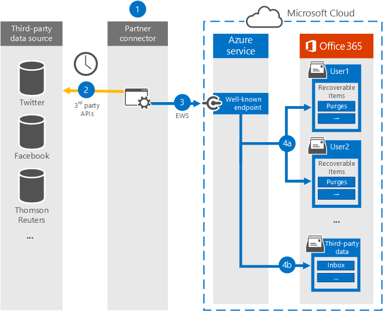

# <a name="work-with-a-partner-to-archive-third-party-data"></a><span data-ttu-id="67627-103">Collaborare con un partner per archiviare i dati di terze parti</span><span class="sxs-lookup"><span data-stu-id="67627-103">Work with a partner to archive third-party data</span></span>

<span data-ttu-id="67627-104">È possibile collaborare con un partner Microsoft per importare e archiviare dati da un'origine dati di terze parti in Microsoft 365.</span><span class="sxs-lookup"><span data-stu-id="67627-104">You can work with a Microsoft Partner to import and archive data from a third-party data source to Microsoft 365.</span></span> <span data-ttu-id="67627-105">Un partner può fornire un connettore personalizzato configurato per estrarre gli elementi dall'origine dati di terze parti (a intervalli regolari) e quindi importare tali elementi.</span><span class="sxs-lookup"><span data-stu-id="67627-105">A partner can provide you with a custom connector that is configured to extract items from the third-party data source (on a regular basis) and then import those items.</span></span> <span data-ttu-id="67627-106">Il connettore partner converte il contenuto di un elemento dall'origine dati in un formato di messaggio di posta elettronica e quindi archivia gli elementi nelle cassette postali.</span><span class="sxs-lookup"><span data-stu-id="67627-106">The partner connector converts the content of an item from the data source to an email message format and then stores the items in mailboxes.</span></span> <span data-ttu-id="67627-107">Dopo l'importazione dei dati di terze parti, è possibile applicare a questi dati le funzionalità di conformità di Microsoft 365, ad esempio conservazione per controversia legale, eDiscovery, archiviazione In-Place, controllo e criteri di conservazione di Microsoft 365.</span><span class="sxs-lookup"><span data-stu-id="67627-107">After third-party data is imported, you can apply Microsoft 365 compliance features such as Litigation Hold, eDiscovery, In-Place Archiving, Auditing, and Microsoft 365 retention policies to this data.</span></span>

>[!IMPORTANT]
><span data-ttu-id="67627-108">La [soluzione di conformità](communication-compliance.md) di comunicazione in Microsoft 365 non può essere applicata ai dati di terze parti importati dai connettori partner menzionati in questo articolo.</span><span class="sxs-lookup"><span data-stu-id="67627-108">The [Communication compliance](communication-compliance.md) solution in Microsoft 365 can't be applied to the third-party data imported by partner connectors mentioned in this article.</span></span> 

<span data-ttu-id="67627-109">Ecco una panoramica del processo e dei passaggi necessari per collaborare con un partner Microsoft per importare dati di terze parti.</span><span class="sxs-lookup"><span data-stu-id="67627-109">Here's an overview of the process and the steps necessary to work with a Microsoft Partner to import third-party data.</span></span>

[<span data-ttu-id="67627-110">Step 1: Find a third-party data partner</span><span class="sxs-lookup"><span data-stu-id="67627-110">Step 1: Find a third-party data partner</span></span>](#step-1-find-a-third-party-data-partner)

[<span data-ttu-id="67627-111">Passaggio 2: Creare e configurare una cassetta postale dati di terze parti</span><span class="sxs-lookup"><span data-stu-id="67627-111">Step 2: Create and configure a third-party data mailbox</span></span>](#step-2-create-and-configure-a-third-party-data-mailbox-in-microsoft-365)

[<span data-ttu-id="67627-112">Step 3: Configure user mailboxes for third-party data</span><span class="sxs-lookup"><span data-stu-id="67627-112">Step 3: Configure user mailboxes for third-party data</span></span>](#step-3-configure-user-mailboxes-for-third-party-data)

[<span data-ttu-id="67627-113">Passaggio 4: fornire informazioni al partner</span><span class="sxs-lookup"><span data-stu-id="67627-113">Step 4: Provide your partner with information</span></span>](#step-4-provide-your-partner-with-information)

[<span data-ttu-id="67627-114">Passaggio 5: Registrare il connettore dati di terze parti in Azure Active Directory</span><span class="sxs-lookup"><span data-stu-id="67627-114">Step 5: Register the third-party data connector in Azure Active Directory</span></span>](#step-5-register-the-third-party-data-connector-in-azure-active-directory)

## <a name="how-the-third-party-data-import-process-works"></a><span data-ttu-id="67627-115">Funzionamento del processo di importazione dei dati di terze parti</span><span class="sxs-lookup"><span data-stu-id="67627-115">How the third-party data import process works</span></span>

<span data-ttu-id="67627-116">La figura e la descrizione seguenti illustrano il funzionamento del processo di importazione dei dati di terze parti quando si lavora con un partner.</span><span class="sxs-lookup"><span data-stu-id="67627-116">The following illustration and description explain how the third-party data import process works when working with a partner.</span></span>
  

  
1. <span data-ttu-id="67627-118">Il cliente collabora con il partner scelto per configurare un connettore che estrarrà gli elementi dall'origine dati di terze parti e quindi importerà tali elementi in Microsoft 365.</span><span class="sxs-lookup"><span data-stu-id="67627-118">Customer works with their partner of choice to configure a connector that will extract items from the third-party data source and then import those items to Microsoft 365.</span></span>
    
2. <span data-ttu-id="67627-119">Il connettore partner si connette a origini dati di terze parti tramite un'API di terze parti (su base pianificata o come configurata) ed estrae gli elementi dall'origine dati.</span><span class="sxs-lookup"><span data-stu-id="67627-119">The partner connector connects to third-party data sources via a third-party API (on a scheduled or as-configured basis) and extracts items from the data source.</span></span> <span data-ttu-id="67627-120">Il connettore partner converte il contenuto di un elemento in un formato di messaggio di posta elettronica.</span><span class="sxs-lookup"><span data-stu-id="67627-120">The partner connector converts the content of an item to an email message format.</span></span> <span data-ttu-id="67627-121">Per una [descrizione](#more-information) dello schema in formato messaggio, vedere la sezione Ulteriori informazioni.</span><span class="sxs-lookup"><span data-stu-id="67627-121">See the [More information](#more-information) section for a description of the message-format schema.</span></span> 
    
3. <span data-ttu-id="67627-122">Il connettore partner si connette al servizio Azure in Microsoft 365 utilizzando il servizio Web Exchange (EWS) tramite un punto finale noto.</span><span class="sxs-lookup"><span data-stu-id="67627-122">Partner connector connects to the Azure service in Microsoft 365 by using Exchange Web Service (EWS) via a well-known end point.</span></span>
    
4. <span data-ttu-id="67627-p103">Gli elementi vengono importati nella cassetta postale di un utente specifico oppure in una cassetta postale generale di dati di terze parti. Il fatto che un elemento sia importato nella cassetta postale di un utente specifico o nella cassetta postale di dati di terze parti dipende dai seguenti criteri:</span><span class="sxs-lookup"><span data-stu-id="67627-p103">Items are imported into the mailbox of a specific user or into a "catch-all" third-party data mailbox. Whether an item is imported into a specific user mailbox or to the third-party data mailbox is based on the following criteria:</span></span>
    
   1. <span data-ttu-id="67627-125">**Elementi con un ID utente corrispondente a un account utente:** Se il connettore partner può mappare l'ID utente dell'elemento nell'origine dati di terze parti a  un ID utente specifico in Microsoft 365, l'elemento viene copiato nella cartella Ripuliture nella cartella Elementi ripristinabili dell'utente.</span><span class="sxs-lookup"><span data-stu-id="67627-125">**Items that have a user ID that corresponds to a user account:** If the partner connector can map the user ID of the item in the third-party data source to a specific user ID in Microsoft 365, the item is copied to the **Purges** folder in the user's Recoverable Items folder.</span></span> <span data-ttu-id="67627-126">Gli utenti non possono accedere agli elementi nella cartella Ripuliture.</span><span class="sxs-lookup"><span data-stu-id="67627-126">Users can't access items in the Purges folder.</span></span> <span data-ttu-id="67627-127">Tuttavia, è possibile utilizzare gli strumenti di eDiscovery per cercare elementi nella cartella Ripuliture.</span><span class="sxs-lookup"><span data-stu-id="67627-127">However, you can use eDiscovery tools to search for items in the Purges folder.</span></span>
    
   1. <span data-ttu-id="67627-128">**Elementi che non dispongono di un ID utente corrispondente a un account utente:** Se il connettore partner non è in grado di mappare l'ID  utente di un elemento a un ID utente specifico, l'elemento viene copiato nella cartella Posta in arrivo della cassetta postale dati di terze parti.</span><span class="sxs-lookup"><span data-stu-id="67627-128">**Items that don't have a user ID that corresponds to a user account:** If the partner connector can't map the user ID of an item to a specific user ID, the item is copied to the **Inbox** folder of the third-party data mailbox.</span></span> <span data-ttu-id="67627-129">L'importazione di elementi nella posta in arrivo consente a un utente dell'organizzazione di accedere alla cassetta postale di terze parti per visualizzare e gestire questi elementi e vedere se è necessario prevedere modifiche nella configurazione del connettore partner.</span><span class="sxs-lookup"><span data-stu-id="67627-129">Importing items to the inbox allows you or someone in your organization to sign in to the third-party mailbox to view and manage these items, and see if any adjustments need to be made in the partner connector configuration.</span></span>
 
## <a name="step-1-find-a-third-party-data-partner"></a><span data-ttu-id="67627-130">Passaggio 1: trovare un partner di dati di terze parti</span><span class="sxs-lookup"><span data-stu-id="67627-130">Step 1: Find a third-party data partner</span></span>

<span data-ttu-id="67627-131">Un componente chiave per l'archiviazione di dati di terze parti in Microsoft 365 è la ricerca e l'utilizzo di un partner Microsoft specializzato nell'acquisizione di dati da un'origine dati di terze parti e nell'importazione in Microsoft 365.</span><span class="sxs-lookup"><span data-stu-id="67627-131">A key component for archiving third-party data in Microsoft 365 is finding and working with a Microsoft partner that specializes in capturing data from a third-party data source and importing it to Microsoft 365.</span></span> <span data-ttu-id="67627-132">Dopo l'importazione, i dati possono essere archiviati e conservati insieme agli altri dati Microsoft dell'organizzazione, ad esempio la posta elettronica da Exchange e i documenti da SharePoint e OneDrive for Business.</span><span class="sxs-lookup"><span data-stu-id="67627-132">After the data is imported, it can be archived and preserved along with your organization's other Microsoft data, such as email from Exchange and documents from SharePoint and OneDrive for Business.</span></span> <span data-ttu-id="67627-133">Un partner crea un connettore che estrae i dati dalle origini dati di terze parti dell'organizzazione (ad esempio BlackBerry, Facebook, Google+, Thomson Reuters, Twitter e YouTube) e li passa a un'API di Microsoft 365 che importa gli elementi nelle cassette postali di Exchange come messaggi di posta elettronica.</span><span class="sxs-lookup"><span data-stu-id="67627-133">A partner creates a connector that extracts data from your organization's third-party data sources (such as BlackBerry, Facebook, Google+, Thomson Reuters, Twitter, and YouTube) and passes that data to a Microsoft 365 API that imports items to Exchange mailboxes as email messages.</span></span>
  
<span data-ttu-id="67627-134">Nelle sezioni seguenti sono elencati i partner Microsoft (e le origini dati di terze parti supportate) che partecipano al programma per l'archiviazione di dati di terze parti in Microsoft 365.</span><span class="sxs-lookup"><span data-stu-id="67627-134">The following sections list the Microsoft partners (and the third-party data sources they support) that are participating in the program for archiving third-party data in Microsoft 365.</span></span>

[<span data-ttu-id="67627-135">17a-4 LLC</span><span class="sxs-lookup"><span data-stu-id="67627-135">17a-4 LLC</span></span>](#17a-4-llc)
  
[<span data-ttu-id="67627-136">ArchiveSocial</span><span class="sxs-lookup"><span data-stu-id="67627-136">ArchiveSocial</span></span>](#archivesocial)
  
[<span data-ttu-id="67627-137">Globanet</span><span class="sxs-lookup"><span data-stu-id="67627-137">Globanet</span></span>](#globanet)
  
[<span data-ttu-id="67627-138">OpenText</span><span class="sxs-lookup"><span data-stu-id="67627-138">OpenText</span></span>](#opentext)
  
[<span data-ttu-id="67627-139">Smarsh</span><span class="sxs-lookup"><span data-stu-id="67627-139">Smarsh</span></span>](#smarsh)

[<span data-ttu-id="67627-140">Verba</span><span class="sxs-lookup"><span data-stu-id="67627-140">Verba</span></span>](#verba)
  
### <a name="17a-4-llc"></a><span data-ttu-id="67627-141">17a-4 LLC</span><span class="sxs-lookup"><span data-stu-id="67627-141">17a-4 LLC</span></span>

<span data-ttu-id="67627-142">[17a-4 LLC](https://www.17a-4.com) supporta le origini dati di terze parti seguenti:</span><span class="sxs-lookup"><span data-stu-id="67627-142">[17a-4 LLC](https://www.17a-4.com) supports the following third-party data sources:</span></span>
  
- <span data-ttu-id="67627-143">BlackBerry</span><span class="sxs-lookup"><span data-stu-id="67627-143">BlackBerry</span></span>
    
- <span data-ttu-id="67627-144">Flussi di dati di Bloomberg</span><span class="sxs-lookup"><span data-stu-id="67627-144">Bloomberg Data Streams</span></span>
    
- <span data-ttu-id="67627-145">Cisco Jabber</span><span class="sxs-lookup"><span data-stu-id="67627-145">Cisco Jabber</span></span>
    
- <span data-ttu-id="67627-146">FactSet</span><span class="sxs-lookup"><span data-stu-id="67627-146">FactSet</span></span>
    
- <span data-ttu-id="67627-147">HipChat</span><span class="sxs-lookup"><span data-stu-id="67627-147">HipChat</span></span>
    
- <span data-ttu-id="67627-148">InvestEdge</span><span class="sxs-lookup"><span data-stu-id="67627-148">InvestEdge</span></span>
    
- <span data-ttu-id="67627-149">LivePerson</span><span class="sxs-lookup"><span data-stu-id="67627-149">LivePerson</span></span>
    
- <span data-ttu-id="67627-150">Flussi di dati MessageLabs</span><span class="sxs-lookup"><span data-stu-id="67627-150">MessageLabs Data Streams</span></span>
    
- <span data-ttu-id="67627-151">OpenText</span><span class="sxs-lookup"><span data-stu-id="67627-151">OpenText</span></span>
    
- <span data-ttu-id="67627-152">Guida "click-to-call" di Oracle/ATG</span><span class="sxs-lookup"><span data-stu-id="67627-152">Oracle/ATG 'click-to-call' Live Help</span></span>
    
- <span data-ttu-id="67627-153">Pivot IMTRADER</span><span class="sxs-lookup"><span data-stu-id="67627-153">Pivot IMTRADER</span></span>
    
- <span data-ttu-id="67627-154">Microsoft SharePoint</span><span class="sxs-lookup"><span data-stu-id="67627-154">Microsoft SharePoint</span></span>
    
- <span data-ttu-id="67627-155">MindAlign</span><span class="sxs-lookup"><span data-stu-id="67627-155">MindAlign</span></span>
    
- <span data-ttu-id="67627-156">Sitrion One (Newsgator)</span><span class="sxs-lookup"><span data-stu-id="67627-156">Sitrion One (Newsgator)</span></span>
    
- <span data-ttu-id="67627-157">Skype for Business (Lync/OCS)</span><span class="sxs-lookup"><span data-stu-id="67627-157">Skype for Business (Lync/OCS)</span></span>
    
- <span data-ttu-id="67627-158">Skype for Business Online (Lync Online)</span><span class="sxs-lookup"><span data-stu-id="67627-158">Skype for Business Online (Lync Online)</span></span>
    
- <span data-ttu-id="67627-159">Database SQL</span><span class="sxs-lookup"><span data-stu-id="67627-159">SQL Databases</span></span>
    
- <span data-ttu-id="67627-160">Squawker</span><span class="sxs-lookup"><span data-stu-id="67627-160">Squawker</span></span>
    
- <span data-ttu-id="67627-161">Thomson Reuters Eikon Messenger</span><span class="sxs-lookup"><span data-stu-id="67627-161">Thomson Reuters Eikon Messenger</span></span>
  

  
### <a name="archivesocial"></a><span data-ttu-id="67627-162">ArchiveSocial</span><span class="sxs-lookup"><span data-stu-id="67627-162">ArchiveSocial</span></span>

<span data-ttu-id="67627-163">[ArchiveSocial ](https://www.archivesocial.com) supporta le origini dati di terze parti seguenti:</span><span class="sxs-lookup"><span data-stu-id="67627-163">[ArchiveSocial ](https://www.archivesocial.com) supports the following third-party data sources:</span></span> 
  
- <span data-ttu-id="67627-164">Facebook</span><span class="sxs-lookup"><span data-stu-id="67627-164">Facebook</span></span>
    
- <span data-ttu-id="67627-165">Flickr</span><span class="sxs-lookup"><span data-stu-id="67627-165">Flickr</span></span>
    
- <span data-ttu-id="67627-166">Instagram</span><span class="sxs-lookup"><span data-stu-id="67627-166">Instagram</span></span>
    
- <span data-ttu-id="67627-167">LinkedIn</span><span class="sxs-lookup"><span data-stu-id="67627-167">LinkedIn</span></span>
    
- <span data-ttu-id="67627-168">Pinterest</span><span class="sxs-lookup"><span data-stu-id="67627-168">Pinterest</span></span>
    
- <span data-ttu-id="67627-169">Twitter</span><span class="sxs-lookup"><span data-stu-id="67627-169">Twitter</span></span>
    
- <span data-ttu-id="67627-170">YouTube</span><span class="sxs-lookup"><span data-stu-id="67627-170">YouTube</span></span>
    
- <span data-ttu-id="67627-171">Vimeo</span><span class="sxs-lookup"><span data-stu-id="67627-171">Vimeo</span></span>
  
### <a name="globanet"></a><span data-ttu-id="67627-172">Globanet</span><span class="sxs-lookup"><span data-stu-id="67627-172">Globanet</span></span>

<span data-ttu-id="67627-173">[Globanet](https://www.globanet.com) supporta le origini dati di terze parti seguenti:</span><span class="sxs-lookup"><span data-stu-id="67627-173">[Globanet](https://www.globanet.com) supports the following third-party data sources:</span></span> 
  
- <span data-ttu-id="67627-174">AOL con Pivot Client </span><span class="sxs-lookup"><span data-stu-id="67627-174">AOL with Pivot Client</span></span> 
    
- <span data-ttu-id="67627-175">Registri chiamate BlackBerry (v5, v10, v12)</span><span class="sxs-lookup"><span data-stu-id="67627-175">BlackBerry Call Logs (v5, v10, v12)</span></span>
    
- <span data-ttu-id="67627-176">Messenger BlackBerry (v5, v10, v12)</span><span class="sxs-lookup"><span data-stu-id="67627-176">BlackBerry Messenger (v5, v10, v12)</span></span>
    
- <span data-ttu-id="67627-177">PIN BlackBerry (v5, v10, v12)</span><span class="sxs-lookup"><span data-stu-id="67627-177">BlackBerry PIN (v5, v10, v12)</span></span>
    
- <span data-ttu-id="67627-178">SMS BlackBerry (v5, v10, v12)</span><span class="sxs-lookup"><span data-stu-id="67627-178">BlackBerry SMS (v5, v10, v12)</span></span>
    
- <span data-ttu-id="67627-179">Chat Bloomber</span><span class="sxs-lookup"><span data-stu-id="67627-179">Bloomberg Chat</span></span>
    
- <span data-ttu-id="67627-180">Posta Bloomberg</span><span class="sxs-lookup"><span data-stu-id="67627-180">Bloomberg Mail</span></span>
    
- <span data-ttu-id="67627-181">Box</span><span class="sxs-lookup"><span data-stu-id="67627-181">Box</span></span>
    
- <span data-ttu-id="67627-182">CipherCloud per Salesforce Chatter</span><span class="sxs-lookup"><span data-stu-id="67627-182">CipherCloud for Salesforce Chatter</span></span>
    
- <span data-ttu-id="67627-183">Cisco IM &amp; Presence Server (v10, v10.5.1 SU1, v11.0, v11.5 SU2)</span><span class="sxs-lookup"><span data-stu-id="67627-183">Cisco IM &amp; Presence Server (v10, v10.5.1 SU1, v11.0, v11.5 SU2)</span></span>

- <span data-ttu-id="67627-184">Cisco Webex Teams</span><span class="sxs-lookup"><span data-stu-id="67627-184">Cisco Webex Teams</span></span>

- <span data-ttu-id="67627-185">Citrix Workspace &amp; ShareFile</span><span class="sxs-lookup"><span data-stu-id="67627-185">Citrix Workspace &amp; ShareFile</span></span>

- <span data-ttu-id="67627-186">CrowdCompass</span><span class="sxs-lookup"><span data-stu-id="67627-186">CrowdCompass</span></span>

- <span data-ttu-id="67627-187">File di testo delimitati da personalizzati</span><span class="sxs-lookup"><span data-stu-id="67627-187">Custom-delimited text files</span></span>
    
- <span data-ttu-id="67627-188">File XML personalizzati</span><span class="sxs-lookup"><span data-stu-id="67627-188">Custom XML files</span></span>
    
- <span data-ttu-id="67627-189">Facebook (Pagine)</span><span class="sxs-lookup"><span data-stu-id="67627-189">Facebook (Pages)</span></span>
    
- <span data-ttu-id="67627-190">Factset</span><span class="sxs-lookup"><span data-stu-id="67627-190">Factset</span></span>
    
- <span data-ttu-id="67627-191">FXConnect</span><span class="sxs-lookup"><span data-stu-id="67627-191">FXConnect</span></span>
    
- <span data-ttu-id="67627-192">ICE Chat/YellowJacket</span><span class="sxs-lookup"><span data-stu-id="67627-192">ICE Chat/YellowJacket</span></span>
    
- <span data-ttu-id="67627-193">Jive</span><span class="sxs-lookup"><span data-stu-id="67627-193">Jive</span></span>
    
- <span data-ttu-id="67627-194">XIP Macgregor</span><span class="sxs-lookup"><span data-stu-id="67627-194">Macgregor XIP</span></span>

- <span data-ttu-id="67627-195">Microsoft Exchange Server</span><span class="sxs-lookup"><span data-stu-id="67627-195">Microsoft Exchange Server</span></span>
    
- <span data-ttu-id="67627-196">Microsoft OneDrive for Business</span><span class="sxs-lookup"><span data-stu-id="67627-196">Microsoft OneDrive for Business</span></span>

- <span data-ttu-id="67627-197">Microsoft Teams</span><span class="sxs-lookup"><span data-stu-id="67627-197">Microsoft Teams</span></span>
       
- <span data-ttu-id="67627-198">Microsoft Yammer</span><span class="sxs-lookup"><span data-stu-id="67627-198">Microsoft Yammer</span></span>
    
- <span data-ttu-id="67627-199">Mobile Guard</span><span class="sxs-lookup"><span data-stu-id="67627-199">Mobile Guard</span></span>
    
- <span data-ttu-id="67627-200">Pivot</span><span class="sxs-lookup"><span data-stu-id="67627-200">Pivot</span></span>
    
- <span data-ttu-id="67627-201">Salesforce Chatter</span><span class="sxs-lookup"><span data-stu-id="67627-201">Salesforce Chatter</span></span>

- <span data-ttu-id="67627-202">Skype for Business Online</span><span class="sxs-lookup"><span data-stu-id="67627-202">Skype for Business Online</span></span>
    
- <span data-ttu-id="67627-203">Skype for Business, versioni 2007 R2 - 2016 (locale)</span><span class="sxs-lookup"><span data-stu-id="67627-203">Skype for Business, versions 2007 R2 - 2016 (on-premises)</span></span>
    
- <span data-ttu-id="67627-204">Slack Enterprise Grid</span><span class="sxs-lookup"><span data-stu-id="67627-204">Slack Enterprise Grid</span></span>
    
- <span data-ttu-id="67627-205">Symphony</span><span class="sxs-lookup"><span data-stu-id="67627-205">Symphony</span></span>
    
- <span data-ttu-id="67627-206">Thomson Reuters Eikon</span><span class="sxs-lookup"><span data-stu-id="67627-206">Thomson Reuters Eikon</span></span>
    
- <span data-ttu-id="67627-207">Thomson Reuters Messenger</span><span class="sxs-lookup"><span data-stu-id="67627-207">Thomson Reuters Messenger</span></span>
    
- <span data-ttu-id="67627-208">Thomson Reuters Dealings 3000/FX Trading</span><span class="sxs-lookup"><span data-stu-id="67627-208">Thomson Reuters Dealings 3000 / FX Trading</span></span>
    
- <span data-ttu-id="67627-209">Twitter</span><span class="sxs-lookup"><span data-stu-id="67627-209">Twitter</span></span>
    
- <span data-ttu-id="67627-210">Chat UBS</span><span class="sxs-lookup"><span data-stu-id="67627-210">UBS Chat</span></span>
    
- <span data-ttu-id="67627-211">YouTube</span><span class="sxs-lookup"><span data-stu-id="67627-211">YouTube</span></span>
  
### <a name="opentext"></a><span data-ttu-id="67627-212">OpenText</span><span class="sxs-lookup"><span data-stu-id="67627-212">OpenText</span></span>

<span data-ttu-id="67627-213">[OpenText](https://www.opentext.com/what-we-do/products/opentext-product-offerings-catalog/rebranded-products/daegis) supporta le origini dati di terze parti seguenti:</span><span class="sxs-lookup"><span data-stu-id="67627-213">[OpenText](https://www.opentext.com/what-we-do/products/opentext-product-offerings-catalog/rebranded-products/daegis) supports the following third-party data sources:</span></span> 
  
- <span data-ttu-id="67627-214">Axs Encrypted</span><span class="sxs-lookup"><span data-stu-id="67627-214">Axs Encrypted</span></span>
    
- <span data-ttu-id="67627-215">Axs Exchange</span><span class="sxs-lookup"><span data-stu-id="67627-215">Axs Exchange</span></span>
    
- <span data-ttu-id="67627-216">Axs Local Archive</span><span class="sxs-lookup"><span data-stu-id="67627-216">Axs Local Archive</span></span>
    
- <span data-ttu-id="67627-217">Axs PlaceHolder</span><span class="sxs-lookup"><span data-stu-id="67627-217">Axs PlaceHolder</span></span>
    
- <span data-ttu-id="67627-218">Axs Signed</span><span class="sxs-lookup"><span data-stu-id="67627-218">Axs Signed</span></span>
    
- <span data-ttu-id="67627-219">Bloomberg</span><span class="sxs-lookup"><span data-stu-id="67627-219">Bloomberg</span></span>
    
- <span data-ttu-id="67627-220">Thomson Reuters</span><span class="sxs-lookup"><span data-stu-id="67627-220">Thomson Reuters</span></span>
  
### <a name="smarsh"></a><span data-ttu-id="67627-221">Smarsh</span><span class="sxs-lookup"><span data-stu-id="67627-221">Smarsh</span></span>

<span data-ttu-id="67627-222">[Smarsh](https://www.smarsh.com) supporta le origini dati di terze parti seguenti:</span><span class="sxs-lookup"><span data-stu-id="67627-222">[Smarsh](https://www.smarsh.com) supports the following third-party data sources:</span></span> 
  
- <span data-ttu-id="67627-223">AIM</span><span class="sxs-lookup"><span data-stu-id="67627-223">AIM</span></span>
    
- <span data-ttu-id="67627-224">American Idol</span><span class="sxs-lookup"><span data-stu-id="67627-224">American Idol</span></span>
    
- <span data-ttu-id="67627-225">Apple Juice</span><span class="sxs-lookup"><span data-stu-id="67627-225">Apple Juice</span></span>
    
- <span data-ttu-id="67627-226">AOL con client Pivot</span><span class="sxs-lookup"><span data-stu-id="67627-226">AOL with Pivot client</span></span>
    
- <span data-ttu-id="67627-227">Ares</span><span class="sxs-lookup"><span data-stu-id="67627-227">Ares</span></span>
    
- <span data-ttu-id="67627-228">Bazaar Voice</span><span class="sxs-lookup"><span data-stu-id="67627-228">Bazaar Voice</span></span>
    
- <span data-ttu-id="67627-229">Bear Share</span><span class="sxs-lookup"><span data-stu-id="67627-229">Bear Share</span></span>
    
- <span data-ttu-id="67627-230">Bit Torrent</span><span class="sxs-lookup"><span data-stu-id="67627-230">Bit Torrent</span></span>
    
- <span data-ttu-id="67627-231">Registri chiamate BlackBerry (v5, v10, v12)</span><span class="sxs-lookup"><span data-stu-id="67627-231">BlackBerry Call Logs (v5, v10, v12)</span></span>
    
- <span data-ttu-id="67627-232">Messenger BlackBerry (v5, v10, v12)</span><span class="sxs-lookup"><span data-stu-id="67627-232">BlackBerry Messenger (v5, v10, v12)</span></span>
    
- <span data-ttu-id="67627-233">PIN BlackBerry (v5, v10, v12)</span><span class="sxs-lookup"><span data-stu-id="67627-233">BlackBerry PIN (v5, v10, v12)</span></span>
    
- <span data-ttu-id="67627-234">SMS BlackBerry (v5, v10, v12)</span><span class="sxs-lookup"><span data-stu-id="67627-234">BlackBerry SMS (v5, v10, v12)</span></span>
    
- <span data-ttu-id="67627-235">Posta Bloomberg</span><span class="sxs-lookup"><span data-stu-id="67627-235">Bloomberg Mail</span></span>
    
- <span data-ttu-id="67627-236">CellTrust</span><span class="sxs-lookup"><span data-stu-id="67627-236">CellTrust</span></span>
    
- <span data-ttu-id="67627-237">Chat Import</span><span class="sxs-lookup"><span data-stu-id="67627-237">Chat Import</span></span>
    
- <span data-ttu-id="67627-238">Chat Real Time Logging and Policy</span><span class="sxs-lookup"><span data-stu-id="67627-238">Chat Real Time Logging and Policy</span></span>
    
- <span data-ttu-id="67627-239">Chatter</span><span class="sxs-lookup"><span data-stu-id="67627-239">Chatter</span></span>
    
- <span data-ttu-id="67627-240">Cisco IM &amp; Presence Server (v9.0.1, v9.1, v9.1.1 SU1, v10, v10.5.1 SU1)</span><span class="sxs-lookup"><span data-stu-id="67627-240">Cisco IM &amp; Presence Server (v9.0.1, v9.1, v9.1.1 SU1, v10, v10.5.1 SU1)</span></span>
    
- <span data-ttu-id="67627-241">Cisco Unified Presence Server (v8.6.3, v8.6.4, v8.6.5)</span><span class="sxs-lookup"><span data-stu-id="67627-241">Cisco Unified Presence Server (v8.6.3, v8.6.4, v8.6.5)</span></span>
    
- <span data-ttu-id="67627-242">Importazione collaborazione</span><span class="sxs-lookup"><span data-stu-id="67627-242">Collaboration Import</span></span>
    
- <span data-ttu-id="67627-243">Registrazione di collaborazione in tempo reale</span><span class="sxs-lookup"><span data-stu-id="67627-243">Collaboration Real Time Logging</span></span>
    
- <span data-ttu-id="67627-244">Connessione diretta</span><span class="sxs-lookup"><span data-stu-id="67627-244">Direct Connect</span></span>
    
- <span data-ttu-id="67627-245">Facebook</span><span class="sxs-lookup"><span data-stu-id="67627-245">Facebook</span></span>
    
- <span data-ttu-id="67627-246">FactSet</span><span class="sxs-lookup"><span data-stu-id="67627-246">FactSet</span></span>
    
- <span data-ttu-id="67627-247">FastTrack</span><span class="sxs-lookup"><span data-stu-id="67627-247">FastTrack</span></span>
    
- <span data-ttu-id="67627-248">Gnutella</span><span class="sxs-lookup"><span data-stu-id="67627-248">Gnutella</span></span>
    
- <span data-ttu-id="67627-249">Google+</span><span class="sxs-lookup"><span data-stu-id="67627-249">Google+</span></span>
    
- <span data-ttu-id="67627-250">GoToMyPC</span><span class="sxs-lookup"><span data-stu-id="67627-250">GoToMyPC</span></span>
    
- <span data-ttu-id="67627-251">Hopster</span><span class="sxs-lookup"><span data-stu-id="67627-251">Hopster</span></span>
    
- <span data-ttu-id="67627-252">HubConnex</span><span class="sxs-lookup"><span data-stu-id="67627-252">HubConnex</span></span>
    
- <span data-ttu-id="67627-253">IBM Connections (v3.0.1, v4.0, v4.5, v4.5 CR3, v5)</span><span class="sxs-lookup"><span data-stu-id="67627-253">IBM Connections (v3.0.1, v4.0, v4.5, v4.5 CR3, v5)</span></span>
    
- <span data-ttu-id="67627-254">IBM Connections Chat Cloud</span><span class="sxs-lookup"><span data-stu-id="67627-254">IBM Connections Chat Cloud</span></span>
    
- <span data-ttu-id="67627-255">IBM Connections Social Cloud</span><span class="sxs-lookup"><span data-stu-id="67627-255">IBM Connections Social Cloud</span></span>
    
- <span data-ttu-id="67627-256">IBM SameTime Advanced 8.5.2 IFR1</span><span class="sxs-lookup"><span data-stu-id="67627-256">IBM SameTime Advanced 8.5.2 IFR1</span></span>
    
- <span data-ttu-id="67627-257">IBM SameTime Communicate 9.0</span><span class="sxs-lookup"><span data-stu-id="67627-257">IBM SameTime Communicate 9.0</span></span>
    
- <span data-ttu-id="67627-258">IBM SameTime Community (v8.0.2, v8.5.1 IFR2, v8.5.2 IFR1, v9.1)</span><span class="sxs-lookup"><span data-stu-id="67627-258">IBM SameTime Community (v8.0.2, v8.5.1 IFR2, v8.5.2 IFR1, v9.1)</span></span>
    
- <span data-ttu-id="67627-259">IBM SameTime Complete 9.0</span><span class="sxs-lookup"><span data-stu-id="67627-259">IBM SameTime Complete 9.0</span></span>
    
- <span data-ttu-id="67627-260">IBM SameTime Conference 9.0</span><span class="sxs-lookup"><span data-stu-id="67627-260">IBM SameTime Conference 9.0</span></span>
    
- <span data-ttu-id="67627-261">IBM SameTime Meeting 8.5.2 IFR1</span><span class="sxs-lookup"><span data-stu-id="67627-261">IBM SameTime Meeting 8.5.2 IFR1</span></span>
    
- <span data-ttu-id="67627-262">ICE/YellowJacket</span><span class="sxs-lookup"><span data-stu-id="67627-262">ICE/YellowJacket</span></span>
    
- <span data-ttu-id="67627-263">IM Import</span><span class="sxs-lookup"><span data-stu-id="67627-263">IM Import</span></span>
    
- <span data-ttu-id="67627-264">IM Real Time Logging and Policy</span><span class="sxs-lookup"><span data-stu-id="67627-264">IM Real Time Logging and Policy</span></span>
    
- <span data-ttu-id="67627-265">Indii Messenger</span><span class="sxs-lookup"><span data-stu-id="67627-265">Indii Messenger</span></span>
    
- <span data-ttu-id="67627-266">Instant Bloomberg</span><span class="sxs-lookup"><span data-stu-id="67627-266">Instant Bloomberg</span></span>
    
- <span data-ttu-id="67627-267">IRC</span><span class="sxs-lookup"><span data-stu-id="67627-267">IRC</span></span>
    
- <span data-ttu-id="67627-268">Jive</span><span class="sxs-lookup"><span data-stu-id="67627-268">Jive</span></span>
    
- <span data-ttu-id="67627-269">Jive 6 Real Time Logging (v6, v7)</span><span class="sxs-lookup"><span data-stu-id="67627-269">Jive 6 Real Time Logging (v6, v7)</span></span>
    
- <span data-ttu-id="67627-270">Jive Import</span><span class="sxs-lookup"><span data-stu-id="67627-270">Jive Import</span></span>
    
- <span data-ttu-id="67627-271">JXTA</span><span class="sxs-lookup"><span data-stu-id="67627-271">JXTA</span></span>
    
- <span data-ttu-id="67627-272">LinkedIn</span><span class="sxs-lookup"><span data-stu-id="67627-272">LinkedIn</span></span>
    
- <span data-ttu-id="67627-273">Microsoft Lync (2010, 2013)</span><span class="sxs-lookup"><span data-stu-id="67627-273">Microsoft Lync (2010, 2013)</span></span>
    
- <span data-ttu-id="67627-274">MFTP</span><span class="sxs-lookup"><span data-stu-id="67627-274">MFTP</span></span>
    
- <span data-ttu-id="67627-275">Microsoft Lync 2013 Voice</span><span class="sxs-lookup"><span data-stu-id="67627-275">Microsoft Lync 2013 Voice</span></span>
    
- <span data-ttu-id="67627-276">Microsoft SharePoint (2010, 2013)</span><span class="sxs-lookup"><span data-stu-id="67627-276">Microsoft SharePoint (2010, 2013)</span></span>
    
- <span data-ttu-id="67627-277">Microsoft SharePoint Online</span><span class="sxs-lookup"><span data-stu-id="67627-277">Microsoft SharePoint Online</span></span>
    
- <span data-ttu-id="67627-278">Microsoft UC (Unified Communications)</span><span class="sxs-lookup"><span data-stu-id="67627-278">Microsoft UC (Unified Communications)</span></span>
    
- <span data-ttu-id="67627-279">MindAlign</span><span class="sxs-lookup"><span data-stu-id="67627-279">MindAlign</span></span>
    
- <span data-ttu-id="67627-280">Mobile Guard</span><span class="sxs-lookup"><span data-stu-id="67627-280">Mobile Guard</span></span>
    
- <span data-ttu-id="67627-281">MSN</span><span class="sxs-lookup"><span data-stu-id="67627-281">MSN</span></span>
    
- <span data-ttu-id="67627-282">My Space</span><span class="sxs-lookup"><span data-stu-id="67627-282">My Space</span></span>
    
- <span data-ttu-id="67627-283">NEONetwork</span><span class="sxs-lookup"><span data-stu-id="67627-283">NEONetwork</span></span>
    
- <span data-ttu-id="67627-284">Microsoft 365 Lync dedicato</span><span class="sxs-lookup"><span data-stu-id="67627-284">Microsoft 365 Lync Dedicated</span></span>
    
- <span data-ttu-id="67627-285">Messaggistica istantanea condivisa di Microsoft 365</span><span class="sxs-lookup"><span data-stu-id="67627-285">Microsoft 365 Shared IM</span></span>
    
- <span data-ttu-id="67627-286">Pinterest</span><span class="sxs-lookup"><span data-stu-id="67627-286">Pinterest</span></span>
    
- <span data-ttu-id="67627-287">Pivot</span><span class="sxs-lookup"><span data-stu-id="67627-287">Pivot</span></span>
    
- <span data-ttu-id="67627-288">QQ</span><span class="sxs-lookup"><span data-stu-id="67627-288">QQ</span></span>
    
- <span data-ttu-id="67627-289">Skype for Business 2015</span><span class="sxs-lookup"><span data-stu-id="67627-289">Skype for Business 2015</span></span>
    
- <span data-ttu-id="67627-290">SoftEther</span><span class="sxs-lookup"><span data-stu-id="67627-290">SoftEther</span></span>
    
- <span data-ttu-id="67627-291">Symphony</span><span class="sxs-lookup"><span data-stu-id="67627-291">Symphony</span></span>
    
- <span data-ttu-id="67627-292">Thomson Reuters Eikon</span><span class="sxs-lookup"><span data-stu-id="67627-292">Thomson Reuters Eikon</span></span>
    
- <span data-ttu-id="67627-293">Thomson Reuters Messenger</span><span class="sxs-lookup"><span data-stu-id="67627-293">Thomson Reuters Messenger</span></span>
    
- <span data-ttu-id="67627-294">Tor</span><span class="sxs-lookup"><span data-stu-id="67627-294">Tor</span></span>
    
- <span data-ttu-id="67627-295">TTT</span><span class="sxs-lookup"><span data-stu-id="67627-295">TTT</span></span>
    
- <span data-ttu-id="67627-296">Twitter</span><span class="sxs-lookup"><span data-stu-id="67627-296">Twitter</span></span>
    
- <span data-ttu-id="67627-297">WinMX</span><span class="sxs-lookup"><span data-stu-id="67627-297">WinMX</span></span>
    
- <span data-ttu-id="67627-298">Winny</span><span class="sxs-lookup"><span data-stu-id="67627-298">Winny</span></span>
    
- <span data-ttu-id="67627-299">Yahoo</span><span class="sxs-lookup"><span data-stu-id="67627-299">Yahoo</span></span>
    
- <span data-ttu-id="67627-300">Yammer</span><span class="sxs-lookup"><span data-stu-id="67627-300">Yammer</span></span>
    
- <span data-ttu-id="67627-301">YouTube</span><span class="sxs-lookup"><span data-stu-id="67627-301">YouTube</span></span>
    

### <a name="verba"></a><span data-ttu-id="67627-302">Verba</span><span class="sxs-lookup"><span data-stu-id="67627-302">Verba</span></span>

<span data-ttu-id="67627-303">[Verba](https://www.verba.com) supporta le origini dati di terze parti seguenti:</span><span class="sxs-lookup"><span data-stu-id="67627-303">[Verba](https://www.verba.com) supports the following third-party data sources:</span></span> 
  
- <span data-ttu-id="67627-304">Avaya Aura Video</span><span class="sxs-lookup"><span data-stu-id="67627-304">Avaya Aura Video</span></span>
    
- <span data-ttu-id="67627-305">Avaya Aura Voice</span><span class="sxs-lookup"><span data-stu-id="67627-305">Avaya Aura Voice</span></span>
    
- <span data-ttu-id="67627-306">Avtec Radio</span><span class="sxs-lookup"><span data-stu-id="67627-306">Avtec Radio</span></span>
    
- <span data-ttu-id="67627-307">Bosch/Telex Radio</span><span class="sxs-lookup"><span data-stu-id="67627-307">Bosch/Telex Radio</span></span>
    
- <span data-ttu-id="67627-308">BroadSoft Video</span><span class="sxs-lookup"><span data-stu-id="67627-308">BroadSoft Video</span></span>
    
- <span data-ttu-id="67627-309">BroadSoft Voice</span><span class="sxs-lookup"><span data-stu-id="67627-309">BroadSoft Voice</span></span>
    
- <span data-ttu-id="67627-310">Centile Voice</span><span class="sxs-lookup"><span data-stu-id="67627-310">Centile Voice</span></span>
    
- <span data-ttu-id="67627-311">Messaggistica immediata Cisco Jabber</span><span class="sxs-lookup"><span data-stu-id="67627-311">Cisco Jabber IM</span></span>
    
- <span data-ttu-id="67627-312">Cisco UC Video</span><span class="sxs-lookup"><span data-stu-id="67627-312">Cisco UC Video</span></span>
    
- <span data-ttu-id="67627-313">Cisco UC Voice</span><span class="sxs-lookup"><span data-stu-id="67627-313">Cisco UC Voice</span></span>
    
- <span data-ttu-id="67627-314">Cisco UCCX/UCCE Video</span><span class="sxs-lookup"><span data-stu-id="67627-314">Cisco UCCX/UCCE Video</span></span>
    
- <span data-ttu-id="67627-315">Cisco UCCX/UCCE Voice</span><span class="sxs-lookup"><span data-stu-id="67627-315">Cisco UCCX/UCCE Voice</span></span>
    
- <span data-ttu-id="67627-316">ESChat Radio</span><span class="sxs-lookup"><span data-stu-id="67627-316">ESChat Radio</span></span>
    
- <span data-ttu-id="67627-317">Geoman Contact Expert</span><span class="sxs-lookup"><span data-stu-id="67627-317">Geoman Contact Expert</span></span>
    
- <span data-ttu-id="67627-318">IP Trade Voice</span><span class="sxs-lookup"><span data-stu-id="67627-318">IP Trade Voice</span></span>
    
- <span data-ttu-id="67627-319">Luware LUCS Contact Center</span><span class="sxs-lookup"><span data-stu-id="67627-319">Luware LUCS Contact Center</span></span>
    
- <span data-ttu-id="67627-320">Microsoft UC (Unified Communications)</span><span class="sxs-lookup"><span data-stu-id="67627-320">Microsoft UC (Unified Communications)</span></span>
    
- <span data-ttu-id="67627-321">Mitel MiContact Center per Lync (prairieFyre)</span><span class="sxs-lookup"><span data-stu-id="67627-321">Mitel MiContact Center for Lync (prairieFyre)</span></span>
    
- <span data-ttu-id="67627-322">Oracle / Acme Packet Session Border Controller Video</span><span class="sxs-lookup"><span data-stu-id="67627-322">Oracle / Acme Packet Session Border Controller Video</span></span>
    
- <span data-ttu-id="67627-323">Oracle / Acme Packet Session Border Controller Voice</span><span class="sxs-lookup"><span data-stu-id="67627-323">Oracle / Acme Packet Session Border Controller Voice</span></span>
    
- <span data-ttu-id="67627-324">Singtel Mobile Voice</span><span class="sxs-lookup"><span data-stu-id="67627-324">Singtel Mobile Voice</span></span>
    
- <span data-ttu-id="67627-325">SIPREC Video</span><span class="sxs-lookup"><span data-stu-id="67627-325">SIPREC Video</span></span>
    
-  <span data-ttu-id="67627-326">SIPREC Voice</span><span class="sxs-lookup"><span data-stu-id="67627-326">SIPREC Voice</span></span> 
    
- <span data-ttu-id="67627-327">Messaggistica immediata Skype for Business / Lync</span><span class="sxs-lookup"><span data-stu-id="67627-327">Skype for Business / Lync IM</span></span>
    
- <span data-ttu-id="67627-328">Video Skype for Business / Lync</span><span class="sxs-lookup"><span data-stu-id="67627-328">Skype for Business / Lync Video</span></span>
    
- <span data-ttu-id="67627-329">Chiamate Skype for Business / Lync</span><span class="sxs-lookup"><span data-stu-id="67627-329">Skype for Business / Lync Voice</span></span>
    
- <span data-ttu-id="67627-330">Speakerbus Voice</span><span class="sxs-lookup"><span data-stu-id="67627-330">Speakerbus Voice</span></span>
    
- <span data-ttu-id="67627-331">Video SIP/H.323 standard</span><span class="sxs-lookup"><span data-stu-id="67627-331">Standard SIP/H.323 Video</span></span>
    
- <span data-ttu-id="67627-332">Chiamate SIP/H.323 standard</span><span class="sxs-lookup"><span data-stu-id="67627-332">Standard SIP/H.323 Voice</span></span>
    
- <span data-ttu-id="67627-333">Truphone Voice</span><span class="sxs-lookup"><span data-stu-id="67627-333">Truphone Voice</span></span>
    
- <span data-ttu-id="67627-334">TwistedPair Radio</span><span class="sxs-lookup"><span data-stu-id="67627-334">TwistedPair Radio</span></span>
    
- <span data-ttu-id="67627-335">Schermata di Computer Desktop di Windows</span><span class="sxs-lookup"><span data-stu-id="67627-335">Windows Desktop Computer Screen</span></span>
  
## <a name="step-2-create-and-configure-a-third-party-data-mailbox-in-microsoft-365"></a><span data-ttu-id="67627-336">Passaggio 2: Creare e configurare una cassetta postale dati di terze parti in Microsoft 365</span><span class="sxs-lookup"><span data-stu-id="67627-336">Step 2: Create and configure a third-party data mailbox in Microsoft 365</span></span>

<span data-ttu-id="67627-337">Ecco i passaggi per la creazione e la configurazione di una cassetta postale dati di terze parti per l'importazione di dati in Microsoft 365.</span><span class="sxs-lookup"><span data-stu-id="67627-337">Here are the steps for creating and configuring a third-party data mailbox for importing data to Microsoft 365.</span></span> <span data-ttu-id="67627-338">Come spiegato in precedenza, gli elementi vengono importati in questa cassetta postale se il connettore partner non è in grado di mappare l'ID utente dell'elemento a un account utente.</span><span class="sxs-lookup"><span data-stu-id="67627-338">As previous explained, items are imported to this mailbox if the partner connector can't map the user ID of the item to a user account.</span></span>
  
 <span data-ttu-id="67627-339">**Completare queste attività nell'interfaccia di amministrazione di Microsoft 365**</span><span class="sxs-lookup"><span data-stu-id="67627-339">**Complete these tasks in the Microsoft 365 admin center**</span></span>
  
1. <span data-ttu-id="67627-340">Creare un account utente e assegnare una licenza di Exchange Online Piano 2; vedere [Aggiungere utenti a Microsoft 365](../admin/add-users/add-users.md).</span><span class="sxs-lookup"><span data-stu-id="67627-340">Create a user account and assign it an Exchange Online Plan 2 license; see [Add users to Microsoft 365](../admin/add-users/add-users.md).</span></span> <span data-ttu-id="67627-341">È necessaria una licenza di Piano 2 per attivare il blocco per controversia legale per la cassetta postale o abilitare una cassetta postale di archiviazione con una quota di archiviazione illimitata.</span><span class="sxs-lookup"><span data-stu-id="67627-341">A Plan 2 license is required to place the mailbox on Litigation Hold or enable an archive mailbox that has an unlimited storage quota.</span></span>
    
2. <span data-ttu-id="67627-342">Aggiungere l'account utente per la cassetta postale dati di terze parti al ruolo di amministratore di **Exchange** in Microsoft 365; vedere [Assegnare ruoli di amministratore in Microsoft 365.](../admin/add-users/assign-admin-roles.md)</span><span class="sxs-lookup"><span data-stu-id="67627-342">Add the user account for the third-party data mailbox to the **Exchange administrator** admin role in Microsoft 365; see [Assign admin roles in Microsoft 365](../admin/add-users/assign-admin-roles.md).</span></span>
    
    > [!TIP]
    > <span data-ttu-id="67627-343">Annotare le credenziali per l'account utente.</span><span class="sxs-lookup"><span data-stu-id="67627-343">Write down the credentials for this user account.</span></span> <span data-ttu-id="67627-344">È necessario fornirle al partner, come descritto nel passaggio 4.</span><span class="sxs-lookup"><span data-stu-id="67627-344">You need to provide them to your partner, as described in Step 4.</span></span> 
  
 <span data-ttu-id="67627-345">**Completare queste attività nell'interfaccia di amministrazione di Exchange**</span><span class="sxs-lookup"><span data-stu-id="67627-345">**Complete these tasks in the Exchange admin center**</span></span>
  
1. <span data-ttu-id="67627-346">Nascondere la cassetta postale dati di terze parti dalla rubrica e da altri elenchi di indirizzi nell'organizzazione; vedere [Gestire le cassette postali degli utenti](/exchange/recipients-in-exchange-online/manage-user-mailboxes/manage-user-mailboxes).</span><span class="sxs-lookup"><span data-stu-id="67627-346">Hide the third-party data mailbox from the address book and other address lists in your organization; see [Manage user mailboxes](/exchange/recipients-in-exchange-online/manage-user-mailboxes/manage-user-mailboxes).</span></span> <span data-ttu-id="67627-347">In alternativa, è possibile eseguire il comando di PowerShell seguente:</span><span class="sxs-lookup"><span data-stu-id="67627-347">Alternatively, you can run the following PowerShell command:</span></span>
    
    ```powershell
    Set-Mailbox -Identity <identity of third-party data mailbox> -HiddenFromAddressListsEnabled $true
    ```

2. <span data-ttu-id="67627-348">Assegnare **l'autorizzazione FullAccess** alla cassetta postale dati di terze parti in modo che gli amministratori o i responsabili della conformità possano aprire la cassetta postale dati di terze parti nel client desktop di Outlook; vedere [Gestire le autorizzazioni per i destinatari](https://go.microsoft.com/fwlink/p/?LinkId=692104).</span><span class="sxs-lookup"><span data-stu-id="67627-348">Assign the **FullAccess** permission to the third-party data mailbox so that administrators or compliance officers can open the third-party data mailbox in the Outlook desktop client; see [Manage permissions for recipients](https://go.microsoft.com/fwlink/p/?LinkId=692104).</span></span>
    
3. <span data-ttu-id="67627-349">Abilitare le seguenti funzionalità correlate alla conformità per la cassetta postale dati di terze parti:</span><span class="sxs-lookup"><span data-stu-id="67627-349">Enable the following compliance-related features for the third-party data mailbox:</span></span>
    
    - <span data-ttu-id="67627-350">Abilitare la cassetta postale di archiviazione; vedere [Abilitare le cassette postali di](enable-archive-mailboxes.md) archiviazione e Abilitare [l'archiviazione illimitata.](enable-unlimited-archiving.md)</span><span class="sxs-lookup"><span data-stu-id="67627-350">Enable the archive mailbox; see [Enable archive mailboxes](enable-archive-mailboxes.md) and [Enable unlimited archiving](enable-unlimited-archiving.md).</span></span> <span data-ttu-id="67627-351">Ciò consente di liberare spazio di archiviazione nella cassetta postale principale impostando un criterio di archiviazione che sposta gli elementi di dati di terze parti nella cassetta postale di archiviazione.</span><span class="sxs-lookup"><span data-stu-id="67627-351">This lets you free-up storage space in the primary mailbox by setting up an archive policy that moves third-party data items to the archive mailbox.</span></span> <span data-ttu-id="67627-352">In questo modo, l'utente può avere uno spazio di archiviazione illimitato per i dati di terze parti.</span><span class="sxs-lookup"><span data-stu-id="67627-352">This provides you with unlimited storage for third-party data.</span></span>
    
    - <span data-ttu-id="67627-353">Abilitare il blocco per controversia legale nella cassetta postale di dati di terze parti.</span><span class="sxs-lookup"><span data-stu-id="67627-353">Place the third-party data mailbox on Litigation Hold.</span></span> <span data-ttu-id="67627-354">È inoltre possibile applicare un criterio di conservazione di Microsoft 365 nel Centro sicurezza e conformità.</span><span class="sxs-lookup"><span data-stu-id="67627-354">You can also apply a Microsoft 365 retention policy in the security and compliance center.</span></span> <span data-ttu-id="67627-355">L'archiviazione di questa cassetta postale mantiene gli elementi di dati di terze parti (a tempo indeterminato o per una durata specificata) e ne impedisce l'eliminazione dalla cassetta postale.</span><span class="sxs-lookup"><span data-stu-id="67627-355">Placing this mailbox on hold retains third-party data items (indefinitely or for a specified duration) and prevent them from being purged from the mailbox.</span></span> <span data-ttu-id="67627-356">Vedere uno dei seguenti argomenti:</span><span class="sxs-lookup"><span data-stu-id="67627-356">See one of the following topics:</span></span>
    
      - [<span data-ttu-id="67627-357">Applicare un blocco per controversia legale a una cassetta postale</span><span class="sxs-lookup"><span data-stu-id="67627-357">Place a mailbox on Litigation Hold</span></span>](./create-a-litigation-hold.md)
    
      - [<span data-ttu-id="67627-358">Informazioni sui criteri e sulle etichette di conservazione</span><span class="sxs-lookup"><span data-stu-id="67627-358">Learn about retention policies and retention labels</span></span>](retention.md)
    
    - <span data-ttu-id="67627-359">Abilitare la registrazione di controllo delle cassette postali per l'accesso proprietario, delegato e amministratore alla cassetta postale dati di terze parti; vedere [Enable mailbox auditing](enable-mailbox-auditing.md).</span><span class="sxs-lookup"><span data-stu-id="67627-359">Enable mailbox audit logging for owner, delegate, and admin access to the third-party data mailbox; see [Enable mailbox auditing](enable-mailbox-auditing.md).</span></span> <span data-ttu-id="67627-360">In questo modo è possibile controllare tutte le attività eseguite da qualsiasi utente che abbia accesso alla cassetta postale dati di terze parti.</span><span class="sxs-lookup"><span data-stu-id="67627-360">This allows you to audit all activity performed by any user who has access to the third-party data mailbox.</span></span>

## <a name="step-3-configure-user-mailboxes-for-third-party-data"></a><span data-ttu-id="67627-361">Passaggio 3: configurare cassette postali degli utenti per i dati di terze parti</span><span class="sxs-lookup"><span data-stu-id="67627-361">Step 3: Configure user mailboxes for third-party data</span></span>

<span data-ttu-id="67627-362">Il passaggio successivo consiste nel configurare cassette postali degli utenti per supportare i dati di terze parti.</span><span class="sxs-lookup"><span data-stu-id="67627-362">The next step is to configure user mailboxes to support third-party data.</span></span> <span data-ttu-id="67627-363">Completare queste attività utilizzando l'interfaccia di amministrazione di Exchange o utilizzando i cmdlet di Windows PowerShell corrispondenti.</span><span class="sxs-lookup"><span data-stu-id="67627-363">Complete these tasks by using the Exchange admin center or by using the corresponding Windows PowerShell cmdlets.</span></span>
  
1. <span data-ttu-id="67627-364">Abilitare la cassetta postale di archiviazione per ogni utente; vedere [Abilitare le cassette postali di](enable-archive-mailboxes.md) archiviazione e Abilitare [l'archiviazione illimitata.](enable-unlimited-archiving.md)</span><span class="sxs-lookup"><span data-stu-id="67627-364">Enable the archive mailbox for each user; see [Enable archive mailboxes](enable-archive-mailboxes.md) and [Enable unlimited archiving](enable-unlimited-archiving.md).</span></span>
    
2. <span data-ttu-id="67627-365">Applicare un criterio di conservazione di Microsoft 365 alle cassette postali degli utenti in caso di conservazione per controversia legale. vedere uno dei seguenti argomenti:</span><span class="sxs-lookup"><span data-stu-id="67627-365">Place user mailboxes on Litigation Hold or apply a Microsoft 365 retention policy; see one of the following topics:</span></span> 
    
    - [<span data-ttu-id="67627-366">Applicare un blocco per controversia legale a una cassetta postale</span><span class="sxs-lookup"><span data-stu-id="67627-366">Place a mailbox on Litigation Hold</span></span>](./create-a-litigation-hold.md)
    
    - [<span data-ttu-id="67627-367">Informazioni sui criteri e sulle etichette di conservazione</span><span class="sxs-lookup"><span data-stu-id="67627-367">Learn about retention policies and retention labels</span></span>](retention.md)
    
    <span data-ttu-id="67627-368">Come precedentemente illustrato, quando si abilita un blocco delle cassette postali, è possibile impostare una durata per definire quanto tempo devono essere conservati gli elementi dell'origine dati di terze parti oppure è possibile scegliere di conservare gli elementi per un periodo di tempo indeterminato.</span><span class="sxs-lookup"><span data-stu-id="67627-368">As previously stated, when you place mailboxes on hold, you can set a duration for how long to hold items from the third-party data source or you can choose to hold items indefinitely.</span></span>

## <a name="step-4-provide-your-partner-with-information"></a><span data-ttu-id="67627-369">Passaggio 4: fornire informazioni al partner</span><span class="sxs-lookup"><span data-stu-id="67627-369">Step 4: Provide your partner with information</span></span>

<span data-ttu-id="67627-370">Il passaggio finale consiste nel fornire al partner le informazioni seguenti in modo che possano configurare il connettore per la connessione all'organizzazione per importare i dati nelle cassette postali degli utenti e nella cassetta postale dati di terze parti.</span><span class="sxs-lookup"><span data-stu-id="67627-370">The final step is to provide your partner with the following information so they can configure the connector to connect to your organization to import data to user mailboxes and to the third-party data mailbox.</span></span> 
  
- <span data-ttu-id="67627-371">Endpoint usato per connettersi al servizio Azure in Microsoft 365:</span><span class="sxs-lookup"><span data-stu-id="67627-371">The endpoint used to connect to the Azure service in Microsoft 365:</span></span>

    ```http
    https://office365ingestionsvc.gble1.protection.outlook.com/service/ThirdPartyIngestionService.svc
    ```

- <span data-ttu-id="67627-372">Le credenziali di accesso (ID utente e password di Microsoft 365) della cassetta postale dati di terze parti creata nel passaggio 2.</span><span class="sxs-lookup"><span data-stu-id="67627-372">The sign-in credentials (Microsoft 365 user ID and password) of the third-party data mailbox that you created in Step 2.</span></span> <span data-ttu-id="67627-373">Queste credenziali sono necessarie in modo che il connettore partner possa accedere e importare elementi nelle cassette postali degli utenti e nella cassetta postale dati di terze parti.</span><span class="sxs-lookup"><span data-stu-id="67627-373">These credentials are required so that the partner connector can access and import items to user mailboxes and to the third-party data mailbox.</span></span>
 
## <a name="step-5-register-the-third-party-data-connector-in-azure-active-directory"></a><span data-ttu-id="67627-374">Passaggio 5: Registrare il connettore dati di terze parti in Azure Active Directory</span><span class="sxs-lookup"><span data-stu-id="67627-374">Step 5: Register the third-party data connector in Azure Active Directory</span></span>

<span data-ttu-id="67627-375">A partire dal 30 settembre 2018, il servizio Azure in Microsoft 365 inizierà a utilizzare l'autenticazione moderna in Exchange Online per autenticare i connettori di dati di terze parti che tentano di connettersi all'organizzazione per importare i dati.</span><span class="sxs-lookup"><span data-stu-id="67627-375">Starting September 30, 2018, the Azure service in Microsoft 365 will begin using modern authentication in Exchange Online to authenticate third-party data connectors that attempt to connect to your organization to import data.</span></span> <span data-ttu-id="67627-376">Il motivo di questa modifica è che l'autenticazione moderna garantisce una maggiore sicurezza rispetto al metodo corrente, basato su un elenco consenti per i connettori di terze parti che usano l'endpoint descritto in precedenza per connettersi al servizio Azure.</span><span class="sxs-lookup"><span data-stu-id="67627-376">The reason for this change is that modern authentication provides more security than the current method, which was based on an allow list for third-party connectors that use the previously described endpoint to connect to the Azure service.</span></span>

<span data-ttu-id="67627-377">Per consentire a un connettore di dati di terze parti di connettersi a Microsoft 365 utilizzando il nuovo metodo di autenticazione moderno, un amministratore dell'organizzazione deve acconsentire alla registrazione del connettore come applicazione di servizio attendibile in Azure Active Directory.</span><span class="sxs-lookup"><span data-stu-id="67627-377">To enable a third-party data connector to connect to Microsoft 365 using the new modern authentication method, an administrator in your organization must consent to register the connector as a trusted service application in Azure Active Directory.</span></span> <span data-ttu-id="67627-378">Questa operazione viene eseguita accettando una richiesta di autorizzazione per consentire al connettore di accedere ai dati dell'organizzazione in Azure Active Directory.</span><span class="sxs-lookup"><span data-stu-id="67627-378">This is done by accepting a permission request to allow the connector to access your organization's data in Azure Active Directory.</span></span> <span data-ttu-id="67627-379">Dopo aver accettato questa richiesta, il connettore di dati di terze parti viene aggiunto come applicazione aziendale ad Azure Active Directory e rappresentato come entità servizio.</span><span class="sxs-lookup"><span data-stu-id="67627-379">After you accept this request, the third-party data connector is added as an enterprise application to Azure Active Directory and represented as a service principal.</span></span> <span data-ttu-id="67627-380">Per ulteriori informazioni sul processo di consenso, vedere [Tenant Admin Consent.](/skype-sdk/trusted-application-api/docs/tenantadminconsent)</span><span class="sxs-lookup"><span data-stu-id="67627-380">For more information the consent process, see  [Tenant Admin Consent](/skype-sdk/trusted-application-api/docs/tenantadminconsent).</span></span>

<span data-ttu-id="67627-381">Ecco i passaggi per accedere e accettare la richiesta di registrazione del connettore:</span><span class="sxs-lookup"><span data-stu-id="67627-381">Here are the steps to access and accept the request to register the connector:</span></span>

1. <span data-ttu-id="67627-382">Passare a [questa pagina](https://login.microsoftonline.com/common/oauth2/authorize?client_id=8dfbc50b-2111-4d03-9b4d-dd0d00aae7a2&response_type=code&redirect_uri=https://portal.azure.com/&nonce=1234&prompt=admin_consent) e accedere utilizzando le credenziali di un amministratore globale.</span><span class="sxs-lookup"><span data-stu-id="67627-382">Go to [this page](https://login.microsoftonline.com/common/oauth2/authorize?client_id=8dfbc50b-2111-4d03-9b4d-dd0d00aae7a2&response_type=code&redirect_uri=https://portal.azure.com/&nonce=1234&prompt=admin_consent) and sign in using the credentials of a global administrator.</span></span>

   <span data-ttu-id="67627-383">Verrà visualizzata la finestra di dialogo seguente.</span><span class="sxs-lookup"><span data-stu-id="67627-383">The following dialog box is displayed.</span></span> <span data-ttu-id="67627-384">È possibile espandere i caret per esaminare le autorizzazioni che verranno assegnate al connettore.</span><span class="sxs-lookup"><span data-stu-id="67627-384">You can expand the carets to review the permissions that will be assigned to the connector.</span></span>

   

2. <span data-ttu-id="67627-386">Fare clic su **Accetta**.</span><span class="sxs-lookup"><span data-stu-id="67627-386">Click **Accept**.</span></span>

<span data-ttu-id="67627-387">Dopo aver accettato la richiesta, viene visualizzato il portale di [Azure.](https://portal.azure.com)</span><span class="sxs-lookup"><span data-stu-id="67627-387">After you accept the request, the [Azure portal](https://portal.azure.com) is displayed.</span></span> <span data-ttu-id="67627-388">Per visualizzare l'elenco delle applicazioni per l'organizzazione, fare clic su **Azure Active Directory** Enterprise  >  **applications**.</span><span class="sxs-lookup"><span data-stu-id="67627-388">To view the list of applications for your organization, click **Azure Active Directory** > **Enterprise applications**.</span></span> <span data-ttu-id="67627-389">Il connettore dati di terze parti di Microsoft 365 è elencato nel **pannello Applicazioni** aziendali.</span><span class="sxs-lookup"><span data-stu-id="67627-389">The Microsoft 365 third-party data connector is listed on the **Enterprise applications** blade.</span></span>

> [!IMPORTANT]
> <span data-ttu-id="67627-390">Dopo il 30 settembre 2018, i dati di terze parti non verranno più importati nelle cassette postali dell'organizzazione se non si registra un connettore dati di terze parti in Azure Active Directory.</span><span class="sxs-lookup"><span data-stu-id="67627-390">After September 30, 2018, third-party data will no longer be imported into mailboxes in your organization if you don't register a third-party data connector in Azure Active Directory.</span></span> <span data-ttu-id="67627-391">Nota I connettori di dati di terze parti esistenti (quelli creati prima del 30 settembre 2018) devono essere registrati anche in Azure Active Directory seguendo la procedura descritta nel passaggio 5.</span><span class="sxs-lookup"><span data-stu-id="67627-391">Note existing third-party data connectors (those created before September 30, 2018) must also be registered in Azure Active Directory by following the procedure in Step 5.</span></span>

### <a name="revoking-consent-for-a-third-party-data-connector"></a><span data-ttu-id="67627-392">Revoca del consenso per un connettore dati di terze parti</span><span class="sxs-lookup"><span data-stu-id="67627-392">Revoking consent for a third-party data connector</span></span>

<span data-ttu-id="67627-393">Dopo che l'organizzazione acconsente alla richiesta di autorizzazioni per registrare un connettore di dati di terze parti in Azure Active Directory, l'organizzazione può revocare tale consenso in qualsiasi momento.</span><span class="sxs-lookup"><span data-stu-id="67627-393">After your organization consents to the permissions request to register a third-party data connector in Azure Active Directory, your organization can revoke that consent at any time.</span></span> <span data-ttu-id="67627-394">Tuttavia, revocando il consenso per un connettore, i dati provenienti dall'origine dati di terze parti non verranno più importati in Microsoft 365.</span><span class="sxs-lookup"><span data-stu-id="67627-394">However, revoking the consent for a connector means that data from the third-party data source will no longer be imported into Microsoft 365.</span></span>

<span data-ttu-id="67627-395">Per revocare il consenso per un connettore di dati di terze parti, è possibile eliminare l'applicazione (eliminando l'entità servizio corrispondente) da Azure Active Directory usando il pannello **Applicazioni enterprise** nel portale di Azure o [tramite Remove-MsolServicePrincipal](/powershell/module/msonline/remove-msolserviceprincipal) in Microsoft 365 PowerShell.</span><span class="sxs-lookup"><span data-stu-id="67627-395">To revoke consent for a third-party data connector, you can delete the application (by deleting the corresponding service principal) from Azure Active Directory using the **Enterprise applications** blade in the Azure portal, or by using the [Remove-MsolServicePrincipal](/powershell/module/msonline/remove-msolserviceprincipal) in Microsoft 365 PowerShell.</span></span> <span data-ttu-id="67627-396">È inoltre possibile utilizzare il cmdlet [Remove-AzureADServicePrincipal](/powershell/module/azuread/remove-azureadserviceprincipal) in Azure Active Directory PowerShell.</span><span class="sxs-lookup"><span data-stu-id="67627-396">You can also use the [Remove-AzureADServicePrincipal](/powershell/module/azuread/remove-azureadserviceprincipal) cmdlet in Azure Active Directory PowerShell.</span></span>
  
## <a name="more-information"></a><span data-ttu-id="67627-397">Ulteriori informazioni</span><span class="sxs-lookup"><span data-stu-id="67627-397">More information</span></span>

- <span data-ttu-id="67627-398">Come illustrato in precedenza, gli elementi provenienti da origini dati di terze parti vengono importati nelle cassette postali di Exchange come messaggi di posta elettronica.</span><span class="sxs-lookup"><span data-stu-id="67627-398">As previous explained, items from third-party data sources are imported to Exchange mailboxes as email messages.</span></span> <span data-ttu-id="67627-399">Il connettore partner importa l'elemento usando uno schema richiesto dall'API di Microsoft 365.</span><span class="sxs-lookup"><span data-stu-id="67627-399">The partner connector imports the item using a schema required by the Microsoft 365 API.</span></span> <span data-ttu-id="67627-400">Nella tabella seguente vengono descritte le proprietà del messaggio di un elemento di un'origine dati di terze parti dopo che è stato importato in una cassetta postale di Exchange come messaggio di posta elettronica.</span><span class="sxs-lookup"><span data-stu-id="67627-400">The following table describes the message properties of an item from a third-party data source after it's imported to an Exchange mailbox as an email message.</span></span> <span data-ttu-id="67627-401">Nella tabella viene indicato anche se la proprietà del messaggio è obbligatoria.</span><span class="sxs-lookup"><span data-stu-id="67627-401">The table also indicates if the message property is mandatory.</span></span> <span data-ttu-id="67627-402">È necessario popolare le proprietà obbligatorie.</span><span class="sxs-lookup"><span data-stu-id="67627-402">Mandatory properties must be populated.</span></span> <span data-ttu-id="67627-403">Se a un elemento manca una proprietà obbligatoria, non verrà importato in Microsoft 365.</span><span class="sxs-lookup"><span data-stu-id="67627-403">If an item is missing a mandatory property, it won't be imported to Microsoft 365.</span></span> <span data-ttu-id="67627-404">Il processo di importazione restituisce un messaggio di errore che spiega perché un elemento non è stato importato e quale proprietà è mancante.</span><span class="sxs-lookup"><span data-stu-id="67627-404">The import process returns an error message explaining why an item wasn't imported and which property is missing.</span></span><br/><br/>
    
    |<span data-ttu-id="67627-405">**Proprietà del messaggio**</span><span class="sxs-lookup"><span data-stu-id="67627-405">**Message property**</span></span>|<span data-ttu-id="67627-406">**Obbligatorio?**</span><span class="sxs-lookup"><span data-stu-id="67627-406">**Mandatory?**</span></span>|<span data-ttu-id="67627-407">**Descrizione**</span><span class="sxs-lookup"><span data-stu-id="67627-407">**Description**</span></span>|<span data-ttu-id="67627-408">**Valore di esempio**</span><span class="sxs-lookup"><span data-stu-id="67627-408">**Example value**</span></span>|
    |:-----|:-----|:-----|:-----|
    |<span data-ttu-id="67627-409">**Da**</span><span class="sxs-lookup"><span data-stu-id="67627-409">**FROM**</span></span> <br/> |<span data-ttu-id="67627-410">Sì</span><span class="sxs-lookup"><span data-stu-id="67627-410">Yes</span></span>  <br/> |<span data-ttu-id="67627-411">L'utente che ha originariamente creato o inviato l'elemento nell'origine dati di terze parti.</span><span class="sxs-lookup"><span data-stu-id="67627-411">The user who originally created or sent the item in the third-party data source.</span></span> <span data-ttu-id="67627-412">Il connettore partner tenta di mappare l'ID utente dall'elemento di origine (ad esempio un handle twitter) a un account utente per tutti i partecipanti (utenti nei campi FROM e TO).</span><span class="sxs-lookup"><span data-stu-id="67627-412">The partner connector attempts to map the user ID from the source item (for example a Twitter handle) to a user account for all participants (users in the FROM and TO fields).</span></span> <span data-ttu-id="67627-413">Verrà importata una copia del messaggio nella cassetta postale di ogni partecipante.</span><span class="sxs-lookup"><span data-stu-id="67627-413">A copy of the message will be imported to the mailbox of every participant.</span></span> <span data-ttu-id="67627-414">Se nessuno dei partecipanti dell'elemento può essere mappato a un account utente, l'elemento verrà importato nella cassetta postale di archiviazione di terze parti in Microsoft 365.</span><span class="sxs-lookup"><span data-stu-id="67627-414">If none of the participants from the item can be mapped to a user account, the item will be imported to the third-party archiving mailbox in Microsoft 365.</span></span>  <br/> <br/> <span data-ttu-id="67627-415">Il partecipante identificato come mittente dell'elemento deve disporre di una cassetta postale attiva nell'organizzazione in cui viene importato l'elemento.</span><span class="sxs-lookup"><span data-stu-id="67627-415">The participant who's identified as the sender of the item must have an active mailbox in the organization that the item is being imported to.</span></span> <span data-ttu-id="67627-416">In caso contrario, viene restituito l'errore seguente:</span><span class="sxs-lookup"><span data-stu-id="67627-416">If the sender doesn't have an active mailbox, the following error is returned:</span></span><br/><br/>  `One or more messages in the Request failed to be delivered to either From or Sender email address. You will need to resend your entire Request. Error: The request failed. The remote server returned an error: (401) Unauthorized.`  | `bob@contoso.com` <br/> |
    |<span data-ttu-id="67627-417">**A**</span><span class="sxs-lookup"><span data-stu-id="67627-417">**TO**</span></span> <br/> |<span data-ttu-id="67627-418">Sì</span><span class="sxs-lookup"><span data-stu-id="67627-418">Yes</span></span>  <br/> |<span data-ttu-id="67627-419">L'utente che ha ricevuto un elemento, se applicabile per un elemento nell'origine dati.</span><span class="sxs-lookup"><span data-stu-id="67627-419">The user who received an item, if applicable for an item in the data source.</span></span>  <br/> | `bob@contoso.com` <br/> |
    |<span data-ttu-id="67627-420">**Oggetto**</span><span class="sxs-lookup"><span data-stu-id="67627-420">**SUBJECT**</span></span> <br/> |<span data-ttu-id="67627-421">No</span><span class="sxs-lookup"><span data-stu-id="67627-421">No</span></span>  <br/> |<span data-ttu-id="67627-422">L'oggetto dell'elemento di origine.</span><span class="sxs-lookup"><span data-stu-id="67627-422">The subject from the source item.</span></span>  <br/> | `"Mega deals with Contoso coming your way! #ContosoHolidayDeals"` <br/> |
    |<span data-ttu-id="67627-423">**DATE**</span><span class="sxs-lookup"><span data-stu-id="67627-423">**DATE**</span></span> <br/> |<span data-ttu-id="67627-424">Sì</span><span class="sxs-lookup"><span data-stu-id="67627-424">Yes</span></span>  <br/> |<span data-ttu-id="67627-425">Data in cui l'elemento è stato originariamente creato o pubblicato nell'origine dati del cliente.</span><span class="sxs-lookup"><span data-stu-id="67627-425">The date the item was originally created or posted in the customer data source.</span></span> <span data-ttu-id="67627-426">Ad esempio, la data in cui un messaggio di Twitter è stato twittato.</span><span class="sxs-lookup"><span data-stu-id="67627-426">For example, that date when a Twitter message was tweeted.</span></span>  <br/> | `01 NOV 2015` <br/> |
    |<span data-ttu-id="67627-427">**BODY**</span><span class="sxs-lookup"><span data-stu-id="67627-427">**BODY**</span></span> <br/> |<span data-ttu-id="67627-428">No</span><span class="sxs-lookup"><span data-stu-id="67627-428">No</span></span>  <br/> |<span data-ttu-id="67627-429">Il contenuto del messaggio o del post.</span><span class="sxs-lookup"><span data-stu-id="67627-429">The contents of the message or post.</span></span> <span data-ttu-id="67627-430">Per alcune origini dati, il contenuto di questa proprietà può corrispondere al contenuto della proprietà **SUBJECT**.</span><span class="sxs-lookup"><span data-stu-id="67627-430">For some data sources, the contents of this property could be the same as the content for the **SUBJECT** property.</span></span> <span data-ttu-id="67627-431">Durante il processo di importazione, il connettore partner tenta di mantenere la massima fedeltà possibile dall'origine di contenuto.</span><span class="sxs-lookup"><span data-stu-id="67627-431">During the import process, the partner connector attempts to maintain full fidelity from the content source as possible.</span></span> <span data-ttu-id="67627-432">Se possibile, i file, gli elementi grafici o altri contenuti del corpo dell'elemento di origine sono inclusi in questa proprietà.</span><span class="sxs-lookup"><span data-stu-id="67627-432">If possible files, graphics, or other content from the body of the source item is included in this property.</span></span> <span data-ttu-id="67627-433">In caso contrario, il contenuto dell'elemento di origine è incluso nella proprietà **ATTACHMENT**.</span><span class="sxs-lookup"><span data-stu-id="67627-433">Otherwise, content from the source item is included in the **ATTACHMENT** property.</span></span> <span data-ttu-id="67627-434">Il contenuto di questa proprietà dipende dal connettore partner e dalla capacità della piattaforma di origine.</span><span class="sxs-lookup"><span data-stu-id="67627-434">The contents of this property depends on the partner connector and on the capability of the source platform.</span></span>  <br/> | `Author: bob@contoso.com` <br/>  `Date: 10 DEC 2014` <br/>  `Tweet: "Mega deals with Contoso coming your way! #ContosoHolidayDeals"` <br/>  `Date: 01 NOV 2015` <br/> |
    |<span data-ttu-id="67627-435">**ATTACHMENT**</span><span class="sxs-lookup"><span data-stu-id="67627-435">**ATTACHMENT**</span></span> <br/> |<span data-ttu-id="67627-436">No</span><span class="sxs-lookup"><span data-stu-id="67627-436">No</span></span>  <br/> |<span data-ttu-id="67627-437">Se un elemento nell'origine dati (ad esempio un tweet in Twitter o una conversazione di messaggistica istantanea) ha un file allegato o include immagini, la connessione partner tenterà innanzitutto di includere allegati nella proprietà **BODY.**</span><span class="sxs-lookup"><span data-stu-id="67627-437">If an item in the data source (such as a tweet in Twitter or an instant messaging conversation) has an attached file or include images, the partner connect will first attempt to include attachments in the **BODY** property.</span></span> <span data-ttu-id="67627-438">Se ciò non è possibile, viene aggiunto alla proprietà \*\* ATTACHMENT \*\*.</span><span class="sxs-lookup"><span data-stu-id="67627-438">If that isn't possible, then it's added to the \*\* ATTACHMENT \*\* property.</span></span> <span data-ttu-id="67627-439">Altri esempi di allegati sono i Like su Facebook, i metadati dell'origine del contenuto e le risposte a un messaggio o a un post.</span><span class="sxs-lookup"><span data-stu-id="67627-439">Other examples of attachments include Likes in Facebook, metadata from the content source, and responses to a message or post.</span></span>  <br/> | `image.gif` <br/> |
    |<span data-ttu-id="67627-440">**MESSAGECLASS**</span><span class="sxs-lookup"><span data-stu-id="67627-440">**MESSAGECLASS**</span></span> <br/> |<span data-ttu-id="67627-441">Sì</span><span class="sxs-lookup"><span data-stu-id="67627-441">Yes</span></span>  <br/> | <span data-ttu-id="67627-442">Si tratta di una proprietà multivalore, che viene creata e compilata dal connettore partner.</span><span class="sxs-lookup"><span data-stu-id="67627-442">This is a multi-value property, which is created and populated by partner connector.</span></span> <span data-ttu-id="67627-443">Il formato di questa proprietà è  `IPM.NOTE.Source.Event` .</span><span class="sxs-lookup"><span data-stu-id="67627-443">The format of this property is  `IPM.NOTE.Source.Event`.</span></span> <span data-ttu-id="67627-444">Questa proprietà deve iniziare con  `IPM.NOTE` .</span><span class="sxs-lookup"><span data-stu-id="67627-444">(This property must begin with  `IPM.NOTE`.</span></span> <span data-ttu-id="67627-445">Questo formato è simile a quello per la  `IPM.NOTE.X` classe messaggio. Questa proprietà include le informazioni seguenti:</span><span class="sxs-lookup"><span data-stu-id="67627-445">This format is similar to the one for the  `IPM.NOTE.X` message class.) This property includes the following information:</span></span>  <br/><br/><span data-ttu-id="67627-446">`Source`: indica l'origine dati di terze parti. ad esempio Twitter, Facebook o BlackBerry.</span><span class="sxs-lookup"><span data-stu-id="67627-446">`Source`: Indicates the third-party data source; for example, Twitter, Facebook, or BlackBerry.</span></span>  <br/> <br/>  <span data-ttu-id="67627-447">`Event`: indica il tipo di attività eseguita nell'origine dati di terze parti che ha prodotto gli elementi. ad esempio, un tweet in Twitter o un post in Facebook.</span><span class="sxs-lookup"><span data-stu-id="67627-447">`Event`: Indicates the type of activity that was performed in the third-party data source that produced the items; for example, a tweet in Twitter or a post in Facebook.</span></span> <span data-ttu-id="67627-448">Gli eventi sono specifici per l'origine dati.</span><span class="sxs-lookup"><span data-stu-id="67627-448">Events are specific to the data source.</span></span>  <br/> <br/>  <span data-ttu-id="67627-449">Uno scopo di questa proprietà risiede nel filtrare gli elementi specifici in base all'origine dati in cui un elemento ha avuto origine o in base al tipo di evento.</span><span class="sxs-lookup"><span data-stu-id="67627-449">One purpose of this property is to filter specific items based on the data source where an item originated or based on the type of event.</span></span> <span data-ttu-id="67627-450">In una ricerca eDiscovery, ad esempio, è possibile creare una query di ricerca per trovare tutti i tweet pubblicati da un utente specifico.</span><span class="sxs-lookup"><span data-stu-id="67627-450">For example, in an eDiscovery search you could create a search query to find all the tweets that were posted by a specific user.</span></span>  <br/> | `IPM.NOTE.Twitter.Tweet` <br/> |
   
- <span data-ttu-id="67627-451">Quando gli elementi vengono importati correttamente nelle cassette postali in Microsoft 365, viene restituito un identificatore univoco al chiamante come parte della risposta HTTP.</span><span class="sxs-lookup"><span data-stu-id="67627-451">When items are successfully imported to mailboxes in Microsoft 365, a unique identifier is returned back to the caller as part of the HTTP response.</span></span> <span data-ttu-id="67627-452">Questo identificatore, denominato , può essere utilizzato per scopi di risoluzione dei problemi successivi dai partner per la verifica  `x-IngestionCorrelationID` end-to-end degli elementi.</span><span class="sxs-lookup"><span data-stu-id="67627-452">This identifier, called  `x-IngestionCorrelationID`, can be used for subsequent troubleshooting purposes by partners for end-to-end tracking of items.</span></span> <span data-ttu-id="67627-453">Si consiglia di raccogliere queste informazioni e registrarle nel modo più appropriato.</span><span class="sxs-lookup"><span data-stu-id="67627-453">It's recommended that partners capture this information and log it accordingly at their end.</span></span> <span data-ttu-id="67627-454">Di seguito è riportato un esempio di una risposta HTTP che mostra l'identificatore:</span><span class="sxs-lookup"><span data-stu-id="67627-454">Here's an example of an HTTP response showing this identifier:</span></span>

    ```http
    HTTP/1.1 200 OK
    Content-Type: text/xml; charset=utf-8
    Server: Microsoft-IIS/8.5
    x-IngestionCorrelationID: 1ec7667d-f097-47fe-a9a2-bc7ab0a7552b
    X-AspNet-Version: 4.0.30319
    X-Powered-By: ASP.NET
    Date: Tue, 02 Feb 2016 22:55:33 GMT 
    ```

- <span data-ttu-id="67627-455">È possibile utilizzare lo strumento Ricerca contenuto nel Centro sicurezza e conformità per cercare gli elementi importati nelle cassette postali da un'origine dati di terze parti.</span><span class="sxs-lookup"><span data-stu-id="67627-455">You can use the Content Search tool in the security and compliance center to search for items that were imported to mailboxes from a third-party data source.</span></span> <span data-ttu-id="67627-456">Per cercare in modo specifico questi elementi importati, è possibile utilizzare le coppie proprietà-valore del messaggio seguenti nella casella parola chiave per una ricerca contenuto.</span><span class="sxs-lookup"><span data-stu-id="67627-456">To search specifically for these imported items, you can use the following message property-value pairs in the keyword box for a Content Search.</span></span>
    
  - <span data-ttu-id="67627-457">**`kind:externaldata`**: utilizzare questa coppia proprietà-valore per cercare tutti i tipi di dati di terze parti.</span><span class="sxs-lookup"><span data-stu-id="67627-457">**`kind:externaldata`**: Use this property-value pair to search all third-party data types.</span></span> <span data-ttu-id="67627-458">Ad esempio, per cercare gli elementi importati da un'origine dati di terze parti e che contenevano la parola "contoso" nella proprietà Subject dell'elemento importato, è necessario utilizzare la query con parola chiave  `kind:externaldata AND subject:contoso` .</span><span class="sxs-lookup"><span data-stu-id="67627-458">For example, to search for items that were imported from a third-party data source and contained the word "contoso" in the Subject property of the imported item, you would use the keyword query  `kind:externaldata AND subject:contoso`.</span></span>
    
  - <span data-ttu-id="67627-459">**`itemclass:ipm.externaldata.<third-party data type>`**: utilizzare questa coppia proprietà-valore per cercare solo un tipo specifico di dati di terze parti.</span><span class="sxs-lookup"><span data-stu-id="67627-459">**`itemclass:ipm.externaldata.<third-party data type>`**: Use this property-value pair to only search a specify type of third-party data.</span></span> <span data-ttu-id="67627-460">Ad esempio, per cercare solo i dati di Facebook che contengono la parola "contoso" nella proprietà Subject, è necessario utilizzare la query con parola chiave  `itemclass:ipm.externaldata.Facebook* AND subject:contoso` .</span><span class="sxs-lookup"><span data-stu-id="67627-460">For example, to only search Facebook data that contains the word "contoso" in the Subject property, you would use the keyword query  `itemclass:ipm.externaldata.Facebook* AND subject:contoso`.</span></span> 

  <span data-ttu-id="67627-461">Per un elenco completo dei valori da utilizzare per i tipi di dati di terze parti per la proprietà, vedere `itemclass` Use Content Search to search [third-party data that was imported to Microsoft 365.](use-content-search-to-search-third-party-data-that-was-imported.md)</span><span class="sxs-lookup"><span data-stu-id="67627-461">For a complete list of values to use for third-party data types for the  `itemclass` property, see [Use Content Search to search third-party data that was imported to Microsoft 365](use-content-search-to-search-third-party-data-that-was-imported.md).</span></span>
    
   <span data-ttu-id="67627-462">Per ulteriori informazioni sull'utilizzo di Ricerca contenuto e sulla creazione di query di ricerca con parole chiave, vedere:</span><span class="sxs-lookup"><span data-stu-id="67627-462">For more information about using Content Search and creating keyword search queries, see:</span></span>
    
  - [<span data-ttu-id="67627-463">Ricerca contenuto</span><span class="sxs-lookup"><span data-stu-id="67627-463">Content Search</span></span>](content-search.md)
    
  - [<span data-ttu-id="67627-464">Query con parole chiave e condizioni di ricerca per la Ricerca contenuto</span><span class="sxs-lookup"><span data-stu-id="67627-464">Keyword queries and search conditions for Content Search</span></span>](keyword-queries-and-search-conditions.md)