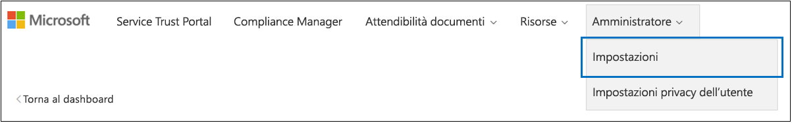

# <a name="work-with-microsoft-compliance-manager-preview"></a><span data-ttu-id="a3908-104">Collaborare con Microsoft Compliance Manager (anteprima)</span><span class="sxs-lookup"><span data-stu-id="a3908-104">Work with Microsoft Compliance Manager (Preview)</span></span>

> [!IMPORTANT]
> <span data-ttu-id="a3908-105">Microsoft Compliance Manager è un dashboard e uno strumento di gestione che fornisce un riepilogo della protezione dei dati e della conformità e suggerimenti per migliorare la protezione dei dati e la conformità.</span><span class="sxs-lookup"><span data-stu-id="a3908-105">Microsoft Compliance Manager is a dashboard and management tool that provides a summary of your data protection and compliance stature and recommendations to improve data protection and compliance.</span></span> <span data-ttu-id="a3908-106">Le azioni dei clienti fornite in Compliance Manager sono raccomandazioni. spetta alla propria organizzazione valutare l'efficacia di tali raccomandazioni nei rispettivi ambienti normativi prima dell'implementazione.</span><span class="sxs-lookup"><span data-stu-id="a3908-106">The customer actions provided in Compliance Manager are recommendations; it is up to your organization to evaluate the effectiveness of these recommendations in their respective regulatory environment prior to implementation.</span></span> <span data-ttu-id="a3908-107">Le indicazioni rilevate in Compliance Manager non devono essere interpretate come garanzia di conformità.</span><span class="sxs-lookup"><span data-stu-id="a3908-107">Recommendations found in Compliance Manager should not be interpreted as a guarantee of compliance.</span></span>

## <a name="access-compliance-manager"></a><span data-ttu-id="a3908-108">Access Compliance Manager</span><span class="sxs-lookup"><span data-stu-id="a3908-108">Access Compliance Manager</span></span>

<span data-ttu-id="a3908-p103">Chiunque abbia un account Microsoft o un account organizzativo di Azure Active Directory può accedere a Compliance Manger dal Service Trust Portal.</span><span class="sxs-lookup"><span data-stu-id="a3908-p103">You access Compliance Manager from the Service Trust Portal. Anyone with a Microsoft account or Azure Active Directory organizational account can access Compliance Manager.</span></span>
  
1. <span data-ttu-id="a3908-111">Passare a [https://servicetrust.microsoft.com](https://servicetrust.microsoft.com/).</span><span class="sxs-lookup"><span data-stu-id="a3908-111">Go to [https://servicetrust.microsoft.com](https://servicetrust.microsoft.com/).</span></span>

2. <span data-ttu-id="a3908-112">Accedere con l'account del servizio Microsoft.</span><span class="sxs-lookup"><span data-stu-id="a3908-112">Sign in with your Microsoft service account.</span></span> <span data-ttu-id="a3908-113">Si tratta dell'account utente di Office 365, Microsoft 365 o Azure Active Directory (Azure AD).</span><span class="sxs-lookup"><span data-stu-id="a3908-113">This is your Office 365, Microsoft 365, or Azure Active Directory (Azure AD) user account.</span></span>

3. <span data-ttu-id="a3908-114">Nel Service Trust Portal selezionare **Compliance Manager**.</span><span class="sxs-lookup"><span data-stu-id="a3908-114">In the Service Trust Portal, select **Compliance Manager**.</span></span> <span data-ttu-id="a3908-115">Questa è la versione di anteprima di Compliance Manager.</span><span class="sxs-lookup"><span data-stu-id="a3908-115">This is the preview version of Compliance Manager.</span></span> <span data-ttu-id="a3908-116">**Compliance Manager (Classic)** è il collegamento alla versione precedente di Compliance Manager.</span><span class="sxs-lookup"><span data-stu-id="a3908-116">**Compliance Manager (Classic)** is the link to the previous version of Compliance Manager.</span></span>

4. <span data-ttu-id="a3908-117">Quando viene visualizzato il contratto di non divulgazione, leggerlo e selezionare **Accetto** per continuare.</span><span class="sxs-lookup"><span data-stu-id="a3908-117">When the Non-Disclosure Agreement is displayed, read it, and select **Agree** to continue.</span></span> <span data-ttu-id="a3908-118">È necessario concordare una sola volta e quindi viene visualizzato il dashboard di Compliance Manager.</span><span class="sxs-lookup"><span data-stu-id="a3908-118">You must agree once, and then the Compliance Manager dashboard is displayed.</span></span>

<span data-ttu-id="a3908-119">Per iniziare, una valutazione ISO/IEC 27001:2103 per Office 365 viene visualizzata per impostazione predefinita per l'organizzazione.</span><span class="sxs-lookup"><span data-stu-id="a3908-119">To get you started, an ISO/IEC 27001:2103 Assessment for Office 365 appears by default for your organization.</span></span>

## <a name="administration"></a><span data-ttu-id="a3908-120">Amministrazione</span><span class="sxs-lookup"><span data-stu-id="a3908-120">Administration</span></span>

<span data-ttu-id="a3908-121">Esistono funzioni amministrative specifiche disponibili solo per l'amministratore globale e visibili solo quando si esegue l'accesso con un account di amministratore globale.</span><span class="sxs-lookup"><span data-stu-id="a3908-121">There are specific administrative functions that are only available to the global administrator and only visible when logged in with a global administrator account.</span></span> <span data-ttu-id="a3908-122">Dopo che l'amministratore ha assegnato i ruoli di Compliance Manager ad altri utenti, gli utenti possono visualizzare i dati in Compliance Manager ed eseguire azioni determinate dal loro ruolo.</span><span class="sxs-lookup"><span data-stu-id="a3908-122">Once the administrator assigns Compliance Manager roles to other users, those users can view data in Compliance Manager and perform actions determined by their role.</span></span> <span data-ttu-id="a3908-123">L'amministratore può anche fornire accesso in sola lettura a Compliance Manager assegnando all'utente il [ruolo di lettore globale in Azure Active Directory (Azure ad)](https://docs.microsoft.com/en-us/azure/active-directory/users-groups-roles/directory-assign-admin-roles#global-reader).</span><span class="sxs-lookup"><span data-stu-id="a3908-123">The administrator can also give read-only access to Compliance Manager by assigning the user the [Global Reader role in Azure Active Directory (Azure AD)](https://docs.microsoft.com/en-us/azure/active-directory/users-groups-roles/directory-assign-admin-roles#global-reader).</span></span>
  
### <a name="assigning-compliance-manager-roles-to-users"></a><span data-ttu-id="a3908-124">Assegnazione di ruoli Compliance Manager agli utenti</span><span class="sxs-lookup"><span data-stu-id="a3908-124">Assigning Compliance Manager roles to users</span></span>

<span data-ttu-id="a3908-125">Ogni ruolo di Compliance Manager ha autorizzazioni leggermente diverse.</span><span class="sxs-lookup"><span data-stu-id="a3908-125">Each Compliance Manager role has slightly different permissions.</span></span> <span data-ttu-id="a3908-126">È possibile visualizzare le autorizzazioni assegnate a ogni ruolo, vedere gli utenti in cui si trovano i ruoli e aggiungere o rimuovere utenti da tale ruolo tramite il Service Trust Portal.</span><span class="sxs-lookup"><span data-stu-id="a3908-126">You can view the permissions assigned to each role, see which users are in which roles, and add or remove users from that role through the Service Trust Portal.</span></span> <span data-ttu-id="a3908-127">Selezionare la voce di menu di **Amministrazione** e scegliere **Settings** to view.</span><span class="sxs-lookup"><span data-stu-id="a3908-127">Select the **Admin** menu item, and choose **Settings** to view.</span></span>
  

  
<span data-ttu-id="a3908-129">Per aggiungere o rimuovere utenti da ruoli Compliance Manager.</span><span class="sxs-lookup"><span data-stu-id="a3908-129">To add or remove users from Compliance Manager roles.</span></span>
  
1. <span data-ttu-id="a3908-130">Passare a [https://servicetrust.microsoft.com](https://servicetrust.microsoft.com).</span><span class="sxs-lookup"><span data-stu-id="a3908-130">Go to [https://servicetrust.microsoft.com](https://servicetrust.microsoft.com).</span></span>

2. <span data-ttu-id="a3908-131">Accedere con l'account di amministratore globale di Azure Active Directory.</span><span class="sxs-lookup"><span data-stu-id="a3908-131">Sign in with your Azure Active Directory global administrator account.</span></span>

3. <span data-ttu-id="a3908-132">Sulla barra dei menu del Service Trust Portal in alto, selezionare **amministratore** e quindi scegliere **Impostazioni**.</span><span class="sxs-lookup"><span data-stu-id="a3908-132">On the Service Trust Portal top menu bar, select **Admin** and then choose **Settings**.</span></span>

4. <span data-ttu-id="a3908-133">Nell'elenco a discesa **Seleziona ruolo** selezionare il ruolo che si desidera gestire.</span><span class="sxs-lookup"><span data-stu-id="a3908-133">In the **Select Role** drop-down list, select the role that you want to manage.</span></span>

5. <span data-ttu-id="a3908-134">Gli utenti aggiunti a ogni ruolo sono elencati nella pagina **Seleziona ruolo** .</span><span class="sxs-lookup"><span data-stu-id="a3908-134">Users added to each role are listed on the **Select Role** page.</span></span>

6. <span data-ttu-id="a3908-135">Per aggiungere utenti a questo ruolo, fare clic su **Aggiungi**.</span><span class="sxs-lookup"><span data-stu-id="a3908-135">To add users to this role, select **Add**.</span></span> <span data-ttu-id="a3908-136">Nella finestra di dialogo **Aggiungi utenti** selezionare il campo utente.</span><span class="sxs-lookup"><span data-stu-id="a3908-136">In the **Add Users** dialog, select the user field.</span></span> <span data-ttu-id="a3908-137">È possibile scorrere l'elenco degli utenti disponibili o iniziare a digitare il nome utente per filtrare l'elenco in base al termine di ricerca.</span><span class="sxs-lookup"><span data-stu-id="a3908-137">You can scroll through the list of available users or begin typing the user name to filter the list based on your search term.</span></span> <span data-ttu-id="a3908-138">Selezionare l'utente per aggiungere quell'account all'elenco **Aggiungi utenti** provisioning con tale ruolo.</span><span class="sxs-lookup"><span data-stu-id="a3908-138">Select the user to add that account to the **Add Users** list provisioned with that role.</span></span> <span data-ttu-id="a3908-139">Se si desidera aggiungere più utenti contemporaneamente, iniziare a digitare un nome utente per filtrare l'elenco e quindi selezionare l'utente da aggiungere all'elenco.</span><span class="sxs-lookup"><span data-stu-id="a3908-139">If you would like to add multiple users concurrently, begin typing a user name to filter the list, and then select the user to add to the list.</span></span> <span data-ttu-id="a3908-140">Selezionare **Salva** per eseguire il provisioning del ruolo selezionato per gli utenti.</span><span class="sxs-lookup"><span data-stu-id="a3908-140">Select **Save** to provision the selected role to these users.</span></span> 

    
  
7. <span data-ttu-id="a3908-142">Per rimuovere gli utenti da questo ruolo, selezionarli e selezionare **Elimina**.</span><span class="sxs-lookup"><span data-stu-id="a3908-142">To remove users from this role, select the users and select **Delete**.</span></span>

    

## <a name="groups"></a><span data-ttu-id="a3908-144">Gruppi</span><span class="sxs-lookup"><span data-stu-id="a3908-144">Groups</span></span>

<span data-ttu-id="a3908-145">I gruppi consentono di organizzare logicamente le valutazioni e di condividere le informazioni comuni e le attività del flusso di lavoro tra le valutazioni che dispongono dello stesso o dei controlli gestiti dal cliente.</span><span class="sxs-lookup"><span data-stu-id="a3908-145">Groups allow you to logically organize Assessments and that share common information and workflow tasks between Assessments that have the same or related customer-managed controls.</span></span> <span data-ttu-id="a3908-146">È possibile raggruppare le valutazioni per anno, standard, servizi, team, divisione o agenzie all'interno dell'organizzazione per ridurre al minimo le azioni gestite dal cliente:</span><span class="sxs-lookup"><span data-stu-id="a3908-146">You can group Assessments by year, standard, service, team, division, or agencies within your organization to help minimize customer-managed Actions:</span></span>
  
- <span data-ttu-id="a3908-147">**FFIEC è valutazioni 2019**</span><span class="sxs-lookup"><span data-stu-id="a3908-147">**FFIEC IS Assessments 2019**</span></span>
  - <span data-ttu-id="a3908-148">Office 365 + FFIEC è</span><span class="sxs-lookup"><span data-stu-id="a3908-148">Office 365 + FFIEC IS</span></span>
  - <span data-ttu-id="a3908-149">Intune + FFIEC è</span><span class="sxs-lookup"><span data-stu-id="a3908-149">Intune + FFIEC IS</span></span>
- <span data-ttu-id="a3908-150">**Sicurezza dei dati e valutazione della privacy**</span><span class="sxs-lookup"><span data-stu-id="a3908-150">**Data Security and Privacy Assessments**</span></span>
  - <span data-ttu-id="a3908-151">Office 365 e ISO 27001:2013</span><span class="sxs-lookup"><span data-stu-id="a3908-151">Office 365 + ISO 27001:2013</span></span>
  - <span data-ttu-id="a3908-152">Office 365 e ISO 27018:2014</span><span class="sxs-lookup"><span data-stu-id="a3908-152">Office 365 + ISO 27018:2014</span></span>

<span data-ttu-id="a3908-153">Quando si crea una nuova valutazione, è necessario creare un nuovo gruppo per la valutazione o assegnare la valutazione a un gruppo esistente.</span><span class="sxs-lookup"><span data-stu-id="a3908-153">When you create a new Assessment, you must create a new group for the Assessment or assign the Assessment to an existing group.</span></span> <span data-ttu-id="a3908-154">I gruppi non possono essere creati come entità autonome.</span><span class="sxs-lookup"><span data-stu-id="a3908-154">Groups cannot be created as stand-alone entities.</span></span> <span data-ttu-id="a3908-155">È consigliabile determinare una strategia di raggruppamento per l'organizzazione *prima* di aggiungere nuove valutazioni.</span><span class="sxs-lookup"><span data-stu-id="a3908-155">It's recommended that you determine a grouping strategy for your organization *before* adding new assessments.</span></span> <span data-ttu-id="a3908-156">Per impostazione predefinita, un gruppo denominato "gruppo predefinito" è disponibile per le valutazioni iniziali.</span><span class="sxs-lookup"><span data-stu-id="a3908-156">By default, a Group named "Default Group" is available for your initial Assessments.</span></span> <span data-ttu-id="a3908-157">I gruppi non dispongono di alcuna proprietà di sicurezza.</span><span class="sxs-lookup"><span data-stu-id="a3908-157">Groups do not have any security properties.</span></span> <span data-ttu-id="a3908-158">Tutte le autorizzazioni sono associate alle valutazioni.</span><span class="sxs-lookup"><span data-stu-id="a3908-158">All permissions are associated with Assessments.</span></span>

<span data-ttu-id="a3908-159">Quando si lavora con i gruppi, tenere presente quanto segue:</span><span class="sxs-lookup"><span data-stu-id="a3908-159">When you work with groups, remember:</span></span>
  
- <span data-ttu-id="a3908-160">I controlli relativi alla valutazione in diverse valutazioni all'interno dello stesso gruppo vengono aggiornati automaticamente quando sono stati completati.</span><span class="sxs-lookup"><span data-stu-id="a3908-160">Related assessment controls in different assessments within the same Group automatically update when completed.</span></span>
- <span data-ttu-id="a3908-161">I nuovi gruppi possono copiare informazioni da un gruppo esistente quando si crea una nuova valutazione.</span><span class="sxs-lookup"><span data-stu-id="a3908-161">New groups can copy information from an existing group when you create a new Assessment.</span></span> <span data-ttu-id="a3908-162">Tutte le informazioni aggiunte ai campi dei dettagli di implementazione e del piano di test e di risposta di gestione di controlli gestiti dal cliente dalle valutazioni del gruppo da cui si sta effettuando la copia vengono copiate negli stessi controlli gestiti dal cliente (o correlati) nel nuovo Valutazione.</span><span class="sxs-lookup"><span data-stu-id="a3908-162">Any information added to the Implementation Details and Test Plan and Management Response fields of customer-managed controls from Assessments in the group that you're copying from are copied to the same (or related) customer-managed controls in the new Assessment.</span></span> <span data-ttu-id="a3908-163">Se si sta aggiungendo una nuova valutazione a un gruppo esistente, le informazioni comuni provenienti da valutazioni di quel gruppo vengono copiate nella nuova valutazione.</span><span class="sxs-lookup"><span data-stu-id="a3908-163">If you're adding a new Assessment to an existing group, common information from Assessments in that group are copied to the new Assessment.</span></span>
- <span data-ttu-id="a3908-164">I nomi dei gruppi (denominati anche *ID gruppo*) devono essere univoci all'interno dell'organizzazione.</span><span class="sxs-lookup"><span data-stu-id="a3908-164">Group names (also called *Group IDs*) must be unique within your organization.</span></span>
- <span data-ttu-id="a3908-165">I gruppi possono contenere valutazioni per la stessa certificazione/regolamentazione, ma ogni gruppo può contenere solo una valutazione per una coppia specifica del servizio cloud/certificazione.</span><span class="sxs-lookup"><span data-stu-id="a3908-165">Groups can contain Assessments for the same certification/regulation, but each group can only contain one Assessment for a specific cloud service/certification pair.</span></span> <span data-ttu-id="a3908-166">Ad esempio, un gruppo non può contenere due valutazioni per Office 365 e NIST CSF.</span><span class="sxs-lookup"><span data-stu-id="a3908-166">For example, a group can't contain two Assessments for Office 365 and NIST CSF.</span></span> <span data-ttu-id="a3908-167">Un gruppo può contenere più valutazioni per lo stesso servizio cloud solo se la corrispondente certificazione/regolamentazione per ognuno di essi è diversa.</span><span class="sxs-lookup"><span data-stu-id="a3908-167">A group can contain multiple Assessments for the same cloud service only if the corresponding certification/regulation for each one is different.</span></span>
- <span data-ttu-id="a3908-168">Dopo aver aggiunto una valutazione a un gruppo di valutazione, non è possibile modificare il raggruppamento.</span><span class="sxs-lookup"><span data-stu-id="a3908-168">Once an assessment has been added to an assessment group, the grouping cannot be changed.</span></span> <span data-ttu-id="a3908-169">È possibile rinominare il gruppo di valutazione, che modifica il nome del gruppo di valutazione per tutte le valutazioni associate a tale gruppo.</span><span class="sxs-lookup"><span data-stu-id="a3908-169">You can rename the assessment group, which changes the name of the assessment grouping for all the assessments associated with that group.</span></span> <span data-ttu-id="a3908-170">È possibile creare una valutazione e un nuovo gruppo di valutazione e copiare informazioni da una valutazione esistente, che crea in modo efficace un duplicato di tale valutazione in un gruppo di valutazione differente.</span><span class="sxs-lookup"><span data-stu-id="a3908-170">You can create an assessment and a new assessment group and copy information from an existing assessment, which effectively creates a duplicate of that assessment in a different assessment group.</span></span>
- <span data-ttu-id="a3908-171">L'archiviazione di una valutazione interrompe la relazione tra tale valutazione e il gruppo.</span><span class="sxs-lookup"><span data-stu-id="a3908-171">Archiving an assessment breaks the relationship between that assessment and the group.</span></span> <span data-ttu-id="a3908-172">Qualsiasi ulteriore aggiornamento ad altre valutazioni correlate non viene più riflesso nella valutazione archiviata.</span><span class="sxs-lookup"><span data-stu-id="a3908-172">Any further updates to other related assessments are no longer reflected in the archived assessment.</span></span>

## <a name="tenant-management"></a><span data-ttu-id="a3908-173">Gestione tenant</span><span class="sxs-lookup"><span data-stu-id="a3908-173">Tenant Management</span></span>

<span data-ttu-id="a3908-174">Compliance Manager (Preview) include una nuova interfaccia per la gestione dei nuovi elementi di dati denominati **gestione tenant**.</span><span class="sxs-lookup"><span data-stu-id="a3908-174">Compliance Manager (Preview) includes a new interface for managing new data elements called **Tenant Management**.</span></span> <span data-ttu-id="a3908-175">Questa interfaccia consente di gestire le impostazioni a livello di tenant:</span><span class="sxs-lookup"><span data-stu-id="a3908-175">This interface enables you to manage tenant-wide settings:</span></span>

- <span data-ttu-id="a3908-176">**Dimensioni:** Consente di visualizzare i metadati per i modelli, le valutazioni e gli elementi di azione che consentono di creare pivot personalizzati per i filtri.</span><span class="sxs-lookup"><span data-stu-id="a3908-176">**Dimensions:** View metadata for Templates, Assessments, and Action Items that allow you to create custom pivots for filters.</span></span>
- <span data-ttu-id="a3908-177">**Proprietari:** Specificare un proprietario per ogni elemento di azione.</span><span class="sxs-lookup"><span data-stu-id="a3908-177">**Owners:** Specify an owner for each Action Item.</span></span>
- <span data-ttu-id="a3908-178">**Azioni dei clienti:** Gestire l'elenco completo degli elementi delle azioni inclusi in Compliance Manager (Preview) e abilitare/disabilitare il monitoraggio del Punteggio sicuro per le azioni che sono integrate con Secure score.</span><span class="sxs-lookup"><span data-stu-id="a3908-178">**Customer Actions:** Manage the complete list of Actions Items included in Compliance Manager (Preview) and enable/disable Secure Score monitoring for Actions that are integrated with Secure Score.</span></span>

<span data-ttu-id="a3908-179">Selezionare **gestione tenant** per aprire l'interfaccia di gestione e seguire i passaggi seguenti per gestire le **dimensioni**, i **proprietari**e le **azioni dei clienti**.</span><span class="sxs-lookup"><span data-stu-id="a3908-179">Select **Tenant Management** to open the management interface, and use the following steps to manage **Dimensions**, **Owners**, and **Customer Actions**.</span></span>

### <a name="dimensions"></a><span data-ttu-id="a3908-180">Dimensioni</span><span class="sxs-lookup"><span data-stu-id="a3908-180">Dimensions</span></span>

<span data-ttu-id="a3908-181">Le dimensioni sono insiemi di metadati che forniscono informazioni su un modello, una valutazione o un elemento di azione.</span><span class="sxs-lookup"><span data-stu-id="a3908-181">Dimensions are sets of metadata that provide information about a Template, an Assessment, or an Action Item.</span></span> <span data-ttu-id="a3908-182">Le dimensioni utilizzano il concetto di chiavi e valori, in cui la chiave Dimension rappresenta una proprietà e il valore della dimensione rappresenta valori validi per la proprietà.</span><span class="sxs-lookup"><span data-stu-id="a3908-182">Dimensions use the concept of Keys and Values, where the Dimension Key represents a property, and Dimension Value represents valid values for the property.</span></span> <span data-ttu-id="a3908-183">Ad esempio, in Compliance Manager esistono tre tipi di azioni.</span><span class="sxs-lookup"><span data-stu-id="a3908-183">For example, in Compliance Manager there are three types of Actions.</span></span> <span data-ttu-id="a3908-184">Sono definite da una chiave di dimensione per il **tipo di azione** e i valori di dimensione della **documentazione**, **operativo**e **tecnico**.</span><span class="sxs-lookup"><span data-stu-id="a3908-184">They are defined by a Dimension Key of **Action Type** and Dimension Values of **Documentation**, **Operational**, and **Technical**.</span></span> <span data-ttu-id="a3908-185">È possibile modificare o eliminare le dimensioni esistenti.</span><span class="sxs-lookup"><span data-stu-id="a3908-185">You can edit or delete existing Dimensions.</span></span>

### <a name="owners"></a><span data-ttu-id="a3908-186">Proprietari</span><span class="sxs-lookup"><span data-stu-id="a3908-186">Owners</span></span>

<span data-ttu-id="a3908-187">I proprietari vengono utilizzati per identificare l'entità responsabile per ogni controllo.</span><span class="sxs-lookup"><span data-stu-id="a3908-187">Owners are used to identify the responsible party for each control.</span></span> <span data-ttu-id="a3908-188">Tutti i controlli incorporati sono di proprietà di Microsoft, dei clienti o di entrambi.</span><span class="sxs-lookup"><span data-stu-id="a3908-188">All built-in controls are owned by Microsoft, by customers, or by both.</span></span> <span data-ttu-id="a3908-189">È possibile creare valori personalizzati per i proprietari che possono essere utilizzati per specificare le responsabilità più granulari all'interno dell'organizzazione.</span><span class="sxs-lookup"><span data-stu-id="a3908-189">You can create custom values for Owners that can be used to specify more granular responsibilities within your organization.</span></span> <span data-ttu-id="a3908-190">Ad esempio, è possibile creare proprietari che rappresentano gruppi, team o unità aziendali specifici all'interno dell'organizzazione.</span><span class="sxs-lookup"><span data-stu-id="a3908-190">For example, you could create Owners that represent specific groups, teams, or business units within your organization.</span></span>

#### <a name="add-an-owner"></a><span data-ttu-id="a3908-191">Aggiungere un proprietario</span><span class="sxs-lookup"><span data-stu-id="a3908-191">Add an Owner</span></span>

1. <span data-ttu-id="a3908-192">Aprire **gestione tenant** e selezionare **proprietari**.</span><span class="sxs-lookup"><span data-stu-id="a3908-192">Open **Tenant Management** and select **Owners**.</span></span>
2. <span data-ttu-id="a3908-193">Selezionare **+ Aggiungi proprietario**.</span><span class="sxs-lookup"><span data-stu-id="a3908-193">Select **+ Add owner**.</span></span>
3. <span data-ttu-id="a3908-194">Specificare un nome e una descrizione per il proprietario e selezionare **Salva**.</span><span class="sxs-lookup"><span data-stu-id="a3908-194">Provide a Name and Description for the Owner and select **Save**.</span></span> <span data-ttu-id="a3908-195">La descrizione viene visualizzata nella colonna Owner.</span><span class="sxs-lookup"><span data-stu-id="a3908-195">The description is displayed in the Owner column.</span></span>

#### <a name="edit-an-owner"></a><span data-ttu-id="a3908-196">Modifica di un proprietario</span><span class="sxs-lookup"><span data-stu-id="a3908-196">Edit an Owner</span></span>

<span data-ttu-id="a3908-197">Non è possibile modificare il nome di un proprietario, bensì modificare la descrizione visualizzata nella colonna Owner.</span><span class="sxs-lookup"><span data-stu-id="a3908-197">You can’t edit an Owner name, but you can modify the description that is displayed in the Owner column.</span></span>

1. <span data-ttu-id="a3908-198">Aprire **gestione tenant** e selezionare **proprietari**.</span><span class="sxs-lookup"><span data-stu-id="a3908-198">Open **Tenant Management** and select **Owners**.</span></span>
2. <span data-ttu-id="a3908-199">Individuare il proprietario che si desidera modificare, selezionare i puntini di ellissi (...) accanto e selezionare **modifica**.</span><span class="sxs-lookup"><span data-stu-id="a3908-199">Locate the Owner you want to edit, select the ellipses (…) next to it, and select **Edit**.</span></span>
3. <span data-ttu-id="a3908-200">Modificare la descrizione in base alle esigenze e selezionare **Salva**.</span><span class="sxs-lookup"><span data-stu-id="a3908-200">Modify the Description as needed and select **Save**.</span></span>

#### <a name="delete-an-owner"></a><span data-ttu-id="a3908-201">Eliminare un proprietario</span><span class="sxs-lookup"><span data-stu-id="a3908-201">Delete an Owner</span></span>

1. <span data-ttu-id="a3908-202">Aprire **gestione tenant** e selezionare **proprietari**.</span><span class="sxs-lookup"><span data-stu-id="a3908-202">Open **Tenant Management** and select **Owners**.</span></span>
2. <span data-ttu-id="a3908-203">Individuare il proprietario che si desidera eliminare, selezionare i puntini di ellissi (...) accanto e selezionare **Elimina**.</span><span class="sxs-lookup"><span data-stu-id="a3908-203">Locate the Owner you want to delete, select the ellipses (…) next to it, and select **Delete**.</span></span>
3. <span data-ttu-id="a3908-204">Quando viene visualizzato il messaggio di conferma, selezionare **Elimina**.</span><span class="sxs-lookup"><span data-stu-id="a3908-204">When the confirmation message appears, select **Delete**.</span></span>

### <a name="customer-actions"></a><span data-ttu-id="a3908-205">Azioni dei clienti</span><span class="sxs-lookup"><span data-stu-id="a3908-205">Customer Actions</span></span>

<span data-ttu-id="a3908-206">L'area azioni clienti Visualizza tutte le azioni dei clienti per tutti i modelli e le valutazioni in Compliance Manager (Preview).</span><span class="sxs-lookup"><span data-stu-id="a3908-206">The Customer Actions area shows all the customer actions for all Templates and Assessments in Compliance Manager (Preview).</span></span>


<span data-ttu-id="a3908-208">A colpo d'occhio, è possibile visualizzare il titolo, il proprietario, la categoria, l'applicazione e il Punteggio di un'azione e determinare se è integrata con il Punteggio sicuro.</span><span class="sxs-lookup"><span data-stu-id="a3908-208">At-a-glance, you can see an Action’s title, owner, category, enforcement, and score, and determine if it is integrated with Secure Score.</span></span> <span data-ttu-id="a3908-209">È possibile espandere un'azione e selezionare **Leggi altro** per leggere la descrizione dell'azione e accedere a qualsiasi collegamento nella descrizione.</span><span class="sxs-lookup"><span data-stu-id="a3908-209">You can expand an Action and select **Read More** to read the Action’s description and access any links in the description.</span></span> <span data-ttu-id="a3908-210">È inoltre possibile utilizzare questa interfaccia per abilitare e disabilitare l'integrazione del Punteggio sicuro in base all'azione e per aggiungere azioni personalizzate.</span><span class="sxs-lookup"><span data-stu-id="a3908-210">You can also use this interface to enable and disable Secure Score integration on a per-action basis, and to add custom actions.</span></span> <span data-ttu-id="a3908-211">Le azioni che dispongono di funzionalità di integrazione con punteggio sicuro dispongono di puntini di sospensione (...) accanto a essi (si noti che le azioni personalizzate dispongono anche di puntini di sospensione accanto a essi).</span><span class="sxs-lookup"><span data-stu-id="a3908-211">Actions that have Secure Score integration capabilities have an ellipsis (…) next to them (note that custom actions also have an ellipsis next to them).</span></span>

#### <a name="enable-or-disable-secure-score-integration"></a><span data-ttu-id="a3908-212">Abilitazione o disabilitazione dell'integrazione del Punteggio sicuro</span><span class="sxs-lookup"><span data-stu-id="a3908-212">Enable or disable Secure Score integration</span></span>

1. <span data-ttu-id="a3908-213">Selezionare i puntini di ellisse (...) per l'azione che si desidera modificare e selezionare **modifica**.</span><span class="sxs-lookup"><span data-stu-id="a3908-213">Select the ellipses (…) for the Action you want to modify and select **Edit**.</span></span>
2. <span data-ttu-id="a3908-214">Attiva o disattiva l'opzione per l'aggiornamento continuo del Punteggio sicuro su attivato o disattivato per attivare o disattivare il monitoraggio continuo tramite il Punteggio sicuro.</span><span class="sxs-lookup"><span data-stu-id="a3908-214">Toggle the switch for Secure Score continuous update to On or Off to enable or disable continuous monitoring through Secure Score.</span></span>
3. <span data-ttu-id="a3908-215">Selezionare **Salva**.</span><span class="sxs-lookup"><span data-stu-id="a3908-215">Select **Save**.</span></span>

#### <a name="add-a-customer-action"></a><span data-ttu-id="a3908-216">Aggiungere un'azione del cliente</span><span class="sxs-lookup"><span data-stu-id="a3908-216">Add a customer action</span></span>

1. <span data-ttu-id="a3908-217">Selezionare **+ Aggiungi azione del cliente**.</span><span class="sxs-lookup"><span data-stu-id="a3908-217">Select **+ Add Customer Action**.</span></span>
2. <span data-ttu-id="a3908-218">Specificare un titolo univoco per l'azione nel campo **titolo** .</span><span class="sxs-lookup"><span data-stu-id="a3908-218">Provide a unique title for the Action in the **Title** field.</span></span>
3. <span data-ttu-id="a3908-219">Fornire un punteggio di conformità per l'azione nel campo **Punteggio di conformità massimo** (può essere qualsiasi numero compreso tra 1-99).</span><span class="sxs-lookup"><span data-stu-id="a3908-219">Provide a Compliance Score for the Action in the **Maximum Compliance Score** field (this can be any number from 1-99).</span></span>
4. <span data-ttu-id="a3908-220">Utilizzare l'elenco a discesa **tipo di azione** per specificare il tipo di azione che si sta aggiungendo.</span><span class="sxs-lookup"><span data-stu-id="a3908-220">Use the **Action Type** dropdown to specify the type of Action you are adding.</span></span> <span data-ttu-id="a3908-221">Se il tipo di azione non esiste, è possibile aggiungerlo aggiungendo il valore alla chiave della dimensione tipo di azione.</span><span class="sxs-lookup"><span data-stu-id="a3908-221">If the Action Type does not exist, you can add it by adding the value to the Action Type dimension key.</span></span>
5. <span data-ttu-id="a3908-222">Utilizzare l'elenco a discesa **dimensioni** per specificare o aggiungere le chiavi e i valori delle dimensioni per l'azione.</span><span class="sxs-lookup"><span data-stu-id="a3908-222">Use the **Dimensions** dropdown to specify or add dimension keys and values for the Action.</span></span>
6. <span data-ttu-id="a3908-223">Utilizzare l'elenco a discesa **proprietario** per specificare il proprietario per l'azione.</span><span class="sxs-lookup"><span data-stu-id="a3908-223">Use the **Owner** dropdown to specify the owner for Action.</span></span>
7. <span data-ttu-id="a3908-224">Selezionare **+** questa sezione per aggiungere un titolo di descrizione e descrizione per l'azione.</span><span class="sxs-lookup"><span data-stu-id="a3908-224">Select **+** to add a description and description title for the Action.</span></span>
8. <span data-ttu-id="a3908-225">Selezionare la **X** per chiudere la lama Descrizione.</span><span class="sxs-lookup"><span data-stu-id="a3908-225">Select the **X** to close the Description blade.</span></span>
9. <span data-ttu-id="a3908-226">Fare clic su **Salva** per salvare l'azione del cliente.</span><span class="sxs-lookup"><span data-stu-id="a3908-226">Select **Save** to save the Customer Action.</span></span>

#### <a name="edit-a-customer-action"></a><span data-ttu-id="a3908-227">Modificare un'azione del cliente</span><span class="sxs-lookup"><span data-stu-id="a3908-227">Edit a customer action</span></span>

1. <span data-ttu-id="a3908-228">Selezionare i puntini di ellisse (...) per l'azione che si desidera modificare e selezionare **modifica**.</span><span class="sxs-lookup"><span data-stu-id="a3908-228">Select the ellipses (…) for the Action you want to modify and select **Edit**.</span></span>
2. <span data-ttu-id="a3908-229">Modificare l'azione in base alle esigenze e selezionare **Salva**.</span><span class="sxs-lookup"><span data-stu-id="a3908-229">Edit the Action as desired, and select **Save**.</span></span>

#### <a name="delete-a-customer-action"></a><span data-ttu-id="a3908-230">Eliminare un'azione del cliente</span><span class="sxs-lookup"><span data-stu-id="a3908-230">Delete a customer action</span></span>

1. <span data-ttu-id="a3908-231">Selezionare i puntini di ellisse (...) per l'azione che si desidera modificare e selezionare **Elimina**.</span><span class="sxs-lookup"><span data-stu-id="a3908-231">Select the ellipses (…) for the Action you want to modify and select **Delete**.</span></span>
2. <span data-ttu-id="a3908-232">Quando viene visualizzato il messaggio di conferma, selezionare **Elimina**.</span><span class="sxs-lookup"><span data-stu-id="a3908-232">When the confirmation message appears, select **Delete**.</span></span>

## <a name="assessments"></a><span data-ttu-id="a3908-233">Valutazioni</span><span class="sxs-lookup"><span data-stu-id="a3908-233">Assessments</span></span>

### <a name="add-an-assessment"></a><span data-ttu-id="a3908-234">Aggiungere una valutazione</span><span class="sxs-lookup"><span data-stu-id="a3908-234">Add an Assessment</span></span>
  
1. <span data-ttu-id="a3908-235">Nel dashboard valutazioni selezionare **+ Aggiungi valutazione**.</span><span class="sxs-lookup"><span data-stu-id="a3908-235">In the Assessments dashboard, select **+ Add Assessment**.</span></span>

2. <span data-ttu-id="a3908-236">Quando si apre il Blade, immettere le informazioni seguenti:</span><span class="sxs-lookup"><span data-stu-id="a3908-236">When the blade opens, enter the following information:</span></span>

    - <span data-ttu-id="a3908-237">**Titolo (obbligatorio):** Immettere un titolo per la valutazione</span><span class="sxs-lookup"><span data-stu-id="a3908-237">**Title (required):** Enter a title for your Assessment</span></span>
    - <span data-ttu-id="a3908-238">**Selezionare un modello (obbligatorio):** Selezionare un modello standard o personalizzato</span><span class="sxs-lookup"><span data-stu-id="a3908-238">**Please select a template (required):** Select a standard or custom template</span></span>
    - <span data-ttu-id="a3908-239">**Selezionare un gruppo o aggiungere un nuovo gruppo (obbligatorio):** Selezionare un gruppo esistente oppure scegliere di aggiungere un nuovo gruppo e specificare un nome di gruppo univoco</span><span class="sxs-lookup"><span data-stu-id="a3908-239">**Please select a group or add a new group (required):** Select an existing group or choose to add a new group, and provide a unique group name</span></span>
    - <span data-ttu-id="a3908-240">**Si desidera copiare i dati da un gruppo esistente? (facoltativo):** attiva o disattiva il controllo per abilitare la copia del gruppo e quindi:</span><span class="sxs-lookup"><span data-stu-id="a3908-240">**Would you like to copy the data from an existing group? (optional):** Toggle the control to enable group copy and then:</span></span>
        - <span data-ttu-id="a3908-241">**Selezionare un gruppo (facoltativo):** Se è abilitata la copia di gruppo, selezionare il gruppo da cui copiare</span><span class="sxs-lookup"><span data-stu-id="a3908-241">**Select a group (optional):** If group copy is enabled, select the group to copy from</span></span>
            - <span data-ttu-id="a3908-242">**Dettagli sull'implementazione (facoltativa):** Selezionare per copiare i dettagli dell'implementazione nel nuovo gruppo</span><span class="sxs-lookup"><span data-stu-id="a3908-242">**Implementation Details (optional):** Select to copy implementation details to the new group</span></span>
            - <span data-ttu-id="a3908-243">**Piano di Test & ulteriori informazioni (facoltativo):** Selezionare per copiare il piano di testing e ulteriori informazioni dettagliate sul nuovo gruppo</span><span class="sxs-lookup"><span data-stu-id="a3908-243">**Test plan & additional information (optional):** Select to copy test plan and additional information details to the new group</span></span>
            - <span data-ttu-id="a3908-244">**Documenti (facoltativo):** Selezionare per copiare i documenti nel nuovo gruppo</span><span class="sxs-lookup"><span data-stu-id="a3908-244">**Documents (optional):** Select to copy documents to the new group</span></span>

3. <span data-ttu-id="a3908-245">Selezionare **Salva** per creare la valutazione.</span><span class="sxs-lookup"><span data-stu-id="a3908-245">Select **Save** to create the Assessment.</span></span>

 <span data-ttu-id="a3908-246">La nuova valutazione viene visualizzata nel dashboard di valutazione e visualizza le informazioni seguenti:</span><span class="sxs-lookup"><span data-stu-id="a3908-246">The new Assessment appears on the Assessment dashboard and displays the following information:</span></span>

- <span data-ttu-id="a3908-247">Il titolo della valutazione.</span><span class="sxs-lookup"><span data-stu-id="a3908-247">The title of the Assessment.</span></span>
- <span data-ttu-id="a3908-248">Le dimensioni della valutazione, tra cui la certificazione, l'ambiente e il prodotto applicati alla valutazione.</span><span class="sxs-lookup"><span data-stu-id="a3908-248">The dimensions of the Assessment, including certification, environment, and product applied to the Assessment.</span></span>
- <span data-ttu-id="a3908-249">La data in cui è stata creata e la data in cui è stata modificata per l'ultima volta.</span><span class="sxs-lookup"><span data-stu-id="a3908-249">The date it was created and date when it was last modified.</span></span>
- <span data-ttu-id="a3908-250">Il Punteggio di valutazione visualizzato come percentuale.</span><span class="sxs-lookup"><span data-stu-id="a3908-250">The Assessment Score shown as a percentage.</span></span>
- <span data-ttu-id="a3908-251">Indicatori di stato che indicano il numero di controlli gestiti da Microsoft e Customer-mangd.</span><span class="sxs-lookup"><span data-stu-id="a3908-251">Progress indicators that show the number of assessed Microsoft-managed and customer-manged controls.</span></span>

### <a name="copying-information-from-existing-assessments"></a><span data-ttu-id="a3908-252">Copiare le informazioni da valutazioni esistenti</span><span class="sxs-lookup"><span data-stu-id="a3908-252">Copying information from existing Assessments</span></span>

<span data-ttu-id="a3908-253">Quando si crea una valutazione, si ha la possibilità di copiare le informazioni da un gruppo esistente.</span><span class="sxs-lookup"><span data-stu-id="a3908-253">When you create an Assessment, you have the option to copy information from an existing group.</span></span> <span data-ttu-id="a3908-254">In questo modo è possibile applicare le informazioni immesse nella valutazione copiata agli stessi controlli nella nuova valutazione.</span><span class="sxs-lookup"><span data-stu-id="a3908-254">This allows you to apply the information entered into the copied assessment to the same controls in the new Assessment.</span></span> <span data-ttu-id="a3908-255">Ad esempio, se si dispone di un gruppo per tutte le valutazioni correlate a FFIEC nell'organizzazione, è possibile copiare le informazioni seguenti dalle valutazioni esistenti:</span><span class="sxs-lookup"><span data-stu-id="a3908-255">For example, if you have a group for all FFIEC-related Assessments in your organization, you can copy the following information from existing assessments:</span></span>

- <span data-ttu-id="a3908-256">Dettagli sull'implementazione</span><span class="sxs-lookup"><span data-stu-id="a3908-256">Implementation Details</span></span>
- <span data-ttu-id="a3908-257">Piano di test & ulteriori informazioni</span><span class="sxs-lookup"><span data-stu-id="a3908-257">Test Plan & Additional Information</span></span>
- <span data-ttu-id="a3908-258">Documenti</span><span class="sxs-lookup"><span data-stu-id="a3908-258">Documents</span></span>

#### <a name="copy-information-from-an-existing-assessment-to-a-new-assessment"></a><span data-ttu-id="a3908-259">Copia delle informazioni da una valutazione esistente a una nuova valutazione</span><span class="sxs-lookup"><span data-stu-id="a3908-259">Copy information from an existing Assessment to a new Assessment</span></span>
  
1. <span data-ttu-id="a3908-260">Nel dashboard di valutazione selezionare **+ Aggiungi valutazione**.</span><span class="sxs-lookup"><span data-stu-id="a3908-260">In the Assessment dashboard, select **+ Add Assessment**.</span></span>
    
2. <span data-ttu-id="a3908-261">Nella finestra **Aggiungi una valutazione** , completare le seguenti informazioni</span><span class="sxs-lookup"><span data-stu-id="a3908-261">In the **Add an Assessment** window, complete the following information</span></span>

    - <span data-ttu-id="a3908-262">**Titolo (obbligatorio):** Immettere un titolo per la valutazione.</span><span class="sxs-lookup"><span data-stu-id="a3908-262">**Title (required):** Enter a title for your Assessment.</span></span>
    - <span data-ttu-id="a3908-263">**Selezionare un modello (obbligatorio):** Selezionare un modello standard o personalizzato.</span><span class="sxs-lookup"><span data-stu-id="a3908-263">**Please select a template (required):** Select a standard or custom template.</span></span>
    - <span data-ttu-id="a3908-264">**Selezionare un gruppo o aggiungere un nuovo gruppo (obbligatorio):** Scegliere **aggiungere un nuovo gruppo** e specificare un nome di gruppo univoco.</span><span class="sxs-lookup"><span data-stu-id="a3908-264">**Please select a group or add a new group (required):** Choose **Add a new group** and provide a unique group name.</span></span>
    - <span data-ttu-id="a3908-265">**Si desidera copiare i dati da un gruppo esistente? (facoltativo):** alternare il controllo a attivato per abilitare la copia del gruppo e quindi:- **selezionare un gruppo (facoltativo):** se la copia del gruppo è abilitata, selezionare il gruppo da cui copiare.</span><span class="sxs-lookup"><span data-stu-id="a3908-265">**Would you like to copy the data from an existing group? (optional):** Toggle the control to On to enable group copy and then: - **Select a group (optional):** If group copy is enabled, select the group to copy from.</span></span>
            <span data-ttu-id="a3908-266">- **Dettagli sull'implementazione (facoltativa):** Selezionare per copiare i dettagli dell'implementazione nel nuovo gruppo.</span><span class="sxs-lookup"><span data-stu-id="a3908-266">- **Implementation Details (optional):** Select to copy implementation details to the new group.</span></span>
            <span data-ttu-id="a3908-267">- **Piano di Test & ulteriori informazioni (facoltativo):** Selezionare per copiare il piano di testing e ulteriori informazioni dettagliate sul nuovo gruppo.</span><span class="sxs-lookup"><span data-stu-id="a3908-267">- **Test plan & additional information (optional):** Select to copy test plan and additional information details to the new group.</span></span>
            <span data-ttu-id="a3908-268">- **Documenti (facoltativo):** Selezionare per copiare i documenti nel nuovo gruppo.</span><span class="sxs-lookup"><span data-stu-id="a3908-268">- **Documents (optional):** Select to copy documents to the new group.</span></span>

3. <span data-ttu-id="a3908-269">Selezionare **Salva** per creare la valutazione.</span><span class="sxs-lookup"><span data-stu-id="a3908-269">Select **Save** to create the Assessment.</span></span>

### <a name="viewing-assessments"></a><span data-ttu-id="a3908-270">Visualizzazione delle valutazioni</span><span class="sxs-lookup"><span data-stu-id="a3908-270">Viewing Assessments</span></span>

#### <a name="view-an-assessment"></a><span data-ttu-id="a3908-271">Visualizzazione di una valutazione</span><span class="sxs-lookup"><span data-stu-id="a3908-271">View an Assessment</span></span>
  
1. <span data-ttu-id="a3908-272">Nel dashboard valutazioni selezionare il nome della valutazione per aprirlo e visualizzare le informazioni sugli elementi di azione e sui controlli.</span><span class="sxs-lookup"><span data-stu-id="a3908-272">In the Assessments dashboard, select the assessment name to open it and view the Action Items and Controls Info.</span></span>

<span data-ttu-id="a3908-273">Di seguito è riportato un esempio di valutazione per Office 365 e ISO 27001.</span><span class="sxs-lookup"><span data-stu-id="a3908-273">Here's an example of the Assessment for Office 365 and ISO 27001.</span></span> <span data-ttu-id="a3908-274">Nella prima visualizzazione viene illustrata la nuova visualizzazione elementi azione in Compliance Manager (Preview).</span><span class="sxs-lookup"><span data-stu-id="a3908-274">The first view illustrates the new Action Items view in Compliance Manager (Preview).</span></span>


<span data-ttu-id="a3908-276">Le azioni sono elencate in ordine alfabetico e a ogni azione viene assegnato un punteggio e un proprietario.</span><span class="sxs-lookup"><span data-stu-id="a3908-276">The Actions are listed in alphabetical order, and each Action is assigned a score and an owner.</span></span> <span data-ttu-id="a3908-277">Selezionare il collegamento **Leggi altro** per leggere i dettagli di ogni azione.</span><span class="sxs-lookup"><span data-stu-id="a3908-277">Select  the **Read More** link to read the details of each Action.</span></span> 


<span data-ttu-id="a3908-279">Selezionare il collegamento **Revisione** per gestire, assegnare, implementare e testare l'azione.</span><span class="sxs-lookup"><span data-stu-id="a3908-279">Select the **Review** link to manage, assign, implement, and test the action.</span></span> <span data-ttu-id="a3908-280">Di seguito è riportato un esempio di azione.</span><span class="sxs-lookup"><span data-stu-id="a3908-280">Below is an example Action.</span></span>


<span data-ttu-id="a3908-282">Nelle versioni precedenti di Compliance Manager, il flusso di lavoro per l'implementazione dei requisiti è stato eseguito a livello di controllo.</span><span class="sxs-lookup"><span data-stu-id="a3908-282">In previous versions of Compliance Manager, the workflow for implementing requirements was performed at the Control level.</span></span> <span data-ttu-id="a3908-283">Un responsabile della conformità assegnerà un controllo a un utente per implementare il controllo.</span><span class="sxs-lookup"><span data-stu-id="a3908-283">A compliance officer would assign a control to someone to implement the control.</span></span> <span data-ttu-id="a3908-284">Sono stati due gli svantaggi seguenti:</span><span class="sxs-lookup"><span data-stu-id="a3908-284">There were two drawbacks to this:</span></span>

- <span data-ttu-id="a3908-285">I controlli spesso sono associati a più azioni e l'utente a cui è stato assegnato un controllo potrebbe non essere la persona giusta per completare tutte le azioni necessarie per implementare il controllo.</span><span class="sxs-lookup"><span data-stu-id="a3908-285">Controls often had multiple actions associated with them, and the user to whom a control was assigned, might not be the right person to complete all actions that were required to implement the control</span></span>
- <span data-ttu-id="a3908-286">La combinazione di attività separate in una singola azione ha impedito l'insieme dei segnali e della telemetria utilizzati per registrare automaticamente le modifiche alla configurazione tenant in Compliance Manager (Preview).</span><span class="sxs-lookup"><span data-stu-id="a3908-286">Combining separate tasks into a single Action prevented the collection of the signals and telemetry that is used to automatically record tenant configuration changes in Compliance Manager (Preview).</span></span>

<span data-ttu-id="a3908-287">In Compliance Manager (Preview), il processo del flusso di lavoro è stato spostato dal livello di controllo al livello di azione.</span><span class="sxs-lookup"><span data-stu-id="a3908-287">In Compliance Manager (Preview), the workflow process has moved from the Control level to the Action level.</span></span> <span data-ttu-id="a3908-288">Quando si esamina un'azione, è possibile utilizzare i campi seguenti per gestire il flusso di lavoro dell'azione:</span><span class="sxs-lookup"><span data-stu-id="a3908-288">When reviewing an Action, the following fields can be used to manage the Action workflow:</span></span>

- <span data-ttu-id="a3908-289">**Assegnare un utente:** Selezionare questo campo per scegliere o immettere l'utente a cui deve essere assegnata l'azione.</span><span class="sxs-lookup"><span data-stu-id="a3908-289">**Assign User:** Select this field to choose or enter the user to whom this Action should be assigned.</span></span> <span data-ttu-id="a3908-290">È possibile scorrere l'elenco o digitare un nome per trovarlo, quindi selezionarlo.</span><span class="sxs-lookup"><span data-stu-id="a3908-290">You can scroll through the list, or type a name to find it, and then select it.</span></span>
- <span data-ttu-id="a3908-291">**Gestire i documenti:** È possibile caricare la prova dell'implementazione in formato documenti di Office, file di immagine e schermate, output di PowerShell in formato CSV o TXT e file PDF.</span><span class="sxs-lookup"><span data-stu-id="a3908-291">**Manage Documents:** You can upload evidence of implementation in the form of Office documents, image files and screenshots, PowerShell output in CSV or TXT, and PDFs.</span></span>
- <span data-ttu-id="a3908-292">**Stato implementazione:** Utilizzato per indicare lo stato di implementazione corrente dell'azione.</span><span class="sxs-lookup"><span data-stu-id="a3908-292">**Implementation Status:** Used to indicate the Action’s current implementation status.</span></span> <span data-ttu-id="a3908-293">I valori possibili non sono implementati, implementati, l'implementazione alternativa, pianificata e non nell'ambito.</span><span class="sxs-lookup"><span data-stu-id="a3908-293">Possible values are Not Implemented, Implemented, Alternative Implementation, Planned, and Not in Scope.</span></span>
- <span data-ttu-id="a3908-294">**Data di implementazione:** La data in cui è stata eseguita l'azione.</span><span class="sxs-lookup"><span data-stu-id="a3908-294">**Implementation Date:** The date on which the Action was taken.</span></span>
- <span data-ttu-id="a3908-295">**Risultato del test:** Utilizzato per indicare i risultati della convalida dell'implementazione.</span><span class="sxs-lookup"><span data-stu-id="a3908-295">**Test Result:** Used to indicate the results of implementation validation.</span></span> <span data-ttu-id="a3908-296">I valori possibili non sono valutati, superato, non riuscito-rischio basso, non riuscito-rischio medio, rischio non riuscito-elevato e non nell'ambito.</span><span class="sxs-lookup"><span data-stu-id="a3908-296">Possible values are Not Assessed, Passed, Failed-Low Risk, Failed-Medium Risk, Failed-High Risk, and Not in Scope.</span></span>
- <span data-ttu-id="a3908-297">**Data test:** La data in cui si è verificata la convalida.</span><span class="sxs-lookup"><span data-stu-id="a3908-297">**Test Date:** The date on which validation occurred.</span></span>
- <span data-ttu-id="a3908-298">**Note sull'implementazione:** Immettere i dettagli sull'implementazione per l'organizzazione, insieme a tutte le note che si desidera includere.</span><span class="sxs-lookup"><span data-stu-id="a3908-298">**Implementation Notes:** Enter implementation details for your organization, along with any notes that you want to include.</span></span>
- <span data-ttu-id="a3908-299">**Piano di testing:** Immettere i dettagli del piano di test per questa azione, insieme a tutte le note che si desidera includere.</span><span class="sxs-lookup"><span data-stu-id="a3908-299">**Test Plan:** Enter the test plan details for this action, along with any notes that you want to include.</span></span>
- <span data-ttu-id="a3908-300">**Ulteriori informazioni:** Immettere eventuali informazioni aggiuntive su questa azione o su come è stata implementata nell'organizzazione, insieme a tutte le note che si desidera includere.</span><span class="sxs-lookup"><span data-stu-id="a3908-300">**Additional Information:** Enter any additional information about this Action or how it was implemented in your organization, along with any notes you want to include.</span></span>

<span data-ttu-id="a3908-301">Compliance Manager (Preview) include anche il pivot basato sul controllo trovato nelle versioni precedenti.</span><span class="sxs-lookup"><span data-stu-id="a3908-301">Compliance Manager (Preview) also includes the control-based pivot found in previous versions.</span></span> <span data-ttu-id="a3908-302">Selezionare il dashboard **informazioni controlli** per visualizzarlo.</span><span class="sxs-lookup"><span data-stu-id="a3908-302">Select the **Controls Info** dashboard to view it.</span></span> <span data-ttu-id="a3908-303">È possibile visualizzare le informazioni per i controlli a livello di valutazione e di modello.</span><span class="sxs-lookup"><span data-stu-id="a3908-303">You can view information for controls at the Assessment and Template level.</span></span> <span data-ttu-id="a3908-304">Di seguito è riportato un esempio del dashboard delle informazioni sui controlli per le valutazioni.</span><span class="sxs-lookup"><span data-stu-id="a3908-304">Below is an example of the Controls Info dashboard for Assessments.</span></span>


<span data-ttu-id="a3908-306">Per le valutazioni, viene visualizzato il dashboard informazioni controlli:</span><span class="sxs-lookup"><span data-stu-id="a3908-306">For Assessments, the Controls Info dashboard displays:</span></span>

- <span data-ttu-id="a3908-307">Un elenco a discesa di **gruppo** per selezionare il gruppo da visualizzare (quando si utilizzano più gruppi).</span><span class="sxs-lookup"><span data-stu-id="a3908-307">A **Group** dropdown to select which Group to view (when using multiple groups).</span></span>
- <span data-ttu-id="a3908-308">Un elenco a discesa di **valutazione** che consente di selezionare la valutazione da visualizzare.</span><span class="sxs-lookup"><span data-stu-id="a3908-308">An **Assessment** dropdown to select which Assessment to view.</span></span>
- <span data-ttu-id="a3908-309">Metadati relativi alla valutazione selezionata, tra cui:</span><span class="sxs-lookup"><span data-stu-id="a3908-309">Metadata about the selected Assessment, including:</span></span>
    - <span data-ttu-id="a3908-310">Indicatore di stato per i **controlli valutati** che indicano il numero di controlli valutati rispetto al numero totale di controlli.</span><span class="sxs-lookup"><span data-stu-id="a3908-310">A progress indicator for **Assessed Controls** showing the number of assessed controls over the total number of controls.</span></span>
    - <span data-ttu-id="a3908-311">Il **Punteggio di conformità** corrente per la valutazione, visualizzato come percentuale.</span><span class="sxs-lookup"><span data-stu-id="a3908-311">The current **Compliance Score** for the Assessment, shown as a percentage.</span></span>
    - <span data-ttu-id="a3908-312">Informazioni dettagliate sulla **certificazione** e sul **prodotto** utilizzati per la valutazione.</span><span class="sxs-lookup"><span data-stu-id="a3908-312">Details about the **Certification** and **Product** used in the Assessment.</span></span>
    - <span data-ttu-id="a3908-313">Lo **stato** corrente e la data dell'ultima **modifica** per la valutazione.</span><span class="sxs-lookup"><span data-stu-id="a3908-313">The current **Status** of and last **Modified** date for the Assessment.</span></span>
- <span data-ttu-id="a3908-314">Elenco dei **servizi di ambito** per la valutazione.</span><span class="sxs-lookup"><span data-stu-id="a3908-314">A list of **In Scope Services** for the Assessment.</span></span>
- <span data-ttu-id="a3908-315">Informazioni dettagliate sui controlli, raggruppati in base alla famiglia di controlli, con collegamenti a azioni dei clienti e dettagli sull'implementazione Microsoft:</span><span class="sxs-lookup"><span data-stu-id="a3908-315">Details of the controls, grouped by Control Family, with links to customer actions and Microsoft implementation details:</span></span>
    - <span data-ttu-id="a3908-316">Nelle **azioni** vengono visualizzate le azioni dei clienti che è possibile eseguire per soddisfare alcuni o tutti i requisiti del controllo.</span><span class="sxs-lookup"><span data-stu-id="a3908-316">**Your Actions** displays the customer actions that you can perform to satisfy some or all the control’s requirements.</span></span> <span data-ttu-id="a3908-317">Molti controlli dispongono di più azioni associate e tutte le azioni associate a un controllo vengono visualizzate qui.</span><span class="sxs-lookup"><span data-stu-id="a3908-317">Many controls have multiple Actions associated with them, and all Actions associated with a control are displayed here.</span></span> <span data-ttu-id="a3908-318">Le azioni qui hanno la stessa interfaccia utente di quelle elencate nel dashboard Actions.</span><span class="sxs-lookup"><span data-stu-id="a3908-318">The Actions here have the same UI as those listed in the Actions dashboard.</span></span>
    - <span data-ttu-id="a3908-319">**Microsoft Actions** Visualizza l'elenco dei controlli del Framework interno Microsoft che si applicano al controllo di certificazione selezionato.</span><span class="sxs-lookup"><span data-stu-id="a3908-319">**Microsoft Actions** displays the list of controls from Microsoft’s internal framework that apply to the selected certification control.</span></span> <span data-ttu-id="a3908-320">Per ogni controllo interno, selezionare **implementato** per visualizzare i dettagli relativi all'implementazione e ai test di Microsoft, insieme al risultato del test e alla data di test, come illustrato di seguito.</span><span class="sxs-lookup"><span data-stu-id="a3908-320">For each internal control, select **Implemented** to see Microsoft’s implementation and test details, along with the test result and test date, as shown below.</span></span>


### <a name="export-an-assessment"></a><span data-ttu-id="a3908-322">Esportare una valutazione</span><span class="sxs-lookup"><span data-stu-id="a3908-322">Export an Assessment</span></span>

<span data-ttu-id="a3908-323">È possibile esportare una valutazione in un file di Excel per la conformità delle parti interessate nell'organizzazione o per i revisori esterni e regolatori.</span><span class="sxs-lookup"><span data-stu-id="a3908-323">You can export an Assessment to an Excel file for compliance stakeholders in your organization or for external auditors and regulators.</span></span> <span data-ttu-id="a3908-324">Il report è un'istantanea della valutazione alla data e all'ora in cui viene creato il report.</span><span class="sxs-lookup"><span data-stu-id="a3908-324">The report is a snapshot of the Assessment as of the date and time that the report is created.</span></span> <span data-ttu-id="a3908-325">Il report contiene i dettagli per tutti i controlli Microsoft e gestiti dal cliente per la valutazione, lo stato di implementazione del controllo, la data del test di controllo, i risultati dei test e fornisce collegamenti ai documenti di prova caricati.</span><span class="sxs-lookup"><span data-stu-id="a3908-325">The report contains the details for all Microsoft and customer-managed controls for the Assessment, control implementation status, control test date, test results, and provides links to uploaded evidence documents.</span></span> <span data-ttu-id="a3908-326">È necessario esportare il report di valutazione prima di archiviare una valutazione, in quanto le valutazioni archiviate non conservano i collegamenti ai documenti caricati.</span><span class="sxs-lookup"><span data-stu-id="a3908-326">You should export the Assessment report prior to archiving an assessment because archived assessments do not retain links to uploaded documents.</span></span>
  
### <a name="export-an-assessment-report"></a><span data-ttu-id="a3908-327">Esportare un report di valutazione</span><span class="sxs-lookup"><span data-stu-id="a3908-327">Export an Assessment report</span></span>
  
1. <span data-ttu-id="a3908-328">Nel dashboard di Compliance Manager selezionare **controlli scheda informazioni** .</span><span class="sxs-lookup"><span data-stu-id="a3908-328">On the Compliance Manager dashboard, select **Controls Info** tab.</span></span>
2. <span data-ttu-id="a3908-329">Selezionare il **gruppo** e la **valutazione** nei menu a discesa per la valutazione che si desidera esportare.</span><span class="sxs-lookup"><span data-stu-id="a3908-329">Select the **Group** and **Assessment** in the drop-down menus for the Assessment you want to export.</span></span>
3. <span data-ttu-id="a3908-330">Selezionare il pulsante **Esporta** .</span><span class="sxs-lookup"><span data-stu-id="a3908-330">Select the **Export** button.</span></span>

<span data-ttu-id="a3908-331">Il report di valutazione viene scaricato come file di Excel nella sessione del browser.</span><span class="sxs-lookup"><span data-stu-id="a3908-331">The assessment report is downloaded as an Excel file in your browser session.</span></span> <span data-ttu-id="a3908-332">Il nome dei file per il file di Excel è predefinito per il titolo della valutazione.</span><span class="sxs-lookup"><span data-stu-id="a3908-332">The files name for the Excel file defaults to the title of the Assessment.</span></span>

### <a name="archive-a-template-or-an-assessment"></a><span data-ttu-id="a3908-333">Archiviare un modello o una valutazione</span><span class="sxs-lookup"><span data-stu-id="a3908-333">Archive a Template or an Assessment</span></span>

<span data-ttu-id="a3908-334">Al termine di un modello o di una valutazione e non è più necessario ai fini della conformità, è possibile archiviarlo.</span><span class="sxs-lookup"><span data-stu-id="a3908-334">When you are finished with a Template or Assessment and no longer need it for compliance purposes, you can archive it.</span></span> <span data-ttu-id="a3908-335">Quando un modello o una valutazione viene archiviata, viene rimossa dalla visualizzazione predefinita ed è necessario controllare la casella di controllo Mostra archiviata per visualizzarla.</span><span class="sxs-lookup"><span data-stu-id="a3908-335">When a Template or Assessment is archived, it is removed from the default view, and you must check the Show Archived checkbox to display it.</span></span>


  
> [!IMPORTANT]
> <span data-ttu-id="a3908-337">Le valutazioni archiviate non conservano i collegamenti ai documenti di prova caricati.</span><span class="sxs-lookup"><span data-stu-id="a3908-337">Archived Assessments do not retain their links to uploaded evidence documents.</span></span> <span data-ttu-id="a3908-338">È consigliabile esportare la valutazione prima dell'archiviazione per mantenere i collegamenti ai documenti di prova nel report.</span><span class="sxs-lookup"><span data-stu-id="a3908-338">It is highly recommended that you export the Assessment before archiving to retain links to the evidence documents in the report.</span></span>
  
#### <a name="archive-a-template"></a><span data-ttu-id="a3908-339">Archiviare un modello</span><span class="sxs-lookup"><span data-stu-id="a3908-339">Archive a Template</span></span>

1. <span data-ttu-id="a3908-340">Aprire il dashboard dei **modelli** .</span><span class="sxs-lookup"><span data-stu-id="a3908-340">Open the **Templates** dashboard.</span></span>
2. <span data-ttu-id="a3908-341">Individuare il modello che si desidera archiviare e selezionare l'icona archivia.</span><span class="sxs-lookup"><span data-stu-id="a3908-341">Locate the Template you want to archive and select the archive icon.</span></span>
3. <span data-ttu-id="a3908-342">Quando viene visualizzato il messaggio di conferma, selezionare **Archivia**.</span><span class="sxs-lookup"><span data-stu-id="a3908-342">When you see the confirmation message, select **Archive**.</span></span>

#### <a name="archive-an-assessment"></a><span data-ttu-id="a3908-343">Archiviare una valutazione</span><span class="sxs-lookup"><span data-stu-id="a3908-343">Archive an Assessment</span></span>

1. <span data-ttu-id="a3908-344">Aprire il dashboard **valutazioni** .</span><span class="sxs-lookup"><span data-stu-id="a3908-344">Open the **Assessments** dashboard.</span></span>
2. <span data-ttu-id="a3908-345">Selezionare il **gruppo** dall'elenco a discesa contenente la valutazione che si desidera archiviare.</span><span class="sxs-lookup"><span data-stu-id="a3908-345">Select the **Group** from the dropdown that contains the Assessment you want to archive.</span></span>
3. <span data-ttu-id="a3908-346">Individuare la valutazione che si desidera archiviare e selezionare l'icona archivia.</span><span class="sxs-lookup"><span data-stu-id="a3908-346">Locate the Assessment you want to archive and select the archive icon.</span></span>
4. <span data-ttu-id="a3908-347">Quando viene visualizzato il messaggio di conferma, selezionare **Archivia**.</span><span class="sxs-lookup"><span data-stu-id="a3908-347">When you see the confirmation message, select **Archive**.</span></span>

#### <a name="view-archived-assessments"></a><span data-ttu-id="a3908-348">Visualizzazione delle valutazioni archiviate</span><span class="sxs-lookup"><span data-stu-id="a3908-348">View archived Assessments</span></span>
  
1. <span data-ttu-id="a3908-349">Aprire la scheda Dashboard **valutazioni** e selezionare la casella di controllo **Mostra archiviati** .</span><span class="sxs-lookup"><span data-stu-id="a3908-349">Open the **Assessments** dashboard tab and check the **Show Archived** checkbox.</span></span>
2. <span data-ttu-id="a3908-350">Le valutazioni archiviate vengono visualizzate nella sezione **analisi archiviate** .</span><span class="sxs-lookup"><span data-stu-id="a3908-350">The archived assessments appear in the **Archived Assessments** section.</span></span>
3. <span data-ttu-id="a3908-351">Selezionare il nome di valutazione per aprire e visualizzare la valutazione.</span><span class="sxs-lookup"><span data-stu-id="a3908-351">Select the Assessment name to open and view the Assessment.</span></span>

#### <a name="activate-an-archived-assessment"></a><span data-ttu-id="a3908-352">Attivazione di una valutazione archiviata</span><span class="sxs-lookup"><span data-stu-id="a3908-352">Activate an archived Assessment</span></span>

1. <span data-ttu-id="a3908-353">Nella scheda **valutazioni** e selezionare la casella di controllo **Mostra archiviati** .</span><span class="sxs-lookup"><span data-stu-id="a3908-353">On the **Assessments** tab and select the **Show Archived** checkbox.</span></span>
2. <span data-ttu-id="a3908-354">Le valutazioni archiviate vengono visualizzate nella sezione **analisi archiviate** .</span><span class="sxs-lookup"><span data-stu-id="a3908-354">The archived assessments appear in the **Archived Assessments** section.</span></span>
3. <span data-ttu-id="a3908-355">Individuare la valutazione che si desidera attivare e selezionare l'icona attiva.</span><span class="sxs-lookup"><span data-stu-id="a3908-355">Locate the Assessment you want to activate and select the activate icon.</span></span>
4. <span data-ttu-id="a3908-356">Quando viene visualizzato il messaggio di conferma, selezionare **attiva**.</span><span class="sxs-lookup"><span data-stu-id="a3908-356">When you see the confirmation message, select **Activate**.</span></span>

## <a name="controls-and-actions"></a><span data-ttu-id="a3908-357">Controlli e azioni</span><span class="sxs-lookup"><span data-stu-id="a3908-357">Controls and Actions</span></span>

<span data-ttu-id="a3908-358">I controlli e le azioni sono i principali pivot di dati utilizzati in Compliance Manager (Preview).</span><span class="sxs-lookup"><span data-stu-id="a3908-358">Controls and Actions are the primary data pivots used in Compliance Manager (Preview).</span></span> <span data-ttu-id="a3908-359">Il pivot di controllo, che esisteva nelle versioni precedenti di Compliance Manager, è stato migliorato per mostrare i controlli Microsoft e dei clienti nelle stesse famiglie di controllo.</span><span class="sxs-lookup"><span data-stu-id="a3908-359">The Control pivot, which existed in previous versions of Compliance Manager, has been enhanced to show the Microsoft and customer controls in the same control families.</span></span> <span data-ttu-id="a3908-360">Questa visualizzazione consolidata consente di visualizzare più facilmente il modello di responsabilità condivisa completo in base ai singoli controlli.</span><span class="sxs-lookup"><span data-stu-id="a3908-360">This consolidated view makes it easier to see the complete shared responsibility model on a per-control basis.</span></span> <span data-ttu-id="a3908-361">Il pivot azione è una novità di Compliance Manager (Preview) ed è stato creato per fornire una visualizzazione semplificata di tutte le azioni consigliate da Microsoft.</span><span class="sxs-lookup"><span data-stu-id="a3908-361">The Action pivot is new in Compliance Manager (Preview) and it is designed to provide a streamlined view of all of actions recommended by Microsoft.</span></span>

### <a name="controls"></a><span data-ttu-id="a3908-362">Controlli</span><span class="sxs-lookup"><span data-stu-id="a3908-362">Controls</span></span>

<span data-ttu-id="a3908-363">I controlli possono essere visualizzati dal dashboard info Controls.</span><span class="sxs-lookup"><span data-stu-id="a3908-363">Controls can be viewed from the Controls Info dashboard.</span></span> <span data-ttu-id="a3908-364">I controlli rappresentano i requisiti di una norma, una certificazione, una regolamentazione o un Framework.</span><span class="sxs-lookup"><span data-stu-id="a3908-364">Controls represent the requirements from a standard, certification, regulation, or framework.</span></span> <span data-ttu-id="a3908-365">Per eseguire il mapping di tali requisiti su più standard, normative e così via, per associarli a azioni, tutto viene considerato come un Framework di controllo.</span><span class="sxs-lookup"><span data-stu-id="a3908-365">To map these requirements across multiple standards, regulations, etc., and to associate them with Actions, everything is treated as if it were a control framework.</span></span> <span data-ttu-id="a3908-366">Ad esempio, come un Framework di controllo, i regolamenti, come HIPAA, sono stati suddivisi per sezione e i controlli HIPAA in Compliance Manager utilizzano lo stesso schema di numerazione di quelle sezioni, come illustrato di seguito:</span><span class="sxs-lookup"><span data-stu-id="a3908-366">For example, like a control framework, regulations, such as HIPAA, have been broken down by section, and the HIPAA controls in Compliance Manager use the same numbering scheme as those sections, as shown below:</span></span>


<span data-ttu-id="a3908-368">Sono disponibili tre tipi di controlli:</span><span class="sxs-lookup"><span data-stu-id="a3908-368">There are three types of controls:</span></span>

1. <span data-ttu-id="a3908-369">**Controlli gestiti da Microsoft:** questi sono i controlli per cui solo Microsoft ha la responsabilità.</span><span class="sxs-lookup"><span data-stu-id="a3908-369">**Microsoft-managed controls:** these are controls for which only Microsoft has responsibility.</span></span> <span data-ttu-id="a3908-370">Vengono visualizzati nei modelli in-box e vengono aggiunti a Compliance Manager da Microsoft.</span><span class="sxs-lookup"><span data-stu-id="a3908-370">They appear in the in-box Templates and are added to Compliance Manager by Microsoft.</span></span>
2. <span data-ttu-id="a3908-371">**Controlli gestiti dal cliente:** sono controlli per i quali solo i clienti hanno la responsabilità.</span><span class="sxs-lookup"><span data-stu-id="a3908-371">**Customer-managed controls:** these are controls for which only customers have responsibility.</span></span> <span data-ttu-id="a3908-372">Vengono visualizzati nei modelli in-box e vengono aggiunti a Compliance Manager dai clienti.</span><span class="sxs-lookup"><span data-stu-id="a3908-372">They appear in the in-box Templates and are added to Compliance Manager by customers.</span></span>
3. <span data-ttu-id="a3908-373">**Controlli di gestione condivisi:** sono i controlli in cui la responsabilità è condivisa tra Microsoft e il cliente.</span><span class="sxs-lookup"><span data-stu-id="a3908-373">**Shared management controls:** these are controls where responsibility is shared between Microsoft and the customer.</span></span> <span data-ttu-id="a3908-374">Questi vengono visualizzati nei modelli in-box e vengono aggiunti a Compliance Manager da Microsoft.</span><span class="sxs-lookup"><span data-stu-id="a3908-374">These appear in the in-box Templates and are added to Compliance Manager by Microsoft.</span></span> <span data-ttu-id="a3908-375">Il cliente può anche modificare o disabilitare i controlli gestiti da Microsoft.</span><span class="sxs-lookup"><span data-stu-id="a3908-375">The customer can also edit or disable Microsoft-managed controls.</span></span>

### <a name="actions-items"></a><span data-ttu-id="a3908-376">Elementi Actions</span><span class="sxs-lookup"><span data-stu-id="a3908-376">Actions Items</span></span>

<span data-ttu-id="a3908-377">Gli elementi Actions sono le attività consigliate per l'implementazione dei requisiti di una norma o di una regolamentazione o per testare, verificare e documentare i requisiti di implementazione dell'organizzazione.</span><span class="sxs-lookup"><span data-stu-id="a3908-377">Actions Items are the recommended tasks for implementing the requirements of a standard or regulation, or to test, verify, and document your organization's implementation requirements.</span></span> <span data-ttu-id="a3908-378">Le azioni sono associate a uno o più controlli.</span><span class="sxs-lookup"><span data-stu-id="a3908-378">Actions are associated with one or more Controls.</span></span> <span data-ttu-id="a3908-379">A ogni controllo è associata una o più azione e ogni azione può essere associata a uno o più controlli.</span><span class="sxs-lookup"><span data-stu-id="a3908-379">Each Control has one or more Action associated with it, and each Action can be associated with one or more Controls.</span></span> <span data-ttu-id="a3908-380">Le azioni fanno parte del flusso di lavoro di base in Compliance Manager (Preview), in quanto sono gli oggetti assegnati, monitorati e convalidati dall'organizzazione.</span><span class="sxs-lookup"><span data-stu-id="a3908-380">Actions are part of the core workflow in Compliance Manager (Preview), as they are the objects that are assigned, tracked, and validated by your organization.</span></span>

#### <a name="assign-action-items"></a><span data-ttu-id="a3908-381">Assegnare elementi azione</span><span class="sxs-lookup"><span data-stu-id="a3908-381">Assign Action Items</span></span>
  
1. <span data-ttu-id="a3908-382">Nel dashboard **elementi azione** selezionare il **gruppo** contenente le valutazioni di cui si desidera assegnare l'azione.</span><span class="sxs-lookup"><span data-stu-id="a3908-382">On the **Action Items** dashboard, select the **Group** containing the Assessment(s) whose Action you want to assign.</span></span>
2. <span data-ttu-id="a3908-383">Nell'elenco a discesa **valutazione** selezionare la valutazione di cui si desidera assegnare l'azione oppure selezionare **tutto** dall'elenco a discesa per visualizzare tutte le azioni disponibili.</span><span class="sxs-lookup"><span data-stu-id="a3908-383">In the **Assessment** dropdown, select the Assessment whose Action you want to assign, or select **All** from the dropdown to see all available Actions.</span></span>
3. <span data-ttu-id="a3908-384">Individuare l'azione che si desidera assegnare e, nella colonna **proprietario** , selezionare il collegamento per la **Revisione**, **implementato** o **testare**.</span><span class="sxs-lookup"><span data-stu-id="a3908-384">Locate the Action you want to assign, and in the **Owner** column, select the link for **Review**, **Implemented** or **Test**.</span></span>
4. <span data-ttu-id="a3908-385">Selezionare il campo **assegna utente** e visualizzare un elenco di utenti dell'organizzazione.</span><span class="sxs-lookup"><span data-stu-id="a3908-385">Select the **Assign User** field, and a list of users in your organization appear.</span></span> <span data-ttu-id="a3908-386">Scorrere l'elenco e selezionare utente oppure filtrare l'elenco per selezionare un utente digitando il nome dell'utente.</span><span class="sxs-lookup"><span data-stu-id="a3908-386">Scroll the list and select user or filter the list to select a user by typing in the user’s name.</span></span>
5. <span data-ttu-id="a3908-387">Nel campo note di implementazione immettere le note che si desidera trasmettere all'utente assegnato.</span><span class="sxs-lookup"><span data-stu-id="a3908-387">In the Implementation Notes field, enter any notes you wish to convey to the assigned user.</span></span>
6. <span data-ttu-id="a3908-388">Selezionare **Salva** per assegnare l'azione.</span><span class="sxs-lookup"><span data-stu-id="a3908-388">Select **Save** to assign the Action.</span></span>

#### <a name="reassign-action-items"></a><span data-ttu-id="a3908-389">Riassegnare gli elementi di azione</span><span class="sxs-lookup"><span data-stu-id="a3908-389">Reassign Action Items</span></span>

<span data-ttu-id="a3908-390">Questa funzione consente a un'organizzazione di rimuovere eventuali dipendenze attive o inevase dall'account utente riassegnando un'azione a un nuovo utente.</span><span class="sxs-lookup"><span data-stu-id="a3908-390">This function enables an organization to remove any active or outstanding dependencies on the user account by reassigning an Action to a new user.</span></span>

1. <span data-ttu-id="a3908-391">Nel dashboard **elementi azione** selezionare il **gruppo** contenente le valutazioni di cui si desidera riassegnare l'azione.</span><span class="sxs-lookup"><span data-stu-id="a3908-391">On the **Action Items** dashboard, select the **Group** containing the Assessment(s) whose Action you want to reassign.</span></span>
2. <span data-ttu-id="a3908-392">Nell'elenco a discesa **valutazione** selezionare la valutazione di cui si desidera riassegnare l'azione oppure selezionare **tutto** dall'elenco a discesa per visualizzare tutte le azioni disponibili.</span><span class="sxs-lookup"><span data-stu-id="a3908-392">In the **Assessment** dropdown, select the Assessment whose Action you want to reassign, or select **All** from the dropdown to see all available Actions.</span></span>
3. <span data-ttu-id="a3908-393">Individuare l'azione che si desidera riassegnare e, nella colonna **proprietario** , selezionare il collegamento per la **Revisione**, **implementato**o **test**.</span><span class="sxs-lookup"><span data-stu-id="a3908-393">Locate the Action you want to reassign, and in the **Owner** column, select the link for **Review**, **Implemented**, or **Test**.</span></span>
4. <span data-ttu-id="a3908-394">Eliminare l'utente esistente dal campo **assign user** e scegliere un utente diverso dall'elenco di utenti oppure filtrare l'elenco per selezionare un utente digitando il nome dell'utente.</span><span class="sxs-lookup"><span data-stu-id="a3908-394">Delete the existing user from the **Assign User** field, and either choose a different user from the list of users or filter the list to select a user by typing in the user’s name.</span></span>
5. <span data-ttu-id="a3908-395">Nel campo note di implementazione immettere le note che si desidera trasmettere all'utente.</span><span class="sxs-lookup"><span data-stu-id="a3908-395">In the Implementation Notes field, enter any notes you wish to convey to the user.</span></span>
6. <span data-ttu-id="a3908-396">Selezionare **Salva** per riassegnare l'azione.</span><span class="sxs-lookup"><span data-stu-id="a3908-396">Select **Save** to reassign the Action.</span></span>

## <a name="templates"></a><span data-ttu-id="a3908-397">Modelli</span><span class="sxs-lookup"><span data-stu-id="a3908-397">Templates</span></span>

<span data-ttu-id="a3908-398">Un modello è l'oggetto di base in Compliance Manager (Preview) associato a un prodotto e a una certificazione (ad esempio, standard, Regulation, Control Framework e così via).</span><span class="sxs-lookup"><span data-stu-id="a3908-398">A Template is the base object in Compliance Manager (Preview) that is associated with a Product and a Certification (for example, standard, regulation, control framework, etc.).</span></span> <span data-ttu-id="a3908-399">I modelli possono essere visualizzati e aggiunti dal dashboard dei modelli.</span><span class="sxs-lookup"><span data-stu-id="a3908-399">Templates can be viewed and added from the Templates dashboard.</span></span>


 
<span data-ttu-id="a3908-401">Il dashboard Visualizza ogni modello, insieme alla certificazione e al prodotto associati al modello, le date in cui è stato creato il modello e l'ultima modifica, il numero di controlli Customer e Managed Microsoft, il Punteggio di conformità massimo per la Modello e lo stato del modello (ad esempio, approvato, in attesa di approvazione, importato).</span><span class="sxs-lookup"><span data-stu-id="a3908-401">The dashboard displays each Template, along with the Certification and Product associated with the Template, the dates on which the Template was created and last modified, the number of customer and Microsoft-managed controls, the maximum Compliance Score for the Template, and the status of the Template (for example, Approved, Pending Approval, Imported).</span></span>

<span data-ttu-id="a3908-402">I modelli incorporati dispongono di una valutazione incorporata, ma è possibile creare valutazioni aggiuntive basate su modelli incorporati ed è possibile importare i modelli personalizzati e creare valutazioni personalizzate in base a quelle.</span><span class="sxs-lookup"><span data-stu-id="a3908-402">The built-in Templates each have a built-in Assessment associated with them, but you can create additional Assessments based on built-in Templates, and you can import your own Templates, and create custom Assessments based off those.</span></span>

### <a name="create-a-template"></a><span data-ttu-id="a3908-403">Creare un modello</span><span class="sxs-lookup"><span data-stu-id="a3908-403">Create a Template</span></span>

<span data-ttu-id="a3908-404">È possibile creare un modello copiando un modello esistente o importando un modello personalizzato.</span><span class="sxs-lookup"><span data-stu-id="a3908-404">You can create a Template by copying an existing Template or by importing a custom Template.</span></span> <span data-ttu-id="a3908-405">È presente un formato e uno schema specifici che devono essere utilizzati per i dati dei modelli o che non verranno importati in Compliance Manager.</span><span class="sxs-lookup"><span data-stu-id="a3908-405">There is a specific format and schema that must be used for Template data or it will not import into Compliance Manager.</span></span> <span data-ttu-id="a3908-406">Da qui è possibile scaricare un file con lo schema e i dati di esempio corretti.</span><span class="sxs-lookup"><span data-stu-id="a3908-406">A file with the correct schema and sample data can be downloaded from here.</span></span>
<span data-ttu-id="a3908-407">Ogni modello personalizzato deve trovarsi in una cartella di lavoro di Excel distinta (in formato. xls o. xlsx) contenente cinque schede:</span><span class="sxs-lookup"><span data-stu-id="a3908-407">Each custom Template should be in a separate Excel workbook (in .xls or .xlsx format) that contains five tabs:</span></span>

1. <span data-ttu-id="a3908-408">Valutazione del modello</span><span class="sxs-lookup"><span data-stu-id="a3908-408">Template-Assessment</span></span>
2. <span data-ttu-id="a3908-409">ControlFamily</span><span class="sxs-lookup"><span data-stu-id="a3908-409">ControlFamily</span></span>
3. <span data-ttu-id="a3908-410">Azioni</span><span class="sxs-lookup"><span data-stu-id="a3908-410">Actions</span></span>
4. <span data-ttu-id="a3908-411">Ownership</span><span class="sxs-lookup"><span data-stu-id="a3908-411">Ownership</span></span>
5. <span data-ttu-id="a3908-412">Dimensioni</span><span class="sxs-lookup"><span data-stu-id="a3908-412">Dimensions</span></span>

<span data-ttu-id="a3908-413">Lo schema utilizzato all'interno di ogni scheda è dettagliato di seguito.</span><span class="sxs-lookup"><span data-stu-id="a3908-413">The schema used within each tab is detailed below.</span></span>

#### <a name="template-assessment-tab"></a><span data-ttu-id="a3908-414">Scheda valutazione modello</span><span class="sxs-lookup"><span data-stu-id="a3908-414">Template-Assessment tab</span></span>

<span data-ttu-id="a3908-415">Questa scheda contiene una singola colonna:</span><span class="sxs-lookup"><span data-stu-id="a3908-415">This tab has a single column:</span></span>

- <span data-ttu-id="a3908-416">**inScopeServices**: elenco delimitato da virgole di prodotti o servizi che rientrano nell'ambito del modello.</span><span class="sxs-lookup"><span data-stu-id="a3908-416">**inScopeServices**: Comma-delimited list of products or services that are in-scope for the Template.</span></span>

#### <a name="controlfamily-tab"></a><span data-ttu-id="a3908-417">Scheda ControlFamily</span><span class="sxs-lookup"><span data-stu-id="a3908-417">ControlFamily tab</span></span>

<span data-ttu-id="a3908-418">Questa scheda include colonne che definiscono i controlli mappati alle azioni elencate nella scheda azioni e include dettagli quali nome del controllo, famiglia, titolo e descrizione.</span><span class="sxs-lookup"><span data-stu-id="a3908-418">This tab includes columns that define the controls that are mapped to the Actions listed on the Actions tab, and includes details like control name, family, title, and description.</span></span>  <span data-ttu-id="a3908-419">Le colonne di questa scheda, che devono essere ordinate all'interno di Excel nell'ordine elencato di seguito, sono:</span><span class="sxs-lookup"><span data-stu-id="a3908-419">The columns for this tab, which must be ordered within Excel in the order listed below, are:</span></span> 

- <span data-ttu-id="a3908-420">**ControlName:** Nome del controllo da certificazione/standard/normative, ecc.</span><span class="sxs-lookup"><span data-stu-id="a3908-420">**controlName:** Control name from certification/standard/regulation, etc.</span></span>
- <span data-ttu-id="a3908-421">**controlFamily:** Controllare la famiglia dalla certificazione/standard, dalla regolamentazione e così via.</span><span class="sxs-lookup"><span data-stu-id="a3908-421">**controlFamily:** Control family from certification/standard, regulation, etc.</span></span>
- <span data-ttu-id="a3908-422">**controlTitle:** Titolo di controllo da certificazione/standard/normative, ecc.</span><span class="sxs-lookup"><span data-stu-id="a3908-422">**controlTitle:** Control title from certification/standard/regulation, etc.</span></span>
- <span data-ttu-id="a3908-423">**controlDescription:** Descrizione del controllo da certificazione/standard/normative, ecc.</span><span class="sxs-lookup"><span data-stu-id="a3908-423">**controlDescription:** Control description from certification/standard/regulation, etc.</span></span>
- <span data-ttu-id="a3908-424">**controlVersion:** Informazioni sulla versione del controllo facoltativo.</span><span class="sxs-lookup"><span data-stu-id="a3908-424">**controlVersion:** Optional control version info.</span></span>  <span data-ttu-id="a3908-425">Esempio: per il NIST 800-53, il valore corrente è Rev 4, quindi controlVersion è 4.</span><span class="sxs-lookup"><span data-stu-id="a3908-425">Example: for NIST 800-53, the current value is Rev 4, so the controlVersion is 4.</span></span>  <span data-ttu-id="a3908-426">Per CSA CCM, è 3.0.1.</span><span class="sxs-lookup"><span data-stu-id="a3908-426">For CSA CCM, it is 3.0.1.</span></span>
- <span data-ttu-id="a3908-427">**disattivato:** Utilizzare TRUE o FALSE per indicare se il controllo è stato disabilitato.</span><span class="sxs-lookup"><span data-stu-id="a3908-427">**isDisabled:** Use TRUE or FALSE to indicate whether the control has been disabled.</span></span>
- <span data-ttu-id="a3908-428">**ControlType:** Utilizzare CC per indicare che si tratta di controlli gestiti dal cliente.</span><span class="sxs-lookup"><span data-stu-id="a3908-428">**controlType:** Use CC to indicate these are customer-managed controls.</span></span>
- <span data-ttu-id="a3908-429">**controlComplianceScore:** Somma dello score di tutte le azioni assegnate al controllo.</span><span class="sxs-lookup"><span data-stu-id="a3908-429">**controlComplianceScore:** Sum of the score of all Actions assigned to the Control.</span></span>
- <span data-ttu-id="a3908-430">**controlActionTitle:** Doppio elenco delimitato da punti e virgola di tutti i actionTitles per questo controllo come elencato nella scheda azioni.</span><span class="sxs-lookup"><span data-stu-id="a3908-430">**controlActionTitle:** Double semi-colon-delimited list of all actionTitles for this control as listed on the Actions tab.</span></span> 

#### <a name="actions-tab"></a><span data-ttu-id="a3908-431">Scheda azioni</span><span class="sxs-lookup"><span data-stu-id="a3908-431">Actions tab</span></span>

<span data-ttu-id="a3908-432">Questa scheda include colonne che definiscono singole azioni e include dettagli quali titolo, proprietà e dimensioni dell'azione.</span><span class="sxs-lookup"><span data-stu-id="a3908-432">This tab includes columns that define individual Actions, and it includes details like action title, ownership, and dimensions.</span></span> <span data-ttu-id="a3908-433">Le colonne di questa scheda, che devono essere ordinate all'interno di Excel nell'ordine elencato di seguito, sono:</span><span class="sxs-lookup"><span data-stu-id="a3908-433">The columns for this tab, which must be ordered within Excel in the order listed below, are:</span></span> 

- <span data-ttu-id="a3908-434">**actionTitle:** Titolo dell'azione.</span><span class="sxs-lookup"><span data-stu-id="a3908-434">**actionTitle:** Title of the action.</span></span> <span data-ttu-id="a3908-435">Ogni titolo deve essere univoco e si consiglia di utilizzare il caso Pascal.</span><span class="sxs-lookup"><span data-stu-id="a3908-435">Each title must be unique, and we recommend using Pascal case.</span></span>
- <span data-ttu-id="a3908-436">**actionRelatedODVs:** Doppio elenco delimitato da punti e virgola di actionTitles che sono genitori del figlio elencato nella colonna actionTitle.</span><span class="sxs-lookup"><span data-stu-id="a3908-436">**actionRelatedODVs:** Double semicolon-delimited list of actionTitles that are parents of the child listed in the actionTitle column.</span></span> <span data-ttu-id="a3908-437">In una relazione padre/figlio, l'elemento padre rappresenta la filigrana alta.</span><span class="sxs-lookup"><span data-stu-id="a3908-437">In a parent/child relationship, the parent represents the high watermark.</span></span> <span data-ttu-id="a3908-438">Pertanto, se si completa un'azione padre, vengono completate anche tutte le azioni figlio.</span><span class="sxs-lookup"><span data-stu-id="a3908-438">Thus, if you complete a parent action, you also complete all child actions.</span></span> <span data-ttu-id="a3908-439">Ad esempio, se si dispone di requisiti simili ma di valori definiti standard diversi, come la lunghezza della password, in cui uno standard/regolamentazione richiede un minimo di 15 caratteri e un altro richiede almeno 12 o 10.</span><span class="sxs-lookup"><span data-stu-id="a3908-439">For example, when you have similar requirements but different standard-defined values, such as password length, where one standard/regulation requires a minimum of 15 characters, and another requires a minimum of 12 or 10.</span></span> <span data-ttu-id="a3908-440">15 è l'elemento padre in questo esempio e, se si configura un minimo di 15 caratteri, si soddisfano anche le azioni che consigliano 12 o 10 caratteri in altre valutazioni.</span><span class="sxs-lookup"><span data-stu-id="a3908-440">15 would be the parent in this example, and if you configure a minimum of 15 characters, you also satisfy the actions that recommend 12 or 10 characters in other assessments.</span></span>

    > [!NOTE]
    > <span data-ttu-id="a3908-441">La colonna actionRelatedODVs è una colonna obbligatoria per lo schema. Tuttavia, la caratteristica (azioni correlate) non è disponibile in Compliance Manager (Preview).</span><span class="sxs-lookup"><span data-stu-id="a3908-441">The actionRelatedODVs column is a required column for the schema; however, the feature (related actions) is not available in Compliance Manager (Preview).</span></span>  <span data-ttu-id="a3908-442">È previsto l'aggiunta in una versione successiva.</span><span class="sxs-lookup"><span data-stu-id="a3908-442">It is scheduled to be added in a later release.</span></span>

- <span data-ttu-id="a3908-443">**actionDimensionValues:** Doppio elenco delimitato da punti e virgola delle dimensioni applicabili dalla scheda dimensioni, utilizzando il formato seguente:</span><span class="sxs-lookup"><span data-stu-id="a3908-443">**actionDimensionValues:** Double semicolon-delimited list of applicable dimensions from the Dimensions tab, using the following format:</span></span>

    ```
    Dimension Key::Dimension Value;;Dimension Key::Dimension Value.
    ```
    
    <span data-ttu-id="a3908-444">Ad esempio:</span><span class="sxs-lookup"><span data-stu-id="a3908-444">For example:</span></span>

    ```
    Product::Office 365;;Certification::NIST CSF
    ```

    <span data-ttu-id="a3908-445">Tutte le dimensioni utilizzate in un modello personalizzato devono essere elencate nella scheda dimensioni del file di importazione, anche se sono già elencate nel dashboard dimensioni.</span><span class="sxs-lookup"><span data-stu-id="a3908-445">All Dimensions that are used in a custom Template must be listed on the Dimensions tab of the import file, even if they are already listed on the Dimensions dashboard.</span></span>
- <span data-ttu-id="a3908-446">**actionScore:** Valore numerico per ogni azione, che rappresenta il punteggio per tale azione.</span><span class="sxs-lookup"><span data-stu-id="a3908-446">**actionScore:** Numeric value for each Action, which represents the score for that action.</span></span> <span data-ttu-id="a3908-447">Si consiglia di seguire il modello di punteggio utilizzato dalle valutazioni predefinite, che si basano sulla finalità e sull'applicazione di ogni azione.</span><span class="sxs-lookup"><span data-stu-id="a3908-447">We recommend following the scoring model used by the built-in assessments, which is based on each Action’s purpose and enforcement.</span></span>
- <span data-ttu-id="a3908-448">**actionOwnership:** Doppio elenco delimitato da punti e virgola dei proprietari.</span><span class="sxs-lookup"><span data-stu-id="a3908-448">**actionOwnership:** Double semicolon-delimited list of Owners.</span></span> <span data-ttu-id="a3908-449">Tutti i proprietari elencati devono essere inclusi nella scheda Proprietà.</span><span class="sxs-lookup"><span data-stu-id="a3908-449">All listed Owners must be included on the Ownership tab.</span></span>
- <span data-ttu-id="a3908-450">**actionDescription:** Testo di ogni azione, che deve essere univoco.</span><span class="sxs-lookup"><span data-stu-id="a3908-450">**actionDescription:** Text of each Action, which must be unique.</span></span> <span data-ttu-id="a3908-451">Questo campo supporta la lingua Markdown come descritto di seguito.</span><span class="sxs-lookup"><span data-stu-id="a3908-451">This field supports Markdown Language as described below.</span></span>

#### <a name="ownership-tab"></a><span data-ttu-id="a3908-452">Scheda Proprietà</span><span class="sxs-lookup"><span data-stu-id="a3908-452">Ownership tab</span></span>

<span data-ttu-id="a3908-453">In questa scheda sono incluse le colonne che definiscono i proprietari per ogni azione.</span><span class="sxs-lookup"><span data-stu-id="a3908-453">This tab includes columns that define owners for each action.</span></span>  <span data-ttu-id="a3908-454">Le colonne di questa scheda, che devono essere ordinate all'interno di Excel nell'ordine elencato di seguito, sono:</span><span class="sxs-lookup"><span data-stu-id="a3908-454">The columns for this tab, which must be ordered within Excel in the order listed below, are:</span></span>

- <span data-ttu-id="a3908-455">**proprietàName:** Nome univoco del proprietario/parte responsabile.</span><span class="sxs-lookup"><span data-stu-id="a3908-455">**ownershipName:** Unique name of owner/responsible party.</span></span>
- <span data-ttu-id="a3908-456">**ownershipDescription:** Descrizione del proprietario/parte responsabile.</span><span class="sxs-lookup"><span data-stu-id="a3908-456">**ownershipDescription:** Description of the owner/responsible party.</span></span>

#### <a name="dimensions-tab"></a><span data-ttu-id="a3908-457">Scheda dimensioni</span><span class="sxs-lookup"><span data-stu-id="a3908-457">Dimensions tab</span></span>

<span data-ttu-id="a3908-458">In questa scheda sono incluse le colonne che definiscono le dimensioni che possono essere associate a un'azione.</span><span class="sxs-lookup"><span data-stu-id="a3908-458">This tab includes columns that define the Dimensions that can be associated with an Action.</span></span>  <span data-ttu-id="a3908-459">Le colonne di questa scheda, che devono essere ordinate all'interno di Excel nell'ordine elencato di seguito, sono:</span><span class="sxs-lookup"><span data-stu-id="a3908-459">The columns for this tab, which must be ordered within Excel in the order listed below, are:</span></span>

- <span data-ttu-id="a3908-460">**dimensionKey:** Elenco delle chiavi utilizzate per le dimensioni.</span><span class="sxs-lookup"><span data-stu-id="a3908-460">**dimensionKey:** List of Keys used for Dimensions.</span></span> <span data-ttu-id="a3908-461">Ad esempio, il prodotto, la certificazione e così via.</span><span class="sxs-lookup"><span data-stu-id="a3908-461">For example, Product, Certification, etc.</span></span>
- <span data-ttu-id="a3908-462">**dimensionValue:** Valore univoco per ogni chiave della dimensione.</span><span class="sxs-lookup"><span data-stu-id="a3908-462">**dimensionValue:** Unique value for each dimension key.</span></span> <span data-ttu-id="a3908-463">Ad esempio, Office 365, Intune, Azure, Custom Product e così via.</span><span class="sxs-lookup"><span data-stu-id="a3908-463">For example, Office 365, Intune, Azure, Custom Product, etc.</span></span>
- <span data-ttu-id="a3908-464">**allowMultiSelect:** Utilizzare il valore TRUE o FALSE per indicare che è possibile selezionare più valori di dimensione per una singola chiave di dimensione.</span><span class="sxs-lookup"><span data-stu-id="a3908-464">**allowMultiSelect:** Use TRUE or FALSE to indicate that multiple dimension values can be selected for a single dimension key.</span></span>

#### <a name="using-markdown-language-in-description-fields"></a><span data-ttu-id="a3908-465">Utilizzo della lingua Markdown nei campi Descrizione</span><span class="sxs-lookup"><span data-stu-id="a3908-465">Using Markdown Language in Description Fields</span></span>

<span data-ttu-id="a3908-466">I modelli e le valutazioni supportano l'utilizzo della lingua Markdown per alcuni elementi di testo e la formattazione.</span><span class="sxs-lookup"><span data-stu-id="a3908-466">Templates and Assessments support the use of Markdown language for some text elements and formatting.</span></span>  <span data-ttu-id="a3908-467">Sono disponibili tre elementi di formattazione della lingua di Markdown che vengono utilizzati in Compliance Manager:</span><span class="sxs-lookup"><span data-stu-id="a3908-467">There are three formatting elements of Markdown language that are used in Compliance Manager:</span></span>

- <span data-ttu-id="a3908-468">Elenchi puntati e numerati</span><span class="sxs-lookup"><span data-stu-id="a3908-468">Bullets and Numbered lists</span></span>
- <span data-ttu-id="a3908-469">Collegamenti ipertestuali</span><span class="sxs-lookup"><span data-stu-id="a3908-469">Hyperlinks</span></span>
- <span data-ttu-id="a3908-470">Grassetto</span><span class="sxs-lookup"><span data-stu-id="a3908-470">Boldface</span></span>

<span data-ttu-id="a3908-471">Gli elenchi puntati sono rappresentati come asterischi anziché punti elenco di Word o Excel.</span><span class="sxs-lookup"><span data-stu-id="a3908-471">Bullets are represented as asterisks instead of Word or Excel bullets.</span></span> <span data-ttu-id="a3908-472">Ad esempio:</span><span class="sxs-lookup"><span data-stu-id="a3908-472">For example:</span></span>

```
* Item A
* Item B
* Item C
```

<span data-ttu-id="a3908-473">I numeri sono rappresentati come numeri, ma con spazi per il rientro (tre spazi per ogni livello) e solo i numeri utilizzati per tutti i sottolivelli (ad esempio, nessuna lettera).</span><span class="sxs-lookup"><span data-stu-id="a3908-473">Numbers are represented as numbers, but with spaces for indentation (three spaces per level) and only numbers used for all sublevels (for example, no letters).</span></span>  <span data-ttu-id="a3908-474">Ad esempio:</span><span class="sxs-lookup"><span data-stu-id="a3908-474">For example:</span></span>
   1. <span data-ttu-id="a3908-475">Elemento A</span><span class="sxs-lookup"><span data-stu-id="a3908-475">Item A</span></span>
   2. <span data-ttu-id="a3908-476">Elemento B</span><span class="sxs-lookup"><span data-stu-id="a3908-476">Item B</span></span>
      1. <span data-ttu-id="a3908-477">Elemento secondario A</span><span class="sxs-lookup"><span data-stu-id="a3908-477">Sub-item A</span></span>
      2. <span data-ttu-id="a3908-478">Sottoelemento B</span><span class="sxs-lookup"><span data-stu-id="a3908-478">Sub-item B</span></span>
   3. <span data-ttu-id="a3908-479">Elemento C</span><span class="sxs-lookup"><span data-stu-id="a3908-479">Item C</span></span>
   4. <span data-ttu-id="a3908-480">Elemento D</span><span class="sxs-lookup"><span data-stu-id="a3908-480">Item D</span></span>
      1. <span data-ttu-id="a3908-481">Elemento secondario A</span><span class="sxs-lookup"><span data-stu-id="a3908-481">Sub-item A</span></span>
      2. <span data-ttu-id="a3908-482">Sottoelemento B</span><span class="sxs-lookup"><span data-stu-id="a3908-482">Sub-item B</span></span>
   5. <span data-ttu-id="a3908-483">Elemento E</span><span class="sxs-lookup"><span data-stu-id="a3908-483">Item E</span></span>

<span data-ttu-id="a3908-484">I collegamenti ipertestuali vengono costruiti posizionando le parentesi attorno al testo del collegamento ipertestuale e il collegamento ipertestuale stesso tra parentesi immediatamente accanto alla parentesi chiusa.</span><span class="sxs-lookup"><span data-stu-id="a3908-484">Hyperlinks are constructed by placing brackets around the hyperlink text and the hyperlink itself in parentheses immediately next to the close bracket.</span></span>  <span data-ttu-id="a3908-485">Ad esempio:</span><span class="sxs-lookup"><span data-stu-id="a3908-485">For example:</span></span>

```
Click [here](https://www.microsoft.com) to go to Microsoft’s home page.
```
<span data-ttu-id="a3908-486">Il testo viene eseguito nel modo seguente: fare clic [qui](https://www.microsoft.com) per accedere alla Home page di Microsoft.</span><span class="sxs-lookup"><span data-stu-id="a3908-486">This text renders as follows:  Click [here](https://www.microsoft.com) to go to Microsoft’s home page.</span></span>
<span data-ttu-id="a3908-487">Come illustrato nell'esempio precedente, Compliance Manager non esegue il rendering degli URL con la sottolineatura.</span><span class="sxs-lookup"><span data-stu-id="a3908-487">As shown in the above example, Compliance Manager does not render URLs with underlining.</span></span>

<span data-ttu-id="a3908-488">Il testo di grassetto è costituito da due asterischi su ogni parte del testo da applicare in grassetto.</span><span class="sxs-lookup"><span data-stu-id="a3908-488">Boldface text is just two asterisks on each side of the text to be bolded.</span></span>  <span data-ttu-id="a3908-489">Ad esempio:</span><span class="sxs-lookup"><span data-stu-id="a3908-489">For example:</span></span>

```
**This text will render in bold**
```
<span data-ttu-id="a3908-490">**Questo testo viene eseguito il rendering in grassetto**</span><span class="sxs-lookup"><span data-stu-id="a3908-490">**This text renders in bold**</span></span>

### <a name="create-a-template"></a><span data-ttu-id="a3908-491">Creare un modello</span><span class="sxs-lookup"><span data-stu-id="a3908-491">Create a Template</span></span>

<span data-ttu-id="a3908-492">È possibile creare un modello copiando un modello esistente o importando i dati dei modelli da Excel.</span><span class="sxs-lookup"><span data-stu-id="a3908-492">You can create a Template by copying an existing Template or by importing Template data from Excel.</span></span> <span data-ttu-id="a3908-493">Quando si importano dati da Excel, il modello richiede due diversi amministratori di Compliance Manager per pubblicare i dati (uno per la pubblicazione e uno per l'approvazione).</span><span class="sxs-lookup"><span data-stu-id="a3908-493">When importing data from Excel, the Template requires two different Compliance Manager Administrators to publish the data (one to publish, and one to approve).</span></span>

#### <a name="create-a-template-by-copying-an-existing-template"></a><span data-ttu-id="a3908-494">Creare un modello copiando un modello esistente</span><span class="sxs-lookup"><span data-stu-id="a3908-494">Create a Template by copying an existing Template</span></span>

1. <span data-ttu-id="a3908-495">Aprire il dashboard **modelli** e selezionare **+ Aggiungi modello**.</span><span class="sxs-lookup"><span data-stu-id="a3908-495">Open the **Templates** dashboard and select **+ Add Template**.</span></span>
2. <span data-ttu-id="a3908-496">Nel campo **immettere il nome del modello** specificare un nome univoco per il modello.</span><span class="sxs-lookup"><span data-stu-id="a3908-496">In the **Enter template name** field, provide a unique name for the Template.</span></span>
3. <span data-ttu-id="a3908-497">Controllare la **copia da una** casella di controllo modello esistente e selezionare il modello che si desidera copiare dall'elenco a discesa.</span><span class="sxs-lookup"><span data-stu-id="a3908-497">Check the **Copy from an existing template** checkbox and select the template you want to copy from the dropdown.</span></span>
4. <span data-ttu-id="a3908-498">Facoltativamente, aggiungere altre dimensioni.</span><span class="sxs-lookup"><span data-stu-id="a3908-498">Optionally add any additional Dimensions.</span></span>
5. <span data-ttu-id="a3908-499">Selezionare **Aggiungi a Dashboard**.</span><span class="sxs-lookup"><span data-stu-id="a3908-499">Select **Add to Dashboard**.</span></span>

#### <a name="create-a-template-by-importing-data"></a><span data-ttu-id="a3908-500">Creare un modello importando i dati</span><span class="sxs-lookup"><span data-stu-id="a3908-500">Create a Template by importing data</span></span>

1. <span data-ttu-id="a3908-501">Aprire il dashboard **modelli** e selezionare **+ Aggiungi modello**.</span><span class="sxs-lookup"><span data-stu-id="a3908-501">Open the **Templates** dashboard and select **+ Add Template**.</span></span>
2. <span data-ttu-id="a3908-502">Nel campo **immettere il nome del modello** specificare un nome univoco per il modello.</span><span class="sxs-lookup"><span data-stu-id="a3908-502">In the **Enter template name** field, provide a unique name for the Template.</span></span>
3. <span data-ttu-id="a3908-503">Selezionare almeno una dimensione dall'elenco disponibile.</span><span class="sxs-lookup"><span data-stu-id="a3908-503">Select at least one Dimension from the available list.</span></span>
4. <span data-ttu-id="a3908-504">Selezionare **Sfoglia** per passare al percorso del file di importazione, selezionarlo e selezionare **Apri**.</span><span class="sxs-lookup"><span data-stu-id="a3908-504">Select **Browse** to navigate to the location of the import file, select it, and select **Open**.</span></span>
5. <span data-ttu-id="a3908-505">Il file di importazione verrà convalidato e indicherà il numero di controlli e famiglie di controllo rilevati.</span><span class="sxs-lookup"><span data-stu-id="a3908-505">The import file will be validated and indicate the number of controls and control families that were detected.</span></span> <span data-ttu-id="a3908-506">Se si verificano errori, verrà fornito un collegamento a una versione modificata del file di importazione che include informazioni dettagliate sull'errore.</span><span class="sxs-lookup"><span data-stu-id="a3908-506">If there are errors, a link will be provided to a modified version of the import file that includes error details.</span></span> <span data-ttu-id="a3908-507">Tutti gli errori devono essere risolti prima che i dati vengano importati.</span><span class="sxs-lookup"><span data-stu-id="a3908-507">All errors must be resolved before the data will be imported.</span></span>
6. <span data-ttu-id="a3908-508">Dopo che i dati hanno superato la convalida, selezionare **Aggiungi a Dashboard**.</span><span class="sxs-lookup"><span data-stu-id="a3908-508">Once the data passes validation, select **Add to Dashboard**.</span></span>
7. <span data-ttu-id="a3908-509">Il modello importato viene visualizzato nel dashboard **modelli** ed è stato **importato**.</span><span class="sxs-lookup"><span data-stu-id="a3908-509">The imported Template appears on the **Templates** dashboard and it has a status of **Imported**.</span></span> <span data-ttu-id="a3908-510">Selezionare i puntini di ellisse (...) e selezionare **pubblica** per pubblicare il modello.</span><span class="sxs-lookup"><span data-stu-id="a3908-510">Select the ellipses (…) and select **Publish** to publish the Template.</span></span> <span data-ttu-id="a3908-511">Quando viene visualizzato il messaggio di conferma, selezionare **pubblica**.</span><span class="sxs-lookup"><span data-stu-id="a3908-511">When the confirmation message appears, select **Publish**.</span></span> <span data-ttu-id="a3908-512">Lo stato del modello cambia nell' **approvazione in sospeso**.</span><span class="sxs-lookup"><span data-stu-id="a3908-512">The Template status changes to **Pending Approval**.</span></span>
8. <span data-ttu-id="a3908-513">Un altro utente con il ruolo di amministratore di Compliance Manager deve approvare il modello nel dashboard dei modelli.</span><span class="sxs-lookup"><span data-stu-id="a3908-513">Another user with the Compliance Manager Administrator role must approve the Template in the Templates dashboard.</span></span> <span data-ttu-id="a3908-514">È necessario selezionare i puntini di ellisse (...) e selezionare **approva**.</span><span class="sxs-lookup"><span data-stu-id="a3908-514">They must select the ellipses (…) and select **Approve**.</span></span> <span data-ttu-id="a3908-515">Quando viene visualizzato il messaggio di conferma, selezionare **approva**.</span><span class="sxs-lookup"><span data-stu-id="a3908-515">When the confirmation message appears, select **Approve**.</span></span> <span data-ttu-id="a3908-516">Il modello è ora pronto per l'uso.</span><span class="sxs-lookup"><span data-stu-id="a3908-516">The Template is now ready for use.</span></span>

### <a name="customize-a-template"></a><span data-ttu-id="a3908-517">Personalizzare un modello</span><span class="sxs-lookup"><span data-stu-id="a3908-517">Customize a Template</span></span>

<span data-ttu-id="a3908-518">I modelli possono essere personalizzati tramite l'aggiunta di controlli personalizzati.</span><span class="sxs-lookup"><span data-stu-id="a3908-518">Templates can be customized through the additional of custom controls.</span></span> <span data-ttu-id="a3908-519">Tutti i controlli personalizzati sono considerati controlli gestiti dal cliente.</span><span class="sxs-lookup"><span data-stu-id="a3908-519">All custom controls are considered customer-managed Controls.</span></span>

#### <a name="add-a-custom-control-to-a-template"></a><span data-ttu-id="a3908-520">Aggiungere un controllo personalizzato a un modello</span><span class="sxs-lookup"><span data-stu-id="a3908-520">Add a custom control to a Template</span></span>

1. <span data-ttu-id="a3908-521">Aprire il **modello** che si desidera modificare.</span><span class="sxs-lookup"><span data-stu-id="a3908-521">Open the **Template** you want to modify.</span></span>
2. <span data-ttu-id="a3908-522">Selezionare **+ Aggiungi** controllo personalizzato.</span><span class="sxs-lookup"><span data-stu-id="a3908-522">Select **+ Add** custom control.</span></span>
3. <span data-ttu-id="a3908-523">Selezionare una **famiglia di controlli** dall'elenco a discesa oppure immettere una nuova famiglia di controlli, se non esiste.</span><span class="sxs-lookup"><span data-stu-id="a3908-523">Select a **Control Family** from the dropdown or enter a new control family if it does not exist.</span></span>
4. <span data-ttu-id="a3908-524">Specificare un nome o un ID univoco per il controllo nel campo **ID controllo** .</span><span class="sxs-lookup"><span data-stu-id="a3908-524">Provide a unique name or ID for the control in the **Control ID** field.</span></span>
5. <span data-ttu-id="a3908-525">Specificare il titolo del controllo nel campo **titolo** .</span><span class="sxs-lookup"><span data-stu-id="a3908-525">Provide the control title in the **Title** field.</span></span>
6. <span data-ttu-id="a3908-526">Fornire i requisiti e altre informazioni per il controllo nel campo **Descrizione** .</span><span class="sxs-lookup"><span data-stu-id="a3908-526">Provide the requirements and other information for the control in the **Description** field.</span></span>
7. <span data-ttu-id="a3908-527">Selezionare **Assegna azione del cliente** .</span><span class="sxs-lookup"><span data-stu-id="a3908-527">Select **Assign Customer** Action.</span></span>
8. <span data-ttu-id="a3908-528">Individuare le azioni che si desidera assegnare al controllo:</span><span class="sxs-lookup"><span data-stu-id="a3908-528">Locate the Action(s) you want to assign to the control:</span></span>
    - <span data-ttu-id="a3908-529">Utilizzare il **filtro in base alla dimensione** per utilizzare le dimensioni assegnate alle azioni da individuare e elencarle.</span><span class="sxs-lookup"><span data-stu-id="a3908-529">Use **Filter by Dimension** to use dimensions assigned to the Action(s) to locate and list them.</span></span>
    - <span data-ttu-id="a3908-530">Utilizzare **filtro in base al proprietario** per utilizzare il proprietario o i proprietari assegnati alle azioni da individuare ed elencarli.</span><span class="sxs-lookup"><span data-stu-id="a3908-530">Use **Filter by Owner** to use the owner(s) assigned to the Action(s) to locate and list them.</span></span>
    - <span data-ttu-id="a3908-531">Selezionare un **tipo di azione** dal menu a discesa per elencare le azioni per tipo.</span><span class="sxs-lookup"><span data-stu-id="a3908-531">Select an **Action Type** from the dropdown to list Actions by type.</span></span>
    - <span data-ttu-id="a3908-532">Immettere il titolo dell'azione per individuarlo ed elencarlo.</span><span class="sxs-lookup"><span data-stu-id="a3908-532">Enter the title of the Action to locate and list it.</span></span>
9. <span data-ttu-id="a3908-533">Utilizzando i criteri del passaggio 8, verrà visualizzato un elenco di **azioni corrispondenti** .</span><span class="sxs-lookup"><span data-stu-id="a3908-533">Using the criteria in Step 8, a list of **Matching Action(s)** will appear.</span></span> <span data-ttu-id="a3908-534">Selezionare la prima azione che si desidera assegnare al controllo.</span><span class="sxs-lookup"><span data-stu-id="a3908-534">Select the first Action you want to assign to the control.</span></span>
10. <span data-ttu-id="a3908-535">Vengono visualizzati i dettagli dell'azione.</span><span class="sxs-lookup"><span data-stu-id="a3908-535">The details of the Action appear.</span></span> <span data-ttu-id="a3908-536">Selezionare la **Descrizione** che si desidera utilizzare e fare clic su **fine**.</span><span class="sxs-lookup"><span data-stu-id="a3908-536">Select the **Description** you want to use and select **Done**.</span></span>
11. <span data-ttu-id="a3908-537">Ripetere i passaggi 9 e 10 per ogni azione aggiuntiva che si desidera assegnare.</span><span class="sxs-lookup"><span data-stu-id="a3908-537">Repeat Steps 9 and 10 for each additional Action you want to assign.</span></span>
12. <span data-ttu-id="a3908-538">Quando sono state selezionate tutte le azioni applicabili, selezionare **assegna**.</span><span class="sxs-lookup"><span data-stu-id="a3908-538">When all applicable Actions have been selected, select **Assign**.</span></span>
13. <span data-ttu-id="a3908-539">Fare clic su **Salva** per salvare il nuovo controllo.</span><span class="sxs-lookup"><span data-stu-id="a3908-539">Select **Save** to save the new control.</span></span>

### <a name="export-a-template-to-json"></a><span data-ttu-id="a3908-540">Esportare un modello in JSON</span><span class="sxs-lookup"><span data-stu-id="a3908-540">Export a Template to JSON</span></span>

<span data-ttu-id="a3908-541">Compliance Manager (Preview) supporta anche l'esportazione di modelli in formato JSON (JavaScript Object Notation).</span><span class="sxs-lookup"><span data-stu-id="a3908-541">Compliance Manager (Preview) also supports exporting Templates to JavaScript Object Notation (JSON) format.</span></span> <span data-ttu-id="a3908-542">In questo modo è possibile scambiare i dati di Compliance Manager con altri sistemi che supportano JSON.</span><span class="sxs-lookup"><span data-stu-id="a3908-542">This enables you to exchange Compliance Manager data with other systems that support JSON.</span></span>

## <a name="reports"></a><span data-ttu-id="a3908-543">Report</span><span class="sxs-lookup"><span data-stu-id="a3908-543">Reports</span></span>

<span data-ttu-id="a3908-544">È possibile esportare una valutazione in un file di Excel per la conformità delle parti interessate nell'organizzazione o per i revisori esterni e regolatori.</span><span class="sxs-lookup"><span data-stu-id="a3908-544">You can export an Assessment to an Excel file for compliance stakeholders in your organization or for external auditors and regulators.</span></span> <span data-ttu-id="a3908-545">Il report è un'istantanea della valutazione alla data e all'ora dell'esportazione.</span><span class="sxs-lookup"><span data-stu-id="a3908-545">The report is a snapshot of the Assessment as of the date and time of the export.</span></span> <span data-ttu-id="a3908-546">Il report contiene i dettagli per i controlli Microsoft e gestiti dal cliente per la valutazione, lo stato di implementazione del controllo, la data del test di controllo, i risultati dei test e i collegamenti ai documenti di prova caricati.</span><span class="sxs-lookup"><span data-stu-id="a3908-546">The report contains the details for Microsoft and customer-managed controls for the Assessment, control implementation status, control test date, test results, and links to uploaded evidence documents.</span></span> <span data-ttu-id="a3908-547">Le valutazioni devono essere esportate prima dell'archiviazione, in quanto le valutazioni archiviate non conservano i collegamenti ai documenti caricati.</span><span class="sxs-lookup"><span data-stu-id="a3908-547">You should export Assessments before archiving them because archived Assessments do not retain links to uploaded documents.</span></span>

### <a name="export-an-assessment"></a><span data-ttu-id="a3908-548">Esportare una valutazione</span><span class="sxs-lookup"><span data-stu-id="a3908-548">Export an Assessment</span></span>

1. <span data-ttu-id="a3908-549">Nel dashboard di Compliance Manager selezionare **controlli scheda informazioni** .</span><span class="sxs-lookup"><span data-stu-id="a3908-549">On the Compliance Manager dashboard, select **Controls Info** tab.</span></span>
2. <span data-ttu-id="a3908-550">Selezionare il gruppo e la valutazione nei menu a discesa per la valutazione che si desidera esportare.</span><span class="sxs-lookup"><span data-stu-id="a3908-550">Select the Group and Assessment in the dropdown menus for the Assessment you want to export.</span></span>
3. <span data-ttu-id="a3908-551">Selezionare Esporta.</span><span class="sxs-lookup"><span data-stu-id="a3908-551">Select Export.</span></span> <span data-ttu-id="a3908-552">L'esportazione di valutazione viene scaricata come file di Excel.</span><span class="sxs-lookup"><span data-stu-id="a3908-552">The Assessment export is downloaded as an Excel file.</span></span>


## <a name="permissions"></a><span data-ttu-id="a3908-554">Autorizzazioni</span><span class="sxs-lookup"><span data-stu-id="a3908-554">Permissions</span></span>

<span data-ttu-id="a3908-555">Nella tabella seguente vengono descritte le autorizzazioni di Compliance Manager e gli elementi che consente all'utente di eseguire la procedura.</span><span class="sxs-lookup"><span data-stu-id="a3908-555">The following table describes each Compliance Manager permission and what it allows the user do.</span></span> <span data-ttu-id="a3908-556">La tabella indica anche il ruolo a cui è assegnata ogni autorizzazione.</span><span class="sxs-lookup"><span data-stu-id="a3908-556">The table also indicates the role that each permission is assigned.</span></span>

||<span data-ttu-id="a3908-557">**Lettore globale di Azure AD**</span><span class="sxs-lookup"><span data-stu-id="a3908-557">**Azure AD Global Reader**</span></span>|<span data-ttu-id="a3908-558">**Compliance Manager - Lettore**</span><span class="sxs-lookup"><span data-stu-id="a3908-558">**Compliance Manager Reader**</span></span>|<span data-ttu-id="a3908-559">**Compliance Manager - Collaboratore**</span><span class="sxs-lookup"><span data-stu-id="a3908-559">**Compliance Manager Contributor**</span></span>|<span data-ttu-id="a3908-560">**Compliance Manager - Valutatore**</span><span class="sxs-lookup"><span data-stu-id="a3908-560">**Compliance Manager Assessor**</span></span>|<span data-ttu-id="a3908-561">**Compliance Manager - Amministratore**</span><span class="sxs-lookup"><span data-stu-id="a3908-561">**Compliance Manager Administrator**</span></span>|<span data-ttu-id="a3908-562">**Amministratore del portale**</span><span class="sxs-lookup"><span data-stu-id="a3908-562">**Portal Admin**</span></span>|
|:-----|:-----|:-----|:-----|:-----|:-----|:-----|
|<span data-ttu-id="a3908-563">**Leggere i dati:** Gli utenti possono leggere ma non modificare i dati (ad eccezione dei dati del modello e della gestione tenant).</span><span class="sxs-lookup"><span data-stu-id="a3908-563">**Read data:** Users can read but not edit data (except for Template data and Tenant Management).</span></span>  <br> | <span data-ttu-id="a3908-564">X</span><span class="sxs-lookup"><span data-stu-id="a3908-564">X</span></span> | <span data-ttu-id="a3908-565">X</span><span class="sxs-lookup"><span data-stu-id="a3908-565">X</span></span> | <span data-ttu-id="a3908-566">X</span><span class="sxs-lookup"><span data-stu-id="a3908-566">X</span></span> | <span data-ttu-id="a3908-567">X</span><span class="sxs-lookup"><span data-stu-id="a3908-567">X</span></span> | <span data-ttu-id="a3908-568">X</span><span class="sxs-lookup"><span data-stu-id="a3908-568">X</span></span>  | <span data-ttu-id="a3908-569">X</span><span class="sxs-lookup"><span data-stu-id="a3908-569">X</span></span>  |<span data-ttu-id="a3908-570">X</span><span class="sxs-lookup"><span data-stu-id="a3908-570">X</span></span> |
|<span data-ttu-id="a3908-571">**Modificare i dati:** Gli utenti possono modificare tutti i campi, tranne i campi risultato del test e data di test (ad eccezione dei dati del modello e della gestione tenant).</span><span class="sxs-lookup"><span data-stu-id="a3908-571">**Edit data:** Users can edit all fields, except the Test Result and Test Date fields (except for Template data and Tenant Management).</span></span>  <br> ||| <span data-ttu-id="a3908-572">X</span><span class="sxs-lookup"><span data-stu-id="a3908-572">X</span></span> | <span data-ttu-id="a3908-573">X</span><span class="sxs-lookup"><span data-stu-id="a3908-573">X</span></span>  | <span data-ttu-id="a3908-574">X</span><span class="sxs-lookup"><span data-stu-id="a3908-574">X</span></span> | <span data-ttu-id="a3908-575">X</span><span class="sxs-lookup"><span data-stu-id="a3908-575">X</span></span> |
|<span data-ttu-id="a3908-576">**Modificare i risultati dei test:** Gli utenti possono modificare i campi risultato del test e data del test.</span><span class="sxs-lookup"><span data-stu-id="a3908-576">**Edit test results:** Users can edit the Test Result and Test Date fields.</span></span>  <br> |||| <span data-ttu-id="a3908-577">X</span><span class="sxs-lookup"><span data-stu-id="a3908-577">X</span></span> | <span data-ttu-id="a3908-578">X</span><span class="sxs-lookup"><span data-stu-id="a3908-578">X</span></span> | <span data-ttu-id="a3908-579">X</span><span class="sxs-lookup"><span data-stu-id="a3908-579">X</span></span> |
|<span data-ttu-id="a3908-580">**Gestire le valutazioni:** Gli utenti possono creare, archiviare ed eliminare valutazioni.</span><span class="sxs-lookup"><span data-stu-id="a3908-580">**Manage assessments:** Users can create, archive, and delete Assessments.</span></span>  <br> ||||| <span data-ttu-id="a3908-581">X</span><span class="sxs-lookup"><span data-stu-id="a3908-581">X</span></span> | <span data-ttu-id="a3908-582">X</span><span class="sxs-lookup"><span data-stu-id="a3908-582">X</span></span> |
|<span data-ttu-id="a3908-583">**Gestire i dati master:** Gli utenti possono visualizzare, modificare ed eliminare i dati dei modelli e la gestione dei tenant.</span><span class="sxs-lookup"><span data-stu-id="a3908-583">**Manage master data:** Users can view, edit, and delete template data and tenant management data.</span></span>  <br> ||||| <span data-ttu-id="a3908-584">X</span><span class="sxs-lookup"><span data-stu-id="a3908-584">X</span></span> | <span data-ttu-id="a3908-585">X</span><span class="sxs-lookup"><span data-stu-id="a3908-585">X</span></span> |
|<span data-ttu-id="a3908-586">**Gestire gli utenti:** Gli utenti possono aggiungere altri utenti all'interno dell'organizzazione ai ruoli lettore, collaboratore, valutatore e amministratore.</span><span class="sxs-lookup"><span data-stu-id="a3908-586">**Manage users:** Users can add other users in their organization to the Reader, Contributor, Assessor, and Administrator roles.</span></span> <span data-ttu-id="a3908-587">Solo gli utenti che dispongono del ruolo di amministratore globale nell'organizzazione possono aggiungere o rimuovere utenti dal ruolo di amministratore del portale.</span><span class="sxs-lookup"><span data-stu-id="a3908-587">Only those users with the Global Administrator role in your organization can add or remove users from the Portal Admin role.</span></span>  <br> |||||| <span data-ttu-id="a3908-588">X</span><span class="sxs-lookup"><span data-stu-id="a3908-588">X</span></span> |
