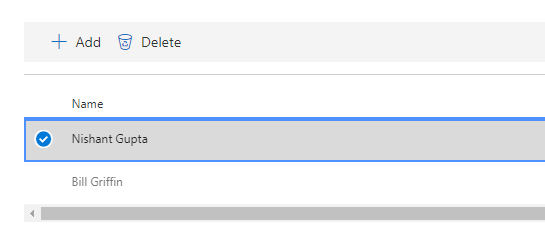

# Utilizzo di Microsoft Compliance Manager (anteprima)

> [!IMPORTANT]
> Microsoft Compliance Manager è un dashboard e uno strumento di gestione che fornisce un riepilogo della protezione dei dati e della conformità e suggerimenti per migliorare la protezione dei dati e la conformità. Le azioni dei clienti fornite in Compliance Manager sono raccomandazioni. Spetta alla propria organizzazione valutare l'efficacia di tali raccomandazioni nei rispettivi ambienti normativi prima dell'implementazione. I consigli di Compliance Manager non devono essere interpretati come una garanzia di conformità.

## Access Compliance Manager

Compliance Manager è accessibile da Microsoft Service Trust Portal. Tutti gli utenti con un account Microsoft o un account aziendale di Azure Active Directory possono accedere a Compliance Manager.

1. Passare a [https://servicetrust.microsoft.com/ComplianceManager/V3](https://servicetrust.microsoft.com/ComplianceManager/V3).

2. Accedere con l'account del servizio Microsoft, ovvero l'account utente di Office 365, Microsoft 365 o Azure Active Directory (Azure AD).

> [!NOTE]
> Nel Service Trust Portal selezionare **Compliance Manager**, ovvero la versione di anteprima con le funzionalità più recenti. Non selezionare **Compliance Manager (Classic)**, che contiene le funzionalità di rilascio anticipato non descritte nella presente documentazione.

## Amministrazione

Esistono funzioni amministrative specifiche disponibili solo per l'amministratore globale e visibili solo quando si esegue l'accesso con un account di amministratore globale. L'amministratore globale può:
- [Assegnare ruoli utente](#assigning-compliance-manager-roles-to-users)
- [Attivazione e disattivazione degli aggiornamenti automatici del Punteggio sicuro](#controlling-automatic-secure-score-updates)
- [Configurare le impostazioni per la privacy degli utenti](#configuring-user-privacy-settings)
  
### Assegnazione di ruoli Compliance Manager agli utenti

Dopo che l'amministratore ha assegnato i ruoli di Compliance Manager ad altri utenti, gli utenti possono visualizzare i dati in Compliance Manager ed eseguire azioni determinate dal loro ruolo. L'amministratore può anche fornire accesso in sola lettura a Compliance Manager assegnando all'utente il [ruolo di lettore globale in Azure Active Directory (Azure ad)](https://docs.microsoft.com/azure/active-directory/users-groups-roles/directory-assign-admin-roles#global-reader).

Ogni ruolo di Compliance Manager ha autorizzazioni leggermente diverse. È possibile visualizzare le autorizzazioni assegnate a ogni ruolo, vedere gli utenti in cui si trovano i ruoli e aggiungere o rimuovere utenti da tale ruolo tramite il Service Trust Portal. Selezionare la voce di menu di **Amministrazione** e scegliere **Settings** to view.
  

  
Per aggiungere o rimuovere utenti da ruoli Compliance Manager.
  
1. Passare a [https://servicetrust.microsoft.com](https://servicetrust.microsoft.com).

2. Accedere con l'account di amministratore globale di Azure Active Directory.

3. Sulla barra dei menu del Service Trust Portal in alto, selezionare **amministratore** e quindi scegliere **Impostazioni**.

4. Nell'elenco a discesa **Seleziona ruolo** selezionare il ruolo che si desidera gestire.

5. Gli utenti aggiunti a ciascun ruolo sono aggiunti nella pagina **Seleziona ruolo**.

6. Per aggiungere utenti a questo ruolo, fare clic su **Aggiungi**. Nella finestra di dialogo **Aggiungi utenti** selezionare il campo utente. È possibile scorrere l'elenco degli utenti disponibili o iniziare a digitare il nome utente per filtrare l'elenco in base al termine di ricerca. Selezionare l'utente per aggiungere quell'account all'elenco **Aggiungi utenti** provisioning con tale ruolo. Se si desidera aggiungere più utenti contemporaneamente, iniziare a digitare un nome utente per filtrare l'elenco e quindi selezionare l'utente da aggiungere all'elenco. Selezionare **Salva** per eseguire il provisioning del ruolo selezionato per gli utenti. 

    
  
7. Per rimuovere gli utenti da questo ruolo, selezionarli e selezionare **Elimina**.

    

### Controllo degli aggiornamenti automatici del Punteggio sicuro

Gli aggiornamenti del Punteggio sicuro possono essere attivati automaticamente per tutte le azioni, disattivate per tutte le azioni o impostate per azione individuale attenendosi alla seguente procedura.

1. Accedere al [Service Trust Portal](https://servicetrust.microsoft.com) con l'account di amministratore globale.

2. Nella barra dei menu del servizio di attendibilità del Service Top, in **altro**, selezionare **amministratore** e quindi scegliere **Impostazioni**.

3. Nella scheda **Punteggio sicuro** selezionare il pulsante corrispondente per **attivarla per tutte le azioni**, disattivarla **per tutte le azioni**o **impostare per azione.**

Se si sceglie **imposta per azione,** eseguire i passaggi aggiuntivi per abilitare gli aggiornamenti dei punti di sicurezza per le singole azioni:

4. Scegliere **Compliance Manager** dal menu in alto (Nota: non selezionare "Compliance Manager (Classic)").

5. Selezionare **gestione tenant** nell'angolo in alto a destra dello schermo.

6. Nel riquadro **azioni cliente** individuare l'azione desiderata con puntini di sospensione (**...**) nella colonna **azioni coinvolte** . Fare clic sui puntini di ellisse e selezionare **modifica.**

7. Cambiare l'opzione attiva/disattiva **aggiornamento continuo Punteggio** **su attivato.**

8. Selezionare **Salva.** Secure Score il monitoraggio continuo è ora attivato per tale azione.

**Nota:** Solo l'amministratore globale può abilitare o disattivare gli aggiornamenti automatici per tutte le azioni. L'amministratore di Compliance Manager può abilitare gli aggiornamenti automatici per singole azioni, ma non per tutte le azioni a livello globale.

### Configurazione delle impostazioni di privacy degli utenti

Alcune normative richiedono che un'organizzazione sia in grado di eliminare i dati della cronologia degli utenti. Per abilitare questa impostazione, le funzioni **delle impostazioni di privacy degli utenti** consentono agli amministratori di:
  
- [Cercare un utente](#search-for-a-user)

- [Esportare un report di cronologia dei dati dell'account](#export-a-report-of-account-data-history)

- [Riassegnare attività](#reassign-action-items)

- [Eliminare la cronologia dei dati dell'utente](#delete-user-data-history)
    

  
#### Cercare un utente

Cercare un account utente:
  
1. Immettere l'indirizzo di posta elettronica dell'utente digitando l'alias, ovvero le informazioni a sinistra del simbolo @, e scegliendo il nome di dominio dall'elenco dei suffissi di dominio sulla destra. Se l'organizzazione dispone di più domini registrati, è possibile controllare il suffisso del nome di dominio dell'indirizzo di posta elettronica per assicurarsi che sia corretto.
    
2. Se il nome utente è stato immesso correttamente, selezionare **Cerca**.
    
3. Se l'account utente non viene trovato, nella pagina verrà visualizzato il messaggio di errore "utente non trovato". Controllare le informazioni relative all'indirizzo di posta elettronica dell'utente, effettuare le correzioni se necessario e selezionare **Cerca** per riprovare.
    
4. Se viene rilevato l'account utente, il testo del pulsante cambia da **Cerca** a **Cancella**, che indica che l'account utente restituito è il contesto operativo per le funzioni aggiuntive che verranno visualizzate di seguito e che l'esecuzione di tali funzioni si applicherà a questo account utente.
    
5. Per cancellare i risultati della ricerca e cercare un altro utente, selezionare **Annulla**.
    
#### Esportare un report di cronologia dei dati dell'account

Dopo aver individuato l'account utente, si può generare un report delle dipendenze collegate all'account. Queste informazioni consentono di riassegnare le attività aperte o di garantire l'accesso a prove già caricate.
  
 Per generare ed esportare un report:
  
1. Selezionare **Esporta** per generare e scaricare un report degli elementi azione di controllo di Compliance Manager attualmente assegnati all'account utente restituito e l'elenco dei documenti caricati da tale utente. Se non sono state assegnate azioni o documenti caricati, viene visualizzato un messaggio di errore che indica che non è presente alcun dato per questo utente.

2. Il report viene scaricato nello sfondo della finestra del browser attiva. Se non viene visualizzato un pop-up per il download, controllare la cronologia dei download del browser.

3. Aprire il documento per visualizzare i dati del report.

> [!NOTE]
> Non si tratta di un report cronologico che conserva e indica le modifiche di stato alla cronologia delle assegnazioni delle attività. Il report generato è un'istantanea delle attività di controllo assegnate al momento dell'esecuzione del report (data e ora scritti nel report). Ad esempio, qualsiasi successiva riassegnazione delle attività genererà dati del report snapshot diversi se questo report viene generato di nuovo per lo stesso utente.
  
#### Riassegnare attività

Questa funzione consente a un'organizzazione di rimuovere tutte le dipendenze attive o in sospeso sull'account utente riassegnando la proprietà di tutte le attività (che include attività sia attivi sia completati) dall'account utente restituito a un nuovo utente selezionato di seguito. Questa operazione non modifica la cronologia di caricamento dei documenti per l'account utente restituito.
  
 Per riassegnare attività a un altro utente:
  
1. Fare clic sulla casella di input per cercare e selezionare un altro utente all'interno dell'organizzazione a cui devono essere assegnate le attività dell'utente restituito.
    
2. Selezionare **Sostituisci** per riassegnare tutte le attività di controllo dall'utente restituito all'utente appena selezionato.
    
3. Verrà visualizzata una finestra di dialogo di conferma, "questo riassegna tutti gli elementi di azione di controllo dall'utente corrente all'utente selezionato. Questa azione non può essere annullata. Continuare?
    
4. Per continuare, seleziona **OK**, altrimenti seleziona **Annulla**.
    
> [!NOTE]
> Tutte le attività (sia attive che completate) saranno assegnate all'utente appena selezionato. Tuttavia, questa operazione non influisce sulla cronologia di caricamento del documento; tutti i documenti caricati dall'utente precedentemente assegnato mostreranno ancora la data/l'ora e il nome dell'utente precedentemente assegnato. 
  
La modifica della cronologia di caricamento dei documenti per rimuovere l'utente precedentemente assegnato dovrà essere eseguita come una procedura manuale. In tal caso, l'amministratore dovrà:
  
1. Aprire il report esportazione scaricato in precedenza.
  
2. Individuare e selezionare l'attività di controllo desiderata.
  
3. Selezionare **Gestisci documenti** per passare all'archivio delle evidenze per il controllo.
  
4. Scaricare il documento.
  
5. Eliminare il documento nell'archivio delle evidenze.
  
6. Ricaricare il documento. Il documento avrà ora una nuova data di caricamento, l'ora e il nome utente "caricato da".
  
#### Eliminare la cronologia dei dati dell'utente

Imposta gli elementi delle attività di controllo su "non assegnati" per tutte le attività assegnate all'utente restituito. Questo imposta anche il valore caricato su "utente rimosso" per tutti i documenti caricati dall'utente restituito
  
 Per eliminare l'attività dell'account utente e la cronologia di caricamento dei documenti:
  
1. Selezionare **Elimina**.

2. Viene visualizzata una finestra di dialogo di conferma: "verranno rimosse tutte le assegnazioni degli elementi di azione di controllo e la cronologia del caricamento del documento per l'utente selezionato. Questa azione non può essere annullata. Continuare?
    
3. Per continuare, seleziona **OK**, altrimenti seleziona **Annulla**.

## Gruppi

I gruppi sono contenitori che consentono di organizzare valutazioni e condividere le informazioni comuni e le attività del flusso di lavoro tra le valutazioni che dispongono dello stesso o dei controlli gestiti dal cliente.

È possibile raggruppare le valutazioni in modo logico, ad esempio per anno, standard, di servizio o in base ai team, alle divisioni o alle aree geografiche dell'organizzazione. Di seguito sono riportati alcuni esempi di due gruppi e le relative valutazioni sottostanti:
  
- **FFIEC è valutazioni 2020**
  - Office 365 + FFIEC è
  - Intune + FFIEC è
- **Sicurezza dei dati e valutazione della privacy**
  - Office 365 e ISO 27001:2013
  - Office 365 e ISO 27018:2014

> [!NOTE]
> È consigliabile determinare una strategia di raggruppamento per l'organizzazione *prima* di aggiungere nuove valutazioni.

Per iniziare, un gruppo **predefinito** è configurato per l'utente che contiene la linea di base per la protezione dei dati. Questa linea di base è un insieme di controlli che include normative e standard industriali comuni (ulteriori[informazioni](compliance-score-methodology.md#initial-score-based-on-microsoft-365-data-protection-baseline)).

### Come creare un gruppo

I gruppi non possono essere creati come entità autonome. Un gruppo deve contenere sempre almeno una valutazione, quindi per creare un gruppo è necessario innanzitutto creare una valutazione da inserire nel gruppo.

Seguire la procedura riportata di seguito per creare un gruppo:

1. Creare una nuova valutazione selezionando **+ Aggiungi valutazione** nei pressi della parte superiore del dashboard.
2. Nel riquadro a comparsa di **valutazione** , immettere un titolo per la valutazione e selezionare un modello dal menu a discesa.
3. In **selezionare un gruppo o aggiungere un nuovo**gruppo, selezionare **Aggiungi un nuovo gruppo** e immettere il nome del gruppo nel campo sottostante.
4. Per copiare le informazioni da un gruppo esistente, attivare o disattivare l'opzione **consente di copiare i dati da un gruppo esistente?** passare a attivato **.** Selezionare il gruppo che si desidera copiare dal menu a discesa sottostante e selezionare le caselle di controllo dei campi che si desidera riportare nella nuova valutazione del nuovo gruppo.
5. Selezionare **Salva**. Al termine, il riquadro a comparsa si chiude e vedrai il nuovo gruppo nel dashboard.

Cosa sapere quando si lavora con i gruppi:
  
- I nomi dei gruppi (denominati anche *ID gruppo*) devono essere univoci all'interno dell'organizzazione.
- I gruppi non dispongono di alcuna proprietà di sicurezza. Tutte le autorizzazioni sono associate alle valutazioni.
- Dopo aver aggiunto una valutazione a un gruppo, non è possibile modificare il raggruppamento. È possibile rinominare il gruppo di valutazione, che modifica il nome del gruppo di valutazione per tutte le valutazioni associate a tale gruppo.
- I controlli relativi alla valutazione in diverse valutazioni all'interno dello stesso gruppo vengono aggiornati automaticamente quando sono stati completati.
- Se si aggiunge una nuova valutazione a un gruppo esistente, le informazioni comuni provenienti da valutazioni di quel gruppo vengono copiate nella nuova valutazione.
- I gruppi possono contenere valutazioni per la stessa certificazione o regolamentazione, ma ogni gruppo può contenere solo una valutazione per una coppia specifica di certificazione di prodotto. Ad esempio, un gruppo non può contenere due valutazioni per Office 365 e NIST CSF. Un gruppo può contenere più valutazioni per lo stesso prodotto solo se la certificazione o la normativa corrispondente per ognuna di esse è diversa.
- Se si nasconde una valutazione, la relazione tra tale valutazione e il gruppo viene interrotta. Qualsiasi ulteriore aggiornamento ad altre valutazioni correlate non viene più riflesso nella valutazione nascosta. ([Informazioni su come nascondere le valutazioni).](#hide-a-template-or-an-assessment)
- Non è possibile eliminare i gruppi.
- Quando viene apportata una modifica a un elemento di azione che viene visualizzato in più gruppi, la modifica viene applicata a tutte le istanze di tale elemento.

## Gestione tenant delle dimensioni, dei proprietari, delle azioni del cliente &

L'interfaccia di **gestione tenant** consente di gestire le impostazioni a livello di organizzazione:

- **Dimensioni:** Consente di visualizzare i metadati per i modelli, le valutazioni e gli elementi di azione che consentono di creare pivot personalizzati per i filtri.
- **Proprietari:** Inserire un elenco di parti responsabili che possono essere associate alle azioni.
- **Azioni dei clienti:** Gestire l'elenco completo degli elementi delle azioni inclusi in Compliance Manager (Preview) e abilitare/disabilitare il monitoraggio del Punteggio sicuro per le azioni che sono integrate con Secure score.

Selezionare **gestione tenant** dall'angolo in alto a destra dello schermo per aprire l'interfaccia di gestione e utilizzare i passaggi riportati di seguito per gestire le **dimensioni**, i **proprietari**e le **azioni dei clienti**.

### Dimensioni

Le dimensioni sono insiemi di metadati che forniscono informazioni su un modello, una valutazione o un elemento di azione. Le dimensioni utilizzano il concetto di chiavi e valori, in cui la chiave Dimension rappresenta una proprietà e il valore della dimensione rappresenta valori validi per la proprietà. Ad esempio, in Compliance Manager esistono tre tipi di azioni. Sono definite da una chiave di dimensione per l' **azione** e i valori delle dimensioni di **preventivo**, **investigativo**e **correttivo**.

### Proprietari

I proprietari vengono utilizzati per identificare la persona responsabile di ogni controllo. Tutti i controlli incorporati sono di proprietà di Microsoft, dei clienti o di entrambi. È possibile creare valori personalizzati per i proprietari che possono essere utilizzati per specificare le responsabilità più granulari all'interno dell'organizzazione. Ad esempio, è possibile creare proprietari che rappresentano gruppi, team o unità aziendali specifici all'interno dell'organizzazione.

#### Aggiungere un proprietario

1. Aprire **gestione tenant** e selezionare **proprietari**.
2. Selezionare **+ Aggiungi proprietario**.
3. Specificare un nome e una descrizione per il proprietario e selezionare **Salva**. La descrizione viene visualizzata nella colonna Owner.

#### Modifica di un proprietario

Non è possibile modificare il nome di un proprietario, bensì modificare la descrizione visualizzata nella colonna Owner.

1. Aprire **gestione tenant** e selezionare **proprietari**.
2. Individuare il proprietario che si desidera modificare, selezionare i puntini di ellissi (...) accanto e selezionare **modifica**.
3. Modificare la descrizione in base alle esigenze e selezionare **Salva**.

#### Eliminare un proprietario

1. Aprire **gestione tenant** e selezionare **proprietari**.
2. Individuare il proprietario che si desidera eliminare, selezionare i puntini di ellissi (...) accanto e selezionare **Elimina**.
3. Quando viene visualizzato il messaggio di conferma, selezionare **Elimina**.

### Azioni dei clienti

L'area azioni clienti Visualizza tutte le azioni dei clienti per tutti i modelli e le valutazioni in Compliance Manager (Preview).

A colpo d'occhio, è possibile visualizzare il titolo, il proprietario, la categoria, l'applicazione e il Punteggio di un'azione e determinare se è integrata con il Punteggio sicuro. È possibile espandere un'azione e selezionare **Leggi altro** per leggere la descrizione dell'azione e accedere a qualsiasi collegamento nella descrizione. È inoltre possibile utilizzare questa interfaccia per abilitare e disabilitare l'integrazione del Punteggio sicuro in base all'azione e per aggiungere azioni personalizzate. Le azioni che dispongono di funzionalità di integrazione con punteggio sicuro dispongono di puntini di sospensione (...) accanto a essi (si noti che le azioni personalizzate dispongono anche di puntini di sospensione accanto a essi).

#### Abilitazione o disabilitazione dell'integrazione del Punteggio sicuro

1. Selezionare i puntini di ellisse (...) per l'azione che si desidera modificare e selezionare **modifica**.
2. Attiva o disattiva l'opzione per l'aggiornamento continuo del Punteggio sicuro su attivato o disattivato per attivare o disattivare il monitoraggio continuo tramite il Punteggio sicuro.
3. Selezionare **Salva**.

Quando le organizzazioni distribuiscono per la prima volta Microsoft 365 o Office 365, sono necessari circa sette giorni per ottenere un punteggio sicuro per raccogliere completamente i dati e fattorizzarli nella partitura. Durante questo periodo, l'impostazione dell'opzione aggiornamento continuo Punteggio sicuro su **disattivato** e l'impostazione manuale di un'azione su **implementata** consentiranno di contare tale azione verso il punteggio. Dopo sette giorni iniziali, la riattivazione dell'aggiornamento continuo dei punteggi sicuri consentirà il monitoraggio continuo da quel momento in poi.

Tutte le azioni che non sono supportate dall'integrazione del Punteggio sicuro possono essere implementate manualmente. Un'implementazione manuale consentirà di fattorizzare lo score del gruppo dell'azione.

## Valutazioni

In questa sezione viene illustrato come visualizzare e utilizzare le proprie valutazioni, tra cui l'aggiunta di nuove, l'esportazione, la copia delle informazioni da valutazioni esistenti e l'aggiornamento tramite il controllo delle versioni.

> [!NOTE]
> È ora possibile creare valutazioni nel punteggio di conformità. [Visualizzare informazioni e istruzioni](compliance-score-assessments.md).

### Visualizzazione di una valutazione e dettagli sull'azione
  
Nel dashboard **valutazioni** selezionare il nome della valutazione per aprirlo e visualizzare le informazioni sugli elementi di azione e sui controlli.

Di seguito è riportato un esempio di valutazione per Office 365 e ISO 27001. Nella prima visualizzazione viene illustrata la nuova visualizzazione elementi azione in Compliance Manager (Preview).

Le azioni sono elencate in ordine alfabetico e a ogni azione viene assegnato un punteggio e un proprietario. Selezionare il collegamento **Leggi altro** per leggere i dettagli di ogni azione.

Selezionare il collegamento **Revisione** per gestire, assegnare, implementare e testare l'azione. Di seguito è riportato un esempio di azione.

Per gestire il flusso di lavoro dell'azione, utilizzare i campi seguenti:

- **Assegnare un utente:** Selezionare questo campo per scegliere o immettere l'utente a cui deve essere assegnata l'azione. È possibile scorrere l'elenco o digitare un nome per trovarlo, quindi selezionarlo.
- **Gestire i documenti:** È possibile caricare la prova dell'implementazione in formato documenti di Office, file di immagine e schermate, output di PowerShell in formato CSV o TXT e file PDF.
- **Stato implementazione:** Utilizzato per indicare lo stato di implementazione corrente dell'azione. I valori possibili non sono implementati, implementati, l'implementazione alternativa, pianificata e non nell'ambito.
- **Data di implementazione:** La data in cui è stata eseguita l'azione.
- **Risultato del test:** Utilizzato per indicare i risultati della convalida dell'implementazione. I valori possibili non sono valutati, superato, non riuscito-rischio basso, non riuscito-rischio medio, rischio non riuscito-elevato e non nell'ambito.
- **Data test:** La data in cui si è verificata la convalida.
- **Note sull'implementazione:** Immettere i dettagli sull'implementazione per l'organizzazione, insieme a tutte le note che si desidera includere.
- **Piano di testing:** Immettere i dettagli del piano di test per questa azione, insieme a tutte le note che si desidera includere.
- **Ulteriori informazioni:** Immettere eventuali informazioni aggiuntive su questa azione o su come è stata implementata nell'organizzazione, insieme a tutte le note che si desidera includere.

Nel dashboard **informazioni controlli** è possibile visualizzare le informazioni per i controlli a livello di valutazione e di modello. Di seguito è riportato un esempio del dashboard delle informazioni sui controlli per le valutazioni.

Per le valutazioni, il Dashboard delle informazioni sui controlli Visualizza le informazioni seguenti:

- Un elenco a discesa di **gruppo** per selezionare il gruppo da visualizzare (quando si utilizzano più gruppi).
- Un elenco a discesa di **valutazione** che consente di selezionare la valutazione da visualizzare.
- Metadati relativi alla valutazione selezionata, tra cui:
    - Indicatore di stato per i **controlli valutati** che indicano il numero di controlli valutati rispetto al numero totale di controlli.
    - Il **Punteggio di conformità** corrente per la valutazione, visualizzato come percentuale.
    - Informazioni dettagliate sulla **certificazione** e sul **prodotto** utilizzati per la valutazione.
    - Lo **stato** corrente e la data dell'ultima **modifica** per la valutazione.
- Elenco dei **servizi di ambito** per la valutazione.
- Informazioni dettagliate sui controlli, raggruppati in base alla famiglia di controlli, con collegamenti a azioni dei clienti e dettagli sull'implementazione Microsoft:
    - Nelle **azioni** vengono visualizzate le azioni dei clienti che è possibile eseguire per soddisfare alcuni o tutti i requisiti del controllo. Molti controlli dispongono di più azioni associate e tutte le azioni associate a un controllo vengono visualizzate qui. Le azioni qui hanno la stessa interfaccia utente di quelle elencate nel dashboard Actions.
    - **Microsoft Actions** Visualizza l'elenco dei controlli del Framework interno Microsoft che si applicano al controllo di certificazione selezionato. Per ogni controllo interno, selezionare **implementato** per visualizzare i dettagli relativi all'implementazione e ai test di Microsoft, insieme al risultato del test e alla data di test, come illustrato di seguito.

### Aggiungere una valutazione
  
1. Nel dashboard valutazioni selezionare **+ Aggiungi valutazione**.

2. Quando si apre il Blade, immettere le informazioni seguenti:

    - **Titolo (obbligatorio):** Immettere un titolo per la valutazione
    - **Selezionare un modello (obbligatorio):** Selezionare un modello standard o personalizzato
    - **Selezionare un gruppo o aggiungere un nuovo gruppo (obbligatorio):** Selezionare un gruppo esistente oppure scegliere di aggiungere un nuovo gruppo e specificare un nome di gruppo univoco
    - **Si desidera copiare i dati da un gruppo esistente? (facoltativo):** attiva o disattiva il controllo per abilitare la copia del gruppo e quindi:
        - **Selezionare un gruppo (facoltativo):** Se è abilitata la copia di gruppo, selezionare il gruppo da cui copiare
            - **Dettagli sull'implementazione (facoltativa):** Selezionare per copiare i dettagli dell'implementazione nel nuovo gruppo
            - **Piano di Test & ulteriori informazioni (facoltativo):** Selezionare per copiare il piano di testing e ulteriori informazioni dettagliate sul nuovo gruppo
            - **Documenti (facoltativo):** Selezionare per copiare i documenti nel nuovo gruppo

3. Selezionare **Salva** per creare la valutazione.

 La nuova valutazione viene visualizzata nel dashboard di valutazione e visualizza le informazioni seguenti:

- Il titolo della valutazione.
- Le dimensioni della valutazione, tra cui la certificazione, l'ambiente e il prodotto applicati alla valutazione.
- La data in cui è stata creata e la data in cui è stata modificata per l'ultima volta.
- Il Punteggio di valutazione visualizzato come percentuale. Questo punteggio include automaticamente i punteggi dei controlli gestiti da Microsoft e dal punteggio sicuro.
- Indicatori di stato che mostrano il numero di controlli gestiti da Microsoft e gestito dal cliente.

### Copiare le informazioni da valutazioni esistenti

Quando si crea una valutazione, si ha la possibilità di copiare le informazioni da un gruppo esistente. La copia consente di applicare le informazioni immesse nella valutazione copiata agli stessi controlli nella nuova valutazione. Ad esempio, se si dispone di un gruppo per tutte le valutazioni correlate a FFIEC nell'organizzazione, è possibile copiare le informazioni seguenti dalle valutazioni esistenti:

- Dettagli sull'implementazione
- Piano di test & ulteriori informazioni
- Documenti

#### Copia delle informazioni da una valutazione esistente a una nuova valutazione
  
1. Nel dashboard di valutazione selezionare **+ Aggiungi valutazione**.
    
2. Nella finestra **Aggiungi una valutazione** , completare le seguenti informazioni

    - **Titolo (obbligatorio):** Immettere un titolo per la valutazione.
    - **Selezionare un modello (obbligatorio):** Selezionare un modello standard o personalizzato.
    - **Selezionare un gruppo o aggiungere un nuovo gruppo (obbligatorio):** Scegliere **aggiungere un nuovo gruppo** e specificare un nome di gruppo univoco.
    - **Si desidera copiare i dati da un gruppo esistente? (facoltativo):** alternare il controllo a attivato per abilitare la copia del gruppo e quindi:- **selezionare un gruppo (facoltativo):** se la copia del gruppo è abilitata, selezionare il gruppo da cui copiare.
            - **Dettagli sull'implementazione (facoltativa):** Selezionare per copiare i dettagli dell'implementazione nel nuovo gruppo.
            - **Piano di Test & ulteriori informazioni (facoltativo):** Selezionare per copiare il piano di testing e ulteriori informazioni dettagliate sul nuovo gruppo.
            - **Documenti (facoltativo):** Selezionare per copiare i documenti nel nuovo gruppo.

3. Selezionare **Salva** per creare la valutazione.

### Avvisi per il controllo delle versioni per gli aggiornamenti di valutazione

Quando è disponibile un aggiornamento per una valutazione, un'icona di avviso informa che è pronto un aggiornamento. Quando si fa clic su quell'icona, viene visualizzata una finestra popup che spiega l'aggiornamento e chiede di accettare. Di seguito è riportato un esempio di avviso per il controllo delle versioni per una valutazione:

Se si seleziona l'icona di avviso, viene illustrato un riquadro a comparsa che illustra l'aggiornamento e viene richiesto di accettare:

Si consiglia vivamente di accettare tutti gli aggiornamenti quando si ricevono notifiche di aggiornamento.

### Esportare una valutazione

È possibile esportare una valutazione in un file di Excel per la conformità delle parti interessate nell'organizzazione o per i revisori esterni e regolatori. Il report è un'istantanea della valutazione alla data e all'ora in cui viene creato il report. Il report contiene i dettagli per tutti i controlli Microsoft e gestiti dal cliente per la valutazione, lo stato di implementazione del controllo, la data del test di controllo, i risultati dei test e fornisce collegamenti ai documenti di prova caricati.
  
### Esportare un report di valutazione
  
1. Nel dashboard di Compliance Manager selezionare **controlli scheda informazioni** .
2. Selezionare il **gruppo** e la **valutazione** nei menu a discesa per la valutazione che si desidera esportare.
3. Selezionare il pulsante **Esporta** .

Il report di valutazione viene scaricato come file di Excel nella sessione del browser. Il nome dei file per il file di Excel è predefinito per il titolo della valutazione.

### Nascondere un modello o una valutazione

Al termine di un modello o di una valutazione e non è più necessario ai fini della conformità, è possibile nasconderlo dalla visualizzazione. Quando un modello o una valutazione è nascosta, viene rimossa dalla visualizzazione predefinita ed è necessario selezionare **Includi** casella di controllo nascosta per visualizzarla.

> [!IMPORTANT]
> Le valutazioni nascoste non conservano i collegamenti ai documenti di prova caricati. È consigliabile esportare una valutazione prima di nasconderla per mantenere i collegamenti ai documenti di prova nel report.
  
#### Nascondere un modello

1. Aprire il dashboard dei **modelli** .
2. Individuare il modello che si desidera nascondere e nei puntini di ellissi della relativa riga selezionare **Nascondi**.
3. Quando viene visualizzato il messaggio di conferma, selezionare **Nascondi**.

#### Nascondere una valutazione

1. Aprire il dashboard **valutazioni** .
2. Selezionare il **gruppo** dall'elenco a discesa contenente la valutazione che si desidera nascondere.
3. Individuare la valutazione che si desidera nascondere e i puntini di ellisse, selezionare **Nascondi**.
4. Quando viene visualizzato il messaggio di conferma, selezionare **Nascondi**.

#### Visualizzazione di valutazioni nascoste
  
1. Aprire la scheda Dashboard **valutazioni** e selezionare la casella di controllo **Includi nascosto** .
2. Le valutazioni nascoste vengono visualizzate nella sezione **valutazioni nascoste** .

#### Scoprire una valutazione

1. Nella scheda **valutazioni** selezionare la casella di controllo **Includi nascosto** .
2. Le valutazioni nascoste vengono visualizzate nella sezione **valutazioni nascoste** .
3. Individuare la valutazione che si desidera visualizzare e i puntini di ellisse, selezionare **Scopri**.
4. Quando viene visualizzato il messaggio di conferma, seleziona **Scopri**.

## Controlli e azioni

I controlli e le azioni sono i principali pivot di dati utilizzati in Compliance Manager (Preview). Il pivot di controllo, che esisteva nelle versioni precedenti di Compliance Manager, è stato migliorato per mostrare i controlli Microsoft e dei clienti nelle stesse famiglie di controllo. Questa visualizzazione consolidata consente di visualizzare più facilmente il modello di responsabilità condivisa completo in base ai singoli controlli. Il pivot azione è una novità di Compliance Manager (Preview) ed è stato creato per fornire una visualizzazione semplificata di tutte le azioni consigliate da Microsoft.

### Controlli

I controlli possono essere visualizzati dal dashboard info Controls. I controlli rappresentano i requisiti di una norma, una certificazione, una regolamentazione o un Framework. Per eseguire il mapping di tali requisiti su più standard, normative e così via, per associarli a azioni, tutto viene considerato come un Framework di controllo. Ad esempio, come un Framework di controllo, i regolamenti, come HIPAA, sono stati suddivisi per sezione e i controlli HIPAA in Compliance Manager utilizzano lo stesso schema di numerazione di quelle sezioni, come illustrato di seguito:

Sono disponibili tre tipi di controlli:

1. **Controlli gestiti da Microsoft:** questi sono i controlli per cui solo Microsoft ha la responsabilità. Vengono visualizzati nei modelli in-box e vengono aggiunti a Compliance Manager da Microsoft.
2. **Controlli gestiti dal cliente:** sono controlli per i quali solo i clienti hanno la responsabilità. Vengono visualizzati nei modelli in-box e vengono aggiunti a Compliance Manager dai clienti.
3. **Controlli di gestione condivisi:** sono i controlli in cui la responsabilità è condivisa tra Microsoft e il cliente. Questi vengono visualizzati nei modelli in-box e vengono aggiunti a Compliance Manager da Microsoft. Il cliente può anche modificare o disabilitare i controlli gestiti da Microsoft.

### Elementi Actions

Gli elementi Actions sono le attività consigliate per l'implementazione dei requisiti di una norma o di una regolamentazione o per testare, verificare e documentare i requisiti di implementazione dell'organizzazione. Le azioni sono associate a uno o più controlli. A ogni controllo è associata una o più azione e ogni azione può essere associata a uno o più controlli. Le azioni fanno parte del flusso di lavoro di base in Compliance Manager (Preview), in quanto sono gli oggetti assegnati, monitorati e convalidati dall'organizzazione.

#### Assegnare elementi azione
  
1. Nel dashboard **elementi azione** selezionare il **gruppo** contenente le valutazioni di cui si desidera assegnare l'azione.
2. Nell'elenco a discesa **valutazione** selezionare la valutazione di cui si desidera assegnare l'azione oppure selezionare **tutto** dall'elenco a discesa per visualizzare tutte le azioni disponibili.
3. Individuare l'azione che si desidera assegnare e, nella colonna **proprietario** , selezionare il collegamento per la **Revisione**, * * implementato o **testare**.
4. Selezionare il campo **assegna utente** e visualizzare un elenco di utenti dell'organizzazione. Scorrere l'elenco e selezionare utente oppure filtrare l'elenco per selezionare un utente digitando il nome dell'utente.
5. Nel campo note di implementazione immettere le note che si desidera trasmettere all'utente assegnato.
6. Selezionare **Salva** per assegnare l'azione.

#### Riassegnare gli elementi di azione

Questa funzione consente a un'organizzazione di rimuovere eventuali dipendenze attive o inevase dall'account utente riassegnando un'azione a un nuovo utente.

1. Nel dashboard **elementi azione** selezionare il **gruppo** contenente le valutazioni di cui si desidera riassegnare l'azione.
2. Nell'elenco a discesa **valutazione** selezionare la valutazione di cui si desidera riassegnare l'azione oppure selezionare **tutto** dall'elenco a discesa per visualizzare tutte le azioni disponibili.
3. Individuare l'azione che si desidera riassegnare e, nella colonna **proprietario** , selezionare il collegamento per la **Revisione**, **implementato**o **test**.
4. Eliminare l'utente esistente dal campo **assign user** e scegliere un utente diverso dall'elenco di utenti oppure filtrare l'elenco per selezionare un utente digitando il nome dell'utente.
5. Nel campo note di implementazione immettere le note che si desidera trasmettere all'utente.
6. Selezionare **Salva** per riassegnare l'azione.

#### Stato della sincronizzazione degli elementi di azione comuni tra i gruppi

Se nell'organizzazione sono presenti più gruppi di valutazioni, è presente un comportamento delle azioni tecniche, ovvero azioni che interessano l'intera organizzazione. Tutte le azioni duplicate tra i gruppi vengono ora combinate in un'unica azione. Questa singola azione contiene tutte le note caricate e le evidenze di versioni precedentemente duplicate. Tutte le modifiche apportate all'azione in un gruppo o in una valutazione verranno riflesse in tutte le istanze di tale azione. Lo **stato**di implementazione, la **Data di implementazione**, **lo stato del test**e i campi data di **test** riflettono gli aggiornamenti più recenti.

## Modelli

Un modello è l'oggetto di base in Compliance Manager (Preview) associato a un prodotto e a una certificazione (ad esempio, standard, Regulation, Control Framework e così via). I modelli possono essere visualizzati e aggiunti dal dashboard dei **modelli** .

 
Nel dashboard vengono visualizzati tutti i modelli, insieme alla certificazione e al prodotto associati al modello, alle date in cui è stato creato il modello e all'Ultima modifica, al numero di controlli Customer e Managed Microsoft, al Punteggio di conformità massimo per il modello e allo stato del modello (ad esempio approvato, in attesa di approvazione, importato).

### Creare un modello

Esistono tre modi per utilizzare i modelli per creare valutazioni:

1. Utilizzare uno dei modelli pronti per l'uso forniti da Microsoft.
2. Personalizzare un modello pronto per l'uso con le proprie azioni e i controlli tramite il processo di estensione.
3. Creare il proprio modello e importarlo in Compliance Manager.

> [!NOTE]
> Quando si carica un modello in Compliance Manager, è necessario che sia approvato da due utenti che contengono un ruolo di amministratore prima che vengano pubblicati e siano disponibili per l'uso.

#### Utilizzo di un modello pronto per l'uso

I modelli pronti per l'uso sono disponibili nel dashboard dei **modelli** . Consente di visualizzare l' [elenco corrente dei modelli](compliance-score-templates.md), che viene aggiornato ogni volta che un nuovo modello è disponibile.

#### Personalizzare un modello tramite il processo di estensione

1. Aprire il dashboard **modelli** e selezionare **+ Aggiungi modello**.
2. Nel riquadro a comparsa modello selezionare la casella **di controllo Crea estensione da modello globale** .
3. Selezionare il modello che si desidera estendere dal menu a discesa.
4. Se i dati del modello non sono già stati formattati in Excel, selezionare il collegamento nel riquadro a comparsa per scaricare un file di Excel. Compilare il foglio di calcolo in base ai dati del modello di importazione con le istruzioni di [Excel riportate](#import-template-data-with-excel) di seguito e salvarlo nell'unità locale.
5. Importare i dati dei modelli personalizzati selezionando **Sfoglia** per caricare il file di Excel.
6. Selezionare **Aggiungi a Dashboard**.
7. Le modifiche apportate al modello richiedono l'approvazione di due utenti che contengono un ruolo di amministratore. Gli utenti ricevono una notifica degli aggiornamenti del modello. Una le modifiche sono approvate da due amministratori, verrà visualizzato il modello aggiornato nel dashboard dei **modelli** .

#### Creare il proprio modello e importarlo in Compliance Manager

1. Aprire il dashboard **modelli** e selezionare **+ Aggiungi modello**.
2. Nel riquadro a comparsa modello, selezionare **Crea un nuovo modello**.
3. Importare i dati del modello selezionando **Sfoglia** per caricare il file di Excel contenente i dati (vedere [importare i dati dei modelli con Excel](#import-template-data-with-excel) seguente).
4. Selezionare **Aggiungi a Dashboard**.
5. Il nuovo modello richiede l'approvazione di due utenti che contengono un ruolo di amministratore. Gli utenti ricevono una notifica che un nuovo modello è pronto per l'approvazione. Uno il modello è approvato da due amministratori, verrà visualizzato il nuovo modello nel dashboard dei **modelli** .

#### Importare i dati dei modelli con Excel

Per modificare un modello o creare un modello personalizzato, è possibile utilizzare un [foglio di calcolo di Excel](https://go.microsoft.com/fwlink/?linkid=2124865) per acquisire i dati necessari e caricarli in Compliance Manager. Questo modello di foglio di calcolo ha un formato specifico e uno schema che deve essere utilizzato oppure non verrà importato in Compliance Manager.

> [!IMPORTANT]
> Se sono stati creati o personalizzati modelli in Compliance Manager, **questo processo è stato aggiornato di recente. Leggere attentamente questa sezione.**

Il foglio di calcolo contiene quattro schede, tre delle quali sono necessarie:

1. Modello (obbligatorio)
2. ControlFamily (obbligatorio)
3. Azioni (obbligatorio)
4. Dimensioni (facoltativa)

Il foglio **di calcolo deve includere le schede nell'ordine**, altrimenti i dati non verranno importati correttamente in un modello.

##### Scheda modello

La scheda **modello** è obbligatoria. Le informazioni contenute in questa scheda forniscono i metadati relativi al modello. Sono disponibili quattro colonne obbligatorie. Le colonne devono mantenere l'ordine nel foglio di Excel come elencato di seguito. È possibile aggiungere una colonna personalizzata **dopo** le quattro colonne per fornire le proprie dimensioni. Se si esegue questa operazione, accertarsi di aggiungerli alla scheda **dimensioni** seguendo le istruzioni riportate di [seguito](#dimensions-tab).

- **title**: questo è il titolo del modello, che deve essere univoco. Non è in grado di condividere un nome con un altro modello di Compliance Manager, se si tratta di un modello già creato oppure di un modello preconfigurato fornito da Microsoft.

- **Product**: questa è una dimensione obbligatoria. Elencare il prodotto associato al modello.

- **Certification**: questo è il regolamento che si sta utilizzando per il modello.

- **inScopeServices**: questi sono i servizi all'interno del prodotto che questa valutazione affronta (ad esempio, se è stato elencato Office 365 come prodotto, Microsoft teams potrebbe essere un servizio in ambito). È possibile elencare più servizi separati da due punti e virgola.

> [!NOTE]
> Per quanto riguarda il prodotto e la certificazione, non è possibile modificare i dati inseriti nelle celle di **prodotto** e di **certificazione** dopo aver importato il foglio di calcolo per creare o personalizzare un modello. Inoltre, un gruppo non può contenere due valutazioni che hanno la stessa combinazione di **prodotto/certificazione** . È possibile disporre di più modelli che dispongono della stessa combinazione di prodotto/certificazione.

##### Scheda ControlFamily

La scheda **ControlFamily** è obbligatoria.  Le colonne obbligatorie di questa scheda, che devono seguire l'ordine specificato nel foglio di calcolo di esempio, sono le seguenti:

- **ControlName**: questo è il nome del controllo della certificazione, standard o Regulation, che in genere è un tipo di ID. I nomi dei controlli devono essere univoci all'interno di un modello. Non è possibile disporre di più controlli con lo stesso nome nel foglio di calcolo.

- **controlFamily**: consente di specificare una parola o una frase per il controlFamily, che identifica un ampio raggruppamento di controlli. Un controlFamily non deve essere univoco. è possibile elencare più di una volta in un foglio di calcolo. Lo stesso controlFamily può anche essere elencato in più modelli, anche se non hanno alcuna relazione tra loro. Ogni controlFamily deve essere mappato a almeno un controllo.

- **controlTitle**: consente di specificare un titolo per il controllo. Mentre la proprietà ControlName è un codice di riferimento, il titolo è un formato RTF generalmente visualizzato nelle normative.

- **controlDescription**: consente di specificare una descrizione del controllo.

- **controlActionTitle**: si tratta del titolo di un'azione che si desidera correlare a questo controllo. È possibile aggiungere più azioni separando da due punti e virgola senza spazi tra. Ogni controllo da elencare deve includere almeno un'azione e l'azione deve esistere (il che significa che è possibile elencare un'azione che viene elencata nella scheda **azioni** dello stesso foglio di calcolo, un'azione che esiste in un modello diverso o un'azione creata da Microsoft). Controlli diversi possono fare riferimento alla stessa azione.

##### Scheda azioni

La scheda **azioni** è obbligatoria.  Designa le azioni dell'organizzazione e non le azioni di Microsoft, che già esistono in Compliance Manager. Le colonne obbligatorie per questa scheda, che devono seguire l'ordine specificato nel foglio di calcolo di esempio, sono le seguenti:

- **actionTitle**: questo è il titolo dell'azione ed è un campo obbligatorio. Il titolo specificato deve essere univoco. **Importante**: se si fa riferimento a un'azione proprietaria già esistente, ad esempio in un altro modello, e si modifica uno dei suoi elementi nelle colonne successive, tali modifiche verranno propagate alla stessa azione in altri modelli.

- **implementationType**: in questo campo obbligatorio elencare uno dei tre tipi di implementazione seguenti:
    - **Operative** -azioni implementate da persone e processi per proteggere la riservatezza, l'integrità e la disponibilità dei sistemi, delle risorse, dei dati e del personale dell'organizzazione (ad esempio: sensibilizzazione e formazione sulla sicurezza)
    - **Technical** -azioni completate tramite l'utilizzo di tecnologie e meccanismi contenuti nei componenti hardware, software o firmware del sistema informativo per proteggere la riservatezza, l'integrità e la disponibilità dei sistemi e dei dati dell'organizzazione (ad esempio: autenticazione a più fattori)
    - **Documentazione** : azioni implementate mediante criteri e procedure documentate che stabiliscono e definiscono i controlli necessari per proteggere la riservatezza, l'integrità e la disponibilità dei sistemi, delle risorse, dei dati e del personale dell'organizzazione (ad esempio, un criterio di sicurezza delle informazioni)

- **actionScore**: in questo campo obbligatorio fornire un valore numerico per l'azione. Deve essere un numero intero compreso tra 1 e 99; non può essere 0, null o vuoto. Maggiore è il numero, maggiore è il valore verso il miglioramento della posizione di conformità. Per ulteriori informazioni, vedere in che modo Microsoft classifica i propri controlli:

- **actionDescriptionTitle**: questo è il titolo della descrizione ed è obbligatorio. Questo titolo di descrizione consente di avere la stessa azione in più modelli e di superficie una descrizione diversa in ogni modello.  Questo campo consente di chiarire il modello a cui fa riferimento la descrizione. Nella maggior parte dei casi, è possibile inserire il nome del modello che si sta creando in questo campo.

- **actionDescription**: consente di specificare una descrizione dell'azione. È possibile applicare la formattazione come testo in grassetto e collegamenti ipertestuali. Questo è il campo obbligatorio.

- **scopo della dimensione**: questo è un campo facoltativo. Se lo si include, l'intestazione deve includere il prefisso "Dimension-". Tutte le dimensioni incluse in questa sezione verranno utilizzate come [filtri per il Punteggio di conformità](compliance-score-setup.md#filtering-your-dashboard-view) e visualizzate nella pagina dei dettagli sulle azioni di miglioramento nel punteggio di conformità.

##### Scheda dimensioni

La scheda **dimensioni** è facoltativa. Tuttavia, se si fa riferimento a una dimensione altrove, è necessario specificarla qui se non esiste in un modello già creato o in un modello Microsoft. Le colonne di questa scheda sono elencate di seguito:

- **dimensionKey**: elenco come "prodotto", "certificazioni", "scopo dell'azione"
- **dimensionValue**: esempi: Office 365, HIPPA, preventive, detective

È possibile visualizzare le dimensioni esistenti accedendo alla **gestione tenant** e selezionando la scheda **dimensioni** . Inoltre, ogni volta che si esporta un modello esistente, il foglio di calcolo esportato avrà la scheda **dimensioni** , in cui sono elencate tutte le dimensioni utilizzate nel modello.

### Modificare un modello esistente

Per apportare modifiche a un modello creato o personalizzato utilizzando il processo di importazione descritto in alto, è possibile utilizzare lo stesso processo per importare tali modifiche nel modello.

> [!NOTE]
> Ci sono diversi fattori importanti da tenere presenti quando si modificano i componenti dei modelli, quindi leggere attentamente questa sezione.

#### Processo generale per la modifica di un modello

Per apportare modifiche a uno dei modelli esistenti dell'organizzazione, il processo generale è:

1. Dal dashboard dei **modelli** , selezionare il modello che si desidera modificare, che Visualizza il Dashboard delle **informazioni sui controlli** che mostra la scheda **modello** .
2. Selezionare **Esporta**da qui. Verrà scaricato un foglio di Excel con tutti i dati del modello.
3. Per modificare, aggiungere o rimuovere un'azione, vedere le sezioni seguenti.
4. Al termine delle modifiche apportate al file di Excel, importare nuovamente il file nel modello selezionando il modello dal dashboard e selezionando **Importa**. Il modello includerà ora le modifiche apportate.

#### Per modificare gli attributi del modello

Nella scheda **modelli** è possibile modificare qualsiasi elemento nella colonna **title** , nella colonna **inScopeServices** e in qualsiasi altra colonna aggiunta. Tuttavia, non è possibile modificare nulla nelle colonne **Product** o **Certification** .

#### Per aggiungere un'azione a un modello

1. Passare alla scheda **azioni** e aggiungere le informazioni nei campi obbligatori nella prima riga vuota sotto le azioni esistenti.
2. Andare alla scheda **ControlFamily** . individuare la riga contenente il controllo a cui è associata l'azione. Aggiungere la nuova azione alla colonna **controlActionTitle** in quella riga (ricordarsi di separare più azioni in questo campo con due punti e virgola, senza spazi tra).
3. Salvare il foglio di calcolo nel computer locale.

#### Per modificare le informazioni di un'azione

È possibile modificare le informazioni di qualsiasi azione *ad eccezione del titolo*. È possibile modificare qualsiasi cella dalle colonne B e quindi quando si importa di nuovo il file nel modello, le azioni in quel modello conterranno i dati aggiornati.

Non è possibile modificare il **actionTitle** (colonna a) perché, in caso affermativo, Compliance Manager ritiene che sia una nuova azione. Se si desidera modificare il nome di un'azione, vedere le istruzioni riportate di seguito.

#### Per modificare il nome di un'azione

Se si desidera modificare il nome di un'azione, è necessario indicare in modo esplicito nel foglio di calcolo che si sta sostituendo un nome esistente con un nuovo nome. Per modificare il nome di un'azione, eseguire la procedura seguente:

1. Nella scheda **azioni** del foglio di calcolo, aggiungere una nuova colonna al foglio di calcolo dopo la colonna a.
2. In questa nuova colonna, che ora è la colonna B, inserire l'intestazione nella riga 1: **oldActionTitle**.
3. Copiare il contenuto della colonna A e incollarlo nella colonna B. In questo modo i titoli di azione esistenti, che sono ciò che si desidera modificare, vengono inseriti nella colonna B.
4. Nella colonna A, **actionTitle**, eliminare il vecchio nome e sostituirlo con il nuovo nome per l'azione.

#### Per rimuovere un'azione da un modello

L'eliminazione di un'azione da una riga di un foglio di calcolo **non** consente di rimuovere l'azione dal modello che si sta modificando. Al contrario, seguire il processo riportato di seguito per rimuovere un'azione:

1. Nella scheda **azioni** , inserire una nuova colonna come colonna a e inserire l' **operazione** nella riga di intestazione, che corrisponde al numero di riga 1.
2. Nella riga per l'azione che si desidera rimuovere, inserire **Delete** nella colonna a per quella riga.
3. Verificare che non sia più possibile fare riferimento a questa azione tramite un controllo. Andare alla scheda **ControlFamily** e cercare il titolo dell'azione nella colonna F, ovvero **controlActionTitle**.
4. Quando si trova l'azione elencata nella colonna **controlActionTitle** , eliminarla.
5. Salvare il foglio di calcolo nel computer locale.

Quando si importa di nuovo il foglio di calcolo nel modello, l'azione verrà rimossa dal modello. La rimozione di un'azione da un modello non rimuove completamente l'azione. È comunque possibile fare riferimento a questa azione tramite un altro modello.

Se si sta rimuovendo l'ultima azione a cui fa riferimento un controllo, è necessario rimuovere il controllo.

> [!NOTE]
> Per rimuovere un controllo: seguire lo stesso processo per rimuovere un'azione come indicato sopra. Nella scheda **ControlFamily** aggiungere una colonna **Operation** e inserire **Delete** accanto al controllo che si desidera rimuovere.

### Aggiornamenti ai modelli

Ogni volta che viene aggiornata una valutazione tramite il processo di controllo delle versioni, la valutazione personalizzata erediterà tali aggiornamenti e manterrà i controlli personalizzati. Vedere [controllo delle versioni degli avvisi per gli aggiornamenti della valutazione](#versioning-alerts-for-assessment-updates).

### Esportare un modello in JSON

Compliance Manager (Preview) supporta l'esportazione di modelli in formato JSON (JavaScript Object Notation). In questo modo è possibile scambiare i dati di Compliance Manager con altri sistemi che supportano JSON.

## Report

È possibile esportare una valutazione in un file di Excel per la conformità delle parti interessate nell'organizzazione o per i revisori esterni e regolatori. Il report è un'istantanea della valutazione alla data e all'ora dell'esportazione. Il report contiene i dettagli per i controlli Microsoft e gestiti dal cliente per la valutazione, lo stato di implementazione del controllo, la data del test di controllo, i risultati dei test e i collegamenti ai documenti di prova caricati. Poiché le valutazioni nascoste non conservano i collegamenti ai documenti caricati, è necessario esportare la valutazione prima di nasconderla.

### Esportare una valutazione

1. Nel dashboard di Compliance Manager selezionare **controlli scheda informazioni** .
2. Selezionare il gruppo e la valutazione nei menu a discesa per la valutazione che si desidera esportare.
3. Selezionare Esporta. L'esportazione di valutazione viene scaricata come file di Excel.

## Autorizzazioni

Nella tabella seguente vengono descritte le autorizzazioni di Compliance Manager e gli elementi che consente all'utente di eseguire la procedura. La tabella indica anche il ruolo a cui è assegnata ogni autorizzazione.

||**Lettore globale di Azure AD**|**Compliance Manager - Lettore**|**Compliance Manager - Collaboratore**|**Compliance Manager - Valutatore**|**Compliance Manager - Amministratore**|**Amministratore del portale**|
|:-----|:-----|:-----|:-----|:-----|:-----|:-----|
|**Leggere i dati:** Gli utenti possono leggere ma non modificare i dati (ad eccezione dei dati del modello e della gestione tenant).    | X | X | X | X | X  | X |
|**Modificare i dati:** Gli utenti possono modificare tutti i campi, tranne i campi risultato del test e data di test (ad eccezione dei dati del modello e della gestione tenant).    ||| X | X  | X | X |
|**Modificare i risultati dei test:** Gli utenti possono modificare i campi risultato del test e data del test.    |||| X | X | X |
|**Gestire le valutazioni:** Gli utenti possono creare, archiviare ed eliminare valutazioni.    ||||| X | X |
|**Gestire i dati master:** Gli utenti possono visualizzare, modificare ed eliminare i dati dei modelli e la gestione dei tenant.    ||||| X | X |
|**Gestire gli utenti:** Gli utenti possono aggiungere altri utenti all'interno dell'organizzazione ai ruoli lettore, collaboratore, valutatore e amministratore. Solo gli utenti che dispongono del ruolo di amministratore globale nell'organizzazione possono aggiungere o rimuovere utenti dal ruolo di amministratore del portale.    |||||| X |