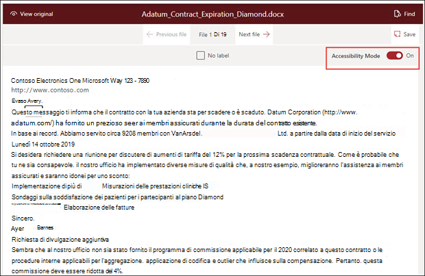
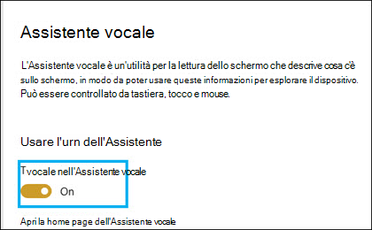

# Modalità di accessibilità Syntex di SharePointSharePoint Syntex accessibility mode

In [SharePoint Syntex,](index.md)gli utenti possono attivare la modalità accessibilità in tutte le fasi del training del modello (etichetta, formazione, test) quando si lavora con documenti di esempio.In [SharePoint Syntex](index.md), users can turn on accessibility mode in all stages of model training (label, train, test) when working with example documents. L'uso della modalità di accessibilità può aiutare gli utenti con problemi di vista a semplificare l'accessibilità tramite tastiera mentre si spostano e etichettano gli elementi nel visualizzatore di documenti.Using accessibility mode can help low-sight users to have easier keyboard accessibility as they navigate and label items in the document viewer.

Ciò consente agli utenti di usare le tastiere per spostarsi all'interno del testo nel visualizzatore di documenti e ascoltare un commento audio non solo sui valori selezionati, ma anche sulle azioni (ad esempio l'etichettatura o la rimozione di etichette dal testo selezionato) o sui valori previsti per le etichette mentre si forma il modello con altri documenti di esempio.This helps users to use their keyboards to navigate through text in the document viewer and to hear a narration of not only the selected values, but also of actions (such as labeling or removing labeling from selected text), or predicted label values as you train the model with additional example documents. 

## RequisitiRequirements

Per ascoltare l'audio del commento audio, assicurati di attivare [l'app](https://support.microsoft.com/windows/complete-guide-to-narrator-e4397a0d-ef4f-b386-d8ae-c172f109bdb1) Assistente vocale nelle impostazioni dell'Assistente vocale nel sistema Windows 10.To hear the audio of the narration, make sure to turn on the [Narrator App](https://support.microsoft.com/windows/complete-guide-to-narrator-e4397a0d-ef4f-b386-d8ae-c172f109bdb1) in your Narrator settings on your Windows 10 system.

## Etichettatura per gli utenti della tastieraLabeling for keyboard users

Per gli utenti che usano la modalità accessibilità, se stai etichettando il testo in un documento di esempio nel visualizzatore, puoi usare i tasti seguenti:For keyboard users using accessibility mode, if you are labeling text in an example document in the viewer, you can use the following keys:

- Tab: sposta l'utente in avanti e seleziona la parola successiva.Tab: Moves you forward and selects the next word.
- TAB + MAIUSC: consente di spostarsi all'indietro e selezionare la parola precedente.Tab + Shift: Moves you backwards and selects the previous word.
- Invio: etichetta o rimuove un'etichetta dalla parola selezionata.Enter: Label or removes a label from the selected word.
- Freccia avanti: consente di spostarsi in avanti tra i singoli caratteri di una parola selezionata.Forward arrow: Moves you forward through individual characters in a selected word.
- Freccia indietro: consente di spostarsi all'indietro tra i singoli caratteri di una parola selezionata.Backward arrow: Moves you backward through individual characters in a selected word.

> [!NOTE]
> Se si etichettano più parole per una singola etichetta, è necessario etichettare ogni parola.If you are labeling multiple words for a single label, you need to label each word.

## Commenti audioNarration

Per gli utenti dell'Assistente vocale che usano la modalità di accessibilità, usa lo stesso spostamento tramite tastiera descritto per consentire agli utenti della tastiera di passare attraverso il documento di esempio nel visualizzatore.For Narrator users using accessibility mode, use the same keyboard navigation described for keyboard users to go through the example document in the viewer.

Durante lo spostamento tra i documenti di esempio e i valori delle stringhe delle etichette, l'Assistente vocale offrirà all'utente le istruzioni audio seguenti:As you navigate through the sample documents and label string values, Narrator will give user the following audio prompts:

- Quando usi la tastiera per spostarsi all'interno del visualizzatore di documenti, l'audio dell'Assistente vocale segnalerà la stringa selezionata.When you use the keyboard to navigate through the document viewer, Narrator audio will state the selected string.
- All'interno di una stringa selezionata, l'audio dell'Assistente vocale segnalerà ogni carattere nella stringa mentre li selezionerai usando la freccia avanti o indietro.Within a selected string, Narrator audio will state each character in the string as you select them by using the forward or backward arrow.
- Se si seleziona una stringa etichettata, l'Assistente vocale indica il valore e quindi "etichetta".If you select a string that has been labeled, Narrator will state the value and then "labeled".  Ad esempio, se il valore dell'etichetta è "Contoso", verrà visualizzato lo stato "Costoso etichettato".For example, if the label value is "Contoso", it will state "Costoso labeled". 
- Nella scheda training, se si seleziona una stringa nel visualizzatore di documenti che è stata solo stimata, l'audio dell'Assistente vocale indica il valore e quindi "previsto".In the training tab, if you select a string in the document viewer that has only been predicted, Narrator audio will state the value, and then "predicted". Ciò si verifica quando il training prevede un valore nel file che non corrisponde a quello etichettato dall'utente.This occurs when training predicts a value in the file that does not match what has been labeled by the user.
- Nella scheda training, se si seleziona una stringa nel visualizzatore di documenti che è stata etichettata e stimata, l'audio dell'Assistente vocale indica il valore e quindi "etichettato e previsto".In the training tab, if you select a string in the document viewer that has been labeled and predicted, Narrator audio will state the value, and then "labeled and predicted". Ciò si verifica quando il training ha esito positivo ed esiste una corrispondenza tra un valore previsto e l'etichetta utente.This occurs when training is successful and there is a match between a predicted value and the user label.

Dopo l'etichetta di una stringa o la rimozione di un'etichetta nel visualizzatore, l'audio dell'Assistente vocale ti avvisa di salvare le modifiche prima di uscire.After a string is labeled or a label has been removed in the viewer, Narrator audio will warn you to save your changes before you exit.

## Vedere ancheSee Also

[Creare un estrattoreCreate an extractor](create-an-extractor.md) 

[Creare un classificatoreCreate a classifier](create-a-classifier.md) 

 

  
  

