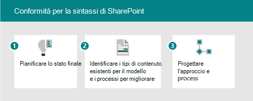

# Microsoft SharePoint Syntex adoption: Introduzione

Si pensi ai servizi di contenuto intelligente disponibili in SharePoint Syntex come a tre parti:

- **Informazioni sul contenuto:** Crea modelli di intelligenza artificiale senza codice per classificare ed estrarre informazioni dal contenuto per applicare automaticamente i metadati per l'individuazione e il riutilizzo delle conoscenze. Ulteriori informazioni sulla [comprensione del contenuto](document-understanding-overview.md).
- **Elaborazione del contenuto:** Automatizzare l'acquisizione, l'inserimento e la categorizzazione del contenuto e semplificare i processi incentrati sul contenuto Power Automate. Ulteriori informazioni [sull'elaborazione del contenuto](form-processing-overview.md).
- **Conformità del contenuto:** Controllare e gestire il contenuto per migliorare la sicurezza e la governance con l'integrazione in Microsoft Information Protection.

Con i nuovi servizi e funzionalità di IA, puoi creare app di comprensione e classificazione dei contenuti direttamente nel flusso di gestione dei contenuti usando SharePoint Syntex. Esistono due modi diversi per comprendere il contenuto. Il tipo di modello utilizzato si basa sul formato di file e sul caso di utilizzo:

| Elaborazione dei moduli | Analisi dei documenti |
|:-------|:-------|
| Creato dalla raccolta documenti. | Creato nel centro contenuti, parte di SharePoint Syntex. |
| Modello creato in Generatore di intelligenza artificiale. | Modello creato nell'interfaccia nativa. |
| Utilizzato per formati di file semistrutturati. | Utilizzato per formati di file non strutturati. |
| Classificatore impostabile. | Classificatore addestrabile con estrattori facoltativi. |
| Limitato a una singola raccolta. | Può essere applicato a più raccolte. |
| Training su formato PDF, JPG, PNG, totale 50 MB/500 pp. | Formazione su 5-10 file PDF, Office o di posta elettronica, inclusi gli esempi negativi. |

Per un confronto più completo delle funzionalità, vedere Differenza tra la comprensione dei documenti e i modelli [di elaborazione dei moduli.](difference-between-document-understanding-and-form-processing-model.md)

## Identificare gli scenari aziendali pilota da ottimizzare

Per preparare l'SharePoint Syntex nell'organizzazione, è innanzitutto necessario comprendere gli scenari in cui sarà utile. Il "perché" consente di determinare quale modello sarà necessario e come strutturare l'organizzazione in base a dove verrà applicato il modello. Ecco alcuni scenari in cui la comprensione dei documenti può aiutare l'organizzazione:

- **Elaborazione del contenuto:** Elaborare contratti, dichiarazioni di lavoro e altri documenti simili a moduli. Immettere i moduli, formare il modello per comprendere e mappare i campi ed eseguire i moduli per raccogliere automaticamente i dati. Per ulteriori informazioni, vedere [Panoramica dell'elaborazione dei moduli.](form-processing-overview.md)
- **Analisi delle fatture:** Estrarre i dettagli rilevanti dalle fatture e assicurarsi che siano conformi ai criteri o che vengano elaborati in modo appropriato.

Pensa ai modi in cui SharePoint Syntex può aiutare la tua organizzazione:

- Automatizzare i processi aziendali
- Migliorare l'accuratezza della ricerca
- Gestire i rischi di conformità

Quando si pensa agli scenari aziendali da considerare, porsi le domande seguenti:

- Risolve un problema reale?
- Sarà ampiamente usato o avrà un ampio impatto?
- È possibile ottenerlo?
- È possibile misurare il successo?

Definire le priorità degli scenari in base all'impatto e alla facilità di implementazione. Rendi l'area di attenzione iniziale scenari di maggiore impatto che possono essere implementati facilmente. De-prioritize lower impact scenarios that are hard to implement.

Usa gli [scenari di esempio e i casi](adoption-scenarios.md) d'uso per richiedere idee su come usare SharePoint Syntex nell'organizzazione.

## Identificare i ruoli & responsabilità

Determinare chi nell'organizzazione costruirà e gestirà i modelli? Potrebbero essere coinvolti i ruoli seguenti:

| SharePoint/Knowledge Admin | Amministratore di Power Platform | Responsabile delle conoscenze | Proprietario modello |
|:-------|:-------|:-------|:-------|
| Ruolo AAD| Ruolo AAD | Ruolo AAD | Promotori |
| Configurare l'elaborazione moduli | Configurare l'ambiente del servizio dati comune per l'elaborazione dei moduli | Raccogliere casi d'uso | Raccogliere casi d'uso aziendali |
| Gestire i centri contenuti e le autorizzazioni| Acquistare e allocare crediti AIB | Stabilire procedure consigliate ed esaminare l'analisi del modello | Creare e applicare modelli |

Il knowledge manager, il proprietario del processo aziendale e il proprietario del modello di contenuto creano modelli di esempio e adottano i campioni nell'organizzazione.
Altri che potrebbero essere coinvolti: amministratore della conformità, responsabili della tassonomia.

Dove verranno compilati e applicati i modelli? Esistono processi o archivi esistenti che possono essere migliorati?

- Elaborazione dei moduli: decidere quali siti riceveranno l'azione di elaborazione dei moduli.
- Informazioni sui documenti: è possibile creare più centri contenuti per aree aziendali diverse.

## Posizionamento strategico

Collaborare con gli stakeholder per assicurarsi che siano allineati sulla strategia per l'SharePoint Syntex. Ricercare e fornire le risorse seguenti per facilitare questo posizionamento:

- Risultati aziendali:
  - Potenziali risultati fiscali
  - Potenziali risultati di agilità
  - Modello di risultati aziendali
- Stakeholders/Exec sponsor buy-in/alignment
  - Business case deck
  - Modelli finanziari
  - Conformità aziendale - cultura

## Identificare le parti interessate

Identificare le parti interessate per il progetto.

|Ruolo |Responsabilità |Reparto |
|:-------|:-------|:--------|
| Sponsor esecutivi   | Comunicare la visione e i valori di alto livello all'azienda   |  Leadership esecutiva   |
| Project lead | Supervisionare l'intero processo di esecuzione e implementazione del lancio | Gestione dei progetti |
| Amministratori delle conoscenze| Creare e gestire i centri contenuti | IT o altro reparto|
| Responsabili del contenuto e proprietari dei modelli| Raccogliere casi d'uso e creare e applicare modelli | Tutti i reparti|
| Promotori | Aiutare a migliorare e a gestire le obiezioni | Tutti i reparti (personale) |
| Amministratore tenant | Configurare le impostazioni di livello tenant | Reparto IT|
| Amministratore di Power Platform| Configurare l'ambiente dei servizi dati comuni | Reparto IT|

> [!Note]
> Anche se è consigliabile che ognuno di questi ruoli venga evaso durante l'implementazione, è possibile che non sia necessario che tutti questi ruoli inizino a usare la soluzione identificata.

## Elenco di controllo per la preparazione

Per prepararti per l'implementazione SharePoint Syntex, devi:

1. Pianificare lo stato finale
    - I modelli di comprensione dei documenti sono il mezzo, non la fine.
    - Pianificare l'utilizzo del valore dei metadati estratti con:
      - Ricerca
      - Formattazione di filtri e visualizzazione
      - Conformità
      - Automazione
2. Identificazione
    - Comprendere l'architettura delle informazioni esistente e l'utilizzo delle funzionalità di gestione del contenuto.
    - I tipi di contenuto esistenti sono candidati validi per i modelli?
    - Quali processi esistenti verrebbero migliorati dai metadati?
3. Struttura
    - Progettare l'approccio all'architettura delle informazioni, ai metadati gestiti e ai tipi di contenuto
    - Progettare il processo per la definizione, la creazione, la gestione.

## Coinvolgere l'organizzazione

1. Identificare i titolari della posta in gioco, confermare gli scenari e sviluppare un piano di progetto.
1. Configurare le impostazioni e applicare le licenze.
1. Iniziare la sensibilizzazione e la formazione: reclutare i campioni.
1. Implementazione in fasi.  
1. Raccogliere feedback e iterazione.
1. Man mano che l'utilizzo aumenta, viene pianificata una pianificazione per tutti i crediti di Generatore di intelligenza artificiale in base alle esigenze.

## Vedere anche

[Scenari e casi d'uso per SharePoint Syntex](adoption-scenarios.md)