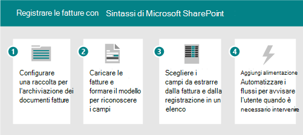
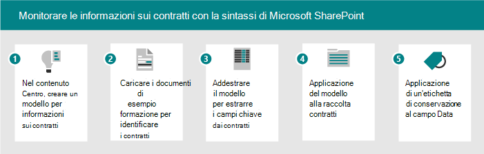

# Adozione di Microsoft SharePoint Syntex: introduzione

Si pensi ai servizi contenuti intelligenti disponibili in SharePoint Syntex come aventi tre parti:

- **Content Understanding:** create No-code ai Models per classificare ed estrarre le informazioni dal contenuto per applicare automaticamente i metadati per il riutilizzo e l'individuazione delle conoscenze. Per ulteriori informazioni, vedere [Content Understanding](document-understanding-overview.md).
- **Elaborazione del contenuto:** Automatizzare l'acquisizione, l'ingestione e la categorizzazione del contenuto e semplificare i processi incentrati sul contenuto utilizzando Power automatizzate. Per ulteriori informazioni, vedere [elaborazione del contenuto](form-processing-overview.md).
- **Conformità del contenuto:** Controllare e gestire il contenuto per migliorare la sicurezza e la governance con l'integrazione di Microsoft Information Protection.

Con i nuovi servizi e le funzionalità AI, è possibile creare le applicazioni di classificazione e comprensione del contenuto direttamente nel flusso di gestione del contenuto tramite SharePoint Syntex:

|Immissione manuale| Elaborazione dei moduli | Informazioni sul documento |
|:-------|:--------|:--------|
| Immissione di dati e utilizzo intensivo su qualsiasi contenuto | Elaborazione del contenuto digitale-foto, scansioni, ricevute, biglietti da visita, video con OCR & Text |  Acquisizione di tipi di contenuto e metadati da contratti, ripristini e altri documenti strutturati |
| Interattiva   | Precompilata, automatizzata   | Personalizzato, assistito   | Personalizzato, conforme |
| Persone che operano | Insegnate dagli esperti del soggetto (PMI). Acquisizione di tipi di contenuto e metadati da contratti, riprendementi, altri documenti non strutturati. | Le PMI sono meno implicate. da ordini di acquisto, applicazioni, altri documenti semistrutturati e strutturati |

Nella tabella seguente vengono illustrate le operazioni che vengono eseguite quando si utilizza SharePoint Syntex:

| Elaborazione dei moduli | Informazioni sul documento |
|:-------|:-------|
| Disponibile in APAC, Australia, Canada, EU, JP, LATAt, UK, US | Disponibile in tutte le aree geografiche |
| Utilizza i crediti Builder AI-1M Credits = 2000 pagine; Il consumo è di circa 2000 fatture = 2 unità. La potenza automatizzata è obbligatoria: se si ha bisogno di altro è possibile aggiungerla. 1M crediti assegnati per 300 + licenze acquistate. È inoltre possibile acquistare crediti separatamente. | I modelli funzionano su tutte le lingue dell'alfabeto latino. Oltre all'inglese: tedesco, svedese, francese, spagnolo, italiano e portoghese. |
| Provisioning rispetto all'ambiente predefinito del servizio dati comune| Non dispone di restrizioni relative alla capacità. |

Esistono due modi diversi per comprendere il contenuto. Il tipo di modello utilizzato è basato sul formato di file e sul caso di utilizzo:

| Elaborazione dei moduli | Informazioni sul documento |
|:-------|:-------|
| Creato da raccolta documenti | Creato in Content Center, parte di SharePoint Syntex |
| Modello creato in AI Builder | Modello creato nell'interfaccia nativa |
| Utilizzato per i formati di file semistrutturati | Utilizzato per i formati di file non strutturati |
| Classificatore impostabile | Classificatore addestrabile con estrattori opzionali |
| Limitata a una singola raccolta | Può essere applicato a più raccolte |
| Treno in formato PDF, JPG, PNG, totale 50 MB/500 PP | Treno su 5-10 file PDF, Office o di posta elettronica, inclusi gli esempi negativi |

SharePoint Syntex si integra con le funzionalità di conformità di Microsoft 365 come:

- Etichette di conservazione che definiscono i criteri dei record in base all'età del documento o agli eventi esterni.
- Etichette di riservatezza che configurano i criteri DLP, crittografia, condivisione e accesso condizionale.

Gli utenti possono applicare etichette oppure possono essere applicati automaticamente dai modelli di Syntex AI di SharePoint. Analisi e piani di file offrono la gestione in scala di criteri e utilizzo delle etichette.

## Identificare gli scenari di business pilota da ottimizzare

Per preparare l'utilizzo di SharePoint Syntex nell'organizzazione, è innanzitutto necessario comprendere gli scenari in cui sarà utile. Il perché aiuta a determinare quale modello sarà necessario e come strutturare l'organizzazione in base alla posizione in cui verrà applicato il modello. Di seguito sono illustrati alcuni scenari in cui la comprensione dei documenti può aiutare l'organizzazione:

- Elaborazione del contenuto: contratti di processo, istruzioni di lavoro e altri documenti simili a moduli. Assunzione dei moduli, formazione del modello per la comprensione e la mappatura dei campi, quindi eseguire i moduli fino a raccolta automatica dei dati. Per ulteriori informazioni, vedere [Cenni preliminari sull'elaborazione dei moduli](form-processing-overview.md).
- Analisi delle fatture: estrarre i dettagli rilevanti dalle fatture e verificare che siano conformi ai criteri o che siano stati elaborati in modo appropriato.

Si pensi ai modi in cui SharePoint Syntex può aiutare l'organizzazione:

- Automatizzare i processi aziendali
- Migliorare l'accuratezza della ricerca
- Gestire i rischi di conformità

### Esempio di scenario di elaborazione dei moduli

Ad esempio, è possibile configurare un processo utilizzando le caratteristiche di SharePoint Syntex e Power automatizzate per monitorare e monitorare le fatture.

1. Impostare una raccolta per l'archiviazione dei documenti della fattura.
1. Addestrare il modello a riconoscere i campi nei documenti.
1. Estrarre i campi che si desidera registrare in un elenco.
1. Impostare un flusso per notificare gli eventi specifici, ad esempio:
    - Viene aggiunta una nuova fattura.
    - Una fattura ha superato la data di scadenza.
    - Una fattura è relativa a un importo maggiore di quello di approvazione automatico.

Quando si automatizza questo scenario, è possibile:

- Consente di risparmiare tempo e denaro estraendo automaticamente i dati dalle fatture anziché manualmente.
- Ridurre i possibili errori e garantire una maggiore conformità utilizzando i flussi di lavoro per agire sulle fatture e notificare eventuali problemi.

### Esempio di scenario per la comprensione del documento

Come altro esempio, è possibile configurare un processo per identificare i contratti che la società ha con altre società o singoli individui. È possibile configurare un modello per estrarre informazioni chiave da tali contratti, ad esempio il nome del client, le tariffe, le date o altre informazioni importanti e aggiungerle alla raccolta come campi che è possibile visualizzare rapidamente. È possibile applicare un'etichetta di conservazione nella raccolta documenti per garantire che i contratti non possano essere eliminati prima di un periodo di tempo specifico per la conformità con le normative aziendali.

1. Avviare il centro contenuto e creare un nuovo modello di informazioni per i contratti.
1. Caricare i documenti di esempio per gli esempi positivi e negativi, quindi eseguire il training per identificare i documenti del contratto ed esaminare i risultati.
1. Addestrare l'estrattore per identificare i campi nei contratti, ad esempio il nome del client, la quota e la data, quindi testare l'estrattore.
1. Al termine del modello, applicare il modello a una raccolta in cui è possibile caricare i contratti.
1. Applicare un'etichetta di conservazione al campo data, in modo che i contratti vengano conservati nella raccolta per il periodo di tempo richiesto dall'organizzazione per i contratti.

Quando si automatizza questo scenario, è possibile:

- Consente di risparmiare tempo e denaro estraendo automaticamente i dati dai contratti invece di eseguirli manualmente.
- Garantire una maggiore conformità mediante l'utilizzo delle etichette di conservazione per garantire che i contratti vengano mantenuti in modo appropriato.

### Suggerimenti per l'identificazione degli scenari

Quando si pensa agli scenari aziendali da prendere in considerazione, porsi le domande seguenti:

- Risolve un problema reale?
- Sarà ampiamente utilizzato o avrà un impatto generale?
- È ottenibile?
- È possibile misurare il successo?

Definire la priorità degli scenari basati sull'impatto e sulla facilità di implementazione. Rendere gli scenari di impatto più alti dell'area di interesse iniziale che possono essere implementati facilmente. De-assegnare la priorità agli scenari di impatto più bassi che sono difficili da implementare.

## Identificare i ruoli & responsabilità

Determinare gli utenti dell'organizzazione che compilano e gestiscono i modelli. Potrebbero essere coinvolti i ruoli seguenti:

| SharePoint/Knowledge admin | Amministratore della piattaforma di alimentazione | Knowledge Manager | Proprietario del modello |
|:-------|:-------|:-------|:-------|
| Ruolo AAD| Aggiungi ruolo | Ruolo AAD | Promotori |
| Configurare l'elaborazione moduli | Configurare l'ambiente del servizio dati comune per l'elaborazione dei moduli | Raccogliere i casi di utilizzo | Raccogliere i casi di utilizzo aziendale |
| Gestire i centri di contenuto e le autorizzazioni| Acquistare e assegnare crediti AIB | Definire le procedure consigliate e controllare l'analisi del modello | Creare e applicare modelli |

Knowledge Manager, proprietario del processo aziendale e proprietario del modello di contenuto creare modelli di esempio e adozione di campioni nell'organizzazione.
Altre persone che possono essere coinvolte: amministratori della conformità, responsabili della tassonomia.

Dove potranno creare e applicare i modelli? Esistono processi o repository esistenti che possono essere migliorati?

- Elaborazione dei moduli: decidere quali siti otterrà un'azione di elaborazione dei moduli.
- Informazioni sui documenti: è possibile creare più centri di contenuto per aree business diverse.

## Posizionamento strategico

Collaborare con gli stakeholder per assicurarsi che siano allineati alla strategia per l'utilizzo di SharePoint Syntex. Ricercare e fornire le risorse seguenti per facilitare questo posizionamento:

- Risultati aziendali:
  - Potenziali risultati fiscali
  - Potenziali risultati di agilità
  - Modello di esito aziendale
- Parti interessate/sponsor Exec buy-in/Alignment
  - Deck di business case
  - Modelli finanziari
  - Preparazione della società-impostazioni cultura

## Identificare le parti interessate

Identificare le parti interessate per il progetto.

|Ruolo |Responsabilità |Reparto |
|:-------|:-------|:--------|
| Sponsor esecutivo (s)   | Comunicare la visione e i valori di alto livello all'azienda   |  Leadership esecutiva   |
| Lead del progetto | Sovrintendere all'intero processo di esecuzione e implementazione del lancio | Gestione dei progetti |
| Amministratori della Knowledge base| Creare e gestire i centri di contenuto | Reparto IT o altro|
| Gestori del contenuto e proprietari dei modelli| Raccogliere i casi di utilizzo e creare e applicare modelli | Qualsiasi reparto|
| Promotori | Contribuire a evangelizzare e gestire la gestione delle obiezioni | Qualsiasi reparto (personale) |
| Amministratore tenant | Configurare le impostazioni a livello di tenant | Reparto IT|
| Amministratore di Power Platform| Configurare l'ambiente dei servizi dati comuni | Reparto IT|

> [!Note]
> Se si consiglia di soddisfare tutti questi ruoli durante l'implementazione, è possibile che non siano necessari tutti per iniziare a utilizzare la soluzione identificata.

## Elenco di controllo di conformità

Per prepararsi per l'implementazione di Syntex di SharePoint, è necessario eseguire le operazioni seguenti:

1. Pianificare lo stato finale
    - I modelli di comprensione dei documenti sono i mezzi, non la fine.
    - Pianificare la sfruttamento del valore dei metadati estratti con:
      - Ricerca
      - Filtro e visualizzazione della formattazione
      - Conformità
      - Automazione
2. Identificazione
    - Comprendere l'architettura delle informazioni esistente e l'utilizzo delle funzionalità di gestione del contenuto.
    - I tipi di contenuto esistenti sono validi per i modelli?
    - Quali processi esistenti verrebbero migliorati dai metadati?
3. Design
    - Progettare l'approccio all'architettura delle informazioni, ai metadati gestiti e ai tipi di contenuto
    - Progettare il processo per la definizione, la creazione e la gestione.

## Coinvolgere la propria organizzazione

1. Identificare i titolari di posta indesiderata, confermare gli scenari e sviluppare il piano di progetto.
1. Configurare le impostazioni e applicare le licenze.
1. Avviare la consapevolezza e la formazione – reclutare campioni.
1. Eseguire la distribuzione in fasi.  
1. Raccogliere commenti e suggerimenti e iterare.
1. Man mano che l'utilizzo aumenta il piano per i crediti dei Builder AI in base alle esigenze.
