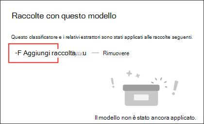
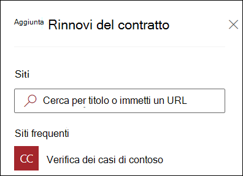
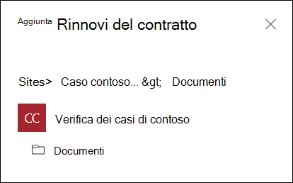
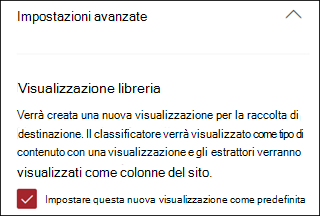
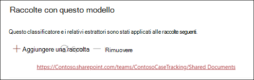
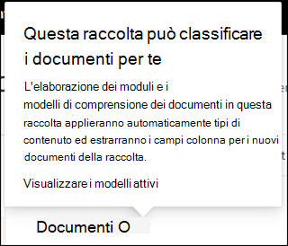
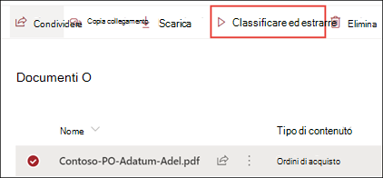

# Applicare un modello di analisi dei documenti in Microsoft SharePoint Syntex.Apply a document understanding model in Microsoft SharePoint Syntex

 

> [!VIDEO https://www.microsoft.com/videoplayer/embed/RE4CSoL]

 

Dopo aver pubblicato il modello di analisi dei documenti, è possibile applicarlo a una o più raccolte documenti di SharePoint nel tenant di Microsoft 365.After publishing your document understanding model, you can apply it to one or more SharePoint document library in your Microsoft 365 tenant.

> [!NOTE]
> È possibile applicare il modello solo alle raccolte documenti a cui si ha accesso.You are only able to apply the model to document libraries that you have access to.

## Applicare il modello a una raccolta documenti.Apply your model to a document library.

Per applicare il modello a una raccolta documenti di SharePoint:To apply your model to to a SharePoint document library:

1. Nella home page del modello, nel riquadro **Applica modello alle raccolte**, selezionare **Pubblica modello**.On model home page, on the **Apply model to libraries** tile, select **Publish model**. In alternativa, è possibile selezionare **+Aggiungi raccolta** nella sezione **Raccolte con questo modello**.Or you can select  **+Add Library** in the **Libraries with this model** section.  

     

2. È possibile selezionare il sito di SharePoint che contiene la raccolta a cui si vuole applicare il modello.You can then select the SharePoint site that contains the document library that you want to apply the model to. Se il sito non viene visualizzato nell'elenco, usare la casella di ricerca per trovarlo.If the site does not show in the list, use the search box to find it. 

     

    > [!NOTE]
    > È necessario disporre delle autorizzazioni di *Gestione dell'elenco* o dei diritti di *modifica* per la raccolta documenti a cui si sta applicando il modello.You must have *Manage List* permissions or *Edit* rights to the document library you are applying the model to. 

3. Dopo aver selezionato il sito, selezionare la raccolta in cui si vuole applicare il modello.After selecting the site, select the document library to which you want to apply the model. Nell'esempio selezionare la raccolta documenti *Documenti* dal sito *Rilevamento casi di Contoso*.In the sample, select the *Documents* document library from the *Contoso Case Tracking* site. 

     

4. Poiché il modello è associato a un tipo di contenuto, quando viene applicato alla raccolta aggiungerà il tipo di contenuto e la relativa visualizzazione con le etichette estratte come colonne.Since the model is associated to a content type, when you apply it to the library it will add the content type and its view with the labels you extracted showing as columns. Questa è la visualizzazione predefinita della raccolta per impostazione predefinita, ma è possibile scegliere facoltativamente di non impostarla come visualizzazione predefinita selezionando **Impostazioni avanzate** e deselezionando **Imposta questa nuova visualizzazione come predefinita**.This view is the library's default view by default, but you can optionally choose to not have it be the default view by selecting **Advanced settings** and deselecting **Set this new view as default**. 

     

5. Selezionare **Aggiungi** per applicare il modello alla raccolta.Select **Add** to apply the model to the library. 
6. Nella home page del modello, nella sezione **Raccolte con questo modello**, dovrebbe essere visualizzato l'URL del sito di SharePoint elencato.On the model home page, in the **Libraries with this model** section, you should see the URL to the SharePoint site listed. 

     

7. Passare alla tua raccolta documenti e assicurarsi di essere nella visualizzazione raccolta documenti del modello.Go to your document library and make sure you are in the model's document library view. Se si seleziona il pulsante informazioni accanto al nome della raccolta documenti, viene visualizzato un messaggio che informa che il modello è stato applicato alla raccolta documenti.Notice that if you select the information button next to the document library name, a message notes that your model has been applied to the document library.

      

Dopo aver applicato il modello nella raccolta documenti, è possibile iniziare a caricare documenti nel sito e visualizzare i risultati.After applying the model to the document library, you can begin uploading documents to the site and see the results.

Il modello identifica i file con tipo di contenuto associato al modello e li elenca nella visualizzazione.The model identifies any files with model’s associated content type and lists them in your view. Se il modello è dotato di estrattori, nella visualizzazione verranno mostrate le colonne dei dati da estrarre da ogni file.If your model has any extractors, the view displays columns for the data you are extracting from each file.

### Applicare il modello ai file già presenti nella raccolta documentiApply the model to files already in the document library

Anche se un modello applicato elabora tutti i file caricati nella raccolta documenti dopo l'applicazione, è possibile eseguire le operazioni seguenti per eseguire il modello sui file già esistenti nella raccolta documenti prima di applicare il modello:While an applied model processes all files uploaded to the document library after it is applied, you can also do the following to run the model on files that already exists in the document library prior to the model being applied:

1. Nella raccolta documenti selezionare i file che si vuole far elaborare dal modello.In your document library, select the files that you want to be processed by your model.
2. Dopo aver selezionato i file, **Classifica ed estrai** verrà visualizzati nella barra multifunzione della raccolta documenti.After selecting your files, **Classify and extract** will appear in the document library ribbon. Selezionare **Classifica ed estrai**.Select **Classify and extract**.
3. I file selezionati verranno aggiunti alla coda per essere elaborati.The files you selected will be added to the queue to be processed.

        

## Vedere ancheSee Also
[Creare un classificatoreCreate a classifier](create-a-classifier.md)

[Creare un estrattoreCreate an extractor](create-an-extractor.md)

[Panoramica dell'analisi dei documentiDocument Understanding overview](document-understanding-overview.md)

[Creare un modello di elaborazione moduliCreate a form processing model](create-a-form-processing-model.md)  
