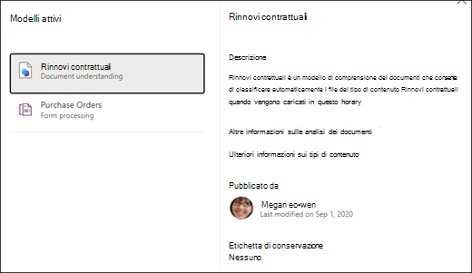

# Applicare un modello di analisi dei documenti in Microsoft SharePoint Syntex.

 

> [!VIDEO https://www.microsoft.com/videoplayer/embed/RE4CSoL]

 

Dopo aver pubblicato il modello di analisi dei documenti, è possibile applicarlo a una o più raccolte documenti di SharePoint nel tenant di Microsoft 365.

> [!NOTE]
> È possibile applicare il modello solo alle raccolte documenti a cui si ha accesso.

## Applicare il modello a una raccolta documenti.

Per applicare il modello a una raccolta documenti di SharePoint:

1. Nella home page del modello, nel riquadro **Applica modello alle raccolte**, selezionare **Pubblica modello**. In alternativa, è possibile selezionare **+Aggiungi raccolta** nella sezione **Raccolte con questo modello**.  

     

2. È possibile selezionare il sito di SharePoint che contiene la raccolta a cui si vuole applicare il modello. Se il sito non viene visualizzato nell'elenco, usare la casella di ricerca per trovarlo. 

     

    > [!NOTE]
    > È necessario disporre delle autorizzazioni di *Gestione dell'elenco* o dei diritti di *modifica* per la raccolta documenti a cui si sta applicando il modello. 

3. Dopo aver selezionato il sito, selezionare la raccolta in cui si vuole applicare il modello. Nell'esempio selezionare la raccolta documenti *Documenti* dal sito *Rilevamento casi di Contoso*. 

     

4. Poiché il modello è associato a un tipo di contenuto, quando viene applicato alla raccolta aggiungerà il tipo di contenuto e la relativa visualizzazione con le etichette estratte come colonne. Questa è la visualizzazione predefinita della raccolta per impostazione predefinita, ma è possibile scegliere facoltativamente di non impostarla come visualizzazione predefinita selezionando **Impostazioni avanzate** e deselezionando **Imposta questa nuova visualizzazione come predefinita**. 

     

5. Selezionare **Aggiungi** per applicare il modello alla raccolta. 
6. Nella home page del modello, nella sezione **Raccolte con questo modello**, dovrebbe essere visualizzato l'URL del sito di SharePoint elencato. 

     

7. Passare alla tua raccolta documenti e assicurarsi di essere nella visualizzazione raccolta documenti del modello. Se si seleziona il pulsante informazioni accanto al nome della raccolta documenti, viene visualizzato un messaggio che informa che un modello è stato applicato alla raccolta documenti.

      

    È possibile selezionare **Visualizza modelli attivi** per visualizzare i dettagli di tutti i modelli applicati alla raccolta documenti.

8. Nel riquadro **Modelli attivi** è possibile visualizzare i modelli applicati alla raccolta documenti. Selezionare un modello per visualizzare altri dettagli, ad esempio una descrizione del modello, chi lo ha pubblicato e se il modello applica un'etichetta di conservazione ai file che classifica.

      

Dopo aver applicato il modello nella raccolta documenti, è possibile iniziare a caricare documenti nel sito e visualizzare i risultati.

Il modello identifica i file con tipo di contenuto associato al modello e li elenca nella visualizzazione. Se il modello è dotato di estrattori, nella visualizzazione verranno mostrate le colonne dei dati da estrarre da ogni file.

### Applicare il modello ai file già presenti nella raccolta documenti

Anche se un modello applicato elabora tutti i file caricati nella raccolta documenti dopo l'applicazione, è possibile eseguire le operazioni seguenti per eseguire il modello sui file già esistenti nella raccolta documenti prima di applicare il modello:

1. Nella raccolta documenti selezionare i file che si vuole far elaborare dal modello.
2. Dopo aver selezionato i file, **Classifica ed estrai** verrà visualizzati nella barra multifunzione della raccolta documenti. Selezionare **Classifica ed estrai**.
3. I file selezionati verranno aggiunti alla coda per essere elaborati.

        

> [!NOTE]
> È possibile copiare file singoli in una raccolta e applicarli a un modello, ma non è possibile eseguire la stessa operazione con le cartelle.

### Il campo Data di classificazione

Quando a una raccolta documenti viene applicato un modello di analisi dei documenti o di elaborazione moduli di SharePoint Syntex, nello schema della raccolta viene incluso un campo <b>Data di classificazione</b>. Per impostazione predefinita, questo campo è vuoto, ma quando i documenti vengono elaborati e classificati da un modello, questo campo viene aggiornato con un indicatore di data e ora di completamento. 

     

Il campo Data di classificazione viene usato dal trigger [<b>Quando un file viene classificato da un modello di comprensione dei contenuti</b>](/connectors/sharepointonline/#when-a-file-is-classified-by-a-content-understanding-model) per eseguire un flusso di Power Automate dopo che un modello di comprensione dei contenuti Syntex ha completato l'elaborazione di un file e aggiornato il campo "Data di classificazione".

    

Il trigger <b>Quando un file viene classificato da un modello di comprensione dei contenuti</b> può quindi essere usato per avviare un altro flusso di lavoro usando qualsiasi informazione estratta dal file.

## Vedere anche
[Creare un classificatore](create-a-classifier.md)

[Creare un estrattore](create-an-extractor.md)

[Panoramica sull'analisi dei documenti](document-understanding-overview.md)
