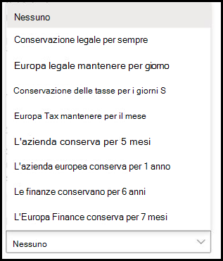

# Applicazione di un'etichetta di conservazione a un modello di comprensione del documentoApply a retention label to a document understanding model

 

> [!VIDEO https://www.microsoft.com/videoplayer/embed/RE4CSoL]

 

È possibile applicare facilmente un' [etichetta di conservazione](https://docs.microsoft.com/microsoft-365/compliance/retention) a un modello di comprensione del documento in Microsoft SharePoint Syntex.You can easily apply a [retention label](https://docs.microsoft.com/microsoft-365/compliance/retention) to a document understanding model in Microsoft SharePoint Syntex.

Le etichette di conservazione consentono di applicare le impostazioni di conservazione ai documenti identificati dai modelli.Retention labels let you apply retention settings to the documents that your document understanding models identify.  Ad esempio, si desidera che il modello non identifichi solo i documenti di *avviso di assicurazione* caricati nella raccolta documenti, ma applichi anche un tag di conservazione *aziendale* in modo che tali documenti non possano essere eliminati dalla raccolta documenti per il periodo di tempo specificato (ad esempio, i prossimi cinque mesi).For example, you want your model to not only identify any *Insurance notice* documents that are uploaded to your document library, but to also apply a *Business* retention tag to them so that these documents cannot be deleted from the document library for the specified time period (the next five months, for example).

È possibile applicare un'etichetta di conservazione preesistente al modello di comprensione dei documenti tramite le impostazioni del modello nella Home page del modello.You can apply a pre-existing retention label to your document understanding model through your model settings on your model's home page. 

> [!Important]
> Affinché le etichette di conservazione siano disponibili per essere applicate al modello di comprensione del contenuto, è necessario [crearle e pubblicarle nel centro conformità di Microsoft 365](https://docs.microsoft.com/microsoft-365/compliance/create-apply-retention-labels#how-to-create-and-publish-retention-labels).For retention labels to be available to apply to your content understanding model, they need to be [created and published in the Microsoft 365 Compliance Center](https://docs.microsoft.com/microsoft-365/compliance/create-apply-retention-labels#how-to-create-and-publish-retention-labels).

## Per aggiungere un'etichetta di conservazione a un modello di comprensione del documentoTo add a retention label to a document understanding model

1. Nella Home page del modello selezionare **Impostazioni modello**.From the model home page, select **Model settings**. 
2. Nelle **impostazioni del modello**, nella sezione **sicurezza e conformità** , selezionare il menu **etichetta di conservazione** per visualizzare un elenco delle etichette di conservazione disponibili per il modello da applicare.In **Model settings**, in the **Security and compliance** section, select the **Retention label** menu to see a list of retention labels that are available for your to apply to the model. 
   
3. Selezionare l'etichetta di conservazione che si desidera applicare al modello e quindi fare clic su **Salva**.Select the retention label you want to apply to the model, and then select **Save**. 

Dopo aver applicato l'etichetta di conservazione al modello, è possibile applicarla a una delle seguenti operazioni:After applying the retention label to your model, you are able to apply it to a:
- Nuova raccolta documentiNew document library
- Raccolta documenti a cui è già applicato il modelloDocument library to which the model is already applied
 
## Applicare l'etichetta di conservazione a una raccolta documenti a cui è già applicato il modelloApply the retention label to a document library to which the model is already applied

Se il modello di conoscenza del documento è già stato applicato a una raccolta documenti, è possibile eseguire le operazioni seguenti per sincronizzare l'aggiornamento dell'etichetta di conservazione per applicarlo alla raccolta documenti:If your document understanding model has already been applied to a document library, you can do the following to sync your retention label update to apply it to the document library: 

1. Nella sezione **raccolte con questo modello** della Home page del modello selezionare la raccolta documenti in cui si desidera applicare l'aggiornamento per l'etichetta di conservazione.On your model home page, in the **Libraries with this model** section, select the document library to which you want to apply the retention label update.   
2. Selezionare **Sincronizza**.Select **Sync**.  
   

Dopo aver applicato l'aggiornamento e averla sincronizzata con il modello, è possibile verificare che sia stata applicata eseguendo le operazioni seguenti:After applying the update and syncing it to your model, you can confirm that it has been applied by doing the following:

1. Nel centro contenuto, nella sezione **raccolte con questo modello** , fare clic sulla raccolta a cui è stato applicato il modello aggiornato.In the content center, in the **Libraries with this model** section, click on the library to which your updated model was applied.  
2. Nella visualizzazione raccolta documenti selezionare l'icona informazioni per controllare le proprietà del modello.In your document library view, select the information icon to check the model properties.   
3. Nell'elenco **modelli attivi** selezionare il modello aggiornato.In the **Active models** list, select your updated model. 
4. Nella sezione **etichetta di conservazione** verrà visualizzato il nome dell'etichetta di conservazione applicata.In the **Retention label** section you will see the name of the applied retention label. 

Nella pagina visualizzazione del modello nella raccolta documenti verrà visualizzata una nuova colonna di **etichette di conservazione** .On your model's view page in your document library, a new **Retention label** column will display.  Poiché il modello classifica i file identificati come appartenenti al tipo di contenuto e li elenca nella visualizzazione libreria, nella colonna etichetta di conservazione verrà visualizzato anche il nome dell'etichetta di conservazione applicata tramite il modello.As your model classifies files it identifies as belonging to it's content type and lists them in the library view, the Retention label column will also display the name of the retention label that has been applied to it through the model.

Ad esempio, tutti i documenti di *avviso di assicurazione* che il modello identifica avrà anche l'etichetta di conservazione dell' *azienda* applicata, impedendo che vengano eliminati dalla raccolta documenti per cinque mesi.For example, all *Insurance notice* documents that your model identifies will also have the *Business* retention label applied to them, preventing them from being deleted from the document library for five months. Se si tenta di eliminare il file dalla raccolta documenti, verrà visualizzato un messaggio di errore che indica che non è consentito a causa dell'etichetta di conservazione applicata.If an attempt is made to delete the file from the document library, an error will display saying it is not allowed because of the applied retention label.

## Vedere ancheSee Also
[Creare un classificatoreCreate a classifier](create-a-classifier.md) 
[Creare un estrattoreCreate an extractor](create-an-extractor.md) 
[Panoramica della comprensione del documentoDocument Understanding overview](document-understanding-overview.md) 
[Creare un modello di elaborazione dei moduliCreate a form processing model](create-a-form-processing-model.md)  
