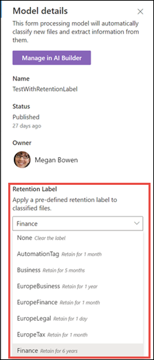

# Applicare un'etichetta di conservazione a un modello in SharePoint SyntexApply a retention label to a model in SharePoint Syntex

 

> [!VIDEO https://www.microsoft.com/videoplayer/embed/RE4GydO]  

 

Applicare un'[etichetta di conservazione](https://docs.microsoft.com/microsoft-365/compliance/retention) a un modello in Microsoft SharePoint Syntex è molto semplice.You can easily apply a [retention label](https://docs.microsoft.com/microsoft-365/compliance/retention) to a model in Microsoft SharePoint Syntex. È possibile farlo sia per i modelli di analisi dei documenti, sia per i modelli di elaborazione dei moduli.You can do this for both document understanding and form processing models.

Le etichette di conservazione permettono di applicare impostazioni di conservazione ai documenti identificati dai modelli.Retention labels let you apply retention settings to the documents that your models identify.  Ad esempio, si può fare modo che il modello non solo identifichi i documenti di tipo *Contratto di assicurazione* caricati in una raccolta documenti, ma anche che applichi l'etichetta di conservazione *Business*, in modo che non sia possibile eliminare questi documenti dalla raccolta per il periodo di tempo specificato, ad esempio i cinque mesi successivi.For example, you want your model to not only identify any *Insurance notice* documents that are uploaded to your document library, but to also apply a *Business* retention tag to them so that these documents cannot be deleted from the document library for the specified time period (the next five months, for example).

Si può applicare al modello un'etichetta di conservazione preesistente, usando le impostazioni del modello nella home page del modello.You can apply a pre-existing retention label to your model through your model settings on your model's home page. 

> [!Important]
> Affinché siano disponibili etichette di conservazione da applicare ai modelli di analisi dei documenti, occorre [crearle e pubblicarle nel Centro conformità Microsoft 365](https://docs.microsoft.com/microsoft-365/compliance/create-apply-retention-labels#how-to-create-and-publish-retention-labels).For retention labels to be available to apply to your document understanding models, they need to be [created and published in the Microsoft 365 Compliance Center](https://docs.microsoft.com/microsoft-365/compliance/create-apply-retention-labels#how-to-create-and-publish-retention-labels).

## Per aggiungere un'etichetta di conservazione a un modello di analisi dei documentiTo add a retention label to a document understanding model

1. Nella home page del modello selezionare **Impostazioni modello**.From the model home page, select **Model settings**. 
2. In **Impostazioni modello** selezionare il menu **Etichetta di conservazione** nella sezione **Sicurezza e conformità** per visualizzare un elenco delle etichette di conservazione disponibili per il modello.In **Model settings**, in the **Security and compliance** section, select the **Retention label** menu to see a list of retention labels that are available for your to apply to the model. 
   
3. Selezionare l'etichetta di conservazione da applicare al modello e scegliere **Salva**.Select the retention label you want to apply to the model, and then select **Save**. 

Dopo aver applicato l'etichetta conservazione al modello, è possibile applicarla:After applying the retention label to your model, you are able to apply it to a:
- A una nuova raccolta documentiNew document library
- A una raccolta documenti a cui è già applicato il modelloDocument library to which the model is already applied
 
## Applicare l'etichetta conservazione a una raccolta documenti a cui è già applicato il modelloApply the retention label to a document library to which the model is already applied

Se il modello di analisi dei documenti è già stato applicato a una raccolta documenti, è possibile procedere come segue per sincronizzare l'aggiornamento dell'etichetta di conservazione e applicarlo alla raccolta documenti:If your document understanding model has already been applied to a document library, you can do the following to sync your retention label update to apply it to the document library: 

1. Nella home page del modello selezionare la raccolta documenti alla quale si vuole applicare l'aggiornamento dell'etichetta di conservazione nella sezione **Raccolte con questo modello**.On your model home page, in the **Libraries with this model** section, select the document library to which you want to apply the retention label update.   
2. Selezionare **Sincronizza**.Select **Sync**.  
   

Dopo aver applicato l'aggiornamento e averlo sincronizzato con il modello, è possibile verificare che sia stato applicato eseguendo le operazioni seguenti:After applying the update and syncing it to your model, you can confirm that it has been applied by doing the following:

1. Nella sezione **Raccolte con questo modello** del centro contenuti fare clic sulla raccolta a cui è stato applicato il modello aggiornato.In the content center, in the **Libraries with this model** section, click on the library to which your updated model was applied.  
2. Nella visualizzazione Raccolta documenti selezionare l'icona informazioni per controllare le proprietà del modello.In your document library view, select the information icon to check the model properties.   
3. Selezionare il modello aggiornato nell'elenco **Modelli attivi**.In the **Active models** list, select your updated model. 
4. Nella sezione **Etichetta di conservazione** sarà visualizzato il nome dell'etichetta di conservazione applicata.In the **Retention label** section you will see the name of the applied retention label. 

Nella pagina di visualizzazione del modello della raccolta documenti comparirà una nuova colonna **Etichetta di conservazione**.On your model's view page in your document library, a new **Retention label** column will display.  Man mano che il modello classifica i file che identifica come appartenenti al proprio tipo di contenuto e li elenca nella visualizzazione della raccolta, nella colonna Etichetta di conservazione compare anche il nome dell'etichetta di conservazione applicata mediante il modello.As your model classifies files it identifies as belonging to it's content type and lists them in the library view, the Retention label column will also display the name of the retention label that has been applied to it through the model.

Ad esempio, a tutti i documenti *Contratto di assicurazione* identificati dal modello verrà anche applicata l'etichetta di conservazione *Business*, che ne impedisce l'eliminazione dalla raccolta documenti per cinque mesi.For example, all *Insurance notice* documents that your model identifies will also have the *Business* retention label applied to them, preventing them from being deleted from the document library for five months. Se qualcuno tenta di eliminare il file dalla raccolta documenti, verrà visualizzato un messaggio di errore che segnala che non è consentito a causa dell'etichetta di conservazione applicata.If an attempt is made to delete the file from the document library, an error will display saying it is not allowed because of the applied retention label.

## Per aggiungere un'etichetta di conservazione a un modello di elaborazione moduliTo add a retention label to a form processing model

> [!Important]
> Affinché siano disponibili etichette di conservazione da applicare al modello di elaborazione moduli, occorre [crearle e pubblicarle nel Centro conformità Microsoft 365](https://docs.microsoft.com/microsoft-365/compliance/create-apply-retention-labels#how-to-create-and-publish-retention-labels).For retention labels to be available to apply to your form processing model, they need to be [created and published in the Microsoft 365 Compliance Center](https://docs.microsoft.com/microsoft-365/compliance/create-apply-retention-labels#how-to-create-and-publish-retention-labels).

È possibile applicare un'etichetta di conservazione a un modello di elaborazione moduli quando si crea il modello oppure applicarla a un modello esistente.You can either apply a retention label to a form processing model when you are creating a model, or apply it to an existing model.

### Per aggiungere un'etichetta di conservazione al momento della creazione di un modello di elaborazione moduliTo add a retention label when you create a form processing model

1. Quando si [crea un nuovo modello di elaborazione moduli](https://docs.microsoft.com/microsoft-365/contentunderstanding/create-a-form-processing-model), selezionare <b>Impostazioni avanzate.</b>When you are [creating a new form processing model](https://docs.microsoft.com/microsoft-365/contentunderstanding/create-a-form-processing-model), select <b>Advanced settings.</b>
2. Nella sezione <b>Etichetta di conservazione</b> delle <b>Impostazioni avanzate</b> selezionare il menu e quindi l'etichetta di conservazione da applicare al modello.</b>In <b>Advanced settings</b>, in the <b>Retention label</b> section, select the menu and then select the retention label you want to apply to the model.</b>

 
      

3.  Dopo aver completato le impostazioni rimanenti del modello, selezionare <b>Crea</b> per creare il modello.After you've completed your remaining model settings, select <b>Create</b> to build your model.

### Per aggiungere un'etichetta di conservazione a un modello di elaborazione moduli esistenteTo add a retention label to an existing form processing model

Si può aggiungere un'etichetta di conservazione a un modello di elaborazione moduli esistente in vari modi:You can add a retention label to an existing form processing model in different ways:
- Tramite il menu Automatizza nella raccolta documentiThrough the Automate menu in the document library
- Tramite le impostazioni dei modelli attivi nella raccolta documentiThrough the Active model settings in the document library 

#### Per aggiungere un'etichetta di conservazione a un modello di elaborazione moduli esistente tramite il menu AutomatizzaTo add a retention label to an existing form processing model through the Automate menu

È possibile aggiungere un'etichetta di conservazione a un modello di elaborazione moduli esistente di cui si è proprietari tramite il menu Automatizza della raccolta documenti in cui è applicato il modello.You can add a retention label to an existing form processing model that you own through the Automate menu in the document library in which the model is applied.

1. Nella raccolta documenti a cui è applicato il modello di elaborazione moduli selezionare il menu <b>Automatizza</b>, selezionare <b>AI Builder</b>, quindi <b>Visualizza dettagli modello di elaborazione dei moduli</b>.In your document library to which the form processing model is applied, select the <b>Automate</b> menu, select <b>AI Builder</b>, then select <b>View form processing model details</b>.

    

2. Nella sezione <b>Etichetta di conservazione</b> dei dettagli del modello selezionare l'etichetta di conservazione da applicare.In the model details, in the <b>Retention Label</b> section, select the retention label you want to apply.  Quindi selezionare <b>Salva</b>.Then select <b>Save</b>.

       

#### Per aggiungere un'etichetta di conservazione a un modello di elaborazione moduli esistente nelle impostazioni dei modelli attiviTo add a retention label to an existing form processing model in the active model settings

È possibile aggiungere un'etichetta di conservazione a un modello di elaborazione moduli esistente di cui si è proprietari tramite le impostazioni dei modelli attivi della raccolta documenti in cui è applicato il modello.You can add a retention label to an existing form processing model that you own through the Active model settings in the document library in which the model is applied.

1. Nella raccolta documenti di SharePoint in cui è applicato il modello selezionare l'icona <b>Visualizza modelli attivi</b> e quindi selezionare <b>Visualizza modelli attivi</b>.</b>In the SharePoint document library in which the model is applied, select the <b>View active models</b> icon, and then select <b>View active models</b>.</b>

     

2. In <b>Modelli attivi</b> selezionare il modello di elaborazione moduli a cui si vuole applicare l'etichetta di conservazione.In <b>Active models</b>, select the form processing model to which you want to apply the retention label.

       

3. Nella sezione <b>Etichetta di conservazione</b> dei dettagli del modello selezionare l'etichetta di conservazione da applicare.In the model details, in the <b>Retention Label</b> section, select the retention label you want to apply.  Quindi selezionare <b>Salva</b>.Then select <b>Save</b>.

> [!NOTE]
> È necessario essere il proprietario del modello per poter apportare modifiche nel riquadro delle impostazioni modello.You must be the model owner for the model settings pane to be editable. 

## Vedere ancheSee Also
[Creare un classificatoreCreate a classifier](create-a-classifier.md)

[Creare un estrattoreCreate an extractor](create-an-extractor.md)

[Panoramica sull'analisi dei documentiDocument Understanding overview](document-understanding-overview.md)

