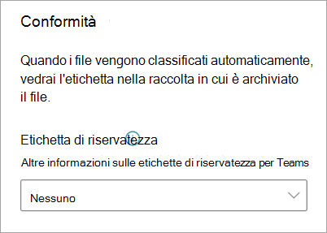

# Applicare un'etichetta di conservazione a un modello in SharePoint Syntex

Microsoft SharePoint Syntex consente di applicare facilmente un'[etichetta di riservatezza](../compliance/sensitivity-labels.md) a un modello di analisi dei documenti. Questa caratteristica non è ancora disponibile per i modelli di elaborazione di moduli.

Le etichette di riservatezza consentono di applicare criteri di crittografia, condivisione e accesso condizionale ai documenti identificati nei modelli. Ad esempio, si vuole che il modello non solo identifichi i documenti finanziari che contengono numeri di conto corrente bancario o numeri di carta di credito caricati nella raccolta documenti, ma anche applicare un'*etichetta di riservatezza* Crittografia per limitare gli utenti autorizzati che possono accedere a tale contenuto e le relative modalità di utilizzo. I modelli SharePoint Syntex rispettano le regole relative all'[ordine delle etichette](../compliance/apply-sensitivity-label-automatically.md#how-multiple-conditions-are-evaluated-when-they-apply-to-more-than-one-label) e non sovrascrivono un'etichetta esistente applicata manualmente da un utente al file. 

Si può applicare al modello un'etichetta di sensibilità preesistente, usando le impostazioni del modello nella home page del modello. L'etichetta deve essere già pubblicata per essere disponibile per la selezione dalle impostazioni del modello.

> [!Important]
> Affinché siano disponibili etichette di sensibilità da applicare ai modelli di analisi dei documenti, occorre [crearle e pubblicarle nel Centro conformità Microsoft 365](../business-video/create-sensitivity-labels.md).

## Aggiungere un'etichetta di sensibilità a un modello di analisi dei documenti

1. Nella home page del modello selezionare **Impostazioni modello**.

   

2. Nel riquadro **Impostazioni modello** nella sezione **Conformità**, selezionare il menu **Etichetta di sensibilità** per visualizzare un elenco delle etichette di sensibilità disponibili per il modello.

    

3. Selezionare l'etichetta di sensibilità da applicare al modello e scegliere **Salva**.

Dopo aver applicato l'etichetta di sensibilità al modello, è possibile applicarla a:

- A una nuova raccolta documenti
- A una raccolta documenti a cui è già applicato il modello
 
### Applicare l'etichetta di sensibilità a una raccolta documenti a cui è già applicato il modello

Se il modello di analisi dei documenti è già stato applicato a una raccolta documenti, è possibile procedere come segue per sincronizzare l'aggiornamento dell'etichetta di sensibilità e applicarlo alla raccolta documenti:

1. Nella home page del modello selezionare la raccolta documenti alla quale si vuole applicare l'aggiornamento dell'etichetta di sensibilità nella sezione **Raccolte con questo modello**.

2. Selezionare **Sincronizza**.

   

Dopo aver applicato l'aggiornamento e averlo sincronizzato con il modello, è possibile verificare che sia stato applicato eseguendo le operazioni seguenti:

1. Nella sezione **Raccolte con questo modello** del centro contenuti selezionare la raccolta a cui è stato applicato il modello aggiornato. 

2. Nella visualizzazione Raccolta documenti selezionare l'icona informazioni per controllare le proprietà del modello.

3. Selezionare il modello aggiornato nell'elenco **Modelli attivi**.

4. Nella sezione **Etichetta di riservatezza**, verrà visualizzato il nome dell'etichetta di riservatezza applicata.

Nella pagina di visualizzazione del modello della raccolta documenti comparirà una nuova colonna **Etichetta di riservatezza**. Man mano che il modello classifica i file che identifica come appartenenti al proprio tipo di contenuto e li elenca nella visualizzazione della raccolta, nella colonna **Etichetta di riservatezza** compare anche il nome dell'etichetta di conservazione applicata mediante il modello.

Ad esempio, a tutti i documenti finanziari identificati dal modello verrà applicata anche l'etichetta di riservatezza *Crittografia*, per impedire l'accesso da parte di utenti non autorizzati. Se una persona non autorizzata tenta di accedere al file dalla raccolta documenti, verrà visualizzato un messaggio di errore che segnala che non è consentito a causa dell'etichetta di sensibilità applicata.

<!---
## Add a sensitivity label to a form processing model

> [!Important]
> For sensitivity labels to be available to apply to your form processing model, they need to be [created and published in the Microsoft 365 Compliance Center](../business-video/create-sensitivity-labels.md).

You can either apply a sensitivity label to a form processing model when you are creating a model, or apply it to an existing model.

### Add a sensitivity label when you create a form processing model

1. When you [create a new form processing model](create-a-form-processing-model.md), select **Advanced settings**.

2. In **Advanced settings**, in the **Sensitivity label** section, select the menu and then select the sensitivity label you want to apply to the model.

3.  After you've completed your remaining model settings, select **Create** to build your model.

### Add a sensitivity label to an existing form processing model

You can add a sensitivity label to an existing form processing model in different ways:

- Through the **Automate** menu in the document library
- Through the **Active model** settings in the document library 

#### Add a sensitivity label to an existing form processing model through the Automate menu

You can add a sensitivity label to an existing form processing model that you own through the **Automate** menu in the document library in which the model is applied.

1. In your document library to which the form processing model is applied, select the **Automate** menu, select **AI Builder**, and then select **View form processing model details**.

2. On the **Model details** pane, in the **Sensitivity label** section, select the sensitivity label you want to apply. Then select **Save**.

#### Add a sensitivity label to an existing form processing model in the active model settings

You can add a sensitivity label to an existing form processing model that you own through the **Active model** settings in the document library in which the model is applied.

1. In the SharePoint document library in which the model is applied, select the **View active models** icon, and then select **View active models**.

2. In **Active models**, select the form processing model to which you want to apply the sensitivity label.

3. On the **Model details** pane, in the **Sensitivity label** section, select the sensitivity label you want to apply. Then select **Save**.

   > [!NOTE]
   > You must be the model owner for the **Model settings** pane to be editable. 
--->

## Vedere anche

[Applicare un'etichetta di conservazione](apply-a-retention-label-to-a-model.md)

[Creare un classificatore](create-a-classifier.md)

[Creare un estrattore](create-an-extractor.md)

[Panoramica sull'analisi dei documenti](document-understanding-overview.md)
