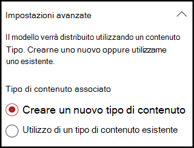
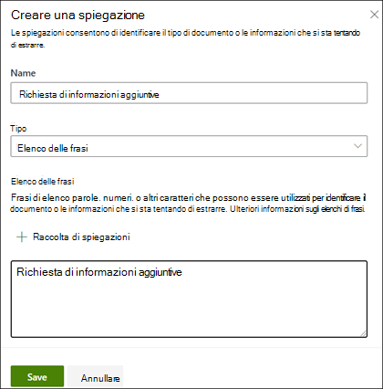

# Creare un classificatore in Microsoft SharePoint SyntexCreate a classifier in Microsoft SharePoint Syntex

 

> [!VIDEO https://www.microsoft.com/videoplayer/embed/RE4CL0R]  

 

Un classificatore è un tipo di modello che è possibile usare per automatizzare l'identificazione e la classificazione di un tipo di documento.A classifier is a type of model that you can use to automate identification and classification of a document type. Ad esempio, si può decidere di identificare tutti i documenti *Rinnovo del contratto* aggiunti alla raccolta documenti, come mostrato nella figura seguente.For example, you may want to identify all *Contract Renewal* documents that are added to your document library, such as is shown in the following illustration.

La creazione di un classificatore consente di creare un nuovo [tipo di contenuto di SharePoint](https://docs.microsoft.com/sharepoint/governance/content-type-and-workflow-planning#content-type-overview) che verrà associato al modello.Creating a classifier enables you to create a new [SharePoint Content Type](https://docs.microsoft.com/sharepoint/governance/content-type-and-workflow-planning#content-type-overview) that will be associated to the model.

Quando si crea il classificatore, è necessario creare *spiegazioni* per definire il modello.When creating the classifier, you need to create *explanations* to define the model. In questo modo è possibile identificare i dati comuni che si prevede di trovare in modo coerente in questo tipo di documento.This enables you to note common data that you would expect to consistently find this document type. 

Usare esempi del tipo di documento ("file di esempio") per "addestrare" il modello a identificare file con lo stesso tipo di contenuto.Use examples of the document type ("example files") to "train" your model to identify files that have the same content type.

Per creare un classificatore, è necessario:To create a classifier, you need to:
1. Assegnare un nome al modello.Name your model.
2. Aggiungere file di esempio.Add your example files.
3. Etichettare i file di esempio.Label your example files.
4. Creare una spiegazione.Create an explanation.
5. Testare il modello.Test your model.

> [!NOTE]
> Anche se il modello usa un classificatore per identificare e classificare i tipi di documento, si può anche decidere di estrarre informazioni specifiche da ogni file identificato dal modello.While your model uses a classifier to identify and classify document types, you can also choose to pull specific pieces of information from each file identified by the model. A questo scopo, occorre creare un **estrattore** da aggiungere al modello.Do this by creating an **extractor** to add to your model. Vedere [Creare un estrattore](create-an-extractor.md).See [Create an extractor](create-an-extractor.md).

## Assegnare un nome al modelloName your model

Per creare un modello occorre prima di tutto assegnargli un nome:The first step to create your model is to give it a name:

1. Nel Centro contenuti selezionare **Nuovo** e quindi **Crea un modello**.From the Content Center, select **New**, and then **Create a model**.
2. Nel riquadro **Nuovo modello di comprensione dei documenti** digitare il nome del modello nel campo **Nome**.In the **New document understanding model** pane, in the **Name** field type the name of the model. Ad esempio, se si vogliono identificare i documenti di rinnovo del contratto, è possibile denominare il modello *Rinnovo del contratto*.For example, if you want to identify contract renewal documents, you could name the model *Contract Renewal*.
3. Scegliere **Crea**.Choose **Create**. Verrà creata una home page per il modello.This creates a home page for the model. 

    

Quando si crea un modello, viene creato anche un nuovo tipo di contenuto del sito.When you create a model, you are also creating a new site content type. Un tipo di contenuto rappresenta una categoria di documenti che hanno caratteristiche comuni e condividono una raccolta di colonne o proprietà dei metadati per quel particolare contenuto.A content type represents a category of documents that have common characteristics and share a collection of columns or metadata properties for that particular content. I tipi di contenuto di SharePoint vengono gestiti tramite la [Raccolta tipi di contenuto](https://support.microsoft.com/office/create-or-customize-a-site-content-type-27eb6551-9867-4201-a819-620c5658a60f).SharePoint Content Types are managed through the [Content types gallery](https://support.microsoft.com/office/create-or-customize-a-site-content-type-27eb6551-9867-4201-a819-620c5658a60f). In questo esempio, quando si crea il modello, si crea un nuovo tipo di contenuto *Rinnovo del contratto*.For this example, when you create the model, you are creating a new *Contract Renewal* content type.

Selezionare **Impostazioni avanzate** se si vuole associare questo modello a un tipo di contenuto aziendale esistente nella Raccolta tipi di contenuto di SharePoint per usarne lo schema.Select **Advanced settings** if you want to map this model to an existing enterprise content type in the SharePoint Content types gallery to use its schema. I tipi di contenuto aziendale sono archiviati nell'hub del tipo di contenuto nell'interfaccia di amministrazione di SharePoint e vengono diffusi a tutti i siti del tenant.Enterprise content types are stored in the Content Type Hub in the SharePoint admin center and are syndicated to all sites in the tenant. Tenere presente che, anche se è possibile usare un tipo di contenuto esistente per utilizzarne lo schema e agevolare l'identificazione e la classificazione, è comunque necessario addestrare il modello a estrarre le informazioni dai file identificati.Note that while you can use an existing content type to leverage its schema to help with identification and classification, you still need to train your model to extract information from files it identifies. 

## Aggiungere file di esempioAdd your example files

Nella home page del modello aggiungere i file di esempio necessari per addestrare il modello a identificare il tipo di documento.On the model home page, add your examples files you will need to help train the model to identify your document type.  
 

> [!VIDEO https://www.microsoft.com/videoplayer/embed/RE4D0iX] 

 

> [!NOTE]
> È consigliabile usare gli stessi file sia per il classificatore che per l'[addestramento dell'estrattore](create-an-extractor.md).You should use the same files for both classifier and [extractor training](create-an-extractor.md). È sempre possibile aggiungere altre informazioni in seguito, ma in genere si aggiunge un set completo di file di esempio.You always have the option to add more later, but typically you add a full set of example files. Etichettarne alcuni per eseguire il training del modello e testare i file restanti senza etichetta per valutare l'adeguatezza del modello.Label some to train your model, and test the remaining unlabeled ones to evaluate model fitness. 

Per il set di training, è bene usare esempi sia positivi sia negativi:For your training set, you want to use both positive and negative examples:
- Esempio positivo: documenti che rappresentano il tipo di documento.Positive example: Documents that represent the document type. Contengono stringhe e informazioni che sono sempre presenti nei documenti di questo tipo.These contain strings and information that would always be in this type of document.
- Esempio negativo: qualsiasi altro documento che non rappresenta il documento da classificare.Negative example: Any other document that does not represent the document you want to classify. 

Usare almeno cinque esempi positivi e almeno un esempio negativo per addestrare il modello.Be sure to use at least five positive examples and at least one negative example to train your model.  Dopo il processo di training, è possibile crearne altri per testare il modello.You want to create additional ones to test your model after the training process.

Per aggiungere file di esempio:To add example files:

1. Nella home page del modello fare clic su **Aggiungi file** nel riquadro **Aggiungi file di esempio**.On the model home page, in the **Add example files** tile, click **Add files**.
2. Nella pagina **Selezionare i file di esempio per il modello** selezionare i file di esempio nella raccolta di file di training nel centro contenuti.On the **Select example files for your model** page, select your example files from the Training files library in the content center. Se non sono ancora stati caricati, scegliere di caricarli subito facendo clic su **Carica** per copiarli nella raccolta di file di training.If you had not already uploaded them there, choose to upload them now by clicking **Upload** to copy them to the Training files library.
3. Dopo aver selezionato i file di esempio da usare per il modello, fare clic su **Aggiungi**.After selecting your example files to use to train the model, click **Add**.

     

## Etichettare i file di esempioLabel your example files

Dopo aver aggiunto i file di esempio, è necessario etichettarli come esempi positivi o negativi.After adding your example files, you need to label them as either positive or negative examples.

1. Nella home page del modello, fare clic su **Eseguire il training del classificatore** nel riquadro **Classificare i file ed eseguire il training**.From the model home page, on the **Classify files and run training** tile, click **Train Classifier**.
   Verrà visualizzata la pagina dell'etichetta con un elenco dei file di esempio e il primo file mostrato nel visualizzatore.This displays the label page that shows a listing of your example files, with the first file visible in the viewer.
2. Nel visualizzatore nella parte superiore del primo file di esempio dovrebbe essere presente un testo che chiede se il file è un esempio del modello appena creato.In the viewer on the top of the first example file, you should see text asking if the file is an example of the model you just created. Se è un esempio positivo, selezionare **Sì**.If it is a positive example, select **Yes**. Se è un esempio negativo, selezionare **No**.If it is a negative example, select **No**.
3. Nell'elenco **Esempi etichettati** a sinistra selezionare altri file da usare come esempi ed etichettarli.From the **Labeled examples** list on the left, select additional files that you want to use as examples, and label them. 

     

> [!NOTE]
> Etichettare almeno cinque esempi positivi.Label at least five positive examples. È anche necessario etichettare almeno un esempio negativo.You must also label at least one negative example. 

## Creare una spiegazioneCreate an explanation

Il passaggio successivo consiste nel creare una spiegazione nella pagina Avvia training.The next step is for you to create an explanation on the Train page. Una spiegazione aiuta il modello a comprendere come riconoscere il documento.An explanation helps the model understand how to recognize the document. Ad esempio, i documenti relativi al rinnovo del contratto contengono sempre una stringa di testo *Richiesta di informazioni aggiuntive*.For example, the Contract Renewal documents always contain a *Request for additional disclosure* text string.

> [!Note]
> Quando viene usata con gli estrattori, una spiegazione identifica la stringa da estrarre dal documento.When used with extractors, an explanation identifies the string that you want to extract from the document. 

Per creare una spiegazione:To create an explanation:

1. Nella home page del modello selezionare la scheda **Avvia training** per passare alla pagina corrispondente.From the model home page, select the **Train** tab to go to the Train page.
2. Nella sezione **File con training** della pagina Avvia training dovrebbe essere presente un elenco dei file di esempio precedentemente etichettati.On the Train page, in the **Trained files** section you should see a list of the sample files that you previously labeled. Selezionare uno dei file positivi nell'elenco. Verrà visualizzato nel visualizzatore.Select one of the positive files from the list, and it displays in the viewer.
3. Nella sezione Spiegazione selezionare **Nuovo** e quindi **Vuoto**.In the Explanation section, select **New** and then **Blank**.
4. Nella pagina **Crea spiegazione**:On the **Create an explanation** page: 
    a.a. Digitare il **Nome**, ad esempio "Blocco divulgazione".Type the **Name** (for example, "Disclosure Block"). 
    b.b. Selezionare il **Tipo**.Select the **Type**. In questo caso selezionare **Elenco frasi** perché viene aggiunta una stringa di testo.For the sample, select **Phrase list**, since you add a text string. 
    c.c. Digitare la stringa nella casella **Digitare qui**.In the **Type here** box, type the string. Per questo esempio, aggiungere "Richiesta di informazioni aggiuntive".For the sample, add "Request for additional disclosure". È possibile selezionare **Maiuscole/Minuscole** se è necessario distinguere tra maiuscole e minuscole nella stringa.You can select **Case sensitive** if the string needs to be case sensitive. 
    d.d. Fare clic su **Salva**.Click **Save**.

     
    
 
5. A questo punto, il modello verifica se la spiegazione creata consente di identificare correttamente gli altri file di esempio etichettati come esempi positivi e negativi.The model now checks to see if the explanation you created was good enough to identify the remaining labeled example files correctly, as positive and negative examples. Al termine del training, controllare la colonna **Valutazione** nella sezione File con training per visualizzare i risultati.In the Trained Files section, check the **Evaluation** column after the training has completed to see the results. I file mostrano il valore **Corrisponde** se le spiegazioni create sono risultate sufficienti per trovare una corrispondenza con ciò che è stato etichettato come positivo o negativo.The files show a value of **Match**, if the explanations you created was enough to match what you labeled as positive or negative.

     

Se i file etichettati risultano **Non corrispondenti**, può essere necessario creare un'ulteriore spiegazione per fornire altre informazioni al modello per identificare il tipo di documento.If you receive a **Mismatch** on the labeled files, you may need to create an additional explanation to provide the model more information to identify the document type. In questo caso, fare clic sul file per ottenere altre informazioni sul motivo della mancata corrispondenza.If this happens, click on the file to get more information about why the mismatch occurred.

## Testare il modelloTest your model

Se è stata rilevata una corrispondenza nei file di esempio etichettati, è possibile testare il modello nei rimanenti file di esempio non etichettati, non ancora esaminati dal modello.If you received a match on your labeled sample files, you can now  test your model on your remaining unlabeled example files that the model has not seen before.  Questo è un passaggio opzionale, ma utile per valutare l'adeguatezza del modello prima di usarlo, testandolo sui file che il modello non ha ancora esaminato.This is optional, but a useful step to evaluate the “fitness” or readiness of the model before using it, by testing it on files the model hasn’t seen before.

1. Nella home page del modello selezionare la scheda **Test**. Il modello viene eseguito nei file di esempio non etichettati.From the model home page, select the **Test** tab.  This runs the model on your unlabeled sample files.
2. Nell'elenco **Testa i file** vengono visualizzati i file di esempio e viene indicato se il modello prevede che siano positivi o negativi.In the **Test files** list, your example files display and shows if the model predicted them to be positive or negative. Usare queste informazioni per determinare l'efficacia del classificatore nell'identificazione dei documenti.Use this information to help determine the effectiveness of your classifier in identifying your documents.

     

## Vedere ancheSee Also
[Creare un estrattoreCreate an extractor](create-an-extractor.md)

[Panoramica sull'analisi dei documentiDocument Understanding overview](document-understanding-overview.md)

[Tipi di spiegazioneExplanation types](explanation-types-overview.md)

[Applicare un modelloApply a model](apply-a-model.md) 
