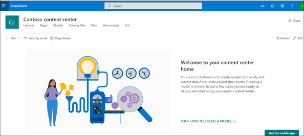

# Creare un centro contenuti in Microsoft SharePoint SyntexCreate a content center in Microsoft SharePoint Syntex

 

> [!VIDEO https://www.microsoft.com/videoplayer/embed/RE4CPSF]

 

Per creare e gestire i modelli di analisi del documento, è necessario prima di tutto un centro contenuti.To create and manage document understanding models, you first need a content center. Il centro contenuti è l'interfaccia per la creazione di modelli e include anche informazioni sulle raccolte documenti a cui sono stati applicati i modelli pubblicati.The content center is the model creation interface and also contains information about which document libraries published models have been applied to. 

    

È possibile creare un centro contenuti predefinito durante la [configurazione](set-up-content-understanding.md).You create a default content center during [setup](set-up-content-understanding.md). Ma un amministratore di SharePoint può anche scegliere di creare altri centri, se necessario.But a SharePoint admin can also choose to create additional centers as needed. Anche se un singolo centro contenuti può essere utile per gli ambienti in cui si vuole eseguire un rollup di tutte le attività del modello, è consigliabile avere altri centri per più reparti all'interno dell'organizzazione, che possono avere esigenze e requisiti di autorizzazione diversi per i propri modelli.While a single content center may be fine for environments for which you want a roll-up of all model activity, you may want to have additional centers for multiple departments within your organization, which may have different needs and permission requirements for their models.

> [!NOTE]
> Un amministratore di SharePoint può creare un sito del centro contenuti come [creerebbe qualsiasi altro sito di SharePoint](https://docs.microsoft.com/sharepoint/create-site-collection) tramite il pannello di provisioning del sito dell'interfaccia di amministrazione.A SharePoint admin can create a content center site like they would [create any other SharePoint site](https://docs.microsoft.com/sharepoint/create-site-collection) through the admin center site provisioning panel.

Per creare un nuovo centro contenuti:To create a new content center:

1. Nell'interfaccia di amministrazione di Microsoft 365, passare all’interfaccia di amministrazione di SharePoint.On the Microsoft 365 admin center, go to the SharePoint admin center.
2. Nella interfaccia di amministrazione di SharePoint selezionare **Siti attivi** in **Siti**.On the SharePoint admin center, under **Sites**, select **Active Sites**.
3. Nella pagina **Siti attivi** fare clic su **Creare**e quindi selezionare **Altre opzioni**.On the **Active Sites** page, click **Create**, and then select **Other options**.
4. Nel menu **Scegliere un modello**, selezionare **Centro contenuti**.On the **Choose a template** menu, select **Content Center**.
5. Per il nuovo sito, fornire un **nome del sito**, un **amministratore principale** e una **lingua**.For the new site, provide a **Site Name**, **Primary administrator**, and a **Language**. 

> [!NOTE] 
> È possibile selezionare un sito del centro contenuti per il rendering in una qualsiasi delle lingue disponibili, ma si noti che attualmente i modelli possono essere creati solo per i file in inglese.You can select a content center site to render in any of the available languages, but note that currently models can only be created for English files. Si noti anche che, come altri modelli di sito, la lingua del sito predefinita non è modificabile dopo la creazione del sito.Also note that like other site templates, the default site language isn't editable after the site is created. 

6. Selezionare **Completato**.Select **Finished**.
 
Dopo aver creato un sito del centro contenuti, questo verrà elencato nella pagina **Siti attivi** nell'interfaccia di amministrazione di SharePoint.After you create a content center site, you will see it listed on the **Active sites** page in the SharePoint admin center. 

### Assegnare l'accesso ad altri utentiGive access to additional users
 
Dopo aver creato il sito, è possibile concedere ad altri utenti l'accesso al sito tramite il [modello di autorizzazioni del sito di SharePoint](https://docs.microsoft.com/sharepoint/modern-experience-sharing-permissions)standard.After you create the site, you can give additional users access to the site through the standard [SharePoint site permissions model](https://docs.microsoft.com/sharepoint/modern-experience-sharing-permissions).

## Vedere ancheSee Also
[Creare un classificatoreCreate a classifier](create-a-classifier.md)

[Creare un estrattoreCreate an extractor](create-an-extractor.md)

[Creare un centro contenutiCreate a content center](create-a-content-center.md)

[Panoramica sull'analisi dei documentiDocument understanding overview](document-understanding-overview.md)

[Creare un modello di elaborazione moduliCreate a form processing model](create-a-form-processing-model.md)

[Applicare un modelloApply a model](apply-a-model.md)    
