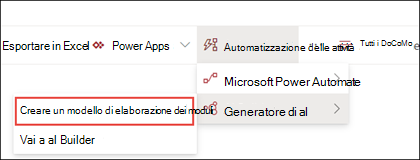
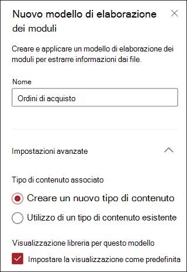
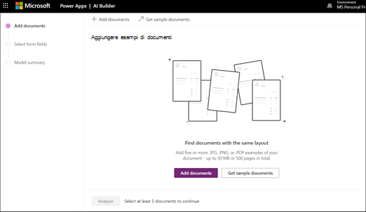
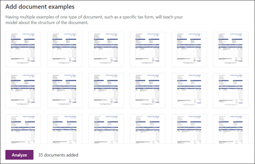
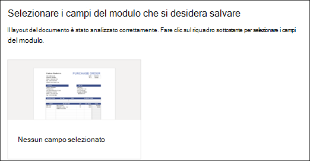
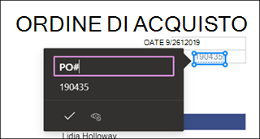
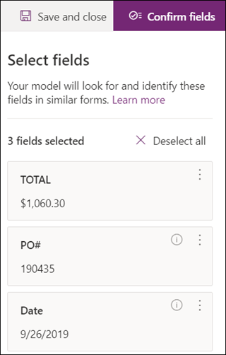
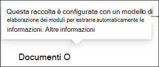

# Creare un modello di elaborazione dei moduli in Microsoft SharePoint SyntexCreate a form processing model in Microsoft SharePoint Syntex

 

> [!VIDEO https://www.microsoft.com/videoplayer/embed/RE4GnhN]  

 

Con [AI Builder](/ai-builder/overview), una funzionalità di Microsoft PowerApps, gli utenti di SharePoint Syntex possono creare un [modello di elaborazione dei moduli](form-processing-overview.md) direttamente da una raccolta documenti di SharePoint.Using [AI Builder](/ai-builder/overview) - a feature in Microsoft PowerApps - SharePoint Syntex users can create a [form processing model](form-processing-overview.md) directly from a SharePoint document library. 

La creazione di un modello di elaborazione dei moduli prevede i passaggi seguenti:Creating a form processing model involves the following:
 - Passaggio 1: creare il modello di elaborazione moduli per creare il tipo di contenutoStep 1: Create the from processing model to create the content type
 - Passaggio 2: aggiungere e analizzare file di esempioStep 2: Add and analyze example files
 - Passaggio 3: selezionare i campi del moduloStep 3: Select your form fields
 - Passaggio 4: eseguire il training e il test del modelloStep 4: Train and test your model
 - Passaggio 5: pubblicare il modelloStep 5: Publish your model
 - Passaggio 6: usare il modelloStep 6: Use your model

## RequisitiRequirements

È possibile creare un modello di elaborazione dei moduli solo nelle raccolte documenti di SharePoint per le quali è abilitata.You can only create a form processing model in SharePoint document libraries for which it is enabled. Se l'elaborazione dei moduli è abilitata, sarà presente l'opzione **AI Builder** **Crea un modello di elaborazione dei moduli** nel menu **Automatizza** nella raccolta documenti.If form processing is enabled, you are able to see the **AI Builder** **"Create a form processing model'** under the **Automate** menu in your document library.  Se è necessario abilitare l'elaborazione nella raccolta documenti, contattare l'amministratore di SharePoint.If you need processing enabled on your document library, you must contact your SharePoint administrator.

  

## Passaggio 1: creare un modello di elaborazione dei moduliStep 1: Create a form processing model

Per creare un modello di elaborazione dei moduli, occorre prima di tutto assegnare un nome al modello, creare e definire il nuovo tipo di contenuto e creare una specifica visualizzazione della raccolta documenti.The first step in creating a form processing model is to name it and create the define the new content type and create a new document library view for it.

1. Nella raccolta documenti scegliere **AI Builder**, dal menu **Automatizza**, quindi selezionare **Crea un modello di elaborazione dei moduli**.From the document library, select the **Automate** menu, select **AI Builder**, and then select **Create a Form Processing model**.

     

2. Nel riquadro **Nuovo modello di elaborazione dei moduli** digitare un nome per il modello nel campo **Nome**, ad esempio *Ordini di acquisto*.In the **New form processing model** pane, in the  **Name** field, type a name for your model (for example, *Purchase Orders*).

      

3. Quando si crea un modello di elaborazione dei moduli, si crea un nuovo tipo di contenuto di SharePoint.When you create a form processing model, you create a new SharePoint content type. Un tipo di contenuto di SharePoint rappresenta una categoria di documenti che hanno caratteristiche comuni e condividono una raccolta di colonne o proprietà dei metadati per quel particolare contenuto.A SharePoint content type represents a category of documents that have common characteristics and share a collection of columns or metadata properties for that particular content. I tipi di contenuto di SharePoint vengono gestiti tramite la [Raccolta tipi di contenuto]().SharePoint Content Types are managed through the [Content types gallery]().

    Selezionare **Impostazioni avanzate** se si vuole associare questo modello a un tipo di contenuto esistente nella Raccolta tipi di contenuto di SharePoint per usarne lo schema.Select **Advanced settings** if you want to map this model to an existing content type in the SharePoint Content types gallery to use its schema. 

4. Il modello crea una nuova visualizzazione nella raccolta documenti per i dati estratti.Your model creates a new view in your document library for your extracted data. Se non si vuole impostarla come visualizzazione predefinita, deselezionare **Imposta la visualizzazione come predefinita**.If you do not want it to the default view, deselect **Set the view as default**.

5. Selezionare **Crea**.Select **Create**.

## Passaggio 2: aggiungere e analizzare documentiStep 2: Add and analyze documents

Dopo aver creato il nuovo modello di elaborazione dei moduli, nel browser viene aperta una nuova pagina del modello di elaborazione dei moduli di PowerApps AI Builder.After you create your new form processing model, your browser opens a new PowerApps AI Builder forms processing model page. In questa pagina è possibile aggiungere e analizzare i documenti di esempio.On this page you can add and analyze your example documents.  

> [!NOTE]
> Quando si cercano file di esempio da usare, vedere i [requisiti dei documenti di input per il modello di elaborazione moduli e suggerimenti per l'ottimizzazione](/ai-builder/form-processing-model-requirements).When looking for example files to use, see the [form processing model input document requirements and optimization tips](/ai-builder/form-processing-model-requirements). 

     
 
1. Selezionare **Aggiungi documenti** per iniziare ad aggiungere documenti di esempio analizzati per determinare le coppie di valori denominate che è possibile estrarre.Select **Add documents** to begin adding example documents analyzed to determine the named value pairs that can be extracted. È quindi possibile scegliere **Carica dalla risorsa di archiviazione locale**, **SharePoint** o **Archiviazione BLOB di Azure**.You can then choose either **Upload from local storage**, **SharePoint**, or **Azure Blob storage**. È necessario usare almeno cinque file per il training.You need to use at least five files for training.

2. Dopo aver aggiunto i file, selezionare **Analizza** per verificare se esistono informazioni comuni a tutti i file.After adding files, select **Analyze** to check for any information common is all files. Questo processo potrebbe richiedere alcuni minuti.This may take several minutes to complete.  
 
      

3. Terminata l'analisi dei file, nella pagina **Selezionare i campi del modulo da salvare** selezionare il file per visualizzare i campi rilevati.After the files have been analyzed, in the **Select the form fields you want to save** page select the file to view the detected fields. 

      

## Passaggio 3: selezionare i campi del moduloStep 3: Select your form fields

Una volta analizzati i documenti per individuare i campi, è possibile vedere i campi rilevati e identificare quelli da salvare.After analyzing the documents for fields, you can now see the fields that were found, and identify the ones that you want to save. I campi salvati vengono visualizzati come colonne nella visualizzazione della raccolta documenti del modello e mostrano i valori estratti da ogni documento.Saved fields display as columns in your model's document library view and show the values extracted from each document.

1. Nella pagina successiva viene visualizzato uno dei file di esempio e vengono evidenziati tutti i campi comuni che sono stati rilevati automaticamente dal sistema.The next page displays one of your sample files and will highlight all common fields that were automatically detected by the system.  

      

2. Selezionare i campi a salvare e selezionare la casella di controllo per confermare la selezione.Select the fields that you want to save and select the checkbox to confirm your selection. Ad esempio, nel modello di ordine di acquisto selezionare i campi *Data*, *Ordine d'acquisto* e *Totale*.For example, in the Purchase Order model, choose to select the *Date*, *PO*, and *Total* fields.  Se si vuole, è possibile anche decidere di rinominare un campo.Note that you can also choose to rename a field if you choose.  

      

3. Se un campo non è stato rilevato dall'analisi, è comunque possibile scegliere di aggiungerlo.If a field was not detected by analysis, you can still choose to add it. Evidenziare le informazioni da estrarre, quindi immettere il nome desiderato nella casella relativa al nome.Highlight the information you want to extract, and in the name box type in the name you want. Selezionare quindi la casella di controllo.Then select the check box. Tenere presente che è necessario confermare i campi non rilevati nei file di esempio rimanenti.Note that you need to confirm undetected fields in your remaining sample files.

4. Dopo aver selezionato i campi da salvare, fare clic su **Conferma campi**.Click **Confirm fields** after you have selected the fields that you want to save.  
 
      
 
5. Nella pagina **Selezionare i campi del modulo da salvare** viene visualizzato il numero di campi selezionati.On the **Select the form fields you want to save** page, it shows the number of fields you have selected. Scegliere **Fatto**.Select **Done**.

## Passaggio 4: eseguire il training e il test del modelloStep 4: Train and test your model

Dopo aver selezionato i campi da salvare, nella pagina **Riepilogo modelli** è possibile eseguire il training e il test del modello.After selecting the fields you want to save, the **Model Summary** page lets you train and test your model.

1. Nella pagina **Riepilogo modelli** i campi salvati vengono visualizzati nella sezione **Campi selezionati**.On the **Model Summary** page, the saved fields will show in the **Selected fields** section. Selezionare **Avvia training** per avviare il training sul file di esempio.Select **Train** to begin training on your example files. Tenere presente che questo processo potrebbe richiedere alcuni minuti.Note that this may take a few minutes to complete. 

       

2. Quando viene indicato che il training è terminato, selezionare **Vai alla pagina Dettagli**.When you see the notification that training has completed, select **Go to details page**. 

3. Nella pagina **Dettagli modello** si può decidere di testare il funzionamento del modello selezionando **Test rapido**.On the **Model details** page, you can choose to test how your model works by selecting **Quick test**. Questo consente di trascinare i file nella pagina e verificare se i campi vengono rilevati.This lets you drag and drop files to the page and see if the fields are detected.

      

2. Quando viene indicato che il training è terminato, selezionare **Vai alla pagina Dettagli**.When you see the notification that training has completed, select **Go to details page**. 

3. Nella pagina **Dettagli modello**, scegliere di testare il funzionamento del modello selezionando **Test rapido**.On the **Model details** page, choose to test how your model works by selecting **Quick test**. Questo consente di trascinare i file nella pagina e verificare se i campi vengono rilevati.This lets you drag and drop files to the page and see if the fields are detected.

## Passaggio 5: pubblicare il modelloStep 5: Publish your model

1. Se i risultati del modello sono soddisfacenti, selezionare **Pubblica** per metterlo a disposizione.If you are satisfied with the results of your model, select **Publish** to make it available for use.

2. Dopo avere pubblicato il modello, selezionare **Usa modello**.After the model is published, select **Use model**. In questo modo viene creato un flusso di PowerAutomate che può essere eseguito nella raccolta documenti di SharePoint ed estrae i campi identificati nel modello, quindi selezionare **Crea flusso**.This creates a PowerAutomate flow that can run in your SharePoint document library and extracts the fields that have been identified in the model, then select **Create Flow**.
  
3. Al termine, viene visualizzato il messaggio **Il flusso è stato creato**.When completed, you will see the message **Your flow has been successfully created**.
 
## Passaggio 6: usare il modelloStep 6: Use your model

Dopo aver pubblicato il modello e avere creato il relativo flusso di PowerAutomate, è possibile usare il modello nella raccolta documenti di SharePoint.After publishing your model and creating it's PowerAutomate flow, you can use your model in your SharePoint document library.

1. Dopo la pubblicazione del modello, selezionare **Vai a SharePoint** per passare alla raccolta documenti.After publishing your model, select **Go to SharePoint** to go to your document library.

2. Nella visualizzazione modello della raccolta documenti notare che i campi selezionati sono visualizzati in colonne.In the document library model view, notice that the fields you selected now display as columns. 

      

3. Il collegamento alle informazioni accanto a **Documenti** indica che alla raccolta documenti è applicato un modello di elaborazione dei moduli.Notice that the information link next to **Documents** notes that a forms processing model is applied to this document library.

       

4. Caricare i file nella raccolta documenti.Upload files to your document library. Qualsiasi file che il modello identifica come corrispondente al suo tipo di contenuto elenca i file nella visualizzazione e mostra i dati estratti nelle colonne.Any files that the model identifies as it's content type lists the files in your view and displays the extracted data in the columns. 

       

## Vedere ancheSee Also
  
[Documentazione di Power AutomatePower Automate documentation](/power-automate/)

[Formazione: migliorare le prestazioni aziendali con AI BuilderTraining: Improve business performance with AI Builder](/learn/paths/improve-business-performance-ai-builder/?source=learn)