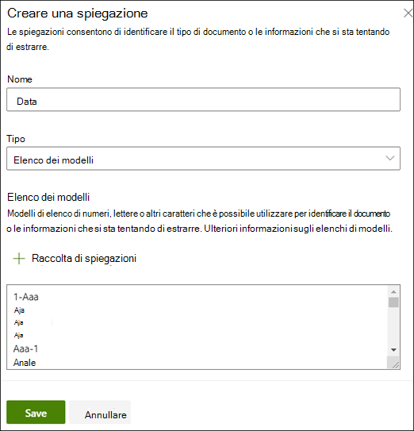
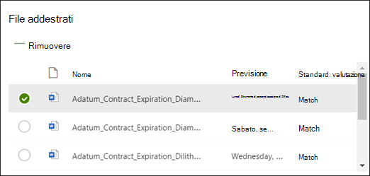
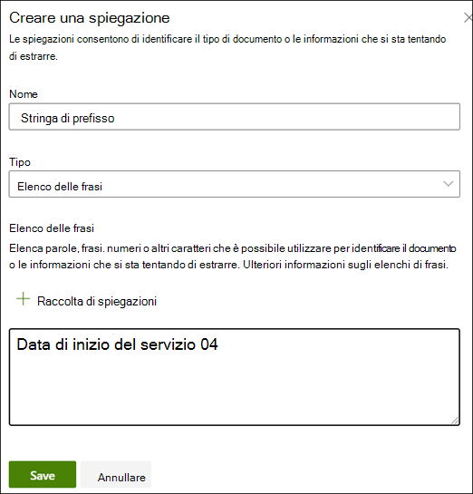
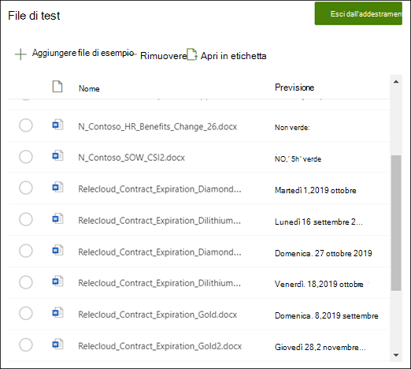

# Creare un estrattore in Microsoft SharePoint Syntex.

 

> [!VIDEO https://www.microsoft.com/videoplayer/embed/RE4CL2G]

  

Prima o dopo aver creato un modello di classificazione per automatizzare l'identificazione e la classificazione di tipi di documento specifici, è possibile scegliere di aggiungere degli estrattori al modello al fine di estrarre informazioni specifiche da tali documenti. Ad esempio, si può fare in modo che il modello non solo identifichi tutti i documenti *Rinnovo del contratto* aggiunti alla raccolta documenti, ma visualizzi anche la *Data di avvio del servizio* per ogni documento come valore di colonna nella raccolta documenti.

È necessario creare un estrattore per ogni entità nel documento che si vuole estrarre. In questo esempio si vuole estrarre la  **Data di avvio del servizio**  per ogni documento  **Rinnovo del contratto**  identificato dal modello. Si vuole ottenere una vista di tutti i documenti  **Rinnovo del contratto**  nella raccolta documenti, con una colonna che mostra il valore della data di **Avvio del servizio** per ogni documento. 

> [!NOTE]
> Per creare un estrattore, è possibile usare gli stessi file caricati in precedenza per il training del classificatore. 

## Assegnare un nome all'estrattore

1. Nella sezione **Creare ed eseguire il training di estrattori** della home page del modello fare clic su **Eseguire il training dell'estrattore**.
2. Nella schermata **Nuovo estrattore di entità** digitare il nome dell'estrattore nel campo **Nome del nuovo estrattore**. Ad esempio, assegnare il nome **Data di avvio del servizio** per estrarre la data di avvio del servizio da ogni documento Rinnovo del contratto. Si può anche decidere di riutilizzare una colonna creata in precedenza, ad esempio una colonna di metadati gestiti.
> [!NOTE]
> Se si crea un nuovo estrattore, selezionare **Nuovo tipo colonna** e scegliere **Riga di testo singola**, il limite massimo di caratteri è 255. Qualsiasi carattere in eccesso rispetto al limite verrà troncato. 
3. Al termine, fare clic su **Crea**.

## Aggiungere un'etichetta

Il passaggio successivo consiste nell'etichettare l'entità da estrarre nei file di training di esempio.

Quando si crea l'estrattore, viene aperta la pagina dell'estrattore. In questa pagina è presente un elenco dei file di esempio e nel visualizzatore viene mostrato il primo file nell'elenco.

1. Nel visualizzatore selezionare i dati da estrarre dai file. Ad esempio, se si vuole estrarre la *Data di avvio del servizio*, evidenziare il valore della data nel primo file (*lunedì 14 ottobre 2019*), quindi fare clic su **Salva**.  Il valore presente nel file dovrebbe essere visualizzato nell'elenco Esempi etichettati, nella colonna **Etichetta**.
2. Selezionare **File successivo** per salvare automaticamente e aprire nel visualizzatore il file successivo nell'elenco. In alternativa, selezionare **Salva** e quindi selezionare un altro file nell'elenco **Esempi etichettati**.
3. Nel visualizzatore ripetere i passaggi 1 e 2, quindi ripetere fino a salvare l'etichetta in tutti e cinque i file.

     

 
Dopo avere etichettato cinque file, viene visualizzato un banner di notifica che indica di passare al training. È possibile decidere di etichettare altri documenti o procedere al training. 

## Aggiungere una spiegazione

In questo esempio si creerà una spiegazione che offre un suggerimento sul formato dell'entità e sulle varianti che può avere nei documenti di esempio. Ad esempio, un valore di data può essere espresso in diversi formati, quali:
- 14/10/2019
- 14 ottobre 2019
- Lunedì 14 ottobre 2019
 

Per identificare la *Data di avvio del servizio*, è possibile creare una spiegazione di tipo criteri.

1. Nella sezione Spiegazione selezionare **Nuovo** e digitare un nome, ad esempio *Data*.
2. In Tipo selezionare **Elenco criteri**.
3. In Valore specificare le varianti della data che appaiono nei file di esempio. Ad esempio, se sono presenti formati di data visualizzati come 0/00/0000, immettere tutte le varianti presenti nei documenti, ad esempio:
    - 0/0/0000
    - 0/00/0000
    - 00/0/0000
    - 00/00/0000
4. Selezionare **Salva**.

> [!NOTE]
> Per altre informazioni sui tipi di spiegazione, vedere [Tipi di spiegazione](https://docs.microsoft.com/microsoft-365/contentunderstanding/explanation-types-overview).  

### Usare la raccolta di spiegazioni

Per creare spiegazioni per elementi come le date, è più facile [usare la raccolta di spiegazioni](https://docs.microsoft.com/microsoft-365/contentunderstanding/explanation-types-overview#use-the-explanation-library) piuttosto che immettere manualmente tutte le varianti. La raccolta di spiegazioni è un set di spiegazioni predefinite di tipo frase o criteri. La raccolta cerca di fornire tutti i formati per elenchi di frasi o criteri comuni, come date, numeri di telefono, codici postali e molti altri. 

Per l'esempio *Data di avvio del servizio*, è più efficace usare la spiegazione predefinita per *Data* nella raccolta di spiegazioni:

1. Nella **sezione Spiegazione** selezionare **Nuovo** e quindi **Da raccolta spiegazioni**.
2. Nella raccolta di spiegazioni selezionare **Data**. Vengono visualizzate tutte le varianti di data riconosciute.
3. Selezionare **Aggiungi**. 

     

4. Nella pagina **Crea spiegazione** i campi vengono compilati automaticamente con le informazioni *Data* presenti nella raccolta di spiegazioni. Selezionare **Salva**. 

     

## Eseguire il training del modello 

Quando si salva la spiegazione, viene avviato il training. Se il modello contiene informazioni sufficienti per estrarre i dati dai file di esempio etichettati, a ogni file sarà associata l'etichetta **Corrisponde**.  

 

Se la spiegazione non contiene informazioni sufficienti per individuare i dati da estrarre, a ogni file sarà associata l'etichetta **Non corrispondenti**. È possibile fare clic sui file **Non corrispondenti** per ottenere altre informazioni sul motivo della mancata corrispondenza.

## Aggiungere un'altra spiegazione

Spesso la mancata corrispondenza indica che la spiegazione fornita non conteneva informazioni sufficienti per estrarre il valore della data di avvio del servizio per trovare una corrispondenza nei file etichettati. Potrebbe essere necessario modificarla o aggiungerne un'altra.

In questo esempio, la stringa di testo *Data di avvio del servizio di* precede sempre il valore effettivo. Per identificare la Data di avvio del servizio, è necessario creare una spiegazione di tipo frase.

1. Nella sezione Spiegazione selezionare **Nuovo** e digitare un nome, ad esempio *Stringa prefisso*.
2. In Tipo selezionare **Elenco frasi**.
3. Usare *Data di avvio del servizio di* come valore.
4. Selezionare **Salva**.

     

## Ripetere il training del modello

Quando si salva la spiegazione, viene eseguito nuovamente il training, questa volta usando entrambe le spiegazioni nell'esempio. Se il modello contiene informazioni sufficienti per estrarre i dati dai file di esempio etichettati, a ogni file sarà associata l'etichetta **Corrisponde**. 

Se i file etichettati risultano nuovamente **Non corrispondenti**, probabilmente è necessario creare un'altra spiegazione per fornire ulteriori informazioni al modello per identificare il tipo di documento oppure valutare la possibilità di modificare quelle esistenti.

## Testare il modello

Se viene rilevata una corrispondenza nei file di esempio etichettati, è possibile testare il modello sui rimanenti file di esempio non etichettati. Questo è un passaggio opzionale, ma utile per valutare l'adeguatezza del modello prima di usarlo, testandolo sui file che il modello non ha ancora esaminato.

1. Nella home page del modello fare clic sulla scheda **Test**. Il modello viene eseguito sui file di esempio non etichettati.
2. Nell'elenco **Testa i file** vengono visualizzati i file di esempio e viene mostrato se il modello è in grado di estrarre le informazioni necessarie. Usare queste informazioni per determinare l'efficacia del classificatore nell'identificazione dei documenti.

     

## Vedere anche
[Creare un classificatore](create-a-classifier.md)

[Tipi di spiegazione](explanation-types-overview.md)

[Sfruttare la tassonomia dell'archivio termini durante la creazione di un estrattore](leverage-term-store-taxonomy.md)

[Panoramica sull'analisi dei documenti](document-understanding-overview.md)

[Applicare un modello](apply-a-model.md) 
