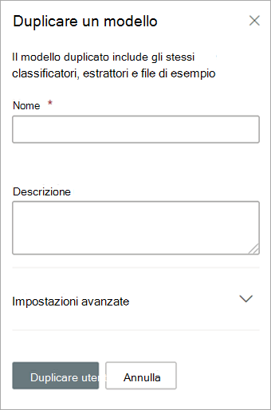

# Duplicare un modello in Microsoft SharePoint Syntex

Duplicare un modello di analisi dei documenti consente di risparmiare tempo e risorse se si necessita di creare un nuovo modello e di sapere che un modello esistente è molto simile a ciò di cui si ha bisogno.

Ad esempio, un modello esistente denominato "Contratti" classifica gli stessi file di cui si necessita per lavorare. Il nuovo modello estrarrà alcuni dati esistenti, ma dovrà essere aggiornato per estrarre alcuni dati aggiuntivi. Invece di creare ed eseguire il training di un nuovo modello da zero, sarà possibile usare la funzionalità di duplicazione modello per creare una copia del modello Contratti, che copierà anche tutti gli elementi del training associati, quali estrattori di file ed entità.

Quando si duplica il modello, dopo averlo rinominato (ad esempio, "Rinnovi contrattuali"), sarà possibile apportare aggiornamenti allo stesso. Ad esempio, è possibile scegliere di rimuovere alcuni dei campi estratti esistenti di cui non si necessita, quindi eseguire il training del modello per estrarne uno nuovo (ad esempio, "Data di rinnovo").

## Duplicare un modello

Seguire questi passaggi per duplicare un modello di analisi dei documenti.

1. Nel centro contenuti, selezionare **Modelli** per visualizzare l'elenco dei modelli.

2. Alla pagina **Modelli**, selezionare il modello che si desidera duplicare.

3. Usando la barra multifunzione o il pulsante **Mostra azioni** (accanto al nome modello), selezionare **Duplica**. 

      

4. Nel pannello **Duplica modello**:

   a. In **Nome**, immettere il nuovo nome del modello che si desidera duplicare. 

      

   b. In **Descrizione**, aggiungere una descrizione del nuovo modello.

   c. (Facoltativo) In **Impostazioni avanzate**, selezionare se si desidera associare un [tipo di contenuto](/sharepoint/governance/content-type-and-workflow-planning#content-type-overview) esistente.

5. Selezionare **Duplica**.

## Vedere anche
[Creare un classificatore](create-a-classifier.md)

[Rinominare un modello](rename-a-model.md)

[Creare un estrattore](create-an-extractor.md)

[Panoramica sull'analisi dei documenti](document-understanding-overview.md)

[Tipi di spiegazione](explanation-types-overview.md)

[Applicare un modello](apply-a-model.md) 

[Modalità di accessibilità di SharePoint Syntex](accessibility-mode.md)