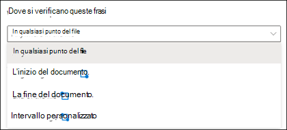
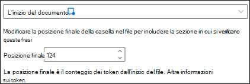
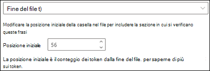
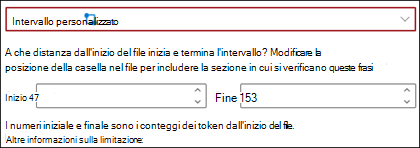

# Introduzione ai tipi di spiegazione

Le spiegazioni vengono usate per definire meglio le informazioni da etichettare ed estrarre nei modelli di analisi dei documenti in Microsoft SharePoint Syntex. Quando si crea una spiegazione, è necessario selezionare un tipo di spiegazione. Questo articolo contiene informazioni utili per comprendere i diversi tipi di spiegazione e come vengono usati. 

 
   
Sono disponibili questi tipi di spiegazione:

- **Elenco frasi**: elenco di parole, frasi, numeri o altri caratteri che è possibile usare nel documento o nelle informazioni che si stanno estraendo. Ad esempio, la stringa di testo **Medico richiedente** è inclusa in tutti i documenti di richiesta di visita specialistica che si stanno identificando. Oppure il **numero di telefono** del medico richiedente da tutti i documenti di richiesta di visita specialistica che si stanno identificando.

- **Prossimità**: descrive la relazione di prossimità tra le spiegazioni. Ad esempio, un elenco frasi *numero civico* precede immediatamente l'elenco frasi *nome della via*, senza token intermedi (i token verranno illustrati più avanti in questo articolo). Se si usa il tipo di prossimità, il modello deve includere almeno due spiegazioni, altrimenti l'opzione verrà disabilitata. 
 
## Elenco frasi

Il tipo di spiegazione elenco frasi viene usato generalmente per identificare e classificare un documento tramite il modello. Come descritto nell'esempio di etichetta *Medico richiedente*, si tratta di una stringa di parole, frasi, numeri o caratteri presente costantemente nei documenti che si stanno identificando.

Anche se non è necessario, la spiegazione risulta più efficace se la frase acquisita si trova in una posizione ricorrente nel documento. Ad esempio, l'etichetta *Medico richiedente* potrebbe essere situata sempre nel primo paragrafo del documento. È possibile inoltre usare l'impostazione avanzata **[Configurare la posizione delle frasi nel documento](https://docs.microsoft.com/microsoft-365/contentunderstanding/explanation-types-overview#configure-where-phrases-occur-in-the-document)** per selezionare aree specifiche in cui è posizionata la frase, soprattutto se la frase può essere presente in più posizioni nel documento.

Se la distinzione tra maiuscole e minuscole è un requisito per identificare l'etichetta, il tipo elenco frasi consente di specificarlo nella spiegazione selezionando la casella di controllo **Solo le maiuscole esatte**.

 

Un tipo di frase è utile soprattutto quando si crea una spiegazione che identifichi ed estragga informazioni in formati diversi, come date, numeri di telefono e numeri di carte di credito. Ad esempio, una data può essere visualizzata in diversi formati (1/1/2020, 1-1-2020, 01/01/20, 01/01/2020, 1 gen 2020 e così via). La definizione di un elenco frasi rende più efficace la spiegazione attraverso l'acquisizione di tutte le possibili varianti nei dati che si sta provando a identificare ed estrarre. 

Per l'esempio relativo al **numero di telefono**, estrarre il numero di telefono per ogni medico richiedente da tutti i documenti di richiesta di visita specialistica identificati dal modello. Quando si crea la spiegazione, digitare i vari formati in cui può essere visualizzato un numero di telefono nel documento, così da poter acquisire tutte le possibili variabili. 

Nel caso di questo esempio, in **Impostazioni avanzate** selezionare la casella di controllo **Qualsiasi cifra da 0 a 9** per riconoscere ogni valore "0" usato nell'elenco frasi come qualsiasi cifra da 0 a 9.

Analogamente, se si crea un elenco frasi che include caratteri di testo, selezionare la casella di controllo **Qualsiasi lettera dalla a alla z** per riconoscere ogni carattere "a" usato nell'elenco di frasi per essere qualsiasi carattere compreso dalla "a" alla "z".

Ad esempio, se si crea un elenco frasi **Data** e si vuole fare in modo che venga riconosciuto un formato di data come *1 gen 2020*, è necessario:
- Aggiungere *0 aaa 0000* e *00 aaa 0000* all'elenco frasi.
- Assicurarsi che sia selezionata anche l'opzione **Qualsiasi lettera dalla a alla z**.

Inoltre, se l'elenco frasi prevede requisiti per le maiuscole, è possibile selezionare la casella di controllo **Solo le maiuscole esatte**. Per l'esempio relativo alla data, se il mese deve avere l'iniziale minuscola, è necessario:

- Aggiungere *0 aaa 0000* e *00 aaa 0000* all'elenco frasi.
- Assicurarsi che sia selezionata anche l'opzione **Solo le maiuscole esatte**.

> [!NOTE]
> Anziché creare manualmente una spiegazione elenco frasi, usare la [raccolta spiegazioni](https://docs.microsoft.com/microsoft-365/contentunderstanding/explanation-types-overview#use-explanation-templates) per usare modelli di elenchi frasi per elenchi frasi comuni, quali *Data*, *Numero di telefono*, *Numero di carta di credito* e così via.

## Prossimità 

Il tipo di spiegazione prossimità consente al modello di identificare i dati definendo il rapporto di prossimità rispetto ad altri dati. Nel modello, ad esempio, sono state definite due spiegazioni che etichettano il *Numero civico* e il *Numero di telefono* del cliente. 

Si nota anche che i numeri di telefono del cliente vengono sempre visualizzati sempre prima del numero civico. 

Davide Milano 
555-555-5555 
One Microsoft Way 
Redmond, WA 98034 

Usare la spiegazione di prossimità per definire quanto è lontana la spiegazione del numero di telefono, per identificare meglio il numero civico nei documenti.

#### Che cosa sono i token?

Per usare il tipo di spiegazione di prossimità, è necessario comprendere che cos'è un token perché il numero di token è il sistema usato dalla spiegazione di prossimità per misurare la distanza tra una spiegazione e l'altra. Un token è una serie continua di lettere e numeri, senza spazi o punteggiatura. 

Nella tabella seguente sono illustrati alcuni esempi per determinare il numero di token in una frase.

|Frase|Numero di token|Spiegazione|
|--|--|--|
|`Dog`|1|Una singola parola senza punteggiatura o spazi.|
|`RMT33W`|1|Un numero di localizzazione record. Può includere numeri e lettere, ma non include segni di punteggiatura.|
|`425-555-5555`|5|Un numero di telefono. Ogni segno di punteggiatura è un token, quindi `425-555-5555` corrisponde a 5 token: `425` `-` `555` `-` `5555` |
|`https://luis.ai`|7|`https` `:` `/` `/` `luis` `.` `ai` |

#### Configurare il tipo di spiegazione di prossimità

Per questo esempio, configurare l'impostazione di prossimità in modo da poter definire l'intervallo del numero di token di distanza nella spiegazione *Numero di telefono* dalla spiegazione *Numero civico*. Si noti che l'intervallo minimo dovrebbe risultare "0" perché non c'è nessun token tra il numero di telefono e il numero civico.

Dopo alcuni numeri di telefono nei documenti di esempio, invece, è presente la dicitura *(cellulare)*.

Luca Udinesi 
111-111-1111 (cellulare) 
One Microsoft Way 
Redmond, WA 98034 

In *(cellulare)* sono presenti tre token:

|Frase|Numero di token|
|--|--|
|(|1|
|cellulare|2|
|)|3|

Configurare l'impostazione di prossimità su un intervallo compreso tra 0 e 3.

## Configurare la posizione delle frasi nel documento

Quando si crea una spiegazione, per impostazione predefinita viene cercata nell'intero documento la frase che si vuole estrarre. Tuttavia, è possibile usare l'impostazione avanzata **Dove si trovano queste frasi** per isolare una posizione specifica nel documento in cui si trova una frase. Questa funzione è utile nei casi in cui istanze simili di una frase potrebbero comparire in un altro punto del documento e si vuole verificare che sia selezionata quella corretta. Facendo riferimento all'esempio relativo al documento di richiesta di visita specialistica il **medico richiedente** viene sempre menzionato nel primo paragrafo del documento. Con l'impostazione **Dove si trovano queste frasi, in questo esempio è possibile configurare la spiegazione per la ricerca di questa etichetta solo nella sezione iniziale del documento o in qualsiasi altra posizione in cui potrebbe essere presente.

Per questa impostazione è possibile scegliere le opzioni seguenti:

- Ovunque nel file: la frase viene cercata nell'intero documento.

- Inizio del file: la ricerca viene eseguita dall'inizio del documento fino alla posizione della frase.

   

    Nel visualizzatore è possibile modificare manualmente la casella di selezione in modo da includere la posizione in cui si trova la fase. Il valore **Posizione finale** verrà aggiornato per mostrare il numero di token inclusi nell'area selezionata. Si noti che è possibile aggiornare il valore Posizione finale anche per modificare l'area selezionata.

   

- Fine del file: la ricerca viene eseguita dalla fine del documento fino alla posizione della frase.

   

    Nel visualizzatore è possibile modificare manualmente la casella di selezione in modo da includere la posizione in cui si trova la fase. Il valore **Posizione iniziale** verrà aggiornato per mostrare il numero di token inclusi nell'area selezionata. Si noti che è possibile aggiornare il valore Posizione iniziale anche per modificare l'area selezionata.

   

- Intervallo personalizzato: la posizione della frase viene cercata in un intervallo specificato all'interno del documento.

   

    Nel visualizzatore è possibile modificare manualmente la casella di selezione in modo da includere la posizione in cui si trova la fase. Per questa impostazione è necessario selezionare una posizione di **Inizio** e di **Fine**. Questi valori rappresentano il numero di token dall'inizio del documento. Anche se è possibile immettere manualmente questi valori, è più facile modificare manualmente la casella di selezione nel visualizzatore. 
   
## Usare modelli di spiegazione

Anche se è possibile aggiungere manualmente vari valori dell'elenco frasi per la spiegazione, può essere più semplice usare i modelli disponibili nella raccolta di spiegazioni.

Ad esempio, invece di aggiungere manualmente tutte le varianti per *Data*, è possibile usare il modello di elenco frasi per *Data*, poiché include già molti valori di elenchi frasi:

 
La raccolta di spiegazioni include spiegazioni di elenchi frasi di uso comune, tra cui:

- Data: date del Calendario, tutti i formati. Include testo e numeri, ad esempio "9 dic 2020".
- Data (numerica): date del Calendario, tutti i formati. Include numeri, ad esempio 11/01/2020.
- Ora: formati a 12 e 24 ore.
- Numero: numeri positivi e negativi fino a 2 cifre decimali. 
- Percentuale: un elenco di criteri che rappresentano una percentuale. Ad esempio: 1%, 11%, 100%, 11,11% e così via.
- Numero di telefono: formati comuni degli Stati Uniti e internazionali. Ad esempio: 000 000 0000, 000-000-0000, (000)000-0000, (000) 000-0000 e così via.
- Codice postale ZIP: formati di codice postale ZIP degli Stati Uniti. Ad esempio: 11111, 11111-1111.
- Prima parola della frase: criteri comuni per parole con un massimo di 9 caratteri. 
- Fine della frase: punteggiatura comune per terminare una frase
- Carta di credito: formati comuni per i numeri di carta di credito. Ad esempio: 1111-1111-1111-1111. 
- Numero di previdenza sociale: formato del numero di previdenza sociale degli Stati Uniti. Ad esempio: 111-11-1111. 
- Casella di controllo: un elenco frasi che rappresenta le varianti di una casella di controllo spuntata. Ad esempio: _X_, _ _X_ e così via.
- Valuta: principali simboli internazionali. Ad esempio: $. 
- Cc del messaggio di posta elettronica: un elenco frasi con il termine "Cc:", spesso collocato accanto ai nomi o agli indirizzi di posta elettronica di altre persone o gruppi a cui è stato inviato il messaggio.
- Data del messaggio di posta elettronica: un elenco frasi con il termine "Inviato il:", spesso collocato accanto alla data di invio del messaggio.
- Saluto del messaggio di posta elettronica: formule di apertura comuni per i messaggi di posta elettronica.
- Destinatario del messaggio di posta elettronica: un elenco frasi con il termine "A:", spesso collocato accanto ai nomi o agli indirizzi di posta elettronica delle persone o dei gruppi a cui è stato inviato il messaggio. 
- Mittente del messaggio di posta elettronica: un elenco frasi con il termine "Da:", spesso collocato accanto al nome o all'indirizzo di posta elettronica del mittente. 
- Oggetto del messaggio di posta elettronica: un elenco frasi con il termine "Oggetto:", spesso collocato accanto all'oggetto del messaggio. 

La raccolta di spiegazioni include anche tre tipi di modello automatico che funzionano con i dati etichettati nei file di esempio:

- Dopo l'etichetta: le parole o i caratteri dopo le etichette nei file di esempio.
- Prima dell'etichetta: le parole o i caratteri prima delle etichette nei file di esempio.
- Etichette: fino alle prime 10 etichette dei file di esempio.

Al fine di comprendere il funzionamento delle etichette, nell’esempio che segue verrà usato il modello di spiegazione Prima dell’etichetta che consente di fornire al modello altre informazioni per ottenere una corrispondenza più accurata.

Quando si seleziona il modello di spiegazione Prima dell'etichetta, questo cerca il primo set di parole visualizzato prima dell'etichetta nei file di esempio. Le parole identificate nel primo file di esempio sono "Dal”.

È possibile selezionare **Aggiungi** per creare una spiegazione del modello.  Man mano che si aggiungono altri file di esempio, vengono identificate e aggiunte altre parole all'elenco frasi.

 
#### Per usare un modello dalla raccolta di spiegazioni

1. Nella sezione **Spiegazioni** della pagina **Avvia training** del modello selezionare **Nuovo**, quindi **Da un modello**.

   

2.  Nella pagina **Modelli di spiegazione** selezionare la spiegazione da usare, quindi selezionare **Aggiungi**.

    

3. Le informazioni relative al modello selezionato sono visualizzate nella pagina **Crea spiegazione**. Se necessario, modificare il nome della spiegazione e aggiungere o rimuovere le voci dall'elenco frasi.  

    

4. Al termine, selezionare **Salva**.