# Introduzione ai tipi di spiegazioneIntroduction to explanation types

Le spiegazioni vengono usate per definire meglio le informazioni da etichettare ed estrarre nei modelli di analisi dei documenti in Microsoft SharePoint Syntex.Explanations are used to help to define the information you want to label and extract in your document understanding models in Microsoft SharePoint Syntex. Quando si crea una spiegazione, è necessario selezionare un tipo di spiegazione.When creating an explanation, you need to select an explanation type. Questo articolo contiene informazioni utili per comprendere meglio i diversi tipi di spiegazione e come vengono usati.This article will help you learn more to better understand the different explanation types and how they are used. 

   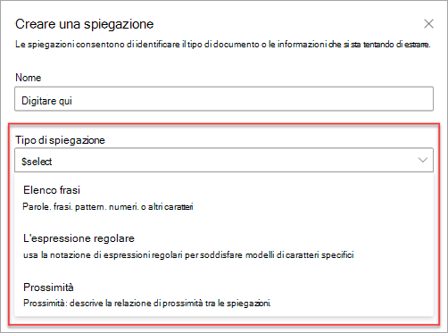 
   
Sono disponibili questi tipi di spiegazione:These explanation types are available:

- **Elenco frasi**: elenco di parole, frasi, numeri o altri caratteri che è possibile usare nel documento o nelle informazioni che si stanno estraendo.**Phrase list**: List of words, phrases, numbers, or other characters you can use in the document or information that you are extracting. Ad esempio, la stringa di testo **Medico richiedente** è inclusa in tutti i documenti di richiesta di visita specialistica che si stanno identificando.For example, the text string **Referring Doctor** is in all Medical Referral documents you are identifying. 

- **Elenco criteri**: elenco di criteri di numeri, lettere o altri caratteri usati per identificare le informazioni che si stanno estraendo.**Pattern list**: List patterns of numbers, letters, or other characters that you can use to identify the information that you are extracting. Ad esempio, è possibile estrarre il **numero di telefono** del medico richiedente da tutti i documenti di richiesta di visita specialistica che si stanno identificando.For example, you can extract the **Phone number** of the referring doctor from all Medical Referral document that you are identifying. 

- **Prossimità**: descrive la relazione di prossimità tra le spiegazioni.**Proximity**: Describes how close explanations are to each other. Ad esempio, un elenco criteri *numero civico* precede immediatamente l'elenco di frasi *nome della via*, senza token intermedi (i token verranno illustrati più avanti in questo articolo).For example, a *street number* pattern list goes right before the *street name* phrase list, with no tokens in between (you'll learn about tokens later in this article). Se si usa il tipo di prossimità, il modello deve includere almeno due spiegazioni, altrimenti l'opzione verrà disabilitata.Using the proximity type requires you to have at least two explanations in your model, or the option will be disabled. 
 
## Elenco frasiPhrase list

Il tipo di spiegazione elenco frasi viene usato generalmente per identificare e classificare un documento tramite il modello.A phrase list explanation type is typically used to identify and classify a document through your model. Come descritto nell'esempio di etichetta *Medico richiedente*, si tratta di una stringa di parole, frasi, numeri o caratteri presente costantemente nei documenti che si stanno identificando.As described in the *Referring Doctor* label example, it is a string of words, phrases, numbers, or characters that is consistently in the documents that you are identifying.

Anche se non è necessario, la spiegazione risulta più efficace se la frase acquisita si trova in una posizione ricorrente nel documento.While not a requirement, you can achieve better success with your explanation if the phrase you are capturing is located in a consistent location in your document. Ad esempio, l'etichetta *Medico richiedente* potrebbe essere situata sempre nel primo paragrafo del documento.For example, the *Referring Doctor* label may be consistently located in the first paragraph of the document.

Se la distinzione tra maiuscole e minuscole è un requisito per identificare l'etichetta, il tipo elenco frasi consente di specificarlo nella spiegazione selezionando la casella di controllo **Solo le maiuscole esatte**.If case sensitivity is a requirement in identifying your label, using the phrase list type allows you to specify it in your explanation by selecting the **Only exact capitalization** checkbox.

   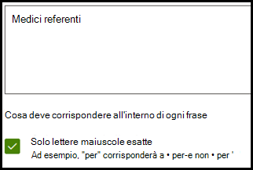 

## Elenchi di criteriPattern lists

Il tipo elenco criteri risulta particolarmente utile quando si crea una spiegazione che identifica ed estrae informazioni da un documento.A pattern list type is especially useful when you create an explanation that identifies and extracts information from a document. Generalmente viene presentato in vari formati, come date, numeri di telefono o numeri di carte di credito.It is typically presented in different formats, such as dates, phone numbers, or credit card numbers. Ad esempio, una data può essere visualizzata in diversi formati (1/1/2020, 1-1-2020, 01/01/20, 01/01/2020, 1 gen 2020 e così via).For example, a date can be displayed in a number of different formats (1/1/2020, 1-1-2020, 01/01/20, 01/01/2020, Jan 1,2020, etc.). La definizione di un elenco di criteri rende più efficace la spiegazione attraverso l'acquisizione di tutte le possibili varianti nei dati che si sta provando a identificare ed estrarre.Defining a pattern list makes your explanation more efficient by capturing any possible variations in the data that you are trying to identify and extract. 

Per l'esempio relativo al **numero di telefono**, estrarre il numero di telefono per ogni medico richiedente da tutti i documenti di richiesta di visita specialistica identificati dal modello.For the **Phone number** sample, extract the phone number for each referring doctor from all Medical Referral documents that the model identifies. Quando si crea la spiegazione, selezionare il tipo Elenco criteri affinché vengano restituiti i vari formati previsti.When you create the explanation, select the Pattern list type to allow the different formats that you may expect to be returned.

   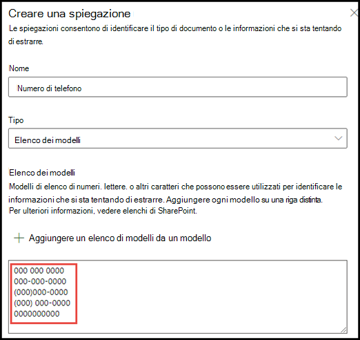

Per questo esempio, selezionare la casella di controllo **Qualsiasi cifra da 0 a 9**.For this sample, select the **Any digit from 0-9** checkbox. Se si seleziona questa opzione, ogni valore "0" usato nell'elenco di criteri verrà riconosciuto come qualsiasi cifra compresa tra 0 e 9.Selecting this recognizes each "0" value used in your pattern list to be any digit from 0 through 9.

   

Analogamente, se si crea un elenco di criteri che include caratteri di testo, selezionare la casella di controllo **Qualsiasi lettera dalla a alla z**.Similarly, if you create a pattern list that includes text characters, select the **Any letter from a-z** checkbox. Se si seleziona questa opzione, ogni carattere "a" usato nell'elenco di criteri verrà riconosciuto come qualsiasi carattere dalla "a" alla "z".Selecting this recognizes each "a" character used in the pattern list to be any character from "a" to "z".

Ad esempio, se si crea un elenco di criteri **Data** e si vuole fare in modo che venga riconosciuto un formato di data come *1 gen 2020*, è necessario:For example, if you create a **Date** pattern list and you want to make sure that a date format such as *Jan 1, 2020* is recognized, you need to:
- Aggiungere *0 aaa 0000* e *00 aaa 0000* all'elenco criteri.Add *aaa 0, 0000* and *aaa 00, 0000* to your pattern list.
- Assicurarsi che sia selezionata anche l'opzione **Qualsiasi lettera dalla a alla z**.Make sure that **Any letter from a-z** is also selected.

   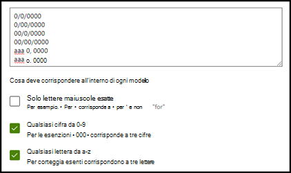

Inoltre, se l'elenco criteri prevede requisiti per le maiuscole, è possibile selezionare la casella di controllo **Solo le maiuscole esatte**.Additionally, if you have capitalization requirements in your pattern list, you have the option to select the **Only exact capitalization** checkbox. Per l'esempio relativo alla data, se il mese deve avere l'iniziale minuscola, è necessario:For the Date example, if you require the first letter of the month to be capitalized, you need to:

- Aggiungere *0 aaa 0000* e *00 aaa 0000* all'elenco criteri.Add *Aaa 0, 0000* and *Aaa 00, 0000* to your pattern list.
- Assicurarsi che sia selezionata anche l'opzione **Solo le maiuscole esatte**.Make sure that **Only exact capitalization** is also selected.

   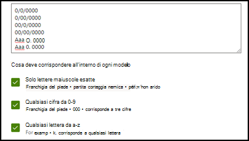

> [!NOTE]
> Anziché creare manualmente una spiegazione elenco criteri, usare la [raccolta spiegazioni](https://docs.microsoft.com/microsoft-365/contentunderstanding/explanation-types-overview#use-explanation-templates) per usare modelli di elenchi di criteri predefiniti per elenchi di criteri comuni, quali *data*, *numero di telefono*, *numero di carta di credito* e così via.Instead of manually creating pattern list explanation, use the [explanation library](https://docs.microsoft.com/microsoft-365/contentunderstanding/explanation-types-overview#use-explanation-templates) to use pre-made pattern list templates for common pattern list, such as *date*, *phone number*, *credit card number*, etc.. 

## ProssimitàProximity 

Il tipo di spiegazione prossimità consente al modello di identificare i dati definendo il rapporto di prossimità rispetto ad altri dati.The proximity explanation type helps your model identify data through defining how close another piece of data is to it. Nel modello, ad esempio, sono state definite due spiegazioni che etichettano il *Numero civico* e il *Numero di telefono* del cliente.For example, in your model, you have defined two explanations that label both the customer *Street address number* and *Phone number*. 

Si nota anche che i numeri di telefono del cliente vengono sempre visualizzati sempre prima del numero civico.You also notice that customer phone numbers always appear before the street address number. 

Davide MilanoAlex Wilburn 
555-555-5555555-555-5555 
One Microsoft WayOne Microsoft Way 
Redmond, WA 98034Redmond, WA 98034 

Usare la spiegazione di prossimità per definire quanto è lontana la spiegazione del numero di telefono, per identificare meglio il numero civico nei documenti.Use the proximity explanation to define how far away the phone number explanation is to better identify the street address number in your documents.

   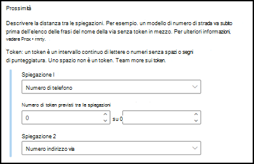 

#### Che cosa sono i token?What are tokens?

Per usare il tipo di spiegazione di prossimità, è necessario comprendere che cos'è un token perché il numero di token è il sistema usato dalla spiegazione di prossimità per misurare la distanza tra una spiegazione e l'altra.In order to use the proximity explanation type, you need to understand what a token is, as the number of tokens is how the proximity explanation measures distance from one explanation to another.  

Un token è una serie continua di lettere e numeri, senza spazi o punteggiatura.A token is a continuous span (no spaces or punctuation) of letters and numbers. Uno spazio NON è un token.A space is NOT a token. Ogni segno di punteggiatura è un token.Each punctuation character is a token. Nella tabella seguente sono illustrati alcuni esempi per determinare il numero di token in una frase.The following table shows some examples of how to determine the number of tokens in a phrase.

|FrasePhrase|Numero di tokenNumber of tokens|SpiegazioneExplanation|
|--|--|--|
|`Dog`|11|Una singola parola senza punteggiatura o spazi.A single word with no punctuation or spaces.|
|`RMT33W`|11|Un numero di localizzazione record.A record locator number. Può contenere numeri e lettere, ma non include segni di punteggiatura.It may have numbers and letters, but does not have any punctuation.|
|`425-555-5555`|55|Un numero di telefono.A phone number. Ogni segno di punteggiatura è un token, quindi `425-555-5555` corrisponderebbe a 5 token:Each punctuation mark is a single token so  `425-555-5555` would be 5 tokens: `425` `-` `555` `-` `5555` |
|`https://luis.ai`|77|`https` `:` `/` `/` `luis` `.` `ai` |

#### Configurare il tipo di spiegazione di prossimitàConfigure the proximity explanation type

Per l'esempio, configurare l'impostazione di prossimità in modo da poter definire l'intervallo del numero di token di distanza tra la spiegazione *Numero di telefono* e la spiegazione *Numero civico*.For the sample, configure the proximity setting so that we can define the range of the number of tokens the *Phone number* explanation is from the *Street address number* explanation.

L'intervallo minimo dovrebbe risultare "0" perché non c'è nessun token tra il numero di telefono e il numero civico.You should see that the minimum range is "0" since there are no tokens between the phone number and street address number.

Dopo alcuni numeri di telefono nei documenti di esempio, invece, è presente la dicitura *(cellulare)*.However, some phone numbers in the sample documents are appended with *(mobile)*.

Luca UdinesiNestor Wilke 
111-111-1111 (cellulare)111-111-1111 (mobile) 
One Microsoft WayOne Microsoft Way 
Redmond, WA 98034Redmond, WA 98034 

In *(cellulare)* sono presenti tre token:There are three tokens in *(mobile)*:

|FrasePhrase|Numero di tokenToken count|
|--|--|
|((|11|
|cellularemobile|22|
|))|33|

Configurare l'impostazione di prossimità su un intervallo compreso tra 0 e 3.Configure the proximity setting to have a range of 0 through 3.

   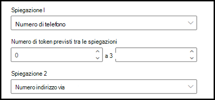 

## Usare modelli di spiegazioneUse explanation templates

Anche se è possibile aggiungere manualmente vari valori dell'elenco di criteri per la spiegazione, può essere molto più semplice usare i modelli predefiniti disponibili nella raccolta di spiegazioni.While you can manually add various pattern list values for your explanation, it can be much easier to use the pre-created templates provided to you in the explanation library.

Ad esempio, invece di aggiungere manualmente tutte le varianti per *Data*, è possibile usare il modello di elenco pattern per *Data*, che include già molti valori di elenchi di criteri:For example, instead of manually adding all the variations for *Date*, you can use the pattern list template for *Date*, that already includes a number of pattern lists values: 

   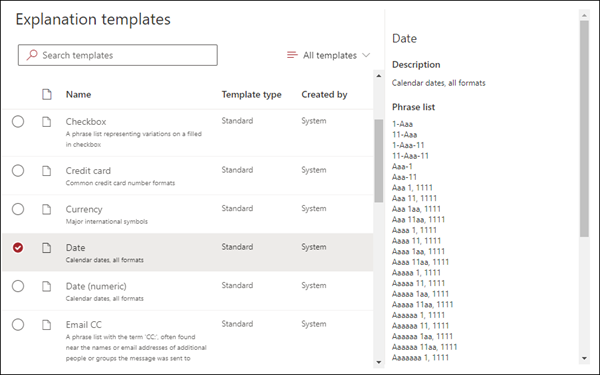 
 
La raccolta di spiegazioni include una serie di spiegazioni elenco di criteri di uso comune, tra cui:The explanation library includes a number of commonly used pattern list explanations, including: 

- DataDate 
- Data (numerico)Date (numeric) 
- OraTime 
- NumeroNumber 
- Numero di telefonoPhone number 
- CAPZip code 
- Prima parola della fraseFirst word of sentence 
- Carta di creditoCredit card 
- Numero di previdenza socialeSocial security number 

Si noti che la raccolta di spiegazioni include anche modelli per le spiegazioni elenco di frasi, tra cui:Note that the explanation library also includes templates for phrase list explanations as well, including:
- Fine della fraseEnd of sentence
- ValutaCurrency

#### Per usare un modello dalla raccolta di spiegazioniTo use a template from the explanation library

1. Nella sezione **Spiegazioni** della pagina **Avvia training** del modello selezionare **Nuovo**, quindi **Da un modello**.From the **Explanations** section of your model's **Train** page, select **New**, then select **From a template**. 

   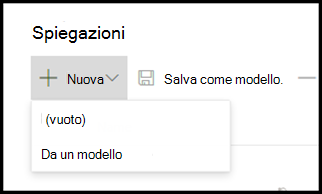 

2.  Nella pagina **Modelli di spiegazione** selezionare la spiegazione da usare, quindi selezionare **Aggiungi**.On the **Explanation templates** page, select the explanation you want to use, and then select **Add**. 

       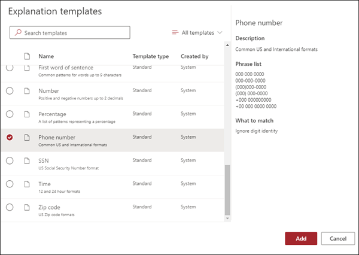 

3. Le informazioni relative al modello selezionato verranno visualizzate nella pagina **Crea spiegazione**.The information for the template you selected will display on the **Create an explanation** page. Se necessario, modificare il nome della spiegazione e aggiungere o rimuovere voci nell'elenco criteri.If needed, edit the explanation name, and add or remove items from the pattern list.   

   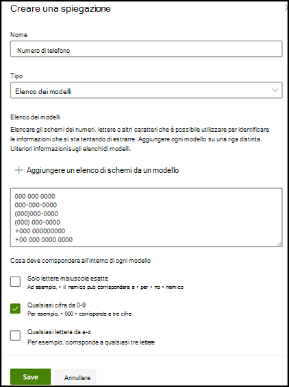 

4. Al termine, selezionare **Salva**.When finished, select **Save**.
