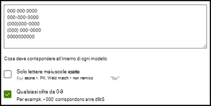

# Informazioni sui tipi di spiegazione in Microsoft SharePoint SyntexExplanation types in Microsoft SharePoint Syntex

Le spiegazioni vengono usate per definire meglio le informazioni da etichettare ed estrarre nei modelli di analisi dei documenti in Microsoft SharePoint Syntex.Explanations are used to help to define the information you want to label and extract in your document understanding models in Microsoft SharePoint Syntex. Quando si crea una spiegazione, è necessario selezionare un tipo di spiegazione.When you create an explanation, you need to select an explanation type. Questo articolo contiene informazioni utili per comprendere i diversi tipi di spiegazione e come vengono usati.This article helps you understand the different explanation types and how they're used.

Sono disponibili questi tipi di spiegazione:These explanation types are available:

- [**Elenco frasi**](#phrase-list): elenco di parole, frasi, numeri o altri caratteri che è possibile usare nel documento o nelle informazioni che si stanno estraendo.[**Phrase list**](#phrase-list): List of words, phrases, numbers, or other characters you can use in the document or information that you're extracting. Ad esempio, la stringa di testo *medico richiedente* è inclusa in tutti i documenti di richiesta di visita specialistica che si stanno identificando.For example, the text string *referring doctor* is in all Medical Referral documents you're identifying. Oppure il *numero di telefono* del medico richiedente da tutti i documenti di richiesta di visita specialistica che si stanno identificando.Or the *phone number* of the referring doctor from all Medical Referral documents that you're identifying.

- [**Espressione regolare**](#regular-expression): usa una notazione di corrispondenza dei criteri per trovare modelli di carattere specifici.[**Regular expression**](#regular-expression): Uses a pattern-matching notation to find specific character patterns. Ad esempio, è possibile usare un'espressione regolare per trovare tutte le istanze di un criterio *indirizzo di posta elettronica di* in un set di documenti.For example, you can use a regular expression to find all instances of an *email address* pattern in a set of documents.

- [**Prossimità**](#proximity): descrive la relazione di prossimità tra le spiegazioni.[**Proximity**](#proximity): Describes how close explanations are to each other. Ad esempio, un elenco frasi *numero civico* precede immediatamente l'elenco frasi *nome della via*, senza token intermedi (i token verranno illustrati più avanti in questo articolo).For example, a *street number* phrase list goes right before the *street name* phrase list, with no tokens in between (you'll learn about tokens later in this article). Se si usa il tipo di prossimità, il modello deve includere almeno due spiegazioni, altrimenti l'opzione verrà disabilitata.Using the proximity type requires you to have at least two explanations in your model or the option will be disabled.

## Elenco frasiPhrase list

Il tipo di spiegazione elenco frasi viene usato generalmente per identificare e classificare un documento tramite il modello.A phrase list explanation type is typically used to identify and classify a document through your model. Come descritto nell'esempio di etichetta *medico richiedente*, si tratta di una stringa di parole, frasi, numeri o caratteri presente costantemente nei documenti che si stanno identificando.As described in the *referring doctor* label example, it's a string of words, phrases, numbers, or characters that is consistently in the documents that you're identifying.

Anche se non è necessario, la spiegazione risulta più efficace se la frase acquisita si trova in una posizione ricorrente nel documento.While not a requirement, you can achieve better success with your explanation if the phrase you're capturing is located in a consistent location in your document. Ad esempio, l'etichetta *medico richiedente* potrebbe essere situata sempre nel primo paragrafo del documento.For example, the *referring doctor* label might be consistently located in the first paragraph of the document. È possibile inoltre usare l'impostazione avanzata **[Configurare la posizione delle frasi nel documento](explanation-types-overview.md#configure-where-phrases-occur-in-the-document)** per selezionare aree specifiche in cui è posizionata la frase, soprattutto se la frase può essere presente in più posizioni nel documento.You can also use the **[Configure where phrases occur in the document](explanation-types-overview.md#configure-where-phrases-occur-in-the-document)** advanced setting to select specific areas where the phrase is located, especially if there's a chance that the phrase might occur in multiple locations in your document.

Se la distinzione tra maiuscole e minuscole è un requisito per identificare l'etichetta, il tipo elenco frasi consente di specificarlo nella spiegazione selezionando la casella di controllo **Solo le maiuscole esatte**.If case sensitivity is a requirement in identifying your label, using the phrase list type allows you to specify it in your explanation by selecting the **Only exact capitalization** checkbox.

Un tipo di frase è utile soprattutto quando si crea una spiegazione che identifichi ed estragga informazioni in formati diversi, come date, numeri di telefono e numeri di carte di credito.A phrase type is especially useful when you create an explanation that identifies and extracts information in different formats, such as dates, phone numbers, and credit card numbers. Ad esempio, una data può essere visualizzata in molti formati (1/1/2020, 1-1-2020, 01/01/20, 01/01/2020 o 1 gen 2020).For example, a date can be displayed in many different formats (1/1/2020, 1-1-2020, 01/01/20, 01/01/2020, or Jan 1,2020). La definizione di un elenco frasi rende più efficace la spiegazione attraverso l'acquisizione di tutte le possibili varianti nei dati che si sta provando a identificare ed estrarre.Defining a phrase list makes your explanation more efficient by capturing any possible variations in the data that you're trying to identify and extract.

Per l'esempio relativo al *numero di telefono*, estrarre il numero di telefono per ogni medico richiedente da tutti i documenti di richiesta di visita specialistica identificati dal modello.For the *phone number* example, you extract the phone number for each referring doctor from all Medical Referral documents that the model identifies. Quando si crea la spiegazione, digitare i vari formati in cui può essere visualizzato un numero di telefono nel documento, così da poter acquisire tutte le possibili variabili.When you create the explanation, type the different formats a phone number might display in your document so that you're able to capture possible variations.

Nel caso di questo esempio, in **Impostazioni avanzate** selezionare la casella di controllo **Qualsiasi cifra da 0 a 9** per riconoscere ogni valore "0" usato nell'elenco frasi come qualsiasi cifra da 0 a 9.For this example, in **Advanced Settings** select the **Any digit from 0-9** checkbox to recognize each "0" value used in your phrase list to be any digit from 0 through 9.

Analogamente, se si crea un elenco frasi che include caratteri di testo, selezionare la casella di controllo **Qualsiasi lettera dalla a alla z** per riconoscere ogni carattere "a" usato nell'elenco di frasi per essere qualsiasi carattere compreso dalla "a" alla "z".Similarly, if you create a phrase list that includes text characters, select the **Any letter from a-z** checkbox to recognize each "a" character used in the phrase list to be any character from "a" to "z".

Ad esempio, se si crea un elenco frasi **Data** e si vuole fare in modo che venga riconosciuto un formato di data come *1 gen 2020*, è necessario:For example, if you create a **Date** phrase list and you want to make sure that a date format such as *Jan 1, 2020* is recognized, you need to:

- Aggiungere *0 aaa 0000* e *00 aaa 0000* all'elenco frasi.Add *aaa 0, 0000* and *aaa 00, 0000* to your phrase list.
- Assicurarsi che sia selezionata anche l'opzione **Qualsiasi lettera dalla a alla z**.Make sure that **Any letter from a-z** is also selected.

Se l'elenco frasi prevede requisiti per le maiuscole, è possibile selezionare la casella di controllo **Solo le maiuscole esatte**.If you have capitalization requirements in your phrase list, you can select the **Only exact capitalization** checkbox. Per l'esempio relativo alla data, se il mese deve avere l'iniziale minuscola, è necessario:For the date example, if you require the first letter of the month to be capitalized, you need to:

- Aggiungere *0 aaa 0000* e *00 aaa 0000* all'elenco frasi.Add *Aaa 0, 0000* and *Aaa 00, 0000* to your phrase list.
- Assicurarsi che sia selezionata anche l'opzione **Solo le maiuscole esatte**.Make sure that **Only exact capitalization** is also selected.

> [!NOTE]
> Anziché creare manualmente una spiegazione elenco frasi, usare la [raccolta spiegazioni](explanation-types-overview.md#use-explanation-templates) per usare modelli di elenchi frasi per elenchi frasi comuni, quali *data*, *numero di telefono* o *numero di carta di credito*.Instead of manually creating a phrase list explanation, use the [explanation library](explanation-types-overview.md#use-explanation-templates) to use phrase list templates for a common phrase list, such as *date*, *phone number*, or *credit card number*.

## Espressione regolareRegular expression

Un tipo di spiegazione di espressione regolare consente di creare criteri che consentono di trovare e identificare determinate stringhe di testo nei documenti.A regular expression explanation type allows you to create patterns that help find and identify certain text strings in documents. È possibile usare le espressioni regolari per analizzare rapidamente grandi quantità di testo per:You can use regular expressions to quickly parse large amounts of text to:

- Trovare criteri di caratteri specifici.Find specific character patterns.
- Convalidare il testo per assicurarsi che corrisponda a un criterio predefinito, ad esempio un indirizzo di posta elettronica.Validate text to ensure that it matches a predefined pattern (such as an email address).
- Estrazione, modifica, sostituzione o eliminazione di sottostringhe di testo.Extract, edit, replace, or delete text substrings.

Un’espressione regolare è utile soprattutto quando si crea una spiegazione che identifichi ed estragga informazioni in formati simili, ad esempio indirizzi di posta elettronica, numeri di conto corrente bancario o URL.A regular expression type is especially useful when you create an explanation that identifies and extracts information in similar formats, such as email addresses, bank account numbers, or URLs. Ad esempio, un indirizzo di posta elettronica, come megan@contoso.com, viene visualizzato con un determinato modello ("megan" è la prima parte e "com" è l'ultima parte).For example, an email address, such as megan@contoso.com, is displayed in a certain pattern ("megan" is the first part, and "com" is the last part).

L'espressione regolare per un indirizzo di posta elettronica è: **[A-Za-z0-9._%-]+@[A-Za-z0-9.-]+. [A-Za-z]{2,6}**.The regular expression for an email address is: **[A-Za-z0-9._%-]+@[A-Za-z0-9.-]+.[A-Za-z]{2,6}**.

Questa espressione è costituita da cinque parti, in questo ordine:This expression consists of five parts, in this order:

1. Qualsiasi dei caratteri speciali seguenti:Any amount of the following characters:

   a. Lettere dalla a alla za. Letters from a to z

   b. Numeri da 0 a 9b. Numbers from 0-9

   c. Punto, carattere di sottolineatura, percentuale o trattinoc. Period, underscore, percent, or dash

2. Il simbolo @The @ symbol

3. Qualsiasi quantità di caratteri della prima parte dell'indirizzo di posta elettronicaAny amount of the same characters as the first part of the email address

4. Un puntoA period

5. Da due a sei lettereTwo to six letters

Per aggiungere un tipo di spiegazione di espressione regolare:To add a regular expression explanation type:

1. Dal pannello **Crea una spiegazione**, in **Tipo di spiegazione**, selezionare **Espressione regolare**.From the **Create an explanation** panel, under **Explanation type**, select **Regular expression**.

   

2. È possibile digitare un'espressione nella casella di testo **Espressione regolare** o selezionare **Aggiungi un'espressione regolare da un modello**.You can either type an expression in the **Regular expression** text box or select **Add a regular expression from a template**.

   Quando si aggiunge un'espressione regolare usando un modello, il nome e l'espressione regolare vengono aggiunti automaticamente alla casella di testo.When you add a regular expression by using a template, it automatically adds the name and the regular expression to the text box. Ad esempio, se si sceglie il modello **Indirizzo di posta elettronica**, il pannello **Crea una spiegazione** verrà popolato.For example, if you choose the **Email address** template, the **Create an explanation** panel will be populated.

   

### LimitazioniLimitations

La tabella seguente mostra le opzioni relative ai caratteri in linea attualmente non disponibili per l'utilizzo nei modelli di espressioni regolari.The following table shows inline character options that currently are not available for use in regular expression patterns.

|OpzioneOption  |StatoState  |Funzionalità correnteCurrent functionality  |
|---------|---------|---------|
|Distinzione tra maiuscole e minuscoleCase sensitivity | Attualmente non supportato.Currently not supported. | Per le corrispondenze non viene fatta distinzione tra maiuscole e minuscole.All matches performed are case-insensitive.  |
|Ancoraggi di rigaLine anchors     | Attualmente non supportato.Currently not supported. | Non è possibile specificare una posizione specifica in una stringa in cui deve essere trovata una corrispondenza.Unable to specify a specific position in a string where a match must occur.   |

## ProssimitàProximity

Il tipo di spiegazione prossimità consente al modello di identificare i dati definendo il rapporto di prossimità rispetto ad altri dati.The proximity explanation type helps your model identify data by defining how close another piece of data is to it. Nel modello, ad esempio, sono state definite due spiegazioni che etichettano il *Numero civico* e il *Numero di telefono* del cliente.For example, in your model say you have defined two explanations that label both the customer *street address number* and *phone number*.

Si nota anche che i numeri di telefono del cliente vengono sempre visualizzati sempre prima del numero civico.Notice that customer phone numbers always appear before the street address number.

Davide MilanoAlex Wilburn 
555-555-5555555-555-5555 
One Microsoft WayOne Microsoft Way 
Redmond, WA 98034Redmond, WA 98034 

Usare la spiegazione di prossimità per definire quanto è lontana la spiegazione del numero di telefono, per identificare meglio il numero civico nei documenti.Use the proximity explanation to define how far away the phone number explanation is to better identify the street address number in your documents.

#### Che cosa sono i token?What are tokens?

Per usare il tipo di spiegazione di prossimità, è necessario comprendere che cos'è un token.To use the proximity explanation type, you need to understand what a token is. Il numero di token è il sistema usato dalla spiegazione di prossimità per misurare la distanza tra una spiegazione e l'altra.The number of tokens is how the proximity explanation measures distance from one explanation to another. Un token è una serie continua di lettere e numeri, senza spazi o punteggiatura.A token is a continuous span (not including spaces or punctuation) of letters and numbers.

Nella tabella seguente sono illustrati alcuni esempi per determinare il numero di token in una frase.The following table shows examples for how to determine the number of tokens in a phrase.

|FrasePhrase|Numero di tokenNumber of tokens|SpiegazioneExplanation|
|--|--|--|
|`Dog`|11|Una singola parola senza punteggiatura o spazi.A single word with no punctuation or spaces.|
|`RMT33W`|11|Un numero di localizzazione record.A record locator number. Può includere numeri e lettere, ma non include segni di punteggiatura.It might include numbers and letters, but doesn't have punctuation.|
|`425-555-5555`|55|Un numero di telefono.A phone number. Ogni segno di punteggiatura è un token, quindi `425-555-5555` corrisponde a 5 token:Each punctuation mark is a single token, so `425-555-5555` is 5 tokens: `425` `-` `555` `-` `5555` |
|`https://luis.ai`|77|`https` `:` `/` `/` `luis` `.` `ai` |

#### Configurare il tipo di spiegazione di prossimitàConfigure the proximity explanation type

Per questo esempio, configurare l'impostazione di prossimità in modo da poter definire l'intervallo del numero di token di distanza nella spiegazione *numero di telefono* dalla spiegazione *numero civico*.For the example, configure the proximity setting to define the range of the number of tokens in the *phone number* explanation from the *street address number* explanation. Si noti che l'intervallo minimo dovrebbe risultare "0" perché non c'è nessun token tra il numero di telefono e il numero civico.Notice that the minimum range is "0", because there are no tokens between the phone number and street address number.

Dopo alcuni numeri di telefono nei documenti di esempio, invece, è presente la dicitura *(cellulare)*.But some phone numbers in the sample documents are appended with *(mobile)*.

Luca UdinesiNestor Wilke 
111-111-1111 (cellulare)111-111-1111 (mobile) 
One Microsoft WayOne Microsoft Way 
Redmond, WA 98034Redmond, WA 98034 

In *(cellulare)* sono presenti tre token:There are three tokens in *(mobile)*:

|FrasePhrase|Numero di tokenToken count|
|--|--|
|((|11|
|cellularemobile|22|
|))|33|

Configurare l'impostazione di prossimità su un intervallo compreso tra 0 e 3.Configure the proximity setting to have a range of 0 through 3.

## Configurare la posizione delle frasi nel documentoConfigure where phrases occur in the document

Quando si crea una spiegazione, per impostazione predefinita viene cercata nell'intero documento la frase che si vuole estrarre.When you create an explanation, by default the entire document is searched for the phrase you're trying to extract. Tuttavia, è possibile usare l'impostazione avanzata **Dove si trovano queste frasi** per isolare una posizione specifica nel documento in cui si trova una frase.However, you can use the **Where these phrases occur** advanced setting to help in isolating a specific location in the document that a phrase occurs. Questa impostazione è utile nei casi in cui istanze simili di una frase potrebbero comparire in un altro punto del documento e si vuole verificare che sia selezionata quella corretta.This setting is useful in situations where similar instances of a phrase might appear somewhere else in the document, and you want to make sure that the correct one is selected.

Facendo riferimento all'esempio relativo al documento di richiesta di visita specialistica il *medico richiedente* viene sempre menzionato nel primo paragrafo del documento.Referring to our Medical Referral document example, the *referring doctor* is always mentioned in the first paragraph of the document. Con l'impostazione **Dove si trovano queste frasi**, in questo esempio è possibile configurare la spiegazione per la ricerca di questa etichetta solo nella sezione iniziale del documento o in qualsiasi altra posizione in cui potrebbe essere presente.With the **Where these phrases occur** setting, in this example you can configure your explanation to search for this label only in the beginning section of the document, or any other location in which it might occur.

Per questa impostazione è possibile scegliere le opzioni seguenti:You can choose the following options for this setting:

- Ovunque nel file: la frase viene cercata nell'intero documento.Anywhere in the file: The entire document is searched for the phrase.

- Inizio del file: la ricerca viene eseguita dall'inizio del documento fino alla posizione della frase.Beginning of the file:  The document is searched from the beginning to the phrase location.

   

    Nel visualizzatore è possibile modificare manualmente la casella di selezione in modo da includere la posizione in cui si trova la fase.In the viewer, you can manually adjust the select box to include the location where the phase occurs. Il valore **Posizione finale** verrà aggiornato per mostrare il numero di token inclusi nell'area selezionata.The **End position** value will update to show the number of tokens your selected area includes. È possibile aggiornare il valore **Posizione finale** anche per modificare l'area selezionata.You can update the **End position** value as well to adjust the selected area.

   

- Fine del file: la ricerca viene eseguita dalla fine del documento fino alla posizione della frase.End of the file: The document is searched from the end to the phrase location.

   

    Nel visualizzatore è possibile modificare manualmente la casella di selezione in modo da includere la posizione in cui si trova la fase.In the viewer, you can manually adjust the select box to include the location where the phase occurs. Il valore **Posizione iniziale** verrà aggiornato per mostrare il numero di token inclusi nell'area selezionata.The **Starting position** value will update to show the number of tokens your selected area includes. È possibile aggiornare il valore Posizione iniziale anche per modificare l'area selezionata.You can update the Starting position value as well to adjust the selected area.

   

- Intervallo personalizzato: la posizione della frase viene cercata entro un intervallo specificato all'interno del documento.Custom range: The document is searched within a specified range for the phrase location.

   

    Nel visualizzatore è possibile modificare manualmente la casella di selezione in modo da includere la posizione in cui si trova la fase.In the viewer, you can manually adjust the select box to include the location where the phase occurs. Per questa impostazione è necessario selezionare una posizione di **Inizio** e di **Fine**.For this setting, you need to select a **Start** and an **End** position. Questi valori rappresentano il numero di token dall'inizio del documento.These values represent the number of tokens from the beginning of the document. Anche se è possibile immettere manualmente questi valori, è più facile modificare manualmente la casella di selezione nel visualizzatore.While you can manually enter in these values, it's easier to manually adjust the select box in the viewer.

## Usare modelli di spiegazioneUse explanation templates

Anche se è possibile aggiungere manualmente vari valori dell'elenco frasi per la spiegazione, può essere più semplice usare i modelli disponibili nella raccolta di spiegazioni.While you can manually add various phrase list values for your explanation, it can be easier to use the templates provided to you in the explanation library.

Ad esempio, invece di aggiungere manualmente tutte le varianti per *data*, è possibile usare il modello con l’elenco frasi per *data*, poiché include già molti valori:For example, instead of manually adding all the variations for *date*, you can use the phrase list template for *date* because it already includes many phrase lists values:

La raccolta di spiegazioni include spiegazioni di *elenchi frasi* di uso comune, tra cui:The explanation library includes commonly used *phrase list* explanations, including:

- Data: date del Calendario, tutti i formati.Date: Calendar dates, all formats. Include testo e numeri, ad esempio &quot;9 dic 2020&quot;.Includes text and numbers (for example, &quot;Dec 9, 2020").
- Data (numerica): date del Calendario, tutti i formati.Date (numeric): Calendar dates, all formats. Include numeri, (ad esempio 1-11-2020).Includes numbers (for example, 1-11-2020).
- Ora: formati a 12 e 24 ore.Time: 12 and 24 hour formats.
- Numero: numeri positivi e negativi fino a 2 cifre decimali.Number: Positive and negative numbers up to two decimals.
- Percentuale: un elenco di criteri che rappresentano una percentuale.Percentage: A list of patterns representing a percentage. Ad esempio, 1%, 11%, 100%, o 11.11%.For example, 1%, 11%, 100%, or 11.11%.
- Numero di telefono: formati comuni degli Stati Uniti e internazionali.Phone number: Common US and International formats. Ad esempio, 000 000 0000, 000-000-0000, (000)000-0000, o (000) 000-0000.For example, 000 000 0000, 000-000-0000, (000)000-0000, or (000) 000-0000.
- Codice postale ZIP: formati di codice postale ZIP degli Stati Uniti.Zip code: US Zip code formats. Ad esempio: 11111, 11111-1111.For example, 11111, 11111-1111.
- Prima parola della frase: criteri comuni per parole con un massimo di nove caratteri.First word of sentence: Common patterns for words up to nine characters.
- Fine della frase: punteggiatura comune per terminare una frase.End of sentence: Common punctuation for end of a sentence.
- Carta di credito: formati comuni per i numeri di carta di credito.Credit card: Common credit card number formats. Ad esempio: 1111-1111-1111-1111.For example, 1111-1111-1111-1111.
- Numero di previdenza sociale: formato del numero di previdenza sociale degli Stati Uniti, ad esempio 111-11-1111.Social security number: US Social Security Number format. For example, 111-11-1111.
- Casella di controllo: un elenco frasi che rappresenta le varianti di una casella di controllo spuntata.Checkbox: A phrase list representing variations on a filled in checkbox. Ad esempio: _X_, _ _X_.For example, _X_, _ _X_.
- Valuta: principali simboli internazionali.Currency: Major international symbols. Ad esempio: $.For example, $.
- Cc del messaggio di posta elettronica: un elenco frasi con il termine "Cc:", spesso collocato accanto ai nomi o agli indirizzi di posta elettronica di altre persone o gruppi a cui è stato inviato il messaggio.Email CC: A phrase list with the term 'CC:', often found near the names or email addresses of other people or groups the message was sent to.
- Data del messaggio di posta elettronica: un elenco frasi con il termine "Inviato il:", spesso collocato accanto alla data di invio del messaggio.Email date: A phrase list with the term 'Sent on:', often found near the date the email was sent.
- Saluto del messaggio di posta elettronica: formule di apertura comuni per i messaggi di posta elettronica.Email greeting: Common opening lines for emails.
- Destinatario del messaggio di posta elettronica: un elenco frasi con il termine "A:", spesso collocato accanto ai nomi o agli indirizzi di posta elettronica delle persone o dei gruppi a cui è stato inviato il messaggio.Email recipient: A phrase list with the term 'To:', often found near the names or email addresses of people or groups the message was sent to.
- Mittente del messaggio di posta elettronica: un elenco frasi con il termine "Da:", spesso collocato accanto al nome o all'indirizzo di posta elettronica del mittente.Email sender: A phrase list with the term 'From:', often found near the sender's name or email address.
- Oggetto del messaggio di posta elettronica: un elenco frasi con il termine "Oggetto:", spesso collocato accanto all'oggetto del messaggio.Email subject: A phrase list with the term 'Subject:', often found near the email's subject.

La raccolta di spiegazioni include anche spiegazioni di *espressioni regolari* di uso comune, tra cui:The explanation library also includes commonly used *regular expression* explanations, including:

- Numeri da 6 a 17 cifre: corrisponde a un numero qualsiasi di lunghezza compresa tra 6 e 17 cifre.6 to 17 digit numbers: Matches any number from 6 to 17 digits long. I numeri di conto corrente bancario statunitense sono adatti a questo criterio.US bank account numbers fit this pattern.
- Indirizzo di posta elettronica: corrisponde a un tipo comune di indirizzo di posta elettronica come meganb@contoso.com.Email address: Matches a common type of email address like meganb@contoso.com.
- Codice identificativo del contribuente statunitense: corrisponde a un numero di tre cifre che inizia con 9 seguito da un numero di 6 cifre che inizia con 7 o 8.US taxpayer ID number: Matches a three-digit number starting with 9 followed by a 6 digit number starting with 7 or 8.
- Indirizzo Web (URL): corrisponde al formato di un indirizzo Web, a partire http:// o https://.Web address (URL): Matches the format of a web address, starting with http:// or https://.

Inoltre, la raccolta di spiegazioni include tre tipi di modello automatico che funzionano con i dati etichettati nei file di esempio:In addition, the explanation library includes three automatic template types that work with the data you've labeled in your example files:

- Dopo l'etichetta: le parole o i caratteri dopo le etichette nei file di esempio.After label: The words or characters that occur after the labels in the example files.
- Prima dell'etichetta: le parole o i caratteri prima delle etichette nei file di esempio.Before label: The words or characters that occur before the labels in the example files.
- Etichette: fino alle prime 10 etichette dei file di esempio.Labels: Up to the first 10 labels from the example files.

Al fine di comprendere il funzionamento delle etichette, nell’esempio che segue verrà usato il modello di spiegazione Prima dell’etichetta che consente di fornire al modello altre informazioni per ottenere una corrispondenza più accurata.To give you an example of how automatic templates work, in the following example file, we'll use the Before label explanation template to help give the model more information to get a more accurate match.

Quando si seleziona il modello di spiegazione Prima dell'etichetta, questo cerca il primo set di parole visualizzato prima dell'etichetta nei file di esempio.When you select the Before label explanation template, it will look for the first set of words that appear before the label in your example files. Le parole identificate nel primo file di esempio sono "Dal”.In the example, the words that are identified in the first example file is "As of".

È possibile selezionare **Aggiungi** per creare una spiegazione del modello.You can select **Add** to create an explanation from the template.  Man mano che si aggiungono altri file di esempio, vengono identificate e aggiunte altre parole all'elenco frasi.As you add more example files, additional words will be identified and added to the phrase list.

#### Per usare un modello dalla raccolta di spiegazioniTo use a template from the explanation library

1. Nella sezione **Spiegazioni** della pagina **Avvia training** del modello selezionare **Nuovo**, quindi **Da un modello**.From the **Explanations** section of your model's **Train** page, select **New**, then select **From a template**.

   

2.  Nella pagina **Modelli di spiegazione** selezionare la spiegazione da usare, quindi selezionare **Aggiungi**.On the **Explanation templates** page, select the explanation you want to use, then select **Add**.

    

3. Le informazioni relative al modello selezionato sono visualizzate nella pagina **Crea spiegazione**.The information for the template you selected displays on the **Create an explanation** page. Se necessario, modificare il nome della spiegazione e aggiungere o rimuovere le voci dall'elenco frasi.If needed, edit the explanation name and add or remove items from the phrase list.

    

4. Al termine, selezionare **Salva**.When finished, select **Save**.