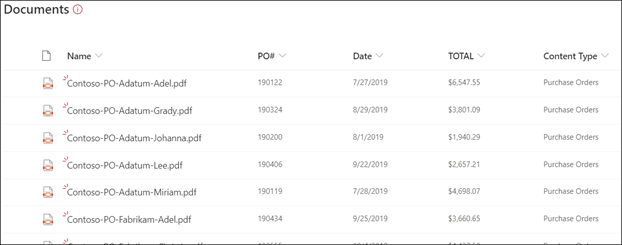

# Panoramica dell'elaborazione di moduliForm processing overview

  

Microsoft SharePoint Syntex usa l’elaborazione di moduli di [AI Builder](https://docs.microsoft.com/ai-builder/overview) in Microsoft PowerApps per creare modelli all'interno delle raccolte documenti di SharePoint.Microsoft SharePoint Syntex uses Microsoft PowerApps [AI Builder](https://docs.microsoft.com/ai-builder/overview) form processing to create models within SharePoint document libraries.

È possibile usare l'elaborazione dei moduli di AI Builder per creare modelli di intelligenza artificiale che usano la tecnologia di apprendimento automatico per identificare ed estrarre coppie chiave-valore e dati tabella da documenti strutturati o semi strutturati, ad esempio moduli e fatture.You can use AI Builder form processing to create AI models that use machine learning technology to identify and extract key-value pairs and table data from structured or semi-structured  documents, like forms and invoices.

Spesso le organizzazioni ricevono un gran numero di fatture da diverse origini, ad esempio via posta, fax, posta elettronica e così via. L'elaborazione di tali documenti e la loro immissione manuale in un database possono richiedere una considerevole quantità di tempo.Organizations often receive invoices in large quantities from a variety of sources, such as mail, fax, email, etc. Processing these documents and manually entering them into a database can take a considerable amount of time. Tramite l’uso dell’intelligenza artificiale, l'elaborazione dei moduli automatizza il processo di estrazione del testo, le coppie chiave-valore e le tabelle dai documenti.By using AI to extract the text, key/value pairs, and tables from your documents, form processing automates this process. 

> [!NOTE]
> Per altri esempi di scenari di elaborazione dei moduli, vedere[Adozione di SharePoint Syntex: guida introduttiva](https://docs.microsoft.com/microsoft-365/contentunderstanding/adoption-getstarted#form-processing-scenario-example).See the [SharePoint Syntex adoption: Get started guide](https://docs.microsoft.com/microsoft-365/contentunderstanding/adoption-getstarted#form-processing-scenario-example) for more information about form processing scenario examples.

Ad esempio, è possibile creare un modello di elaborazione moduli che identifichi tutti i documenti relativi agli ordini di acquisto caricati nella raccolta documenti.For example, you can create a form processing model that identifies all purchase order documents that are uploaded to the document library. Da ogni ordine di acquisto è quindi possibile estrarre e visualizzare dati specifici importanti per l'utente, come il*numero ordine d’acquisto*, la *data* o l’*ammontare totale*.From each purchase order you can then extract and display specific data that is important to you, such as *PO Number*, *Date*, or *Total Cost*.

   

È anche possibile usare i file di esempio per eseguire il training del modello e definire le informazioni da estrarre dal modulo.You can also use example files to train your model and define the information to be extracted from your form. Il layout del documento viene acquisito eseguendo il training del modello che apprende come estrarre i dati da posizioni simili nel modulo, poiché queste hanno un layout strutturato analogo.The layout of your document is learned by training your model, and it learns to extract your data from similar locations in your forms since they have a similar structured layout. 

Per iniziare, sono necessari almeno cinque moduli.You need a minimum of five form documents to get started. AI Builder analizza i file di esempio per individuare le coppie chiave-valore e poi identifica manualmente quelli che non sono stati rilevati.AI building analyzes your example files for key-value pairs, and then manually identifies the ones that may not have been detected.  AI Builder consente di testare l’accuratezza del modello nei file di esempio.AI builder lets you test the accuracy of your model on your example files.

Dopo aver eseguito il training del modello e averlo pubblicato, è possibile usarlo per creare un [flusso di Power Automate](https://docs.microsoft.com/power-automate/getting-started) che viene eseguito dopo aver caricato un file nella raccolta documenti di SharePoint.After you train and publish your model, use it to create a [Power Automate Flow](https://docs.microsoft.com/power-automate/getting-started) that runs after a file is uploaded to the SharePoint document library. Estrae quindi i dati identificati nel modello.It then extracts data that has been identified in the model. I dati estratti saranno visualizzati nelle colonne di visualizzazione della raccolta documenti del modello.The extracted data will display in columns in your model's document library view.

L’utente usa i file di esempio per eseguire il training del modello e definire le informazioni da estrarre dal modulo.You use example files to train your model and define the information to be extracted from your form. Il layout del documento viene acquisito eseguendo il training del modello.The layout of your document is learned by training your model. Per iniziare, sono necessari solo cinque moduli.You only need five form documents to get started. AI Builder analizza i file di esempio per individuare le coppie chiave-valore e l’utente può identificare manualmente quelli che non sono stati rilevati.AI Builder will analyze your example files for key-value pairs, and you can also manually identify ones that may not have been detected.  AI Builder consente di testare l’accuratezza del modello nei file di esempio.AI builder lets you test the accuracy of your model on your example files.

Dopo aver eseguito il training del modello e averlo pubblicato, quest’ultimo crea un [flusso di Power Automate](https://docs.microsoft.com/power-automate/getting-started).After you train and publish your model, your model creates a [Power Automate Flow](https://docs.microsoft.com/power-automate/getting-started). Il flusso viene eseguito quando un file è caricato nella raccolta documenti di SharePoint ed estrarrà i dati che sono stati identificati nel modello.The flow runs when a file is uploaded to the SharePoint document library and will extract data that has been identified in the model. I dati estratti saranno visualizzati nelle colonne di visualizzazione della raccolta documenti del modello.The extracted data will display in columns in your model's document library view.

Gli amministratori di Office 365 devono [abilitare l'elaborazione del modulo](https://docs.microsoft.com/microsoft-365/contentunderstanding/set-up-content-understanding#to-set-up-content-understanding) per la raccolta documenti di SharePoint in modo che gli utenti possano [creare un modello di elaborazione moduli](create-a-form-processing-model.md) in essa.An Office 365 admin needs to [enable Form processing](https://docs.microsoft.com/microsoft-365/contentunderstanding/set-up-content-understanding#to-set-up-content-understanding) for the SharePoint document library for users to be able to [create a form processing model](create-a-form-processing-model.md) in it. È possibile selezionare i siti durante l'installazione o dopo la configurazione nelle impostazioni di gestione.You can select the sites during setup, or after setup in your management settings.

## Vedere ancheSee Also
  
[Documentazione di Power AutomatePower Automate documentation](https://docs.microsoft.com/power-automate/)

[Creare un modello di elaborazione moduliCreate a form processing model](create-a-form-processing-model.md)

[Panoramica sull'analisi dei documentiDocument understanding overview](document-understanding-overview.md)

[Formazione: migliorare le prestazioni aziendali con AI BuilderTraining: Improve business performance with AI Builder](https://docs.microsoft.com/learn/paths/improve-business-performance-ai-builder/?source=learn)
