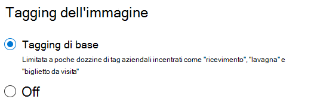

# Aggiunta di tag alle immagini in SharePoint SyntexImage tagging in SharePoint Syntex

Con l'aggiunta di tag di immagini in SharePoint Syntex, gli utenti possono trovare immagini attraverso la ricerca per tag di immagine e creare flussi di lavoro in base ai tag di immagine.With image tagging in SharePoint Syntex, users can find images through search by searching on image tags, and create workflows based on image tags. Per impostazione predefinita, l’opzione di base dell’aggiunta di tag alle immagini è attivata per SharePoint e OneDrive.By default, basic image tagging is turned on for SharePoint and OneDrive. Le immagini caricate nelle due posizioni vengono analizzate e aggiunti i tag automaticamente, se disponibili, da un elenco di 37 tag di base.Images uploaded to either location are automatically scanned and applicable tags are applied, if available, from a list of 37 basic tags. Gli utenti possono trovare le immagini tramite la ricerca in base al tag di un’immagine.Users can find images through search by searching on the image tags.

Quando un utente carica un'immagine, il processo di aggiunta di tag viene eseguito automaticamente.When a user uploads an image, the  tagging process runs automatically. Se si modifica un'immagine, il processo viene eseguito di nuovo per aggiornare i tag.If an image is edited, the tagging process runs again to update the tags.

Gli utenti con autorizzazioni di accesso al file di immagine possono visualizzare e modificare i tag nel riquadro delle informazioni del file o nella pagina dei risultati della ricerca.Users with permissions to the image file can see and edit the tags in the file information panel or in the search results page. Dopo che un utente ha modificato i tag di immagine, il sistema non esegue più l'aggiunta automatica di tag su tale immagine, anche se è stata modificata.Once a user edits an image's tags, the system no longer auto-tags that image, even if it's edited.

Se si disattiva l’aggiunta di tag, alle immagini non verranno più applicati tag automaticamente.If you turn tagging off, images will no longer be automatically tagged. I tag esistenti non verranno rimossi.Existing tags won't be removed.

> [!NOTE]
> I tag generati dai sistemi potrebbero cambiare con gli aggiornamenti dell'immagine o con la tecnologia dei tag.System generated tags may change with updates to the image or our tag technology.

## Configurare l’aggiunta di tag alle immaginiConfigure image tagging

Dopo aver [configurato SharePoint Syntex](set-up-content-understanding.md), è possibile configurare l’aggiunta di tag alle immagini nell'interfaccia di amministrazione di Microsoft 365.After you [set up SharePoint Syntex](set-up-content-understanding.md), you can configure image tagging in the Microsoft 365 admin center.  

Per attivare o disattivare l’aggiunta di tagTo turn image tagging on or off

1. Nell'interfaccia di amministrazione di Microsoft 365, fare clic su **Configurazione**.In the Microsoft 365 admin center, click **Setup**.

2. In **Conoscenza organizzativa**, fare clic su **Automatizza la comprensione dei contenuti**.Under **Organizational knowledge**, click **Automate content understanding**.

3. Fare clic su **Gestisci**.Click **Manage**.

4. Nella scheda **Aggiunta di tag alle immagini** fare clic su **Modifica**.On the **Image tagging** tab, click **Edit**.

5. Scegliere **Aggiunta di tag di base** o **Disattiva**.Choose to allow **Basic tagging** or turn tagging **Off**.

6. Fare clic su **Salva**.Click **Save**.

    
