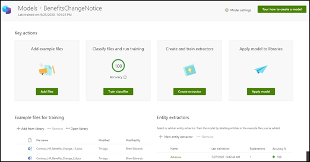

# Informazioni sui modelli di analisi dei documenti tramite un modello di esempioLearn about document understanding models through a sample model

Microsoft SharePoint Syntex offre all’utente un modello di esempio da consultare per comprendere meglio come creare modelli personalizzati.Microsoft SharePoint Syntex provides you a with a sample model you can use to examine, giving you a better understanding of how to create your own models. Il modello di esempio consente inoltre di esaminare i componenti di un modello, ad esempio il classificatore, gli estrattori e le descrizioni.The sample model also allows you to examine model components, such as its classifier, extractors, and explanations. È anche possibile usare i file di esempio per eseguire il training del modello.You can also use the sample files to train the model.

## Importare il modello di esempioImport the sample model

Per accedere al modello di esempio, è necessario prima di tutto importare il modello nel centro contenuti.To access the sample model, you need to first import the model to your content center.

1. Nel centro contenuti, selezionare **Modelli** per visualizzare l'elenco dei modelli.From the content center, select **Models** to see your models list. 
2. Nella pagina **Modelli**, selezionare **Importa il modello di esempio**.On the **Models** page, select **Import sample model**. 

      

3. Dopo aver completato l'importazione, viene visualizzata la home page del modello **BenefitsChangeNotice**.When the import completes, the **BenefitsChangeNotice** model home page will open. Se sarà necessario aprire il modello di esempio in futuro, è possibile eseguire questa operazione nell'elenco dei modelli nel centro contenuti.If you need to open the sample model in the future, you can do this from the models list in the content center.  

      

Non solo è possibile analizzare il modello di esempio per comprendere meglio il modo in cui è impostato il modello, ma poiché è un modello funzionante può andare oltre ed eseguire operazioni come:You can not only look through analyze the sample model to get a better understanding of how the model is constructed, but as a working model can go further and do things such as:

- Aggiungere un altro estrattore.Add a another extractor. Ad esempio, aggiungere un estrattore che estrae *il tasso di sconto*.For example, add one that extracts the *discount fee*.
- Applicare il modello a una raccolta documenti e caricare alcuni file di cui è stato eseguito il training per vedere come il modello classifica i file ed estrae i dati da essi.Apply the model to a document library, and upload some of the training files to it to see how the model classifies files and extracts data from them.

## Vedere ancheSee Also
[Creare un classificatoreCreate a classifier](create-a-classifier.md)

[Creare un estrattoreCreate an extractor](create-an-extractor.md)

[Panoramica dell'analisi dei documentiDocument Understanding overview](document-understanding-overview.md)

[Creare un modello di elaborazione moduliCreate a form processing model](create-a-form-processing-model.md)  
