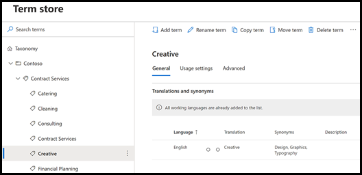

# Sfruttare la tassonomia dell'archivio termini durante la creazione di un estrattore

 

> [!VIDEO https://www.microsoft.com/videoplayer/embed/RE4GpJJ]  

 

Quando si crea un estrattore nel modello di analisi dei documenti in SharePoint Syntex, è possibile sfruttare l’archivio termini dei [set di termini globali](/sharepoint/managed-metadata) per visualizzare i termini preferiti per i dati estratti.  

Ad esempio, il modello identifica e classifica tutti i documenti del **Contratto** caricati nella raccolta documenti.  Inoltre, il modello estrae anche un valore del **Servizio del contratto** da ogni contratto e lo visualizzerà in una colonna nella visualizzazione della libreria. Tra i vari valori dei Servizi del contratto nei contratti sono disponibili diversi valori meno recenti che non vengono più usati dall'azienda e sono stati rinominati. Ad esempio, tutti i riferimenti ai termini servizi del contratto come *Progettazione*, *Grafica* o *Topografia* saranno chiamati *Creativo*. Ogni volta che il modello estrae uno dei termini obsoleti da un documento contrattuale, si vuole che venga visualizzato il termine corrente - Creativo - nella visualizzazione della raccolta. Nell'esempio seguente, durante la formazione del modello, è possibile notare che un documento di esempio contiene il termine obsoleto *Progettazione*.

    

## Usare una colonna metadati gestiti nell'estrattore

I set di termini vengono configurati nell'archivio termini dei servizi metadati gestiti nell'interfaccia di amministrazione di SharePoint. Nell'esempio seguente, il *set di termini* per i [Servizi di contratto](/sharepoint/managed-metadata#term-set) è configurato per includere alcuni termini, tra cui *Creativo*.  I dettagli mostrano che il termine ha tre sinonimi (*Progettazione*, *Grafica* e *Topografia*) e i sinonimi devono essere tradotti in *Creativo*. 

    

Ci sono diversi motivi per cui è consigliabile usare un sinonimo nel set di termini. Ad esempio, potrebbero esserci termini obsoleti, termini rinominati o variazioni tra i reparti dell'organizzazione per quanto riguarda la denominazione.

Per fare in modo che il campo metadati gestiti sia disponibile quando si crea l'estrazione nel modello, è necessario [aggiungerlo come colonna del sito metadati gestiti](https://support.microsoft.com/office/8fad9e35-a618-4400-b3c7-46f02785d27f). Dopo aver aggiunto la colonna del sito, sarà possibile selezionarla quando si crea l'estrattore per il modello.

    

Dopo aver applicato il modello alla raccolta documenti, quando i documenti vengono caricati nella raccolta, la colonna *Servizi creativi* mostrerà il termine preferito (*Creativo*) quando l'estrattore trova uno dei valori dei sinonimi (*Progettazione*, *Grafica* e *Topografia*).

    

## Vedere anche
[Introduzione ai metadati gestiti](/sharepoint/managed-metadata#terms)

[Creare un estrattore](create-an-extractor.md)

[Creare una colonna di metadati gestiti](https://support.microsoft.com/office/create-a-managed-metadata-column-8fad9e35-a618-4400-b3c7-46f02785d27f?redirectSourcePath=%252farticle%252fc2a06717-8105-4aea-890d-3082853ab7b7&ui=en-US&rs=en-US&ad=US)