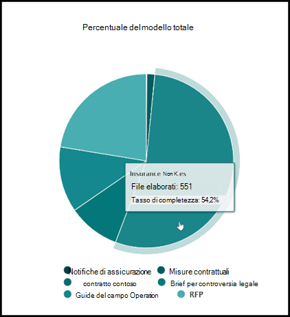

# Informazioni sull'analisi dell'utilizzo del modello

 

> [!VIDEO https://www.microsoft.com/videoplayer/embed/RE4CSoL]

 

Microsoft SharePoint Syntex content Center fornisce analisi dell'utilizzo del modello per fornire ulteriori informazioni sul modo in cui vengono utilizzati i modelli pubblicati dal centro contenuto. Questo include un rollup delle informazioni seguenti:

- Dove vengono applicati i modelli
- Il numero di file che vengono elaborati nel corso del tempo

   

## Percentuale del modello totale

     

Il grafico a torta **percentuale del modello totale** Visualizza ogni modello pubblicato come percentuale dei file totali elaborati da tutti i modelli pubblicati nel centro di contenuto.

Ogni modello Visualizza anche il **tasso di completezza**, la percentuale di file caricati che sono stati analizzati correttamente dal modello. Una bassa velocità di completezza può significare che vi sono problemi con il modello o con i file analizzati.

## File elaborati nel corso del tempo

     

I **file elaborati nel** grafico a barre del tempo mostrano non solo il numero di file elaborati nel tempo per ogni modello, ma anche le raccolte documenti a cui è stato applicato il modello.

     

## Vedere anche
[Creare un classificatore](create-a-classifier.md) 
[Creare un estrattore](create-an-extractor.md) 
[Panoramica della comprensione del documento](document-understanding-overview.md) 
[Creare un modello di elaborazione dei moduli](create-a-form-processing-model.md)  
