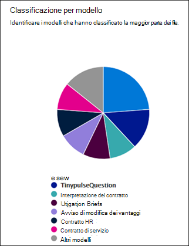

# Informazioni sull'analisi dell'utilizzo del modelloDocument understanding model usage analytics

 

> [!VIDEO https://www.microsoft.com/videoplayer/embed/RE4CSoL]

 

Microsoft SharePoint Syntex content Center fornisce analisi dell'utilizzo del modello per fornire ulteriori informazioni sul modo in cui vengono utilizzati i modelli pubblicati dal centro contenuto.Your Microsoft SharePoint Syntex content center provides you model usage analytics to provide more information about how your models that have been published from the content center are being used. Questo include un rollup delle informazioni seguenti:This includes a roll-up of the following information:

- Dove vengono applicati i modelliWhere your models are being applied
- Il numero di file che vengono elaborati nel corso del tempoHow many files are being processes over time

   

## Percentuale del modello totaleTotal model percentage

     

Il grafico a torta **percentuale del modello totale** Visualizza ogni modello pubblicato come percentuale dei file totali elaborati da tutti i modelli pubblicati nel centro di contenuto.The **Total model percentage** pie chart displays each published model as a percentage of the total files processed by all published models on the content center.

Ogni modello Visualizza anche il **tasso di completezza**, la percentuale di file caricati che sono stati analizzati correttamente dal modello.Each model also shows the **Completeness Rate**, the percentage of uploaded files that were successfully analyzed by the model. Una bassa velocità di completezza può significare che vi sono problemi con il modello o con i file analizzati.A low completeness rate may mean that there are issues with either the model or the files that are being analyzed.

## File elaborati nel corso del tempoFiles processed over time

     

I **file elaborati nel** grafico a barre del tempo mostrano non solo il numero di file elaborati nel tempo per ogni modello, ma anche le raccolte documenti a cui è stato applicato il modello.The **Files processed over time** bar chart shows you not only the number of files processed over time for each model, but also shows you the document libraries to which the model was applied.

     

## Vedere ancheSee Also
[Creare un classificatoreCreate a classifier](create-a-classifier.md) 
[Creare un estrattoreCreate an extractor](create-an-extractor.md) 
[Panoramica della comprensione del documentoDocument Understanding overview](document-understanding-overview.md) 
[Creare un modello di elaborazione dei moduliCreate a form processing model](create-a-form-processing-model.md)  
