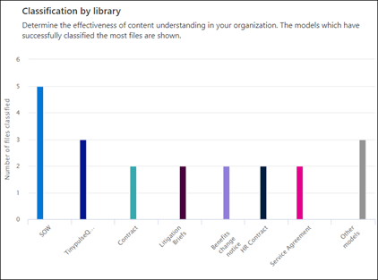

# Analisi dell’uso dei modelli di analisi dei documenti

 

> [!VIDEO https://www.microsoft.com/videoplayer/embed/RE4GnhX]  

 

Il centro contenuti di Microsoft SharePoint Syntex fornisce le analisi sull'uso dei modelli per offrire altre informazioni su come vengono usati i modelli pubblicati nel centro contenuti. La sezione <b>Prestazioni dei modelli negli ultimi 30 giorni</b> del centro contenuti include un rollup di 30 giorni dei dati di analisi dell’uso forniti nei grafici e negli elenchi seguenti:

- Classificazione per modello
- Classificazione per raccolta
- Utilizzo del modello 

   

### Rollup dei dati di utilizzo del modello nel centro contenuti predefinito

In SharePoint Syntex il centro contenuti predefinito viene creato durante l'installazione. Se necessario, è anche possibile creare altri centri contenuti. Ad esempio, i reparti potrebbero creare centri contenuti personalizzati per creare e gestire i propri modelli. 

Per quanto riguarda l’analisi dell’uso dei modelli, tenere presente che:

- Il centro contenuti predefinito mostrerà l’analisi dell’uso dei modelli per tutti i centri contenuti e i modelli dell'organizzazione, inclusi quelli creati in altri centri contenuti. In questo modo i responsabili dei contenuti e le altre parti interessate possono accedere a un portale centralizzato per gestire e supervisionare i centri contenuti e i modelli di tutta l'azienda.  
- Negli altri centri contenuti verranno mostrate le analisi dell’uso dei modelli solo per i modelli che sono stati creati in tali centri. In questo modo i responsabili dei contenuti possono ottenere informazioni approfondite sui dati di utilizzo solo per i modelli a cui sono interessati.

## Classificazione per modello

     

Il grafico a torta **Classificazione per modello** visualizza i modelli che hanno classificato la maggior parte dei file. Mostra ogni modello pubblicato come una percentuale del totale dei file elaborati da tutti i modelli pubblicati nel centro contenuti.

Ogni modello illustra anche il **tasso di completamento**, la percentuale di file caricati analizzati correttamente dal modello. Un tasso di completamento basso può indicare che si verificano problemi con il modello o i file da analizzare.

## Classificazione per raccolta

     

Il grafico a barre **Classificazione per raccolta** consente di determinare l'efficacia della comprensione dei contenuti nell'organizzazione.  Mostra all’utente non solo il numero dei file elaborati nel corso del tempo per ogni modello, ma selezionando una colonna nel grafico mostrerà anche le raccolte documenti a cui il modello è stato applicato.

## Utilizzo del modello

L'elenco Utilizzo del modello visualizza le analisi di utilizzo per i modelli creati tramite il centro contenuti.  

> [!NOTE]
> Se si sta usando il centro contenuti predefinito e si hanno altri centri contenuti nell'organizzazione, l'elenco di utilizzo dei modelli verrà raggruppato per centro contenuti.

Per ogni modello nell'elenco di utilizzo dei modelli verranno visualizzati i dati di utilizzo:

- Numero di elementi classificati: numero di file elaborati dal modello.
- Grado di attendibilità medio: grado di accuratezza medio del modello quando viene eseguito su file.
- URL dell'elenco di destinazione: raccolta documenti di SharePoint a cui viene applicato il modello.

## Vedere anche
[Creare un classificatore](create-a-classifier.md)

[Creare un estrattore](create-an-extractor.md)

[Panoramica dell'analisi dei documenti](document-understanding-overview.md)

[Creare un modello di elaborazione moduli](create-a-form-processing-model.md)  
