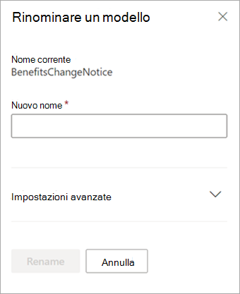

# Rinominare un modello in Microsoft SharePoint Syntex.

A un certo punto, è consigliabile rinominare un modello di analisi dei documenti. Un esempio comune è quando si crea una bozza iniziale di un modello, si potrebbe non aver pensato a fondo al nome finale (ad esempio, si potrebbe aver impostato il nome "AlexWilburModel1"). Quando ci si avvicina alla finalizzazione del modello e lo si mette in uso, ci si rende conto che un nome più corretto potrebbe essere "Rinnovo contratti" e si vuole rinominarlo.  

Un altro esempio è quello in cui l'organizzazione prende la decisione di fare riferimento a un processo o a un tipo di documento con un nome diverso. Ad esempio, quando si crea il modello e si è pronti per applicarlo, l'organizzazione potrebbe avere il compito di fare in modo che tutti i "Contratti" siano formalmente denominati "Accordi". Se necessario, è possibile scegliere di rinominare il modello da "Rinnovi contrattuali" in "Rinnovi degli Accordi".

> [!IMPORTANT]
> È possibile rinominare un modello di analisi dei documenti solo se non è stato applicato a una raccolta documenti. 

La ridenominazione di un modello rinomina anche [tipo di contenuto](/sharepoint/governance/content-type-and-workflow-planning#content-type-overview) associato al modello.

## Rinominare un modello

Seguire questi passaggi per rinominare un modello di analisi dei documenti.

1. Nel centro contenuti, selezionare **Modelli** per visualizzare l'elenco dei modelli.

2. Alla pagina **Modelli**, selezionare il modello che si desidera rinominare.

3. Usando la barra multifunzione o il pulsante **Mostra azioni** (accanto al nome modello), selezionare **Rinomina**.  

      

4. Nel riquadro **Rinomina modello** :

   a. In **Nuovo nome**, immettere il nuovo nome del modello che si desidera rinominare. 

      

   b. (Facoltativo) In **Impostazioni avanzate**, selezionare se si desidera associare un [tipo di contenuto](/sharepoint/governance/content-type-and-workflow-planning#content-type-overview) esistente. Se si sceglie **Usa un tipo di contenuto esistente**, il modello verrà rinominato in modo da corrispondere al tipo di contenuto selezionato.

5. Selezionare **Rinomina**.

## Vedere anche
[Creare un classificatore](create-a-classifier.md)

[Creare un estrattore](create-an-extractor.md)

[Rinominare un estrattore](rename-an-extractor.md)

[Panoramica sull'analisi dei documenti](document-understanding-overview.md)

[Tipi di spiegazione](explanation-types-overview.md)

[Applicare un modello](apply-a-model.md) 
