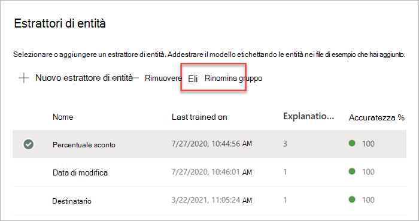
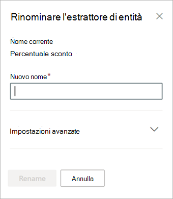

# Rinominare un estrattore in Microsoft SharePoint SyntexRename an extractor in Microsoft SharePoint Syntex

A un certo punto, potrebbe essere necessario rinominare un estrattore per poter fare riferimento a un campo dati estratto da un nome diverso.At some point, you might need to rename an extractor if you want to refer to an extracted data field by a different name. Ad esempio, l'organizzazione decide di apportare modifiche ai documenti contrattuali e chiama i "clienti" "acquirenti" nei documenti.For example, your organization decides to make changes to their contract documents, and refers to “customers” as “clients” in their documents. Nell'ambito dell'estrazione di un campo "Cliente" nel modello, sarà possibile rinominarlo "Acquirente".If you were extracting a “Customer” field in your model, you can choose to rename it to “Client.”

Quando viene sincronizzato il modello aggiornato nella libreria documenti di SharePoint, verrà visualizzata una nuova colonna "Acquirente" nella vista libreria documenti.When you sync your updated model to your SharePoint document library, you will see a new “Client” column in your document library view. La vista conserverà la colonna "Cliente" per le attività precedenti, ma aggiornerà la nuova colonna "Acquirente" per tutti i nuovi documenti elaborati dal modello.Your view will retain the “Customer” column for past activity, but will update the new “Client” column for all new documents that are processed by your model. 

> [!IMPORTANT]
>  Assicurarsi di sincronizzare il modello aggiornato nelle librerie documenti in cui è stato applicato in precedenza per fare in modo che venga visualizzato il nuovo nome colonna.Make sure to sync your updated model to the document libraries where you had previously applied it for the new column name to display. 

## Rinominare un estrattoreRename an extractor

Seguire questi passaggi per rinominare un estrattore di entità.Follow these steps to rename an entity extractor.

1. Nel centro contenuti, selezionare **Modelli** per visualizzare l'elenco dei modelli.From the content center, select **Models** to see your models list.

2. Alla pagina **Modelli**, nella colonna **Nome**, selezionare il modello per cui si desidera rinominare un estrattore.On the **Models** page, in the **Name** column, select the model for which you want to rename an extractor.

3. In **Estrattori di entità**, selezionare il nome dell'estrattore che si desidera rinominare, quindi **Rinomina**.Under **Entity extractors**, select the name of the extractor you want to rename, and then select **Rename**. 

      

4. Nel pannello **Rinominare estrattore di entità**:On the **Rename entity extractor** panel:

   a.a. In **Nuovo nome**, immettere il nuovo nome dell'estrattore.Under **New name**, enter the new name of the extractor. 

      

   b.b. (Facoltativo) In **Impostazioni avanzate**, selezionare se si desidera associare una colonna sito esistente.(Optional) Under **Advanced settings**, select whether you want to associate an existing site column.

5. Selezionare **Rinomina**.Select **Rename**.

## Vedere ancheSee Also
[Creare un estrattoreCreate an extractor](create-an-extractor.md)

[Creare un classificatoreCreate a classifier](create-a-classifier.md)

[Rinominare un modelloRename a model](rename-a-model.md)

[Tipi di spiegazioneExplanation types](explanation-types-overview.md)

[Sfruttare la tassonomia dell'archivio termini durante la creazione di un estrattoreLeverage term store taxonomy when creating an extractor](leverage-term-store-taxonomy.md)

[Panoramica sull'analisi dei documentiDocument Understanding overview](document-understanding-overview.md)

[Applicare un modelloApply a model](apply-a-model.md) 
