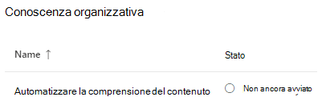
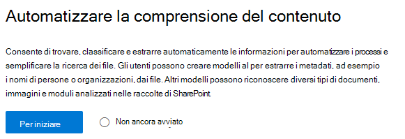
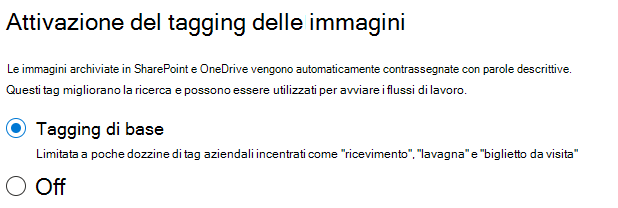
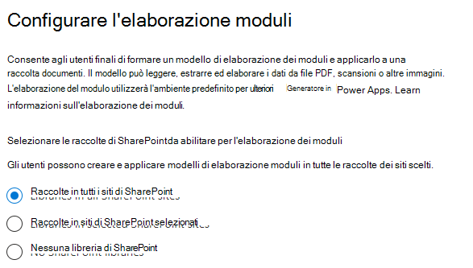
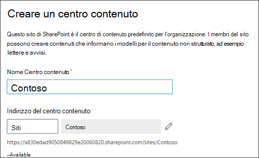
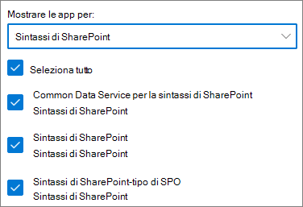

# Configurare SharePoint SyntexSet up SharePoint Syntex

Gli amministratori possono utilizzare l'interfaccia di amministrazione di Microsoft 365 per configurare e Microsoft SharePoint Syntex.Admins can use the Microsoft 365 admin center to set up and Microsoft SharePoint Syntex. 

Prima di iniziare, prendere in considerazione quanto segue:Consider the following before you start:

- Quali siti di SharePoint consentiranno di abilitare l'elaborazione dei moduli?Which SharePoint sites will you enable form processing? Tutti, alcuni o Seleziona siti?All of them, some, or select sites?
- Che cosa è il nome del centro di contenuti e chi è l'amministratore principale del sito?What will you name of your content center, and who is the primary site admin?

È possibile modificare le impostazioni dopo l'installazione iniziale nell'interfaccia di amministrazione di Microsoft 365.You can change your settings after initial setup in the Microsoft 365 admin center.

Il contenuto di questo articolo è relativo all'anteprima privata di Project Cortex.The content in this article is for the Project Cortex Private Preview. [Per ulteriori informazioni, vedere Project Cortex](https://aka.ms/projectcortex).[Find out more about Project Cortex](https://aka.ms/projectcortex).

Prima di eseguire l'installazione, assicurarsi di pianificare il modo migliore per impostare e configurare la comprensione del contenuto nell'ambiente in uso.Prior to setup, make sure to plan for the best way to set up and configure content understanding in your environment. Ad esempio, è necessario prendere in considerazione i seguenti nomi:For example, you need to make considerations about the following names of:

- I siti di SharePoint che si desidera abilitare l'elaborazione del modulo: tutti, alcuni o siti selezionatiThe SharePoint sites that you want to enable form processing - all of them, some, or selected sites
- Il centro contenuto e il nome dell'amministratore del sito principaleYour content center and the name of the primary site admin

## RequisitiRequirements 

> [!NOTE]
> È necessario disporre delle autorizzazioni di amministratore globale o di amministratore di SharePoint per poter accedere all'interfaccia di amministrazione di Microsoft 365 e configurare la comprensione del contenuto.You must have Global admin or SharePoint admin permissions to be able to access the Microsoft 365 admin center and set up content understanding.

Come amministratore, è anche possibile apportare modifiche alle impostazioni selezionate in qualsiasi momento dopo l'installazione e in tutte le impostazioni di gestione del contenuto nell'interfaccia di amministrazione di Microsoft 365.As an admin, you can also make changes to your selected settings anytime after setup, and throughout the content understanding management settings in the Microsoft 365 Admin Center.

## Per configurare SharePoint SyntexTo set up SharePoint Syntex

1. Nell'interfaccia di amministrazione di Microsoft 365, selezionare **Setup**e quindi visualizzare la sezione relativa alle **informazioni sull'organizzazione** .In the Microsoft 365 admin center, select **Setup**, and then view the **Organizational knowledge** section.

2. Nella sezione **informazioni organizzative** selezionare **automatizza la comprensione del contenuto**.In the **Organizational knowledge** section, select **Automate content understanding**. 

     

3. Nella pagina **automatizzare SharePoint Syntex** , fare clic su Guida **introduttiva** per eseguire il processo di installazione.On the **Automate SharePoint Syntex** page, click **Get started** to walk through the setup process. 

     

4. Nella pagina attiva tagging immagine scegliere se si desidera consentire il [tagging dell'immagine](image-tagging.md).On the Turn on image tagging page, choose if you want to allow [image tagging](image-tagging.md).

     

5. Nella pagina **Configura elaborazione moduli** è possibile scegliere se si desidera consentire agli utenti di utilizzare il generatore ai per creare modelli di elaborazione dei moduli in specifiche raccolte documenti di SharePoint.On the **Configure Form Processing** page, you can choose if you want to let users be able to use AI Builder to create form processing models in specific SharePoint document libraries. Nella barra multifunzione della raccolta documenti sarà disponibile un'opzione di menu per **creare un modello di elaborazione dei moduli** nelle raccolte documenti di SharePoint in cui è abilitata.A menu option will be available in the document library ribbon to **Create a form processing model** in SharePoint document libraries in which it is enabled.
 
     Per **il quale le raccolte di SharePoint dovrebbero mostrare l'opzione per creare un modello di elaborazione dei moduli**, è possibile selezionare:For **Which SharePoint libraries should show option to create a form processing model**, you can select: 
      - **Tutte le raccolte di SharePoint** per renderle disponibili per tutte le raccolte di SharePoint nell'organizzazione.**All SharePoint libraries** to make it available to all SharePoint libraries in your organization. 
      - **Solo le raccolte nei siti selezionati**, quindi selezionare i siti in cui si desidera renderli disponibili.**Only libraries in selected sites**, and then select the sites in which you want to make it available. 

   

   > [!Note]
   > L'abilitazione di questa impostazione in una raccolta documenti di SharePoint non influisce sui modelli esistenti applicati alla raccolta o sulla possibilità di applicare i modelli di comprensione dei documenti a una raccolta.Enabling this setting on a SharePoint document library does not affect existing models applied to the library or the ability to apply document understanding models to a library. 
    
6. Nella pagina **Crea centro contenuto** è possibile creare un sito Centro contenuto di SharePoint in cui gli utenti possono creare e gestire i modelli di comprensione dei documenti.On the **Create Content Center** page, you can create a SharePoint content center site on which your users can create and manage document understanding models.  
    a.a. Per **nome sito**, digitare il nome che si desidera assegnare al sito Centro contenuto.For **Site name**, type the name you want to give your content center site. 
    b.b. L' **indirizzo del sito** mostrerà l'URL del sito, in base alle operazioni selezionate per il nome del sito.The **Site address** will show the URL for your site, based on what you selected for the site name. Se si desidera modificarlo, fare clic su **modifica**.If you want to change it, click **Edit**. 

       

    Selezionare **Avanti**.Select **Next**.

7. Nella pagina **revisione e fine** è possibile esaminare l'impostazione selezionata e scegliere di apportare modifiche.On the **Review and finish** page, you can look at your selected setting and choose to make changes. Se si è soddisfatti delle selezioni, selezionare **attiva**.If you are satisfied with your selections, select **Activate**.

8. Nella pagina Conferma fare clic su **fine**.On the confirmation page, click **Done**.

9. Verrà restituita la pagina di **informazioni sul contenuto automatico** .You'll be returned to your **Automate content understanding** page. Da questa pagina, è possibile selezionare **Gestisci** per apportare modifiche alle impostazioni di configurazione.From this page, you can select **Manage** to make any changes to your configuration settings. 

## Assegnazione delle licenzeAssign licenses

Dopo aver configurato SharePoint Syntex, è necessario assegnare le licenze per gli utenti che utilizzeranno le funzionalità di elaborazione dei moduli e la comprensione dei documenti.Once you have configured SharePoint Syntex, you must assign licenses for the users who will be using form processing and document understanding features.

Per assegnare le licenze:To assign licenses:

1. Nell'interfaccia di amministrazione di Microsoft 365, in **utenti**, fare clic su **utenti attivi**.In the Microsoft 365 admin center, under **Users**, click **Active users**.

2. Selezionare gli utenti che si desidera concedere una licenza e fare clic su **Gestisci licenze di prodotto**.Select the users that you want to license, and click **Manage product licenses**.

3. Selezionare **assegna altro**.Select **Assign more**.

4. Selezionare **Intelligent Content Services**.Select **Intelligent Content Services**. In **app**, verificare che sia selezionata l'opzione **Common Data Service per Intelligent Content Services** e **Intelligent Content Services** .Under **Apps**, make sure **Common Data Service for Intelligent Content Services** and **Intelligent Content Services** are both selected.

    

5. Fare clic su **Salva modifiche**.Click **Save changes**.

## Crediti AI BuilderAI Builder credits

Se si dispone di 300 o più licenze di Syntex di SharePoint per SharePoint Syntex nell'organizzazione, verranno assegnati 1 milione AI Credits Builder.If you have 300 or more SharePoint Syntex licenses for SharePoint Syntex in your organization, you will be allocated one million AI Builder credits. Se si dispone di meno di 300 licenze, è necessario acquistare i crediti Builder AI per poter utilizzare l'elaborazione dei moduli.If you have fewer than 300 licenses, you must purchase AI Builder credits in order to use forms processing.

È possibile valutare la capacità del generatore AI che è adatta a te con la [calcolatrice di ai Builder](https://powerapps.microsoft.com/ai-builder-calculator).You can estimate the AI Builder capacity that’s right for you with the [AI Builder calculator](https://powerapps.microsoft.com/ai-builder-calculator).

Accedere all'interfaccia di [amministrazione di Power Platform](https://admin.powerplatform.microsoft.com/resources/capacity) per controllare i crediti e l'utilizzo.Go to the [Power Platform admin center](https://admin.powerplatform.microsoft.com/resources/capacity) to check your credits and usage.

## Vedere ancheSee also

[Panoramica del modello di elaborazione dei moduliOverview of the form processing model](https://docs.microsoft.com/ai-builder/form-processing-model-overview)

[Step-by-Step: come creare un modello di comprensione dei documenti (video)Step-by-Step: How to Build a Document Understanding Model (video)](https://www.youtube.com/watch?v=DymSHObD-bg)

