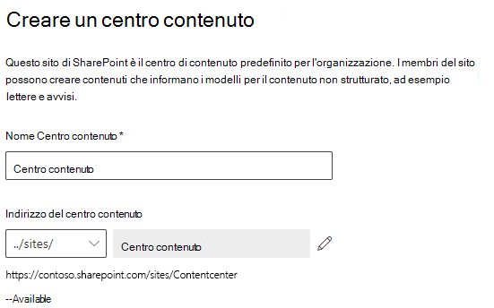

# Configurazione di SharePoint SyntexSet up SharePoint Syntex

Gli amministratori possono usare l'interfaccia di amministrazione di Microsoft 365 per configurare [Microsoft SharePoint Syntex](index.md).Admins can use the Microsoft 365 admin center to set up [Microsoft SharePoint Syntex](index.md). 

Prima di iniziare, prendere in considerazione quanto segue:Consider the following before you start:

- In quali siti di SharePoint verrà abilitata l'elaborazione dei moduli?In which SharePoint sites will you enable form processing? Tutti, alcuni o determinati siti?All of them, some, or select sites?
- Quale sarà il nome assegnato al centro contenuti predefinito?What will you name your default content center?

È possibile cambiare le impostazioni dopo la configurazione iniziale nell'interfaccia di amministrazione di Microsoft 365.You can change your settings after initial setup in the Microsoft 365 admin center.

Prima di procedere, assicurarsi di pianificare in modo ottimale la configurazione della comprensione dei contenuti nel proprio ambiente.Prior to setup, make sure to plan for the best way to set up and configure content understanding in your environment. Ad esempio, è necessario prendere le decisioni seguenti:For example, you need to make the following decisions:

- I siti di SharePoint in cui si vuole abilitare l'elaborazione dei moduli: tutti, alcuni o determinati siti.The SharePoint sites in which you want to enable form processing - all of them, some, or selected sites
- Il nome e gli amministratori del centro contenutiThe name and admins for your content center

## RequisitiRequirements 

> [!NOTE]
> È necessario disporre delle autorizzazioni di amministratore globale o amministratore di SharePoint per poter accedere all'interfaccia di amministrazione di Microsoft 365 e configurare SharePoint Syntex.You must have Global admin or SharePoint admin permissions to be able to access the Microsoft 365 admin center and set up SharePoint Syntex.

Gli amministratori possono anche modificare le impostazioni selezionate in qualsiasi momento dopo la configurazione, nonché le impostazioni di gestione della comprensione dei contenuti nell'interfaccia di amministrazione di Microsoft 365.As an admin, you can also make changes to your selected settings anytime after setup, and throughout the content understanding management settings in the Microsoft 365 Admin Center.

### LicenzeLicensing

Per usare SharePoint Syntex, l'organizzazione deve avere un abbonamento a SharePoint Syntex e a ogni utente devono essere assegnate le licenze seguenti:To use SharePoint Syntex, your organization must have a subscription to SharePoint Syntex, and each user must have the following licenses assigned:

- SharePoint SyntexSharePoint Syntex
- SharePoint Syntex - tipo SPOSharePoint Syntex - SPO type
- Servizio dati comuni per SharePoint SyntexCommon Data Service for SharePoint Syntex

Se si annulla l'abbonamento a SharePoint Syntex in futuro (o scade la versione di valutazione), gli utenti non saranno più in grado di creare o eseguire analisi dei documenti o modelli per l’elaborazione dei moduli e il modello del Centro contenuto non sarà più disponibile.If you cancel your SharePoint Syntex subscription at a future date (or your trial expires), users will no longer be able to create or run document understanding or form processing models, and the content center template will no longer be available. Inoltre, i report dell'archivio termini, l'importazione della tassonomia SKOS e il push del tipo di contenuto non saranno più disponibili.Additionally, term store reports, SKOS taxonomy import, and Content type push will no longer be available. Nessun contenuto verrà eliminato e le autorizzazioni per il sito non verranno modificate.No content will be deleted and site permissions will not be changed.

### Crediti di AI BuilderAI Builder credits

Se nell'organizzazione sono presenti più di 300 licenze di SharePoint Syntex, si riceverà un milione di crediti di AI Builder.If you have 300 or more SharePoint Syntex licenses for SharePoint Syntex in your organization, you will be allocated one million AI Builder credits. Se si hanno meno di 300 licenze, è necessario acquistare i crediti di AI Builder per poter usare l'elaborazione moduli.If you have fewer than 300 licenses, you must purchase AI Builder credits in order to use forms processing.

È possibile stimare la capacità di AI Builder che più adatta all’utente con [Calcolatore AI Builder](https://powerapps.microsoft.com/ai-builder-calculator).You can estimate the AI Builder capacity that’s right for you with the [AI Builder calculator](https://powerapps.microsoft.com/ai-builder-calculator).

Se si pianifica di usare un ambiente Power Platform personalizzato, è necessario [allocare crediti a tale ambiente](/power-platform/admin/capacity-add-on).If you plan to use a custom Power Platform environment, you must [allocate credits to that environment](/power-platform/admin/capacity-add-on).

Passare all'[interfaccia di amministrazione di Power Platform](https://admin.powerplatform.microsoft.com/resources/capacity) per controllare i crediti e il relativo utilizzo.Go to the [Power Platform admin center](https://admin.powerplatform.microsoft.com/resources/capacity) to check your credits and usage.

## Per configurare SharePoint SyntexTo set up SharePoint Syntex

1. Nell'interfaccia di amministrazione di Microsoft 365, selezionare **Configura** e poi visualizzare la sezione **File e contenuti**.In the Microsoft 365 admin center, select **Setup**, and then view the **Files and content** section.

2. Nella sezione **File e contenuti**, selezionare **Comprensione dei contenuti automatica**.In the **Files and content** section, select **Automate content understanding**. 

3. Nella pagina **Comprensione dei contenuti automatica**, fare clic su **Inizia** e seguire le istruzioni per completare il processo di configurazione.On the **Automate content understanding** page, click **Get started** to walk through the setup process. 

    > [!div class="mx-imgBorder"]
    >  

4. Nella pagina **Configurare l’elaborazione moduli**, è possibile scegliere se si vuole consentire agli utenti di creare modelli di elaborazione moduli in raccolte documenti di SharePoint specifiche.On the **Configure Form Processing** page, you can choose if you want to let users be able to create form processing models in specific SharePoint document libraries. Nella barra multifunzione della raccolta documenti sarà disponibile un'opzione del menu che consente di **Creare un modello di elaborazione moduli** nelle raccolte documenti di SharePoint in cui è abilitato.A menu option will be available in the document library ribbon to **Create a form processing model** in SharePoint document libraries in which it is enabled.
 
     In **Quale raccolta di SharePoint deve mostrare l'opzione di creazione del modello di elaborazione moduli**, è possibile selezionare:For **Which SharePoint libraries should show option to create a form processing model**, you can select: 
      - **Librerie in tutti i siti di SharePoint** per renderla disponibile per tutte le raccolte di SharePoint nell'organizzazione.**Libraries in all SharePoint sites** to make it available to all SharePoint libraries in your organization. 
      - **Librerie in siti di SharePoint selezionati** e quindi selezionare i siti in cui si vuole rendere disponibile l'opzione oppure caricare un elenco di massimo 50 siti.**Libraries in selected SharePoint sites**, and then select the sites in which you want to make it available or upload a list of up to 50 sites. 
      - **Nessuna raccolta di SharePoint** se non si vuole rendere l’opzione disponibile in alcun sito. È possibile modificare questa impostazione dopo la configurazione.**No SharePoint libraries** if you don't want to make it available to any sites (you can change this after setup).

   > [!div class="mx-imgBorder"]
   > 

   > [!Note]
   > Rimuovere un sito dopo che l’opzione è stata inclusa, non influisce sui modelli esistenti applicati alle raccolte del sito o sulla possibilità di applicare modelli di analisi dei documenti a una raccolta.Removing a site after it has been included does not affect existing models applied to the libraries in that site or the ability to apply document understanding models to a library. 
    
    Se sono configurati più ambienti Power Platform, sarà possibile scegliere quale usare per l'elaborazione moduli.If you have multiple Power Platform environments configured, you can choose which one you want to use with for form processing. (Questa opzione non verrà visualizzata se si dispone di un solo ambiente.)(This option will not appear if you only have one environment.)

    

    Per l'**ambiente di Power Platform**, è possibile selezionare:For **Power Platform environment**, you can select:
    - **Usare l'ambiente predefinito** per usare l'ambiente Power Platform predefinito.**Use the default environment** to use your default Power Platform environment.
    - **Usare un ambiente personalizzato** per utilizzare un ambiente personalizzato.**Use a custom environment** to use a custom environment. Scegliere l'ambiente che si desidera usare dall'elenco.Choose the environment that you want to use from the list. È necessario installare l'app *AI Builder per Project Cortex* in questo ambiente e allocare crediti AI Builder prima di creare modelli di elaborazione moduli.You must install the *AI Builder for Project Cortex* app in this environment and allocate AI Builder credits to it before you can create form processing models.

    Fare clic su **Avanti**.Click **Next**.

5. Nella pagina **Creare un centro contenuti**, è possibile creare un sito del centro contenuti di SharePoint in cui gli utenti possono creare e gestire i modelli di analisi dei documenti.On the **Create Content Center** page, you can create a SharePoint content center site on which your users can create and manage document understanding models.

    1. Per **Nome del sito**, digitare il nome che si desidera assegnare al sito del centro contenuti.For **Site name**, type the name you want to give your content center site.
    
    1. L’**Indirizzo del sito** mostrerà l'URL del sito in base a ciò che è stato selezionato per il nome del sito.The **Site address** will show the URL for your site, based on what you selected for the site name. Per modificarlo, fare clic su **Modifica**.If you want to change it, click **Edit**.

       > [!div class="mx-imgBorder"]
       >  

       Selezionare **Avanti**.Select **Next**.

6. Nella pagina **Verificare e completare**, è possibile esaminare l'impostazione selezionata e scegliere se apportare modifiche.On the **Review and finish** page, you can look at your selected setting and choose to make changes. Al termine, selezionare **Attiva**.If you are satisfied with your selections, select **Activate**.

7. Nella pagina di conferma, fare clic su **Fine**.On the confirmation page, click **Done**.

8. Si verrà indirizzati nuovamente alla pagina **Comprensione dei contenuti automatica**.You'll be returned to your **Automate content understanding** page. In questa pagina è possibile selezionare **Gestisci** per modificare le impostazioni di configurazione.From this page, you can select **Manage** to make any changes to your configuration settings. 

## Assegnazione delle licenzeAssign licenses

Dopo aver configurato SharePoint Syntex, è necessario assegnare le licenze per gli utenti che useranno le funzionalità di SharePoint Syntex.Once you have configured SharePoint Syntex, you must assign licenses for the users who will be using any SharePoint Syntex features.

Per assegnare le licenze:To assign licenses:

1. Nell'interfaccia di amministrazione di Microsoft 365, in **Utenti** fare clic su **Utenti attivi**.In the Microsoft 365 admin center, under **Users**, click **Active users**.

2. Selezionare gli utenti a cui si vuole assegnare una licenza e quindi scegliere **Gestisci licenze prodotto**.Select the users that you want to license, and choose **Manage product licenses**.

3. Scegliere **App** nel menu a discesa.Choose **Apps** from the drop-down menu.

4. Selezionare **Mostra app per SharePoint Syntex**.Select **Show apps for  SharePoint Syntex**. In **App** verificare che l'opzione **Common Data Service per SharePoint Syntex**, **SharePoint Syntex** e **SharePoint Syntex - tipo SPO** sia selezionata.Under **Apps**, make sure **Common Data Service for SharePoint Syntex**, **SharePoint Syntex**, and **SharePoint Syntex - SPO type** are all selected.

    > [!div class="mx-imgBorder"]
    > 

5. Fare clic su **Salva modifiche**.Click **Save changes**.

## Vedere ancheSee also

[Panoramica del modello di elaborazione moduliOverview of the form processing model](/ai-builder/form-processing-model-overview)

[Istruzioni dettagliate per la creazione di un modello di analisi dei documenti (video)Step-by-Step: How to Build a Document Understanding Model (video)](https://www.youtube.com/watch?v=DymSHObD-bg)

[Creare e gestire ambienti nell'interfaccia di amministrazione di Power PlatformCreate and manage environments in the Power Platform admin center](/power-platform/admin/create-environment)
