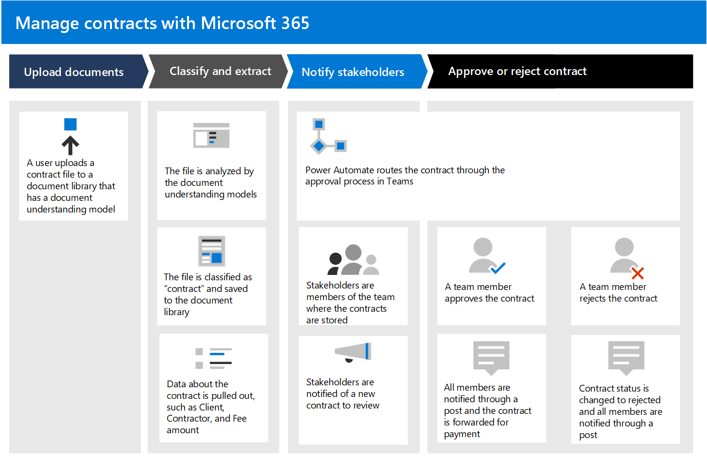

# Gestire i contratti con una Microsoft 365 soluzione

In questo articolo viene descritto come creare una soluzione di gestione dei contratti per l'organizzazione utilizzando SharePoint Syntex e i componenti di Microsoft 365. Offre un framework che consente di pianificare e creare una soluzione adatta alle esigenze aziendali specifiche. Anche se questa soluzione non soddisfa le esigenze aziendali nel suo complesso, alcune parti di essa possono essere adottate nella pianificazione per creare una soluzione di gestione dei contratti personalizzata.

## Identificare il problema aziendale

Il primo passaggio nella pianificazione del sistema di gestione dei contratti consiste nel comprendere il problema che si sta tentando di risolvere. Per questa soluzione, è necessario risolvere quattro problemi chiave:

- **Identificare i contratti**. L'organizzazione lavora con molti documenti, ad esempio fatture, contratti, dichiarazioni di lavoro e così via.  Alcuni sono asset digitali inviati tramite posta elettronica e altri sono asset cartacei inviati tramite posta tradizionale. È necessario un modo per identificare tutti i contratti dei clienti da tutti gli altri documenti e classificarli come tali.

- **Tenere traccia della cronologia delle approvazioni dei contratti.** L'organizzazione necessita di un modo affidabile per stabilire se i contratti sono stati approvati o rifiutati e se il pagamento è stato elaborato. 

- **Sito per la gestione delle approvazioni dei contratti.** L'organizzazione deve configurare un sito di collaborazione in cui tutti gli stakeholder necessari possano esaminare facilmente i contratti. Le parti interessate dovrebbero essere in grado di esaminare l'intero contratto, se necessario, ma soprattutto di visualizzare diversi campi chiave di ogni contratto (ad esempio, nome del cliente, numero di ordine di acquisto e costo totale). Le parti interessate dovrebbero essere in grado di approvare o rifiutare facilmente i contratti in arrivo.

- **Route reviewed contracts**. I contratti approvati e rifiutati devono essere instradati tramite un flusso di lavoro specifico. I contratti approvati devono essere instradati a una domanda di terze parti per l'elaborazione dei pagamenti. I contratti rifiutati devono essere instradati per un'ulteriore revisione.

## Panoramica della soluzione

  

Questa guida alla soluzione di gestione dei contratti include quattro componenti di Microsoft 365:

- **Microsoft SharePoint Syntex:** creare modelli per identificare e classificare i file di contratto e quindi estrarre i dati appropriati da essi.

- **Elenchi SharePoint Microsoft**: utilizzare la formattazione disponibile negli elenchi SharePoint moderni per presentare i contratti in un formato per le aziende.

- **Microsoft Teams**: utilizzare la funzionalità di un canale Teams e le schede associate per consentire agli stakeholder di rivedere e gestire i contratti.

- **Power Automate**: utilizzare i flussi per guidare i contratti attraverso il processo di approvazione e quindi a una richiesta di pagamento di terze parti.

### Come funziona tutto

  

1. I documenti vengono caricati in una SharePoint raccolta documenti. Un SharePoint di comprensione dei documenti Syntex è stato applicato alla raccolta documenti. Controlla ogni file per verificare se una corrispondenza a un tipo di contenuto "contratto" è stata addestrata per la ricerca. Se trova una corrispondenza, classifica il file come "contratto" e aggiorna il tipo di contenuto per il documento.

2. Il modello estrae anche dati specifici da ogni file di contratto che gli stakeholder sono interessati a visualizzare, ad esempio *l'importo del cliente,* del *terzista e della commissione.*

    La pagina seguente è un esempio di un contratto che il modello ha preparato per identificare.

      

3. In Microsoft Teams, tutte le parti interessate sono membri di un canale Teams sicuro in cui tutti i contratti nella raccolta documenti sono visibili per l'approvazione o il rifiuto. Utilizzando la Teams, tutte le parti interessate vengono avvisate quando è necessario rivedere i nuovi contratti.
 
4. Utilizzando il Power Automate, i contratti vengono spostati attraverso il processo di approvazione nel Teams canale. Quando un membro approva un contratto, lo stato del contratto viene modificato per l'approvazione, tutti i membri vengono informati tramite un post di Teams e viene creata una voce per mostrare che il contratto è pronto per i pagamenti. Questo processo può essere esteso per scrivere direttamente a un'applicazione finanziaria di terze parti per il pagamento.

5.  Quando un membro rifiuta un contratto, lo stato viene modificato in rifiutato e tutti i membri vengono avvisati tramite un Teams post.

6. Il risultato finale di questa soluzione è un processo aziendale automatizzato per l'organizzazione. I dipendenti possono usare facilmente la visualizzazione dei riquadri personalizzati in Teams per avviare e monitorare il flusso di lavoro di approvazione dei documenti. 

     

## Creare la soluzione

Nelle sezioni successive verranno fornite informazioni dettagliate su come configurare la soluzione di gestione dei contratti. È suddiviso in tre passaggi:

- [Passaggio 1. Usare SharePoint Syntex per identificare i file di contratto ed estrarre i dati](solution-manage-contracts-step1.md)
- [Passaggio 2. Usare Microsoft Teams per creare il canale di gestione dei contratti](solution-manage-contracts-step2.md)
- [Passaggio 3. Usare Power Automate per creare il flusso per elaborare i contratti](solution-manage-contracts-step3.md)
