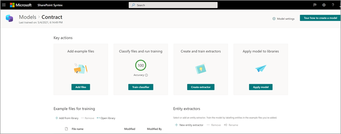

# Passaggio 1. Usare SharePoint Syntex per identificare i file di contratto ed estrarre i dati

L'organizzazione ha bisogno di un modo per identificare e classificare tutti i documenti di contratto dai numerosi file ricevuti. È inoltre possibile visualizzare rapidamente diversi elementi chiave in ognuno dei file di contratto identificati (ad esempio, *Cliente,* Appaltatore e *Importo commissione).* A tale scopo, utilizzare [SharePoint Syntex](index.md) per creare un modello di comprensione dei documenti e applicarlo a una raccolta documenti.

## Panoramica del processo

[La comprensione dei](document-understanding-overview.md) documenti usa modelli di intelligenza artificiale (AI) per automatizzare la classificazione dei file e l'estrazione delle informazioni. I modelli di comprensione dei documenti sono inoltre ottimali nell'estrazione di informazioni da documenti non strutturati e semistrutturati in cui le informazioni necessarie non sono contenute in tabelle o moduli, ad esempio contratti.

1. Innanzitutto, è necessario trovare almeno cinque file di esempio che è possibile utilizzare per "formare" il modello per cercare caratteristiche specifiche del tipo di contenuto che si sta tentando di identificare (un contratto). 

2. Usando SharePoint Syntex, crea un nuovo modello di comprensione dei documenti. Usando i file di esempio, è necessario [creare un classificatore](create-a-classifier.md). Formando il classificatore con i file di esempio, viene insegnato a cercare caratteristiche specifiche di ciò che si potrebbe vedere nei contratti dell'azienda. Ad esempio, [creare una "spiegazione"](create-a-classifier.md#create-an-explanation) che cerca stringhe specifiche presenti nei contratti, ad esempio Contratto di *servizio,* *Condizioni* del contratto e *Compensazione.* Puoi anche formare la tua spiegazione per cercare queste stringhe in sezioni specifiche del documento o posizionate accanto ad altre stringhe. Quando si pensa di aver addestrato il classificatore con le informazioni necessarie, è possibile testare il modello su un set di file di esempio di esempio per verificare l'efficienza. Dopo il test, se necessario, è possibile scegliere di apportare modifiche alle spiegazioni per renderle più efficienti. 

3. Nel modello puoi creare un [estrattore](create-an-extractor.md) per estrarre parti specifiche di dati da ogni contratto. Ad esempio, per ogni contratto, le informazioni più preoccupate sono chi è il cliente, il nome dell'appaltatore e il costo totale.

4. Dopo aver creato correttamente il modello, applicarlo a una [raccolta SharePoint documenti.](apply-a-model.md) Quando si caricano documenti nella raccolta documenti, verrà eseguito il modello di comprensione dei documenti e verranno identificati e classificati tutti i file che corrispondono al tipo di contenuto dei contratti definito nel modello. Tutti i file classificati come contratti verranno visualizzati in una visualizzazione raccolta personalizzata. I file visualizzano anche i valori di ogni contratto definito nell'estrattore.

   

5. Se hai requisiti di conservazione per i contratti,  puoi anche usare il modello per applicare un'etichetta di conservazione che impedirà l'eliminazione dei contratti per un periodo di tempo specificato.

## Passaggi per creare ed eseguire il training del modello

> [!NOTE]
> Per questi passaggi, è possibile utilizzare i file di esempio nel [repository microsoft SharePoint Syntex Samples.](https://github.com/pnp/syntex-samples) Gli esempi in questo repository contengono sia i file del modello di comprensione dei documenti che i file utilizzati per eseguire il training del modello.

### Creare un modello di contratto

Il primo passaggio consiste nel creare il modello di contratto.

1. Nel centro contenuti selezionare **Nuovo** e quindi **Crea un modello**.

2. Nel riquadro **Nuovo modello** di comprensione documento digitare **il** nome del modello nel campo Nome. Per questa soluzione di gestione dei contratti, è possibile assegnare al modello il nome *Contract*.

4. Scegliere **Crea**. Verrà creata una home page per il modello. 

    

### Eseguire il training del modello per classificare un tipo di file

#### Aggiungere file di esempio per il modello

È necessario aggiungere almeno cinque file di esempio che sono documenti di contratto e un file di esempio che non è un documento di contratto (ad esempio, una dichiarazione di lavoro). 

1. Nella pagina **Modelli > Contratto,** in Azioni **chiave** Aggiungi file  >  **di esempio,** selezionare **Aggiungi file**.

   

2. Nella pagina **Seleziona file di esempio per il modello** aprire la cartella Contratto, selezionare i file che si desidera utilizzare e quindi selezionare **Aggiungi**. Se non si dispone di file di esempio, **selezionare Upload** per aggiungerli.

#### Etichettare i file come esempi positivi o negativi

1. Nella pagina **Modelli > contratto,** in Azioni **chiave** Classificare i file ed eseguire  >  **la formazione,** selezionare **Classificatore di training.**

   

2. Nella pagina Model **> Contract > Contract classifier,** nel visualizzatore nella parte superiore del primo file di esempio verrà visualizzato un testo che richiede se il file è un esempio del modello di contratto creato. Se è un esempio positivo, selezionare **Sì**. Se è un esempio negativo, selezionare **No**.

3. **Nell'elenco Esempi con** etichetta a sinistra seleziona gli altri file che vuoi usare come esempi ed etichettali. 

     

#### Aggiungere almeno una spiegazione per il training del classificatore 

1. Nella pagina **Model > Contract > Contract classifier** selezionare la scheda **Train.**

2. Nella sezione **File con training** verrà visualizzato un elenco dei file di esempio etichettati in precedenza. Seleziona uno dei file positivi dall'elenco per visualizzarlo nel visualizzatore.

3. Nella sezione **Spiegazioni** selezionare **Nuovo** e quindi **Vuoto.**

4. Nella pagina **Crea spiegazione**:

    a. Nel campo **Nome** digitare il nome della spiegazione, ad esempio "Contratto".

    b. Nel campo **Tipo di spiegazione** selezionare Elenco **frasi** perché si aggiunge una stringa di testo.

    c. Nella casella **di riepilogo** Frase digitare la stringa, ad esempio "CONTRATTO". È possibile selezionare **Maiuscole/minuscole** se la stringa deve fare distinzione tra maiuscole e minuscole.

    d. Selezionare **Salva e allena**.

     

#### Testare il modello

Puoi testare il modello di contratto su file di esempio che non sono stati mai visti prima. Questo è facoltativo, ma può essere una procedura consigliata utile.

1. Nella pagina **Model > Contract > Contract classifier** selezionare la scheda **Test.** Il modello viene eseguito nei file di esempio senza etichetta.

2. **Nell'elenco Test Files** vengono visualizzati i file di esempio e viene indicato se il modello li ha previsti come positivi o negativi. Usare queste informazioni per determinare l'efficacia del classificatore nell'identificazione dei documenti.

     

3. Al termine, selezionare **Esci da training**.

### Creare e formare un estrattore

1. Nella pagina **Modelli > contratto,** in **Azioni chiave** Creare e formare  >  **estrattori,** selezionare Crea **estrattore.**

   

2. Nel **campo Nuovo** nome del  pannello Nuovo estrattore di entità digitare il nome dell'estrattore. Ad esempio, assegnare il *nome Client* se si desidera estrarre il nome del client da ogni contratto.

3. Al termine, selezionare **Crea**.

#### Etichettare l'entità che si desidera estrarre

Quando si crea l'estrattore, viene aperta la pagina dell'estrattore. In questa pagina è presente un elenco dei file di esempio e nel visualizzatore viene mostrato il primo file nell'elenco.

 

Per etichettare l'entità:

1. Nel visualizzatore selezionare i dati da estrarre dai file. Ad esempio, se si desidera estrarre *il client*, evidenziare il valore del client nel primo file (in questo esempio, Best For *You Organics*) e quindi selezionare **Salva**. Vedrai il valore visualizzato dal file nell'elenco **Esempi** con etichetta, sotto la **colonna Etichetta.**

2. Selezionare **File successivo** per salvare automaticamente e aprire il file successivo nell'elenco nel visualizzatore. In caso **contrario,** selezionare Salva e quindi selezionare un altro file **nell'elenco Esempi con** etichetta.

3. Nel visualizzatore ripetere i passaggi 1 e 2, quindi ripetere fino a salvare l'etichetta in tutti i file.

Dopo aver etichettato i file, viene visualizzato un banner di notifica che informa di passare alla formazione. È possibile scegliere di etichettare più documenti o passare alla formazione.

#### Aggiungere una spiegazione

Puoi creare una spiegazione che fornisce un suggerimento sul formato dell'entità stessa e sulle varianti che potrebbe avere nei file di esempio. Ad esempio, un valore di data può essere in molti formati diversi, ad esempio:

- 14/10/2019
- 14 ottobre 2019
- Lunedì 14 ottobre 2019

Per identificare la data *di inizio del contratto,* è possibile creare una spiegazione del modello.

1. Nella sezione **Spiegazioni** selezionare **Nuovo** e quindi **Vuoto.**

2. Nella pagina **Crea spiegazione**:

    a. Nel campo **Nome** digitare il nome della spiegazione, ad esempio *Data.*

    b. Nel campo **Tipo di spiegazione** selezionare Elenco **motivo.**

    c. Nel campo **Valore** specificare la variazione della data così come vengono visualizzate nei file di esempio. Ad esempio, se sono presenti formati di data visualizzati come 0/00/0000, immettere tutte le varianti presenti nei documenti, ad esempio:

    - 0/0/0000
    - 0/00/0000
    - 00/0/0000
    - 00/00/0000

4. Selezionare **Salva e allena**.

#### Testare di nuovo il modello

Puoi testare il modello di contratto su file di esempio che non sono stati mai visti prima. Questo è facoltativo, ma può essere una procedura consigliata utile.

1. Nella pagina **Model > Contract > Contract classifier** selezionare la scheda **Test.** Il modello viene eseguito nei file di esempio senza etichetta.

2. **Nell'elenco File di** test vengono visualizzati i file di esempio e viene indicato se il modello è in grado di estrarre le informazioni necessarie. Usare queste informazioni per determinare l'efficacia del classificatore nell'identificazione dei documenti.

3. Al termine, selezionare **Esci da training**.

### Applicare il modello a una raccolta documenti

Per applicare il modello a una raccolta SharePoint documenti:

1. Nella pagina **Modelli > contratto,** in Azioni **chiave** Applica  >  **modello alle** raccolte, selezionare **Applica modello.**

   

2. Nel riquadro **Aggiungi contratto** selezionare il SharePoint contenente la raccolta documenti a cui si desidera applicare il modello. Se il sito non viene visualizzato nell'elenco, usare la casella di ricerca per trovarlo. Selezionare **Aggiungi**.

    > [!NOTE]
    > È necessario disporre delle autorizzazioni di *Gestione dell'elenco* o dei diritti di *modifica* per la raccolta documenti a cui si sta applicando il modello.

3. Dopo aver selezionato il sito, selezionare la raccolta documenti a cui si desidera applicare il modello.

4. Poiché il modello è associato a un tipo di contenuto, quando lo si applica alla raccolta verrà aggiunto il tipo di contenuto e la relativa visualizzazione con le etichette estratte che vengono visualizzate come colonne. Questa visualizzazione è la visualizzazione predefinita della raccolta per impostazione predefinita, ma è possibile  scegliere di non  impostarla come predefinita selezionando Impostazioni avanzate e deselezionando la casella di controllo Imposta questa nuova visualizzazione come predefinita.

5. Selezionare **Aggiungi** per applicare il modello alla raccolta.

6. Nella **sezione Raccolte con questo** modello  della pagina Modelli > contratto verrà visualizzato l'URL del sito SharePoint sito.

    

Dopo aver applicato il modello alla raccolta documenti, è possibile iniziare a caricare documenti nel sito e visualizzare i risultati.

## Passaggio successivo

[Passaggio 2. Usare Microsoft Teams per creare il canale di gestione dei contratti](solution-manage-contracts-step2.md)