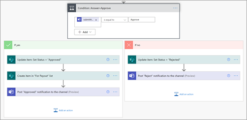

# <a name="step-3-use-power-automate-to-create-your-flow-to-process-your-contracts"></a><span data-ttu-id="cf046-104">Passaggio 3.</span><span class="sxs-lookup"><span data-stu-id="cf046-104">Step 3.</span></span> <span data-ttu-id="cf046-105">Usare Power Automate per creare il flusso per elaborare i contratti</span><span class="sxs-lookup"><span data-stu-id="cf046-105">Use Power Automate to create your flow to process your contracts</span></span>

<span data-ttu-id="cf046-106">Il canale di gestione dei contratti è stato creato e la raccolta documenti SharePoint allegato.</span><span class="sxs-lookup"><span data-stu-id="cf046-106">You've created your Contract Management channel and have attached your SharePoint document library.</span></span> <span data-ttu-id="cf046-107">Il passaggio successivo consiste nel creare un flusso Power Automate per elaborare i contratti che il modello SharePoint Syntex identifica e classifica.</span><span class="sxs-lookup"><span data-stu-id="cf046-107">The next step is to create a Power Automate flow to process your contracts that your SharePoint Syntex model identifies and classifies.</span></span> <span data-ttu-id="cf046-108">È possibile eseguire questo passaggio [creando un Power Automate flusso di lavoro nella raccolta SharePoint documenti.](https://support.microsoft.com/office/create-a-flow-for-a-list-or-library-in-sharepoint-or-onedrive-a9c3e03b-0654-46af-a254-20252e580d01)</span><span class="sxs-lookup"><span data-stu-id="cf046-108">You can do this step by [creating a Power Automate flow in your SharePoint document library](https://support.microsoft.com/office/create-a-flow-for-a-list-or-library-in-sharepoint-or-onedrive-a9c3e03b-0654-46af-a254-20252e580d01).</span></span>

<span data-ttu-id="cf046-109">Per la soluzione di gestione dei contratti, si desidera creare un flusso Power Automate per eseguire le azioni seguenti:</span><span class="sxs-lookup"><span data-stu-id="cf046-109">For your contracts management solution, you want to create a Power Automate flow to do the following actions:</span></span>

-  <span data-ttu-id="cf046-110">Dopo che un contratto è stato classificato dal modello SharePoint Syntex, modificare lo stato del contratto **in In revisione**.</span><span class="sxs-lookup"><span data-stu-id="cf046-110">After a contract has been classified by your SharePoint Syntex model, change the contract status to **In review**.</span></span>
- <span data-ttu-id="cf046-111">Il contratto viene quindi esaminato e approvato o rifiutato.</span><span class="sxs-lookup"><span data-stu-id="cf046-111">The contract is then reviewed and is either approved or rejected.</span></span>
- <span data-ttu-id="cf046-112">Per i contratti approvati, le informazioni sul contratto vengono pubblicate in una scheda per l'elaborazione dei pagamenti.</span><span class="sxs-lookup"><span data-stu-id="cf046-112">For approved contracts, the contract information is posted to a tab for payment processing.</span></span>
- <span data-ttu-id="cf046-113">Per i contratti rifiutati, al team viene notificata un'ulteriore analisi.</span><span class="sxs-lookup"><span data-stu-id="cf046-113">For rejected contracts, the team is notified for further analysis.</span></span> 

<span data-ttu-id="cf046-114">Il diagramma seguente mostra il Power Automate per la soluzione di gestione dei contratti.</span><span class="sxs-lookup"><span data-stu-id="cf046-114">The following diagram shows the Power Automate flow for the contract management solution.</span></span>


## <a name="prepare-your-contract-for-review"></a><span data-ttu-id="cf046-116">Preparare il contratto per la revisione</span><span class="sxs-lookup"><span data-stu-id="cf046-116">Prepare your contract for review</span></span>

<span data-ttu-id="cf046-117">Quando un contratto viene identificato e classificato dal modello SharePoint Syntex di comprensione dei documenti, il flusso di Power Automate modificherà innanzitutto lo stato **in In revisione**.</span><span class="sxs-lookup"><span data-stu-id="cf046-117">When a contract is identified and classified by your SharePoint Syntex document understanding model, the Power Automate flow will first change the status to **In review**.</span></span>


<span data-ttu-id="cf046-119">Dopo l'estrazione del file, modificare il valore di stato **in In revisione**.</span><span class="sxs-lookup"><span data-stu-id="cf046-119">After checking out the file, change the status value to **In review**.</span></span>


<span data-ttu-id="cf046-121">Il passaggio successivo consiste nel creare una scheda adattiva che indica che il contratto è in attesa di revisione e di pubblicarlo nel canale di gestione dei contratti.</span><span class="sxs-lookup"><span data-stu-id="cf046-121">The next step is to create an adaptive card stating that the contract is waiting for review and posting it to the Contract Management channel.</span></span>


<span data-ttu-id="cf046-124">Il codice seguente è il codice JSON usato per questo passaggio nel Power Automate flusso.</span><span class="sxs-lookup"><span data-stu-id="cf046-124">The following code is the JSON used for this step in the Power Automate flow.</span></span>

```JSON
{
"$schema": "http://adaptivecards.io/schemas/adaptive-card.json",
"type": "AdaptiveCard",
"version": "1.0",
"body": [
    {
    "type": "TextBlock",
    "text": "Contract approval request",
    "size": "large",
    "weight": "bolder",
     "wrap": true
    },
        {
            "type": "Container",
            "items": [
                {
                    "type": "FactSet",
                    "spacing": "Large",
                    "facts": [
                        {
                            "title": "Client",
                            "value": "@{triggerOutputs()?['body/Client']}"
                        },
                        {
                            "title": "Contractor",
                            "value": "@{triggerOutputs()?['body/Contractor']}"
                        },
                        {
                            "title": "Fee amount",
                            "value": "@{triggerOutputs()?['body/FeeAmount']}"
                        },
                        {
                            "title": "Date created",
                            "value": "@{triggerOutputs()?['body/Modified']} "
                        },
                        {
                            "title": "Link",
                            "value": "[@{triggerOutputs()?['body/{FilenameWithExtension}']}](@{triggerOutputs()?['body/{Link}']})"
                        }
                    ]
                }
            ]
         },
    {
    "type": "TextBlock",
    "text": "Comment:"
    },
        {
            "type": "Input.Text",
            "placeholder": "Enter comments",
            "id": "acComments"
        }
],
"actions": [
    {
    "type": "Action.Submit",
    "title": "Approve",
    "data": {
        "x": "Approve"
    }
    },
    {
    "type": "Action.Submit",
    "title": "Reject",
    "data": {
        "x": "Reject"
    }
    }
]
}
```


## <a name="conditional-context"></a><span data-ttu-id="cf046-125">Contesto condizionale</span><span class="sxs-lookup"><span data-stu-id="cf046-125">Conditional context</span></span>

<span data-ttu-id="cf046-126">Nel flusso è quindi necessario creare una condizione in cui il contratto verrà approvato [o](#if-the-contract-is-approved) [rifiutato.](#if-the-contract-is-rejected)</span><span class="sxs-lookup"><span data-stu-id="cf046-126">In your flow, next you need to create a condition in which your contract will be either  [approved](#if-the-contract-is-approved) or [rejected](#if-the-contract-is-rejected).</span></span>



## <a name="if-the-contract-is-approved"></a><span data-ttu-id="cf046-128">Se il contratto è approvato</span><span class="sxs-lookup"><span data-stu-id="cf046-128">If the contract is approved</span></span>

<span data-ttu-id="cf046-129">Quando un contratto è stato approvato, si verifica quanto segue:</span><span class="sxs-lookup"><span data-stu-id="cf046-129">When a contract has been approved, the following things occur:</span></span>

- <span data-ttu-id="cf046-130">Nella scheda **Contratti lo** stato nella scheda contratto verrà modificato in **Approvato.**</span><span class="sxs-lookup"><span data-stu-id="cf046-130">On the **Contracts** tab, the status in the contract card will change to **Approved**.</span></span>

   

- <span data-ttu-id="cf046-132">Nel flusso, lo stato viene modificato in **Approvato**.</span><span class="sxs-lookup"><span data-stu-id="cf046-132">In your flow, the status is changed to **Approved**.</span></span>

   

- <span data-ttu-id="cf046-134">In questa soluzione, i dati del  contratto verranno aggiunti alla scheda Per i pagamenti in modo che i pagamenti possano essere gestiti.</span><span class="sxs-lookup"><span data-stu-id="cf046-134">In this solution, the contract data will be added to the **For Payout** tab so that the payouts can be managed.</span></span> <span data-ttu-id="cf046-135">Questo processo può essere esteso per consentire al flusso di inviare i contratti per il pagamento da parte di un'applicazione finanziaria di terze parti (ad esempio, Dynamics CRM).</span><span class="sxs-lookup"><span data-stu-id="cf046-135">This process can be extended to allow the flow to submit the contracts for payment by a third-party financial application (for example, Dynamics CRM).</span></span>

   

- <span data-ttu-id="cf046-137">Nel flusso viene creato l'elemento seguente per spostare i contratti approvati nella **scheda Per i** pagamenti.</span><span class="sxs-lookup"><span data-stu-id="cf046-137">In the flow, you create the following item to move approved contracts to the **For Payout** tab.</span></span>

   

    <span data-ttu-id="cf046-139">Per ottenere le espressioni per le informazioni necessarie dalla scheda Teams, utilizzare i valori illustrati nella tabella seguente.</span><span class="sxs-lookup"><span data-stu-id="cf046-139">To get the expressions for the information needed from the Teams card, use the values shown in the following table.</span></span>
 
    |<span data-ttu-id="cf046-140">Nome</span><span class="sxs-lookup"><span data-stu-id="cf046-140">Name</span></span>     |<span data-ttu-id="cf046-141">Expression</span><span class="sxs-lookup"><span data-stu-id="cf046-141">Expression</span></span> |
    |---------|-----------|
    | <span data-ttu-id="cf046-142">Stato approvazione</span><span class="sxs-lookup"><span data-stu-id="cf046-142">Approval state</span></span>  | <span data-ttu-id="cf046-143">body('Post_an_Adaptive_Card_to_a_Teams_channel_and_wait_for_a_response')? ['submitActionId']</span><span class="sxs-lookup"><span data-stu-id="cf046-143">body('Post_an_Adaptive_Card_to_a_Teams_channel_and_wait_for_a_response')?['submitActionId']</span></span>         |
    | <span data-ttu-id="cf046-144">Approvato da</span><span class="sxs-lookup"><span data-stu-id="cf046-144">Approved by</span></span>     | <span data-ttu-id="cf046-145">body('Post_an_Adaptive_Card_to_a_Teams_channel_and_wait_for_a_response')? ['responder'] ['displayName']</span><span class="sxs-lookup"><span data-stu-id="cf046-145">body('Post_an_Adaptive_Card_to_a_Teams_channel_and_wait_for_a_response')?['responder']['displayName']</span></span>        |
    | <span data-ttu-id="cf046-146">Data approvazione</span><span class="sxs-lookup"><span data-stu-id="cf046-146">Approval date</span></span>     | <span data-ttu-id="cf046-147">body('Post_an_Adaptive_Card_to_a_Teams_channel_and_wait_for_a_response')? ['responseTime']</span><span class="sxs-lookup"><span data-stu-id="cf046-147">body('Post_an_Adaptive_Card_to_a_Teams_channel_and_wait_for_a_response')?['responseTime']</span></span>         |
    | <span data-ttu-id="cf046-148">Commento</span><span class="sxs-lookup"><span data-stu-id="cf046-148">Comment</span></span>     | <span data-ttu-id="cf046-149">body('Post_an_Adaptive_Card_to_a_Teams_channel_and_wait_for_a_response')? ['data'] ['acComments']</span><span class="sxs-lookup"><span data-stu-id="cf046-149">body('Post_an_Adaptive_Card_to_a_Teams_channel_and_wait_for_a_response')?['data']['acComments']</span></span>         |
    
    <span data-ttu-id="cf046-150">Nell'esempio seguente viene illustrato come utilizzare la casella della formula in Power Automate per scrivere un'espressione.</span><span class="sxs-lookup"><span data-stu-id="cf046-150">The following example shows how to use the formula box in Power Automate to write an expression.</span></span>

       

- <span data-ttu-id="cf046-152">Una scheda adattiva che indica che il contratto è stato approvato viene creata e inserita nel canale Gestione contratti.</span><span class="sxs-lookup"><span data-stu-id="cf046-152">An adaptive card stating that the contract has been approved is created and posted to the Contract Management channel.</span></span>

   

   


   <span data-ttu-id="cf046-155">Il codice seguente è il codice JSON usato per questo passaggio nel Power Automate flusso.</span><span class="sxs-lookup"><span data-stu-id="cf046-155">The following code is the JSON used for this step in the Power Automate flow.</span></span>

```JSON
{ 
    "type": "AdaptiveCard",
    "body": [
        {
            "type": "Container",
            "style": "emphasis",
            "items": [
                {
                    "type": "ColumnSet",
                    "columns": [
                        {
                            "type": "Column",
                            "items": [
                                {
                                    "type": "TextBlock",
                                    "size": "Large",
                                    "weight": "Bolder",
                                    "text": "CONTRACT APPROVED"
                                }
                            ],
                            "width": "stretch"
                        }
                    ]
                }
            ],
            "bleed": true
        },
        {
            "type": "Container",
            "items": [
                {
                    "type": "FactSet",
                    "spacing": "Large",
                    "facts": [
                        {
                            "title": "Client",
                            "value": "@{triggerOutputs()?['body/Client']}"
                        },
                        {
                            "title": "Contractor",
                            "value": "@{triggerOutputs()?['body/Contractor']}"
                        },
                        {
                            "title": "Fee amount",
                            "value": "@{triggerOutputs()?['body/FeeAmount']}"
                        },
                        {
                            "title": "Approval by",
                            "value": "@{body('Post_an_Adaptive_Card_to_a_Teams_channel_and_wait_for_a_response')?['responder']['displayName']}"
                        },
                        {
                            "title": "Approved date",
                            "value": "@{body('Post_an_Adaptive_Card_to_a_Teams_channel_and_wait_for_a_response')?['responseTime']}"
                        },
                        {
                            "title": "Approval comment",
                            "value": "@{body('Post_an_Adaptive_Card_to_a_Teams_channel_and_wait_for_a_response')?['data']['acComments']}"
                        },
                        {
                            "title": " ",
                            "value": " "
                        },
                        {
                            "title": "Status",
                            "value": "Ready for payout"
                        }
                    ]
                }
            ]
        }
    ],
    "$schema": "http://adaptivecards.io/schemas/adaptive-card.json",
    "version": "1.2",
    "fallbackText": "This card requires Adaptive Cards v1.2 support to be rendered properly."
}
```

## <a name="if-the-contract-is-rejected"></a><span data-ttu-id="cf046-156">Se il contratto viene rifiutato</span><span class="sxs-lookup"><span data-stu-id="cf046-156">If the contract is rejected</span></span>

<span data-ttu-id="cf046-157">Quando un contratto è stato rifiutato, si verifica quanto segue:</span><span class="sxs-lookup"><span data-stu-id="cf046-157">When a contract has been rejected, the following things occur:</span></span>

- <span data-ttu-id="cf046-158">Nella scheda **Contratti lo** stato nella scheda contratto verrà modificato in **Rifiutato**.</span><span class="sxs-lookup"><span data-stu-id="cf046-158">On the **Contracts** tab, the status in the contract card will change to **Rejected**.</span></span>

   

- <span data-ttu-id="cf046-160">Nel flusso, si estrae il file di contratto, si modifica lo stato in **Rifiutato** e quindi si archivia di nuovo il file.</span><span class="sxs-lookup"><span data-stu-id="cf046-160">In your flow, you check out the contract file, change the status to **Rejected**, and then check the file back in.</span></span>

   

- <span data-ttu-id="cf046-162">Nel flusso viene creata una scheda adattiva che indica che il contratto è stato rifiutato.</span><span class="sxs-lookup"><span data-stu-id="cf046-162">In your flow, you create an adaptive card stating that the contract has been rejected.</span></span>

   

<span data-ttu-id="cf046-164">Il codice seguente è il codice JSON usato per questo passaggio nel Power Automate flusso.</span><span class="sxs-lookup"><span data-stu-id="cf046-164">The following code is the JSON used for this step in the Power Automate flow.</span></span>

```JSON
{ 
    "type": "AdaptiveCard",
    "body": [
        {
            "type": "Container",
            "style": "attention",
            "items": [
                {
                    "type": "ColumnSet",
                    "columns": [
                        {
                            "type": "Column",
                            "items": [
                                {
                                    "type": "TextBlock",
                                    "size": "Large",
                                    "weight": "Bolder",
                                    "text": "CONTRACT REJECTED"
                                }
                            ],
                            "width": "stretch"
                        }
                    ]
                }
            ],
            "bleed": true
        },
        {
            "type": "Container",
            "items": [
                {
                    "type": "FactSet",
                    "spacing": "Large",
                    "facts": [
                        {
                            "title": "Client",
                            "value": "@{triggerOutputs()?['body/Client']}"
                        },
                        {
                            "title": "Contractor",
                            "value": "@{triggerOutputs()?['body/Contractor']}"
                        },
                        {
                            "title": "Fee amount",
                            "value": "@{triggerOutputs()?['body/FeeAmount']}"
                        },
                        {
                            "title": "Rejected by",
                            "value": "@{body('Post_an_Adaptive_Card_to_a_Teams_channel_and_wait_for_a_response')?['responder']['displayName']}"
                        },
                        {
                            "title": "Rejected date",
                            "value": "@{body('Post_an_Adaptive_Card_to_a_Teams_channel_and_wait_for_a_response')?['responseTime']}"
                        },
                        {
                            "title": "Comment",
                            "value": "@{body('Post_an_Adaptive_Card_to_a_Teams_channel_and_wait_for_a_response')?['data']['acComments']}"
                        },
                        {
                            "title": " ",
                            "value": " "
                        },
                        {
                            "title": "Status",
                            "value": "Needs review"
                        }
                    ]
                }
            ]
        }
    ],
    "$schema": "http://adaptivecards.io/schemas/adaptive-card.json",
    "version": "1.2",
    "fallbackText": "This card requires Adaptive Cards v1.2 support to be rendered properly."
}
```

- <span data-ttu-id="cf046-165">La scheda viene inserita nel canale Gestione contratti.</span><span class="sxs-lookup"><span data-stu-id="cf046-165">The card is posted in the Contract Management channel.</span></span>

   