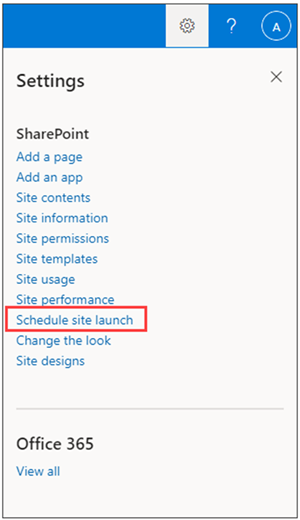

# <a name="launch-your-portal-using-the-sharepoint-portal-launch-scheduler"></a>Avviare il portale usando l'utilità di SharePoint di avvio del portale

Un portale è un sito di comunicazione SharePoint sulla rete Intranet con traffico elevato, un sito che ha da 10.000 a oltre 100.000 visitatori nel corso di diverse settimane. Usa l'utilità di pianificazione di avvio del portale per avviare il portale per garantire agli utenti un'esperienza di visualizzazione ottimale quando accedono al nuovo SharePoint portale.
<br>
<br>
L'utilità di pianificazione per l'avvio del portale è progettata per consentire di seguire un approccio di implementazione in più fasi, tramite l'invio in batch dei visualizzatori e la gestione dei reindirizzamenti DEGLI URL per il nuovo portale. Durante l'avvio di ogni ondata, è possibile raccogliere il feedback degli utenti, monitorare le prestazioni del portale e sospendere l'avvio per risolvere i problemi prima di procedere con l'onda successiva. Altre informazioni su come pianificare [l'avvio di un portale in SharePoint](https://docs.microsoft.com/microsoft-365/Enterprise/Planportallaunchroll-out?view=o365-worldwide). 

**Esistono due tipi di reindirizzamenti:**

- **Bidirezionale:** avvia un nuovo portale SharePoint moderno per sostituire un portale SharePoint classico o moderno esistente
- **Reindirizza a una pagina temporanea:** avvia un nuovo portale SharePoint moderno senza un portale SharePoint esistente

Le autorizzazioni del sito devono essere impostate separatamente dalle ondate durante l'avvio. Ad esempio, se si rilascia un portale a livello di organizzazione, è possibile impostare le autorizzazioni su "Tutti tranne gli utenti esterni", quindi separare gli utenti in gruppi di sicurezza. L'aggiunta di un gruppo di sicurezza a un'onda non consente a tale gruppo di sicurezza di accedere al sito. 


> [!NOTE]
> - Questa funzionalità sarà accessibile dal pannello **Impostazioni** nella home page dei siti di comunicazione di SharePoint per i clienti con rilascio mirato a partire da maggio 2021 e sarà disponibile per tutti i clienti entro luglio 2021
> - La versione powershell di questo strumento è disponibile oggi
> - Questa funzionalità può essere utilizzata solo nei siti di comunicazione SharePoint moderni
> - È necessario disporre delle autorizzazioni di proprietario del sito per personalizzare e pianificare l'avvio di un portale
> - Gli avvii devono essere pianificati con almeno sette giorni di anticipo e ogni onda può durare da uno a sette giorni
> - Il numero di onde richieste viene determinato automaticamente dal numero previsto di utenti 
> - Prima di pianificare l'avvio di un portale, è necessario eseguire lo strumento Diagnostica pagine per SharePoint per verificare che la home page del sito sia integra [](https://aka.ms/perftool)
> - Al termine dell'avvio, tutti gli utenti con autorizzazioni per il sito potranno accedere al nuovo sito
> - Se l'organizzazione usa [Viva Connections,](https://docs.microsoft.com/SharePoint/viva-connections)gli utenti potrebbero visualizzare l'icona dell'organizzazione nella barra dell'app Microsoft Teams, tuttavia, quando l'icona è selezionata, gli utenti non potranno accedere al portale fino all'avvio dell'ondata
> - Questa funzionalità non è disponibile per Office 365 Germania, Office 365 gestito da 21Vianet (Cina) o per Microsoft 365 piani del governo degli Stati Uniti

### <a name="understand-the-differences-between-portal-launch-scheduler-options"></a>Comprendere le differenze tra le opzioni dell'utilità di pianificazione di avvio del portale:

In precedenza, gli avvii del portale potevano essere pianificati solo SharePoint PowerShell. A questo punto, sono disponibili due opzioni che consentono di pianificare e gestire l'avvio del portale. Informazioni sulle differenze principali tra entrambi gli strumenti:

**SharePoint Versione powershell:**

- Le credenziali di amministratore sono necessarie per [usare SharePoint PowerShell](https://docs.microsoft.com/powershell/sharepoint/sharepoint-online/introduction-sharepoint-online-management-shell?view=sharepoint-ps) 
- Requisito minimo di un'onda 
- Pianificare l'avvio in base al fuso orario UTC (Coordinated Universal Time)

**Versione nel prodotto:**

- Le credenziali del proprietario del sito sono necessarie 
- Requisito minimo di due onde
- Pianificare l'avvio in base al fuso orario locale del portale, come indicato nelle impostazioni internazionali


## <a name="get-started-using-the-portal-launch-scheduler"></a>Introduzione all'utilità di pianificazione per l'avvio del portale

1.  Prima di utilizzare lo strumento Utilità di pianificazione di avvio  [portale,](https://support.microsoft.com/office/share-a-site-958771a8-d041-4eb8-b51c-afea2eae3658) aggiungere tutti gli utenti che dovranno accedere al sito tramite le autorizzazioni sito come proprietario del sito, membro del sito o visitatore.

2.  Quindi, iniziare a pianificare l'avvio del portale accedendo all'utilità di pianificazione di avvio del portale in uno dei due modi seguenti:

    **Opzione 1:** le prime volte che si modificano e ripubblicano le modifiche alla home page o fino alla home page versione 3.0, verrà richiesto di utilizzare lo strumento Utilità di pianificazione di avvio portale. Selezionare **Pianifica avvio** per procedere con la pianificazione. Oppure seleziona **Ripubblica** per ripubblicare le modifiche alla pagina senza pianificare l'avvio.
    
    
    
    **Opzione 2:** in qualsiasi momento, è possibile passare alla home page del sito  di comunicazione di SharePoint, selezionare **Impostazioni** e quindi Pianificare l'avvio del sito per pianificare l'avvio del portale.
    
    

3.  Quindi, confermare il punteggio di integrità del portale e apportare miglioramenti al portale, se necessario, usando lo strumento Diagnostica pagine per [SharePoint](https://aka.ms/perftool) fino a quando il portale non riceve un **punteggio Integro.** Selezionare quindi **Avanti**.

    
       
    > [!NOTE] 
    > Il nome e la descrizione del sito non possono essere modificati dall'utilità di  pianificazione di avvio del portale e possono essere modificati selezionando **Impostazioni** e quindi Informazioni sito dalla home page.
 
4.  Selezionare **il numero di utenti previsti** nell'elenco a discesa. Questa figura rappresenta il numero di utenti che probabilmente dovranno accedere al sito. L'utilità di pianificazione di avvio del portale determinerà automaticamente il numero ideale di onde a seconda degli utenti previsti come questo:
    
    - Meno di 10.000 utenti: due onde
    - Da 10.000 a 30.000 utenti: tre onde 
    - Da 30.000 a 100.000 utenti: cinque onde
    - Più di 100.000 utenti: cinque onde e contatta il team dell'account Microsoft

5.  Quindi, determinare **il tipo di reindirizzamento** necessario:

    Opzione 1: Inviare utenti a una pagina **di SharePoint esistente (bidirezionale):** utilizzare questa opzione quando si avvia un nuovo portale SharePoint moderno per sostituire un portale SharePoint esistente. Gli utenti in ondate attive verranno reindirizzati al nuovo sito indipendentemente dal fatto che si snavigare verso il sito vecchio o nuovo. Gli utenti in un'ondata non avviata che tentano di accedere al nuovo sito verranno reindirizzati al sito precedente fino all'avvio dell'ondata.
    
    > [!NOTE] 
    > Quando si utilizza l'opzione bidirezionale, la persona che pianifica l'avvio deve disporre anche delle autorizzazioni di proprietario del sito per l'SharePoint portale.
       
    **Opzione 2:** Inviare gli utenti a una pagina temporanea rigenerata automaticamente (reindirizzamento temporaneo delle pagine) - Utilizzare un reindirizzamento temporaneo della pagina quando non esiste un portale SharePoint esistente. Gli utenti vengono indirizzati a un nuovo portale SharePoint moderno e se un utente è in un'ondata che non è stata avviata, verrà reindirizzato a una pagina temporanea.
    
    **Opzione 3: Inviare gli** utenti a una pagina esterna: fornire un URL esterno a un'esperienza di pagina di destinazione temporanea fino all'avvio dell'ondata dell'utente.
    
6.  Suddividere il pubblico in onde. Aggiungere fino a 20 gruppi di sicurezza per ogni ondata. I dettagli dell'onda possono essere modificati fino al lancio di ogni onda. Ogni onda può durare almeno un giorno (24 ore) e al massimo sette giorni. Ciò consente SharePoint e l'ambiente tecnico l'opportunità di accumulare e ridimensionare il volume di utenti del sito. Quando si pianifica un avvio tramite l'interfaccia utente, il fuso orario si basa sulle impostazioni internazionali del sito. 

    >[!NOTE] 
    > - L'utilità di pianificazione per l'avvio del portale avrà automaticamente un minimo di 2 onde. Tuttavia, la versione powershell di questo strumento consentirà 1 onda.
    >  - Microsoft 365 gruppi non sono supportati da questa versione dell'utilità di pianificazione di avvio del portale.

7. Determinare chi deve visualizzare immediatamente il sito e immettere le informazioni nel **campo Utenti esenti da ondate.** Questi utenti sono esclusi dalle ondate e non verranno reindirizzati prima, durante o dopo l'avvio.

8.  Confermare i dettagli di avvio del portale e selezionare **Pianifica**. Dopo la pianificazione dell'avvio, tutte le modifiche apportate alla home page del portale di SharePoint dovranno ricevere un risultato di diagnostica integro prima della ripresa dell'avvio del portale.


## <a name="make-changes-to-a-scheduled-portal-launch"></a>Apportare modifiche a un avvio pianificato del portale

I dettagli di avvio possono essere modificati per ogni ondata fino alla data di avvio dell'onda. 

1.  Per modificare i dettagli di avvio del portale, passare a **Impostazioni** e selezionare **Pianifica avvio sito**.
2.  Selezionare quindi **Modifica**.
3.  Dopo aver apportato le modifiche, selezionare **Aggiorna**.


## <a name="delete-a-scheduled-portal-launch"></a>Eliminare un avvio pianificato del portale

Gli avvii pianificati tramite lo strumento Utilità di pianificazione di avvio portale possono essere annullati o eliminati in qualsiasi momento anche se alcune onde sono già state avviate.

1.  Per annullare l'avvio del portale, passare a **Impostazioni** **e Pianificare l'avvio del sito.**

2.  Selezionare quindi **Elimina** e quindi, quando viene visualizzato il messaggio seguente, selezionare **di nuovo Elimina.**

    


## <a name="use-the-powershell-portal-launch-scheduler"></a>Usare l'utilità di pianificazione di avvio del portale di PowerShell

Lo strumento SharePoint utilità di pianificazione di avvio del portale di SharePoint era originariamente disponibile solo tramite [PowerShell](https://docs.microsoft.com/powershell/sharepoint/sharepoint-online/introduction-sharepoint-online-management-shell?view=sharepoint-ps) e continuerà SharePoint essere supportato tramite PowerShell per i clienti che preferiscono questo metodo. Le stesse note all'inizio di questo articolo si applicano a entrambe le versioni dell'utilità di pianificazione di avvio del portale. 

>[!NOTE]
> È necessario disporre delle autorizzazioni di amministratore per SharePoint PowerShell.
> I dettagli di avvio del portale per gli avvii creati in PowerShell verranno visualizzati e possono essere gestiti nel nuovo strumento utilità di pianificazione di avvio del portale in SharePoint.


### <a name="app-setup-and-connecting-to-sharepoint-online"></a>Configurazione dell'app e connessione a SharePoint Online
1. [Scaricare l'ultima versione di SharePoint Online Management Shell](https://go.microsoft.com/fwlink/p/?LinkId=255251).

    > [!NOTE]
    > Se hai installato una versione precedente di SharePoint Online Management Shell, vai su Installazione applicazioni e disinstallare SharePoint Online Management Shell.<br>Nella pagina Download Center selezionare la lingua e fare clic sul pulsante Scarica. Ti verrà chiesto di scegliere tra il download di un file x64 e x86 con estensione msi. Scaricare il file x64 se stai eseguendo la versione a 64 bit di Windows e il file x86 se stai eseguendo quella a 32 bit. Se non conosci quale versione stai eseguendo, vedere[Quale versione del sistema operativo Windows sto eseguendo?](https://support.microsoft.com/help/13443/windows-which-operating-system). Dopo aver scaricato il file, eseguirlo e seguire i passaggi della configurazione guidata.

2. Connettiti a SharePoint come [amministratore globale o amministratore di SharePoint](/sharepoint/sharepoint-admin-role) in Microsoft 365. Per informazioni in merito, vedere [Guida introduttiva a SharePoint Online Management Shell](/powershell/sharepoint/sharepoint-online/connect-sharepoint-online).


### <a name="view-any-existing-portal-launch-setups"></a>Visualizzare eventuali configurazioni di avvio del portale esistenti

Per verificare se sono presenti configurazioni di avvio del portale esistenti:

   ```PowerShell
   Get-SPOPortalLaunchWaves -LaunchSiteUrl <object> -DisplayFormat <object>
   ```

### <a name="schedule-a-portal-launch-on-the-site"></a>Pianificare un avvio del portale nel sito

Il numero di onde necessarie dipende dalle dimensioni di avvio previste. 
- Meno di 10.000 utenti: un'onda
- Da 10.000 a 30.000 utenti: tre onde 
- Da 30.000 a 100.000 utenti: cinque onde
- Più di 100.000 utenti: cinque onde e contatta il team dell'account Microsoft

#### <a name="steps-for-bidirectional-redirection"></a>Passaggi per il reindirizzamento bidirezionale

Il reindirizzamento bidirezionale prevede l'avvio di un nuovo portale SharePoint Online moderno per sostituire un portale SharePoint classico o moderno esistente. Gli utenti in ondate attive verranno reindirizzati al nuovo sito indipendentemente dal fatto che si snavigare verso il sito vecchio o nuovo. Gli utenti in un'ondata non avviata che tentano di accedere al nuovo sito verranno reindirizzati al sito precedente fino all'avvio dell'ondata. 

Supportiamo solo il reindirizzamento tra la home page predefinita nel vecchio sito e la home page predefinita nel nuovo sito. Se si dispone di amministratori o proprietari che devono accedere ai siti vecchi e nuovi senza essere reindirizzati, assicurarsi che siano elencati utilizzando il `WaveOverrideUsers` parametro .

Per eseguire la migrazione degli utenti da un sito SharePoint esistente a un nuovo SharePoint in fasi:

1. Eseguire il comando seguente per designare le ondate di avvio del portale.
   
   ```PowerShell
   New-SPOPortalLaunchWaves -LaunchSiteUrl <object> -RedirectionType Bidirectional -RedirectUrl <string> -ExpectedNumberOfUsers <object> -WaveOverrideUsers <object> -Waves <object>
   ```

   Esempio:

   ```PowerShell
   New-SPOPortalLaunchWaves -LaunchSiteUrl "https://contoso.sharepoint.com/teams/newsite" -RedirectionType Bidirectional -RedirectUrl "https://contoso.sharepoint.com/teams/oldsite" -ExpectedNumberOfUsers 10kTo30kUsers -WaveOverrideUsers "admin@contoso.com" -Waves ' 
   [{Name:"Wave 1", Groups:["Viewers 1"], LaunchDateUtc:"2020/10/14"}, 
   {Name:"Wave 2", Groups:["Viewers 2"], LaunchDateUtc:"2020/10/15"}, 
   {Name:"Wave 3", Groups:["Viewers 3"], LaunchDateUtc:"2020/10/16"}]'
   ```

2. Completare la convalida. Il reindirizzamento può richiedere da 5 a 10 minuti per completare la configurazione nel servizio. 

#### <a name="steps-for-redirection-to-temporary-page"></a>Passaggi per il reindirizzamento alla pagina temporanea

Il reindirizzamento temporaneo delle pagine deve essere utilizzato quando non SharePoint esistente. Gli utenti vengono indirizzati a un nuovo SharePoint online moderno in modo a fasi. Se un utente è in un'ondata che non è stata avviata, verrà reindirizzato a una pagina temporanea (qualsiasi URL). 

1. Eseguire il comando seguente per designare le ondate di avvio del portale.
   
   ```PowerShell
   New-SPOPortalLaunchWaves -LaunchSiteUrl <object> -RedirectionType ToTemporaryPage -RedirectUrl <string> -ExpectedNumberOfUsers <object> -WaveOverrideUsers <object> -Waves <object>
   ```

   Esempio:

   ```PowerShell
   New-SPOPortalLaunchWaves -LaunchSiteUrl "https://contoso.sharepoint.com/teams/newsite" -RedirectionType ToTemporaryPage -RedirectUrl "https://portal.contoso.com/UnderConstruction.aspx" -ExpectedNumberOfUsers 10kTo30kUsers -WaveOverrideUsers "admin@contoso.com" -Waves ' 
   [{Name:"Wave 1", Groups:["Viewers 1"], LaunchDateUtc:"2020/10/14"}, 
   {Name:"Wave 2", Groups:["Viewers 2"], LaunchDateUtc:"2020/10/15"}, 
   {Name:"Wave 3", Groups:["Viewers 3"], LaunchDateUtc:"2020/10/16"}]'
   ```

2. Completare la convalida. Il reindirizzamento può richiedere da 5 a 10 minuti per completare la configurazione nel servizio. 

### <a name="pause-or-restart-a-portal-launch-on-the-site"></a>Sospendere o riavviare l'avvio di un portale nel sito

1. Per sospendere l'avvio di un portale in corso e impedire temporaneamente che si verifichino imminenti progressioni delle onde, eseguire il comando seguente:

   ```PowerShell
   Set-SPOPortalLaunchWaves -Status Pause - LaunchSiteUrl <object>
   ```

2. Verificare che tutti gli utenti siano reindirizzati al sito precedente. 

3. Per riavviare un avvio del portale sospeso, eseguire il comando seguente:

   ```PowerShell
   Set-SPOPortalLaunchWaves -Status Restart - LaunchSiteUrl <object>
   ```
   
4. Verificare che il reindirizzamento sia stato ripristinato. 

### <a name="delete-a-portal-launch-on-the-site"></a>Eliminare un avvio del portale nel sito

1. Eseguire il comando seguente per eliminare un avvio del portale pianificato o in corso per un sito.

   ```PowerShell
   Remove-SPOPortalLaunchWaves -LaunchSiteUrl <object>
   ```

2. Verificare che non si verifica alcun reindirizzamento per tutti gli utenti.

## <a name="learn-more"></a>Altre informazioni

[Pianificazione del piano di implementazione dell'avvio del portale in SharePoint Online](./planportallaunchroll-out.md)

[Pianificare il sito di comunicazione](https://support.microsoft.com/office/plan-your-sharepoint-communication-site-35d9adfe-d5cc-462f-a63a-bae7f2529182)
